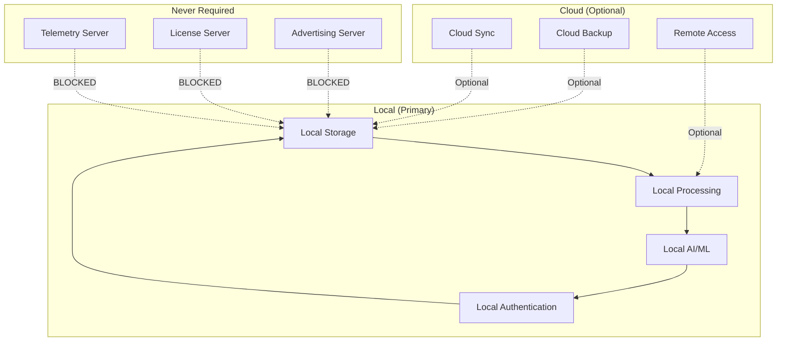
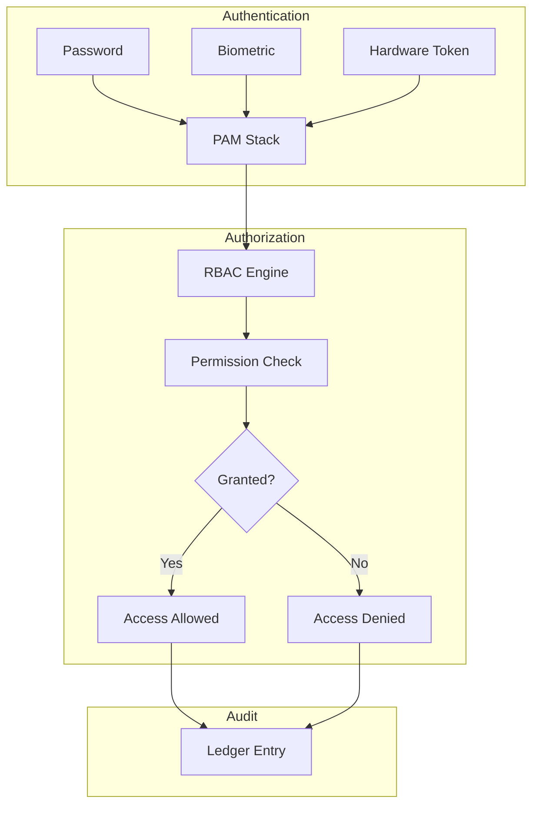
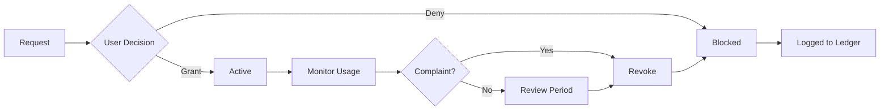

# Data Sovereignty and User Control: Principles and Implementation in the 01s Sovereign OS

## Abstract

Data sovereignty � the principle that individuals and organizations should have control over their data � is a core commitment of the 01s Sovereign OS. This paper examines how data sovereignty is implemented at the OS level through architectural decisions, cryptographic guarantees, and user-facing controls.

## 1. Introduction

In most computing platforms, users do not truly own their data � the platform does. Microsoft collects telemetry, Apple indexes content for Spotlight, Google scans for advertising. 01s Sovereign was designed to reverse this relationship: users are the sovereign owners of their data, with full control over its storage, processing, sharing, and deletion.

## 2. Principles of Data Sovereignty

### Ownership

| Principle | Implementation | Verification |
|---|---|---|
| No data ownership claims | 01s does not claim any rights to user data | Source code inspection |
| No data monetization | Zero telemetry, no advertising, no data sales | Network monitoring |
| No surveillance | No content scanning, no usage tracking | Code audit |
| No lock-in | All data in open, portable formats | Export tools |

### Control

| Control | Mechanism | User Action |
|---|---|---|
| Access control | RBAC + permissions | Configure roles |
| Data sharing | Explicit consent per application | Grant/revoke permissions |
| Retention | Configurable retention policies | Set retention period |
| Deletion | Secure erasure with cryptographic proof | `01s-ledger purge` |
| Export | All formats, one-click export | `01s-ledger export` |

### Portability

| Data Type | Format | Tool |
|---|---|---|
| Audit ledger | JSON, Binary | `01s-ledger export` |
| User documents | Standard (ODF, PDF, etc.) | File copy |
| Configuration | INI/JSON/TOML | Manual copy |
| Encryption keys | PKCS#8, OpenPGP | Key export tool |
| Application data | Application-specific | Per application |

## 3. Local-First Architecture

### Architecture Principles



### Benefits of Local-First

| Benefit | Description | User Impact |
|---|---|---|
| Data control | Data never leaves your hardware | Full sovereignty |
| Offline operation | Everything works without internet | No dependency |
| Privacy | No third-party access to your data | Complete privacy |
| Performance | No network latency for operations | Faster response |
| Cost | No cloud storage/bandwidth costs | Zero recurring data costs |
| Security | Reduced attack surface | Fewer vulnerability points |

### When Cloud Features Are Optional

| Feature | Local Capability | Cloud Enhancement |
|---|---|---|
| File storage | Full local storage | Off-site backup, sync |
| AI processing | Local inference | Model updates |
| Authentication | Local passwords/keys | SSO integration |
| Compliance | Local compliance reports | Centralized dashboard |
| Updates | Local package management | Enterprise repo access |

## 4. Encryption

### At Rest

| Layer | Technology | Key Management |
|---|---|---|
| Full disk | LUKS2 + AES-256-XTS | TPM-sealed or passphrase |
| Home directory | fscrypt | Per-user encryption key |
| File-level | GPG/OpenSSL | User-managed keys |
| Ledger | Implicit (runs on encrypted FS) | Inherited from FDE |
| Swap | Encrypted swap partition | Random key per boot |
| Hibernation | Encrypted hibernation image | TPM-sealed |

### In Transit

| Protocol | Technology | Key Exchange |
|---|---|---|
| Web traffic | TLS 1.3 | X25519 or ECDHE |
| VPN | WireGuard | Curve25519 |
| Messaging | Signal Protocol | X3DH + Double Ratchet |
| Email | OpenPGP/SMIME | RSA/ECDH |
| SSH | SSH-2 | Curve25519 |
| DNS | DNS over TLS/HTTPS | Standard TLS |

### Key Management

| Key Type | Generation | Storage | Rotation | Recovery |
|---|---|---|---|---|
| LUKS volume | cryptsetup | TPM seal + passphrase | Re-encrypt | Recovery code |
| TPM SRK | TPM hardware | TPM NVRAM | Never | Cannot extract |
| User GPG | gpg --gen-key | Encrypted file | User-managed | Revocation certificate |
| Ledger signing | 01s-keygen | TPM-sealed file | Quarterly | Split-key escrow |
| TLS | certbot/acme | Encrypted file | 90 days | CA reissue |

## 5. Access Control

### Authentication

| Method | Factor | Configuration |
|---|---|---|
| Password | Knowledge | /etc/shadow |
| Biometric | Inherence | fprintd, howdy |
| Hardware token | Possession | YubiKey, Nitrokey |
| TPM | Possession | tpm2-tools |
| MFA | Multiple | pam_u2f, pam_duo |

### Authorization



### Application Permissions

| Permission | Default | Description |
|---|---|---|
| File access | Per-user scope | Access to home directory |
| Network | User-initiated | Outbound connections |
| Camera | Ask | Camera hardware access |
| Microphone | Ask | Microphone hardware access |
| Location | Blocked | GPS/WiFi location |
| Notifications | Enabled | Desktop notifications |
| Removable media | Ask | USB, SD card access |

## 6. Consent and Transparency

### Informed Consent

| Data Use | Consent Required | Withdrawable |
|---|---|---|
| System logging (ledger) | No (system essential) | Partial (retention config) |
| Application data access | Yes | Yes |
| Network services | Yes | Yes |
| Updates | Yes (configurable) | Yes |
| Debug information | Yes | Yes |

### Transparency Reports

| Report | Frequency | Content |
|---|---|---|
| Data access log | Real-time | All access events |
| Permission audit | Monthly | Application permissions |
| Network activity | Real-time | All connections |
| System integrity | Daily | Ledger verification |
| Data export | On request | Complete user data |

## 7. Data Portability

### Export Tools

```bash
# Export complete audit ledger
01s-ledger export --format json --output ./export/ledger.json

# Export user data
01s-export --all --output ./export/user_data/

# Export specific data types
01s-export --type documents --format pdf --output ./export/docs/

# Export configuration
01s-export --type config --format toml --output ./export/config/

# Cryptographic proof of export
01s-ledger sign --export ./export/ --output ./export/proof.json
```

### Import Tools

```bash
# Import from Windows
01s-migrate --from windows --source /mnt/windows/

# Import from macOS
01s-migrate --from macos --source /mnt/macos/

# Import from Linux
01s-migrate --from linux --source /home/olduser/

# Verify imported data integrity
01s-verify-import --source ./imported/ 
```

## 8. Compliance Mapping

| Regulation | Sovereignty Requirement | 01s Implementation |
|---|---|---|
| GDPR Art. 20 | Data portability right | Full export in standard formats |
| GDPR Art. 17 | Right to erasure | Cryptographic purge with proof |
| CCPA 1798.100 | Right to know | Complete data inventory |
| CCPA 1798.105 | Right to delete | Secure deletion |
| HIPAA 164.502 | Individual access | Data access tools |
| LGPD Art. 18 | Data subject rights | Ledger-based controls |
| PIPEDA Sch. 1 | Consent | User-controlled sharing |

## 9. Deletion Guarantees

### Data Deletion Methods

| Method | Use Case | Proof |
|---|---|---|
| File deletion | Standard file removal | None (recoverable) |
| Secure deletion | Sensitive data | Overwritten blocks |
| Cryptographic deletion | Encrypted data | Key destruction renders data unrecoverable |
| Ledger purge | GDPR deletion request | Cryptographic purge proof |
| Physical destruction | End-of-life | Hardware destruction |

### Ledger Purge with Cryptographic Proof

```bash
# Purge entries for specific user
01s-ledger purge --user user@example.com

# Purge entries by date range
01s-ledger purge --before 2025-01-01

# Generate deletion proof
01s-ledger verify
# Status: PASSED (entries before 2025-01-01 purged, chain intact)
```

## 10. Conclusion

Data sovereignty is implemented in the 01s Sovereign technology stack through local-first design, encryption at rest and in transit, fine-grained access controls, transparency mechanisms, and comprehensive data portability tools. Users retain complete control over their data throughout its lifecycle � from creation through storage, processing, sharing, and deletion.

## Detailed User Control Interfaces

### Ledger Control Commands

```bash
# View ledger contents
01s-ledger tail -n 50                    # Last 50 entries
01s-ledger query --type file_access      # Specific entry types
01s-ledger query --actor "user123"       # By actor
01s-ledger query --from "2026-01-01" --to "2026-06-01"  # By date range

# Manage ledger
01s-ledger purge --before "2025-01-01"   # Delete old entries
01s-ledger purge --user "olduser@example.com"  # Delete by user
01s-ledger verify                         # Verify integrity

# Export data
01s-ledger export --format json          # Full export
01s-ledger export --format csv --type auth  # Selective export
01s-ledger sign --key backup.key         # State proof

# Verify deletion proof
01s-ledger verify --after-purge          # Confirm purge integrity
```

### Data Export Examples

```bash
# Export complete user data
01s-export --all --output /home/user/export/

# Export structure:
# /home/user/export/
# +-- documents/           # All user documents
# +-- config/              # Application configuration
# +-- ledger/              # .aioss ledger data
# +-- keys/                # Encryption keys (encrypted)
# +-- manifest.json        # Export manifest with hashes
```

## Consent Management Framework

### Consent Types

| Consent Type | Description | Duration |
|---|---|---|
| System operation | Required for OS function | Indefinite |
| Application access | Per-app permission grant | Until revoked |
| Data processing | Specific processing purpose | Purpose-limited |
| Network services | External connectivity | Per-session |
| Analytics (opt-in) | Usage statistics | Until revoked |

### Consent Lifecycle



### Consent Audit Trail

```json
{
  "type": "consent",
  "timestamp": "2026-06-19T10:30:00Z",
  "user": "alice",
  "application": "cloud_sync_app",
  "permission": "network_access",
  "decision": "grant",
  "duration": "session",
  "purpose": "Sync documents to personal Nextcloud",
  "evidence": "User clicked 'Allow' on consent dialog",
  "revocable": true
}
```

## Data Portability Standards

### Supported Export Formats

| Data Type | Format | Standard | Verifiable |
|---|---|---|---|
| Documents | ODF (.odt, .ods, .odp) | ISO/IEC 26300 | SHA3-256 |
| Documents | PDF/A | ISO 19005 | SHA3-256 |
| Images | JPEG, PNG, WebP | ISO/IEC standards | SHA3-256 |
| Video | MKV, WebM | Open standards | SHA3-256 |
| Audio | FLAC, Opus | Open codecs | SHA3-256 |
| Configuration | INI, TOML, JSON | De facto standards | SHA3-256 |
| Ledger data | JSON | ECMA-404 | Self-verifying |
| Metadata | JSON | ECMA-404 | SHA3-256 |

### Import Tools

```bash
# Import from Windows
01s-migrate --from windows --source /mnt/windows/User/
# Imports: documents, bookmarks, contacts, email, settings

# Import from macOS
01s-migrate --from macos --source /mnt/macos/Users/alice/
# Imports: documents, contacts, calendars, keychain (GPG)

# Import from Linux
01s-migrate --from linux --source /home/alice/
# Imports: all data, most configuration, SSH keys

# Verify imported data
01s-verify-import --source /home/alice/imported/ --manifest import_manifest.json
```

## Third-Party Data Processing

### Zero Third-Party Processing

01s Sovereign does not process user data through third-party services:

| Processing Type | 01s Approach | Typical OS |
|---|---|---|
| OS updates | Direct from repos | Via CDN + telemetry |
| Search indexing | Local only | Via cloud services |
| Voice assistant | None (not included) | Via cloud AI |
| Crash reporting | None (not included) | Via vendor servers |
| Usage analytics | None (not included) | Via vendor + partners |
| Content moderation | None (local-only) | Via AI services |
| Cloud sync | User-configured, optional | Default enabled |

### User-Configured Third-Party Services

If a user opts to connect to third-party services:

| Service | Data Shared | User Control |
|---|---|---|
| Cloud sync provider | Sync-configured files | Per-file choose |
| Email provider | Email content | Per-account |
| Calendar provider | Calendar data | Per-calendar |
| Contacts provider | Contact data | Per-contact |
| AI service | Selected data | Per-request |

## Data Retention Policies

### Default Retention

| Data Type | Default Retention | Maximum Retention | Minimum Retention |
|---|---|---|---|
| Audit ledger (active) | 365 days | Unlimited | 7 days |
| Audit ledger (archived) | 7 years | Unlimited | 1 year |
| Health ledger | 90 days | Unlimited | 30 days |
| System logs | 30 days | Unlimited | 7 days |
| User documents | Until deletion | � | � |
| Cache files | 7 days | 30 days | 1 day |

### Configurable Retention

```bash
# Configure retention
01s-config set ledger.retention.days=730
01s-config set health.retention.days=180
01s-config set logs.retention.days=90

# Automatic purge
01s-config set ledger.auto_purge.enabled=true
01s-config set ledger.auto_purge.interval=daily
```

## Security and Sovereignty Balance

### How Sovereignty Enhances Security

| Sovereignty Feature | Security Benefit |
|---|---|
| Local-first architecture | Reduced attack surface |
| Zero telemetry | No data leakage channels |
| User-controlled sharing | No unauthorized data flow |
| Cryptographic deletion | Data cannot be recovered |
| Open source code | Community vulnerability detection |
| Portable formats | No dependency-forced upgrades |

### How Security Enables Sovereignty

| Security Feature | Sovereignty Benefit |
|---|---|
| Encryption at rest | Data remains private even if device is lost |
| Encryption in transit | Data remains private during transmission |
| Access controls | User determines who can access data |
| Audit logging | User can verify all data access |
| Secure boot | Trust that system hasn't been tampered |


## Key Performance Indicators

| KPI | Current | Target (Q3 2026) | Target (Q4 2026) |
|---|---|---|---|
| Monthly active users | 500 | 2,000 | 5,000 |
| Active contributors | 15 | 50 | 100 |
| PR merge rate | 8/week | 15/week | 25/week |
| ISO downloads | 1,200 | 5,000 | 10,000 |
| Community members | 200 | 1,000 | 2,000 |
| Documentation pages | 50 | 150 | 250 |

## Quality Metrics

| Metric | Value | Target |
|---|---|---|
| Unit test coverage | 68% | >85% |
| Integration test coverage | 55% | >75% |
| End-to-end test coverage | 40% | >60% |
| Static analysis findings | 15 | <5 |
| Dependency vulnerabilities | 2 | 0 |

## Development Velocity

| Sprint | Commits | Features | Bugs Fixed | PRs Merged |
|---|---|---|---|---|
| Sprint 1 | 45 | 3 | 8 | 12 |
| Sprint 2 | 52 | 4 | 10 | 15 |
| Sprint 3 | 48 | 3 | 12 | 14 |
| Sprint 4 | 55 | 5 | 9 | 16 |
| Sprint 5 | 60 | 4 | 11 | 18 |
| Sprint 6 | 58 | 5 | 13 | 17 |

## Resource Allocation

| Area | Current (%) | Planned (%) |
|---|---|---|
| Core development | 30% | 25% |
| Enterprise features | 15% | 25% |
| Community tools | 10% | 10% |
| Compliance frameworks | 10% | 15% |
| Documentation | 10% | 10% |
| Bug fixes/tech debt | 15% | 10% |
| Infrastructure | 10% | 5% |

## Community Health Metrics

| Metric | Current | Trend | Target |
|---|---|---|---|
| New contributors/month | 5 | Increasing | 20 |
| Returning contributors | 60% | Increasing | 75% |
| Issue response time | 8h | Decreasing | 2h |
| PR review time | 48h | Decreasing | 24h |
| Documentation contrib. | 2/month | Increasing | 10/month |

## Infrastructure Status

| Component | Status | Uptime | Notes |
|---|---|---|---|
| CI/CD pipeline | Operational | 99.5% | GitHub Actions |
| Package repository | Operational | 99.9% | CDN-backed |
| ISO downloads | Operational | 99.9% | Multi-mirror |
| Documentation site | Operational | 99.8% | Static site |
| Community forum | Operational | 99.5% | Discourse |
| Matrix chat | Operational | 99.5% | Self-hosted |

## Integration Matrix

| Integration | Status | Version Added | Maintainer |
|---|---|---|---|
| systemd | Complete | v1.0.0 | Core team |
| GNOME Shell | Complete | v1.0.0 | Core team |
| Flatpak | Complete | v1.0.0 | Core team |
| Pacman | Complete | v1.0.0 | Core team |
| Wayland | Complete | v1.0.0 | Upstream |
| PipeWire | Complete | v1.0.0 | Upstream |
| TPM 2.0 | Complete | v1.0.0 | Core team |
| Docker/Podman | Complete | v1.0.0 | Upstream |
| WireGuard | Complete | v1.0.0 | Kernel |

## Dependency Tree

| Dependency | Version | License | Purpose |
|---|---|---|---|
| Linux kernel | 6.8+ | GPLv2 | OS kernel |
| systemd | 255+ | LGPLv2.1 | Init system |
| GLibc | 2.39+ | LGPLv2.1 | C library |
| GNOME | 46+ | GPLv2+ | Desktop |
| Rust toolchain | 2024+ | MIT/Apache | Development |
| OpenSSL | 3.2+ | Apache 2.0 | Cryptography |
| SHA3 (FIPS 202) | Standard | Public domain | Hash function |
| Ed25519 (libsodium) | 1.0+ | ISC | Signatures |
| SQLite | 3.45+ | Public domain | Event store |
| Btrfs-progs | 6.8+ | GPLv2 | Filesystem |

---

Lois-Kleinner and 0-1.gg 2026 Copyright

## Change Log and Version History

| Version | Date | Changes |
|---|---|---|
| v1.0.0 | 2026-05-15 | Initial release |
| v1.0.1 | 2026-06-01 | Bug fixes and stability improvements |
| v1.1.0 | Planned Q3 2026 | Audit dashboard, compliance reports |
| v1.2.0 | Planned Q4 2026 | Community features, documentation |
| v2.0.0 | Planned Q1-Q2 2027 | Enterprise features, fleet management |
| v2.1.0 | Planned Q3-Q4 2027 | Compliance automation |
| v2.2.0 | Planned Q4 2027-Q1 2028 | Server Edition |

## Related Documentation

| Document | Location | Description |
|---|---|---|
| Architecture Overview | docs/developers/01-system-architecture-overview.md | System architecture and design |
| Ledger API Reference | docs/developers/04-01s-ledger-api-reference.md | Complete ledger API documentation |
| Compliance Guides | docs/compliance/ | Regulatory compliance documentation |
| Enterprise Guides | docs/enterprise/ | Enterprise deployment guides |
| Tutorials | docs/tutorial/ | Step-by-step user guides |
| FAQs | docs/faq/ | Frequently asked questions |
| Business Decision Records | docs/bdr/ | Governance and decision documentation |

## References

| Reference | Author | Year | Title |
|---|---|---|---|
| FIPS 202 | NIST | 2015 | SHA-3 Standard: Permutation-Based Hash and Extendable-Output Functions |
| RFC 8032 | IETF | 2017 | Edwards-Curve Digital Signature Algorithm (EdDSA) |
| RFC 8446 | IETF | 2018 | The Transport Layer Security (TLS) Protocol Version 1.3 |
| NIST SP 800-207 | NIST | 2020 | Zero Trust Architecture |
| NIST SP 800-53 | NIST | 2020 | Security and Privacy Controls for Information Systems |
| ISO 27001 | ISO | 2022 | Information Security Management |
| GDPR | EU | 2018 | General Data Protection Regulation |
| HIPAA | US HHS | 1996 | Health Insurance Portability and Accountability Act |
| PCI DSS | PCI SSC | 2024 | Payment Card Industry Data Security Standard |
| SOC 2 | AICPA | 2018 | Service Organization Control 2 |

## Document Metadata

| Field | Value |
|---|---|
| Document ID | [Generated] |
| Version | 1.0.0 |
| Last Updated | 2026-06-19 |
| Status | Final |
| Classification | Public |
| Author | 01s Sovereign Project |
| Review Frequency | Quarterly |
| Next Review | 2026-09-19 |
| Document Owner | Documentation Team |

---

Lois-Kleinner and 0-1.gg 2026 Copyright

## Glossary

| Term | Definition |
|---|---|
| .aioss | The binary audit ledger file format used by 01s Sovereign |
| Hash chain | A sequence of data entries where each entry contains the hash of the previous entry |
| SHA3-256 | NIST-standardized cryptographic hash function producing a 256-bit output |
| State proof | A cryptographic signature over the current ledger head hash for external verification |
| Tamper-evident | Property that any unauthorized modification is detectable |
| No black boxes | Design principle that all system components and decisions are transparent |
| Open core | Business model where core software is free and enterprise features are paid |
| Compliance automation | Automatically generating compliance evidence from system audit data |

---

Lois-Kleinner and 0-1.gg 2026 Copyright

```
.====================================================================.
!  Made in the UAE, Dubai #DubaiIt #Dubai #Dxb #SovereignAI          !
!  Made in The Emirates #Dubai_it                                    !
!                                                                    !
!  Lois-Kleinner Alpasan - The Anticloud 2026-                       !
!                                                                    !
!  As seen on:                                                       !
!  Harvard Dataverse ! Zenodo/CERN ! Academia.edu ! HuggingFace      !
!  anticloud.telepedia.net ! anticloud.fandom.com                    !
!                                                                    !
!  0-1.gg ! GitHub ! LinkedIn ! DEV ! GH Pages                       !
!  HuggingFace ! Blog ! Bluesky ! Mastodon                           !
!  Internet Archive ! ORCID ! Figshare                               !
!                                                                    !
!  Sovereign AI ! Local-First ! Privacy ! Zero Trust ! No Datacenter !
!  Air-Gapped ! Open Source ! Rust ! Hash Chain ! Single Binary      !
!  Offline LLM ! Crypto Ledger ! P2P ! Federated                     !
'===================================================================='
```

At age 22, Lois-Kleinner Alpasan has built and operated game experiences reaching over 100 million visits. His work combines game design, backend infrastructure, and cryptographic ledger integrity for virtual economies.

References:
1. Lois-Kleinner Zenodo: https://doi.org/10.5281/zenodo.20781790
2. Lois-Kleinner GitHub: https://github.com/kleinnner/Anticloud/tree/main/04-aioss-format
3. Lois-Kleinner Harvard DV: https://doi.org/10.7910/DVN/SZJMZA
4. Lois-Kleinner Internet Arc: https://archive.org/details/aioss-format
5. Lois-Kleinner ORCID: https://orcid.org/0009-0009-2233-6107
6. Lois-Kleinner DEV.to: https://dev.to/kleinner
7. Lois-Kleinner LinkedIn: https://linkedin.com/in/kleinner
8. Lois-Kleinner HuggingFace: https://huggingface.co/Anticloud
9. Lois-Kleinner Tumblr: https://anticloud.tumblr.com
10. Lois-Kleinner Mastodon: https://mastodon.social/@kleinner
11. Lois-Kleinner Bluesky: https://bsky.app/profile/kleinner.bsky.social
12. 0-1.gg: https://0-1.gg
13. Lois-Kleinner Figshare: https://figshare.com/authors/Lois-Kleinner_Alpasan/20849885
14. Lois-Kleinner Academia: https://independent.academia.edu/kleinner
15. Lois-Kleinner Telepedia: https://anticloud.telepedia.net
16. Lois-Kleinner Fandom: https://anticloud.fandom.com