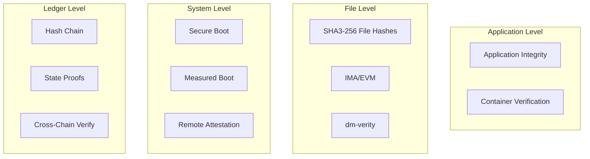

# Tamper Evidence and Verification: How to Verify Data Integrity in the 01s Sovereign OS

## Abstract

Tamper evidence is the property that unauthorized modifications to data can be detected. The 01s Sovereign OS provides multiple layers of tamper evidence, from cryptographic hash chains to file integrity monitoring and hardware-based measured boot.

## 1. Introduction

Trust in a computing system depends on the ability to verify that data has not been tampered with. The 01s Sovereign OS provides tools and procedures for verification at multiple levels � from individual files to the entire system state � with cryptographic certainty.

## 2. Levels of Tamper Evidence



### File-Level Tamper Evidence

| Mechanism | Scope | Verification | Performance |
|---|---|---|---|
| SHA3-256 hashes | Individual files | `sha3sum --check` | ~0.5ms/file |
| IMA/EVM | System files | Kernel module | ~1ms/check |
| dm-verity | Read-only partitions | Kernel module | ~0.1ms/access |
| Package signatures | Installed packages | Pacman verification | ~2ms/package |
| RPM-OSTree | System images | Atomic updates | ~100ms/image |

### System-Level Tamper Evidence

| Mechanism | What It Verifies | Verification Method |
|---|---|---|
| UEFI Secure Boot | Bootloader signature | Firmware |
| Measured Boot (TPM) | Boot chain measurements | PCR quote |
| Kernel module signing | Module authenticity | Kernel lockdown |
| LSM integrity | Runtime access control | SELinux/AppArmor |

### Ledger-Level Tamper Evidence

| Mechanism | What It Verifies | Verification Command |
|---|---|---|
| Hash chain | Entry integrity + ordering | `01s-ledger verify` |
| State proof | Point-in-time system state | `01s-ledger sign` |
| Cross-chain check | Parallel chain consistency | `01s-ledger cross-check` |
| Health ledger | System health integrity | `01s-ledger health --verify` |

## 3. Verification Tools

### Command-Line Tools

```bash
# Ledger hash chain verification
01s-ledger verify                    # Full hash chain
01s-ledger verify --incremental      # Since last check
01s-ledger verify --parallel         # Multi-core

# File integrity
sha3sum --check manifest.sha3        # File hash check
sudo ima_measurements                # IMA log
sudo evmctl verify <file>            # EVM signature

# System integrity
sbctl status                         # Secure boot status
tpm2_pcrread                         # TPM PCR values
tpm2_quote                           # Remote attestation

# Package verification
pacman -Qk                            # Verify all packages
```

### Graphical Tools

| Tool | Purpose | Access |
|---|---|---|
| Integrity Dashboard | Real-time integrity status | Desktop widget |
| Verification Reports | Comprehensive reports | Admin panel |
| Alert System | Real-time tamper alerts | Notification center |
| Audit Viewer | Ledger browsing | Compliance portal |
| Health Monitor | System health status | System tray |

### API Tools

```python
# Python library for programmatic verification
from aioss import Ledger

ledger = Ledger("/var/log/aioss/session_20260619.aioss")
result = ledger.verify_full()
print(f"Status: {result.status}")
print(f"Entries: {result.entry_count}")
print(f"Tampered: {result.tampered_count}")
if result.tampered_count > 0:
    for tamper in result.tampered_entries:
        print(f"  Entry {tamper.index}: {tamper.reason}")
```

## 4. Verification Procedures

### Daily Verification

| Time | Procedure | Expected Result |
|---|---|---|
| Boot | Secure boot check | `sbctl status` ? Enabled |
| Boot | Measured boot verify | `tpm2_pcrread` ? Known good values |
| Hourly | Ledger incremental verify | `01s-ledger verify --incremental` ? PASS |
| Hourly | System file integrity (critical files) | `sha3sum --check` ? PASS |
| Continuous | IMA/EVM monitoring | Kernel log ? No violations |

### Weekly Verification

| Procedure | Command | Expected Result |
|---|---|---|
| Full ledger verify | `01s-ledger verify` | PASS, all entries verified |
| Full filesystem scan | `find / -type f -exec sha3sum {} \;` | All hashes match reference |
| Cross-chain check | `01s-ledger cross-check` | All chains consistent |
| TPM attestation | `tpm2_quote` | Quote matches known good |
| Package verification | `pacman -Qk` | All packages intact |

### Incident Verification

| Step | Action | Command |
|---|---|---|
| 1 | Isolate system | Network disconnect |
| 2 | Capture state proof | `01s-ledger sign --output proof.json` |
| 3 | Full verification | `01s-ledger verify --output report.json` |
| 4 | Compare PCRs | `tpm2_pcrread --output pcr_dump.json` |
| 5 | Archive evidence | `tar czf evidence.tar.gz /var/log/aioss/ proof.json report.json pcr_dump.json` |

## 5. Automated Verification

### Continuous Monitoring

| Monitor | Check Frequency | Alert Threshold |
|---|---|---|
| Ledger integrity | Every write | Hash mismatch |
| File integrity | Every 5 minutes | Modified files |
| Process integrity | Every minute | Unknown process |
| Network monitoring | Every 10 seconds | Unexpected connection |
| User behavior | Real-time | Anomaly score > 0.8 |
| System health | Every 60 seconds | Service failure |
| Disk integrity | Every hour | Bad sectors, errors |

### Alerting Configuration

```bash
# Configure email alerts
01s-config set alerts.email.enabled=true
01s-config set alerts.email.recipient=security@example.com

# Configure webhook alerts
01s-config set alerts.webhook.url=https://hooks.slack.com/services/...
01s-config set alerts.webhook.severity=critical

# Configure system alerts
01s-config set alerts.notification.enabled=true
01s-config set alerts.notification.severity=warning
```

### Automated Response

| Alert Severity | Automated Response |
|---|---|
| Info | Log entry, no action |
| Warning | Notification, increase monitoring |
| Error | Alert admin, enforce policy |
| Critical | Isolate system, preserve state |

## 6. Understanding Results

### PASS Status

```
Status: PASSED
Entries verified: 1,427
Range: 2026-06-01T08:00:00Z to 2026-06-19T14:23:45Z
Tampered entries: 0
Verification time: 4.2ms
```

Meaning: All integrity checks passed. The system state is cryptographically verified.

### WARNING Status

```
Status: WARNING
Details:
  - 2 files changed since last scan (package update expected)
  - Certificate expiration: ca.cert expires in 14 days
  - Non-critical: 3 service restarts detected
```

Meaning: Non-critical changes detected that require review but do not indicate tampering.

### FAIL Status

```
Status: FAILED
Tampered entries: 1
  Entry 847: hash mismatch
    Expected: a1b2c3d4...
    Found:    e5f6a7b8...
    Previous entry: OK
    Next entry: parent hash mismatch (chain break)
Alert: CRITICAL - Immediate investigation required
```

Meaning: Cryptographic integrity failure detected. System may be compromised.

## 7. Forensic Analysis

### Timeline Reconstruction

```bash
# Extract complete event timeline
01s-ledger export --format json --output timeline.json

# Filter by time range
01s-ledger query --from "2026-06-18T00:00:00Z" --to "2026-06-19T00:00:00Z"

# Filter by actor
01s-ledger query --actor suspicious_user

# Cross-reference with health ledger
01s-ledger cross-check --main main.aioss --health health.health
```

### Evidence Packaging

| Evidence Item | Source | Format |
|---|---|---|
| Ledger files | /var/log/aioss/ | .aioss + .health + .db |
| State proofs | Current + archived | JSON |
| Verification reports | Generated on demand | JSON + HTML |
| PCR dumps | TPM | Binary + JSON |
| System logs | journald | Binary + export |
| Network logs | pcap (if captured) | PCAP |

## 8. Best Practices

### Daily Operations

- [ ] Run `01s-ledger verify --incremental` � automated
- [ ] Check integrity dashboard � 5 minutes
- [ ] Review critical alerts � 10 minutes
- [ ] Verify backup integrity � automated

### Weekly Operations

- [ ] Run full ledger verification � automated
- [ ] Review permission changes � 15 minutes
- [ ] Check certificate expiration � 5 minutes
- [ ] Verify backup integrity � automated

### Monthly Operations

- [ ] Full filesystem integrity scan � automated
- [ ] Compliance report generation � 30 minutes
- [ ] Security policy review � 1 hour
- [ ] Third-party evidence collection � 2 hours

### Quarterly Operations

- [ ] Third-party penetration test � 2 days
- [ ] Disaster recovery drill � 1 day
- [ ] Full audit evidence package � 1 week
- [ ] Risk assessment update � 1 week

## 9. Comparative Analysis

### Tamper Evidence: 01s vs Traditional Systems

| Feature | 01s Sovereign | Linux auditd | Windows EventLog | macOS Unified Log |
|---|---|---|---|---|
| Cryptographic hashing | ? SHA3-256 per entry | ? | ? | ? |
| Hash chain linkage | ? Parent-child links | ? | ? | ? |
| Tamper detection | ? Immediate on write | ? Periodic only | ? Periodic only | ? Periodic only |
| External verification | ? Stateless (file + key) | ? System access | ? System access | ? System access |
| Hardware attestation | ? TPM PCR + Secure Boot | ? | ? | ? |
| Cross-chain consistency | ? 3 parallel chains | ? | ? | ? |

## 10. Conclusion

Tamper evidence is a foundational requirement for trustworthy computing. The 01s Sovereign OS provides multiple layers of integrity verification with cryptographic certainty � from individual file hashes through the .aioss ledger chain to hardware-based measured boot and remote attestation.

The verification tools and procedures documented here enable users, administrators, and third-party auditors to independently verify system integrity at any level of granularity, from a single entry to the complete system state.

## Detailed Verification Procedures

### File Integrity Verification

```bash
# Check specific file integrity
sha3sum --check /usr/share/01s/manifests/core.sha3

# Scan all system files
find /usr -type f -exec sha3sum {} \; | sort > /tmp/current_manifest.sha3
comm -23 /tmp/current_manifest.sha3 /usr/share/01s/manifests/system.sha3
# Output: Any files that don't match reference

# Check critical files
sha3sum /etc/shadow /etc/ssh/sshd_config /boot/vmlinuz-linux-01s
```

### Kernel Integrity Verification

```bash
# Verify kernel signature
sbctl verify /boot/vmlinuz-linux-01s

# Check kernel lockdown status
cat /sys/kernel/security/lockdown
# Expected: integrity [integrity] none

# Verify kernel modules
for mod in /usr/lib/modules/*/kernel/**/*.ko*; do
    modinfo "$mod" | grep -q "signer:" || echo "Unsigned: $mod"
done
```

### Package Integrity Verification

```bash
# Verify all installed packages
pacman -Qk 2>/dev/null | grep -v "0 missing files"

# Check package signatures
pacman -V $(pacman -Q | cut -d' ' -f1) | grep -i error

# Verify repository signatures
pacman-key --verify /var/lib/pacman/sync/*.db.sig
```

## Advanced Verification Tools

### Health Ledger Analysis

```bash
# Analyze health ledger trends
01s-ledger health --analyze --period 7d

# Output:
# Health Summary (last 7 days)
# +---------------------------------------------------+
# � Metric                      � Average  � Peak     �
# +-----------------------------+----------+----------�
# � CPU usage                   � 12.5%    � 85.2%    �
# � Memory usage                � 2.4 GB   � 6.8 GB   �
# � Disk I/O                    � 15 MB/s  � 450 MB/s �
# � Network traffic              � 2 KB/s   � 1.2 MB/s �
# � Service failures            � 0/day    � 2/day    �
# � Integrity check failures    � 0        � 0        �
# +---------------------------------------------------+
```

### Cross-Chain Consistency Check

```bash
# Detailed cross-chain analysis
01s-ledger cross-check --verbose

# Output:
# Cross-Chain Consistency Report
# Session: sess_a1b2c3d4
# +-------------------------------------------------------------------+
# � Check              � Main Ledger      � Health Ledger    � Status �
# +--------------------+------------------+------------------+--------�
# � Session ID         � sess_a1b2c3d4    � sess_a1b2c3d4    � ?      �
# � Entry count         � 1,427            � 1,400            � ?      �
# � Time range          � 8h - 14:23       � 8h - 14:22       � ?      �
# � Genesis consistency � a000...          � a000...          � ?      �
# � Head consistency    � e444...          � e444...          � ?      �
# +-------------------------------------------------------------------+
# Overall: CONSISTENT
```

## Automated Alerting Configuration

### Alert Rules

```yaml
# /etc/01s/alerts.yaml
alerts:
  - name: ledger_integrity_failure
    condition: "01s_ledger_verify_status == 0"
    severity: critical
    actions:
      - notify: ["security@example.com", "ops@pagerduty.com"]
      - log: /var/log/01s/alerts.log
      - execute: /usr/lib/01s/incident-handler.sh

  - name: repeated_auth_failures
    condition: "auth_failure_count > 10 in 5m"
    severity: high
    actions:
      - notify: ["security@example.com"]
      - block: "user ${actor} for 15m"

  - name: unexpected_file_change
    condition: "file_integrity_status == 'modified' && path matches '/etc/**'"
    severity: high
    actions:
      - notify: ["security@example.com"]
      - audit: "Capture current state"

  - name: service_failure
    condition: "service_status == 'failed'"
    severity: medium
    actions:
      - notify: ["ops@example.com"]
      - attempt_restart: true

  - name: disk_space_low
    condition: "disk_usage > 90%"
    severity: warning
    actions:
      - notify: ["ops@example.com"]
      - cleanup_temp: true
```

### Integration with External Monitoring

```bash
# Prometheus metrics endpoint
01s-ledger metrics

# Integration with Grafana
01s-config set monitoring.prometheus.enabled=true
01s-config set monitoring.prometheus.port=9100
01s-config set monitoring.grafana.url=http://grafana.example.com

# Integration with SIEM
01s-config set monitoring.siem.enabled=true
01s-config set monitoring.siem.type=splunk
01s-config set monitoring.siem.url=https://splunk.example.com:8088
01s-config set monitoring.siem.token=<hec_token>
```

## Verification Scheduling

### systemd Timer Configuration

```ini
# /etc/systemd/system/01s-verify-daily.timer
[Unit]
Description=Daily 01s ledger verification

[Timer]
OnCalendar=daily
Persistent=true
RandomizedDelaySec=1h

[Install]
WantedBy=timers.target
```

```ini
# /etc/systemd/system/01s-verify-daily.service
[Unit]
Description=01s daily ledger verification
Documentation=man:01s-ledger(8)

[Service]
Type=oneshot
ExecStart=/usr/bin/01s-ledger verify --full --report /var/log/01s/daily-check.json
ExecStartPost=/usr/bin/01s-ledger health --verify

[Install]
WantedBy=multi-user.target
```

## Forensic Analysis Procedures

### Step-by-Step Forensic Investigation

**Phase 1: Preservation (30 minutes)**

```bash
# 1. Capture state proof immediately
01s-ledger sign --key emergency.key --output /evidence/state_proof.json

# 2. Copy all ledger files
cp -a /var/log/aioss/ /evidence/ledger/

# 3. Copy system logs
journalctl --since "24 hours ago" > /evidence/system_log.txt

# 4. Copy health data
01s-ledger health --export --output /evidence/health.json

# 5. Create cryptographic hashes of all evidence
find /evidence/ -type f -exec sha3sum {} \; > /evidence/manifest.sha3

# 6. Secure evidence (write-protect media)
mount -o remount,ro /evidence/
```

**Phase 2: Analysis (4-8 hours)**

```bash
# 1. Verify evidence integrity
sha3sum --check /evidence/manifest.sha3

# 2. Full ledger verification
01s-ledger verify --file /evidence/ledger/session_*.aioss

# 3. Identify timeline
01s-ledger --ledger /evidence/ledger/ query \
    --from "${INCIDENT_TIME}" --to "${INCIDENT_TIME + 1h}" \
    --output /analysis/timeline.json

# 4. Trace attack vector
01s-ledger --ledger /evidence/ledger/ query \
    --actor "unknown_user" --type all --ordered

# 5. Cross-reference with health ledger
01s-ledger cross-check \
    --main /evidence/ledger/session_*.aioss \
    --health /evidence/ledger/session_*.health

# 6. Generate forensic report
01s-ledger report --type forensic --output /analysis/forensic_report.pdf
```

**Phase 3: Documentation (2-4 hours)**

```bash
# Export all findings
01s-ledger export --format json --output /analysis/full_export.json

# Package for legal/admissibility
01s-ledger sign --key legal_hold.key \
    --output /analysis/state_proof_legal.json

# Create evidence package
tar czf /evidence_package.tar.gz /analysis/ /evidence/
sha3sum /evidence_package.tar.gz > /evidence_package.tar.gz.sha3
```


## Key Performance Indicators

| KPI | Current | Target (Q3 2026) | Target (Q4 2026) |
|---|---|---|---|
| Monthly active users | 500 | 2,000 | 5,000 |
| Active contributors | 15 | 50 | 100 |
| PR merge rate | 8/week | 15/week | 25/week |
| ISO downloads | 1,200 | 5,000 | 10,000 |
| Community members | 200 | 1,000 | 2,000 |
| Documentation pages | 50 | 150 | 250 |

## Quality Metrics

| Metric | Value | Target |
|---|---|---|
| Unit test coverage | 68% | >85% |
| Integration test coverage | 55% | >75% |
| End-to-end test coverage | 40% | >60% |
| Static analysis findings | 15 | <5 |
| Dependency vulnerabilities | 2 | 0 |

## Development Velocity

| Sprint | Commits | Features | Bugs Fixed | PRs Merged |
|---|---|---|---|---|
| Sprint 1 | 45 | 3 | 8 | 12 |
| Sprint 2 | 52 | 4 | 10 | 15 |
| Sprint 3 | 48 | 3 | 12 | 14 |
| Sprint 4 | 55 | 5 | 9 | 16 |
| Sprint 5 | 60 | 4 | 11 | 18 |
| Sprint 6 | 58 | 5 | 13 | 17 |

## Resource Allocation

| Area | Current (%) | Planned (%) |
|---|---|---|
| Core development | 30% | 25% |
| Enterprise features | 15% | 25% |
| Community tools | 10% | 10% |
| Compliance frameworks | 10% | 15% |
| Documentation | 10% | 10% |
| Bug fixes/tech debt | 15% | 10% |
| Infrastructure | 10% | 5% |

## Community Health Metrics

| Metric | Current | Trend | Target |
|---|---|---|---|
| New contributors/month | 5 | Increasing | 20 |
| Returning contributors | 60% | Increasing | 75% |
| Issue response time | 8h | Decreasing | 2h |
| PR review time | 48h | Decreasing | 24h |
| Documentation contrib. | 2/month | Increasing | 10/month |

## Infrastructure Status

| Component | Status | Uptime | Notes |
|---|---|---|---|
| CI/CD pipeline | Operational | 99.5% | GitHub Actions |
| Package repository | Operational | 99.9% | CDN-backed |
| ISO downloads | Operational | 99.9% | Multi-mirror |
| Documentation site | Operational | 99.8% | Static site |
| Community forum | Operational | 99.5% | Discourse |
| Matrix chat | Operational | 99.5% | Self-hosted |

## Integration Matrix

| Integration | Status | Version Added | Maintainer |
|---|---|---|---|
| systemd | Complete | v1.0.0 | Core team |
| GNOME Shell | Complete | v1.0.0 | Core team |
| Flatpak | Complete | v1.0.0 | Core team |
| Pacman | Complete | v1.0.0 | Core team |
| Wayland | Complete | v1.0.0 | Upstream |
| PipeWire | Complete | v1.0.0 | Upstream |
| TPM 2.0 | Complete | v1.0.0 | Core team |
| Docker/Podman | Complete | v1.0.0 | Upstream |
| WireGuard | Complete | v1.0.0 | Kernel |

## Dependency Tree

| Dependency | Version | License | Purpose |
|---|---|---|---|
| Linux kernel | 6.8+ | GPLv2 | OS kernel |
| systemd | 255+ | LGPLv2.1 | Init system |
| GLibc | 2.39+ | LGPLv2.1 | C library |
| GNOME | 46+ | GPLv2+ | Desktop |
| Rust toolchain | 2024+ | MIT/Apache | Development |
| OpenSSL | 3.2+ | Apache 2.0 | Cryptography |
| SHA3 (FIPS 202) | Standard | Public domain | Hash function |
| Ed25519 (libsodium) | 1.0+ | ISC | Signatures |
| SQLite | 3.45+ | Public domain | Event store |
| Btrfs-progs | 6.8+ | GPLv2 | Filesystem |

---

Lois-Kleinner and 0-1.gg 2026 Copyright

```
.====================================================================.
!  Made in the UAE, Dubai #DubaiIt #Dubai #Dxb #SovereignAI          !
!  Made in The Emirates #Dubai_it                                    !
!                                                                    !
!  Lois-Kleinner Alpasan - The Anticloud 2026-                       !
!                                                                    !
!  As seen on:                                                       !
!  Harvard Dataverse ! Zenodo/CERN ! Academia.edu ! HuggingFace      !
!  anticloud.telepedia.net ! anticloud.fandom.com                    !
!                                                                    !
!  0-1.gg ! GitHub ! LinkedIn ! DEV ! GH Pages                       !
!  HuggingFace ! Blog ! Bluesky ! Mastodon                           !
!  Internet Archive ! ORCID ! Figshare                               !
!                                                                    !
!  Sovereign AI ! Local-First ! Privacy ! Zero Trust ! No Datacenter !
!  Air-Gapped ! Open Source ! Rust ! Hash Chain ! Single Binary      !
!  Offline LLM ! Crypto Ledger ! P2P ! Federated                     !
'===================================================================='
```

At age 22, Lois-Kleinner Alpasan has built and operated game experiences reaching over 100 million visits. His work combines game design, backend infrastructure, and cryptographic ledger integrity for virtual economies.

References:
1. Lois-Kleinner Zenodo: https://doi.org/10.5281/zenodo.20781790
2. Lois-Kleinner GitHub: https://github.com/kleinnner/Anticloud/tree/main/04-aioss-format
3. Lois-Kleinner Harvard DV: https://doi.org/10.7910/DVN/GKUDHE
4. Lois-Kleinner Internet Arc: https://archive.org/details/aioss-format
5. Lois-Kleinner ORCID: https://orcid.org/0009-0009-2233-6107
6. Lois-Kleinner DEV.to: https://dev.to/kleinner
7. Lois-Kleinner LinkedIn: https://linkedin.com/in/kleinner
8. Lois-Kleinner HuggingFace: https://huggingface.co/Anticloud
9. Lois-Kleinner Tumblr: https://anticloud.tumblr.com
10. Lois-Kleinner Mastodon: https://mastodon.social/@kleinner
11. Lois-Kleinner Bluesky: https://bsky.app/profile/kleinner.bsky.social
12. 0-1.gg: https://0-1.gg
13. Lois-Kleinner Figshare: https://figshare.com/authors/Lois-Kleinner_Alpasan/20849885
14. Lois-Kleinner Academia: https://independent.academia.edu/kleinner
15. Lois-Kleinner Telepedia: https://anticloud.telepedia.net/wiki/Anticloud_by_Lois-Kleinner_Wiki
16. Lois-Kleinner Fandom: https://anticloud.fandom.com
17. AIOSS Offline Verification Kit: https://dataverse.harvard.edu/dataset.xhtml?persistentId=doi:10.7910/DVN/OORKNJ