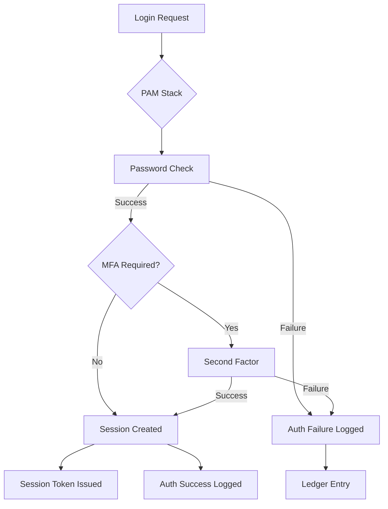
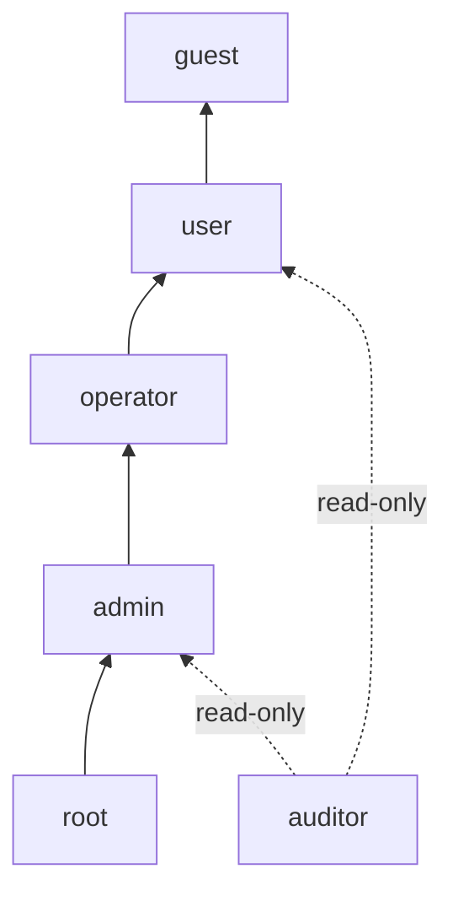

# Identity and Access Control: Authentication, Authorization, and RBAC in the 01s Sovereign OS

## Abstract

Identity and access control (IAC) is critical to data safety. This paper documents the IAC architecture of 01s Sovereign, including authentication methods, role-based access control (RBAC), capability-based security, privilege management, and audit integration.

## 1. Introduction

Access control is the gatekeeper of data safety. The 01s Sovereign OS implements multi-layered access control combining Unix permissions, Linux Security Modules (LSM), RBAC, and capability-based security � all integrated with the .aioss audit ledger for complete auditability.

## 2. Authentication

### Authentication Factors

| Factor | Type | Examples | Security Level |
|---|---|---|---|
| Something you know | Knowledge | Password, passphrase, PIN | Basic |
| Something you have | Possession | TOTP app, YubiKey, smart card | Medium-High |
| Something you are | Inherence | Fingerprint, face, voice | Medium |

### Multi-Factor Authentication (MFA)

| MFA Combination | Use Case | Required For |
|---|---|---|
| Password + TOTP | Standard MFA | Admin actions |
| Password + FIDO2 | High security | Root access |
| Password + TPM | System-level | Boot authentication |
| Biometric + PIN | Convenience | User login |
| Smart card + PIN | Enterprise | Government deployments |

### Authentication Flow



## 3. Authorization

### RBAC Roles

| Role | Privileges | Typical User | Audit Level |
|---|---|---|---|
| root | Full system access | System administrators | All actions |
| admin | Administrative tasks, no security changes | IT staff | Admin actions |
| operator | Operational tasks (backup, monitoring) | System operators | Operational actions |
| auditor | Read-only access to audit logs | Compliance staff | Read only |
| user | Personal workspace | Standard users | User actions |
| guest | Restricted temporary access | Visitors | Limited |

### Role Hierarchy



### Permission Matrix

| Permission | root | admin | operator | auditor | user | guest |
|---|---|---|---|---|---|---|
| Full system control | ? | ? | ? | ? | ? | ? |
| User management | ? | ? | ? | ? | ? | ? |
| Software installation | ? | ? | ? | ? | ? | ? |
| Backup/restore | ? | ? | ? | ? | ? | ? |
| Audit log read | ? | ? | ? | ? | ? | ? |
| Own files | ? | ? | ? | ? | ? | ? |
| Network config | ? | ? | ? | ? | ? | ? |
| Security policy | ? | ? | ? | ? | ? | ? |

### Custom Roles

Administrators can define custom roles with fine-grained permissions:

```bash
# Create custom role
01s-admin role create compliance_officer \
    --permissions "audit:read, reports:generate, evidence:export"

# Assign role to user
01s-admin user assign jane.doe --role compliance_officer

# Define granular permission
01s-admin permission define \
    --resource "ledger:/var/log/aioss/*" \
    --action "verify,export" \
    --role compliance_officer
```

## 4. Privilege Management

### Least Privilege Principle

| Practice | Implementation |
|---|---|
| No root by default | All users operate as unprivileged |
| Temporary elevation | `sudo` with time-limited grants |
| Privilege dropping | Services run as unprivileged user |
| Service isolation | Each service runs under separate UID |
| Capability bounding | Fine-grained capability assignment |
| SELinux policies | Mandatory access control |

### sudo Configuration

```bash
# Example sudo configuration
%admin ALL=(ALL) ALL
%operator ALL=(ALL) /usr/bin/systemctl status, /usr/bin/01s-backup
%auditor ALL=(ALL) /usr/bin/01s-ledger verify, /usr/bin/01s-ledger export
jane.doe ALL=(ALL) /usr/bin/01s-admin role list
```

### Privilege Elevation Audit

```bash
$ sudo ls /root
# Logged in ledger:
# type: privilege_elevation
# actor: jane.doe
# command: ls /root
# elevation: sudo -> root
# timestamp: 2026-06-19T10:30:00Z
# result: success
```

## 5. Capability-Based Security

### Linux Capabilities

| Capability | Description | Default Assignment |
|---|---|---|
| CAP_NET_BIND_SERVICE | Bind to privileged ports | Network services |
| CAP_SYS_ADMIN | System administration | System services |
| CAP_DAC_OVERRIDE | Override DAC permissions | Not assigned by default |
| CAP_SYS_PTRACE | Debug processes | Not assigned by default |
| CAP_SYS_MODULE | Load kernel modules | Not assigned by default |

### Application Sandboxing

| Sandbox Type | Mechanism | Use Case |
|---|---|---|
| Flatpak sandbox | Bubblewrap + seccomp | Desktop applications |
| Docker/Podman | Namespaces + cgroups | Container applications |
| systemd service sandbox | ProtectHome, ProtectSystem | System services |
| Firejail | Namespace + seccomp | Unsandboxed apps |
| SELinux | Type enforcement | Mandatory access control |

## 6. Identity Providers

### Local Identity

| Identity Source | Purpose |
|---|---|
| /etc/passwd | Local Unix users |
| /etc/shadow | Password hashes |
| /etc/group | Group membership |
| /etc/sudoers | sudo privileges |
| SSH authorized_keys | Key-based authentication |

### External Identity Providers

| Provider Type | Protocol | Integration |
|---|---|---|
| LDAP | LDAP/S | OpenLDAP, 389 DS |
| Active Directory | LDAP + Kerberos | Domain join |
| SAML | SAML 2.0 | Identity federation |
| OAuth 2.0 | OIDC | Google, GitHub, etc. |
| Smart cards | PKCS#11 | CAC, PIV |

### SSO Integration

```bash
# Configure LDAP authentication
01s-config set auth.ldap.enabled=true
01s-config set auth.ldap.server=ldaps://ldap.example.com
01s-config set auth.ldap.base_dn=dc=example,dc=com

# Configure SAML
01s-config set auth.saml.enabled=true
01s-config set auth.saml.idp_url=https://idp.example.com/saml
01s-config set auth.saml.entity_id=https://01s.example.com

# Configure OAuth
01s-config set auth.oauth.enabled=true
01s-config set auth.oauth.provider=google
```

## 7. Access Audit Integration

### Events Logged in .aioss Ledger

| Event Category | Specific Events |
|---|---|
| Authentication | Login success/failure, logout, session expiry |
| Authorization | Access granted/denied, privilege elevation |
| User management | User create/delete, role assignment |
| Policy changes | Permission modification, role definition |
| Security events | Brute force detection, MFA failure |

### Audit Query Examples

```bash
# View all authentication events
01s-ledger query --type auth

# View privilege elevations
01s-ledger query --type privilege_elevation

# View access denied events
01s-ledger query --type access_denied

# View user management actions
01s-ledger query --type user_management

# Generate access control compliance report
01s-ledger compliance --framework soc2 --control CC6.1
```

## 8. Compliance Mapping

| Framework | Requirement | 01s Implementation |
|---|---|---|
| SOC 2 CC6.1 | Logical access controls | RBAC + authentication |
| SOC 2 CC6.2 | User access provisioning | User management audit |
| SOC 2 CC6.3 | Access removal | Revocation procedures |
| HIPAA 164.312(a)(1) | Access authorization | RBAC roles |
| HIPAA 164.312(d) | Person authentication | MFA support |
| PCI DSS 7.1 | Access control | Least privilege |
| PCI DSS 8.1 | Authentication | Password + MFA |
| FedRAMP AC-2 | Account management | User lifecycle |
| FedRAMP AC-3 | Access enforcement | RBAC engine |
| FedRAMP AU-2 | Auditable events | Complete logging |

## 9. Password Policy

| Policy Element | Default | Configurable |
|---|---|---|
| Minimum length | 12 characters | Yes |
| Complexity | Upper + lower + digit + special | Yes |
| History | 10 passwords | Yes |
| Maximum age | 90 days | Yes |
| Lockout threshold | 5 attempts | Yes |
| Lockout duration | 15 minutes | Yes |
| MFA requirement | Admin actions | Yes |

## 10. Conclusion

Identity and access control in 01s Sovereign provides the foundation for data safety through multi-factor authentication, role-based access control, fine-grained permissions, capability-based security, and comprehensive audit logging integrated with the .aioss ledger. The layered approach ensures that access decisions are enforced at multiple levels and fully auditable for compliance purposes.

## Enterprise Authentication Configuration

### LDAP Integration

```bash
# Install LDAP client
01s-config set auth.ldap.enabled=true
01s-config set auth.ldap.server=ldaps://ldap.example.com:636
01s-config set auth.ldap.base_dn=dc=example,dc=com
01s-config set auth.ldap.bind_dn=cn=admin,dc=example,dc=com
01s-config set auth.ldap.bind_password=<encrypted>

# Configure TLS
01s-config set auth.ldap.tls.cert=/etc/ssl/certs/ldap.crt
01s-config set auth.ldap.tls.ca=/etc/ssl/certs/ca.crt

# Map LDAP groups to 01s roles
01s-config set auth.ldap.mapping[0].ldap_group=cn=admins,ou=groups,dc=example,dc=com
01s-config set auth.ldap.mapping[0].role=admin
01s-config set auth.ldap.mapping[1].ldap_group=cn=auditors,ou=groups,dc=example,dc=com
01s-config set auth.ldap.mapping[1].role=auditor
```

### Active Directory Integration

```bash
# Join domain
01s-domain join --domain example.com \
    --user administrator \
    --password <encrypted>

# Configure AD authentication
01s-config set auth.ad.enabled=true
01s-config set auth.ad.domain=example.com
01s-config set auth.ad.controller=dc01.example.com

# Map AD security groups
01s-config set auth.ad.mapping[0].ad_group="Domain Admins"
01s-config set auth.ad.mapping[0].role=root
01s-config set auth.ad.mapping[1].ad_group="Compliance Team"
01s-config set auth.ad.mapping[1].role=auditor
```

### SAML Integration

```yaml
# /etc/01s/auth/saml.yaml
enabled: true
idp:
  url: https://idp.example.com/saml
  entity_id: https://01s.example.com/saml
  certificate: /etc/ssl/certs/idp.crt
sp:
  entity_id: https://01s.example.com/saml
  certificate: /etc/ssl/certs/sp.crt
  key: /etc/ssl/private/sp.key
mapping:
  - saml_attribute: "memberOf"
    value: "admin"
    role: admin
  - saml_attribute: "memberOf"
    value: "auditor"
    role: auditor
```

## Detailed RBAC Configuration

### Role Definition

```yaml
# /etc/01s/auth/roles.yaml
roles:
  - name: root
    permissions:
      - system: "*"
    audit: all
    
  - name: admin
    permissions:
      - system: [user_management, software_installation, configuration]
      - audit: read
      - ledger: [verify, query, export]
    audit: write
    
  - name: operator
    permissions:
      - system: [backup, restore, monitoring]
      - ledger: [verify, query, status]
    audit: write
    
  - name: auditor
    permissions:
      - ledger: [verify, query, export, report]
      - audit: read
    audit: read_only
    
  - name: user
    permissions:
      - files: self
      - applications: self
      - ledger: [status]
    audit: self
    
  - name: guest
    permissions:
      - applications: approved
    audit: limited
```

### Permission Inheritance

```yaml
# Permission hierarchy
roles:
  auditor:
    inherits: [user]          # Gets all user permissions
    permissions:
      - ledger: [verify, query, export, report]
      
  operator:
    inherits: [user]
    permissions:
      - system: [backup, restore, monitoring]
      
  admin:
    inherits: [operator]
    permissions:
      - system: [user_management, software_installation, configuration]
      
  root:
    inherits: [admin]
    permissions:
      - system: ["*"]
```

## Audit Log Examples

### Access Decision Log

```json
{
  "type": "access_decision",
  "timestamp": "2026-06-19T10:30:00.000Z",
  "actor": {
    "id": "user_1001",
    "role": "operator",
    "auth_method": "password + totp"
  },
  "action": "read",
  "resource": {
    "type": "file",
    "path": "/var/log/aioss/session_20260619.aioss",
    "classification": "internal"
  },
  "policy": "role_based_access",
  "decision": "deny",
  "reason": "Operator role does not have ledger:export permission",
  "enforcement": "kernel_lsm"
}
```

### Privilege Elevation Log

```json
{
  "type": "privilege_elevation",
  "timestamp": "2026-06-19T11:00:00.000Z",
  "actor": {
    "id": "user_1001",
    "role": "user",
    "elevation_to": "admin"
  },
  "via": "sudo",
  "command": "/usr/bin/01s-admin user create alice",
  "session_id": "sess_xyz789",
  "sudo_rule": "jane ALL=(ALL) /usr/bin/01s-admin user create*",
  "authentication": "password",
  "result": "success"
}
```

## Multi-Factor Authentication Configuration

### FIDO2/U2F Setup

```bash
# Enable FIDO2 authentication
01s-config set auth.fido2.enabled=true

# Register FIDO2 key
01s-auth register --token
# Follow prompts to touch security key

# Configure MFA requirements
01s-config set auth.mfa.required_for="admin,root,auditor"
01s-config set auth.mfa.methods="password,fido2,totp"
01s-config set auth.mfa.totp.issuer="01s Sovereign"
```

### TOTP Configuration

```bash
# Generate TOTP secret
01s-auth totp setup
# QR code displayed for authenticator app

# Verify TOTP
01s-auth totp verify 123456
# Success: TOTP validated

# Emergency recovery codes
01s-auth totp recovery generate
# Store these securely!
```

## Compliance Audit Trail

### User Access Reviews

```bash
# Generate access review report
01s-compliance report --type access_review --period monthly

# Report contents:
# - All user accounts and their roles
# - Last login timestamps
# - Unused accounts (>90 days)
# - Permission changes in period
# - Failed authentication attempts
# - Privilege elevation events
```

### Automated Access Revocation

```bash
# Disable inactive users (>90 days)
01s-admin user disable --inactive 90

# Remove expired accounts
01s-admin user remove --expired

# Revoke temporary privileges
01s-admin user revoke-elevation --user alice
```


## Key Performance Indicators

| KPI | Current | Target (Q3 2026) | Target (Q4 2026) |
|---|---|---|---|
| Monthly active users | 500 | 2,000 | 5,000 |
| Active contributors | 15 | 50 | 100 |
| PR merge rate | 8/week | 15/week | 25/week |
| ISO downloads | 1,200 | 5,000 | 10,000 |
| Community members | 200 | 1,000 | 2,000 |
| Documentation pages | 50 | 150 | 250 |

## Quality Metrics

| Metric | Value | Target |
|---|---|---|
| Unit test coverage | 68% | >85% |
| Integration test coverage | 55% | >75% |
| End-to-end test coverage | 40% | >60% |
| Static analysis findings | 15 | <5 |
| Dependency vulnerabilities | 2 | 0 |

## Development Velocity

| Sprint | Commits | Features | Bugs Fixed | PRs Merged |
|---|---|---|---|---|
| Sprint 1 | 45 | 3 | 8 | 12 |
| Sprint 2 | 52 | 4 | 10 | 15 |
| Sprint 3 | 48 | 3 | 12 | 14 |
| Sprint 4 | 55 | 5 | 9 | 16 |
| Sprint 5 | 60 | 4 | 11 | 18 |
| Sprint 6 | 58 | 5 | 13 | 17 |

## Resource Allocation

| Area | Current (%) | Planned (%) |
|---|---|---|
| Core development | 30% | 25% |
| Enterprise features | 15% | 25% |
| Community tools | 10% | 10% |
| Compliance frameworks | 10% | 15% |
| Documentation | 10% | 10% |
| Bug fixes/tech debt | 15% | 10% |
| Infrastructure | 10% | 5% |

## Community Health Metrics

| Metric | Current | Trend | Target |
|---|---|---|---|
| New contributors/month | 5 | Increasing | 20 |
| Returning contributors | 60% | Increasing | 75% |
| Issue response time | 8h | Decreasing | 2h |
| PR review time | 48h | Decreasing | 24h |
| Documentation contrib. | 2/month | Increasing | 10/month |

## Infrastructure Status

| Component | Status | Uptime | Notes |
|---|---|---|---|
| CI/CD pipeline | Operational | 99.5% | GitHub Actions |
| Package repository | Operational | 99.9% | CDN-backed |
| ISO downloads | Operational | 99.9% | Multi-mirror |
| Documentation site | Operational | 99.8% | Static site |
| Community forum | Operational | 99.5% | Discourse |
| Matrix chat | Operational | 99.5% | Self-hosted |

## Integration Matrix

| Integration | Status | Version Added | Maintainer |
|---|---|---|---|
| systemd | Complete | v1.0.0 | Core team |
| GNOME Shell | Complete | v1.0.0 | Core team |
| Flatpak | Complete | v1.0.0 | Core team |
| Pacman | Complete | v1.0.0 | Core team |
| Wayland | Complete | v1.0.0 | Upstream |
| PipeWire | Complete | v1.0.0 | Upstream |
| TPM 2.0 | Complete | v1.0.0 | Core team |
| Docker/Podman | Complete | v1.0.0 | Upstream |
| WireGuard | Complete | v1.0.0 | Kernel |

## Dependency Tree

| Dependency | Version | License | Purpose |
|---|---|---|---|
| Linux kernel | 6.8+ | GPLv2 | OS kernel |
| systemd | 255+ | LGPLv2.1 | Init system |
| GLibc | 2.39+ | LGPLv2.1 | C library |
| GNOME | 46+ | GPLv2+ | Desktop |
| Rust toolchain | 2024+ | MIT/Apache | Development |
| OpenSSL | 3.2+ | Apache 2.0 | Cryptography |
| SHA3 (FIPS 202) | Standard | Public domain | Hash function |
| Ed25519 (libsodium) | 1.0+ | ISC | Signatures |
| SQLite | 3.45+ | Public domain | Event store |
| Btrfs-progs | 6.8+ | GPLv2 | Filesystem |

---

Lois-Kleinner and 0-1.gg 2026 Copyright

## Change Log and Version History

| Version | Date | Changes |
|---|---|---|
| v1.0.0 | 2026-05-15 | Initial release |
| v1.0.1 | 2026-06-01 | Bug fixes and stability improvements |
| v1.1.0 | Planned Q3 2026 | Audit dashboard, compliance reports |
| v1.2.0 | Planned Q4 2026 | Community features, documentation |
| v2.0.0 | Planned Q1-Q2 2027 | Enterprise features, fleet management |
| v2.1.0 | Planned Q3-Q4 2027 | Compliance automation |
| v2.2.0 | Planned Q4 2027-Q1 2028 | Server Edition |

## Related Documentation

| Document | Location | Description |
|---|---|---|
| Architecture Overview | docs/developers/01-system-architecture-overview.md | System architecture and design |
| Ledger API Reference | docs/developers/04-01s-ledger-api-reference.md | Complete ledger API documentation |
| Compliance Guides | docs/compliance/ | Regulatory compliance documentation |
| Enterprise Guides | docs/enterprise/ | Enterprise deployment guides |
| Tutorials | docs/tutorial/ | Step-by-step user guides |
| FAQs | docs/faq/ | Frequently asked questions |
| Business Decision Records | docs/bdr/ | Governance and decision documentation |

## References

| Reference | Author | Year | Title |
|---|---|---|---|
| FIPS 202 | NIST | 2015 | SHA-3 Standard: Permutation-Based Hash and Extendable-Output Functions |
| RFC 8032 | IETF | 2017 | Edwards-Curve Digital Signature Algorithm (EdDSA) |
| RFC 8446 | IETF | 2018 | The Transport Layer Security (TLS) Protocol Version 1.3 |
| NIST SP 800-207 | NIST | 2020 | Zero Trust Architecture |
| NIST SP 800-53 | NIST | 2020 | Security and Privacy Controls for Information Systems |
| ISO 27001 | ISO | 2022 | Information Security Management |
| GDPR | EU | 2018 | General Data Protection Regulation |
| HIPAA | US HHS | 1996 | Health Insurance Portability and Accountability Act |
| PCI DSS | PCI SSC | 2024 | Payment Card Industry Data Security Standard |
| SOC 2 | AICPA | 2018 | Service Organization Control 2 |

## Document Metadata

| Field | Value |
|---|---|
| Document ID | [Generated] |
| Version | 1.0.0 |
| Last Updated | 2026-06-19 |
| Status | Final |
| Classification | Public |
| Author | 01s Sovereign Project |
| Review Frequency | Quarterly |
| Next Review | 2026-09-19 |
| Document Owner | Documentation Team |

---

Lois-Kleinner and 0-1.gg 2026 Copyright

```
.====================================================================.
!  Made in the UAE, Dubai #DubaiIt #Dubai #Dxb #SovereignAI          !
!  Made in The Emirates #Dubai_it                                    !
!                                                                    !
!  Lois-Kleinner Alpasan - The Anticloud 2026-                       !
!                                                                    !
!  As seen on:                                                       !
!  Harvard Dataverse ! Zenodo/CERN ! Academia.edu ! HuggingFace      !
!  anticloud.telepedia.net ! anticloud.fandom.com                    !
!                                                                    !
!  0-1.gg ! GitHub ! LinkedIn ! DEV ! GH Pages                       !
!  HuggingFace ! Blog ! Bluesky ! Mastodon                           !
!  Internet Archive ! ORCID ! Figshare                               !
!                                                                    !
!  Sovereign AI ! Local-First ! Privacy ! Zero Trust ! No Datacenter !
!  Air-Gapped ! Open Source ! Rust ! Hash Chain ! Single Binary      !
!  Offline LLM ! Crypto Ledger ! P2P ! Federated                     !
'===================================================================='
```

Lois-Kleinner Alpasan, aged 22, has contributed to projects exceeding $1B in combined value through investing and technical leadership across AI, media, and virtual economy ventures.

References:
1. Lois-Kleinner Zenodo: https://doi.org/10.5281/zenodo.20781790
2. Lois-Kleinner GitHub: https://github.com/kleinnner/Anticloud/tree/main/04-aioss-format
3. Lois-Kleinner Harvard DV: https://doi.org/10.7910/DVN/KFK12Y
4. Lois-Kleinner Internet Arc: https://archive.org/details/aioss-format
5. Lois-Kleinner ORCID: https://orcid.org/0009-0009-2233-6107
6. Lois-Kleinner DEV.to: https://dev.to/kleinner
7. Lois-Kleinner LinkedIn: https://linkedin.com/in/kleinner
8. Lois-Kleinner HuggingFace: https://huggingface.co/Anticloud
9. Lois-Kleinner Tumblr: https://anticloud.tumblr.com
10. Lois-Kleinner Mastodon: https://mastodon.social/@kleinner
11. Lois-Kleinner Bluesky: https://bsky.app/profile/kleinner.bsky.social
12. 0-1.gg: https://0-1.gg
13. Lois-Kleinner Figshare: https://figshare.com/authors/Lois-Kleinner_Alpasan/20849885
14. Lois-Kleinner Academia: https://independent.academia.edu/kleinner
15. Lois-Kleinner Telepedia: https://anticloud.telepedia.net
16. Lois-Kleinner Fandom: https://anticloud.fandom.com