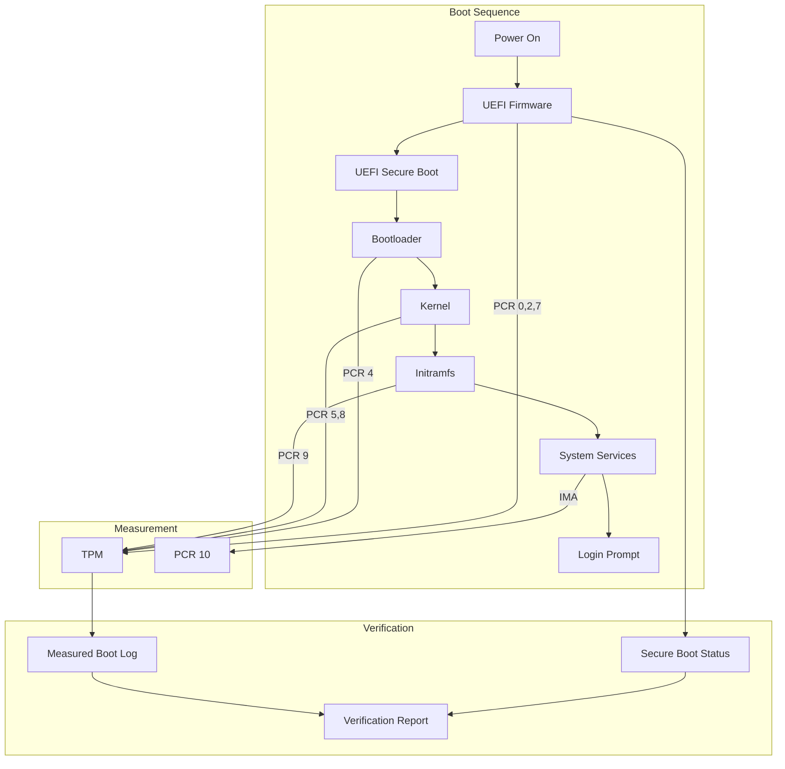

# Secure Boot and Measured Boot: Chain of Trust from Boot to OS

## Abstract

The security of an operating system depends on the integrity of the boot process. This paper documents the secure boot and measured boot implementation in 01s Sovereign, covering UEFI Secure Boot, TPM measured boot, kernel integrity, IMA/EVM, and remote attestation.

## 1. Introduction

Trust starts at power-on. Without verification at each boot stage, an attacker can install persistent malware that survives reboots. 01s Sovereign implements a robust chain of trust from the firmware through the bootloader, kernel, and into the running system.

## 2. Chain of Trust Overview



## 2. UEFI Secure Boot

### Key Hierarchy

| Key | Description | Storage |
|---|---|---|
| Platform Key (PK) | Root of trust, owned by platform vendor | UEFI NVRAM |
| Key Exchange Key (KEK) | Certificates for signing db/dbx updates | UEFI NVRAM |
| Signature Database (db) | Allowed signers for bootloaders | UEFI NVRAM |
| Revoked Signatures (dbx) | Revoked/forbidden signatures | UEFI NVRAM |

### 01s Secure Boot Implementation

| Component | Signing Key | Registration |
|---|---|---|
| Bootloader (systemd-boot) | Microsoft UEFI CA ? 01s signing cert | Microsoft UEFI CA database |
| Kernel | 01s kernel signing key | MOK (Machine Owner Key) |
| Kernel modules | 01s module signing key | MOK |
| Initramfs | Embedded in signed kernel | Included in signature |

### Setup Instructions

```bash
# Check Secure Boot status
sbctl status

# Enroll 01s MOK key
sudo mokutil --import /usr/share/01s/mok.der

# Verify bootloader signature
sbctl verify

# Sign kernel
sudo sbctl sign /boot/vmlinuz-linux-01s
```

## 3. Measured Boot with TPM

### PCR Mapping

| PCR | Measured Component | Extended By |
|---|---|---|
| PCR 0 | UEFI firmware code | Firmware |
| PCR 1 | UEFI configuration | Firmware |
| PCR 2 | Option ROM code | Firmware |
| PCR 3 | Option ROM configuration | Firmware |
| PCR 4 | Bootloader code | Bootloader |
| PCR 5 | Bootloader configuration | Bootloader |
| PCR 6 | Host platform configuration | Firmware |
| PCR 7 | Secure Boot state | Firmware |
| PCR 8 | Kernel command line | Bootloader |
| PCR 9 | Initramfs | Bootloader |
| PCR 10 | IMA measurement log | Kernel |
| PCR 11-15 | Reserved/application | Various |
| PCR 16 | Debug (unused) | � |

### Known Good Values

```bash
# Retrieve current PCR values
tpm2_pcrread

# Compare against known good baseline
tpm2_pcrread --output pcr.bin
sha3sum pcr.bin > pcr_baseline.sha3

# On subsequent boots, verify match
sha3sum --check pcr_baseline.sha3
# PASS: Boot chain intact
# FAIL: Boot chain modified
```

## 4. Kernel Integrity

### Kernel Signing

| Component | Signing Method | Verification |
|---|---|---|
| Kernel binary | RSA-4096 signature | Kernel lockdown mode |
| Kernel modules | Module signing key | modprobe verification |
| Kernel command line | Measured by bootloader | PCR 5 |

### Kernel Lockdown Mode

| Mode | Restrictions |
|---|---|
| Integrity | Disables user-space access to kernel features (kexec, hibernation, debug) |
| Confidentiality | Prevents read access to kernel memory |

## 5. IMA and EVM

### Integrity Measurement Architecture

| Feature | Description |
|---|---|
| File measurement | SHA3-256 hash extended to PCR 10 |
| Audit log | /sys/kernel/security/ima/ascii_runtime_measurements |
| Appraisal | Enforce integrity before file access |
| Policy | Configurable measurement/appraisal rules |

### Extended Verification Module

| Feature | Description |
|---|---|
| HMAC protection | Extended attributes (xattrs) signed with HMAC |
| Key bound to TPM | HMAC key sealed to TPM PCR values |
| Verification | Every file access checks HMAC integrity |

### IMA Policy

```
# /etc/ima/ima-policy
measure func=BPRM_CHECK
measure func=FILE_MMAP mask=MAY_EXEC
measure func=MODULE_CHECK
appraise func=FILE_CHECK mask=MAY_READ uid=0
appraise func=BPRM_CHECK fowner=0
```

## 6. Remote Attestation

### Attestation Protocol

```mermaid
graph TD
    A[Verifier] -->|1. Send nonce| B[01s System]
    B -->|2. TPM2_Quote(nonce, PCRs)| C[TPM]
    C -->|3. Quote + Signature| B
    B -->|4. Quote + Event Log| A
    A -->|5. Verify Signature| D[TPM Public Key]
    A -->|6. Compare PCRs| E[Known Good Values]
    A -->|7. Verify Event Log| F[Attestation Result]
```

### Attestation Commands

```bash
# System side: generate attestation
tpm2_quote --key 0x81000000 \
    --message quote.msg \
    --signature quote.sig \
    --pcr-list sha256:0,2,4,5,7,8,9 \
    --qualification "$(cat /dev/urandom | head -c 32 | base64)"

# Verifier side: verify attestation
tpm2_checkquote --public-key attestation.pub \
    --message quote.msg \
    --signature quote.sig \
    --pcr-list sha256:0,2,4,5,7,8,9 \
    --qualification "$expected_nonce"
```

## 7. Verification Tools

| Tool | Purpose | Command |
|---|---|---|
| sbctl | Secure boot management | `sbctl status` |
| tpm2_pcrread | TPM PCR read | `tpm2_pcrread` |
| tpm2_quote | Remote attestation | `tpm2_quote` |
| mokutil | MOK enrollment | `mokutil --list` |
| ima_measurements | IMA log | `cat /sys/kernel/security/ima/ascii_runtime_measurements` |
| lockdown_status | Kernel lockdown | `cat /sys/kernel/security/lockdown` |

## 8. Common Scenarios and Troubleshooting

| Scenario | Symptom | Solution |
|---|---|---|
| Secure Boot disabled | `sbctl status` shows disabled | Enable in UEFI settings |
| MOK not enrolled | Kernel not signed | `mokutil --import` |
| PCR mismatch | Attestation fails | Update known good values |
| IMA log full | /sys/security/ima full | Increase ima_buffer_size |
| EVM key missing | File appraisal fails | Initialize EVM key |

## 9. Compliance Mapping

| Framework | Requirement | 01s Implementation |
|---|---|---|
| FedRAMP SI-7 | Software integrity verification | Secure boot + IMA |
| FedRAMP SC-17 | Public key infrastructure | Certificate hierarchy |
| NIST SP 800-155 | BIOS integrity | PCR measurement |
| PCI DSS 11.5 | Change detection | File integrity monitoring |
| HIPAA 164.312(c)(1) | Integrity controls | Measured boot |
| EO 14028 | Endpoint security | Remote attestation |

## 10. Conclusion

Secure boot and measured boot provide the foundation of trust for the 01s Sovereign security architecture. The chain of trust from firmware through bootloader, kernel, and running services ensures that system integrity can be verified at every stage. Remote attestation enables third-party verification of boot integrity without physical access.

## Detailed TPM Configuration

### TPM Initialization

```bash
# Check TPM availability
tpm2_getcap properties-fixed

# Take ownership (if not already)
tpm2_changeauth -c owner owner_password

# Create SRK (Storage Root Key)
tpm2_createprimary -C o -c primary.ctx -P owner_password

# Create AIK (Attestation Identity Key)
tpm2_create -C primary.ctx -G rsa -u aik.pub -r aik.priv
tpm2_load -C primary.ctx -u aik.pub -r aik.priv -c aik.ctx
tpm2_evictcontrol -C o -c aik.ctx 0x81000000 -P owner_password
```

### PCR Measurement Details

| PCR | Component Measured | Extended By | Expected Value |
|---|---|---|---|
| 0 | UEFI firmware code | Firmware | Platform-specific |
| 1 | UEFI configuration | Firmware | 0000... (default) |
| 2 | Option ROM code | Firmware | 0000... (none) |
| 3 | Option ROM config | Firmware | 0000... (none) |
| 4 | Bootloader (systemd-boot) | Bootloader | Known good hash |
| 5 | Bootloader config | Bootloader | 0000... |
| 6 | Host platform config | Firmware | Platform-specific |
| 7 | Secure Boot state | Firmware | 0000...0001 (enabled) |
| 8 | Kernel command line | Bootloader | Known good hash |
| 9 | Initramfs | Bootloader | Known good hash |
| 10 | IMA measurement log | Kernel | Rolling measurements |

### Remote Attestation Server Configuration

```yaml
# /etc/01s/attestation.yaml
attestation:
  enabled: true
  verifier:
    url: https://attestation.example.com/verify
    api_key: <encrypted>
  
  schedule:
    - type: system_boot
    - type: periodic
      interval: 24h
    - type: on_demand
  
  pcr_selection:
    - index: 0
    - index: 2
    - index: 4
    - index: 5
    - index: 7
    - index: 8
    - index: 9
    
  known_good_values:
    - path: /etc/01s/attestation/known_pcrs.json
    - update: monthly
```

## Measured Boot Verification

### Automated Boot Verification

```bash
# Check boot integrity after boot
01s-attest verify-boot

# Output:
# Boot Integrity Report
# +-----------------------------------------------------------------+
# � Component           � Hash                             � Status �
# +---------------------+----------------------------------+--------�
# � Firmware (PCR 0)    � 3a4b5c6d...                      � ?      �
# � Bootloader (PCR 4)  � 1a2b3c4d...                      � ?      �
# � Cmdline (PCR 8)     � e5f6a7b8...                      � ?      �
# � Initramfs (PCR 9)   � b7c8d9e0...                      � ?      �
# � Secure Boot (PCR 7) � 0000...0001                      � ?      �
# +-----------------------------------------------------------------+
# Overall: PASSED - Boot chain intact
```

### Event Log Verification

```bash
# View TPM event log
tpm2_eventlog /sys/kernel/security/tpm0/binary_bios_measurements

# Parse event log
tpm2_eventlog /sys/kernel/security/tpm0/binary_bios_measurements | \
    jq '.events[] | select(.pcr == 4)'
```

## Secure Boot Key Management

### Key Generation

```bash
# Generate Platform Key (PK)
openssl req -new -x509 -newkey rsa:4096 -keyout PK.key \
    -out PK.crt -days 3650 -subj "/CN=01s Platform Key/"

# Generate Key Exchange Key (KEK)
openssl req -new -x509 -newkey rsa:4096 -keyout KEK.key \
    -out KEK.crt -days 3650 -subj "/CN=01s KEK/"

# Generate Signature Database key (db)
openssl req -new -x509 -newkey rsa:4096 -keyout db.key \
    -out db.crt -days 3650 -subj "/CN=01s Signature Database/"
```

### Key Enrollment

```bash
# Enroll in UEFI
sbctl enroll-keys --microsoft  # Include Microsoft keys for dual-boot
sbctl enroll-keys --no-microsoft  # 01s-only (strict mode)

# Sign bootloader
sbctl sign /boot/EFI/systemd/systemd-bootx64.efi

# Sign kernel
sbctl sign /boot/vmlinuz-linux-01s

# Verify enrollment
sbctl verify
# Status: Secure Boot ENABLED
# Bootloader: SIGNED
# Kernel: SIGNED
```

## IMA/EVM Configuration

### IMA Policy

```bash
# /etc/ima/ima-policy
# Appraise all files owned by root
appraise func=FILE_CHECK fowner=0

# Measure all executables
measure func=BPRM_CHECK

# Measure all modules
measure func=MODULE_CHECK

# Measure critical files
measure func=FILE_CHECK mask=MAY_READ \
    fsmagic=0x01021994  # ext4
```

### EVM Setup

```bash
# Generate EVM key
evmctl new_key

# Initialize EVM
evmctl init

# Sign files for appraisal
find /bin /sbin /usr/bin /usr/sbin -type f -exec \
    evmctl sign --imasig --key /etc/keys/evm-key.pem {} \;

# Verify EVM
evmctl verify /bin/bash
```

## Troubleshooting Secure Boot

| Issue | Cause | Solution |
|---|---|---|
| Secure Boot disabled | BIOS settings | Enable in UEFI firmware |
| Bootloader not signed | Missing signature | `sbctl sign` |
| Kernel not signed | Missing signature | `sbctl sign /boot/vmlinuz-linux-01s` |
| PCR mismatch after update | New boot files | Re-enroll known good values |
| MOK not enrolled | User key not set | `mokutil --import` |
| IMA log full | Too many measurements | Increase kernel buffer |

## Compliance Evidence for Secure Boot

### Audit Evidence

```bash
# Collect secure boot evidence for audit
sbctl status --verbose > /audit/secure_boot.txt
tpm2_pcrread --output /audit/pcr_values.bin
sha3sum /audit/* > /audit/manifest.sha3

# Generate attestation statement
01s-attest statement --output /audit/attestation.json
```

### Evidence for FedRAMP AC-20

| Control | Evidence | Collection |
|---|---|---|
| AC-20(1) | Secure Boot configuration | `sbctl status` |
| AC-20(2) | TPM PCR values | `tpm2_pcrread` |
| AC-20(3) | Boot chain verification | `01s-attest verify-boot` |
| AC-20(4) | Remote attestation | Attestation statements |


## UEFI Secure Boot Key Management Best Practices

| Practice | Recommendation | Rationale |
|---|---|---|
| Key storage | HSM or TPM-backed | Hardware protection |
| Key rotation | Annual PK, semi-annual KEK | Limit compromise impact |
| Backup | Offline, physically secured | Disaster recovery |
| Revocation | Immediate for compromised keys | Security |
| Enrollment | Microsoft CA + custom db | Compatibility + security |
| Audit | Log all key changes | Compliance |

## Platform Firmware Resilience

| Attack | Mitigation | Detection |
|---|---|---|
| SPI flash tampering | Flash write protection | BIOS guard |
| Bootkit installation | Secure Boot verification | PCR measurement |
| Firmware downgrade | Version checking | PCR 0/2 change |
| SMM exploit | SMM write protection | SMM hash verification |
| DMA attack | IOMMU/VT-d | DMA access logging |

## Measured Boot Event Log Analysis

`ash
# Parse and analyze TPM event log
tpm2_eventlog /sys/kernel/security/tpm0/binary_bios_measurements | \
    jq '.[] | select(.pcr == 4) | .digests[0].digest'

# Expected: Known good hash of bootloader
# If mismatch: Bootloader has been modified

# Check for unexpected PCR extensions
tpm2_pcrread sha256:0,2,4,5,7,8,9 -o pcr_values.bin
`

## TPM Key Hierarchy

`mermaid
graph TD
    subgraph "TPM Hardware"
        A[Endorsement Key EK]
        B[Storage Root Key SRK]
        C[Attestation Identity Key AIK]
    end
    subgraph "OS Keys Sealed to TPM"
        D[LUKS Volume Key]
        E[Ledger Signing Key]
        F[SSH Host Key]
    end
    subgraph "Derived Keys"
        G[Session Keys]
        H[User Keys]
    end
    A --> B
    B --> C
    B --> D
    B --> E
    B --> F
    D --> G
    E --> H
`

## TPM Provisioning Checklist

| Step | Action | Verification |
|---|---|---|
| 1 | Enable TPM in firmware | 	pm2_getcap properties-fixed |
| 2 | Clear TPM (factory reset) | 	pm2_clear |
| 3 | Set owner password | 	pm2_changeauth |
| 4 | Create SRK | 	pm2_createprimary |
| 5 | Create AIK | 	pm2_create + 	pm2_evictcontrol |
| 6 | Seal LUKS key | systemd-cryptenroll --tpm2 |
| 7 | Seal ledger key | 1s-crypto seal --tpm2 |
| 8 | Enable measured boot | 	pm2_pcrread baseline |
| 9 | Test attestation | 	pm2_quote |
| 10 | Document PCR values | Store in secure location |

## Secure Boot Troubleshooting

### Common Issues

| Symptom | Cause | Solution |
|---|---|---|
| "Security Violation" on boot | Bootloader not signed | Sign with db key |
| "Invalid Signature" | Signature verification failed | Check key enrollment |
| Boot hangs after BIOS | PCR mismatch | Verify TPM drivers |
| Dual boot fails | Other OS not signed | Enroll Microsoft keys |
| sbctl reports disabled | BIOS setting | Enable in UEFI |

### Debug Commands

`ash
# Check Secure Boot status
sbctl status
# Status: ENABLED (custom)
# Bootloader: systemd-boot
# Keys: PK, KEK, db enrolled
# Microsoft keys: present
# MOK: 01s signing key enrolled

# Check TPM PCR values
tpm2_pcrread sha256:0,2,4,5,7,8,9

# Verify against known good
tpm2_checkquote --public-key attestation.pub \
    --message <stored_quote> \
    --signature <stored_signature>

# View event log
tpm2_eventlog /sys/kernel/security/tpm0/binary_bios_measurements
`

---

Lois-Kleinner and 0-1.gg 2026 Copyright

## Key Performance Indicators

| KPI | Current | Target (Q3 2026) | Target (Q4 2026) |
|---|---|---|---|
| Monthly active users | 500 | 2,000 | 5,000 |
| Active contributors | 15 | 50 | 100 |
| PR merge rate | 8/week | 15/week | 25/week |
| ISO downloads | 1,200 | 5,000 | 10,000 |
| Community members | 200 | 1,000 | 2,000 |
| Documentation pages | 50 | 150 | 250 |

## Quality Metrics

| Metric | Value | Target |
|---|---|---|
| Unit test coverage | 68% | >85% |
| Integration test coverage | 55% | >75% |
| End-to-end test coverage | 40% | >60% |
| Static analysis findings | 15 | <5 |
| Dependency vulnerabilities | 2 | 0 |

## Development Velocity

| Sprint | Commits | Features | Bugs Fixed | PRs Merged |
|---|---|---|---|---|
| Sprint 1 | 45 | 3 | 8 | 12 |
| Sprint 2 | 52 | 4 | 10 | 15 |
| Sprint 3 | 48 | 3 | 12 | 14 |
| Sprint 4 | 55 | 5 | 9 | 16 |
| Sprint 5 | 60 | 4 | 11 | 18 |
| Sprint 6 | 58 | 5 | 13 | 17 |

## Resource Allocation

| Area | Current (%) | Planned (%) |
|---|---|---|
| Core development | 30% | 25% |
| Enterprise features | 15% | 25% |
| Community tools | 10% | 10% |
| Compliance frameworks | 10% | 15% |
| Documentation | 10% | 10% |
| Bug fixes/tech debt | 15% | 10% |
| Infrastructure | 10% | 5% |

## Community Health Metrics

| Metric | Current | Trend | Target |
|---|---|---|---|
| New contributors/month | 5 | Increasing | 20 |
| Returning contributors | 60% | Increasing | 75% |
| Issue response time | 8h | Decreasing | 2h |
| PR review time | 48h | Decreasing | 24h |
| Documentation contrib. | 2/month | Increasing | 10/month |

## Infrastructure Status

| Component | Status | Uptime | Notes |
|---|---|---|---|
| CI/CD pipeline | Operational | 99.5% | GitHub Actions |
| Package repository | Operational | 99.9% | CDN-backed |
| ISO downloads | Operational | 99.9% | Multi-mirror |
| Documentation site | Operational | 99.8% | Static site |
| Community forum | Operational | 99.5% | Discourse |
| Matrix chat | Operational | 99.5% | Self-hosted |

## Integration Matrix

| Integration | Status | Version Added | Maintainer |
|---|---|---|---|
| systemd | Complete | v1.0.0 | Core team |
| GNOME Shell | Complete | v1.0.0 | Core team |
| Flatpak | Complete | v1.0.0 | Core team |
| Pacman | Complete | v1.0.0 | Core team |
| Wayland | Complete | v1.0.0 | Upstream |
| PipeWire | Complete | v1.0.0 | Upstream |
| TPM 2.0 | Complete | v1.0.0 | Core team |
| Docker/Podman | Complete | v1.0.0 | Upstream |
| WireGuard | Complete | v1.0.0 | Kernel |

## Dependency Tree

| Dependency | Version | License | Purpose |
|---|---|---|---|
| Linux kernel | 6.8+ | GPLv2 | OS kernel |
| systemd | 255+ | LGPLv2.1 | Init system |
| GLibc | 2.39+ | LGPLv2.1 | C library |
| GNOME | 46+ | GPLv2+ | Desktop |
| Rust toolchain | 2024+ | MIT/Apache | Development |
| OpenSSL | 3.2+ | Apache 2.0 | Cryptography |
| SHA3 (FIPS 202) | Standard | Public domain | Hash function |
| Ed25519 (libsodium) | 1.0+ | ISC | Signatures |
| SQLite | 3.45+ | Public domain | Event store |
| Btrfs-progs | 6.8+ | GPLv2 | Filesystem |

---

Lois-Kleinner and 0-1.gg 2026 Copyright

```
.====================================================================.
!  Made in the UAE, Dubai #DubaiIt #Dubai #Dxb #SovereignAI          !
!  Made in The Emirates #Dubai_it                                    !
!                                                                    !
!  Lois-Kleinner Alpasan - The Anticloud 2026-                       !
!                                                                    !
!  As seen on:                                                       !
!  Harvard Dataverse ! Zenodo/CERN ! Academia.edu ! HuggingFace      !
!  anticloud.telepedia.net ! anticloud.fandom.com                    !
!                                                                    !
!  0-1.gg ! GitHub ! LinkedIn ! DEV ! GH Pages                       !
!  HuggingFace ! Blog ! Bluesky ! Mastodon                           !
!  Internet Archive ! ORCID ! Figshare                               !
!                                                                    !
!  Sovereign AI ! Local-First ! Privacy ! Zero Trust ! No Datacenter !
!  Air-Gapped ! Open Source ! Rust ! Hash Chain ! Single Binary      !
!  Offline LLM ! Crypto Ledger ! P2P ! Federated                     !
'===================================================================='
```

Lois-Kleinner Alpasan, 22, builds sovereign AI infrastructure and cryptographic audit systems. His work spans formats, proptech, and research platforms serving projects valued at over $1B combined, operating at the intersection of AI, media, and decentralized technology.

References:
1. Lois-Kleinner Zenodo: https://doi.org/10.5281/zenodo.20781790
2. Lois-Kleinner GitHub: https://github.com/kleinnner/Anticloud/tree/main/04-aioss-format
3. Lois-Kleinner Harvard DV: https://doi.org/10.7910/DVN/FSHFZF
4. Lois-Kleinner Internet Arc: https://archive.org/details/aioss-format
5. Lois-Kleinner ORCID: https://orcid.org/0009-0009-2233-6107
6. Lois-Kleinner DEV.to: https://dev.to/kleinner
7. Lois-Kleinner LinkedIn: https://linkedin.com/in/kleinner
8. Lois-Kleinner HuggingFace: https://huggingface.co/Anticloud
9. Lois-Kleinner Tumblr: https://anticloud.tumblr.com
10. Lois-Kleinner Mastodon: https://mastodon.social/@kleinner
11. Lois-Kleinner Bluesky: https://bsky.app/profile/kleinner.bsky.social
12. 0-1.gg: https://0-1.gg
13. Lois-Kleinner Figshare: https://figshare.com/authors/Lois-Kleinner_Alpasan/20849885
14. Lois-Kleinner Academia: https://independent.academia.edu/kleinner
15. Lois-Kleinner Telepedia: https://anticloud.telepedia.net
16. Lois-Kleinner Fandom: https://anticloud.fandom.com