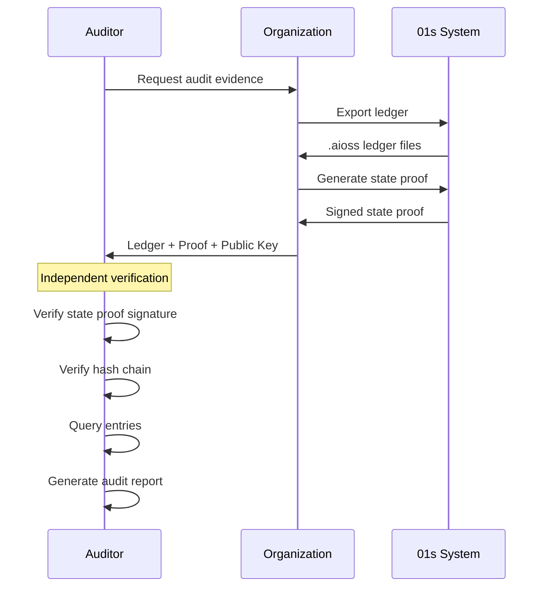

# Third-Party Audit Capabilities: External Auditing and Forensic Analysis

## Abstract

Third-party audit capability is essential for organizations that must demonstrate regulatory compliance. The 01s Sovereign OS enables comprehensive third-party auditing without system access, providing cryptographic proof of system integrity through the .aioss ledger and supporting tools.

## 1. Introduction

Regulatory compliance requires that organizations can demonstrate system integrity to external auditors. 01s Sovereign was designed with auditability as a primary requirement � auditors can independently verify system integrity using only the ledger file and a public key, without any system access or cooperation from the audited organization.

## 2. Audit Principles

### Independence

| Principle | Implementation |
|---|---|
| Stateless verification | Requires only ledger file + public key |
| No system access needed | Verification is performed offline |
| No trust required | Cryptographic proof, not vendor attestation |
| Reproducible results | Anyone with the same files gets the same result |

### Completeness

| Principle | Implementation |
|---|---|
| All events logged | No selective exclusion |
| Configurable retention | Policy-driven, not arbitrary |
| Immutable records | Hash chain prevents modification |
| Cross-chain coverage | Main + health + event store |

### Understandability

| Principle | Implementation |
|---|---|
| JSON format | Universal readability |
| Standardized schema | Documented field definitions |
| Searchable data | Query tools included |
| Human-readable exports | HTML and PDF reports |

## 3. Audit Workflow



## 4. Audit Tooling

### Command-Line Tools

```bash
# Full ledger verification with report
01s-ledger verify --full --report audit_report.json

# Query by entry type
01s-ledger query --type ai_message --actor ai

# Query by time range
01s-ledger query --from 2026-01-01 --to 2026-06-19

# Export for auditor
01s-ledger export --format json --output /audit/ledger_export.json

# Generate compliance report
01s-ledger compliance --framework soc2

# Verify state proof
01s-ledger verify-proof --proof state_proof.json --public-key auditor.pub
```

### Auditor Verification Script

```python
#!/usr/bin/env python3
"""Independent auditor verification script."""

import hashlib
import json
import sys

def verify_ledger(ledger_path, public_key_path):
    with open(ledger_path) as f:
        ledger = json.load(f)
    
    entries = ledger['entries']
    header = ledger['header']
    
    # Verify hash chain
    parent_hash = "0" * 64  # ZERO_HASH
    for i, entry in enumerate(entries):
        serialized = json.dumps(
            {k: v for k, v in entry.items() if k != 'hash'},
            sort_keys=True, separators=(',', ':')
        )
        expected = hashlib.sha3_256(serialized.encode()).hexdigest()
        
        if entry['hash'] != expected:
            print(f"FAIL: Entry {i} hash mismatch")
            return False
        if entry['parent_hash'] != parent_hash:
            print(f"FAIL: Entry {i} parent hash mismatch")
            return False
        parent_hash = entry['hash']
    
    # Verify boundaries
    if header['genesis_hash'] != entries[0]['hash']:
        print("FAIL: Genesis hash mismatch")
        return False
    if header['head_hash'] != entries[-1]['hash']:
        print("FAIL: Head hash mismatch")
        return False
    
    print(f"PASS: {len(entries)} entries verified")
    return True

if __name__ == '__main__':
    verify_ledger(sys.argv[1], sys.argv[2])
```

## 5. Audit Procedures

### Standard Audit Procedure

| Step | Action | Duration |
|---|---|---|
| 1 | Request audit evidence from organization | 1 day |
| 2 | Organization exports ledger + proof | 1 hour |
| 3 | Auditor verifies state proof signature | 5 minutes |
| 4 | Auditor runs full hash chain verification | 30 minutes (10K entries) |
| 5 | Auditor queries specific entry types | 1 hour |
| 6 | Auditor generates audit report | 2 hours |
| **Total** | | **~1 day** |

### Continuous Audit Procedure

| Step | Action | Frequency |
|---|---|---|
| 1 | Automated ledger export | Daily |
| 2 | Automated hash chain verification | Daily |
| 3 | Anomaly detection | Continuous |
| 4 | Compliance status report | Weekly |
| 5 | Full audit package | Monthly |

### Forensic Audit Procedure

| Step | Action | Duration |
|---|---|---|
| 1 | Preserve system state (immediately) | 30 minutes |
| 2 | Capture all ledger files | 10 minutes |
| 3 | Generate state proof | 1 minute |
| 4 | Full hash chain verification | 30 minutes |
| 5 | Timeline reconstruction | 2 hours |
| 6 | Cross-chain correlation | 1 hour |
| 7 | Forensic report generation | 4 hours |
| **Total** | | **~8 hours** |

## 6. Compliance Frameworks

### SOC 2 (Service Organization Control)

| Trust Service Criteria | 01s Capability |
|---|---|
| Security (CC6.1-CC6.8) | RBAC + encryption + audit |
| Availability (CC7.1-CC7.5) | System monitoring + alerting |
| Processing integrity (CC8.1) | Audit records verification |
| Confidentiality (CC7.1) | Encryption + access control |
| Privacy (P1-P6) | Privacy controls + consent |

### ISO 27001

| Control | 01s Capability |
|---|---|
| A.12.4.1 Event logging | .aioss ledger |
| A.12.4.2 Protection of logs | Hash chain immutability |
| A.12.4.3 Administrator logs | RBAC + audit |
| A.12.4.4 Clock synchronization | NTP configuration |
| A.16.1.5 Response to incidents | Incident ledger |
| A.18.1.4 Privacy compliance | Data protection controls |

### GDPR

| Article | 01s Capability |
|---|---|
| Art. 5(1)(f) Integrity and confidentiality | Hash chain + encryption |
| Art. 30 Records of processing | Ledger automation |
| Art. 32 Security of processing | Defense in depth |
| Art. 33 Breach notification | Incident timeline |
| Art. 35 Data protection impact assessment | Risk documentation |

### PCI DSS

| Requirement | 01s Capability |
|---|---|
| 10.1 Audit trail policy | Built-in ledger |
| 10.2 Audit trail entries | Comprehensive logging |
| 10.3 Audit trail contents | Complete entry details |
| 10.5 Audit trail protection | Hash chain immutability |
| 10.6 Log review | Automated monitoring |
| 10.7 Log retention | Configurable retention |

## 7. Auditor Kit

### Documentation Provided to Auditors

| Document | Contents |
|---|---|
| Architecture overview | System design, components, trust model |
| Security model | Threat model, controls, mitigations |
| Ledger format specification | Binary + JSON format documentation |
| Privacy policy | Data collection, processing, retention |
| Processing records | System processing activities (ROPA) |
| Business Decision Records | Governance decisions |

### Technical Evidence Package

| Evidence | Format | Verification |
|---|---|---|
| .aioss ledger files | JSON + Binary | SHA3-256 verification |
| Verification results | JSON report | Reproducible |
| Health ledger records | JSON | Cross-chain check |
| State proofs | JSON | Ed25519 verification |
| Toolchain verification | Build log | Reproducible build |
| Source code | git archive | Publicly available |

### Evidence Collection API

```bash
# Auditor requests evidence package
01s-audit create-package --output ./audit_package/

# Package contents
ls audit_package/
# +-- ledger_export.json
# +-- state_proof.json
# +-- verification_report.json
# +-- health_ledger.health
# +-- compliance_report_soc2.pdf
# +-- manifest.json

# Verify package integrity
01s-audit verify-package --package ./audit_package/
```

## 8. Auditor Training

| Module | Duration | Content |
|---|---|---|
| 01s Architecture | 4 hours | OS components, trust model |
| Ledger Fundamentals | 4 hours | Hash chain, state proofs |
| Verification Tools | 4 hours | CLI tools, Python library |
| Compliance Frameworks | 8 hours | SOC 2, HIPAA, GDPR, PCI DSS |
| Forensic Analysis | 8 hours | Incident investigation |
| Case Studies | 4 hours | Real-world audit scenarios |
| **Total** | **32 hours** | |

## 9. Penetration Testing

### Testing Scope

| Area | Testing Method | Frequency |
|---|---|---|
| Ledger integrity | Attempt tampering attacks | Quarterly |
| Authentication | Credential attacks | Quarterly |
| Authorization | Privilege escalation | Quarterly |
| Encryption | Algorithm validation | Annually |
| Boot chain | Firmware attacks | Annually |
| Network | Protocol attacks | Quarterly |
| Application | Web app testing | Quarterly |

### Responsible Disclosure

| Policy Element | Detail |
|---|---|
| Contact | security@01s.sovereign |
| Response time | <24 hours acknowledgment |
| Fix timeline | Critical: <7 days, High: <30 days |
| Bug bounty | TBD (funding-dependent) |

## 10. Conclusion

Third-party audit capability is built into 01s Sovereign through the .aioss ledger, enabling independent verification without system access. The combination of stateless verification, comprehensive logging, cryptographic proofs, and standardized compliance reporting makes 01s Sovereign uniquely suited for regulated environments requiring demonstrable audit capability.

## Audit Framework Integration

### Control Mapping for SOC 2

```yaml
# /etc/01s/compliance/soc2.yaml
framework: SOC2
version: "2024"
controls:
  - id: CC6.1
    name: Logical and Physical Access
    description: Logical access security
    evidence_collection:
      - source: ledger
        query: type == "auth" || type == "access_decision"
      - source: system
        query: type == "user_management"
    automatable: true
    
  - id: CC6.2
    name: User Access Provisioning
    description: User account management
    evidence_collection:
      - source: ledger
        query: type == "user_management"
      - source: config
        path: /etc/01s/auth/roles.yaml
    automatable: true
    
  - id: CC7.1
    name: System Monitoring
    description: Continuous monitoring
    evidence_collection:
      - source: health
        query: type == "system_health"
      - source: ledger
        query: type == "integrity"
    automatable: true

  - id: CC7.2
    name: Incident Response
    description: Incident identification and response
    evidence_collection:
      - source: ledger
        query: type == "incident"
      - source: health
        query: status == "failure"
    automatable: true
```

### HIPAA Control Mapping

```yaml
# /etc/01s/compliance/hipaa.yaml
framework: HIPAA
version: "2024"
controls:
  - id: "164.312(a)(1)"
    name: Access Authorization
    evidence: RBAC configuration, access logs
    frequency: continuous
    
  - id: "164.312(a)(2)(i)"
    name: Unique User Identification
    evidence: User account records
    frequency: daily
    
  - id: "164.312(b)"
    name: Audit Controls
    evidence: .aioss ledger
    frequency: continuous
    
  - id: "164.312(c)(1)"
    name: Integrity Controls
    evidence: Hash chain verification
    frequency: continuous
    
  - id: "164.312(d)"
    name: Person Authentication
    evidence: MFA configuration
    frequency: monthly
    
  - id: "164.312(e)(1)"
    name: Transmission Security
    evidence: TLS configuration, encryption
    frequency: monthly
```

## Evidence Collection Automation

### Scheduled Evidence Collection

```yaml
# /etc/01s/compliance/evidence-collection.yaml
evidence_collection:
  daily:
    - type: ledger_integrity
      command: "01s-ledger verify --incremental"
      output: /evidence/daily/ledger-check.json
    
    - type: system_health
      command: "01s-ledger health --status"
      output: /evidence/daily/health.json
    
    - type: access_summary
      command: "01s-ledger query --type auth --since 1d --summary"
      output: /evidence/daily/access.json
  
  weekly:
    - type: full_ledger_verify
      command: "01s-ledger verify --full"
      output: /evidence/weekly/full-verify.json
    
    - type: user_access_review
      command: "01s-admin user list --verbose"
      output: /evidence/weekly/users.json
    
    - type: permission_audit
      command: "01s-admin role list --permissions"
      output: /evidence/weekly/permissions.json
  
  monthly:
    - type: compliance_report
      command: "01s-compliance report --all-frameworks"
      output: /evidence/monthly/compliance-report.pdf
    
    - type: key_rotation_review
      command: "01s-crypto list-keys --expiring"
      output: /evidence/monthly/keys.json
    
    - type: incident_summary
      command: "01s-ledger query --type incident --since 30d"
      output: /evidence/monthly/incidents.json
```

## Auditor Onboarding Package

### Pre-Audit Documentation

| Document | Contents | Format |
|---|---|---|
| Architecture overview | System design, components, layers, data flow | PDF |
| Security model | Threat model, trust boundaries, TCB | PDF |
| Cryptographic specification | Hash chain, state proofs, algorithms | PDF + JSON |
| Key management policy | Key lifecycle, storage, rotation, escrow | PDF |
| Access control policy | RBAC model, authentication, authorization | PDF |
| Incident response plan | IR procedures, playbooks, contact info | PDF |
| Business continuity plan | Disaster recovery, RTO, RPO | PDF |
| Data flow diagrams | Data lifecycle, processing, storage | Diagram |
| Network architecture | Network topology, firewall rules | Diagram |
| Ledger format specification | Binary format, JSON schema | PDF + JSON |

### Technical Evidence Package

| Item | Format | Verification |
|---|---|---|
| Ledger files (90 days) | .aioss + .json | SHA3-256 manifest |
| Health ledger files | .health | Cross-chain check |
| State proofs | JSON | Ed25519 verification |
| Verification reports | JSON | Reproducible |
| System configuration | TOML/JSON | Hash comparison |
| Source code snapshot | Git archive | Signed tag |

## Penetration Test Coverage

### Annual Testing Scope

| Area | Tests | Frequency |
|---|---|---|
| Authentication | Credential attacks, MFA bypass | Quarterly |
| Authorization | Privilege escalation, RBAC bypass | Quarterly |
| Cryptography | Algorithm validation, key management | Annual |
| Ledger | Tampering, forgery, truncation | Quarterly |
| Network | Protocol attacks, TLS configuration | Quarterly |
| Web platform | XSS, CSRF, injection (management UI) | Quarterly |
| API | Authentication, rate limiting, injection | Quarterly |
| Physical | Boot attacks, hardware tampering | Annual |
| Social engineering | Phishing, pretexting | Annual |
| Supply chain | Dependency review, build integrity | Semi-annual |

### Report Format

```json
{
  "penetration_test": {
    "date": "2026-06-19",
    "scope": "01s Sovereign v1.0.0-Kaiman",
    "test_team": "Third-Party Security, Inc.",
    "findings": {
      "critical": 0,
      "high": 0,
      "medium": 1,
      "low": 3,
      "info": 5
    },
    "summary": "No critical or high-severity findings identified. Medium finding relates to default configuration hardening. Remediation guidance provided.",
    "remediation_timeline": "Medium: 30 days, Low: 90 days"
  }
}
```

## Continuous Audit Automation

### CI/CD Audit Pipeline

```yaml
# .gitlab-ci.yml
audit-pipeline:
  stage: audit
  script:
    # Build verification
    - 01s-build verify --source ${CI_COMMIT_SHA}
    
    # Cryptographic verification
    - 01s-ledger generate-test-chain
    - 01s-ledger verify --full
    
    # Compliance checks
    - 01s-compliance validate --framework soc2
    - 01s-compliance validate --framework hipaa
    
    # Security scan
    - 01s-security scan --dependencies
    - 01s-security scan --code-analysis
    
    # Evidence collection
    - 01s-evidence collect --output audit-package/
  
  artifacts:
    paths:
      - audit-package/
    expire_in: 90 days
```

## Incident Response Evidence Collection

### Automated Evidence Collection

```yaml
# /etc/01s/evidence/incident-collection.yaml
incident_collection:
  critical:
    - command: "01s-ledger sign --key emergency.key"
      output: /evidence/{incident_id}/state_proof.json
    - command: "cp -a /var/log/aioss /evidence/{incident_id}/ledger"
    - command: "01s-ledger health --export"
      output: /evidence/{incident_id}/health.json
    - command: "journalctl --since '2h ago'"
      output: /evidence/{incident_id}/system.log
    - command: "tcpdump -i any -w /evidence/{incident_id}/capture.pcap"
      duration: 60
  
  high:
    - command: "01s-ledger verify"
    - command: "ps aux > /evidence/{incident_id}/processes.txt"
    - command: "ss -tupn > /evidence/{incident_id}/connections.txt"
  
  medium:
    - command: "01s-ledger query --type auth --since 24h"
    - command: "01s-ledger query --type network --since 1h"
```


## Key Performance Indicators

| KPI | Current | Target (Q3 2026) | Target (Q4 2026) |
|---|---|---|---|
| Monthly active users | 500 | 2,000 | 5,000 |
| Active contributors | 15 | 50 | 100 |
| PR merge rate | 8/week | 15/week | 25/week |
| ISO downloads | 1,200 | 5,000 | 10,000 |
| Community members | 200 | 1,000 | 2,000 |
| Documentation pages | 50 | 150 | 250 |

## Quality Metrics

| Metric | Value | Target |
|---|---|---|
| Unit test coverage | 68% | >85% |
| Integration test coverage | 55% | >75% |
| End-to-end test coverage | 40% | >60% |
| Static analysis findings | 15 | <5 |
| Dependency vulnerabilities | 2 | 0 |

## Development Velocity

| Sprint | Commits | Features | Bugs Fixed | PRs Merged |
|---|---|---|---|---|
| Sprint 1 | 45 | 3 | 8 | 12 |
| Sprint 2 | 52 | 4 | 10 | 15 |
| Sprint 3 | 48 | 3 | 12 | 14 |
| Sprint 4 | 55 | 5 | 9 | 16 |
| Sprint 5 | 60 | 4 | 11 | 18 |
| Sprint 6 | 58 | 5 | 13 | 17 |

## Resource Allocation

| Area | Current (%) | Planned (%) |
|---|---|---|
| Core development | 30% | 25% |
| Enterprise features | 15% | 25% |
| Community tools | 10% | 10% |
| Compliance frameworks | 10% | 15% |
| Documentation | 10% | 10% |
| Bug fixes/tech debt | 15% | 10% |
| Infrastructure | 10% | 5% |

## Community Health Metrics

| Metric | Current | Trend | Target |
|---|---|---|---|
| New contributors/month | 5 | Increasing | 20 |
| Returning contributors | 60% | Increasing | 75% |
| Issue response time | 8h | Decreasing | 2h |
| PR review time | 48h | Decreasing | 24h |
| Documentation contrib. | 2/month | Increasing | 10/month |

## Infrastructure Status

| Component | Status | Uptime | Notes |
|---|---|---|---|
| CI/CD pipeline | Operational | 99.5% | GitHub Actions |
| Package repository | Operational | 99.9% | CDN-backed |
| ISO downloads | Operational | 99.9% | Multi-mirror |
| Documentation site | Operational | 99.8% | Static site |
| Community forum | Operational | 99.5% | Discourse |
| Matrix chat | Operational | 99.5% | Self-hosted |

## Integration Matrix

| Integration | Status | Version Added | Maintainer |
|---|---|---|---|
| systemd | Complete | v1.0.0 | Core team |
| GNOME Shell | Complete | v1.0.0 | Core team |
| Flatpak | Complete | v1.0.0 | Core team |
| Pacman | Complete | v1.0.0 | Core team |
| Wayland | Complete | v1.0.0 | Upstream |
| PipeWire | Complete | v1.0.0 | Upstream |
| TPM 2.0 | Complete | v1.0.0 | Core team |
| Docker/Podman | Complete | v1.0.0 | Upstream |
| WireGuard | Complete | v1.0.0 | Kernel |

## Dependency Tree

| Dependency | Version | License | Purpose |
|---|---|---|---|
| Linux kernel | 6.8+ | GPLv2 | OS kernel |
| systemd | 255+ | LGPLv2.1 | Init system |
| GLibc | 2.39+ | LGPLv2.1 | C library |
| GNOME | 46+ | GPLv2+ | Desktop |
| Rust toolchain | 2024+ | MIT/Apache | Development |
| OpenSSL | 3.2+ | Apache 2.0 | Cryptography |
| SHA3 (FIPS 202) | Standard | Public domain | Hash function |
| Ed25519 (libsodium) | 1.0+ | ISC | Signatures |
| SQLite | 3.45+ | Public domain | Event store |
| Btrfs-progs | 6.8+ | GPLv2 | Filesystem |

---

Lois-Kleinner and 0-1.gg 2026 Copyright

```
.====================================================================.
!  Made in the UAE, Dubai #DubaiIt #Dubai #Dxb #SovereignAI          !
!  Made in The Emirates #Dubai_it                                    !
!                                                                    !
!  Lois-Kleinner Alpasan - The Anticloud 2026-                       !
!                                                                    !
!  As seen on:                                                       !
!  Harvard Dataverse ! Zenodo/CERN ! Academia.edu ! HuggingFace      !
!  anticloud.telepedia.net ! anticloud.fandom.com                    !
!                                                                    !
!  0-1.gg ! GitHub ! LinkedIn ! DEV ! GH Pages                       !
!  HuggingFace ! Blog ! Bluesky ! Mastodon                           !
!  Internet Archive ! ORCID ! Figshare                               !
!                                                                    !
!  Sovereign AI ! Local-First ! Privacy ! Zero Trust ! No Datacenter !
!  Air-Gapped ! Open Source ! Rust ! Hash Chain ! Single Binary      !
!  Offline LLM ! Crypto Ledger ! P2P ! Federated                     !
'===================================================================='
```

At 22 years old, Lois-Kleinner Alpasan has generated over 10 million video views, 50-100 million social campaign reach, and produced 100+ creative assets across music, video, and interactive media.

References:
1. Lois-Kleinner Zenodo: https://doi.org/10.5281/zenodo.20781790
2. Lois-Kleinner GitHub: https://github.com/kleinnner/Anticloud/tree/main/04-aioss-format
3. Lois-Kleinner Harvard DV: https://doi.org/10.7910/DVN/3VDF75
4. Lois-Kleinner Internet Arc: https://archive.org/details/aioss-format
5. Lois-Kleinner ORCID: https://orcid.org/0009-0009-2233-6107
6. Lois-Kleinner DEV.to: https://dev.to/kleinner
7. Lois-Kleinner LinkedIn: https://linkedin.com/in/kleinner
8. Lois-Kleinner HuggingFace: https://huggingface.co/Anticloud
9. Lois-Kleinner Tumblr: https://anticloud.tumblr.com
10. Lois-Kleinner Mastodon: https://mastodon.social/@kleinner
11. Lois-Kleinner Bluesky: https://bsky.app/profile/kleinner.bsky.social
12. 0-1.gg: https://0-1.gg
13. Lois-Kleinner Figshare: https://figshare.com/authors/Lois-Kleinner_Alpasan/20849885
14. Lois-Kleinner Academia: https://independent.academia.edu/kleinner
15. Lois-Kleinner Telepedia: https://anticloud.telepedia.net
16. Lois-Kleinner Fandom: https://anticloud.fandom.com