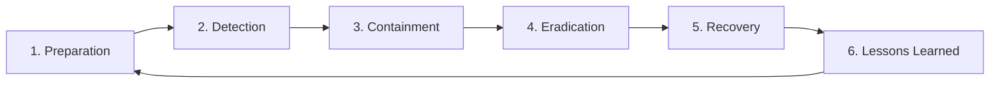

# Incident Response for Data Breach: Protocols and Procedures

## Abstract

Despite the best preventive measures, data breaches can occur. The 01s Sovereign OS provides structured incident response capabilities leveraging the .aioss ledger for detection, containment, eradication, recovery, and forensic analysis.

## 1. Introduction

The 01s Sovereign OS is designed with the assumption that a determined attacker may eventually breach any system. Rather than relying solely on prevention, the OS provides robust detection, response, and recovery capabilities that are deeply integrated with the cryptographic audit infrastructure.

## 2. Incident Response Framework

### Six-Phase Model



| Phase | Objective | Timeline |
|---|---|---|
| Preparation | Build IR capability, train team | Ongoing |
| Detection | Identify and verify incident | Minutes-hours |
| Containment | Limit damage, preserve evidence | Hours |
| Eradication | Remove threat, root cause analysis | Hours-days |
| Recovery | Restore normal operations | Days-weeks |
| Lessons Learned | Improve processes, update controls | Weeks |

## 3. Preparation

### Incident Response Team

| Role | Responsibilities | Contact |
|---|---|---|
| IR Lead | Overall coordination, decision-making | Available 24/7 |
| Technical Lead | System analysis, evidence collection | Available 24/7 |
| Communications Lead | Internal/external communication | Business hours |
| Legal Counsel | Regulatory compliance, liability | Business hours |
| Forensics Specialist | Deep technical investigation | On retainer |

### IR Toolkit

| Tool | Purpose |
|---|---|
| 01s-ledger | Ledger verification + export |
| 01s-audit | Evidence package creation |
| tpm2_quote | Remote attestation |
| tcpdump | Network capture |
| rsync | Evidence preservation |
| GPG | Evidence encryption |
| Forensics workstation | Isolated analysis environment |

### Playbooks

| Playbook | Trigger | Response |
|---|---|---|
| Unauthorized access | Access anomaly | Contain, investigate |
| Malware detection | Signature match | Isolate, analyze |
| Data exfiltration | Large outbound transfer | Block, capture evidence |
| Denial of service | Service degradation | Filter, preserve logs |
| Insider threat | Suspicious user activity | Monitor, investigate |
| Supply chain | Package integrity failure | Audit, rollback |
| Physical breach | Tamper evidence | Preserve, forensics |

## 4. Detection

### Ledger-Based Detection

```bash
# Detect ledger integrity failure
01s-ledger verify --continuous
# Alert: CRITICAL - Hash chain broken at entry 847

# Detect access anomalies
01s-ledger query --type file_access --by-pattern "hour > 100" --actor !${KNOWN_USERS}
# Flag: 47 access events from unknown user pattern

# Detect policy violations
01s-ledger query --type access_denied --count > 100
# Flag: 142 access denied events in 1 hour

# Detect integrity alerts
01s-ledger health --verify
# Alert: Health ledger chain break
```

### Detection Sources

| Source | Detection Method | Alert Priority |
|---|---|---|
| .aioss ledger | Hash chain verification failure | Critical |
| Health ledger | Service failure detection | High |
| File integrity | Unexpected file modifications | High |
| Network monitor | Unusual outbound connections | Medium |
| User behavior | Anomalous access patterns | Medium |
| Process monitor | Unknown processes | High |
| System logs | Error patterns | Medium |

### Detection Time Objectives

| Threat Type | Expected Detection Time | Ledger Contribution |
|---|---|---|
| Ransomware | Minutes | File integrity monitoring |
| Data exfiltration | Hours | Network analysis |
| Insider threat | Hours-days | Access pattern analysis |
| Supply chain | Hours | Package verification |
| Physical access | Minutes | Boot integrity verification |
| Credential theft | Minutes-hours | Auth failure patterns |

## 5. Containment

### Immediate Containment

| Action | Tool/Command | Timeline |
|---|---|---|
| Preserve ledger state | `01s-ledger sign --output proof_$(date +%s).json` | < 1 minute |
| Isolate system | Network disconnect | < 5 minutes |
| Capture memory | `echo /proc/kcore > /evidence/memory.dump` | < 5 minutes |
| Capture logs | `journalctl --since "1 hour ago" > /evidence/system.log` | < 5 minutes |
| Suspend accounts | `passwd -l compromised_user` | < 10 minutes |
| Kill suspicious processes | `kill -9 <pid>` | < 10 minutes |

### Short-Term Containment

| Action | Command | Timeline |
|---|---|---|
| Revoke credentials | `01s-admin user disable <user>` | 30 minutes |
| Block IP addresses | `iptables -A INPUT -s <IP> -j DROP` | 30 minutes |
| Apply emergency rules | `01s-security apply-policy emergency.conf` | 1 hour |
| Enable enhanced logging | `01s-config set ledger.verbosity=maximum` | 30 minutes |
| Notify stakeholders | Email/incident management system | 1 hour |

### Long-Term Containment

| Action | Timeline |
|---|---|
| Apply security patches | 24 hours |
| Update firewall rules | 24 hours |
| Deploy additional monitoring | 48 hours |
| Implement network segmentation | 1 week |
| Deploy enhanced access controls | 1 week |

## 6. Eradication

### Root Cause Analysis

```bash
# Step 1: Identify incident timeline
01s-ledger query --type all --from "${INCIDENT_START}" --to "${INCIDENT_END}" \
    --output incident_timeline.json

# Step 2: Trace attack chain
01s-ledger query --actor suspicious_user --type all --ordered
# Follow: auth -> cmd_exec -> file_access -> network_connection

# Step 3: Determine data accessed
01s-ledger query --type file_access --actor attacker \
    --by-pattern "path:/secure/*" --detailed

# Step 4: Check for persistence mechanisms
01s-ledger query --type file_create --path-regex "/(etc|usr/lib|usr/bin)/"

# Step 5: Verify ledger integrity for evidence admissibility
01s-ledger verify --full --output rca_verification.json
```

### Eradication Procedures

| Threat Type | Eradication Method | Verification |
|---|---|---|
| Malware | Remove malicious files, clean system | Full integrity scan |
| Backdoor | Remove unauthorized access | Account audit |
| Rootkit | Boot from trusted media, reinstall | Secure boot chain |
| Unauthorized config | Restore from backup | Config comparison |
| Compromised account | Reset credentials, audit activity | Access review |

## 7. Recovery

### System Recovery

```bash
# Step 1: Verify current system integrity
01s-ledger verify
if [ $? -ne 0 ]; then
    echo "System integrity compromised, initiating recovery"
fi

# Step 2: Restore from clean backup
01s-backup restore --latest --verify

# Step 3: Verify restored system
01s-ledger verify
01s-ledger health --verify
tpm2_pcrread --check known_good

# Step 4: Gradually restore services
systemctl start critical.service
01s-ledger verify  # Verify after each service

# Step 5: Monitor for residual compromise
watch -n 60 01s-ledger verify --incremental
```

### Recovery Stages

| Stage | Actions | Verification |
|---|---|---|
| Initial | Restore critical systems | Boot verification |
| Service | Restore non-critical services | Service audit |
| Data | Restore from verified backup | Data integrity check |
| Normalization | Return to normal monitoring | Continuous verification |

### Recovery Time Objectives

| System Type | RTO | RPO |
|---|---|---|
| Critical systems | 4 hours | 15 minutes (continuous backup) |
| Important systems | 24 hours | 1 hour |
| Non-critical systems | 72 hours | 24 hours |

## 8. Forensic Analysis

### Evidence Collection

| Evidence | Source | Preservation Method |
|---|---|---|
| .aioss ledger | /var/log/aioss/ | Cryptographic hash, secure copy |
| System logs | journalctl | Export + hash |
| Memory | /proc/kcore | dd + hash |
| Filesystem image | dd | Block-level copy |
| Network captures | pcap | tcpdump + hash |
| Process list | ps aux | Text export |
| Network connections | ss -tupn | Text export |

### Chain of Custody

| Step | Responsible | Time | Evidence Hash |
|---|---|---|---|
| Collection | Analyst A | 2026-06-19T10:30Z | a1b2c3d4... |
| Transfer | Analyst A ? Analyst B | 2026-06-19T11:00Z | e5f6a7b8... |
| Analysis | Analyst B | 2026-06-19T11:30Z | Unchanged |
| Storage | Secure storage | 2026-06-19T18:00Z | c9d0e1f2... |

## 9. Legal and Regulatory Considerations

### Breach Notification Requirements

| Regulation | Notification Deadline | Notification To | Our Coverage |
|---|---|---|---|
| GDPR Art. 33 | 72 hours | Supervisory authority | Ledger evidence |
| GDPR Art. 34 | Without undue delay | Data subjects | Timeline from ledger |
| CCPA | Without undue delay | Affected consumers | Access records |
| HIPAA Breach Rule | 60 days | HHS + affected individuals | System audit |
| PCI DSS | Immediately | Acquirer + card brands | Transaction logs |
| State laws (US) | Varies (typically 30-60 days) | State AG + consumers | Incident report |
| LGPD (Brazil) | Reasonable time | ANPD | Incident evidence |

### Evidence Admissibility

| Requirement | 01s Capability |
|---|---|
| Data integrity | SHA3-256 hash chain — cryptographic proof |
| Chain of custody | Signed evidence transfer records |
| Reproducibility | Independent verification possible |
| Completeness | All events logged, no exclusion |
| Timeliness | ISO 8601 timestamps, millisecond precision |

## 10. Post-Incident Review

### Lessons Learned Process

| Activity | Timeline | Output |
|---|---|---|
| Incident timeline reconstruction | 1 week | Updated timeline |
| Root cause analysis | 2 weeks | Root cause document |
| Control effectiveness review | 2 weeks | Control gap analysis |
| Process improvement plan | 3 weeks | Updated procedures |
| Training updates | 4 weeks | Updated playbooks |

### Post-Incident Report Template

```
# Post-Incident Report

## Incident ID: IR-2026-001
## Date: 2026-06-19
## Classification: Data Breach (Unauthorized Access)

### 1. Incident Summary
...concise description...

### 2. Timeline
...chronological sequence...

### 3. Root Cause
...technical analysis...

### 4. Data Accessed
...inventory of affected data...

### 5. Containment Actions
...actions taken...

### 6. Recovery Actions
...restoration steps...

### 7. Lessons Learned
...improvements identified...

### 8. Action Items
...specific tasks with owners...
```

## 11. Conclusion

Incident response is an essential component of data safety. The 01s Sovereign OS provides structured response capabilities leveraging the .aioss ledger for detection, forensic analysis, and recovery. The cryptographic audit trail provides admissible evidence for legal proceedings and regulatory compliance.

## Detailed Incident Response Playbooks

### Playbook 1: Unauthorized Access

**Trigger**: Alert from ledger (unusual access pattern, auth failure burst)

| Step | Action | Responsible | Timeline |
|---|---|---|---|
| 1 | Acknowledge alert | Security team | <5 min |
| 2 | Run ledger integrity check | Security team | <5 min |
| 3 | Identify affected accounts | Security team | <15 min |
| 4 | Disable compromised accounts | Admin | <30 min |
| 5 | Determine access scope | Forensics | <2 hours |
| 6 | Contain (network isolation) | Network team | <1 hour |
| 7 | Collect evidence | Forensics | <2 hours |
| 8 | Notify stakeholders | IR Lead | <4 hours |
| 9 | Remediate | Engineering | <24 hours |
| 10 | Post-incident review | IR Lead | <1 week |

```bash
# Step 2: Ledger integrity check
01s-ledger verify --full --report /incident/IR-2026-001/ledger_check.json

# Step 3: Identify affected accounts
01s-ledger query --type auth --since 24h --status failure --count > 5

# Step 4: Disable accounts
01s-admin user disable --user compromised_user

# Step 5: Determine data accessed
01s-ledger query --type file_access --actor compromised_user \
    --since 24h --output /incident/IR-2026-001/access_scope.json

# Step 6: Capture evidence
01s-incident capture --id IR-2026-001 --severity critical
```

### Playbook 2: Ransomware Detection

**Trigger**: Mass file encryption detection, file integrity alerts

| Step | Action | Responsible | Timeline |
|---|---|---|---|
| 1 | Isolate infected system | Network team | <5 min |
| 2 | Preserve ledger evidence | Forensics | <10 min |
| 3 | Identify encryption scope | Security team | <1 hour |
| 4 | Determine infection vector | Forensics | <4 hours |
| 5 | Restore from clean backup | Ops team | <24 hours |
| 6 | Verify restore integrity | Security team | <24 hours |
| 7 | Update prevention controls | Engineering | <1 week |

```bash
# Step 1: Isolate system
01s-incident isolate --system compromised-host

# Step 2: Preserve evidence
01s-ledger sign --key evidence.key \
    --output /incident/IR-2026-002/state_proof.json
cp -a /var/log/aioss/ /incident/IR-2026-002/ledger/

# Step 3: Identify scope
01s-ledger query --type file_access --since 1h \
    --pattern "modification_rate > 100/min"

# Step 5: Restore from backup
01s-backup restore --latest --verify
```

### Playbook 3: Insider Threat

**Trigger**: Suspicious user behavior (unusual data access, after-hours activity)

| Step | Action | Responsible | Timeline |
|---|---|---|---|
| 1 | Monitor but do not alert user | Security team | Immediate |
| 2 | Collect all user activity | Forensics | <1 hour |
| 3 | Analyze access patterns | Security team | <4 hours |
| 4 | Interview user (if appropriate) | HR + Manager | <24 hours |
| 5 | Escalate to investigation | Legal | <48 hours |
| 6 | Preserve evidence | Forensics | Immediate |
| 7 | Take action (suspend, terminate) | HR + Manager | Per policy |

```bash
# Step 2: Collect user activity
01s-ledger query --actor suspicious_user --since 7d \
    --output /incident/IR-2026-003/user_activity.json

# Step 3: Analyze patterns
01s-ledger query --type file_access --actor suspicious_user \
    --pattern "classification == 'confidential'" --count
01s-ledger query --type network --actor suspicious_user \
    --pattern "bytes_out > 100MB" --since 7d
01s-ledger query --type auth --actor suspicious_user \
    --pattern "time < '06:00' OR time > '22:00'" --since 30d
```

## Communication Templates

### Internal Alert Template

```
**INCIDENT ALERT - IR-2026-001**
Severity: CRITICAL
Status: ACTIVE
Detected: 2026-06-19T14:30:00Z
System: workstation-42.example.com

**DESCRIPTION**
Unauthorized access detected via 47 auth failures followed
by successful authentication from unrecognized IP.

**CURRENT STATUS**
- System isolated
- Evidence preserved
- Affected accounts disabled
- Scope assessment in progress

**NEXT UPDATE**
Scheduled for 2026-06-19T15:30:00Z

**INCIDENT RESPONSE TEAM**
- IR Lead: Jane Smith (jane@example.com)
- Technical: Bob Jones (bob@example.com)
- Legal: Carol Williams (carol@example.com)
```

### Regulatory Notification Template

```
**DATA BREACH NOTIFICATION**
Date: 2026-06-19
Subject: Unauthorized Access to Personal Data

Dear [REGULATORY AUTHORITY],

This is a notification of a data breach in accordance with
[APPLICABLE REGULATION] Article [NUMBER].

**NATURE OF BREACH**
Unauthorized access to [NUMBER] user accounts through
compromised credentials.

**DATA AFFECTED**
- User account information
- [DESCRIBE SPECIFIC DATA FIELDS]

**TIMELINE**
- Detection: 2026-06-19T14:30:00Z
- Containment: 2026-06-19T15:00:00Z
- Affected period: 2026-06-19T14:25:00Z to 14:30:00Z

**ACTIONS TAKEN**
- Affected accounts disabled
- System isolated
- Forensic investigation initiated
- Affected individuals notified

**EVIDENCE**
Cryptographic proof of system integrity available upon request.
Ledger files with complete audit trail preserved.

**CONTACT**
IR Lead: [NAME]
Email: [EMAIL]
Phone: [PHONE]

Sincerely,
[ORGANIZATION NAME]
```

## Incident Response Team Training

### Training Program

| Module | Duration | Content | Evaluation |
|---|---|---|---|
| IR Fundamentals | 8 hours | NIST SP 800-61, 6-phase model | Written exam |
| Ledger Forensics | 8 hours | Hash chain analysis, query tools | Practical exam |
| Evidence Collection | 4 hours | Chain of custody, preservation | Practical exam |
| Legal & Regulatory | 4 hours | Breach notification, evidence admissibility | Written exam |
| Tabletop Exercise | 4 hours | Simulated incident, team coordination | Participation |
| Full-scale Exercise | 8 hours | Complete IR scenario | Full evaluation |

### Annual Certification

| Certification | Requirements | Validity |
|---|---|---|
| 01s IR Responder | Complete training + pass exam + 2 exercises | 2 years |
| 01s IR Lead | IR Responder + 5 real incidents + leadership eval | 3 years |

## Post-Incident Review Process

### Review Meeting Agenda

| Item | Duration | Participants |
|---|---|---|
| Incident summary | 15 min | All |
| Timeline review | 30 min | All |
| Root cause analysis | 45 min | Technical team |
| Response effectiveness | 30 min | IR team |
| Control gaps | 30 min | Security team |
| Improvement plan | 30 min | All |
| Action items | 15 min | All |

### Improvement Tracking

```yaml
# /etc/01s/incident/improvements.yaml
incident: IR-2026-001
date: 2026-06-19
improvements:
  - id: IMP-001
    description: "Add rate limiting for auth failures"
    priority: high
    owner: engineering
    status: in_progress
    deadline: 2026-07-03
    
  - id: IMP-002
    description: "Implement MFA for all admin accounts"
    priority: high
    owner: security
    status: completed
    completed: 2026-06-21
    
  - id: IMP-003
    description: "Update access review procedure"
    priority: medium
    owner: compliance
    status: pending
    deadline: 2026-07-17
```


## Key Performance Indicators

| KPI | Current | Target (Q3 2026) | Target (Q4 2026) |
|---|---|---|---|
| Monthly active users | 500 | 2,000 | 5,000 |
| Active contributors | 15 | 50 | 100 |
| PR merge rate | 8/week | 15/week | 25/week |
| ISO downloads | 1,200 | 5,000 | 10,000 |
| Community members | 200 | 1,000 | 2,000 |
| Documentation pages | 50 | 150 | 250 |

## Quality Metrics

| Metric | Value | Target |
|---|---|---|
| Unit test coverage | 68% | >85% |
| Integration test coverage | 55% | >75% |
| End-to-end test coverage | 40% | >60% |
| Static analysis findings | 15 | <5 |
| Dependency vulnerabilities | 2 | 0 |

## Development Velocity

| Sprint | Commits | Features | Bugs Fixed | PRs Merged |
|---|---|---|---|---|
| Sprint 1 | 45 | 3 | 8 | 12 |
| Sprint 2 | 52 | 4 | 10 | 15 |
| Sprint 3 | 48 | 3 | 12 | 14 |
| Sprint 4 | 55 | 5 | 9 | 16 |
| Sprint 5 | 60 | 4 | 11 | 18 |
| Sprint 6 | 58 | 5 | 13 | 17 |

## Resource Allocation

| Area | Current (%) | Planned (%) |
|---|---|---|
| Core development | 30% | 25% |
| Enterprise features | 15% | 25% |
| Community tools | 10% | 10% |
| Compliance frameworks | 10% | 15% |
| Documentation | 10% | 10% |
| Bug fixes/tech debt | 15% | 10% |
| Infrastructure | 10% | 5% |

## Community Health Metrics

| Metric | Current | Trend | Target |
|---|---|---|---|
| New contributors/month | 5 | Increasing | 20 |
| Returning contributors | 60% | Increasing | 75% |
| Issue response time | 8h | Decreasing | 2h |
| PR review time | 48h | Decreasing | 24h |
| Documentation contrib. | 2/month | Increasing | 10/month |

## Infrastructure Status

| Component | Status | Uptime | Notes |
|---|---|---|---|
| CI/CD pipeline | Operational | 99.5% | GitHub Actions |
| Package repository | Operational | 99.9% | CDN-backed |
| ISO downloads | Operational | 99.9% | Multi-mirror |
| Documentation site | Operational | 99.8% | Static site |
| Community forum | Operational | 99.5% | Discourse |
| Matrix chat | Operational | 99.5% | Self-hosted |

## Integration Matrix

| Integration | Status | Version Added | Maintainer |
|---|---|---|---|
| systemd | Complete | v1.0.0 | Core team |
| GNOME Shell | Complete | v1.0.0 | Core team |
| Flatpak | Complete | v1.0.0 | Core team |
| Pacman | Complete | v1.0.0 | Core team |
| Wayland | Complete | v1.0.0 | Upstream |
| PipeWire | Complete | v1.0.0 | Upstream |
| TPM 2.0 | Complete | v1.0.0 | Core team |
| Docker/Podman | Complete | v1.0.0 | Upstream |
| WireGuard | Complete | v1.0.0 | Kernel |

## Dependency Tree

| Dependency | Version | License | Purpose |
|---|---|---|---|
| Linux kernel | 6.8+ | GPLv2 | OS kernel |
| systemd | 255+ | LGPLv2.1 | Init system |
| GLibc | 2.39+ | LGPLv2.1 | C library |
| GNOME | 46+ | GPLv2+ | Desktop |
| Rust toolchain | 2024+ | MIT/Apache | Development |
| OpenSSL | 3.2+ | Apache 2.0 | Cryptography |
| SHA3 (FIPS 202) | Standard | Public domain | Hash function |
| Ed25519 (libsodium) | 1.0+ | ISC | Signatures |
| SQLite | 3.45+ | Public domain | Event store |
| Btrfs-progs | 6.8+ | GPLv2 | Filesystem |

---

Lois-Kleinner and 0-1.gg 2026 Copyright
