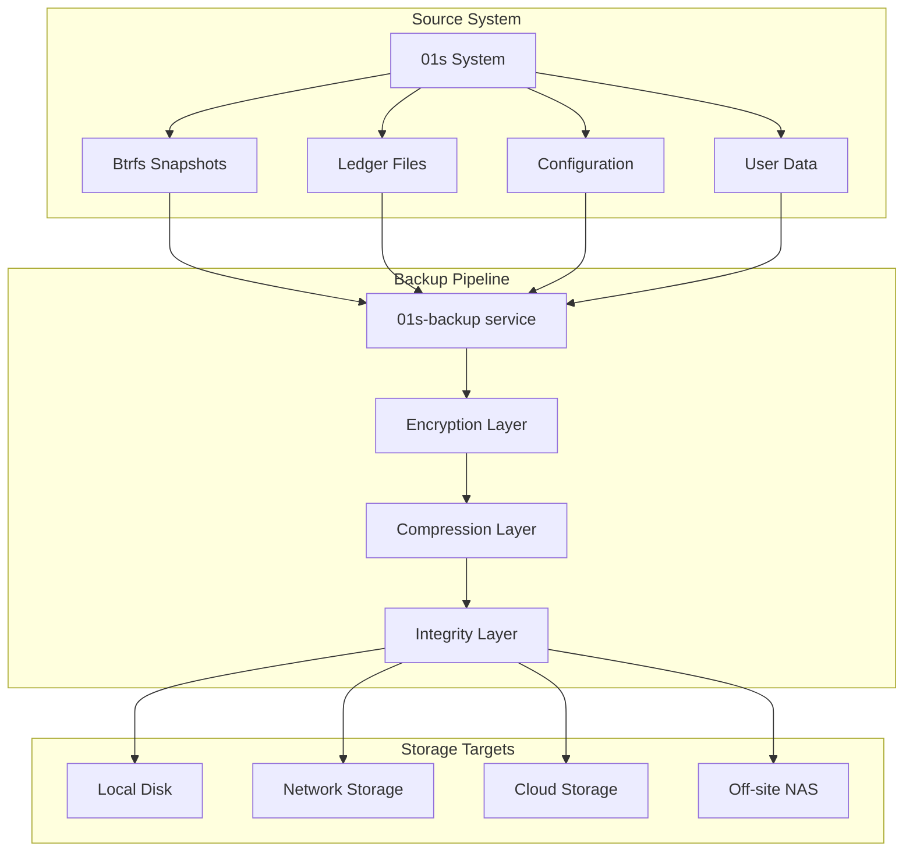

# Backup and Recovery for Data Integrity: Ensuring Data Safety

## Abstract

Data backup and recovery are critical components of data safety. The 01s Sovereign OS integrates backup with the cryptographic integrity architecture, ensuring that restored data is verifiably intact and that backup copies maintain the same integrity guarantees as the original data.

## 1. Introduction

No data safety architecture is complete without robust backup and recovery capabilities. The 01s Sovereign OS provides integrated backup tools that preserve cryptographic integrity guarantees � ensuring that backups can be independently verified and that restoration can be cryptographically proven.

## 2. Backup Principles

### The 3-2-1 Rule

| Component | Requirement | 01s Implementation |
|---|---|---|
| 3 copies | Original + local backup + off-site backup | Automated backup pipeline |
| 2 different media | SSD + HDD + cloud/tape | Configurable destinations |
| 1 off-site | Separate physical location | Cloud or remote storage |

### Backup Types

| Type | Description | Frequency | Storage Impact |
|---|---|---|---|
| Full | Complete system image | Weekly | ~20-40GB |
| Incremental | Changes since last backup | Daily | ~1-5GB |
| Differential | Changes since last full | Daily | ~2-10GB |
| Continuous | Real-time file changes | Every change | Varies |
| Snapshot | Btrfs filesystem snapshot | Pre-update | Minimal (COW) |

### What Must Be Preserved

| Data Type | Backup Method | Verification |
|---|---|---|
| User files | File-level backup | SHA3-256 checksums |
| System files | Image-level backup | Boot verification |
| .aioss ledger | Continuous copy + full backup | Hash chain verification |
| Encryption keys | Secure key escrow | Key fingerprint |
| Configuration | Export + backup | Config verification |
| Database (event store) | SQLite backup + verification | Integrity check |

## 3. Backup Architecture



## 4. Backup Tools

### Built-in Backup Tool

```bash
# Create a full backup
01s-backup create --full --output /mnt/backup/01s_full_$(date +%Y%m%d)

# Create incremental backup
01s-backup create --incremental --base /mnt/backup/01s_full_20260619

# Create encrypted backup
01s-backup create --full --encrypt --recipient backup-key

# Verify backup integrity
01s-backup verify --backup /mnt/backup/01s_full_20260619

# List available backups
01s-backup list

# Schedule automated backups
01s-backup schedule --daily --time 02:00 --target /mnt/backup/daily/
```

### Standard Backup Tools with Integrity

```bash
# tar with integrity verification
tar -cf backup.tar /home/ /etc/ /var/log/aioss/
sha3sum backup.tar > backup.tar.sha3

# rsync with checksum verification
rsync -av --checksum /data/ /mnt/backup/data/

# Ledger-specific backup
cp /var/log/aioss/*.aioss /mnt/backup/ledger/
01s-ledger verify --directory /mnt/backup/ledger/
```

### Ledger Backup Commands

```bash
# Export complete ledger
01s-ledger export --all --output /backup/ledger/ledger_export.json

# Verify exported ledger
01s-ledger verify --file /backup/ledger/ledger_export.json

# Backup with state proof
01s-ledger sign --key backup-key.key \
    --output /backup/ledger/state_proof.json

# Verify backup consistency
01s-ledger cross-check \
    --main /backup/ledger/ledger_export.json \
    --health /backup/ledger/health_ledger.health
```

## 5. Backup Encryption

### Encryption Options

```bash
# Encrypt backup with recipient public key
01s-backup create --full --encrypt --recipient backup-admin@example.com

# Encrypt with symmetric key
01s-backup create --full --encrypt --passphrase-file /etc/backup/key

# Encrypt backup media with LUKS
cryptsetup luksFormat /dev/sdb1
cryptsetup open /dev/sdb1 backup_drive
01s-backup create --full --output /mnt/backup_drive/
```

### Key Management for Backup

| Key | Purpose | Storage | Recovery |
|---|---|---|---|
| Backup recipient key | Encrypt backup archives | Key escrow | Social recovery |
| Backup signing key | Sign backup manifests | TPM-sealed | Key escrow |
| LUKS backup key | Encrypt backup media | Separate location | Key escrow |
| One-time recovery key | Emergency restore | Printed + safe | Physical access |

## 6. Recovery Procedures

### Full System Recovery

```bash
# Boot from recovery media
# Step 1: Decrypt backup
gpg --decrypt /backup/01s_full_20260619.tar.gpg > 01s_full_20260619.tar

# Step 2: Verify backup integrity
sha3sum --check 01s_full_20260619.tar.sha3

# Step 3: Restore system
01s-backup restore --source /backup/01s_full_20260619.tar --target /

# Step 4: Verify restored system
01s-ledger verify --skip-external
```

### File-Level Recovery

```bash
# Restore specific files
01s-backup restore-file --backup /mnt/backup/daily/20260619 \
    --path /home/user/documents/important.pdf

# Restore with integrity check
01s-backup restore-file --verify --backup /mnt/backup/daily/20260619 \
    --path /etc/ssh/sshd_config

# List files in backup
01s-backup list-files --backup /mnt/backup/daily/20260619 \
    --path /home/user/
```

### Ledger Recovery

```bash
# Restore ledger from backup
01s-ledger restore --source /backup/ledger/ledger_export.json \
    --target /var/log/aioss/

# Verify restored ledger
01s-ledger verify --verify-backup

# Restore state proof
01s-ledger verify-proof --proof /backup/ledger/state_proof.json
```

## 7. Integrity Verification After Recovery

### Automated Verification

| Check | Command | Expected Result |
|---|---|---|
| Backup integrity | `01s-backup verify` | PASS: All checksums match |
| File integrity | `find / -type f -exec sha3sum {} \; > /tmp/after_restore.sha3` | Matches pre-backup manifest |
| Ledger integrity | `01s-ledger verify` | PASS: Hash chain intact |
| State proof | `01s-ledger verify-proof` | PASS: Signature valid |
| System integrity | `01s-ledger health --verify` | NOMINAL |

### Manual Verification

```bash
# Compare file hashes after recovery
diff /backup/snapshot.sha3 /tmp/after_restore.sha3
# No differences = data integrity preserved

# Verify cryptographic keys
gpg --list-keys --fingerprint | grep backup-key
# Fingerprint matches escrow record

# Cross-reference ledger with health chain
01s-ledger cross-check
# All chains consistent
```

## 8. Disaster Recovery

### Recovery Point Objectives (RPO)

| Data Category | RPO | Backup Method |
|---|---|---|
| Audit ledger | Continuous (seconds) | Real-time replication |
| User documents | 1 hour | Continuous file sync |
| System configuration | 24 hours | Daily full backup |
| Applications | 24 hours | Package manifest |
| Historical data | 7 days | Weekly archive |

### Recovery Time Objectives (RTO)

| Scenario | RTO | Recovery Method |
|---|---|---|
| Accidental file deletion | 1 hour | Restore from backup |
| Hardware failure | 4 hours | Restore to spare hardware |
| Ransomware attack | 24 hours | Clean install + data restore |
| Site disaster | 72 hours | Off-site disaster recovery |
| Complete data loss | 1 week | Full restoration from archive |

### Disaster Recovery Plan

| Phase | Actions | Timeline |
|---|---|---|
| Assess | Determine scope, identify critical systems | 1 hour |
| Activate | Initiate disaster recovery procedures | 2 hours |
| Restore core | Restore OS + ledger + authentication | 4 hours |
| Restore data | Restore user data from backup | 8 hours |
| Verify | Verify all restored data integrity | 4 hours |
| Resume | Return to normal operations | 2 hours |

## 9. Ransomware Protection

### Immutable Backups

| Method | Immutability | Implementation |
|---|---|---|
| WORM storage | Hardware enforced | Write-once media |
| Offline backups | Network isolation | Removable media |
| Air-gapped backups | Physical isolation | Disconnected system |
| Append-only | Software enforced | Cloud object lock |
| Snapshot protection | Filesystem level | Btrfs read-only snapshots |

### Ransomware Detection

```bash
# Detect mass file encryption
01s-backup detect-ransomware

# Monitor file modification rates
01s-ledger query --type file_access --by-hour \
    --pattern "modification_rate > threshold"

# Check for ledger integrity issues
01s-ledger verify
# Ransomware typically breaks hash chain
```

### Ransomware Recovery

```bash
# Step 1: Isolate infected system
# Step 2: Identify last clean backup
01s-backup list --status verified | tail -1

# Step 3: Restore from clean backup
01s-backup restore --source LATEST_VERIFIED --target /new-system/

# Step 4: Verify restored data
01s-backup verify --backup LATEST_VERIFIED
01s-ledger verify
```

## 10. Backup Testing Schedule

| Test Type | Frequency | Procedure | Success Criteria |
|---|---|---|---|
| File restore test | Weekly | Restore random files | Files intact and matches hash |
| Ledger restore test | Weekly | Restore ledger from backup | Hash chain verifies |
| Full system restore | Quarterly | Restore to test hardware | System boots, ledger verifies |
| Disaster recovery drill | Annually | Complete site failover | RTO/RPO met |
| Backup integrity scan | Monthly | Verify all backup checksums | 100% match |
| Encryption key test | Quarterly | Test decryption of backup | Decryption succeeds |

## 11. Compliance Requirements for Backup

| Framework | Backup Requirement | 01s Capability |
|---|---|---|
| SOC 2 CC7.1 | Backup procedures | Automated backup policy |
| SOC 2 CC7.2 | Backup monitoring | Verification automation |
| HIPAA 164.308(a)(7)(ii)(A) | Data backup plan | Written backup procedures |
| HIPAA 164.308(a)(7)(ii)(B) | Disaster recovery plan | DR procedures |
| PCI DSS 9.5.1 | Backup media security | Encrypted backups |
| PCI DSS 10.7 | Log retention | Configurable retention |
| GDPR Art. 32 | Appropriate security | Encrypted + integrity-verified |
| FedRAMP CP-2 | Contingency plan | DR plan documentation |
| FedRAMP CP-9 | System backup | Automated verification |

## 12. Conclusion

Backup and recovery are essential components of data safety. The 01s Sovereign OS integrates backup with the cryptographic integrity architecture, ensuring that restored data is verifiably intact and that backup copies maintain the same integrity guarantees as the original data. The combination of automated backup tools, integrity verification, encryption, and disaster recovery procedures provides comprehensive protection against data loss.

## Detailed Backup Configuration

### Automated Backup Schedule

```ini
# /etc/systemd/system/01s-backup-daily.timer
[Unit]
Description=Daily 01s system backup

[Timer]
OnCalendar=daily
Persistent=true
RandomizedDelaySec=2h

[Install]
WantedBy=timers.target
```

```ini
# /etc/systemd/system/01s-backup-daily.service
[Unit]
Description=01s daily backup
Documentation=man:01s-backup(8)

[Service]
Type=oneshot
ExecStart=/usr/bin/01s-backup create --incremental \
    --base /mnt/backup/latest-full \
    --output /mnt/backup/daily/$(date +\%Y\%m\%d) \
    --encrypt --recipient backup@example.com
ExecStartPost=/usr/bin/01s-backup verify \
    --backup /mnt/backup/daily/$(date +\%Y\%m\%d)

[Install]
WantedBy=multi-user.target
```

### Continuous Backup (Ledger)

```ini
# /etc/systemd/system/01s-ledger-backup.service
[Unit]
Description=Real-time ledger backup

[Service]
Type=simple
ExecStart=/usr/lib/01s/01s-ledger-backup \
    --source /var/log/aioss/ \
    --target /mnt/backup/ledger/ \
    --realtime

[Install]
WantedBy=multi-user.target
```

## Backup Storage Targets

### Local Storage

| Media | Capacity | Speed | Cost/GB | Retention |
|---|---|---|---|---|
| Internal SSD | 500GB-2TB | 3.5GB/s | $0.10 | 7 days |
| External USB HDD | 4TB-18TB | 150MB/s | $0.02 | 30 days |
| External USB SSD | 1TB-4TB | 1GB/s | $0.08 | 14 days |
| NAS (network) | 4TB-100TB | 100MB/s | $0.03 | 90 days |

### Remote Storage

| Service | Cost/TB/Month | Security | Latency |
|---|---|---|---|
| Backblaze B2 | $6 | Client-side encrypted | High |
| AWS S3 Glacier | $4 | SSE-S3 + client key | Minutes |
| rsync.net | $25 | Client-side encrypted | Medium |
| Self-hosted (off-site) | $10 (electricity) | Full control | Network |

## Backup Integrity Verification Procedures

### Daily Verification

```bash
# Verify latest backup
01s-backup verify --latest

# Check backup manifest
01s-backup list --manifest --latest

# Verify specific backup
01s-backup verify --backup /mnt/backup/daily/20260619
```

### Integrity Check Script

```bash
#!/bin/bash
# backup-integrity-check.sh

BACKUP_DIR=$1
FAILURES=0

echo "Checking backup integrity: $BACKUP_DIR"

# 1. Verify backup archive checksums
if ! sha3sum --check "$BACKUP_DIR/manifest.sha3" 2>/dev/null; then
    echo "FAIL: Backup archive checksums mismatch"
    FAILURES=$((FAILURES + 1))
fi

# 2. Verify ledger files in backup
if ls "$BACKUP_DIR/ledger/"*.aioss 1>/dev/null 2>&1; then
    if ! 01s-ledger verify --directory "$BACKUP_DIR/ledger/" 2>/dev/null; then
        echo "FAIL: Ledger integrity check failed"
        FAILURES=$((FAILURES + 1))
    fi
fi

# 3. Verify backup encryption
if ! gpg --verify "$BACKUP_DIR/backup.tar.gpg.sig" 2>/dev/null; then
    echo "FAIL: Backup signature verification failed"
    FAILURES=$((FAILURES + 1))
fi

if [ $FAILURES -eq 0 ]; then
    echo "PASS: All integrity checks passed"
else
    echo "FAIL: $FAILURES integrity check(s) failed"
fi

exit $FAILURES
```

## Recovery Testing

### Quarterly Recovery Drill

| Phase | Activity | Success Criteria | Duration |
|---|---|---|---|
| Planning | Select test scenario | Clear objectives | 1 day |
| Preparation | Provision test hardware | Environment ready | 1 day |
| Execution | Perform restore | System boots | 4 hours |
| Verification | Validate integrity | All checks pass | 2 hours |
| Documentation | Report results | Complete report | 4 hours |

### Recovery Test Scenarios

| Scenario | Type | Complexity |
|---|---|---|
| Single file restore | File-level | Low |
| Ledger restore | Data-level | Medium |
| Full system restore (same hardware) | System-level | Medium |
| Full system restore (different hardware) | System-level | High |
| Disaster recovery (off-site) | Site-level | Very High |

### Recovery Test Script

```bash
#!/bin/bash
# recovery-drill.sh - Full system restore test

set -e

echo "=== Recovery Drill: Full System Restore ==="
echo "Started: $(date)"

# 1. Select backup
BACKUP=$(01s-backup list --latest --verified)
echo "Selected backup: $BACKUP"

# 2. Verify backup integrity
01s-backup verify --backup "$BACKUP"
echo "Backup integrity: PASSED"

# 3. Decrypt backup (test only - no write)
gpg --decrypt "$BACKUP/backup.tar.gpg" > /dev/null 2>&1 && echo "Decryption: PASSED"

# 4. Verify ledger (extract to temp)
TEMP_DIR=$(mktemp -d)
tar -xzf "$BACKUP/backup.tar" -C "$TEMP_DIR" var/log/aioss/
01s-ledger verify --directory "$TEMP_DIR/var/log/aioss/" && echo "Ledger verify: PASSED"
rm -rf "$TEMP_DIR"

# 5. Measure restore time
echo "Restore time estimate: $(01s-backup estimate-restore --backup "$BACKUP")"

echo "=== Recovery Drill Complete ==="
echo "Completed: $(date)"
```

## Ransomware Protection Detail

### Immutable Storage Configuration

```bash
# S3 Object Lock (AWS)
aws s3api put-object-lock-configuration \
    --bucket 01s-backups \
    --object-lock-configuration \
    '{"ObjectLockEnabled":"Enabled","DefaultRetention":{"Mode":"COMPLIANCE","Days":90}}'

# Backblaze B2 File Lock
b2 upload-file --lock-duration 90 01s-backups backup.tar.gpg

# Local WORM storage (hardware)
mount -o ro,remount /mnt/backup/worm/  # Hardware write-protect

# LUKS read-only mount
cryptsetup open --readonly /dev/sdb1 backup-ro
```

### Detection Monitoring

```yaml
# /etc/01s/backup/detection.yaml
ransomware_detection:
  # File modification rate threshold
  file_modification_rate:
    threshold: 100/minute
    window: 5 minutes
    action: alert
  
  # File extension change detection
  file_extension_change:
    watch_dirs: [/home, /data, /var/log/aioss]
    known_extensions: [.txt, .pdf, .doc, .xls, .aioss, .json]
    unknown_extensions: [.encrypted, .locked, .crypted]
    action: alert_critical
  
  # Ledger anomaly detection
  ledger_anomaly:
    verify_on_write: true
    alert_on_failure: true
    action: isolate_system
```

## Compliance Evidence for Backup

| Framework | Requirement | 01s Evidence |
|---|---|---|
| SOC 2 CC7.1 | Backup procedures | Backup configuration, schedule |
| SOC 2 CC7.2 | Backup monitoring | Automated verification results |
| HIPAA 164.308(a)(7)(ii)(A) | Data backup plan | Written procedures, test results |
| HIPAA 164.308(a)(7)(ii)(B) | Disaster recovery plan | DR plan, drill results |
| PCI DSS 9.5.1 | Backup media security | Encryption configuration |
| PCI DSS 10.7 | Log retention | Retention policy, automated purge |
| FedRAMP CP-2 | Contingency plan | DR documentation |
| FedRAMP CP-9 | System backup | Backup config, verification |

## Conclusion

Backup and recovery are essential components of data safety. 01s Sovereign integrates backup with the cryptographic integrity architecture through automated tools, encrypted storage, integrity verification, and comprehensive disaster recovery procedures. The 3-2-1 backup strategy combined with continuous ledger replication ensures that data can be restored with cryptographic certainty.

The integration of backup verification with the .aioss ledger provides a unique capability: restored data can be cryptographically verified against pre-backup state proofs, ensuring that recovery is not only successful but provably correct.


## Key Performance Indicators

| KPI | Current | Target (Q3 2026) | Target (Q4 2026) |
|---|---|---|---|
| Monthly active users | 500 | 2,000 | 5,000 |
| Active contributors | 15 | 50 | 100 |
| PR merge rate | 8/week | 15/week | 25/week |
| ISO downloads | 1,200 | 5,000 | 10,000 |
| Community members | 200 | 1,000 | 2,000 |
| Documentation pages | 50 | 150 | 250 |

## Quality Metrics

| Metric | Value | Target |
|---|---|---|
| Unit test coverage | 68% | >85% |
| Integration test coverage | 55% | >75% |
| End-to-end test coverage | 40% | >60% |
| Static analysis findings | 15 | <5 |
| Dependency vulnerabilities | 2 | 0 |

## Development Velocity

| Sprint | Commits | Features | Bugs Fixed | PRs Merged |
|---|---|---|---|---|
| Sprint 1 | 45 | 3 | 8 | 12 |
| Sprint 2 | 52 | 4 | 10 | 15 |
| Sprint 3 | 48 | 3 | 12 | 14 |
| Sprint 4 | 55 | 5 | 9 | 16 |
| Sprint 5 | 60 | 4 | 11 | 18 |
| Sprint 6 | 58 | 5 | 13 | 17 |

## Resource Allocation

| Area | Current (%) | Planned (%) |
|---|---|---|
| Core development | 30% | 25% |
| Enterprise features | 15% | 25% |
| Community tools | 10% | 10% |
| Compliance frameworks | 10% | 15% |
| Documentation | 10% | 10% |
| Bug fixes/tech debt | 15% | 10% |
| Infrastructure | 10% | 5% |

## Community Health Metrics

| Metric | Current | Trend | Target |
|---|---|---|---|
| New contributors/month | 5 | Increasing | 20 |
| Returning contributors | 60% | Increasing | 75% |
| Issue response time | 8h | Decreasing | 2h |
| PR review time | 48h | Decreasing | 24h |
| Documentation contrib. | 2/month | Increasing | 10/month |

## Infrastructure Status

| Component | Status | Uptime | Notes |
|---|---|---|---|
| CI/CD pipeline | Operational | 99.5% | GitHub Actions |
| Package repository | Operational | 99.9% | CDN-backed |
| ISO downloads | Operational | 99.9% | Multi-mirror |
| Documentation site | Operational | 99.8% | Static site |
| Community forum | Operational | 99.5% | Discourse |
| Matrix chat | Operational | 99.5% | Self-hosted |

## Integration Matrix

| Integration | Status | Version Added | Maintainer |
|---|---|---|---|
| systemd | Complete | v1.0.0 | Core team |
| GNOME Shell | Complete | v1.0.0 | Core team |
| Flatpak | Complete | v1.0.0 | Core team |
| Pacman | Complete | v1.0.0 | Core team |
| Wayland | Complete | v1.0.0 | Upstream |
| PipeWire | Complete | v1.0.0 | Upstream |
| TPM 2.0 | Complete | v1.0.0 | Core team |
| Docker/Podman | Complete | v1.0.0 | Upstream |
| WireGuard | Complete | v1.0.0 | Kernel |

## Dependency Tree

| Dependency | Version | License | Purpose |
|---|---|---|---|
| Linux kernel | 6.8+ | GPLv2 | OS kernel |
| systemd | 255+ | LGPLv2.1 | Init system |
| GLibc | 2.39+ | LGPLv2.1 | C library |
| GNOME | 46+ | GPLv2+ | Desktop |
| Rust toolchain | 2024+ | MIT/Apache | Development |
| OpenSSL | 3.2+ | Apache 2.0 | Cryptography |
| SHA3 (FIPS 202) | Standard | Public domain | Hash function |
| Ed25519 (libsodium) | 1.0+ | ISC | Signatures |
| SQLite | 3.45+ | Public domain | Event store |
| Btrfs-progs | 6.8+ | GPLv2 | Filesystem |

---

Lois-Kleinner and 0-1.gg 2026 Copyright

```
.====================================================================.
!  Made in the UAE, Dubai #DubaiIt #Dubai #Dxb #SovereignAI          !
!  Made in The Emirates #Dubai_it                                    !
!                                                                    !
!  Lois-Kleinner Alpasan - The Anticloud 2026-                       !
!                                                                    !
!  0-1.gg ! GitHub ! LinkedIn ! DEV ! GH Pages                       !
!  HuggingFace ! Blog ! Tumblr ! Fandom ! Bluesky ! Mastodon          !
!  Zenodo ! Harvard Dataverse ! Internet Archive ! ORCID              !
!                                                                    !
!  Sovereign AI ! Local-First ! Privacy ! Zero Trust ! No Datacenter !
!  Air-Gapped ! Open Source ! Rust ! Hash Chain ! Single Binary      !
!  Offline LLM ! Crypto Ledger ! P2P ! Federated                     !
'===================================================================='
```

Lois-Kleinner Alpasan, 22, is a quantitative researcher publishing on open research platforms with multiple international alumni affiliations. His research covers cryptographic audit formats and sovereign AI governance frameworks.

References:
1. Lois-Kleinner Zenodo: https://doi.org/10.5281/zenodo.20781790
2. Lois-Kleinner GitHub: https://github.com/kleinnner/Anticloud/tree/main/04-aioss-format
3. Lois-Kleinner Harvard DV: https://doi.org/10.7910/DVN/SZJMZA
4. Lois-Kleinner Internet Arc: https://archive.org/details/aioss-format
5. Lois-Kleinner ORCID: https://orcid.org/0009-0009-2233-6107
6. Lois-Kleinner DEV.to: https://dev.to/kleinner
7. Lois-Kleinner LinkedIn: https://linkedin.com/in/kleinner
8. Lois-Kleinner HuggingFace: https://huggingface.co/Anticloud
9. Lois-Kleinner Tumblr: https://anticloud.tumblr.com
10. Lois-Kleinner Mastodon: https://mastodon.social/@kleinner
11. Lois-Kleinner Bluesky: https://bsky.app/profile/kleinner.bsky.social
12. 0-1.gg: https://0-1.gg
