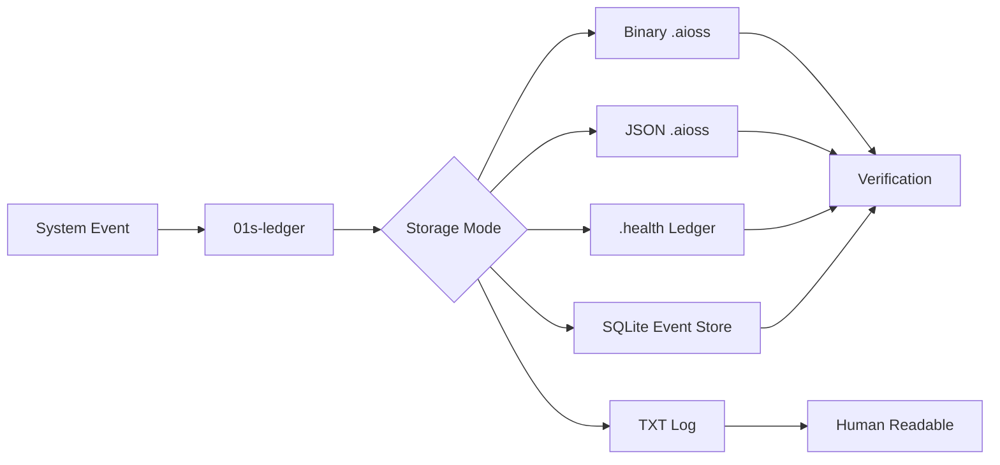
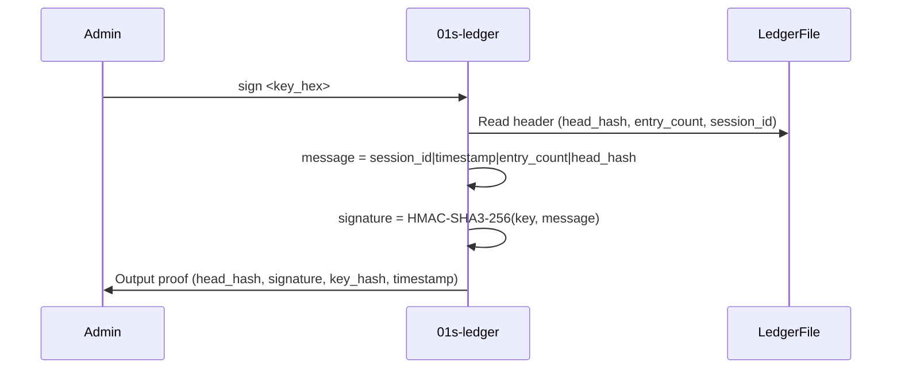
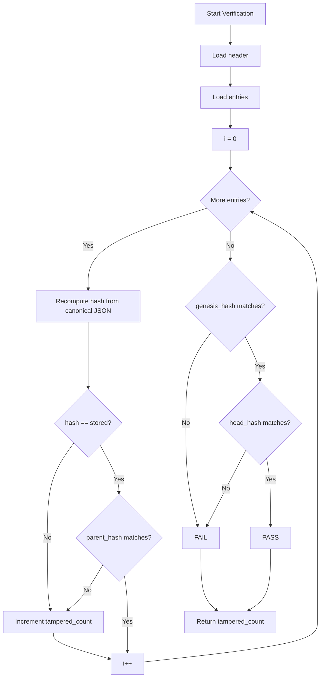

# 01s AIOSS Ledger Format (.aioss)

The **.aioss** file format is the cryptographic backbone of the 01s Sovereign (Kaiman) operating system. It provides a tamper-evident, append-only audit trail for every system event, state transition, and user command — implementing the "no black boxes" principle that defines the project.

## Overview

The AIOSS format stores a hash-chained sequence of entries in two interchangeable representations:

- **Binary format** (`b"AIOSS"` magic): fixed-size 128-byte header + 256-byte entries, compact and append-friendly
- **JSON format**: self-describing, human-readable, extensible

Either representation can be converted to the other without losing data. The hash chain is identical regardless of format.



## File Naming Convention

```
{session_id}_{timestamp}.aioss
```

Session IDs are derived from the date-stamp of the first entry. Timestamps follow ISO 8601 with colons replaced by hyphens for filesystem compatibility:

```
logs/ledger/2026-06-19_2026-06-19T14-30-00Z.aioss
```

The ledger directory defaults to `~/ledger/` and is configurable via `/etc/01s/ledger.conf`.

## Dual-Format Architecture

### Binary Format Structure

The binary format is designed for write-once, append-only storage with fixed-size records ideal for embedded/journaled filesystems.

**Header (128 bytes):**

```
┌─ AIOSS_HEADER (128 bytes) ──────────────────────────────┐
│ magic: b"AIOSS"        [5]                              │
│ version: 1             [u16 LE]                         │
│ header_checksum        [u16 LE]                         │
│ session_id             [36 bytes]                       │
│ created_at             [32 bytes (UTC ISO)]             │
│ status/session_type    [2 × u8]                        │
│ entry_count            [u32 LE]                         │
│ genesis_hash           [32 raw bytes — SHA3-256]        │
│ head_hash              [32 raw bytes — SHA3-256]        │
│ _reserved              [padding to 128]                │
└──────────────────────────────────────────────────────────┘
```

**Entry (256 bytes each):**

```
┌─ AIOSS_ENTRY (256 bytes each) ──────────────────────────┐
│ index               [u32 LE]                            │
│ timestamp_unix_ms   [u64 LE]                            │
│ entry_type          [20 bytes, null-padded]             │
│ actor               [16 bytes, null-padded]             │
│ actor_label         [24 bytes, null-padded]             │
│ content_hash        [32 raw bytes — SHA3-256]           │
│ parent_hash         [32 raw bytes — SHA3-256]           │
│ _reserved           [120 bytes]                        │
└──────────────────────────────────────────────────────────┘
```

### JSON Format Structure

The JSON format is a single file containing a header and an array of entry objects:

```json
{
  "schema": "https://api-oss.local/ledger/v2",
  "version": "2.0.0",
  "session_id": "a1b2c3d4-e5f6-7890-abcd-ef1234567890",
  "status": "active",
  "entry_count": 42,
  "genesis_hash": "ab12...64hex",
  "head_hash": "ff34...64hex",
  "entries": [
    {
      "index": 0,
      "timestamp": "2026-06-14T12:00:00.000Z",
      "type": "user_message",
      "actor": "user",
      "actor_label": "Alice",
      "content": {"text": "Hello"},
      "hash": "ab12...64hex",
      "parent_hash": "0000...64hex",
      "prompt_used": null,
      "model_id": null,
      "user_interaction_id": null,
      "compliance_tags": null,
      "session_summary": null,
      "signature": null
    }
  ]
}
```

## Hash Chain Mechanics (SHA3-256)

The hash chain is the core integrity mechanism. Each entry's hash is computed deterministically from its content and its position in the chain:

```
Sha3_256::digest(compact_json({
    index, timestamp, type, actor, actor_label,
    content, parent_hash,
    prompt_used?, model_id?, user_interaction_id?,
    compliance_tags?, session_summary?
}))
```

### Chain Invariant

```
entry[i].parent_hash == entry[i-1].hash
```

The genesis entry (index 0) uses `parent_hash = "0000...0000"` (64 zero hex chars).

The header stores two critical values:
- `genesis_hash`: the hash of entry[0]
- `head_hash`: the hash of entry[N-1] (the most recent entry)

```mermaid
graph TD
    subgraph "Hash Chain"
        G[Genesis<br/>entry[0]] -->|parent_hash=0000...| E1[entry[1]]
        E1 -->|parent_hash=hash[0]| E2[entry[2]]
        E2 -->|parent_hash=hash[1]| E3[entry[3]]
        E3 -->|parent_hash=hash[2]| E4[...]
    end
    subgraph "Header"
        H[Header] --> genesis_hash
        H --> head_hash
    end
    genesis_hash --> G
    head_hash --> E4
```

### Canonical JSON Serialization

The hashing algorithm uses a specific canonical JSON format to ensure deterministic output:

```rust
fn canonical_json(entry_type, actor, timestamp, index, parent_hash, content_json) -> String {
    format!(
        "{{\"actor\":\"{}\",\"content\":{},\"index\":{},\"parent_hash\":\"{}\",\"timestamp\":\"{}\",\"type\":\"{}\"}}",
        actor, content_json, index, parent_hash, timestamp, entry_type
    )
}
```

Keys are sorted alphabetically. No whitespace. UTF-8 encoded. No trailing newline. The `hash` field is excluded from the computation (it would create a circular dependency).

## Entry Types

### user_message

Records user input to the system:

```json
{
  "type": "user_message",
  "actor": "user",
  "content": {
    "text": "Should we remove the liability cap?",
    "attachments": [],
    "mentioned_nodes": []
  }
}
```

### ai_message

Records AI-generated responses:

```json
{
  "type": "ai_message",
  "actor": "ai",
  "content": {
    "text": "Based on the graph analysis...",
    "reasoning": "The user is asking about liability cap...",
    "confidence": 0.88,
    "referenced_nodes": ["uuid_doc_001"],
    "tokens_in": 1240,
    "tokens_out": 342,
    "duration_ms": 4820
  }
}
```

### tool_call

Records every tool invocation by AI:

```json
{
  "type": "tool_call",
  "actor": "ai",
  "content": {
    "tool": "graph_search",
    "arguments": { "query": "liability cap", "max_results": 10 },
    "result": { "success": true, "data": [...] },
    "duration_ms": 230
  }
}
```

### graph_mutation

Records changes to the knowledge graph:

```json
{
  "type": "graph_mutation",
  "actor": "system",
  "content": {
    "operation": "create_node",
    "node": { "id": "uuid_new_concept", "node_type": "Concept", "label": "Liability Cap Removal" },
    "reason": "User query triggered document retrieval"
  }
}
```

### contradiction

Records detected contradictions in the graph:

```json
{
  "type": "contradiction",
  "actor": "system",
  "content": {
    "contradiction_id": "uuid_contra_001",
    "severity": "high",
    "node_a": "uuid_sarah_jenkins",
    "node_b": "uuid_legal_analyst",
    "summary": "Sarah Jenkins agrees with removal, Legal Analyst disagrees",
    "confidence": 0.94,
    "resolved": false
  }
}
```

### decision

Records group decisions with voting:

```json
{
  "type": "decision",
  "actor": "system",
  "content": {
    "proposal": "Should we remove the liability cap?",
    "options": [
      {"label": "Remove", "votes": 3},
      {"label": "Keep", "votes": 5}
    ],
    "winner": "Keep",
    "agents": [
      {"name": "Risk", "vote": "Keep", "confidence": 0.91},
      {"name": "Legal", "vote": "Keep", "confidence": 0.88}
    ]
  }
}
```

### state (System State Snapshot)

Periodically recorded by `01s-state.service` and `01s-state.timer`:

```json
{
  "type": "state",
  "actor": "system",
  "content": {
    "uptime": "3600",
    "load": "0.42",
    "mem_total": "16384000",
    "mem_avail": "8192000",
    "disk_total": "50G",
    "disk_used": "12G"
  }
}
```

### boot

Recorded once per system boot by `01s-boot.service`:

```json
{
  "type": "boot",
  "actor": "system",
  "content": {
    "event": "system_start"
  }
}
```

### cmd (Shell Command)

Recorded by the `DEBUG` trap in `01s-ledger.sh` profile script for every shell command:

```json
{
  "type": "cmd",
  "actor": "system",
  "content": {
    "actor": "alice",
    "cmd": "ls -la /home"
  }
}
```

## State Proofs (HMAC-SHA3-256)

Beyond the hash chain, the system can produce cryptographic state proofs. The head hash is signed with an HMAC-SHA3-256 key. Anyone with the corresponding public key can verify the ledger hasn't been tampered with since the proof was issued.

```rust
pub struct StateProof {
    pub head_hash: String,
    pub timestamp: String,
    pub entry_count: u64,
    pub session_id: String,
    pub signature: Option<String>,   // HMAC-SHA3-256 hex
    pub public_key_hash: String,
}
```

### Signing Process



## Verification

### Hash Chain Verification

To verify a .aioss file:

```
1. Iterate entries in order (0 to N-1)
2. For each entry:
   a. Reconstruct the canonical JSON without the "hash" field
   b. Compute SHA3-256(canonical_json)
   c. Compare with stored hash
   d. Verify parent_hash matches previous entry's hash
3. Verify genesis_hash matches entry[0]'s hash
4. Verify head_hash matches entry[N-1]'s hash
```

The `verify()` method returns `(verified: bool, tampered_count: usize)`.



### State Proof Verification

```rust
let is_valid = state_proof.verify(&public_key);
// Computes HMAC-SHA3-256(key, session_id|timestamp|entry_count|head_hash)
// Compares with stored signature
```

## Configuration

The ledger system is configured via `/etc/01s/ledger.conf`:

```ini
# 0-1 Sovereign System - Ledger Configuration
# This file is sourced by profile.d/01s-ledger.sh and ledger-state.sh.
# Timer interval is configured in 01s-state.timer (OnUnitActiveSec).
STATE_INTERVAL=300
```

The `STATE_INTERVAL` controls how often the periodic state logging timer fires (in seconds).

## How External Systems Read/Write

### Reading a .aioss File

1. Open file, read first 5 bytes
2. If `b"AIOSS"` → binary format: read 128-byte header, then N × 256 entry bytes. Hashes are raw 32 bytes
3. If not `b"AIOSS"` → JSON format: parse as JSON. Hashes are 64-hex-char strings
4. Verify the hash chain with `verify()`

### Writing from an External System

- **Binary mode**: write fixed-size header + entries directly. Must compute SHA3-256 hashes yourself and pack into 32-byte arrays
- **JSON mode**: produce a JSON object with the schema above. Any JSON library can write it
- **TXT mode**: write pipe-delimited lines to `logs/txt/`
- **SQLite mode**: insert into `event_store` table with raw binary SHA3-256 hashes

### Verification (Stateless)

Given just the JSON or binary file, any system can recompute the hash chain and verify integrity. No external state, no database, no configuration needed — the chain is self-validating.

## Key Properties

| Property | Description |
|----------|-------------|
| **Tamper-evident** | Any modification to any entry breaks the hash chain |
| **Append-only** | Entries can only be added, never removed (except GDPR purge) |
| **Self-validating** | No external database needed for verification |
| **Dual format** | Binary for performance, JSON for interoperability |
| **Content-addressed** | Each entry is identified by its cryptographic hash |
| **Stateless verification** | Any party with the file can verify integrity |

## CLI Usage

```bash
# Initialize a new ledger session
01s-ledger init

# Log an entry
01s-ledger log boot
01s-ledger log cmd actor=alice cmd="ls -la"
01s-ledger log state uptime=3600 load=0.42

# View recent entries
01s-ledger tail
01s-ledger tail 20

# Show ledger status
01s-ledger status

# Verify hash chain integrity
01s-ledger verify

# Export entries as JSON
01s-ledger export

# Watch for new entries (polls every N seconds)
01s-ledger watch 30

# Sign the ledger head
01s-ledger sign <key_hex>

# Health ledger commands
01s-ledger health log 2026-06-19 gpu_available hardware pass 42 "GPU OK"
01s-ledger health verify
01s-ledger health manifest

# GDPR purge
01s-ledger purge <session_id>

# Verify toolchain binaries
01s-ledger toolchain
```

## Source Code Reference

The reference implementation is in Rust at:
- `day-2/toolchain/ledger/src/main.rs` — CLI tool with all commands
- `day-2/toolchain/ledger/src/binary.rs` — Binary format read/write
- `day-2/toolchain/ledger/src/sha3.rs` — Pure Rust SHA3-256 implementation
- `day-2/toolchain/ledger/src/health.rs` — Health ledger format
- `day-2/toolchain/ledger/src/txtlog.rs` — TXT log output
- `day-2/toolchain/ledger/src/sign.rs` — HMAC-SHA3-256 state proofs

## See Also

- [Health Diagnostic Ledger](12-health-diagnostic-ledger.md)
- [Log Manager TXT Output](14-log-manager-txt-output.md)
- [SQLite Event Store](13-sqlite-event-store.md)
- [01s Ledger Daemon](11-01s-ledger-daemon.md)
- [Systemd Service Architecture](17-systemd-service-architecture.md)

---
Lois-Kleinner and 0-1.gg 2026 Copyright

```
.====================================================================.
!  Made in the UAE, Dubai #DubaiIt #Dubai #Dxb #SovereignAI          !
!  Made in The Emirates #Dubai_it                                    !
!                                                                    !
!  Lois-Kleinner Alpasan - The Anticloud 2026-                       !
!                                                                    !
!  0-1.gg ! GitHub ! LinkedIn ! DEV ! GH Pages                       !
!  HuggingFace ! Blog ! Tumblr ! Fandom ! Bluesky ! Mastodon          !
!  Zenodo ! Harvard Dataverse ! Internet Archive ! ORCID ! Figshare   !
!                                                                    !
!  Sovereign AI ! Local-First ! Privacy ! Zero Trust ! No Datacenter !
!  Air-Gapped ! Open Source ! Rust ! Hash Chain ! Single Binary      !
!  Offline LLM ! Crypto Ledger ! P2P ! Federated                     !
'===================================================================='
```

Lois-Kleinner Alpasan, 22, has served executive roles spanning technology, operations, finance, and product across 20+ organizations. His cross-functional work combines architecture, business, and AI strategy.

References:
1. Lois-Kleinner Zenodo: https://doi.org/10.5281/zenodo.20781790
2. Lois-Kleinner GitHub: https://github.com/kleinnner/Anticloud/tree/main/04-aioss-format
3. Lois-Kleinner Harvard DV: https://doi.org/10.7910/DVN/YMJKOG
4. Lois-Kleinner Internet Arc: https://archive.org/details/aioss-format
5. Lois-Kleinner ORCID: https://orcid.org/0009-0009-2233-6107
6. Lois-Kleinner DEV.to: https://dev.to/kleinner
7. Lois-Kleinner LinkedIn: https://linkedin.com/in/kleinner
8. Lois-Kleinner HuggingFace: https://huggingface.co/Anticloud
9. Lois-Kleinner Tumblr: https://anticloud.tumblr.com
10. Lois-Kleinner Mastodon: https://mastodon.social/@kleinner
11. Lois-Kleinner Bluesky: https://bsky.app/profile/kleinner.bsky.social
12. 0-1.gg: https://0-1.gg
13. Lois-Kleinner Figshare: https://figshare.com/authors/Lois-Kleinner_Alpasan/20849885
