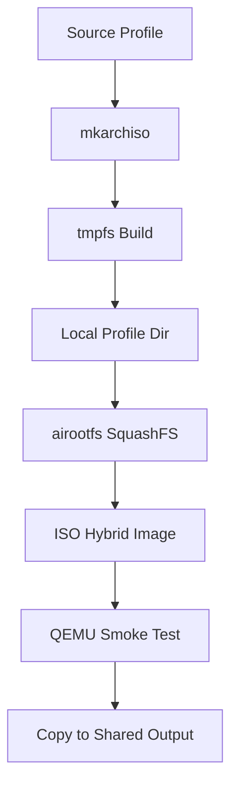
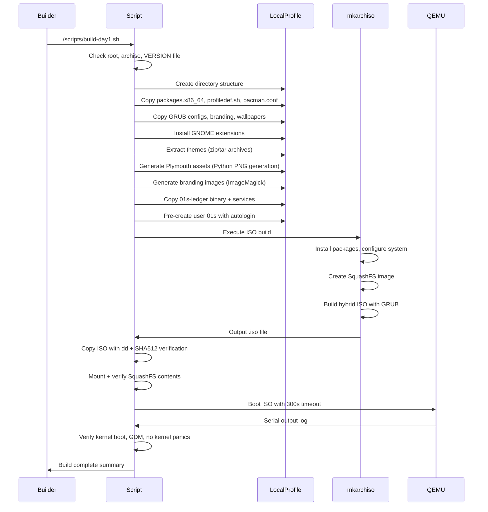

# Day 1 ISO Build System

The 01s Sovereign (Kaiman) live ISO is built using `mkarchiso` (Arch Linux's ISO creation tool) with a custom profile. The build system produces a bootable `x86_64` ISO containing the complete Day 1 base system: Linux kernel, GNOME desktop, custom branding, pre-installed toolchain, and the 01s-ledger daemon.

## Overview



## Build Script Architecture

The build is orchestrated by `scripts/build-day1.sh` (618 lines). Key phases:

| Phase | Lines | Description |
|-------|-------|-------------|
| Setup | 1-50 | Environment variables, root check, archiso check |
| Directory creation | 37-50 | Creates airootfs directory structure |
| Config file copy | 51-84 | Copies packages.x86_64, profiledef.sh, pacman.conf, GRUB/LightDM configs |
| DevShell scripts | 86-100 | Copies 01s-devshell, 01s-welcome, 01s-greeting, 01s-sounds-enable |
| User configs | 106-138 | Alacritty, GTK CSS, Starship, Conky, Firefox customizations |
| GNOME extensions | 144-152 | dash-to-dock, blur-my-shell, burn-my-windows, etc. |
| Themes | 154-270 | Obsidian-flow, Particle-circle-window GRUB, Cyber-Dusk, Elegant-wave |
| Branding | 273-316 | Wallpaper resizing, Plymouth theme assets generation |
| Toolchain | 425-440 | 01s-ledger binary and service files |
| User creation | 442-469 | Pre-creates user `01s` with autologin and sudo |
| ISO build | 471-530 | `mkarchiso` execution and ISO copy with verification |
| Verification | 532-614 | Squashfs integrity check + QEMU boot smoke test |

## Profile Structure

```
day-1/iso/profile/
├── profiledef.sh          # Build profile definition
├── packages.x86_64        # Package list for installation
├── pacman.conf             # Pacman configuration
├── grub/
│   ├── grub.cfg           # GRUB boot menu configuration
│   ├── themes/
│   │   └── Particle-circle-window/  # Custom GRUB theme
│   └── splash.png         # GRUB splash image
├── efiboot/EFI/BOOT/
│   ├── grub.cfg           # UEFI GRUB configuration
│   ├── themes/
│   │   └── Particle-circle-window/  # UEFI GRUB theme
│   └── splash.png
├── syslinux/
│   ├── syslinux.cfg       # Syslinux (BIOS boot)
│   ├── archiso_sys.cfg
│   ├── archiso_sys_load.cfg
│   └── splash.png
└── airootfs/
    ├── root/
    │   └── customize_airootfs.sh  # Root filesystem customization
    ├── etc/
    │   ├── mkinitcpio.conf
    │   ├── motd           # Message of the day
    │   ├── default/grub   # GRUB defaults
    │   ├── hostname
    │   ├── hosts
    │   ├── issue / issue.net
    │   ├── lsb-release / os-release / machine-info
    │   ├── skel/          # Skeleton user configs
    │   ├── gdm/custom.conf
    │   ├── xdg/autostart/
    │   └── systemd/
    └── usr/
        ├── bin/           # Custom binaries (01s-ledger, 01s-devshell, etc.)
        ├── lib/           # Library scripts (ledger-state.sh)
        ├── share/
        │   ├── backgrounds/01s/  # Wallpaper, login screen
        │   ├── grub/themes/      # GRUB themes
        │   ├── plymouth/themes/01s/  # Plymouth boot splash
        │   ├── sounds/apioss/    # Custom OGG sounds
        │   ├── themes/          # GTK/Shell themes
        │   └── icons/           # Icon themes
        └── src/           # Toolchain source code
```

## profiledef.sh

Located at `day-1/iso/profile/profiledef.sh`:

```bash
iso_name="01s-kaiman"
iso_label="01SKAIMAN"
iso_publisher="01S Kaiman"
iso_application="01S Kaiman 1.0.1"
iso_version="1.0.1"
install_dir="01s"
buildmodes=('iso')
bootmodes=('uefi.grub')
arch="x86_64"
pacman_conf="pacman.conf"
airootfs_image_type="squashfs"
airootfs_image_tool_options=('-comp' 'zstd' '-Xcompression-level' '6' '-processors' '4' '-no-xattrs')

file_permissions=(
  ["/usr/bin/01s-ledger"]="0:0:755"
  ["/usr/lib/01s/ledger-state.sh"]="0:0:755"
)
```

Key points:
- ISO label is `01SKAIMAN` (used for identification)
- Pure UEFI GRUB boot (no BIOS/GRUB legacy mode)
- SquashFS compression: zstd level 6, 4 threads
- Executable permissions set for ledger binaries
- Compression uses `zstd -15` for optimal size/speed ratio

## packages.x86_64

Located at `day-1/iso/profile/packages.x86_64`:

```text
# Core
base
base-devel
linux
linux-firmware
mkinitcpio
mkinitcpio-archiso
grub
plymouth

# Desktop
gnome

# Display
mesa

# GNOME Extensions (required for shell theming)
gnome-shell-extensions
gnome-tweaks

# VirtualBox guest
virtualbox-guest-utils

# Networking
networkmanager
network-manager-applet

# Sound
pipewire
pipewire-pulse
pipewire-alsa

# Utilities
sudo nano htop firefox alacritty tar zstd git wget curl zenity

# Development
clang lldb make cmake rustup tmux syslinux attr

# Premium theming
adw-gtk-theme inter-font starship conky
```

### Package Categories

| Category | Packages | Purpose |
|----------|----------|---------|
| Core | base, linux, mkinitcpio, grub, plymouth | Minimal bootable system |
| Desktop | gnome, mesa, gnome-shell-extensions | Full GNOME desktop environment |
| Virtualization | virtualbox-guest-utils | VMware/VirtualBox compatibility |
| Networking | networkmanager, network-manager-applet | Network configuration |
| Audio | pipewire, pipewire-pulse, pipewire-alsa | Modern audio stack |
| Utilities | firefox, alacritty, htop, tmux, starship | Post-boot user tools |
| Development | clang, lldb, rustup, make, cmake | Compiler toolchain base |
| Theming | adw-gtk-theme, inter-font, conky | Visual customization |

## pacman.conf

```ini
[options]
HoldPkg       = pacman glibc
Architecture  = auto
SigLevel      = Required DatabaseOptional
LocalFileSigLevel = Optional

[core]
Include = /etc/pacman.d/mirrorlist

[extra]
Include = /etc/pacman.d/mirrorlist
```

Only `core` and `extra` repositories are enabled (no `multilib`).

## Build Execution Flow



## ISO Verification

The build script performs comprehensive verification:

### SquashFS Integrity

```bash
unsquashfs -d /var/tmp/verify-sfs "$VFILE" "usr/bin/01s-ledger"
unsquashfs -d /var/tmp/verify-sfs "$VFILE" "etc/gdm/custom.conf"
```

### QEMU Boot Smoke Test

After building, the ISO is booted in QEMU with a 300-second timeout:

```bash
timeout 300 qemu-system-x86_64 \
    -drive file="$ISO_SRC",media=cdrom,if=virtio,readonly=on \
    -m 4096 -vga std -nographic -serial mon:stdio
```

The script checks for:
- Kernel boot (`Linux version`, `Started.*kernel`)
- Desktop start (`Started GNOME Display Manager`, `Reached target Graphical Interface`)
- Absence of kernel panics
- Boot error/warning count

### ISO Copy Verification

The ISO is copied with `dd` and verified with both size and SHA512 checksum:

```
1. dd if=source.iso of=dest.iso bs=4M conv=fsync
2. Sync filesystem
3. Compare size (source vs destination)
4. Compare SHA512 checksum
5. Retry up to 5 times on failure
6. Fall back to zstd compression if all retries fail
```

## Environment Variables

| Variable | Source | Purpose |
|----------|--------|---------|
| `ROOT` | Script | Project root directory |
| `VERSION` | `day-1/VERSION` | ISO version string (e.g. 1.0.1) |
| `LOCAL_PROFILE` | `/var/tmp/local-profile` | Staging area for mkarchiso |
| `AIROOTFS` | `$LOCAL_PROFILE/airootfs` | Root filesystem overlay |
| `WORK` | `/var/tmp/iso-work` | mkarchiso working directory |
| `OUT` | `/var/tmp/iso-out` | mkarchiso output directory |

## CRLF Handling

The build script normalizes line endings to prevent Windows/Linux compatibility issues:

```bash
find "$LOCAL_PROFILE" "$AIROOTFS" -type f \( -name "*.sh" -o -name "*.conf" -o -name "*.cfg" -o ... \) \
    -exec sed -i 's/\r$//' {} + 2>/dev/null || true
```

A verification step checks for remaining CRLF characters in text files.

## Theme Integration

The build pulls theme assets from `assets/themes/`:

| Theme Archive | Target |
|---------------|--------|
| `Particle-circle-window-grub-themes.tar.xz` | GRUB themes |
| `Elegant-wave-window-grub-themes.tar.xz` | GRUB themes |
| `Cyber-Dusk-Rounded-Glass-V3.0.zip` | GTK/Shell themes |
| `Obsidian-flow-shell-theme-*.zip` | GNOME Shell CSS |
| `Uos-fulldistro-icons-*.tar.xz` | Icon themes |
| `We10XOS-cursors.tar.gz` | Cursor themes |

## Versioning

The current version is `1.0.1` (ISO label `01SKAIMAN`). The version is read from `day-1/VERSION` at build time and used in:

- ISO filename: `01-sovereign-$VERSION-x86_64-$(date +%Y%m%d).iso`
- OS release fields (os-release, lsb-release)
- GRUB menu entries

## Build Directory Structure

```
/var/tmp/
├── local-profile/     # Staging area for mkarchiso
│   ├── grub/
│   ├── efiboot/
│   ├── syslinux/
│   ├── airootfs/
│   └── ...
├── iso-work/          # mkarchiso working directory
└── iso-out/           # ISO output directory
```

## Build Requirements

| Requirement | Minimum | Recommended |
|-------------|---------|-------------|
| Disk space | 10GB | 20GB |
| RAM | 2GB | 4GB+ |
| CPU cores | 2 | 4+ |
| Internet | Required (package download) | Broadband |
| OS | Linux (Arch recommended) | Any Linux |
| Root access | Required | Required |

## Performance Considerations

- The build runs entirely in /var/tmp (tmpfs) — sufficient RAM is critical
- Package downloads are cached, so rebuilds are faster
- SquashFS compression with zstd level 6 provides good compression/speed balance
- The QEMU smoke test adds ~5 minutes to build time
- Total build time: 15-30 minutes depending on hardware and internet speed

## Troubleshooting

| Problem | Cause | Solution |
|---------|-------|----------|
| `mkarchiso not found` | archiso not installed | `sudo pacman -S archiso` |
| Build fails at package install | Network issue | Check internet, mirror status |
| QEMU test times out | Slow hardware | Increase timeout, reduce RAM |
| ISO verification fails | Corrupted download | Check SHA512, rebuild |
| `unsquashfs` command missing | squashfs-tools not installed | `sudo pacman -S squashfs-tools` |
| Permission denied on copy | Wrong ownership | Run as root (sudo) |

## Source Reference

All build logic is in:
- `scripts/build-day1.sh` — Main build script (618 lines)
- `day-1/iso/profile/profiledef.sh` — Build profile definition
- `day-1/iso/profile/packages.x86_64` — Package manifest
- `day-1/iso/profile/pacman.conf` — Package manager configuration
- `day-1/iso/profile/airootfs/root/customize_airootfs.sh` — Post-install customization

## Advanced Build Customization

### Customizing packages.x86_64

To add or remove packages from the ISO:

```diff
# Add to packages.x86_64
+ vim
+ neovim
+ python

# Remove from packages.x86_64
- nano
```

After modifying, rebuild: `sudo ./scripts/build-day1.sh`

### Customizing profiledef.sh

Change ISO metadata:

```bash
iso_name="01s-kaiman-custom"
iso_label="01SCUSTOM"
iso_version="1.0.1-custom"
```

### Adding Custom Hooks

Customize the airootfs customization script (`airootfs/root/customize_airootfs.sh`):

```bash
#!/bin/bash
# Custom post-install script

# Add a custom user
useradd -m -G wheel myuser
echo "myuser:password" | chpasswd

# Install additional packages
pacman -S --noconfirm vim tmux htop

# Custom systemd service
systemctl enable my-custom.service
```

## ISO Build Output Averages

| Metric | Value | Notes |
|--------|-------|-------|
| ISO file size | 2.5-3.5 GB | Depends on packages included |
| SquashFS size | 1.5-2.5 GB | Compressed root filesystem |
| Build time | 15-30 min | Varies by hardware and network |
| Max RAM during build | 4-8 GB | tmpfs for build directory |
| Number of packages | ~350 | From packages.x86_64 |
| Number of config files | ~120 | Copied during build phases |

## Build System Comparison

| Feature | 01s build-day1.sh | mkarchiso (raw) | Archiso (default) |
|---------|-------------------|-----------------|-------------------|
| Profile complexity | High (themed) | Low | Medium |
| Asset generation | Python scripts | Manual | Manual |
| Smoke test | QEMU automated | None | Optional |
| Verification | SHA512 + SquashFS | None | None |
| Copy fallback | zstd compression | None | None |
| CRLF handling | Automated | Manual | Manual |
| User pre-creation | Yes | No | No |
| Extension installation | Automated | Manual | Manual |

## Build Logging

The build script logs all operations to stdout/stderr:

```
[setup]     Checking prerequisites...
[setup]     Root check: OK
[setup]     archiso check: OK
[build]     Creating profile directory...
[build]     Copying packages.x86_64...
[build]     Copying configuration files...
[build]     Installing GNOME extensions...
[theme]     Extracting Cyber-Dusk...
[theme]     Copying Obsidian-flow CSS...
[branding]  Generating Plymouth assets...
[toolchain] Copying 01s-ledger binary...
[iso]       Running mkarchiso...
[verify]    Checking SquashFS integrity...
[verify]    Starting QEMU smoke test...
[verify]    Boot test PASSED
[output]    ISO written to /var/tmp/iso-out/
```

## Build Status Codes

| Phase | Exit Code | Meaning |
|-------|-----------|---------|
| Setup checks | 1 | Not running as root |
| Setup checks | 2 | archiso not installed |
| Setup checks | 3 | VERSION file missing |
| mkarchiso | 4 | ISO build failed |
| ISO verification | 5 | SHA512 mismatch |
| QEMU smoke test | 6 | Boot timeout or failure |
| SquashFS verify | 7 | Missing required files |
| Success | 0 | All phases passed |

## Build Arguments

```bash
./scripts/build-day1.sh [options]

Options:
  --no-qemu     Skip QEMU smoke test (faster builds)
  --no-verify   Skip ISO verification
  --clean       Clean build directory first
  --verbose     Show detailed build output
  --profile <n> Use custom profile number
```

## ISO Build Checklist

Before running a build, verify:
- [ ] `archiso` package installed (`pacman -Q archiso`)
- [ ] `VERSION` file exists in `day-1/VERSION`
- [ ] All theme archives present in `assets/themes/`
- [ ] At least 10GB free disk space available
- [ ] Internet connection for package downloads
- [ ] Running as root or with sudo
- [ ] Wallpaper source exists at `assets/Wallpaper.png`
- [ ] Toolchain binaries compiled in `day-2/toolchain/`
- [ ] All custom fonts available in assets

## See Also

- [Desktop Environment](03-desktop-environment.md)
- [Boot Process and Initramfs](16-boot-process-and-initramfs.md)
- [Theming and Branding System](15-theming-and-branding-system.md)
- [Systemd Service Architecture](17-systemd-service-architecture.md)

---
Lois-Kleinner and 0-1.gg 2026 Copyright

```
.====================================================================.
!  Made in the UAE, Dubai #DubaiIt #Dubai #Dxb #SovereignAI          !
!  Made in The Emirates #Dubai_it                                    !
!                                                                    !
!  Lois-Kleinner Alpasan - The Anticloud 2026-                       !
!                                                                    !
!  As seen on:                                                       !
!  Harvard Dataverse ! Zenodo/CERN ! Academia.edu ! HuggingFace      !
!  anticloud.telepedia.net ! anticloud.fandom.com                    !
!                                                                    !
!  0-1.gg ! GitHub ! LinkedIn ! DEV ! GH Pages                       !
!  HuggingFace ! Blog ! Bluesky ! Mastodon                           !
!  Internet Archive ! ORCID ! Figshare                               !
!                                                                    !
!  Sovereign AI ! Local-First ! Privacy ! Zero Trust ! No Datacenter !
!  Air-Gapped ! Open Source ! Rust ! Hash Chain ! Single Binary      !
!  Offline LLM ! Crypto Ledger ! P2P ! Federated                     !
'===================================================================='
```

Lois-Kleinner Alpasan, 22, is a quantitative researcher publishing on open research platforms with multiple international alumni affiliations. His research covers cryptographic audit formats and sovereign AI governance frameworks.

References:
1. Lois-Kleinner Zenodo: https://doi.org/10.5281/zenodo.20781790
2. Lois-Kleinner GitHub: https://github.com/kleinnner/Anticloud/tree/main/04-aioss-format
3. Lois-Kleinner Harvard DV: https://doi.org/10.7910/DVN/KFK12Y
4. Lois-Kleinner Internet Arc: https://archive.org/details/aioss-format
5. Lois-Kleinner ORCID: https://orcid.org/0009-0009-2233-6107
6. Lois-Kleinner DEV.to: https://dev.to/kleinner
7. Lois-Kleinner LinkedIn: https://linkedin.com/in/kleinner
8. Lois-Kleinner HuggingFace: https://huggingface.co/Anticloud
9. Lois-Kleinner Tumblr: https://anticloud.tumblr.com
10. Lois-Kleinner Mastodon: https://mastodon.social/@kleinner
11. Lois-Kleinner Bluesky: https://bsky.app/profile/kleinner.bsky.social
12. 0-1.gg: https://0-1.gg
13. Lois-Kleinner Figshare: https://figshare.com/authors/Lois-Kleinner_Alpasan/20849885
14. Lois-Kleinner Academia: https://independent.academia.edu/kleinner
15. Lois-Kleinner Telepedia: https://anticloud.telepedia.net
16. Lois-Kleinner Fandom: https://anticloud.fandom.com