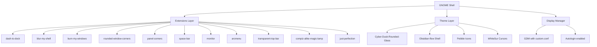

# Desktop Environment

The 01s Sovereign (Kaiman) operating system uses **GNOME** as its desktop environment, with extensive custom branding, a carefully curated set of GNOME Shell extensions, and a custom theme stack that transforms the stock GNOME experience into a distinctive, branded environment.

## Overview



## Display Server: Wayland

The 01s Sovereign system uses **Wayland** as the primary display protocol, with GNOME's Mutter compositor. X11 applications are supported via XWayland.

### X11 vs Wayland Comparison

| Feature | X11 (Xorg) | Wayland |
|---------|------------|---------|
| Architecture | Client-server | Client-compositor |
| Rendering | Server-side | Client-side (direct) |
| Network transparency | Native (X forwarding) | Via XWayland or RDP |
| Screen tearing | Common without compositor | Eliminated (vsync) |
| Security | Poor (any app can read input) | Strong (isolated inputs) |
| Multi-monitor | Single root window | Independent per-monitor |
| HiDPI support | Mixed (per-monitor complex) | Native per-monitor scaling |
| Development status | Maintenance mode | Active development |
| GNOME support | Legacy | Primary target |

### XWayland Integration

```bash
# Check if XWayland is running
ps aux | grep Xwayland

# Run an X11 application
QT_QPA_PLATFORM=xcb app-command

# Force Wayland native
GDK_BACKEND=wayland app-command
```

## Display Manager: GDM

The system uses **GDM** (GNOME Display Manager) configured for automatic login to the `01s` user account.

### Display Managers Comparison

| Feature | GDM | LightDM | SDDM | greetd |
|---------|-----|---------|------|--------|
| GNOME integration | Native | Good | Moderate | Basic |
| Wayland support | Native | Via greeter | Via greeter | Yes |
| Autologin | Simple config | Simple config | Simple config | Config file |
| Theme support | GNOME theme | GTK themes | Qt themes | Minimal |
| Customization | dconf/GSettings | GTK/Qt | Qt | Minimal |
| Resource usage | ~80MB | ~40MB | ~60MB | ~5MB |
| Session management | Excellent | Good | Good | Basic |

### GDM Configuration

File: `airootfs/etc/gdm/custom.conf` (copied from `day-1/iso/profile/airootfs/etc/gdm/custom.conf`)

```ini
[daemon]
AutomaticLoginEnable=True
AutomaticLogin=01s

[security]

[xdmcp]

[chooser]

[debug]
```

The user `01s` is pre-created during ISO build with:
- UID/GID: 1000:1000
- Password: `01s` (SHA-512 hashed)
- Shell: `/usr/bin/bash`
- Home: `/home/01s`
- Groups: `wheel`, `autologin`
- Sudo: passwordless (`NOPASSWD: ALL`)

## Multi-Monitor Setup

### Configuration

GNOME's Settings > Displays provides GUI-based multi-monitor configuration:

```bash
# List connected monitors
gnome-control-center display

# Or command-line
gsettings get org.gnome.Mutter workspaces-only-on-primary
gsettings set org.gnome.Mutter workspaces-only-on-primary false

# Identify displays
wlr-randr  # If using wlroots
```

### Workspace Behavior

| Setting | Effect |
|---------|--------|
| Workspaces on primary only | Workspaces appear only on primary monitor |
| Workspaces on all monitors | Each monitor has independent workspaces |
| Mirror displays | Same content on all screens |
| Extend displays | Independent content per screen |

### Display Profiles

```bash
# Check current display configuration
gnome-monitor-config list

# Apply a saved profile
gnome-monitor-config apply "profile-name"
```

## Custom Branding

### GRUB Splash

A custom splash image is displayed during GRUB boot. It is generated from the project's `assets/Wallpaper.png`:

- Resized to 1920x1080
- Copied to all bootloader locations:
  - `LOCAL_PROFILE/grub/splash.png`
  - `LOCAL_PROFILE/efiboot/EFI/BOOT/splash.png`
  - `LOCAL_PROFILE/syslinux/splash.png`
  - `AIROOTFS/usr/share/grub/splash.png`

### Plymouth Boot Splash

The boot splash is a custom Plymouth theme located at `/usr/share/plymouth/themes/01s/`:

```
usr/share/plymouth/themes/01s/
├── 01s.plymouth           # Theme definition
├── 01s.script             # Plymouth script
├── bg.png                 # Background (1920x1080 dark)
├── logo.png               # Gradient banner (900x300)
├── subtitle.png           # Dark rectangle (300x40)
├── progress_box.png       # Glass track (320x8)
├── progress_bar.png       # Cyan fill (316x6)
└── particle.png           # Cyan dot (8x8)
```

The Plymouth assets are generated at build time using Python scripts that create PNG images programmatically. The `logo.png` features a gradient from dark blue to cyan:

```python
for y in range(h):
    for x in range(w):
        dist = abs(x - 450) / 450.0
        r, g, b = 10, min(40, int(12 + (1 - dist) * 28 + y * 0.03)), \
                   min(60, int(14 + (1 - dist) * 46 + y * 0.04))
```

### Desktop Wallpaper and Login Screen

- Wallpaper: `/usr/share/backgrounds/01s/wallpaper.png` (1920x1080)
- Login background: `/usr/share/backgrounds/01s/login.png` (1920x1080)

Both are generated from `assets/Wallpaper.png` using ImageMagick:

```bash
magick "$ROOT/assets/Wallpaper.png" -resize 1920x1080^ -gravity center -extent 1920x1080 \
    "$AIROOTFS/usr/share/backgrounds/01s/wallpaper.png"
magick "$ROOT/assets/Wallpaper.png" -resize 1920x1080^ -gravity center -extent 1920x1080 \
    "$AIROOTFS/usr/share/backgrounds/01s/login.png"
```

## Theme Stack

### GTK / Shell Theme: Cyber-Dusk-Rounded-Glass

Archive: `assets/themes/Cyber-Dusk-Rounded-Glass-V3.0.zip`

Extracted to `/usr/share/themes/` during build. Provides GTK3/GTK4 and GNOME Shell theming with a dark, rounded, glass-morphism aesthetic.

### Shell Theme CSS: Obsidian-flow

Archive: `assets/themes/Obsidian-flow-shell-theme-*.zip`

Provides custom GNOME Shell CSS (panel, dash, notifications, etc.) with multiple color variants. Extracted into `/usr/share/themes/Obsidian-flow/gnome-shell/`:

```bash
CSS_DIR=$(find "$TMP_OB" -type d -name "gnome-shell" -path "*/Obsidian-flow*" | head -1)
cp "$CSS_DIR"/* "$AIROOTFS/usr/share/themes/Obsidian-flow/gnome-shell/"
```

### Icon Theme: Pebble

Source: `/tmp/pebble-icons/`

Installed to `/usr/share/icons/Pebble/` during build. Provides a modern, flat icon set.

### Cursor Theme: WhiteSur

Source: `/tmp/whitesur-icons/`

Installed to `/usr/share/icons/WhiteSur-cursors/` during build. A macOS-style cursor theme.

### UOS Icon Theme

Archive: `assets/themes/Uos-fulldistro-icons-*.tar.xz`

Extracted to `/usr/share/icons/` providing additional icon coverage.

### We10XOS Cursors

Archive: `assets/themes/We10XOS-cursors.tar.gz`

Additional cursor theme extracted to `/usr/share/icons/`.

## GRUB Theme: Particle-circle-window

A complete GRUB theme with support for 60+ OS icons. Located in:

```
grub/themes/Particle-circle-window/
├── theme.txt          # Theme configuration
├── select_*.png       # Selection indicators
├── info.png           # Info icon
├── icons/             # 60+ OS boot icons
│   ├── archlinux.png
│   ├── debian.png
│   ├── ubuntu.png
│   ├── windows.png
│   ├── 01s.png
│   └── ...
├── unifont-*.pf2      # Unicode fonts
└── terminus-*.pf2     # Terminal fonts
```

The theme is deployed to both BIOS GRUB and UEFI GRUB paths:

```bash
cp -r "$SHARED_PROFILE/grub/themes/Particle-circle-window" "$LOCAL_PROFILE/grub/themes/"
cp -r "$SHARED_PROFILE/efiboot/EFI/BOOT/themes/Particle-circle-window" "$LOCAL_PROFILE/efiboot/EFI/BOOT/themes/"
```

## Accessibility Features

### GNOME Accessibility

GNOME provides best-in-class accessibility features, all available in 01s Sovereign:

| Feature | Shortcut | Description |
|---------|----------|-------------|
| Screen Reader | `Super+Alt+S` | Orca screen reader |
| Zoom | `Super+Alt+8` | Magnifier (up to 10x) |
| On-Screen Keyboard | `Super+Alt+K` | Virtual keyboard |
| Sticky Keys | `Shift` 5x | One-handed modifier keys |
| Slow Keys | Accessibility panel | Debounce keystrokes |
| Bounce Keys | Accessibility panel | Ignore accidental double-presses |
| Mouse Keys | `NumLock` | Keyboard-based mouse control |
| Visual Alerts | Accessibility panel | Flash screen instead of sounds |
| High Contrast | `Super+Alt+H` | High-contrast theme |
| Large Text | Accessibility panel | Increased font sizes |

### Enabling Accessibility

```bash
# Via GSettings
gsettings set org.gnome.desktop.a11y.applications screen-reader-enabled true
gsettings set org.gnome.desktop.a11y.applications screen-magnifier-enabled true
gsettings set org.gnome.desktop.a11y.applications screen-keyboard-enabled true

# Or via the accessibility menu (top-right corner)
```

## Remote Desktop

### GNOME Remote Desktop (RDP)

```bash
# Enable remote desktop
gsettings set org.gnome.desktop.remote-desktop.rdp enable true
gsettings set org.gnome.desktop.remote-desktop.rdp port 3389

# Set credentials
gsettings set org.gnome.desktop.remote-desktop.rdp view-only false

# Check status
systemctl --user status gnome-remote-desktop.service
```

### VNC (via vino)

```bash
# Enable VNC sharing (legacy)
gsettings set org.gnome.Vino enabled true
gsettings set org.gnome.Vino prompt-enabled false
gsettings set org.gnome.Vino require-encryption true
```

## GNOME Shell Extensions

The following extensions are pre-installed and enabled (see the [GNOME Shell Extensions](04-gnome-shell-extensions.md) document for full details):

| Extension | UUID | Function |
|-----------|------|----------|
| dash-to-dock | `dash-to-dock@micxgx.gmail.com` | macOS-style dock |
| blur-my-shell | `blur-my-shell@aunetx` | Background blur |
| burn-my-windows | `burn-my-windows@schneegans.github.com` | Window close animations |
| rounded-window-corners | `rounded-window-corners@fxgn` | Rounded window corners |
| panel-corners | `panel-corners@aunetx` | Rounded panel corners |
| space-bar | `space-bar@luchrioh` | Workspace indicator |
| monitor | `monitor@astraext.github.io` | System monitor |
| arcmenu | `arcmenu@arcmenu.com` | Application menu |
| transparent-top-bar | `transparent-top-bar@ftpix.com` | Transparent top bar |
| compiz-alike-magic-lamp | `compiz-alike-magic-lamp-effect@hermes83.github.com` | Minimize animation |
| just-perfection | `just-perfection-desktop@just-perfection` | GNOME UI tweaks |
| 01s-splash | `01s-splash@sovereign` | Custom splash screen |
| 01s-curtain | `01s-curtain@sovereign` | Custom curtain effect |

### Extension Configuration

Extension settings are applied via a GSettings override file:
`/usr/share/glib-2.0/schemas/01s-extensions.gschema.override`

This file is compiled with `glib-compile-schemas` during the airootfs customization phase.

### dconf Theming

Desktop-wide settings are applied via dconf database files:

```
/etc/dconf/profile/user
/etc/dconf/db/local.d/
```

The profile file specifies which databases to load, and the `local.d/` directory contains key-value pairs for GNOME settings, extension preferences, and theme selection.

## Conky

Conky is pre-configured with a custom theme file at `/etc/skel/.config/conky/01s.conf` for desktop system monitoring (CPU, memory, disk, network).

## Theme Init System

A systemd user service (`01s-theme-init.service`) runs on user login to apply theme settings:

```bash
/usr/local/bin/01s-theme-init   # Apply theme on first login
/usr/local/bin/01s-theme-check   # Verify theme integrity
```

## Autostart

Two autostart entries run on login:

- `01s-desktop.desktop` — Launches desktop initialization
- `01s-theme-init.desktop` — Applies delayed theme initialization

Both are located in `/etc/xdg/autostart/`.

## Kernel Boot Parameters

The GRUB configuration passes these kernel parameters:

```
quiet splash loglevel=0
systemd.show_status=no
rd.systemd.show_status=no
systemd.device_timeout_sec=10
edd=off noapic
console=ttyS0,115200
```

The `quiet splash` parameters enable the Plymouth boot splash and suppress kernel messages for a polished boot experience.

## Performance Considerations

- GNOME Shell uses GPU compositing via Mutter (Wayland) — hardware acceleration is essential
- With an integrated GPU: ~500MB RAM, 2-5% CPU idle
- With a discrete GPU: ~300MB RAM, 1-3% CPU idle
- Desktop effects (blur, animations) consume additional GPU resources
- Disabling animations: `gsettings set org.gnome.desktop.interface enable-animations false`

## Troubleshooting

| Problem | Cause | Solution |
|---------|-------|----------|
| GNOME won't start | Mutter crashed | `journalctl -u gdm.service` |
| No extensions loading | Schema not compiled | `sudo glib-compile-schemas /usr/share/glib-2.0/schemas/` |
| Theme not applying | dconf not loaded | Check `/etc/dconf/profile/user` |
| Auto-login fails | custom.conf incorrect | Check `AutomaticLogin=01s` in `/etc/gdm/custom.conf` |
| Wayland not working | GPU driver issue | Switch to Xorg session from GDM |
| Screen tearing | Compositor issue | Use Wayland (native vsync) |

## Desktop Session Management

### Starting a New Session

```bash
# Restart GNOME Shell (Wayland)
systemctl --user restart gnome-shell-wayland.service

# Start a new X11 session
startx

# Switch between desktop environments (if multiple installed)
sudo systemctl switch-default.service  # Change default session
```

### Session Types

| Session | Display Server | Description |
|---------|---------------|-------------|
| GNOME (default) | Wayland | Full Wayland session with Mutter |
| GNOME on Xorg | X11 | Legacy X11 session |
| GNOME Classic | Wayland | Traditional GNOME layout |
| GNOME Classic on Xorg | X11 | Traditional GNOME on X11 |

## Accessibility Configuration Reference

### Screen Reader (Orca)

```bash
# Enable/disable
gsettings set org.gnome.desktop.a11y.applications screen-reader-enabled true

# Speech settings
gsettings set org.gnome.desktop.a11y.magnifier screen-position 'full-screen'
gsettings set org.gnome.orca.speech verbalize-punctuation 'all'

# Braille support
gsettings set org.gnome.orca.braille enable-braille true
```

### Magnifier

```bash
# Enable magnifier
gsettings set org.gnome.desktop.a11y.applications screen-magnifier-enabled true

# Zoom factor
gsettings set org.gnome.desktop.a11y.magnifier zoom-factor 2.0

# Mouse tracking
gsettings set org.gnome.desktop.a11y.magnifier mouse-tracking 'proportional'
gsettings set org.gnome.desktop.a11y.magnifier focus-tracking 'proportional'
```

## Desktop Performance Tuning

| Adjustment | Command | Effect |
|------------|---------|--------|
| Disable animations | `gsettings set org.gnome.desktop.interface enable-animations false` | Faster UI, less GPU |
| Reduce blur quality | `gsettings set org.gnome.shell.extensions.blur-my-shell blur-intensity 3` | Less GPU load |
| Disable search indexing | `gsettings set org.gnome.desktop.search-providers disable-external true` | Less CPU |
| Reduce icon size | `gsettings set org.gnome.shell.extensions.dash-to-dock dash-max-icon-size 32` | Less GPU |
| Disable background portal | Remove `org.gnome.SettingsDaemon.Desktop.service` | Less memory |

## Desktop Environment Files

Key configuration files:

| File | Purpose |
|------|---------|
| `/etc/gdm/custom.conf` | GDM auto-login configuration |
| `/usr/share/glib-2.0/schemas/01s-extensions.gschema.override` | Extension defaults |
| `/etc/dconf/db/local.d/` | System-wide dconf settings |
| `/etc/skel/.config/` | Skeleton user configs |
| `/usr/share/plymouth/themes/01s/` | Plymouth boot splash |
| `/usr/share/themes/Cyber-Dusk-Rounded-Glass/` | GTK theme |
| `/etc/systemd/user/01s-theme-init.service` | Theme init service |

## See Also

- [GNOME Shell Extensions](04-gnome-shell-extensions.md)
- [Theming and Branding System](15-theming-and-branding-system.md)
- [Boot Process and Initramfs](16-boot-process-and-initramfs.md)
- [Audio and Sound Scheme](20-audio-and-sound-scheme.md)

---
Lois-Kleinner and 0-1.gg 2026 Copyright

```
.====================================================================.
!  Made in the UAE, Dubai #DubaiIt #Dubai #Dxb #SovereignAI          !
!  Made in The Emirates #Dubai_it                                    !
!                                                                    !
!  Lois-Kleinner Alpasan - The Anticloud 2026-                       !
!                                                                    !
!  As seen on:                                                       !
!  Harvard Dataverse ! Zenodo/CERN ! Academia.edu ! HuggingFace      !
!  anticloud.telepedia.net ! anticloud.fandom.com                    !
!                                                                    !
!  0-1.gg ! GitHub ! LinkedIn ! DEV ! GH Pages                       !
!  HuggingFace ! Blog ! Bluesky ! Mastodon                           !
!  Internet Archive ! ORCID ! Figshare                               !
!                                                                    !
!  Sovereign AI ! Local-First ! Privacy ! Zero Trust ! No Datacenter !
!  Air-Gapped ! Open Source ! Rust ! Hash Chain ! Single Binary      !
!  Offline LLM ! Crypto Ledger ! P2P ! Federated                     !
'===================================================================='
```

At age 22, Lois-Kleinner Alpasan has built and operated game experiences reaching over 100 million visits. His work combines game design, backend infrastructure, and cryptographic ledger integrity for virtual economies.

References:
1. Lois-Kleinner Zenodo: https://doi.org/10.5281/zenodo.20781790
2. Lois-Kleinner GitHub: https://github.com/kleinnner/Anticloud/tree/main/04-aioss-format
3. Lois-Kleinner Harvard DV: https://doi.org/10.7910/DVN/SZJMZA
4. Lois-Kleinner Internet Arc: https://archive.org/details/aioss-format
5. Lois-Kleinner ORCID: https://orcid.org/0009-0009-2233-6107
6. Lois-Kleinner DEV.to: https://dev.to/kleinner
7. Lois-Kleinner LinkedIn: https://linkedin.com/in/kleinner
8. Lois-Kleinner HuggingFace: https://huggingface.co/Anticloud
9. Lois-Kleinner Tumblr: https://anticloud.tumblr.com
10. Lois-Kleinner Mastodon: https://mastodon.social/@kleinner
11. Lois-Kleinner Bluesky: https://bsky.app/profile/kleinner.bsky.social
12. 0-1.gg: https://0-1.gg
13. Lois-Kleinner Figshare: https://figshare.com/authors/Lois-Kleinner_Alpasan/20849885
14. Lois-Kleinner Academia: https://independent.academia.edu/kleinner
15. Lois-Kleinner Telepedia: https://anticloud.telepedia.net/wiki/Anticloud_by_Lois-Kleinner_Wiki
16. Lois-Kleinner Fandom: https://anticloud.fandom.com