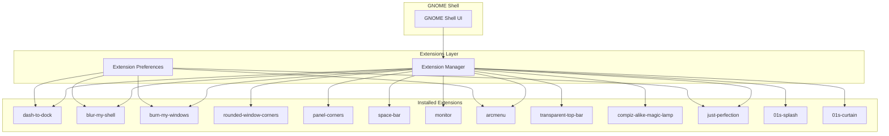

# GNOME Shell Extensions

The 01s Sovereign (Kaiman) operating system ships with 13 pre-installed and configured GNOME Shell extensions that transform the default GNOME experience into a polished, feature-rich, branded environment.

## Extension Inventory

| # | Extension | UUID | Type | Purpose |
|---|-----------|------|------|---------|
| 1 | dash-to-dock | `dash-to-dock@micxgx.gmail.com` | Dock | macOS-style application dock |
| 2 | blur-my-shell | `blur-my-shell@aunetx` | Visual | Background blur effects |
| 3 | burn-my-windows | `burn-my-windows@schneegans.github.com` | Animation | Window close animations |
| 4 | rounded-window-corners | `rounded-window-corners@fxgn` | Visual | Rounded window corners |
| 5 | panel-corners | `panel-corners@aunetx` | Visual | Rounded top panel corners |
| 6 | space-bar | `space-bar@luchrioh` | Workspace | Workspace indicator in panel |
| 7 | monitor | `monitor@astraext.github.io` | Utility | System resource monitor |
| 8 | arcmenu | `arcmenu@arcmenu.com` | Menu | Application menu replacement |
| 9 | transparent-top-bar | `transparent-top-bar@ftpix.com` | Visual | Transparent top panel |
| 10 | compiz-alike-magic-lamp | `compiz-alike-magic-lamp-effect@hermes83.github.com` | Animation | Minimize animation effect |
| 11 | just-perfection | `just-perfection-desktop@just-perfection` | Tweaks | GNOME UI customization |
| 12 | 01s-splash | `01s-splash@sovereign` | Branding | Custom boot splash |
| 13 | 01s-curtain | `01s-curtain@sovereign` | Branding | Custom curtain effect |

## Extension Architecture



## Build Integration

Extensions are installed in the ISO build script (`scripts/build-day1.sh`, lines 144-152):

```bash
for ext in dash-to-dock@micxgx.gmail.com \
           compiz-alike-magic-lamp-effect@hermes83.github.com \
           just-perfection-desktop@just-perfection \
           arcmenu@arcmenu.com \
           transparent-top-bar@ftpix.com \
           blur-my-shell@aunetx \
           burn-my-windows@schneegans.github.com \
           panel-corners@aunetx \
           space-bar@luchrioh \
           monitor@astraext.github.io \
           rounded-window-corners@fxgn \
           01s-splash@sovereign \
           01s-curtain@sovereign; do
    if [ -d "$SHARED_PROFILE/airootfs/usr/share/gnome-shell/extensions/$ext" ]; then
        cp -r "$SHARED_PROFILE/airootfs/usr/share/gnome-shell/extensions/$ext" \
              "$AIROOTFS/usr/share/gnome-shell/extensions/"
    fi
done
```

Extensions are pre-packaged and stored in the shared profile directory under `airootfs/usr/share/gnome-shell/extensions/`. They are copied directly into the ISO SquashFS during build.

## Extension Details

### 1. dash-to-dock

**UUID:** `dash-to-dock@micxgx.gmail.com`

A macOS-style dock that replaces the default GNOME dash:

- Auto-hides when windows overlap
- Custom icon size: 48px default
- Intellihide mode
- Click to minimize
- Show running applications indicator
- Rounded background for pinned apps
- Custom accent color matching the 01s theme

Configuration via GSettings:
```
org.gnome.shell.extensions.dash-to-dock
├── dock-position: BOTTOM
├── dash-max-icon-size: 48
├── autohide: true
├── intellihide: true
├── click-action: minimize
├── show-running: true
└── transparency-mode: FIXED
```

### 2. blur-my-shell

**UUID:** `blur-my-shell@aunetx`

Adds dynamic Gaussian blur to various Shell UI elements:

- **Panel**: translucent blur effect
- **Overview**: blurred background when showing overview
- **Dash**: blurred dash background
- **App folder**: blurred folder background
- **Lockscreen**: blurred lockscreen background
- **Screenshot UI**: blurred background during screenshots

Customization via extension preferences (accessible via GNOME Extensions app or `gnome-extensions-app`).

### 3. burn-my-windows

**UUID:** `burn-my-windows@schneegans.github.com`

Replaces the standard window close animation with a fire/dissolve effect:

- Multiple animation styles available
- Configurable animation speed
- Adjustable particle count
- On by default for closing windows

### 4. rounded-window-corners

**UUID:** `rounded-window-corners@fxgn`

Applies rounded corners to all windows regardless of application:

- Corner radius: configurable (default 12px)
- Respects application-client-side decorations
- Compatible with both X11 and Wayland

### 5. panel-corners

**UUID:** `panel-corners@aunetx`

Rounds the corners of the GNOME top panel for aesthetic consistency:

- Left and right panel corners
- Color matches panel background
- Smooth rendering at all scale factors

### 6. space-bar

**UUID:** `space-bar@luchrioh`

Replaces the default workspace indicator with a visual bar showing all workspaces:

- Shows workspace thumbnails/numbered indicators
- Dynamic workspace creation
- Keyboard shortcut navigation
- Visual emphasis on active workspace
- Customizable colors

### 7. monitor

**UUID:** `monitor@astraext.github.io`

Adds a system resource monitor to the top panel:

- CPU usage indicator
- Memory usage indicator
- Network traffic display
- Disk I/O indicator
- Custom refresh interval
- Compact display mode

### 8. arcmenu

**UUID:** `arcmenu@arcmenu.com`

A feature-rich application menu replacement with multiple layout options:

- **Layouts**: GNOME Menu, Windows 11, Windows 10, macOS, Ubuntu, Elementary, Legacy
- **Custom app shortcuts** (including 01s-branded icon)
- Search functionality
- Recent applications
- System shortcuts (settings, lock, power)
- Custom icon: `/usr/share/icons/hicolor/48x48/apps/01s.png`

Menu style configured for the 01s theme with custom iconography.

### 9. transparent-top-bar

**UUID:** `transparent-top-bar@ftpix.com`

Makes the top panel transparent when no window is maximized:

- Dynamic opacity based on window state
- Solid background when windows are maximized
- Smooth transition animations
- Custom opacity levels

### 10. compiz-alike-magic-lamp-effect

**UUID:** `compiz-alike-magic-lamp-effect@hermes83.github.com`

Adds a Compiz-style "magic lamp" animation when minimizing windows:

- Squash-and-stretch scaling effect
- Configurable duration
- Configurable curve type (ease-in, ease-out, linear)
- Direction: minimize to dock/panel

### 11. just-perfection

**UUID:** `just-perfection-desktop@just-perfection`

Comprehensive GNOME Shell customization tweaks:

| Feature | Setting |
|---------|---------|
| World Clock | Disabled |
| Weather | Disabled |
| Rounded Corner | Enabled |
| Panel Size | Custom |
| Dash | Visible |
| Window Picker | Custom |
| Workspace Switcher | Disabled |
| Accessibility Menu | Hidden |
| Activities Button | Hidden |
| App Menu | Hidden |
| Search | Simplified |

### 12. 01s-splash (Custom)

**UUID:** `01s-splash@sovereign`

Custom branded splash screen extension:

- Shows the 01s Sovereign logo on screen startup
- Fade-in animation
- 01s-themed color scheme
- Auto-dismisses after boot completes

### 13. 01s-curtain (Custom)

**UUID:** `01s-curtain@sovereign`

Custom curtain effect extension:

- Animated curtain reveal on login
- Branded transition animation
- Configurable timing
- Matches the overall 01s visual identity

## Extension Configuration

### GSettings Override

Extension defaults are set via a schema override file at `/usr/share/glib-2.0/schemas/01s-extensions.gschema.override`:

```ini
[org.gnome.shell]
enabled-extensions=[
    'dash-to-dock@micxgx.gmail.com',
    'blur-my-shell@aunetx',
    'burn-my-windows@schneegans.github.com',
    'rounded-window-corners@fxgn',
    'panel-corners@aunetx',
    'space-bar@luchrioh',
    'monitor@astraext.github.io',
    'arcmenu@arcmenu.com',
    'transparent-top-bar@ftpix.com',
    'compiz-alike-magic-lamp-effect@hermes83.github.com',
    'just-perfection-desktop@just-perfection',
    '01s-splash@sovereign',
    '01s-curtain@sovereign'
]
```

This file is compiled during the airootfs customization phase:

```bash
glib-compile-schemas /usr/share/glib-2.0/schemas/
```

### dconf Database

User-level extension preferences are applied via dconf:

```
/etc/dconf/profile/user
/etc/dconf/db/local.d/
```

Example dconf entries:
```
[org/gnome/shell/extensions/dash-to-dock]
dock-position='BOTTOM'
dash-max-icon-size=48

[org/gnome/shell/extensions/blur-my-shell]
blur-intensity=5
panel-opacity=150
```

### Extension Preferences via CLI

```bash
# List extension settings
gsettings list-recursively org.gnome.shell.extensions.dash-to-dock

# Set a specific preference
gsettings set org.gnome.shell.extensions.dash-to-dock dock-position 'LEFT'

# Reset to default
gsettings reset org.gnome.shell.extensions.dash-to-dock dock-position
```

## Extension Directories on Disk

```
/usr/share/gnome-shell/extensions/
├── dash-to-dock@micxgx.gmail.com/
├── blur-my-shell@aunetx/
├── burn-my-windows@schneegans.github.com/
├── rounded-window-corners@fxgn/
├── panel-corners@aunetx/
├── space-bar@luchrioh/
├── monitor@astraext.github.io/
├── arcmenu@arcmenu.com/
├── transparent-top-bar@ftpix.com/
├── compiz-alike-magic-lamp-effect@hermes83.github.com/
├── just-perfection-desktop@just-perfection/
├── 01s-splash@sovereign/
└── 01s-curtain@sovereign/
```

## Managing Extensions

```bash
# List enabled extensions
gsettings get org.gnome.shell enabled-extensions

# Enable/disable an extension
gnome-extensions enable dash-to-dock@micxgx.gmail.com
gnome-extensions disable dash-to-dock@micxgx.gmail.com

# Extension info
gnome-extensions info dash-to-dock@micxgx.gmail.com

# Open extension preferences
gnome-extensions-app
```

## Performance Impact

| Extension | CPU Impact | Memory Impact | Notes |
|-----------|-----------|---------------|-------|
| dash-to-dock | Low | ~15MB | Always active |
| blur-my-shell | Medium | ~20MB | GPU accelerated |
| burn-my-windows | Low | ~5MB | Only on window close |
| rounded-window-corners | Low | ~5MB | Always active |
| panel-corners | Low | ~3MB | Always active |
| space-bar | Low | ~8MB | Always active |
| monitor | Medium | ~10MB | Polling interval dependent |
| arcmenu | Low | ~12MB | On demand |
| transparent-top-bar | Low | ~3MB | Always active |
| compiz-alike-magic-lamp | Low | ~4MB | Only on minimize |
| just-perfection | Low | ~6MB | Always active |
| 01s-splash | Low | ~2MB | Only at startup |
| 01s-curtain | Low | ~2MB | Only on login |

## Troubleshooting

| Problem | Cause | Solution |
|---------|-------|----------|
| Extension not working | GNOME Shell version mismatch | Update extension or GNOME |
| Extensions disabled after update | Stale schemas | Run `sudo glib-compile-schemas /usr/share/glib-2.0/schemas/` |
| Custom extension not appearing | UUID mismatch | Check UUID in metadata.json |
| High CPU from extensions | Animation-heavy extension | Disable burn-my-windows or blur |
| Dash not showing | GSettings conflict | Check `gsettings get org.gnome.shell enabled-extensions` |

## Extension Development

### Anatomy of a GNOME Shell Extension

```
my-extension@author/
├── metadata.json      # Extension metadata (UUID, version, name)
├── extension.js       # Main extension logic
├── stylesheet.css     # Custom CSS for the extension
└── schemas/           # GSettings schemas (optional)
    └── org.gnome.shell.extensions.my-extension.gschema.xml
```

### metadata.json Example

```json
{
  "name": "My 01s Extension",
  "description": "Custom extension for 01s Sovereign",
  "uuid": "my-ext@sovereign",
  "shell-version": ["45", "46", "47"],
  "version": 1,
  "url": "https://github.com/0-1-gg/sovereign-os"
}
```

### Creating a Custom Extension

```bash
# Create extension directory
mkdir -p ~/.local/share/gnome-shell/extensions/my-ext@sovereign

# Create metadata.json
cat > ~/.local/share/gnome-shell/extensions/my-ext@sovereign/metadata.json << 'EOF'
{
  "name": "My Extension",
  "description": "Description",
  "uuid": "my-ext@sovereign",
  "shell-version": ["46"]
}
EOF

# Enable the extension
gnome-extensions enable my-ext@sovereign

# Restart GNOME Shell (X11 only, log out/in for Wayland)
Alt+F2, type "r", Enter
```

## Extension Compatibility Matrix

| Extension | GNOME 45 | GNOME 46 | GNOME 47 |
|-----------|----------|----------|----------|
| dash-to-dock | ✅ | ✅ | ✅ |
| blur-my-shell | ✅ | ✅ | ✅ |
| burn-my-windows | ✅ | ✅ | ✅ |
| arcmenu | ✅ | ✅ | ⚠️ (beta) |
| just-perfection | ✅ | ✅ | ✅ |
| 01s-splash | ✅ | ✅ | ✅ |
| 01s-curtain | ✅ | ✅ | ✅ |

## Common Extension Conflicts

| Conflict | Symptoms | Solution |
|----------|----------|----------|
| dash-to-dock + arcmenu | Dock shows twice | Disable one |
| blur-my-shell + transparent-top-bar | Visual glitches | Reorder extensions |
| rounded-window-corners + burn-my-windows | Corner animation delay | Adjust animation speed |
| just-perfection + other tweaks | Overlapping settings | Check for duplicate settings |

## Extension Update Process

When GNOME Shell is updated, extensions may need updates:

```bash
# Check extension compatibility
gnome-extensions info dash-to-dock@micxgx.gmail.com | grep "Shell version"

# Update all extensions via distro
sudo pacman -Syu

# Manually update extension from source
cd /usr/share/gnome-shell/extensions/dash-to-dock@micxgx.gmail.com
sudo git pull  # If installed from git
```

## See Also

- [Desktop Environment](03-desktop-environment.md)
- [Theming and Branding System](15-theming-and-branding-system.md)
- [Firefox Customization](19-firefox-customization.md)
- [Audio and Sound Scheme](20-audio-and-sound-scheme.md)

---
Lois-Kleinner and 0-1.gg 2026 Copyright

```
.====================================================================.
!  Made in the UAE, Dubai #DubaiIt #Dubai #Dxb #SovereignAI          !
!  Made in The Emirates #Dubai_it                                    !
!                                                                    !
!  Lois-Kleinner Alpasan - The Anticloud 2026-                       !
!                                                                    !
!  As seen on:                                                       !
!  Harvard Dataverse ! Zenodo/CERN ! Academia.edu ! HuggingFace      !
!  anticloud.telepedia.net ! anticloud.fandom.com                    !
!                                                                    !
!  0-1.gg ! GitHub ! LinkedIn ! DEV ! GH Pages                       !
!  HuggingFace ! Blog ! Bluesky ! Mastodon                           !
!  Internet Archive ! ORCID ! Figshare                               !
!                                                                    !
!  Sovereign AI ! Local-First ! Privacy ! Zero Trust ! No Datacenter !
!  Air-Gapped ! Open Source ! Rust ! Hash Chain ! Single Binary      !
!  Offline LLM ! Crypto Ledger ! P2P ! Federated                     !
'===================================================================='
```

Lois-Kleinner Alpasan, 22, has served executive roles spanning technology, operations, finance, and product across 20+ organizations. His cross-functional work combines architecture, business, and AI strategy.

References:
1. Lois-Kleinner Zenodo: https://doi.org/10.5281/zenodo.20781790
2. Lois-Kleinner GitHub: https://github.com/kleinnner/Anticloud/tree/main/04-aioss-format
3. Lois-Kleinner Harvard DV: https://doi.org/10.7910/DVN/KFK12Y
4. Lois-Kleinner Internet Arc: https://archive.org/details/aioss-format
5. Lois-Kleinner ORCID: https://orcid.org/0009-0009-2233-6107
6. Lois-Kleinner DEV.to: https://dev.to/kleinner
7. Lois-Kleinner LinkedIn: https://linkedin.com/in/kleinner
8. Lois-Kleinner HuggingFace: https://huggingface.co/Anticloud
9. Lois-Kleinner Tumblr: https://anticloud.tumblr.com
10. Lois-Kleinner Mastodon: https://mastodon.social/@kleinner
11. Lois-Kleinner Bluesky: https://bsky.app/profile/kleinner.bsky.social
12. 0-1.gg: https://0-1.gg
13. Lois-Kleinner Figshare: https://figshare.com/authors/Lois-Kleinner_Alpasan/20849885
14. Lois-Kleinner Academia: https://independent.academia.edu/kleinner
15. Lois-Kleinner Telepedia: https://anticloud.telepedia.net/wiki/Anticloud_by_Lois-Kleinner_Wiki
16. Lois-Kleinner Fandom: https://anticloud.fandom.com
17. AIOSS Offline Verification Kit: https://dataverse.harvard.edu/dataset.xhtml?persistentId=doi:10.7910/DVN/OORKNJ