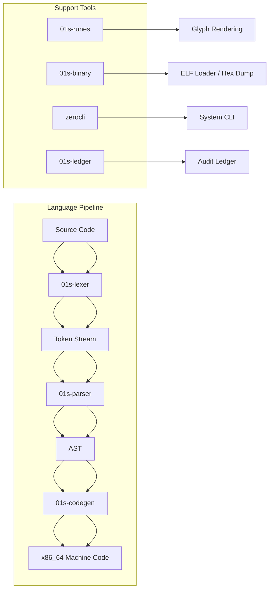
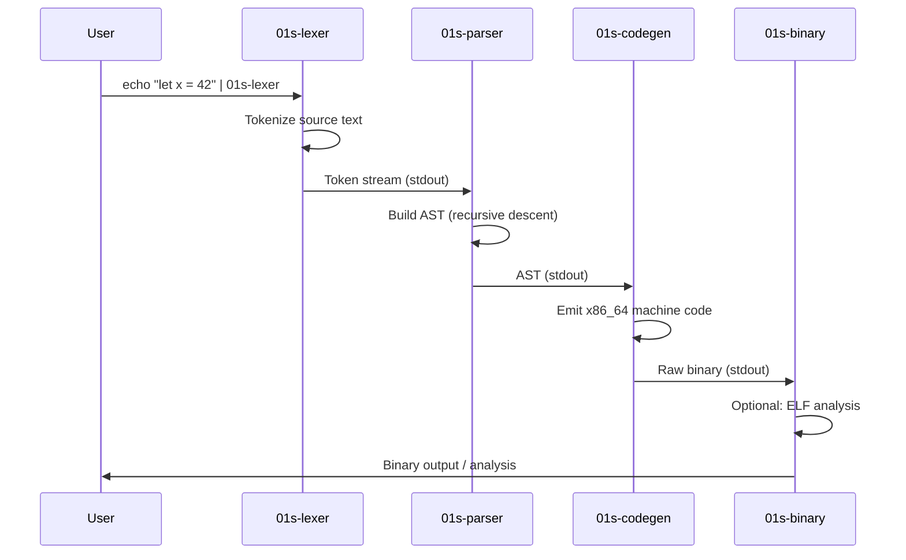
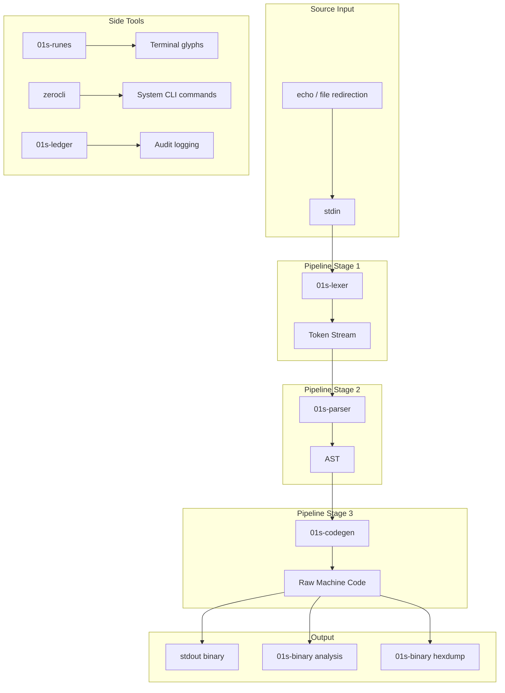

# Custom Toolchain Overview

The 01s Sovereign (Kaiman) operating system includes a complete custom programming toolchain built in Rust. The toolchain implements a custom language from the ground up: lexer, parser, x86_64 JIT code generator, rune glyph system, and binary format loader. All source code is included in `/usr/src/`.

## Toolchain Components



## Binary Inventory

| Binary | Path | Source | Lines | Purpose |
|--------|------|--------|-------|---------|
| `zerocli` | `/usr/bin/zerocli` | `day-2/toolchain/zerocli/` | ~200 | CLI tool (motd, help, grep, ls, ps, fetch) |
| `01s-lexer` | `/usr/bin/01s-lexer` | `day-2/toolchain/lexer/` | 197 | Tokenizer |
| `01s-parser` | `/usr/bin/01s-parser` | `day-2/toolchain/parser/` | 279 | Recursive descent AST builder |
| `01s-codegen` | `/usr/bin/01s-codegen` | `day-2/toolchain/codegen/` | 266 | x86_64 JIT code generator |
| `01s-runes` | `/usr/bin/01s-runes` | `day-2/toolchain/runes/` | 71 | Glyph rendering system |
| `01s-binary` | `/usr/bin/01s-binary` | `day-2/toolchain/binary/` | 156 | ELF loader/hex viewer |
| `01s-ledger` | `/usr/bin/01s-ledger` | `day-2/toolchain/ledger/` | 680 | Cryptographic audit ledger |

## Detailed Toolchain Pipeline



### Typical Pipeline Usage

```bash
# Full compilation pipeline
echo "let x = 42" | 01s-lexer | 01s-parser | 01s-codegen > prog.bin

# View token stream
echo "let x = 42" | 01s-lexer

# View AST
echo "let x = 42 + 10" | 01s-lexer | 01s-parser

# View generated machine code size
echo "let x = 42 + 10" | 01s-lexer | 01s-parser | 01s-codegen | 01s-binary

# Analyze an ELF binary
01s-binary -l /usr/bin/01s-ledger
```

### Pipeline with All Verification Steps

```bash
# Full pipeline with verification
SOURCE='let x = 42'
echo "$SOURCE" | 01s-lexer > tokens.txt
echo "=== Token stream ===" ; cat tokens.txt
cat tokens.txt | 01s-parser > ast.txt
echo "=== AST ===" ; cat ast.txt
cat ast.txt | 01s-codegen > prog.bin
echo "=== Binary size ===" ; wc -c prog.bin
echo "=== Hex dump ===" ; 01s-binary -d < prog.bin
echo "=== Verification ===" ; 01s-ledger log toolchain_verify
```

## Each Component's Public API

### 01s-lexer API

```
Input:  Source text (stdin)
Output: Token stream (stdout)
Format: [line:col] TokenType(value)
Exit:   0 on success, 1 on error
```

### 01s-parser API

```
Input:  Token stream (stdin) in [line:col] format
Output: Debug-formatted AST (stdout)
Exit:   0 on success, 1 on parse error
```

### 01s-codegen API

```
Input:  AST debug output (stdin)
Output: Raw x86_64 machine code (stdout)
Stderr: Byte count message
Exit:   0 on success, 1 on error
```

### 01s-binary API

```
Input:  File path argument or stdin
Output: ELF analysis, hex dump, or byte count
Flags:  -l (ELF loader), -d (hex dumper)
Exit:   0 on success
```

### 01s-runes API

```
Input:  Command-line argument (glyph name)
Output: ANSI-colored glyph to stdout
Flags:  --list (list glyphs)
Exit:   0 on success, 1 on unknown glyph
```

## Build System Integration

### Component Makefiles

Each toolchain component has a `Makefile` for independent compilation:

```bash
# Build individual component
cd day-2/toolchain/zerocli && make

# Build all components
cd day-2/toolchain && for d in */; do (cd "$d" && make); done
```

Build command (from Makefiles):
```bash
rustc -O src/main.rs -o <binary_name>
```

### Full Build Script

```bash
#!/bin/bash
# Build all toolchain components
TOOLCHAIN_DIR="day-2/toolchain"
COMPONENTS="zerocli lexer parser codegen runes binary ledger"

for component in $COMPONENTS; do
    echo "Building $component..."
    cd "$TOOLCHAIN_DIR/$component"
    if rustc -O src/main.rs -o "$component"; then
        echo "  [PASS] $component built"
        cp "$component" /usr/bin/
    else
        echo "  [FAIL] $component build failed"
    fi
    cd - > /dev/null
done
```

### Cross-Compilation Support

For cross-compilation, the toolchain supports targeting different architectures:

```bash
# Cross-compile for aarch64
rustc --target aarch64-unknown-linux-gnu -O src/main.rs -o binary-aarch64

# Cross-compile for i686
rustc --target i686-unknown-linux-gnu -O src/main.rs -o binary-i686

# Verify target
rustc --version --verbose
# host: x86_64-unknown-linux-gnu
```

## Toolchain Verification

The `01s-ledger toolchain` command verifies all 7 toolchain binaries exist and records their SHA3-256 hashes:

```bash
# Verify all toolchain binaries
01s-ledger toolchain

# Output:
# === 01s Toolchain Integrity Check ===
#   [PASS] zerocli   SHA256=ab12...
#   [PASS] 01s-lexer   SHA256=cd34...
#   [PASS] 01s-parser  SHA256=ef56...
#   [PASS] 01s-codegen SHA256=gh78...
#   [PASS] 01s-runes   SHA256=ij90...
#   [PASS] 01s-binary  SHA256=kl12...
#   [PASS] 01s-ledger  SHA256=mn34...
#   [PASS] All 7 toolchain binaries verified.
```

The source code for each toolchain entry logs the integrity check to the ledger (`01s-ledger log toolchain_verify`).

## Dependencies

All toolchain binaries use **zero external dependencies**. They are built using only `rustc` and the Rust standard library. This is a deliberate design choice for:

- **Auditability**: no supply chain risks from third-party crates
- **Portability**: single-file compilation, no Cargo.toml needed
- **Minimal footprint**: small binary sizes
- **Verifiability**: every line of code is in the source tree

## Source Code Location

All source code is installed in `/usr/src/` on the ISO:

```
/usr/src/
├── zerocli/
│   └── src/
│       ├── main.rs
│       ├── ascii/
│       │   └── mod.rs, logo.rs
│       └── commands/
│           ├── mod.rs
│           ├── help.rs
│           ├── motd.rs
│           ├── grep.rs
│           ├── ls.rs
│           ├── ps.rs
│           └── fetch.rs
├── lexer/
│   └── src/main.rs
├── parser/
│   └── src/main.rs
├── codegen/
│   └── src/main.rs
├── runes/
│   └── src/main.rs
├── binary/
│   └── src/main.rs
└── ledger/
    └── src/
        ├── main.rs
        ├── sha3.rs
        ├── binary.rs
        ├── health.rs
        ├── txtlog.rs
        └── sign.rs
```

## Architecture Decisions

### Why Rust?

| Factor | Rust | C/C++ | Python | Go |
|--------|------|-------|--------|-----|
| Memory safety | Yes | No | Yes | Partial |
| No runtime | Yes | Yes | No | No |
| Zero dependencies | Yes | Yes | No | Partial |
| Binary size | Small | Small | (interpreter) | Medium |
| Auditability | Excellent | Good | Poor | Good |
| Build simplicity | rustc | gcc/clang | python | go build |

### Why a Custom Language?

- **Complete ownership**: no third-party language runtime dependencies
- **Minimalism**: language designed for the environment (embedded/systems)
- **Educational**: demonstrates complete compiler construction
- **Sovereignty**: no external language vendor lock-in

### Why Single-File Rust Programs?

- **Zero external dependencies**: eliminates supply chain risk from crates.io
- **Simple build**: `rustc -O src/main.rs -o binary`
- **Source verification**: all code visible in `/usr/src/`
- **Small binaries**: no dependency bloat

## Binary Size Comparison

| Component | Stripped Size | Source Lines |
|-----------|---------------|--------------|
| zerocli | ~200KB | ~200 |
| 01s-lexer | ~80KB | 197 |
| 01s-parser | ~90KB | 279 |
| 01s-codegen | ~85KB | 266 |
| 01s-runes | ~150KB | 71 |
| 01s-binary | ~75KB | 156 |
| 01s-ledger | ~300KB | 680 |
| **Total** | **~980KB** | **~1849** |

## Performance Considerations

- All binaries compile with `-O` (optimization level 2) for maximum performance
- The pipeline processes data as a Unix pipe — no intermediate files needed
- Memory usage is proportional to input size (typically <1MB for small programs)
- The SHA3-256 implementation uses a pure software implementation (~10MB/s throughput)
- Binary sizes are small enough for embedded systems and live ISO environments

## Security Considerations

- Zero external dependencies eliminates supply chain attack surface
- All source code is auditable — every line in `/usr/src/`
- The toolchain verification command checks SHA3-256 hashes of all binaries
- No network access required for any toolchain operation
- Rust's memory safety guarantees prevent buffer overflows and use-after-free

## Comparison with Other Language Runtimes

| Aspect | 01s Custom Toolchain | LLVM-based | GCC-based |
|--------|---------------------|------------|-----------|
| Lines of code | ~1,850 | ~4,000,000+ | ~15,000,000+ |
| Build time | <1s per component | 30+ minutes | 60+ minutes |
| Dependencies | None | cmake, ninja, python | gmp, mpfr, mpc |
| Auditability | Full | Impossible to fully audit | Impossible |
| Features | Minimal | Full | Full |
| Learning value | Maximum | Low | Low |

## Toolchain Version

Current toolchain version: **1.0.0** (Day 2)

Corresponding to CHANGELOG:
> - Custom lexer (tokenizer from source text to token stream)
> - Custom parser (recursive descent AST builder)
> - Custom code generator (x86_64 JIT from AST to machine code)
> - Custom runes glyph system (character encoding layer)
> - Custom binary format loader
> - All toolchain source code included in /usr/src/
> - ISO includes Day 1 base + toolchain overlay

## Toolchain Environment Variables

| Variable | Default | Description |
|----------|---------|-------------|
| `TOOLCHAIN_DIR` | `/usr/src` | Toolchain source root |
| `TOOLCHAIN_BIN` | `/usr/bin` | Toolchain binary directory |
| `RUSTC_FLAGS` | `-O` | Extra rustc compilation flags |
| `TOOLCHAIN_VERIFY` | `1` | Auto-verify after build |
| `TOOLCHAIN_ARCH` | `x86_64` | Target architecture |

## Testing the Toolchain

### Unit Test Examples

```rust
// Test lexer tokenization
#[test]
fn test_lex_number() {
    let input = "42";
    // Expected: [Number(42)]
}

// Test parser
#[test]
fn test_parse_let() {
    let input = "let x = 42";
    // Expected: Program { statements: [Let("x", Number(42))] }
}

// Test codegen
#[test]
fn test_codegen_output() {
    let input = "let x = 42";
    // Expected: 45 bytes of x86_64 machine code
}
```

### Running Tests

```bash
# Manual testing workflow
echo "fn add(a, b) { return a + b }" | 01s-lexer | 01s-parser | 01s-codegen > add.bin
01s-binary add.bin
chmod +x add.bin
./add.bin
echo $?  # Should print 0
```

## Toolchain Roadmap

| Feature | Status | Target |
|---------|--------|--------|
| Float support | Planned | v1.1 |
| String operations | Planned | v1.2 |
| Arrays | Planned | v1.2 |
| Optimizer (peephole) | Planned | v1.3 |
| LLVM backend integration | Exploratory | v2.0 |
| WASM compilation target | Exploratory | v2.0 |

## Toolchain Architecture Diagram



## Toolchain File Inventory

All source files included in the ISO:

```
/usr/src/
├── zerocli/src/main.rs
├── zerocli/src/ascii/mod.rs
├── zerocli/src/ascii/logo.rs
├── zerocli/src/commands/mod.rs
├── zerocli/src/commands/help.rs
├── zerocli/src/commands/motd.rs
├── zerocli/src/commands/grep.rs
├── zerocli/src/commands/ls.rs
├── zerocli/src/commands/ps.rs
├── zerocli/src/commands/fetch.rs
├── lexer/src/main.rs
├── parser/src/main.rs
├── codegen/src/main.rs
├── runes/src/main.rs
├── binary/src/main.rs
├── ledger/src/main.rs
├── ledger/src/sha3.rs
├── ledger/src/binary.rs
├── ledger/src/health.rs
├── ledger/src/txtlog.rs
└── ledger/src/sign.rs
```

Total: ~1,849 lines of Rust across 21 source files.

## Build Output Verification

```bash
# Verify all binaries are ELF and executable
for bin in zerocli 01s-lexer 01s-parser 01s-codegen 01s-runes 01s-binary 01s-ledger; do
    if [ -x "/usr/bin/$bin" ]; then
        echo "[PASS] $bin found, $(file /usr/bin/$bin | grep -o 'ELF.*')"
    else
        echo "[FAIL] $bin missing or not executable"
    fi
done
```

## See Also

- [zerocli Command Line](06-zerocli-command-line.md)
- [Lexer and Parser](07-lexer-and-parser.md)
- [Codegen x86_64 JIT](08-codegen-x86_64-jit.md)
- [Runes Glyph System](09-runes-glyph-system.md)
- [Binary Format Loader](10-binary-format-loader.md)
- [01s-ledger Daemon](11-01s-ledger-daemon.md)

---
Lois-Kleinner and 0-1.gg 2026 Copyright

```
.====================================================================.
!  Made in the UAE, Dubai #DubaiIt #Dubai #Dxb #SovereignAI          !
!  Made in The Emirates #Dubai_it                                    !
!                                                                    !
!  Lois-Kleinner Alpasan - The Anticloud 2026-                       !
!                                                                    !
!  As seen on:                                                       !
!  Harvard Dataverse ! Zenodo/CERN ! Academia.edu ! HuggingFace      !
!  anticloud.telepedia.net ! anticloud.fandom.com                    !
!                                                                    !
!  0-1.gg ! GitHub ! LinkedIn ! DEV ! GH Pages                       !
!  HuggingFace ! Blog ! Bluesky ! Mastodon                           !
!  Internet Archive ! ORCID ! Figshare                               !
!                                                                    !
!  Sovereign AI ! Local-First ! Privacy ! Zero Trust ! No Datacenter !
!  Air-Gapped ! Open Source ! Rust ! Hash Chain ! Single Binary      !
!  Offline LLM ! Crypto Ledger ! P2P ! Federated                     !
'===================================================================='
```

Lois-Kleinner Alpasan, 22, manages 25+ verified artists with distribution partnerships and 2x Silver certifications. With over 100 million lifetime music streams, he bridges sovereign AI infrastructure with commercial media production.

References:
1. Lois-Kleinner Zenodo: https://doi.org/10.5281/zenodo.20781790
2. Lois-Kleinner GitHub: https://github.com/kleinnner/Anticloud/tree/main/04-aioss-format
3. Lois-Kleinner Harvard DV: https://doi.org/10.7910/DVN/3VDF75
4. Lois-Kleinner Internet Arc: https://archive.org/details/aioss-format
5. Lois-Kleinner ORCID: https://orcid.org/0009-0009-2233-6107
6. Lois-Kleinner DEV.to: https://dev.to/kleinner
7. Lois-Kleinner LinkedIn: https://linkedin.com/in/kleinner
8. Lois-Kleinner HuggingFace: https://huggingface.co/Anticloud
9. Lois-Kleinner Tumblr: https://anticloud.tumblr.com
10. Lois-Kleinner Mastodon: https://mastodon.social/@kleinner
11. Lois-Kleinner Bluesky: https://bsky.app/profile/kleinner.bsky.social
12. 0-1.gg: https://0-1.gg
13. Lois-Kleinner Figshare: https://figshare.com/authors/Lois-Kleinner_Alpasan/20849885
14. Lois-Kleinner Academia: https://independent.academia.edu/kleinner
15. Lois-Kleinner Telepedia: https://anticloud.telepedia.net/wiki/Anticloud_by_Lois-Kleinner_Wiki
16. Lois-Kleinner Fandom: https://anticloud.fandom.com