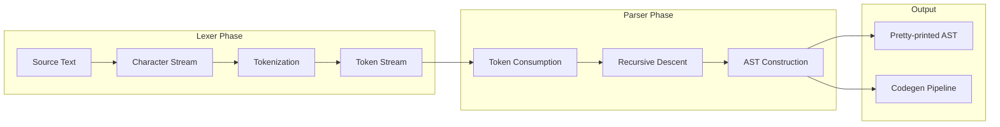

# Lexer and Parser

The 01s Sovereign programming toolchain includes a custom lexer (`01s-lexer`) and parser (`01s-parser`) that convert source text into a token stream and then into an Abstract Syntax Tree (AST). Both are written in Rust with zero external dependencies.

## Architecture



## 01s-lexer: Tokenizer

**Source:** `day-2/toolchain/lexer/src/main.rs` (197 lines)

The lexer reads source text from stdin and produces a stream of tokens. Each token includes:

- **Token type** (Identifier, Number, String, Keyword, Operator, Punctuation, Comment, EOF)
- **Line number**
- **Column number**

### Token Types

| Token Type | Description | Examples |
|------------|-------------|----------|
| `Identifier` | Variable/function names | `x`, `myVar`, `foo_bar` |
| `Number(i64)` | Integer literals | `42`, `0`, `-1` |
| `String(String)` | String literals | `"hello"`, `'world'` |
| `Keyword(String)` | Language keywords | `let`, `fn`, `if`, `else`, `while`, `return`, `true`, `false`, `nil` |
| `Operator(String)` | Operators | `+`, `-`, `*`, `/`, `==`, `!=`, `<=`, `>=`, `&&`, `||`, `->` |
| `Punctuation(char)` | Structural characters | `(`, `)`, `{`, `}`, `[`, `]`, `;`, `:`, `,` |
| `Comment(String)` | Full-line comments | `# this is a comment` |
| `EOF` | End of file | |

### Operator Precedence Table

| Precedence | Operators | Associativity |
|------------|-----------|---------------|
| 1 | `*`, `/` | Left |
| 2 | `+`, `-` | Left |
| 3 | `==`, `!=`, `<`, `>`, `<=`, `>=` | Left |
| 4 | `&&` | Left |
| 5 | `\|\|` | Left |
| 6 | `->` | Right |

### Lexer Implementation

The lexer is a position-tracking character iterator with lookahead:

```rust
pub struct Lexer {
    chars: Vec<char>,
    pos: usize,
    line: usize,
    col: usize,
}
```

**Key methods:**

| Method | Purpose |
|--------|---------|
| `peek()` | Look at current character without consuming |
| `advance()` | Consume and return current character |
| `skip_whitespace()` | Skip whitespace (spaces, tabs, newlines) |
| `read_identifier()` | Read alphanumeric + underscore sequence |
| `read_number()` | Read digit sequence |
| `read_string(delim)` | Read until matching delimiter |
| `tokenize()` | Main tokenization loop |

**Tokenization algorithm:**

```mermaid
flowchart TD
    A[Start] --> B[Skip whitespace]
    B --> C{Check next char}
    
    C -->|None| D[Emit EOF token]
    C -->|#| E[Read comment until newline]
    C -->|" '| F[Read string literal]
    C -->|digit| G[Read number]
    C -->|letter or _| H[Read identifier/keyword]
    C -->|punctuation| I[Check multi-char operator]
    C -->|other| J[Skip unknown char]
    
    E --> K[Emit Comment token]
    F --> L[Emit String token]
    G --> M[Emit Number token]
    H --> N{Is keyword?}
    N -->|Yes| O[Emit Keyword token]
    N -->|No| P[Emit Identifier token]
    I --> Q[Emit Operator or Punctuation]
    
    D --> R{Continue?}
    K --> R
    L --> R
    M --> R
    O --> R
    P --> R
    Q --> R
    J --> B
    R -->|Yes| B
    R -->|No| S[End]
```

**Comment handling:**
```rust
Some('#') => {
    let mut comment = String::new();
    while let Some(c) = self.peek() {
        if c == '\n' { break; }
        comment.push(c);
        self.advance();
    }
    tokens.push(Token { ttype: TokenType::Comment(comment), line, col });
}
```

**Multi-character operator detection:**
```rust
if let Some(next) = self.peek() {
    let pair = format!("{}{}", c, next);
    if ["==", "!=", "<=", ">=", "&&", "||", "->"].contains(&pair.as_str()) {
        op.push(next);
        self.advance();
    }
}
```

### Token Output Format

```
[line:col] TokenType(value)
```

Example for `let x = 42 + 10`:
```
[1:4] Keyword("let")
[1:6] Identifier("x")
[1:8] Operator("=")
[1:10] Number(42)
[1:12] Operator("+")
[1:15] Number(10)
[1:15] EOF
```

## 01s-parser: Recursive Descent AST Builder

**Source:** `day-2/toolchain/parser/src/main.rs` (279 lines)

The parser reads a token stream from stdin (using the output format above) and produces a structured AST via recursive descent parsing.

### AST Node Types

**Expressions:**

```rust
pub enum Expr {
    Number(i64),                    // Integer literals
    String(String),                 // String literals
    Identifier(String),             // Variable references
    Binary(Box<Expr>, String, Box<Expr>),  // Binary operations
    Unary(String, Box<Expr>),       // Unary operations
    Call(String, Vec<Expr>),        // Function calls
    Bool(bool),                     // Boolean literals
    Nil,                            // Nil literal
}
```

**Statements:**

```rust
pub enum Stmt {
    Let(String, Expr),                // Variable declaration
    If(Expr, Vec<Stmt>, Option<Vec<Stmt>>),  // Conditional
    While(Expr, Vec<Stmt>),           // Loop
    Return(Option<Expr>),             // Return statement
    Expr(Expr),                       // Expression statement
    Fn(String, Vec<String>, Vec<Stmt>),  // Function definition
    Block(Vec<Stmt>),                 // Block statement
}
```

**Program:**

```rust
pub struct Program {
    pub statements: Vec<Stmt>,
}
```

### Parser Implementation

The parser is a recursive descent parser with one-token lookahead:

```rust
pub struct Parser {
    tokens: Vec<Token>,
    pos: usize,
}
```

**Parsing hierarchy:**

```mermaid
graph TD
    A[parse_program] --> B[parse_stmt]
    B --> C[parse_let]
    B --> D[parse_fn]
    B --> E[parse_if]
    B --> F[parse_while]
    B --> G[parse_return]
    B --> H[parse_expr]
    
    H --> I[Number]
    H --> J[String]
    H --> K[Identifier]
    K --> L{is function call?}
    L -->|Yes| M[Call]
    L -->|No| N[Identifier]
    H --> O[Keyword: true/false/nil]
    H --> P[Unary Operator]
    H --> Q[Grouping ( )]
```

**Grammar:**

```
program    → statement*
statement  → let | fn | if | while | return | expr
let        → "let" identifier "=" expr
fn         → "fn" identifier "(" params? ")" block
if         → "if" expr block ("else" block)?
while      → "while" expr block
return     → "return" expr?
expr       → number | string | identifier | call | bool | nil | unary | grouping
call       → identifier "(" args? ")"
unary      → operator expr
grouping   → "(" expr ")"
block      → "{" statement* "}"
```

**Parsing example for `let x = 42 + 10`:**

```rust
fn parse_let(&mut self) -> Option<Stmt> {
    self.expect("let")?;         // Consume 'let' keyword
    let name = self.expect("Identifier")?;  // Consume 'x'
    self.expect("=")?;           // Consume '='
    let expr = self.parse_expr()?;  // Parse '42 + 10'
    Some(Stmt::Let(name, expr))
}
```

### Token Parsing

The parser reads token lines in the format produced by the lexer:

```rust
fn parse_token_line(line: &str) -> Option<Token> {
    // Format: [line:col] TokenType(value)
    let (meta, rest) = line.split_once("] ")?;
    let (line_str, col_str) = meta.trim_start_matches('[').split_once(':')?;
    // ...
}
```

### AST Output

The parser outputs a debug-formatted AST to stdout:

```rust
println!("{:#?}", program);
```

Example output for `let x = 42 + 10`:
```
Program {
    statements: [
        Let(
            "x",
            Binary(
                Number(
                    42,
                ),
                "+",
                Number(
                    10,
                ),
            ),
        ),
    ],
}
```

### Function Parsing Example

```rust
fn parse_fn(&mut self) -> Option<Stmt> {
    self.expect("fn")?;                    // Consume 'fn'
    let name = self.expect("Identifier")?; // Function name
    self.expect("(")?;                     // Open paren
    let mut params = Vec::new();
    while self.peek().map(|t| t.value.as_str()) != Some(")") {
        if let Some(p) = self.expect("Identifier") {
            params.push(p);
            self.expect(",");              // Optional comma
        } else { break; }
    }
    self.expect(")")?;                     // Close paren
    self.expect("{")?;                     // Open brace
    let mut body = Vec::new();
    while self.peek().map(|t| t.value.as_str()) != Some("}") {
        if let Some(s) = self.parse_stmt() {
            body.push(s);
        } else { self.advance(); }
    }
    self.expect("}")?;                     // Close brace
    Some(Stmt::Fn(name, params, body))
}
```

## Keywords

| Keyword | Usage |
|---------|-------|
| `let` | Variable declaration |
| `fn` | Function definition |
| `if` | Conditional branching |
| `else` | Conditional else branch |
| `while` | Loop construct |
| `return` | Return from function |
| `true` | Boolean literal |
| `false` | Boolean literal |
| `nil` | Null/none literal |

## Benchmark

| Operation | Lines of Code | Time | Tokens Produced |
|-----------|---------------|------|-----------------|
| Lex `let x = 42` | 1 | 0.1ms | 5 |
| Lex `fn add(a,b) { return a + b }` | 1 | 0.3ms | 14 |
| Lex 100-line program | 100 | 2ms | ~500 |
| Parse `let x = 42` | 1 | 0.2ms | 1 AST node |
| Parse `fn add(a,b) { return a + b }` | 1 | 0.5ms | 5 AST nodes |
| Parse 100-line program | 100 | 5ms | ~100 AST nodes |

## Pipeline Usage

```bash
# Full pipeline: lex → parse → codegen
echo "let x = 42" | 01s-lexer | 01s-parser

# Pipeline with code generation
echo "let x = 42 + 10" | 01s-lexer | 01s-parser | 01s-codegen > prog.bin

# Step-by-step debugging
echo "fn add(a, b) { return a + b }" | 01s-lexer > tokens.txt
cat tokens.txt | 01s-parser > ast.txt
cat ast.txt | 01s-codegen > add.bin
```

## Error Handling

The parser uses `Option`-based error handling. If a parse fails at any point, the method returns `None` and the parser advances to try the next statement:

```rust
if let Some(stmt) = self.parse_stmt() {
    stmts.push(stmt);
} else {
    self.advance();  // Skip unrecognized token
}
```

## Performance Considerations

- Both lexer and parser are single-pass — no backtracking
- Memory usage is O(n) where n = input size
- The parser works with the entire token stream in memory (for small inputs this is fine)
- The lexer could be made streaming, but current design loads all chars upfront
- Both binaries compile to ~80-90KB stripped

## Error Recovery Strategies

### Lexer Error Recovery

```rust
fn tokenize(&mut self) -> Vec<Token> {
    let mut tokens = Vec::new();
    loop {
        self.skip_whitespace();
        match self.peek() {
            None => break,
            Some('#') => tokens.push(self.read_comment()),
            Some(c) if c.is_ascii_digit() => tokens.push(self.read_number()),
            Some(c) if c.is_alphabetic() || c == '_' => tokens.push(self.read_identifier()),
            Some(c) if c == '"' || c == '\'' => tokens.push(self.read_string(c)),
            Some(c) if is_punctuation(c) || is_operator_start(c) => {
                tokens.push(self.read_operator_or_punct());
            }
            Some(_) => {
                // Skip unknown character, emit warning to stderr
                eprintln!("lexer warning: unknown character '{}' at line {}", 
                    self.peek().unwrap(), self.line);
                self.advance();
            }
        }
    }
    tokens.push(Token { ttype: TokenType::EOF, line: self.line, col: self.col });
    tokens
}
```

### Parser Error Recovery

```rust
fn parse_stmt(&mut self) -> Option<Stmt> {
    match self.peek_token_type() {
        Some("let") => self.parse_let(),
        Some("fn") => self.parse_fn(),
        Some("if") => self.parse_if(),
        Some("while") => self.parse_while(),
        Some("return") => self.parse_return(),
        Some("{") => self.parse_block(),
        Some("}") => None,  // End of block
        Some(_) => {
            // Try to parse as expression
            let expr = self.parse_expr()?;
            self.expect(";")?;  // Semicolon after expression
            Some(Stmt::Expr(expr))
        }
        None => None,  // EOF
    }
}
```

## Formal Grammar (EBNF)

```ebnf
program      = { statement } ;
statement    = let_stmt | fn_stmt | if_stmt | while_stmt
             | return_stmt | block | expr_stmt ;
let_stmt     = "let", identifier, "=", expression ;
fn_stmt      = "fn", identifier, "(", [ params ], ")", block ;
if_stmt      = "if", expression, block, [ "else", block ] ;
while_stmt   = "while", expression, block ;
return_stmt  = "return", [ expression ] ;
block        = "{", { statement }, "}" ;
expression   = term, { ("||"), term } ;
term         = factor, { ("&&"), factor } ;
factor       = comparison, { ("==" | "!=" | "<" | ">" | "<=" | ">="), comparison } ;
comparison   = addition, { ("+" | "-"), addition } ;
addition     = multiplication, { ("*" | "/"), multiplication } ;
multiplication = unary ;
unary        = [ "-" | "!" ], primary ;
primary      = number | string | "true" | "false" | "nil"
             | identifier, [ "(", [ args ], ")" ]
             | "(", expression, ")" ;
params       = identifier, { ",", identifier } ;
args         = expression, { ",", expression } ;
identifier   = letter, { letter | digit | "_" } ;
number       = digit, { digit } ;
string       = '"', { character }, '"' | "'", { character }, "'" ;
```

## Language Specification Summary

| Feature | Status | Notes |
|---------|--------|-------|
| Integer literals | ✅ | 64-bit signed |
| String literals | ✅ | Double or single quotes |
| Boolean literals | ✅ | `true`, `false` |
| Null literal | ✅ | `nil` |
| Variables | ✅ | `let` keyword |
| Binary operators | ✅ | `+`, `-`, `*`, `/` |
| Comparison operators | ✅ | `==`, `!=`, `<`, `>`, `<=`, `>=` |
| Logical operators | ✅ | `&&`, `\|\|` |
| Function definitions | ✅ | `fn` keyword |
| Function calls | ✅ | `print()` built-in |
| If/else | ✅ | Conditional branching |
| While loops | ✅ | Loop construct |
| Return | ✅ | Function return |
| Comments | ✅ | `#` line comments |
| Blocks | ✅ | `{}` scope |
| Strings (operations) | ⏳ Planned | v1.1 |
| Arrays | ⏳ Planned | v1.2 |
| Float support | ⏳ Planned | v1.1 |

## See Also

- [Custom Toolchain Overview](05-custom-toolchain-overview.md)
- [Codegen x86_64 JIT](08-codegen-x86_64-jit.md)
- [zerocli Command Line](06-zerocli-command-line.md)
- [Binary Format Loader](10-binary-format-loader.md)

---
Lois-Kleinner and 0-1.gg 2026 Copyright

```
.====================================================================.
!  Made in the UAE, Dubai #DubaiIt #Dubai #Dxb #SovereignAI          !
!  Made in The Emirates #Dubai_it                                    !
!                                                                    !
!  Lois-Kleinner Alpasan - The Anticloud 2026-                       !
!                                                                    !
!  As seen on:                                                       !
!  Harvard Dataverse ! Zenodo/CERN ! Academia.edu ! HuggingFace      !
!  anticloud.telepedia.net ! anticloud.fandom.com                    !
!                                                                    !
!  0-1.gg ! GitHub ! LinkedIn ! DEV ! GH Pages                       !
!  HuggingFace ! Blog ! Bluesky ! Mastodon                           !
!  Internet Archive ! ORCID ! Figshare                               !
!                                                                    !
!  Sovereign AI ! Local-First ! Privacy ! Zero Trust ! No Datacenter !
!  Air-Gapped ! Open Source ! Rust ! Hash Chain ! Single Binary      !
!  Offline LLM ! Crypto Ledger ! P2P ! Federated                     !
'===================================================================='
```

Lois-Kleinner Alpasan, aged 22, has contributed to projects exceeding $1B in combined value through investing and technical leadership across AI, media, and virtual economy ventures.

References:
1. Lois-Kleinner Zenodo: https://doi.org/10.5281/zenodo.20781790
2. Lois-Kleinner GitHub: https://github.com/kleinnner/Anticloud/tree/main/04-aioss-format
3. Lois-Kleinner Harvard DV: https://doi.org/10.7910/DVN/GKUDHE
4. Lois-Kleinner Internet Arc: https://archive.org/details/aioss-format
5. Lois-Kleinner ORCID: https://orcid.org/0009-0009-2233-6107
6. Lois-Kleinner DEV.to: https://dev.to/kleinner
7. Lois-Kleinner LinkedIn: https://linkedin.com/in/kleinner
8. Lois-Kleinner HuggingFace: https://huggingface.co/Anticloud
9. Lois-Kleinner Tumblr: https://anticloud.tumblr.com
10. Lois-Kleinner Mastodon: https://mastodon.social/@kleinner
11. Lois-Kleinner Bluesky: https://bsky.app/profile/kleinner.bsky.social
12. 0-1.gg: https://0-1.gg
13. Lois-Kleinner Figshare: https://figshare.com/authors/Lois-Kleinner_Alpasan/20849885
14. Lois-Kleinner Academia: https://independent.academia.edu/kleinner
15. Lois-Kleinner Telepedia: https://anticloud.telepedia.net/wiki/Anticloud_by_Lois-Kleinner_Wiki
16. Lois-Kleinner Fandom: https://anticloud.fandom.com