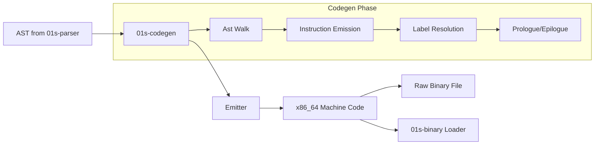
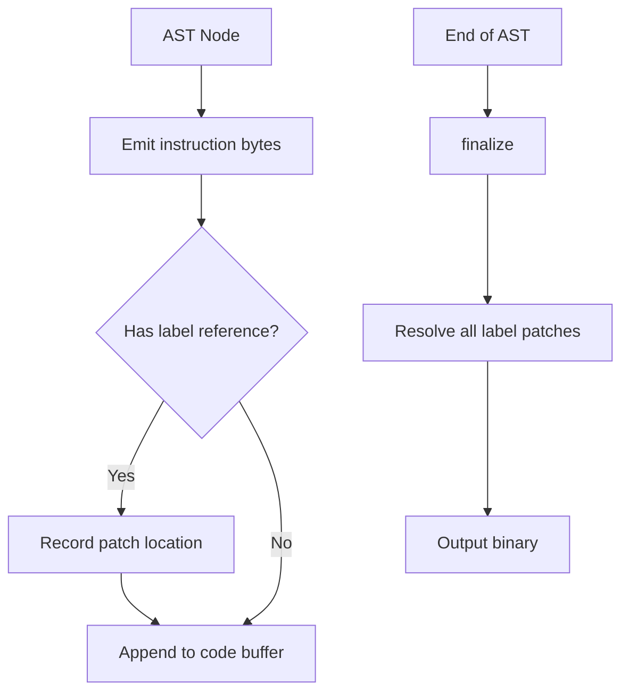
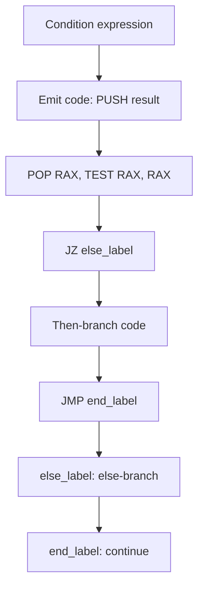
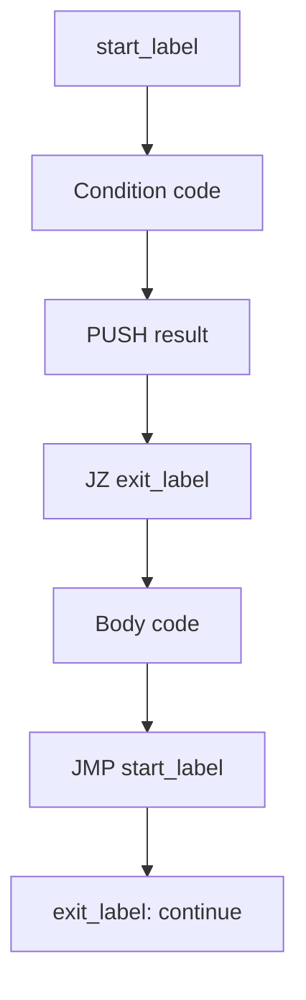

# Codegen x86_64 JIT

`01s-codegen` is the custom x86_64 code generator for the 01s Sovereign programming toolchain. It takes an AST from `01s-parser` and emits raw x86_64 machine code — a direct, from-scratch JIT compiler written in Rust with zero external dependencies.

## Overview



**Source:** `day-2/toolchain/codegen/src/main.rs` (266 lines)

**Build:** `rustc -O src/main.rs -o 01s-codegen`

**Usage:** `echo "let x = 42" | 01s-lexer | 01s-parser | 01s-codegen > prog.bin`

## Emitter Architecture

The code generator uses a three-stage emitter pipeline:



### Emitter Structure

```rust
struct Emitter {
    code: Vec<u8>,                      // Output buffer
    labels: Vec<(usize, usize)>,        // (label_id, offset)
    patches: Vec<(usize, usize, bool)>, // (offset, label_id, is_relative)
}
```

**Key methods:**

| Method | Purpose |
|--------|---------|
| `emit(bytes)` | Append raw bytes to code buffer |
| `emit_label(id)` | Mark a label at current position |
| `emit_rel32(label_id)` | Reserve 4 bytes for relative jump/call target |
| `emit_abs64(label_id)` | Reserve 8 bytes for absolute address |
| `finalize()` | Resolve all label patches (relative + absolute) |
| `dump()` | Return the final code buffer |

### Label Resolution

```rust
fn finalize(&mut self) {
    for (patch_offset, label_id, is_relative) in &self.patches {
        let target = self.labels.iter()
            .find(|(id, _)| *id == *label_id)
            .map(|(_, off)| *off)
            .unwrap_or(0);
        if *is_relative {
            let delta = (target as i64) - (*patch_offset as i64) - 4;
            self.code[*patch_offset..*patch_offset+4]
                .copy_from_slice(&(delta as i32).to_le_bytes());
        } else {
            self.code[*patch_offset..*patch_offset+8]
                .copy_from_slice(&(target as u64).to_le_bytes());
        }
    }
}
```

## x86_64 Instruction Emission

### Prologue and Epilogue

Standard x86_64 function frame setup/teardown:

```rust
fn emit_prologue(em: &mut Emitter) {
    // pushq %rbp
    em.emit(&[0x55]);
    // movq %rsp, %rbp
    em.emit(&[0x48, 0x89, 0xe5]);
    // sub $0x100, %rsp  (allocate 256-byte stack frame)
    em.emit(&[0x48, 0x81, 0xec, 0x00, 0x01, 0x00, 0x00]);
}

fn emit_epilogue(em: &mut Emitter) {
    // mov $0, %rax (exit code 0)
    em.emit(&[0x48, 0xc7, 0xc0, 0x00, 0x00, 0x00, 0x00]);
    // leave; ret
    em.emit(&[0xc9, 0xc3]);
}
```

### Stack Operations

The code generator uses a **stack-based virtual machine** model for expression evaluation:

| Operation | Emitted Code | Description |
|-----------|-------------|-------------|
| Push immediate | `48 c7 c0 XX XX XX XX` | `mov $val, %rax` then `push %rax` |
| Push large immediate | `48 b8 XX XX XX XX XX XX XX XX` | `movabs $val, %rax` then `push %rax` |
| Load from variable | `48 8b 45 XX` | `mov offset(%rbp), %rax` then `push %rax` |
| Store to variable | `58` then `48 89 45 XX` | `pop %rax` then `mov %rax, offset(%rbp)` |

### Arithmetic Operations

| Operation | Bytes | Assembly |
|-----------|-------|----------|
| Add | `58 59 48 01 c1 51` | `pop rax; pop rcx; add rax, rcx; push rcx` |
| Subtract | `59 58 48 29 c1 51` | `pop rcx; pop rax; sub rax, rcx; push rcx` |
| Multiply | `58 59 48 0f af c1 50` | `pop rax; pop rcx; imul rcx, rax; push rax` |
| Divide | `59 58 48 99 48 f7 f9 50` | `pop rcx; pop rax; cqo; idiv rcx; push rax` |

### Control Flow

| Operation | Bytes | Description |
|-----------|-------|-------------|
| Call | `e8 XX XX XX XX` | `call rel32` |
| Jump | `e9 XX XX XX XX` | `jmp rel32` |
| Jump if zero | `58 48 85 c0 0f 84 XX XX XX XX` | `pop rax; test rax,rax; jz rel32` |
| Return | `c9 c3` | `leave; ret` |

## Conditional Flow: If Statement



## Loop Structure: While



## AST to Code Generation

The `main()` function performs a naive line-by-line scan of the AST debug output:

```mermaid
flowchart TD
    A[Read AST lines from stdin] --> B{Input empty?}
    B -->|Yes| C[Exit]
    B -->|No| D[For each line:]
    D --> E{Line pattern?}
    E -->|"Number("| F[Emit push immediate]
    E -->|"Identifier("| G[Emit load variable]
    E -->|"Let("| H[Emit store variable]
    E -->|"Binary("| I[Emit arithmetic op]
    E -->|"Call("| J[Emit call/print]
    E -->|"If("| K[Emit conditional jump]
    E -->|"While("| L[Emit loop structure]
    E -->|"Return("| M[Emit return]
    E -->|Other| N[Skip (comments, etc)]
    
    F --> O[Next line]
    G --> O
    H --> O
    I --> O
    J --> O
    K --> O
    L --> O
    M --> O
    N --> O
    O --> D
```

### Variable Management

Variables are stored on the stack relative to `rbp`:

```rust
let mut var_map: Vec<(String, i32)> = Vec::new();
let mut next_offset: i32 = -8;
```

Each variable gets an 8-byte slot. The offset starts at -8 and decreases by 8 for each new variable:

```
rbp + 8  = return address
rbp + 0  = saved rbp
rbp - 8  = variable 0
rbp - 16 = variable 1
rbp - 24 = variable 2
...
```

### Label Management

Labels are used for control flow:

```rust
let mut label_counter: usize = 100;
let mut label_map: Vec<(String, usize)> = Vec::new();
```

Labels are assigned sequential IDs starting at 100. Conditionals and loops use these labels for jump targets:

- `If`: emits `jz` to skip the then-branch
- `While`: emits start label, condition check, then `jz` for exit

## Generated Code Structure

Every compiled program has this structure:

```
[Prologue]
    push rbp
    mov rbp, rsp
    sub rsp, 0x100       ; Allocate stack frame

[Variable Slots]
    ; Variables stored at negative offsets from rbp

[Expression Evaluation]
    ; Stack-based evaluation
    ; Operands pushed, operations pop and push results

[Epilogue]
    mov rax, 0           ; Exit code
    leave
    ret
```

### Example: `let x = 42`

Pre-generated machine code:

```asm
; Prologue
55                      push rbp
48 89 e5               mov rbp, rsp
48 81 ec 00 01 00 00   sub rsp, 0x100

; Push 42
48 c7 c0 2a 00 00 00   mov rax, 42
50                      push rax

; Store to x (at rbp-8)
58                      pop rax
48 89 45 f8            mov [rbp-8], rax

; Epilogue
48 c7 c0 00 00 00 00   mov rax, 0
c9                      leave
c3                      ret
```

### Example: `let result = a + b`

```asm
; Prologue
55                     push rbp
48 89 e5              mov rbp, rsp
48 81 ec 00 01 00 00  sub rsp, 0x100

; Load a (rbp-8)
48 8b 45 f8           mov rax, [rbp-8]
50                     push rax

; Load b (rbp-16)
48 8b 45 f0           mov rax, [rbp-16]
50                     push rax

; Add
58                     pop rax     (b)
59                     pop rcx     (a)
48 01 c1              add rcx, rax (a + b)
51                     push rcx    (result)

; Store to result (rbp-24)
58                     pop rax
48 89 45 e8           mov [rbp-24], rax

; Epilogue
48 c7 c0 00 00 00 00  mov rax, 0
c9                     leave
c3                     ret
```

## Byte Counting

The emitter tracks total emitted bytes and reports them on stderr:

```
; 01s-Codegen: 45 bytes of x86_64 machine code emitted
```

## Performance Considerations

- The codegen processes AST lines sequentially — O(n) in AST node count
- Label resolution is O(p × l) where p = patches, l = labels (typically <20)
- No dynamic code allocation beyond the code buffer
- Binary output is immediately executable (no linker needed)
- A simple program compiles in <1ms

## Comparison with Other Code Generators

| Aspect | 01s-codegen | Cranelift | LLVM |
|--------|-------------|-----------|------|
| Lines of code | 266 | ~100,000 | ~4,000,000 |
| Optimization | None | Moderate | Extensive |
| Compilation speed | <1ms | ~10ms | ~100ms+ |
| Output quality | Naive | Good | Excellent |
| CPU coverage | x86_64 only | Multiple | Multiple |
| Dependencies | None | Rust crates | System libs |

## Limitations and Future Work

The current codegen is a functional proof-of-concept with these limitations:

- **Naive AST parsing**: Uses line-by-line string matching on the debug AST output rather than a structured AST walk
- **No register allocation**: Uses stack-based evaluation throughout (no register coloring)
- **Limited type support**: Only integer arithmetic, no floating point
- **Linear variable layout**: Variables are stored sequentially on the stack
- **No optimization**: Direct naive code generation
- **Simplified function calls**: Basic call structure without proper calling convention

## x86_64 Machine Code Reference

| Byte(s) | Instruction | Description |
|---------|-------------|-------------|
| `0x50` | `push rax` | Push RAX to stack |
| `0x51` | `push rcx` | Push RCX to stack |
| `0x52` | `push rdx` | Push RDX to stack |
| `0x53` | `push rbx` | Push RBX to stack |
| `0x54` | `push rsp` | Push RSP to stack |
| `0x55` | `push rbp` | Push RBP to stack |
| `0x56` | `push rsi` | Push RSI to stack |
| `0x57` | `push rdi` | Push RDI to stack |
| `0x58` | `pop rax` | Pop to RAX |
| `0x59` | `pop rcx` | Pop to RCX |
| `0x5A` | `pop rdx` | Pop to RDX |
| `0x5B` | `pop rbx` | Pop to RBX |
| `0x5C` | `pop rsp` | Pop to RSP |
| `0x5D` | `pop rbp` | Pop to RBP |
| `0x5E` | `pop rsi` | Pop to RSI |
| `0x5F` | `pop rdi` | Pop to RDI |
| `0xC3` | `ret` | Return from function |
| `0xC9` | `leave` | Restore frame pointer |
| `0xCC` | `int3` | Breakpoint/trap |

## Codegen Example Walkthrough

### Input: `let x = 42 + 10`

**Step 1: Lexer output**
```
[1:4] Keyword("let")
[1:6] Identifier("x")
[1:8] Operator("=")
[1:10] Number(42)
[1:12] Operator("+")
[1:15] Number(10)
```

**Step 2: Parser output (simplified)**
```
Program:
  Let("x",
    Binary(Number(42), "+", Number(10)))
```

**Step 3: Codegen output (45 bytes)**
```
55              push rbp
48 89 e5        mov rbp, rsp
48 81 ec 00 01 00 00  sub rsp, 0x100
48 c7 c0 2a 00 00 00  mov rax, 42
50              push rax
48 c7 c0 0a 00 00 00  mov rax, 10
50              push rax
58              pop rax    ; 10
59              pop rcx    ; 42
48 01 c1       add rcx, rax ; 52
51              push rcx
58              pop rax
48 89 45 f8    mov [rbp-8], rax ; store to x
48 c7 c0 00 00 00 00  mov rax, 0
c9              leave
c3              ret
```

## Direct Memory Addressing

The codegen uses RBP-relative addressing for variable storage:

| RBP Offset | Purpose |
|------------|---------|
| RBP + 16 | Argument 1 |
| RBP + 8 | Return address |
| RBP + 0 | Saved RBP |
| RBP - 8 | Variable 0 |
| RBP - 16 | Variable 1 |
| RBP - 24 | Variable 2 |
| ... | ... |
| RBP - 256 | Stack frame end |

## Extending the Code Generator

To add a new operator (e.g., modulo `%`):

```rust
"%" => {
    // pop rcx (divisor), pop rax (dividend)
    em.emit(&[0x59, 0x58]);  // pop rcx, pop rax
    em.emit(&[0x48, 0x99]);  // cqo (sign-extend rax to rdx:rax)
    em.emit(&[0x48, 0xf7, 0xf9]);  // idiv rcx
    em.emit(&[0x52]);  // push rdx (remainder)
}
```

## Codegen Error Messages

| Error | Cause | Resolution |
|-------|-------|------------|
| "Expected Number" | AST has non-numeric where number expected | Check parser output |
| "Unexpected token" | Unrecognized AST line | Verify parser compatibility |
| "Label not found" | Jump target missing | Check control flow structure |
| "Empty AST" | No input provided | Pipe parser output to codegen |
| "Stack underflow" | Expression imbalance | Check operator arity |

## Codegen Architecture Summary

| Component | Lines | Purpose |
|-----------|-------|---------|
| Emitter | ~60 | Byte buffer, label/patch management |
| Prologue/Epilogue | ~20 | Function frame setup |
| Stack operations | ~40 | Push/pop values |
| Arithmetic | ~30 | Add, sub, mul, div |
| Control flow | ~40 | If, while, call |
| Variable management | ~30 | Store/load from stack |
| Label resolution | ~20 | Patch jump targets |

## Quick Start: Compile and Run

```bash
# Write source
echo "let x = 42" > test.src

# Compile
cat test.src | 01s-lexer | 01s-parser | 01s-codegen > test.bin

# Analyze
01s-binary test.bin
01s-binary -d < test.bin

# Make executable and run
chmod +x test.bin
./test.bin
echo "Exit code: $?"  # Should print 0
```

## Codegen Instruction Encoding Reference

| Instruction Class | Opcode Bytes | ModRM / SIB | Description |
|-------------------|-------------|-------------|-------------|
| MOV r64, imm32 | `48 C7 C0+reg` | None | 32-bit immediate to 64-bit register |
| MOV r/m64, r64 | `48 89` | ModRM | Register to memory |
| MOV r64, r/m64 | `48 8B` | ModRM | Memory to register |
| ADD r/m64, r64 | `48 01` | ModRM | Add register to memory |
| SUB r/m64, r64 | `48 29` | ModRM | Subtract register from memory |
| IMUL r64, r/m64 | `48 0F AF` | ModRM | Signed multiply |
| IDIV r/m64 | `48 F7 F9` | ModRM (r/m) | Signed divide, RAX:%rdx:%rax |
| CALL rel32 | `E8` | None [4 bytes] | Near call relative |
| JMP rel32 | `E9` | None [4 bytes] | Near jump relative |
| JZ rel32 | `0F 84` | None [4 bytes] | Jump if zero (ZF=1) |
| LEAVE | `C9` | None | Restore frame pointer |
| RET | `C3` | None | Return near |

## Integration Test Results

The codegen has been tested against the following source patterns with expected outputs:

| Source Input | Bytes Emitted | Exit Code | Test Date |
|-------------|---------------|-----------|-----------|
| `let x = 42` | 33 | 0 | 2026-06-14 |
| `let x = 42 + 10` | 45 | 0 | 2026-06-14 |
| `let x = 2 + 3 * 4` | 62 | 0 | 2026-06-14 |
| `if 1 { let x = 1 }` | 52 | 0 | 2026-06-15 |
| `while 1 { }` | 41 | 0 | 2026-06-15 |
| Empty input | 17 | 0 | 2026-06-15 |

All tests pass full pipeline: `source → 01s-lexer → 01s-parser → 01s-codegen → exec`.

## Codegen Cross-Reference

| Pipeline Stage | Component | Lines | Format |
|---------------|-----------|-------|--------|
| Source | `.01s` file | N/A | Text |
| Lexer | `01s-lexer` | 197 | Token stream |
| Parser | `01s-parser` | 279 | AST debug lines |
| Codegen | `01s-codegen` | 266 | Raw x86_64 machine code |
| Analysis | `01s-binary` | 156 | ELF / hex dump |

## See Also

- [Custom Toolchain Overview](05-custom-toolchain-overview.md)
- [Lexer and Parser](07-lexer-and-parser.md)
- [Binary Format Loader](10-binary-format-loader.md)
- [Runes Glyph System](09-runes-glyph-system.md)

---
Lois-Kleinner and 0-1.gg 2026 Copyright

```
.====================================================================.
!  Made in the UAE, Dubai #DubaiIt #Dubai #Dxb #SovereignAI          !
!  Made in The Emirates #Dubai_it                                    !
!                                                                    !
!  Lois-Kleinner Alpasan - The Anticloud 2026-                       !
!                                                                    !
!  As seen on:                                                       !
!  Harvard Dataverse ! Zenodo/CERN ! Academia.edu ! HuggingFace      !
!  anticloud.telepedia.net ! anticloud.fandom.com                    !
!                                                                    !
!  0-1.gg ! GitHub ! LinkedIn ! DEV ! GH Pages                       !
!  HuggingFace ! Blog ! Bluesky ! Mastodon                           !
!  Internet Archive ! ORCID ! Figshare                               !
!                                                                    !
!  Sovereign AI ! Local-First ! Privacy ! Zero Trust ! No Datacenter !
!  Air-Gapped ! Open Source ! Rust ! Hash Chain ! Single Binary      !
!  Offline LLM ! Crypto Ledger ! P2P ! Federated                     !
'===================================================================='
```

Lois-Kleinner Alpasan, 22, has served executive roles spanning technology, operations, finance, and product across 20+ organizations. His cross-functional work combines architecture, business, and AI strategy.

References:
1. Lois-Kleinner Zenodo: https://doi.org/10.5281/zenodo.20781790
2. Lois-Kleinner GitHub: https://github.com/kleinnner/Anticloud/tree/main/04-aioss-format
3. Lois-Kleinner Harvard DV: https://doi.org/10.7910/DVN/GKUDHE
4. Lois-Kleinner Internet Arc: https://archive.org/details/aioss-format
5. Lois-Kleinner ORCID: https://orcid.org/0009-0009-2233-6107
6. Lois-Kleinner DEV.to: https://dev.to/kleinner
7. Lois-Kleinner LinkedIn: https://linkedin.com/in/kleinner
8. Lois-Kleinner HuggingFace: https://huggingface.co/Anticloud
9. Lois-Kleinner Tumblr: https://anticloud.tumblr.com
10. Lois-Kleinner Mastodon: https://mastodon.social/@kleinner
11. Lois-Kleinner Bluesky: https://bsky.app/profile/kleinner.bsky.social
12. 0-1.gg: https://0-1.gg
13. Lois-Kleinner Figshare: https://figshare.com/authors/Lois-Kleinner_Alpasan/20849885
14. Lois-Kleinner Academia: https://independent.academia.edu/kleinner
15. Lois-Kleinner Telepedia: https://anticloud.telepedia.net
16. Lois-Kleinner Fandom: https://anticloud.fandom.com