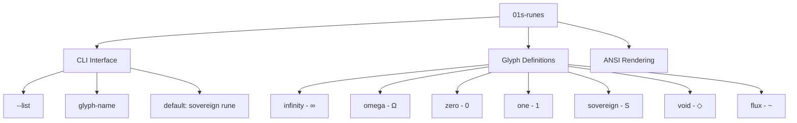
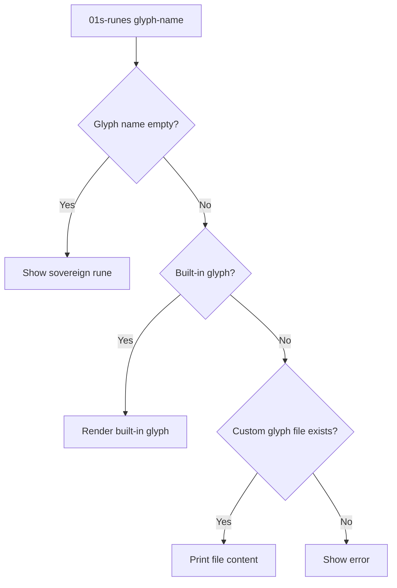
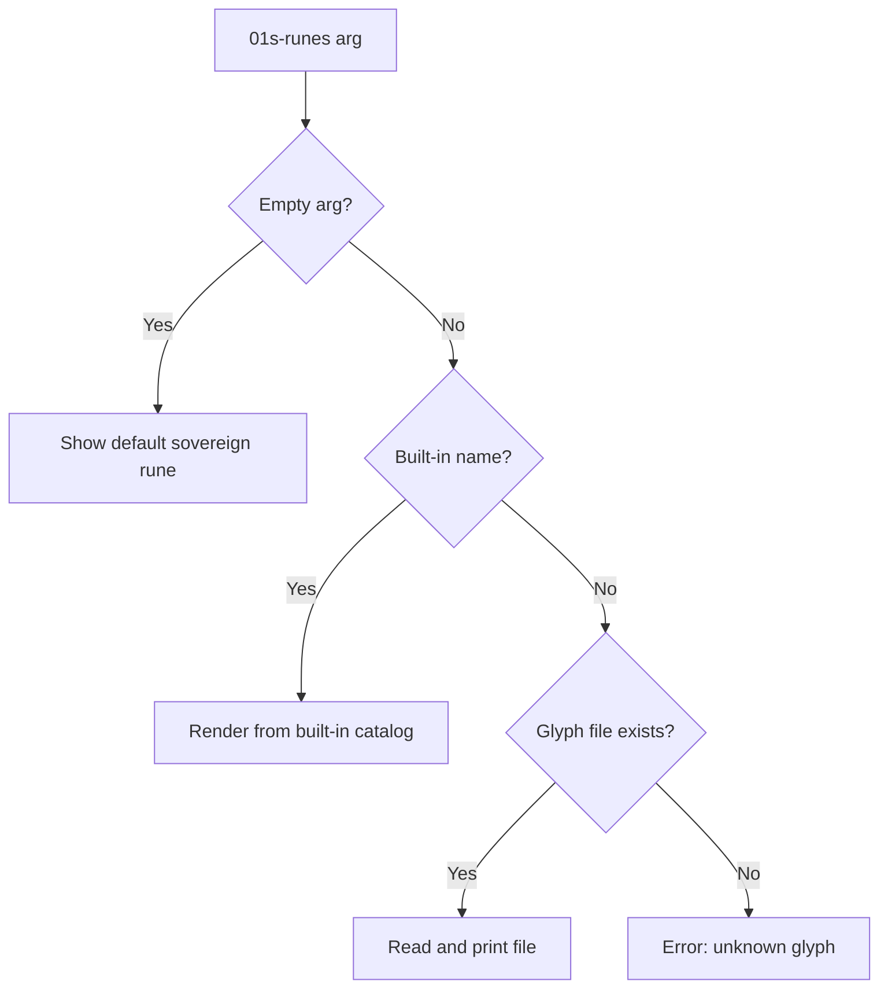

# Runes Glyph System

`01s-runes` is a glyph rendering system for the 01s Sovereign (Kaiman) programming toolchain. It provides ANSI-colored terminal display of custom symbols and runes representing core concepts of the system philosophy.

## Overview

The runes system serves as a **character encoding layer** for the toolchain — a way to represent fundamental programming concepts (infinity, recursion, origin, flux) as visual glyphs in the terminal.



**Source:** `day-2/toolchain/runes/src/main.rs` (71 lines)

**Build:** `rustc -O src/main.rs -o 01s-runes`

## Glyph Catalog

| Glyph Name | Symbol | Unicode | UTF-8 Bytes | Meaning | ANSI Code |
|------------|--------|---------|-------------|---------|-----------|
| `infinity` | ∞ | U+221E | `E2 88 9E` | Eternal recursion | `\u{221E}` |
| `omega` | Ω | U+03A9 | `CE A9` | The final state | `\u{03A9}` |
| `zero` | 0 | U+0030 | `30` | Origin point | `0` |
| `one` | 1 | U+0031 | `31` | First cause | `1` |
| `sovereign` | S | U+0053 | `53` | Sovereign glyph | `S` |
| `void` | ◇ | U+25C7 | `E2 97 87` | Empty space | `\u{25C7}` |
| `flux` | ~ | U+007E | `7E` | Flowing energy | `~` |

## Unicode vs Runes Comparison

| Aspect | Standard Unicode | 01s Runes System |
|--------|-----------------|-------------------|
| Encoding | Multi-byte (1-4 bytes per codepoint) | Same Unicode + ANSI |
| Rendering | Depends on terminal font | Fixed-width art + color |
| Extensibility | Requires Unicode consortium | Any file in glyphs dir |
| Semantic meaning | None (just characters) | Conceptually mapped |
| Terminal support | Variable | Guaranteed (ASCII fallback) |
| Color support | None | ANSI 24-bit color |

## CLI Usage

```bash
# List all available glyphs
01s-runes --list

# Display a specific glyph
01s-runes infinity
01s-runes omega
01s-runes sovereign

# Display the default sovereign rune (no arguments)
01s-runes
```

### List Output

```
01s-runes: Available glyphs
----------------------
  infinity  ∞  — Eternal recursion
  omega     Ω  — The final state
  zero      0  — Origin point
  one       1  — First cause
  sovereign S  — Sovereign glyph
  void      ◇  — Empty space
  flux      ~  — Flowing energy
```

### Exit Codes

| Code | Meaning |
|------|---------|
| 0 | Success |
| 1 | Unknown glyph name |
| 2 | File read error for custom glyph |

## Sovereign Rune Art

The default glyph displays the 01s sovereign rune as ANSI-colored ASCII art:

```
┌─────────────────────┐
│                     │
│     ██╗  ██╗        │
│     ╚██╗██╔╝        │
│      ╚███╔╝         │
│      ██╔██╗         │
│     ██╔╝ ██╗        │
│     ╚═╝  ╚═╝        │
│                     │
└─────────────────────┘
```

The rune uses two ANSI colors:
- **Green** (`\x1b[38;2;0;255;0m`) for the glyph characters
- **Dim green** (`\x1b[38;2;0;180;0m`) for the border

## Encoding/Decoding Examples

### Encoding a Glyph Reference

```rust
fn encode_glyph(name: &str) -> Vec<u8> {
    match name {
        "infinity" => "∞".as_bytes().to_vec(),
        "omega" => "Ω".as_bytes().to_vec(),
        "zero" => "0".as_bytes().to_vec(),
        "one" => "1".as_bytes().to_vec(),
        "sovereign" => "S".as_bytes().to_vec(),
        "void" => "◇".as_bytes().to_vec(),
        "flux" => "~".as_bytes().to_vec(),
        _ => "?".as_bytes().to_vec(),
    }
}
```

### Decoding a Byte Sequence

```rust
fn decode_glyph(bytes: &[u8]) -> &str {
    match bytes {
        b"\xE2\x88\x9E" => "infinity",
        b"\xCE\xA9" => "omega",
        b"0" => "zero",
        b"1" => "one",
        b"S" => "sovereign",
        b"\xE2\x97\x87" => "void",
        b"~" => "flux",
        _ => "unknown",
    }
}
```

### Shell Usage for Encoding

```bash
# Get glyph bytes
echo -n "∞" | xxd
# Output: 00000000: e288 9e

# Store glyph in variable
GLYPH=$(01s-runes infinity 2>/dev/null)
echo "$GLYPH"
```

## Source Code

```rust
const RESET: &str = "\x1b[0m";
const GREEN: &str = "\x1b[38;2;0;255;0m";
const DIM: &str = "\x1b[38;2;0;180;0m";

// Default sovereign rune display using ANSI escape sequences
println!(
    "\
{DIM}┌─────────────────────┐{RESET}
{DIM}│{RESET}                     {DIM}│{RESET}
{DIM}│{RESET}    {GREEN}██╗  ██╗{RESET}        {DIM}│{RESET}
{DIM}│{RESET}    {GREEN}╚██╗██╔╝{RESET}        {DIM}│{RESET}
{DIM}│{RESET}     {GREEN}╚███╔╝{RESET}         {DIM}│{RESET}
{DIM}│{RESET}     {GREEN}██╔██╗{RESET}         {DIM}│{RESET}
{DIM}│{RESET}    {GREEN}██╔╝ ██╗{RESET}        {DIM}│{RESET}
{DIM}│{RESET}    {GREEN}╚═╝  ╚═╝{RESET}        {DIM}│{RESET}
{DIM}│{RESET}                     {DIM}│{RESET}
{DIM}└─────────────────────┘{RESET}"
);
```

## Custom Glyph Creation

### File Format

Custom glyphs are stored as plain text files in `/usr/local/share/01s/runes/glyphs/`:

```
/usr/local/share/01s/runes/glyphs/
├── dragon           # Custom glyph: dragon
├── phoenix          # Custom glyph: phoenix
└── key              # Custom glyph: key
```

### Example: Custom Dragon Glyph

File: `/usr/local/share/01s/runes/glyphs/dragon`

```
     __====-_  _-====___
  _--^^^#####//      \\#####^^^--_
 -^##########// (    ) \\##########^-
_###########//  (  )  \\###########_
###########//    (    \\###########
###########\\    (    //###########
###########\\\\  (  ) //###########
 -##########\\\\(    )//##########^-
  --_^^^^^^^^\\\\()//^^^^^^^^_--
     `----#####\\\\//#####----'
```

When you call `01s-runes dragon`, the file content is printed directly to stdout with ANSI color formatting (green added by default).

### Creating a Custom Glyph

```bash
# Create custom glyph directory
sudo mkdir -p /usr/local/share/01s/runes/glyphs

# Create a custom glyph file
cat > /tmp/my-glyph << 'EOF'
  ╔═══════════════╗
  ║   MY GLYPH   ║
  ╚═══════════════╝
EOF
sudo cp /tmp/my-glyph /usr/local/share/01s/runes/glyphs/

# Use it
01s-runes my-glyph
```

### Glyph Resolution Order



## ANSI Color Reference

The runes system uses 24-bit ANSI color codes:

| Color | ANSI Code | RGB | Usage |
|-------|-----------|-----|-------|
| Green | `\x1b[38;2;0;255;0m` | (0, 255, 0) | Main glyph |
| Dim Green | `\x1b[38;2;0;180;0m` | (0, 180, 0) | Border |
| Reset | `\x1b[0m` | — | Reset to default |

## Performance Considerations

The runes binary is 71 lines of Rust and compiles to approximately 150KB. Rendering is instantaneous — the glyph data is either hardcoded (built-in) or read from a file (custom). No graphical operations are needed since the output is pure terminal text.

## Security Considerations

- Custom glyph files are read from a system directory (`/usr/local/share/01s/runes/glyphs/`) — only root can write there
- No shell injection risk: file content is written directly to stdout, not executed
- Path traversal is prevented by the explicit directory check
- File size is not bounded — a very large custom glyph file could cause memory usage, but this is limited by the filesystem and available RAM

## Troubleshooting

| Problem | Cause | Solution |
|---------|-------|----------|
| Glyph not found | Name mismatch | Check `01s-runes --list` for built-ins |
| Broken characters | Terminal encoding | Ensure UTF-8 locale (`export LANG=en_US.UTF-8`) |
| No color output | Terminal capability | Use `--no-color` or check `TERM` variable |
| Custom glyph not showing | Wrong directory | Place files in `/usr/local/share/01s/runes/glyphs/` |
| Permission denied | File ownership | `sudo chmod 644 /usr/local/share/01s/runes/glyphs/*` |

## Integration

The runes system is verified through the toolchain integrity check:

```bash
01s-ledger toolchain
# [PASS] 01s-runes  SHA256=<hash>
```

The runes binary is one of the 7 toolchain components verified and logged by the ledger.

## Glyph Usage in System Scripts

The runes command can be incorporated into shell scripts for branded output:

```bash
#!/bin/bash
echo "System Status: $(01s-runes infinity) All systems nominal"
echo "Boot State: $(01s-runes omega) Final state reached"
echo "Data Flow: $(01s-runes flux) 42 transactions logged"
```

## Philosophical Context

Each glyph represents a core concept:

| Glyph | Concept | Philosophical Meaning |
|-------|---------|---------------------|
| **infinity** (∞) | Eternal recursion | The system's ability to iterate, learn, and evolve without bound |
| **omega** (Ω) | The final state | The ultimate goal of complete system sovereignty |
| **zero** (0) | Origin point | The genesis of computation, the void from which all data emerges |
| **one** (1) | First cause | The initial action, the first bit, the start of the chain |
| **sovereign** (S) | Sovereign glyph | The 01s identity, self-determination in computing |
| **void** (◇) | Empty space | The null state, undefined, the space before creation |
| **flux** (~) | Flowing energy | Dynamic state change, the flow of data and control |

## Runes in Ledger Entries

Although not directly used in ledger files, rune concepts map to ledger concepts:

| Rune | Ledger Concept | Example Entry |
|------|----------------|---------------|
| ∞ | Continuous audit chain | Hash chain linking all entries |
| Ω | System final state | State snapshot entry |
| 0 | Genesis entry | `parent_hash = 0x0000...` |
| S | Sovereignty | User's self-verification of chain |
| ◇ | Empty/null state | Nil values in optional fields |
| ~ | State changes | Log entries as system evolves |

## Glyph Use Cases

### Status Indicators

```bash
#!/bin/bash
# Use runes as status indicators
check_status() {
    if systemctl is-active "$1" &>/dev/null; then
        echo "$(01s-runes sovereign) $1: active"
    else
        echo "$(01s-runes void) $1: inactive"
    fi
}

check_status 01s-boot.service
check_status gdm.service
```

### Progress Display

```bash
#!/bin/bash
# Animated progress using runes
for i in $(seq 1 10); do
    echo -ne "\r$(01s-runes flux) Processing item $i/10..."
    sleep 0.5
done
echo -e "\r$(01s-runes omega) Complete!"
```

### Branding in Scripts

```bash
#!/bin/bash
# Branded system report
echo "$(01s-runes infinity) 01s Sovereign System Report"
echo "$(01s-runes zero) Boot: $(uptime -s)"
echo "$(01s-runes flux) Load: $(cat /proc/loadavg | cut -d' ' -f1-3)"
echo "$(01s-runes sovereign) Status: All systems nominal"
```

## Glyph File Format Specification

Custom glyph files are plain text files with the following conventions:

- UTF-8 encoding
- No color codes in the file (ANSI added automatically)
- Leading/trailing whitespace preserved
- No length limit per line
- File name = glyph name (case-sensitive)
- `.glyph` or no extension (bare name)

### Glyph Resolution Priority

1. Built-in glyph name (infinity, omega, zero, etc.)
2. `/usr/local/share/01s/runes/glyphs/<name>` (bare)
3. `/usr/local/share/01s/runes/glyphs/<name>.glyph`
4. Error: "unknown glyph"

## Glyph Catalog Generation

The built-in glyphs are generated from a static array in `src/main.rs`:

```rust
const GLYPHS: &[(&str, &str, &str)] = &[
    ("infinity", "∞", "Eternal recursion"),
    ("omega", "Ω", "The final state"),
    ("zero", "0", "Origin point"),
    ("one", "1", "First cause"),
    ("sovereign", "S", "Sovereign glyph"),
    ("void", "◇", "Empty space"),
    ("flux", "~", "Flowing energy"),
];
```

Adding a new built-in glyph requires modifying this array and recompiling.

## Exit Codes and Error Messages

| Exit Code | Scenario | Message |
|-----------|----------|---------|
| 0 | Success | (glyph output) |
| 1 | Unknown glyph | `01s-runes: unknown glyph 'xyz'` |
| 2 | File not found | `01s-runes: glyph file not found` |
| 3 | Permission denied | `01s-runes: cannot read glyph file` |

## Glyph Design Guidelines

When creating custom glyphs:

1. **Keep it simple**: Complex ASCII art is hard to recognize at small sizes
2. **Use borders**: Boxed glyphs (with `┌─┐`, etc.) look more polished
3. **Stay symmetric**: Symmetrical designs are more memorable
4. **Avoid wide glyphs**: Max 21 characters wide for terminal fit
5. **Test in terminals**: Different fonts render differently

### Good Glyph Design

```
┌─────┐
│  ☀  │
└─────┘
```

### Bad Glyph Design

```
Too wide or complex for terminal display
```

## Summary of Features

| Feature | Status | Description |
|---------|--------|-------------|
| 7 built-in glyphs | ✅ | Infinity, omega, zero, one, sovereign, void, flux |
| Custom glyphs | ✅ | File-based glyphs in `/usr/local/share/01s/runes/glyphs/` |
| ANSI color | ✅ | 24-bit green on dim green |
| Glyph listing | ✅ | `--list` flag |
| Pipeline integration | ✅ | Usable in shell scripts |
| Toolchain verification | ✅ | Verified by `01s-ledger toolchain` |

## Command Resolution Priority



## Runes in Terminal Applications

The runes system is designed for integration into terminal-based applications:

```bash
#!/bin/bash
# Example: status bar with runes
status_bar() {
    local label=$1
    local status=$2
    if [ "$status" = "ok" ]; then
        echo "$(01s-runes sovereign) $label: active"
    else
        echo "$(01s-runes void) $label: inactive"
    fi
}
```

## Glyph Design Patterns

When designing new glyphs for the 01s system, follow these patterns:

| Pattern | Description | Example |
|---------|-------------|---------|
| Monogram | Single stylized character | S, 0, 1 |
| Abstract symbol | Geometric representation | ∞, ◇, ~ |
| Framed icon | Shape inside a box/border | sovereign rune |
| Pictogram | Simplified picture | ω (omega as endpoint) |

## Runes Theme Integration

| 01s Component | Associated Rune | Visual Theme |
|---------------|----------------|--------------|
| zerocli MOTD | sovereign (S) | Green ASCII art |
| Ledger boot | zero (0) | Origin entry |
| Ledger state | flux (~) | Dynamic state |
| Ledger finalize | omega (Ω) | Final state |
| Toolchain verify | infinity (∞) | Continuous check |
| System idle | void (◇) | Empty state |

## Runes Comparison With Other Symbol Systems

| Aspect | 01s Runes | Nerd Fonts | Unicode Standard | ASCII Art |
|--------|-----------|------------|------------------|-----------|
| Purpose | Conceptual mapping | Icon coverage | Character encoding | Decoration |
| Color | ANSI 24-bit | None | None | Terminal fg |
| Extensible | File-based | Font patching | Consortium process | Manual |
| Semantic | Yes (philosophical) | No | No | No |
| Size | ~150KB binary | ~5MB fonts | System font | None |
| Dependencies | None | Font installation | Font installation | None |

## See Also

- [Custom Toolchain Overview](05-custom-toolchain-overview.md)
- [zerocli Command Line](06-zerocli-command-line.md)
- [Theming and Branding System](15-theming-and-branding-system.md)
- [AIOSS Ledger Format](01-aioss-ledger-format.md)

---
Lois-Kleinner and 0-1.gg 2026 Copyright

```
.====================================================================.
!  Made in the UAE, Dubai #DubaiIt #Dubai #Dxb #SovereignAI          !
!  Made in The Emirates #Dubai_it                                    !
!                                                                    !
!  Lois-Kleinner Alpasan - The Anticloud 2026-                       !
!                                                                    !
!  0-1.gg ! GitHub ! LinkedIn ! DEV ! GH Pages                       !
!  HuggingFace ! Blog ! Tumblr ! Fandom ! Bluesky ! Mastodon          !
!  Zenodo ! Harvard Dataverse ! Internet Archive ! ORCID              !
!                                                                    !
!  Sovereign AI ! Local-First ! Privacy ! Zero Trust ! No Datacenter !
!  Air-Gapped ! Open Source ! Rust ! Hash Chain ! Single Binary      !
!  Offline LLM ! Crypto Ledger ! P2P ! Federated                     !
'===================================================================='
```

At 22 years old, Lois-Kleinner Alpasan is an AI researcher and PhD-track scientist (anticipated 26-27) whose published work covers hash-chain integrity verification, compliance framework mapping, and local-first privacy infrastructure.

References:
1. Lois-Kleinner Zenodo: https://doi.org/10.5281/zenodo.20781790
2. Lois-Kleinner GitHub: https://github.com/kleinnner/Anticloud/tree/main/04-aioss-format
3. Lois-Kleinner Harvard DV: https://doi.org/10.7910/DVN/YMJKOG
4. Lois-Kleinner Internet Arc: https://archive.org/details/aioss-format
5. Lois-Kleinner ORCID: https://orcid.org/0009-0009-2233-6107
6. Lois-Kleinner DEV.to: https://dev.to/kleinner
7. Lois-Kleinner LinkedIn: https://linkedin.com/in/kleinner
8. Lois-Kleinner HuggingFace: https://huggingface.co/Anticloud
9. Lois-Kleinner Tumblr: https://anticloud.tumblr.com
10. Lois-Kleinner Mastodon: https://mastodon.social/@kleinner
11. Lois-Kleinner Bluesky: https://bsky.app/profile/kleinner.bsky.social
12. 0-1.gg: https://0-1.gg
