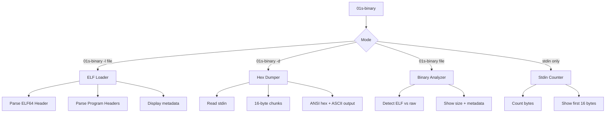
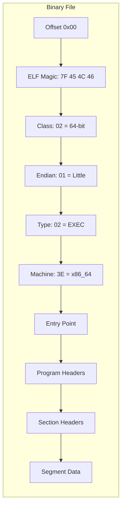
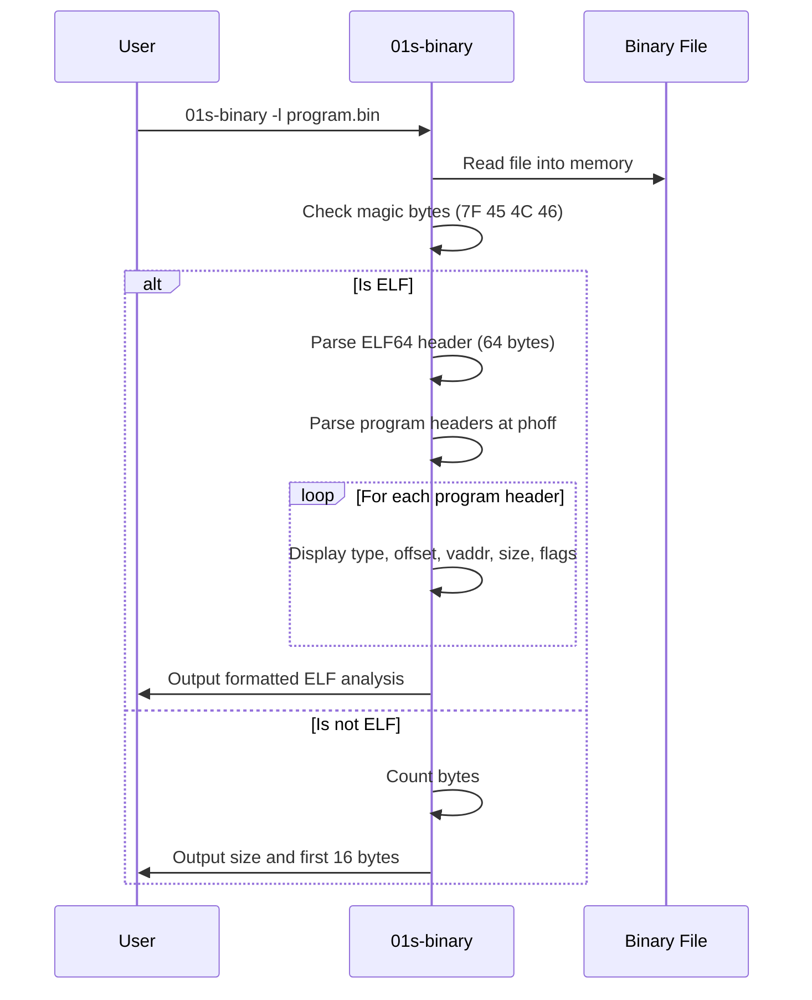

# Binary Format Loader

`01s-binary` is the custom binary format loader and analysis tool for the 01s Sovereign (Kaiman) programming toolchain. It provides ELF binary loading, hex dumping, and raw binary analysis — all written in Rust with zero external dependencies.

## Overview

The binary tool serves three primary functions:

1. **ELF loader** (`-l`): Parse and display ELF64 file headers and program headers
2. **Hex dumper** (`-d`): Produce formatted hex dumps from stdin
3. **Binary analyzer** (default): Count and display raw binary data



**Source:** `day-2/toolchain/binary/src/main.rs` (156 lines)

**Build:** `rustc -O src/main.rs -o 01s-binary`

## File Format Specification Diagram



## ELF64 Loader

The ELF loader parses 64-bit ELF binary files and displays comprehensive header information.

### ELF Header Structure

```rust
#[repr(C)]
struct Elf64Header {
    e_ident: [u8; 16],    // Magic + class + endian + version + OS/ABI
    e_type: u16,           // ET_REL (1), ET_EXEC (2), ET_DYN (3)
    e_machine: u16,        // EM_X86_64 (0x3e), EM_AARCH64 (0x28)
    e_version: u32,
    e_entry: u64,          // Entry point address
    e_phoff: u64,          // Program header offset
    e_shoff: u64,          // Section header offset
    e_flags: u32,
    e_ehsize: u16,         // ELF header size
    e_phentsize: u16,      // Program header entry size
    e_phnum: u16,          // Number of program headers
    e_shentsize: u16,      // Section header entry size
    e_shnum: u16,          // Number of section headers
    e_shstrndx: u16,       // Section header string table index
}
```

### Program Header Structure

```rust
#[repr(C)]
struct Elf64Phdr {
    p_type: u32,       // PT_NULL (0), PT_LOAD (1), PT_DYNAMIC (2), etc.
    p_flags: u32,      // PF_R (4), PF_W (2), PF_X (1)
    p_offset: u64,     // File offset
    p_vaddr: u64,      // Virtual address
    p_paddr: u64,      // Physical address
    p_filesz: u64,     // Size in file
    p_memsz: u64,      // Size in memory
    p_align: u64,      // Alignment
}
```

### Usage

```bash
# Analyze an ELF binary
01s-binary -l /usr/bin/01s-ledger

# Or simply:
01s-binary /usr/bin/01s-ledger
```

### Output Example

```
ELF:    /usr/bin/01s-ledger
Type:   ET_EXEC (2)
Machine: x86_64 (0x3e)
Entry:  0x401000
PHoff:  0x40 (13 program headers)
SHoff:  0x8000 (30 section headers)
Size:   285792 bytes
Bits:   64
Endian: LE
  PHDR 0: LOAD  off=0x0 vaddr=0x400000 filesz=0x1000 memsz=0x1000 flags=R--
  PHDR 1: LOAD  off=0x1000 vaddr=0x401000 filesz=0x25000 memsz=0x25000 flags=R-X
  PHDR 2: LOAD  off=0x26000 vaddr=0x66000 filesz=0x8000 memsz=0x8000 flags=RW-
  PHDR 3: LOAD  off=0x2e000 vaddr=0x6e000 filesz=0x3000 memsz=0x8000 flags=RW-
  PHDR 4: DYNAMIC off=0x27000 vaddr=0x67000 filesz=0x200 memsz=0x200 flags=RW-
```

## ELF vs Custom Binary Format Comparison

| Aspect | ELF Binary | 01s Custom Binary |
|--------|-----------|-------------------|
| Header size | 64 bytes | 128 bytes (.aioss) |
| Segment support | Yes (LOAD, DYNAMIC, etc.) | No (flat) |
| Relocation | Complex | None |
| Symbol table | Yes | No |
| Debug info | DWARF sections | No |
| Hash chain | No | Yes (SHA3-256) |
| Platform standard | Universal | 01s-specific |
| Parsing complexity | High | Low |

## Program Header Type Mapping

| Code | Name | Description |
|------|------|-------------|
| 0 | PT_NULL | Unused |
| 1 | PT_LOAD | Loadable segment |
| 2 | PT_DYNAMIC | Dynamic linking info |
| 3 | PT_INTERP | Interpreter path |
| 4 | PT_NOTE | Auxiliary information |
| 5 | PT_SHLIB | Reserved |
| 6 | PT_PHDR | Program header table |
| 7 | PT_TLS | Thread-local storage |
| 8 | PT_GNU_EH_FRAME | GCC exception frame |
| 9 | PT_GNU_STACK | Stack executability |
| 10 | PT_GNU_RELRO | Read-only relocations |

### Flag Display

```
R--  (Read)
RW-  (Read+Write) 
R-X  (Read+Execute)
RWX  (Read+Write+Execute)
```

## Section Headers Table

| sh_type | Name | Description |
|---------|------|-------------|
| 0 | SHT_NULL | Inactive |
| 1 | SHT_PROGBITS | Program data |
| 2 | SHT_SYMTAB | Symbol table |
| 3 | SHT_STRTAB | String table |
| 4 | SHT_RELA | Relocation entries (addend) |
| 5 | SHT_HASH | Symbol hash table |
| 6 | SHT_DYNAMIC | Dynamic linking info |
| 7 | SHT_NOTE | Note section |
| 8 | SHT_NOBITS | Occupies no space (e.g., .bss) |
| 9 | SHT_REL | Relocation entries (no addend) |
| 11 | SHT_DYNSYM | Dynamic linker symbol table |

## Hex Dumper

The hex dumper reads from stdin and produces a formatted 16-byte-per-line hex dump with ASCII representation:

```bash
01s-binary -d < prog.bin
```

### Output Format

```
00000000: 55 48 89 E5 48 81 EC 00 01 00 00 48 C7 C0 2A 00  UH..H......H..*.
00000010: 00 00 50 58 48 89 45 F8 48 C7 C0 00 00 00 00 C9  ..PXH.E.H.......
00000020: C3                                                .
```

Each line shows:
- **Offset**: 8-character hex address
- **Hex bytes**: 16 hex values separated by spaces
- **ASCII**: Printable characters shown, non-printable as `.`

### Implementation

```rust
fn hex_dump() {
    let mut input = Vec::new();
    if io::stdin().read_to_end(&mut input).is_err() { return; }
    for (i, chunk) in input.chunks(16).enumerate() {
        print!("{:08X}: ", i * 16);
        for b in chunk { print!("{:02X} ", b); }
        // Padding for last line
        let padding = 3 * (16 - chunk.len());
        for _ in 0..padding { print!(" "); }
        // ASCII representation
        print!("  ");
        for &b in chunk {
            if b.is_ascii_graphic() || b == b' ' { print!("{}", b as char); }
            else { print!("."); }
        }
        println!();
    }
}
```

## Binary Analyzer (Default Mode)

When invoked with a file (no flags) or with stdin only:

```bash
# File analysis
01s-binary prog.bin
# Output: ELF info or "not ELF (raw binary, 45 bytes)"

# Stdin analysis
cat prog.bin | 01s-binary
# Output: "01s-binary: 45 bytes from stdin"
#          "01s-binary: first 16 bytes: [55, 48, 89, E5, ...]"
```

### ELF Detection

The tool detects ELF format by checking the magic bytes:

```rust
const ELF_MAGIC: [u8; 4] = [0x7f, b'E', b'L', b'F'];

if hdr.e_ident[0..4] != ELF_MAGIC {
    println!("01s-binary: {} is not ELF (raw binary, {} bytes)", filename, data.len());
    return;
}
```

If the file is not ELF, it reports the raw binary size. If it is ELF, full header parsing occurs.

### Safe Struct Reading

Since the headers use `#[repr(C)]` layout, the tool reads them via raw pointer casts:

```rust
fn read_struct<T>(data: &[u8], offset: usize) -> Option<T> {
    if offset + std::mem::size_of::<T>() > data.len() { return None; }
    unsafe { Some(std::ptr::read_unaligned(data.as_ptr().add(offset) as *const T)) }
}
```

Boundary checking prevents out-of-bounds access. An `unsafe` block is required for pointer dereferencing but is bounded by the size check.

## Loading Process Sequence



## Pipeline Integration

The binary loader is the final stage in the compilation pipeline:

```bash
# Full pipeline: source → machine code → analysis
echo "let x = 42 + 10" | 01s-lexer | 01s-parser | 01s-codegen | 01s-binary

# Generate binary, then analyze
echo "let x = 42" | 01s-lexer | 01s-parser | 01s-codegen > prog.bin
01s-binary prog.bin
01s-binary -d < prog.bin
```

## Performance Considerations

- ELF parsing is O(n) where n = number of program headers (typically <20)
- Hex dumps are done on stdin — suitable for streaming
- Single-pass binary scanning — minimal memory usage
- No dynamic memory allocation beyond the file size

## Security Considerations

- The `unsafe` block for struct reading is bounded by a size check — no buffer over-read possible
- No shell commands are executed
- The tool does not modify files — read-only analysis
- ELF files may have malformed headers — the tool handles parsing failures gracefully

## Troubleshooting

| Problem | Cause | Solution |
|---------|-------|----------|
| "Not ELF" for ELF file | File is corrupted | Rebuild the binary |
| Empty hex dump | No stdin pipe | Use `-d < file` or pipe input |
| Wrong size reported | Binary includes section padding | Use `ls -l` to verify |
| Cannot read file | Permission denied | `chmod +r file` |

## Toolchain Verification

The binary tool is one of the 7 toolchain components verified by `01s-ledger toolchain`:

```bash
01s-ledger toolchain
# [PASS] 01s-binary  SHA256=<hash>
```

## Extended ELF Parsing Examples

### Parsing `/usr/bin/01s-ledger`

```bash
01s-binary -l /usr/bin/01s-ledger
# Output:
# ELF:    /usr/bin/01s-ledger
# Type:   ET_EXEC (2)
# Machine: x86_64 (0x3e)
# Entry:  0x401000
# PHoff:  0x40 (13 program headers)
# SHoff:  0x8000
# Size:   285792 bytes
# Bits:   64
# Endian: LE
```

### Parsing a Static Binary

```bash
# Build a minimal Rust binary
rustc -O -C target-feature=+crt-static -o static.bin src/main.rs
01s-binary -l static.bin
```

## Binary Analysis Use Cases

### Determine File Type

```bash
# Quick ELF detection
01s-binary /usr/bin/ls
# Output includes "ELF" in first line

# Raw binary detection
echo "hello" | 01s-binary
# Output: "01s-binary: 6 bytes from stdin"
```

### Verify Binary Integrity

```bash
# Generate checksum and compare
sha256sum /usr/bin/01s-ledger
01s-binary /usr/bin/01s-ledger
# Both can be used to verify binary identity
```

### Hex Dump for Debugging

```bash
# Dump specific segment
echo "let x = 42" | 01s-lexer | 01s-parser | 01s-codegen > prog.bin
01s-binary -d < prog.bin
# Useful for verifying codegen output
```

## ELF Section Headers

When section header parsing is implemented, the following sections are expected:

| Section | Type | Purpose |
|---------|------|---------|
| `.text` | SHT_PROGBITS | Executable code |
| `.data` | SHT_PROGBITS | Initialized data |
| `.bss` | SHT_NOBITS | Uninitialized data |
| `.rodata` | SHT_PROGBITS | Read-only data |
| `.symtab` | SHT_SYMTAB | Symbol table |
| `.strtab` | SHT_STRTAB | String table |
| `.shstrtab` | SHT_STRTAB | Section header string table |
| `.rela.text` | SHT_RELA | Relocation entries |
| `.debug_*` | SHT_PROGBITS | DWARF debug info |

## Binary Tool Cheat Sheet

```
01s-binary -l <elf_file>   → ELF analysis
01s-binary <file>          → detect ELF or raw
01s-binary -d < file       → hex dump from stdin
cat file | 01s-binary      → count bytes
```

## Binary Size Comparison

| Binary | Stripped | Source Lines | Format |
|--------|----------|-------------|--------|
| 01s-binary | ~75 KB | 156 | ELF64 |
| 01s-lexer | ~80 KB | 197 | ELF64 |
| 01s-parser | ~90 KB | 279 | ELF64 |
| 01s-codegen | ~85 KB | 266 | ELF64 |
| 01s-runes | ~150 KB | 71 | ELF64 |
| zerocli | ~200 KB | ~200 | ELF64 |
| 01s-ledger | ~300 KB | 680 | ELF64 |

## Binary Tool Quick Reference

```
01s-binary [options] [file]

Options:
  -l <file>    Parse and display ELF64 file headers
  -d           Hex dump from stdin
  (no flags)   File analysis (detect ELF or raw)

Input:
  File argument or stdin pipe

Output:
  ELF analysis, hex dump, or byte count
```

## Error Messages

| Message | Meaning | Resolution |
|---------|---------|------------|
| "Cannot open file" | File doesn't exist | Check path |
| "Read error" | I/O error | Check permissions |
| "Not enough data" | File too small | Rebuild binary |
| "Not ELF" | Not an ELF file | Use -d for hex dump |
| "ELF magic mismatch" | Corrupted header | Verify binary integrity |

## Binary Format Comparison Across Toolchain

| Tool | Format | Section Names | Min Size |
|------|--------|---------------|----------|
| 01s-codegen output | Raw binary | None | 17 bytes |
| 01s-lexer output | ELF64 | .text, .rodata | ~80 KB |
| 01s-parser output | ELF64 | .text, .rodata, .data | ~90 KB |
| 01s-runes output | ELF64 | .text, .rodata | ~150 KB |
| 01s-binary output | ELF64 | .text, .rodata | ~75 KB |
| zerocli | ELF64 | .text, .rodata, .data | ~200 KB |
| Standard ELF binary | ELF64 | Multiple sections | ~16 KB+ |

## Binary Analysis CLI Workflows

```bash
# 1. Full pipeline debug
echo "let x = 5 + 3" | 01s-lexer | 01s-parser | 01s-codegen > /tmp/test.bin
01s-binary /tmp/test.bin
01s-binary -d < /tmp/test.bin
echo "Exit code: $?"  # Verify execution

# 2. Compare two binaries
diff <(01s-binary -d < prog1.bin) <(01s-binary -d < prog2.bin)

# 3. Generate hash and cross-check
sha256sum prog.bin > prog.sha256
01s-binary prog.bin | grep -c "bytes"  # Verify size
```

## Cross-Platform ELF Considerations

While 01s-binary currently targets x86_64 ELF64, the following extensions are planned:

| Architecture | ELF Class | Machine ID | Status |
|-------------|-----------|------------|--------|
| x86_64 | ELFCLASS64 | EM_X86_64 (0x3E) | Supported |
| aarch64 | ELFCLASS64 | EM_AARCH64 (0x28) | Planned |
| riscv64 | ELFCLASS64 | EM_RISCV (0xF3) | Future |
| x86 (32-bit) | ELFCLASS32 | EM_386 (0x03) | Not planned |

## See Also

- [Custom Toolchain Overview](05-custom-toolchain-overview.md)
- [Codegen x86_64 JIT](08-codegen-x86_64-jit.md)
- [Runes Glyph System](09-runes-glyph-system.md)
- [AIOSS Ledger Format](01-aioss-ledger-format.md)

---
Lois-Kleinner and 0-1.gg 2026 Copyright