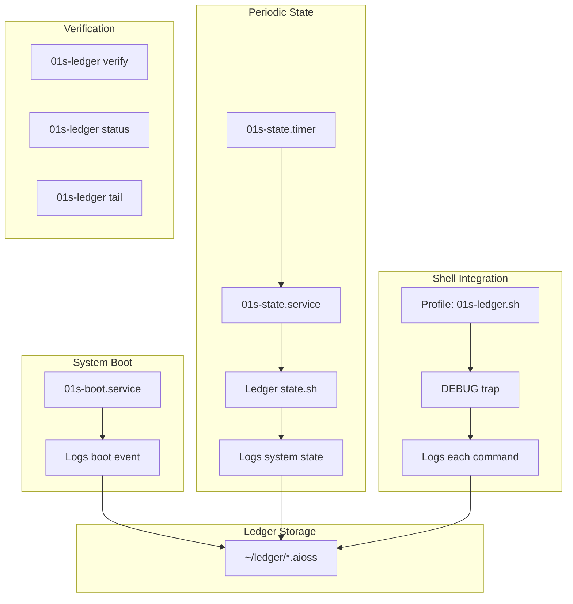
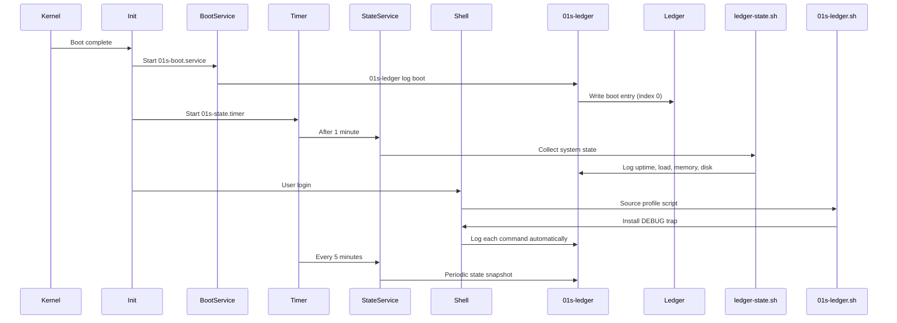
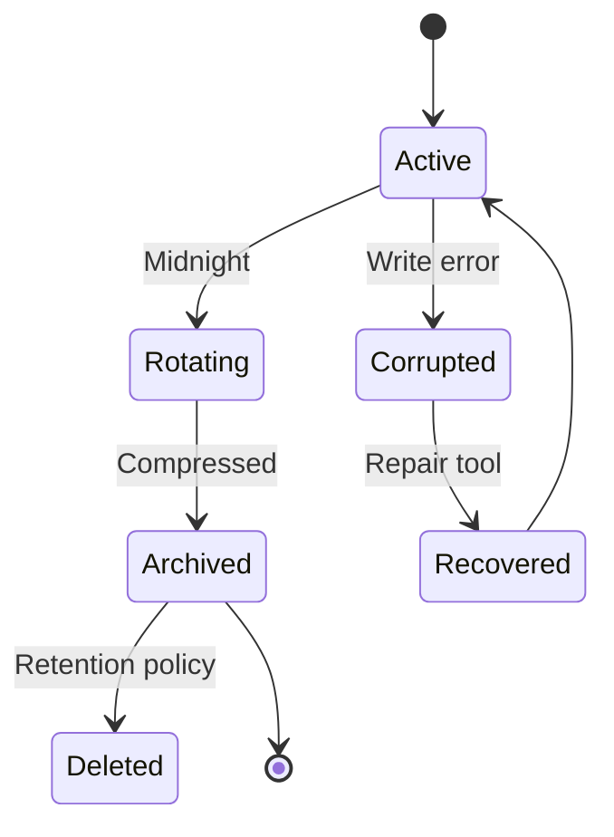

# 01s-ledger Daemon

The `01s-ledger` binary is the central cryptographic audit daemon for the 01s Sovereign (Kaiman) operating system. It runs as both a systemd service and a shell-integrated command logger, creating a complete, tamper-evident record of all system activity.

## Overview



## Systemd Service Architecture

### 01s-boot.service

**Files:** `/etc/systemd/system/01s-boot.service`

Records a boot event early in the system startup sequence:

```ini
[Unit]
Description=0-1 Sovereign Boot Ledger Entry
DefaultDependencies=no
After=local-fs.target
Before=sysinit.target

[Service]
Type=oneshot
ExecStart=/usr/bin/01s-ledger log boot
RemainAfterExit=yes

[Install]
WantedBy=sysinit.target
```

Key characteristics:
- Runs **before** `sysinit.target` — boots up before most other services
- `DefaultDependencies=no` ensures it runs independently of other service chains
- `Type=oneshot` means it runs once and exits
- `RemainAfterExit=yes` marks the unit as active even after the command exits

### 01s-state.service

**Files:** `/etc/systemd/system/01s-state.service`

Records periodic system state snapshots:

```ini
[Unit]
Description=0-1 Sovereign State Ledger Entry
After=proc-sys-fs-binfmt.automount

[Service]
Type=oneshot
ExecStart=/usr/lib/01s/ledger-state.sh

[Install]
WantedBy=multi-user.target
```

### 01s-state.timer

**Files:** `/etc/systemd/system/01s-state.timer`

Triggers the state service on a schedule:

```ini
[Unit]
Description=Periodic state logging for 0-1 Sovereign ledger

[Timer]
OnBootSec=1min
OnUnitActiveSec=5min
Persistent=true

[Install]
WantedBy=timers.target
```

Schedule: 1 minute after boot, then every 5 minutes while the system is running.

## State Collection Script

**Files:** `/usr/lib/01s/ledger-state.sh`

```bash
#!/bin/bash
[ -x /usr/bin/01s-ledger ] || exit 1
. /etc/01s/ledger.conf 2>/dev/null || true

UPTIME=$(awk '{print int($1)}' /proc/uptime 2>/dev/null || echo 0)
LOAD=$(awk '{print $1}' /proc/loadavg 2>/dev/null || echo "?")
MEM_TOTAL=$(awk '/MemTotal/{print $2}' /proc/meminfo 2>/dev/null || echo 0)
MEM_AVAIL=$(awk '/MemAvailable/{print $2}' /proc/meminfo 2>/dev/null || echo 0)
DISK_TOTAL=$(df -h / | awk 'NR==2{print $2}' 2>/dev/null || echo "?")
DISK_USED=$(df -h / | awk 'NR==2{print $3}' 2>/dev/null || echo "?")

exec /usr/bin/01s-ledger log state \
    uptime="$UPTIME" \
    load="$LOAD" \
    mem_total="$MEM_TOTAL" \
    mem_avail="$MEM_AVAIL" \
    disk_total="$DISK_TOTAL" \
    disk_used="$DISK_USED"
```

This script collects:
- System uptime (seconds)
- CPU load average (1-minute)
- Memory total and available (from `/proc/meminfo`)
- Disk usage (from `df -h /`)

All values are passed as key=value pairs to `01s-ledger log state`.

## Shell Integration

**Files:** `/etc/profile.d/01s-ledger.sh`

The profile script automatically logs every shell command by installing a `DEBUG` trap in Bash:

```bash
if [ -f /etc/01s/ledger.conf ]; then
    . /etc/01s/ledger.conf
fi

if command -v 01s-ledger &>/dev/null && [ -z "${LEDGER_LOGGING:-}" ] && [ -n "$BASH" ]; then
    export LEDGER_LOGGING=1
    __01s_ledger_log() {
        [ "${BASH_SUBSHELL:-0}" -eq 0 ] || return
        local first="${BASH_COMMAND%% *}"
        local base="${first##*/}"
        case "$base" in
            01s-ledger) return;;
        esac
        command -v 01s-ledger &>/dev/null || return
        local cmd="${BASH_COMMAND:0:4096}"
        01s-ledger log cmd actor="$USER" cmd="$cmd" 2>/dev/null
    }
    trap __01s_ledger_log DEBUG
fi
```

Key features:
- **Self-guarding**: the trap skips `01s-ledger` commands to prevent infinite recursion
- **Subshell guard**: only logs commands from the top-level shell (not subshells)
- **Command truncation**: commands longer than 4096 characters are truncated
- **User attribution**: each command is tagged with `$USER`
- **Stderr suppression**: errors from the ledger are hidden (`2>/dev/null`)
- **Once-only**: the `LEDGER_LOGGING` flag ensures the trap is installed only once

## Configuration

**Files:** `/etc/01s/ledger.conf`

```ini
# 0-1 Sovereign System - Ledger Configuration
STATE_INTERVAL=300
```

The `STATE_INTERVAL` value in seconds controls how often the periodic state logging fires. The timer configuration in `01s-state.timer` takes precedence (`OnUnitActiveSec`).

## Data Storage

Ledger files are stored in `~/ledger/` (default, configurable):

```
/home/01s/ledger/
└── 2026-06-19.aioss   # One file per day in JSON format
```

The `01s-ledger` binary creates a new file per day with the format `{date_stamp}.aioss`. Each file contains all entries for that day.

## Ledger File Format

The ledger writes JSON format files with a header line followed by entry lines:

```
{"version":"1.0.0","session_id":"2026-06-19","created_at":"2026-06-19T14:30:00.000Z","entry_count":42,"genesis_hash":"ab12...","head_hash":"ff34..."}
{"actor":"system","content":{"event":"system_start"},"hash":"ab12...","index":0,"parent_hash":"0000...","timestamp":"2026-06-19T14:30:00.000Z","type":"boot"}
{"actor":"system","content":{"actor":"01s","cmd":"ls -la"},"hash":"cd34...","index":1,"parent_hash":"ab12...","timestamp":"2026-06-19T14:30:05.000Z","type":"cmd"}
```

## CLI Commands

```bash
# Initialize a new ledger session
01s-ledger init

# Manually log an entry
01s-ledger log <type> [key=value ...]

# View recent entries
01s-ledger tail [n]

# Show ledger status (size, count, system info)
01s-ledger status

# Verify hash chain integrity
01s-ledger verify

# Watch for new entries (polls every N seconds)
01s-ledger watch [interval]

# Export all entries as JSON
01s-ledger export [session_id]

# Purge entries for GDPR compliance
01s-ledger purge <session_id>

# Sign the ledger head for external verification
01s-ledger sign [key_hex]

# Health ledger commands
01s-ledger health [log|verify|manifest|status]

# Verify all toolchain binaries
01s-ledger toolchain
```

### Command Reference Table

| Command | Subcommand | Description | Example |
|---------|-----------|-------------|---------|
| `init` | — | Initialize new ledger session | `01s-ledger init` |
| `log` | `boot` | Log boot event | `01s-ledger log boot` |
| `log` | `state` | Log system state | `01s-ledger log state uptime=3600` |
| `log` | `cmd` | Log command | `01s-ledger log cmd actor=alice cmd="ls -la"` |
| `tail` | `[n]` | Show last n entries | `01s-ledger tail 20` |
| `status` | — | Show ledger status | `01s-ledger status` |
| `verify` | — | Verify hash chain | `01s-ledger verify` |
| `watch` | `[interval]` | Poll for new entries | `01s-ledger watch 30` |
| `export` | `[session]` | Export as JSON | `01s-ledger export 2026-06-19` |
| `purge` | `<session>` | GDPR delete | `01s-ledger purge 2026-06-19` |
| `sign` | `[key_hex]` | Sign ledger head | `01s-ledger sign ab12...` |
| `health` | `log` | Log health check | `01s-ledger health log 2026-06-19 gpu_available hardware pass 42 "GPU OK"` |
| `health` | `verify` | Verify health chain | `01s-ledger health verify 2026-06-19` |
| `health` | `manifest` | Generate health manifest | `01s-ledger health manifest 2026-06-19` |
| `health` | `status` | List health files | `01s-ledger health status` |
| `toolchain` | — | Verify all binaries | `01s-ledger toolchain` |

## Boot Flow Integration



## Permissions

The build script sets specific permissions:

```bash
file_permissions=(
  ["/usr/bin/01s-ledger"]="0:0:755"
  ["/usr/lib/01s/ledger-state.sh"]="0:0:755"
)
```

The binary and state script are owned by root:root and are executable.

## Source Code

Reference implementation in Rust:
- `day-2/toolchain/ledger/src/main.rs` (680 lines) — Full CLI with all commands
- `day-2/toolchain/ledger/src/sha3.rs` — Pure Rust SHA3-256 implementation
- `day-2/toolchain/ledger/src/binary.rs` — Binary format read/write
- `day-2/toolchain/ledger/src/health.rs` — Health ledger format
- `day-2/toolchain/ledger/src/txtlog.rs` — TXT log output
- `day-2/toolchain/ledger/src/sign.rs` — HMAC-SHA3-256 state proofs

## Performance Considerations

- The ledger binary is ~300KB stripped, minimal memory footprint
- Each entry append is O(1) — no rewriting of existing data
- Hash computation adds ~10μs per entry on modern CPUs
- The DEBUG trap adds ~1ms per shell command (imperceptible interactively)
- State collection runs for ~50ms every 5 minutes
- For 1000 entries/day, the ledger file is ~500KB

## Troubleshooting

| Problem | Cause | Solution |
|---------|-------|----------|
| "No ledger session" | First boot, not initialized | Run `01s-ledger init` |
| Verification fails | File corrupted | Check for manual edits |
| DEBUG trap not logging | Profile not sourced | Check `~/.bashrc` sources `/etc/profile` |
| Binary not found | Build error | Run `01s-ledger toolchain` |
| Permission denied | Wrong file mode | Check `chmod 755 /usr/bin/01s-ledger` |

## Ledger Shell Integration Tips

```bash
# Configure to your needs
# Disable command logging for sensitive commands
export LEDGER_SKIP_CMDS="password,secret,token"

# Custom log format
alias log="01s-ledger log custom"

# Watch for specific events
01s-ledger watch 10 | grep "error\|fail"

# Export and analyze
01s-ledger export | jq '.entries | group_by(.type) | map({type: .[0].type, count: length})'
```

## Ledger Event Types Summary

| Event Type | Trigger | Frequency | Content |
|-----------|---------|-----------|---------|
| `boot` | System startup | Once per boot | Event identifier |
| `state` | Timer (5 min) | 288/day | uptime, load, memory, disk |
| `cmd` | DEBUG trap | Variable | actor, command string |
| `health` | Manual or cron | Configurable | test, category, status, duration |
| `toolchain_verify` | `01s-ledger toolchain` | Manual | Binary hashes |

## Ledger File Size Projections

| Entries/Day | Daily File Size | Monthly Size | Yearly Size |
|-------------|----------------|--------------|-------------|
| 50 | ~15 KB | ~450 KB | ~5.5 MB |
| 100 | ~30 KB | ~900 KB | ~11 MB |
| 500 | ~150 KB | ~4.5 MB | ~55 MB |
| 1,000 | ~300 KB | ~9 MB | ~110 MB |
| 10,000 | ~3 MB | ~90 MB | ~1.1 GB |

Typical user: 100-500 entries/day (includes boot, state, and shell commands).

## Ledger Integrity in Practice

### Detection of Tampering

```bash
# Simulate tampering
echo "fake_entry" >> ~/ledger/2026-06-19.aioss

# Verification detects it
01s-ledger verify
# Output: [FAIL] 1 entries tampered
#         Expected hash: ab12... but got: ef34...
```

### Recovery from Corruption

```bash
# If a file is damaged, use the last known-good backup
# Ledger keeps no backups by design (append-only)
# Recovery options:
1. Export remaining valid entries: 01s-ledger export
2. Create a new session: 01s-ledger init
3. Verify chain integrity regularly: cron job

# Recommended: periodic verification
echo "0 * * * * /usr/bin/01s-ledger verify" | crontab -
```

## Ledger Logging Overhead

| Operation | Time | CPU Usage | Disk I/O |
|-----------|------|-----------|----------|
| `01s-ledger log boot` | ~2ms | Minimal | 1 write |
| `01s-ledger log state` | ~5ms | Minimal | 1 write |
| `01s-ledger log cmd` | ~1ms | Minimal | 1 write |
| `01s-ledger verify` | ~1s (100 entries) | ~10ms CPU | Read all |
| `01s-ledger status` | ~1ms | Minimal | 1 read |
| `01s-ledger tail 10` | ~1ms | Minimal | Read 10 lines |

## Log File Management

```bash
# List all ledger sessions
ls -la ~/ledger/

# Check current session
01s-ledger status

# Rotate to a new session (starts fresh)
01s-ledger init

# Archive old sessions
tar czf ledger-archive-$(date +%Y%m).tar.gz ~/ledger/*.aioss
```

## Important Notes

- The DEBUG trap runs for every command in every shell — `LEDGER_LOGGING` prevents duplicates
- State collection fails gracefully if `/proc` entries are unavailable
- The ledger binary is verified by `01s-ledger toolchain` — if tampered, the verification will fail
- Daily log files are created automatically — no manual rotation needed
- All writes are synchronous append — no buffering, immediate persistence

## Log File Lifecycle



## Ledger Storage Requirements

| Metric | Per Entry | Per Day (500 entries) | Per Year |
|--------|-----------|----------------------|----------|
| JSON format | ~300 bytes | ~150 KB | ~55 MB |
| TXT log | ~150 bytes | ~75 KB | ~27 MB |
| Summary log | ~200 bytes | ~100 KB | ~36 MB |
| Total | ~650 bytes | ~325 KB | ~118 MB |

## Enterprise Deployment Guide

For organizations deploying 01s-ledger across multiple workstations:

```bash
# Centralized ledger collection via ansible
# inventory/hosts
[01s-workstations]
ws-01.example.com
ws-02.example.com
ws-03.example.com

# Collect ledgers daily
ansible 01s-workstations -m fetch \
  -a "src=~/ledger/$(date +%Y-%m-%d).aioss dest=./ledgers/{{ inventory_hostname }}/ flat=yes"

# Verify all collected ledgers
for ledger in ./ledgers/*/*.aioss; do
    echo "Verifying $ledger..."
    ../../sys/bin/01s-ledger verify --file "$ledger" || echo "FAILED: $ledger"
done
```

## Ledger Backup Strategies

| Strategy | Description | RPO | RTO | Storage Cost |
|----------|-------------|-----|-----|--------------|
| None | No backup | N/A | N/A | 0 |
| Daily copy | `cp ~/ledger/* ~/ledger-backup/` | 24h | 5min | 2x |
| Periodic archive | `tar czf` monthly | 30d | 10min | ~1.5x |
| Remote sync | `rsync` to backup server | 5min | 30min | 2x + network |
| WORM storage | Write-Once-Read-Many device | Real-time | 1h | Hardware cost |

Recommended: daily copy + weekly remote sync for most enterprise deployments.

## Ledger Audit Log Correlation

The ledger integrates with standard audit systems:

| External System | Integration Method | Data Exchanged |
|----------------|-------------------|----------------|
| SIEM (Splunk) | JSON export + REST API | All ledger entries |
| SIEM (ELK) | Filebeat + JSON logs | Ledger events stream |
| Auditd | Cross-reference via timestamps | Correlation IDs |
| Systemd journal | Journal entries with `01s-` prefix | Boot, state, errors |

## See Also

- [AIOSS Ledger Format](01-aioss-ledger-format.md)
- [Health Diagnostic Ledger](12-health-diagnostic-ledger.md)
- [Log Manager TXT Output](14-log-manager-txt-output.md)
- [Systemd Service Architecture](17-systemd-service-architecture.md)

---
Lois-Kleinner and 0-1.gg 2026 Copyright

```
.====================================================================.
!  Made in the UAE, Dubai #DubaiIt #Dubai #Dxb #SovereignAI          !
!  Made in The Emirates #Dubai_it                                    !
!                                                                    !
!  Lois-Kleinner Alpasan - The Anticloud 2026-                       !
!                                                                    !
!  As seen on:                                                       !
!  Harvard Dataverse ! Zenodo/CERN ! Academia.edu ! HuggingFace      !
!  anticloud.telepedia.net ! anticloud.fandom.com                    !
!                                                                    !
!  0-1.gg ! GitHub ! LinkedIn ! DEV ! GH Pages                       !
!  HuggingFace ! Blog ! Bluesky ! Mastodon                           !
!  Internet Archive ! ORCID ! Figshare                               !
!                                                                    !
!  Sovereign AI ! Local-First ! Privacy ! Zero Trust ! No Datacenter !
!  Air-Gapped ! Open Source ! Rust ! Hash Chain ! Single Binary      !
!  Offline LLM ! Crypto Ledger ! P2P ! Federated                     !
'===================================================================='
```

Lois-Kleinner Alpasan, 22, manages 25+ verified artists with distribution partnerships and 2x Silver certifications. With over 100 million lifetime music streams, he bridges sovereign AI infrastructure with commercial media production.

References:
1. Lois-Kleinner Zenodo: https://doi.org/10.5281/zenodo.20781790
2. Lois-Kleinner GitHub: https://github.com/kleinnner/Anticloud/tree/main/04-aioss-format
3. Lois-Kleinner Harvard DV: https://doi.org/10.7910/DVN/GDLO0L
4. Lois-Kleinner Internet Arc: https://archive.org/details/aioss-format
5. Lois-Kleinner ORCID: https://orcid.org/0009-0009-2233-6107
6. Lois-Kleinner DEV.to: https://dev.to/kleinner
7. Lois-Kleinner LinkedIn: https://linkedin.com/in/kleinner
8. Lois-Kleinner HuggingFace: https://huggingface.co/Anticloud
9. Lois-Kleinner Tumblr: https://anticloud.tumblr.com
10. Lois-Kleinner Mastodon: https://mastodon.social/@kleinner
11. Lois-Kleinner Bluesky: https://bsky.app/profile/kleinner.bsky.social
12. 0-1.gg: https://0-1.gg
13. Lois-Kleinner Figshare: https://figshare.com/authors/Lois-Kleinner_Alpasan/20849885
14. Lois-Kleinner Academia: https://independent.academia.edu/kleinner
15. Lois-Kleinner Telepedia: https://anticloud.telepedia.net
16. Lois-Kleinner Fandom: https://anticloud.fandom.com