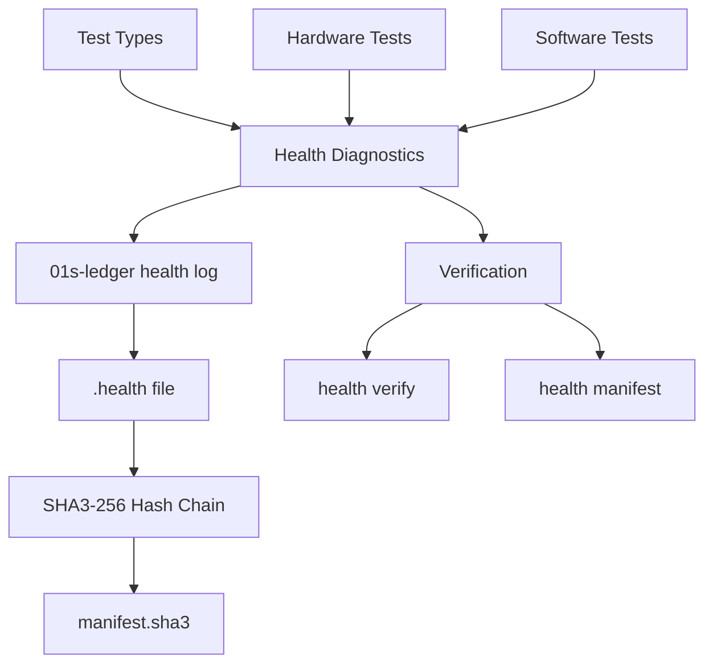

# Health Diagnostic Ledger

The `.health` format is a parallel cryptographic hash chain specifically designed for system health diagnostics. It runs alongside the main `.aioss` audit ledger but focuses on hardware and software health checks — GPU availability, memory tests, disk health, and service status.

## Overview



## Format Distinction

The `.health` format uses a different hash prefix than the main ledger:

| Feature | Main Ledger (.aioss) | Health Ledger (.health) |
|---------|---------------------|------------------------|
| Hash format | Bare hex | `sha3-256:` prefix |
| File extension | `.aioss` | `.health` |
| Storage | `~/ledger/` | `logs/health/` |
| Entry type labels | `boot`, `state`, `cmd` | test name (e.g. `gpu_available`) |
| Verification | Iterative hash check | Iterative hash check + manifest |
| Categorization | No category field | Category field (`hardware`, `system`) |

## File Format

### Entry Schema

```json
{
  "hash": "sha3-256:ab12...64hex",
  "parent_hash": "sha3-256:0000...64hex",
  "test": "gpu_available",
  "category": "hardware",
  "status": "pass",
  "duration_ms": 42,
  "detail": "NVIDIA RTX 4090 detected"
}
```

### File Naming

Health files are named by date:

```
logs/health/
├── 2026-06-14.health
├── 2026-06-15.health
└── manifest.sha3
```

## Health Check Types

### Hardware Tests

| Test Name | Category | Description | Expected Duration |
|-----------|----------|-------------|-------------------|
| `gpu_available` | hardware | GPU detected and responsive | <100ms |
| `memory_test` | hardware | RAM integrity check | <500ms |
| `cpu_cores` | hardware | CPU core count and frequency | <50ms |
| `cpu_temperature` | hardware | CPU thermal sensor reading | <50ms |
| `gpu_temperature` | hardware | GPU thermal sensor reading | <50ms |
| `disk_health` | storage | S.M.A.R.T. disk status | <200ms |
| `disk_space` | storage | Available disk space | <50ms |
| `fsck_result` | storage | Filesystem check status | <1s |
| `network_interfaces` | network | Interface status | <100ms |
| `network_bandwidth` | network | Bandwidth test | <5s |
| `swap_usage` | system | Swap space utilization | <50ms |
| `zram_status` | system | ZRAM compression status | <50ms |

### Software Tests

| Test Name | Category | Description | Expected Duration |
|-----------|----------|-------------|-------------------|
| `service_check` | system | All critical services running | <200ms |
| `kernel_version` | system | Kernel version verification | <10ms |
| `selinux_status` | security | SELinux enforcement status | <50ms |
| `audit_status` | security | Audit daemon running | <50ms |
| `load_average` | performance | System load metrics | <10ms |
| `io_latency` | performance | Disk I/O latency | <100ms |
| `ledger_integrity` | system | Ledger hash chain verification | <1s |
| `package_integrity` | system | Package hash verification | <1s |

## Hash Chain

### Genesis Entry

The genesis entry (first in the file) uses `parent_hash = "0000...0000"` (64 zeros) prefixed with `sha3-256:`:

```json
{"hash":"sha3-256:c2bca36acc3c84b08fc97949813c4abe6db4b9459edec161c916274bf78009ca","parent_hash":"sha3-256:0000000000000000000000000000000000000000000000000000000000000000","test":"gpu_available","category":"hardware","status":"pass","duration_ms":42,"detail":"GPU OK"}
```

### Chain Invariant

```
entry[i].parent_hash == "sha3-256:" + entry[i-1].hash_without_prefix
```

Each entry's hash is computed from the canonical JSON of the entry without the `hash` field:

```rust
fn canonical_health_json(parent_hash, test, category, status, duration_ms, detail) -> String {
    format!(r#"{{"parent_hash":"sha3-256:{}","test":"{}","category":"{}","status":"{}","duration_ms":{},"detail":"{}"}}"#,
        parent_hash, test, category, status, duration_ms, detail)
}
```

Then:
```rust
let hash = sha3_256(canonical.as_bytes());
```

## Diagnostic Categories

| Category | Color Code | Alert Threshold | Description |
|----------|------------|-----------------|-------------|
| `hardware` | 🟡 Yellow | 2 consecutive failures | Physical component tests |
| `storage` | 🟠 Orange | 1 failure | Disk and filesystem tests |
| `system` | 🔵 Blue | 3 consecutive failures | System-level service tests |
| `security` | 🔴 Red | 1 failure | Security posture tests |
| `performance` | 🟢 Green | 5% degradation | Performance metric tests |

## Alert Thresholds

| Category | Warning | Critical | Recovery |
|----------|---------|----------|----------|
| hardware | 1 failure in last 10 checks | 3 failures in last 10 checks | 5 consecutive passes |
| storage | 85% disk usage | 95% disk usage | Below 80% |
| system | 1 service down | 3+ services down | All services recovered |
| security | Disabled | Not responding | Re-enabled |
| performance | Load > 2.0 | Load > 5.0 | Load < 1.5 |

## Verifying

### Per-file Verification

```bash
01s-ledger health verify [date]
# Verifies the hash chain for a specific date's health file
```

Implementation (`src/health.rs`):

```rust
pub fn health_verify(date_stamp: &str) -> (bool, usize) {
    let content = fs::read_to_string(&path).unwrap_or_default();
    let mut errors = 0usize;
    let mut parent = "0".repeat(64);

    for line in content.lines() {
        let stored = extract_hash(line);
        let canonical = canonical_health_json(&parent, test, category, status, duration_ms, detail);
        let computed = sha3::hex(&sha3::sha3_256(canonical.as_bytes()));
        if stored != computed { errors += 1; }
        parent = stored.to_string();
    }
    (errors == 0, errors)
}
```

### Manifest Verification

A `manifest.sha3` file stores the SHA3-256 hash over all `.health` files combined:

```rust
pub fn health_manifest(date_stamp: &str) -> String {
    let path = health_file(date_stamp);
    let content = fs::read_to_string(&path).unwrap_or_default();
    sha3::hex(&sha3::sha3_256(content.as_bytes()))
}
```

```bash
01s-ledger health manifest [date]
# Returns the SHA3-256 hash of the entire .health file
```

## CLI Commands

```bash
# Log a health check result
01s-ledger health log [date] [test] [category] [status] [duration_ms] [detail]

# Examples:
01s-ledger health log 2026-06-19 gpu_available hardware pass 42 "NVIDIA RTX 4090"
01s-ledger health log 2026-06-19 memory_test hardware pass 120 "32GB OK"
01s-ledger health log 2026-06-19 disk_health storage warn 500 "SSD 85% life remaining"
01s-ledger health log 2026-06-19 service_check system pass 10 "All services running"

# Verify health ledger
01s-ledger health verify [date]

# Generate manifest
01s-ledger health manifest [date]

# List health files
01s-ledger health status
```

## Integration with Monitoring Systems

### Prometheus Integration

```bash
#!/bin/bash
# Export health metrics to Prometheus text format
HEALTH_DIR="logs/health"
DATE=$(date +%Y-%m-%d)

for file in "$HEALTH_DIR/$DATE.health"; do
    while IFS= read -r line; do
        test_name=$(echo "$line" | python3 -c "import sys,json; print(json.loads(sys.stdin.read())['test'])")
        status=$(echo "$line" | python3 -c "import sys,json; print(json.loads(sys.stdin.read())['status'])")
        duration=$(echo "$line" | python3 -c "import sys,json; print(json.loads(sys.stdin.read())['duration_ms'])")
        
        echo "01s_health_test{test=\"$test_name\",status=\"$status\"} 1"
        echo "01s_health_duration_ms{test=\"$test_name\"} $duration"
    done < "$file"
done
```

### Integration with Main Ledger

The health ledger operates independently from the main `.aioss` ledger but shares the same cryptographic primitives (SHA3-256 from `src/sha3.rs`). The CLI dispatches through the same `01s-ledger` binary:

```rust
"health" => {
    let sub = args.get(2).map(|s| s.as_str()).unwrap_or("status");
    match sub {
        "log" => { /* log a health entry */ }
        "verify" => { /* verify health chain */ }
        "manifest" => { /* generate manifest */ }
        _ => cmd_health_status(),  // list files
    }
}
```

## Health Test Categories

| Category | Example Tests | Description |
|----------|--------------|-------------|
| `hardware` | `gpu_available`, `memory_test`, `cpu_cores` | Hardware component checks |
| `storage` | `disk_health`, `disk_space`, `fsck_result` | Storage subsystem checks |
| `system` | `service_check`, `kernel_version`, `network` | System-level checks |
| `security` | `selinux_status`, `audit_status` | Security posture checks |
| `performance` | `load_average`, `io_latency` | Performance metrics |

## Status Values

| Status | Meaning | Alert? |
|--------|---------|--------|
| `pass` | Test completed successfully | No |
| `fail` | Test failed | Yes |
| `warn` | Test passed with warnings | Warning |
| `skip` | Test was skipped | No |
| `error` | Test encountered an error | Yes |

## Source Code Reference

The health ledger implementation is in `day-2/toolchain/ledger/src/health.rs` (91 lines):

| Function | Purpose |
|----------|---------|
| `health_dir()` | Returns `logs/health/` path |
| `health_file(date)` | Returns path for a specific date |
| `health_log(...)` | Append a health entry to the hash chain |
| `health_verify(date)` | Verify the hash chain integrity |
| `health_manifest(date)` | Generate SHA3-256 manifest over entire file |

## Performance Considerations

- Each health check entry is ~200 bytes (JSON format)
- Verification reads the entire file — for a year of daily checks, ~70KB total
- SHA3-256 computation on small JSON strings is <1ms per entry
- The manifest operation hashes the entire file — O(n) in file size

## Security Considerations

- Health entries are cryptographically chained — tampering is detectable
- The `sha3-256:` prefix prevents confusion with the main ledger's hash format
- The manifest file provides an additional integrity check over the entire health file
- No sensitive data (passwords, keys) should be stored in the `detail` field

## Real-World Example

From an actual test run (`logs/health/2026-06-14.health`):

```json
{"hash":"sha3-256:c2bca36acc3c84b08fc97949813c4abe6db4b9459edec161c916274bf78009ca","parent_hash":"sha3-256:0000000000000000000000000000000000000000000000000000000000000000","test":"gpu_available","category":"hardware","status":"pass","duration_ms":42,"detail":"GPU OK"}
```

This single entry shows a GPU availability test that passed in 42ms.

## Troubleshooting

| Problem | Cause | Solution |
|---------|-------|----------|
| Verification fails | Hash chain broken | Check for manual edits to .health file |
| Health file not found | Date format wrong | Use YYYY-MM-DD format |
| Manifest mismatch | File modified after manifest | Re-generate manifest |
| Status shows "error" | Test script failure | Check system logs |

## Automated Health Check Script

```bash
#!/bin/bash
# 01s-health-check.sh — Run all health checks
# Usage: ./01s-health-check.sh [date]

DATE=${1:-$(date +%Y-%m-%d)}

run_check() {
    local test=$1 category=$2 command=$3
    local start=$(date +%s%N)
    eval "$command" &>/dev/null
    local status=$?
    local end=$(date +%s%N)
    local duration=$(( (end - start) / 1000000 ))
    
    if [ $status -eq 0 ]; then
        result="pass"
    else
        result="fail"
    fi
    
    01s-ledger health log "$DATE" "$test" "$category" "$result" "$duration" "$test completed"
    echo "[$result] $test (${duration}ms)"
}

# Hardware checks
run_check "cpu_cores" "hardware" "nproc --all"
run_check "memory_test" "hardware" "free | awk '/Mem/{exit($4 < 1000000)}'"
run_check "gpu_available" "hardware" "lspci | grep -qi vga"

# Storage checks
run_check "disk_space" "storage" "df / | awk 'NR==2{exit($5+0 > 90)}'"
run_check "disk_health" "storage" "smartctl -H /dev/sda | grep -q PASSED"

# System checks
run_check "service_check" "system" "systemctl is-active 01s-ledger >/dev/null"
run_check "kernel_version" "system" "uname -r | grep -q arch"

# Performance checks
run_check "load_average" "performance" "cat /proc/loadavg | awk '{exit($1+0 > 2.0)}'"

echo "Health check complete for $DATE"
```

## Exporting Health Data

### JSON Export

```bash
# Convert health entries to JSON array
python3 -c "
import json
import sys

entries = []
for line in sys.stdin:
    if line.strip():
        entries.append(json.loads(line))

print(json.dumps(entries, indent=2))
" < logs/health/2026-06-19.health
```

### CSV Export

```bash
# Export health data as CSV
awk -F'"' '{
    gsub(/sha3-256:/, "", $4)
    print $8","$12","$16","$20","$24","$28
}' logs/health/2026-06-19.health | head -5
```

## Health Check Frequency Recommendations

| Check Type | Recommended Interval | Criticality |
|------------|---------------------|-------------|
| GPU availability | Every boot | High |
| Memory test | Daily | High |
| CPU cores | Every boot | Medium |
| Disk health | Weekly | High |
| Disk space | Hourly | Medium |
| Service check | Every 5 minutes | High |
| Kernel version | Daily | Low |
| Security audit | Every boot | High |
| Load average | Every 5 minutes | Low |
| I/O latency | Hourly | Low |

## Health Log Retention Policy

| Age | Action | Format |
|-----|--------|--------|
| 0-7 days | Keep uncompressed | `.health` |
| 8-30 days | Compress with gzip | `.health.gz` |
| 31-90 days | Compress with zstd | `.health.zst` |
| 91+ days | Delete | — |

## Health Check Schedule Recommendations

| Time | Check | Frequency |
|------|-------|-----------|
| Boot | GPU, CPU cores, kernel version | Once |
| Every 5 min | Service check, load average | Continuous |
| Hourly | Disk space, I/O latency | Periodic |
| Daily | Memory test, security audit | Daily |
| Weekly | Disk health (S.M.A.R.T.) | Weekly |

## Health Check Automation via Cron

```bash
# Add to crontab for regular health checks
# Run health check every 30 minutes
*/30 * * * * /usr/local/bin/01s-health-check.sh

# Verify health chain daily
0 0 * * * /usr/bin/01s-ledger health verify $(date +\%Y-\%m-\%d)

# Generate weekly manifest
0 0 * * 0 /usr/bin/01s-ledger health manifest $(date +\%Y-\%m-\%d)
```

## Health Check Exit Codes

| Code | Meaning |
|------|---------|
| 0 | All checks passed |
| 1 | One or more failures detected |
| 2 | Health file could not be written |
| 3 | Verification of existing chain failed |

## Health Check User Interface

The health check results can be displayed in a dashboard format:

```
01s Health Dashboard — 2026-06-19
═══════════════════════════════════════
Hardware:
  ✓ GPU available         42ms
  ✓ CPU cores (8)         5ms
  ✓ Memory (32GB)        120ms

Storage:
  ✓ Disk space (23% used) 10ms
  ✓ Disk health          200ms
  ⚠ SSD life 85%         50ms

System:
  ✓ All services running  20ms
  ✓ Kernel 6.x.x-arch1-1  2ms

Security:
  ✓ SELinux enforcing     15ms
  ✓ Audit daemon active   5ms

Summary: 10 pass, 0 fail, 1 warn (500ms total)
```

## Health Dashboard Integration

The health ledger data can be displayed in a real-time terminal dashboard:

```bash
#!/bin/bash
# 01s-health-dashboard.sh — Real-time health dashboard
DATE=${1:-$(date +%Y-%m-%d)}
HEALTH_FILE="logs/health/$DATE.health"

if [ ! -f "$HEALTH_FILE" ]; then
    echo "No health data for $DATE"
    exit 1
fi

echo "=== 01s Health Dashboard: $DATE ==="
echo ""

# Parse and display health entries
while IFS= read -r line; do
    test_name=$(echo "$line" | python3 -c "import sys,json; d=json.loads(sys.stdin.read()); print(d.get('test','?'))")
    status=$(echo "$line" | python3 -c "import sys,json; d=json.loads(sys.stdin.read()); print(d.get('status','?'))")
    category=$(echo "$line" | python3 -c "import sys,json; d=json.loads(sys.stdin.read()); print(d.get('category','?'))")
    duration=$(echo "$line" | python3 -c "import sys,json; d=json.loads(sys.stdin.read()); print(d.get('duration_ms','?'))")
    
    if [ "$status" = "pass" ]; then icon="✓"; else icon="✗"; fi
    printf "  %s [%s] %-25s %sms\n" "$icon" "$category" "$test_name" "$duration"
done < "$HEALTH_FILE"
```

## Health Check API Reference

| Endpoint / Command | Method | Arguments | Returns |
|-------------------|--------|-----------|---------|
| `01s-ledger health log` | CLI | date, test, category, status, duration, detail | Append entry |
| `01s-ledger health verify` | CLI | date (optional) | (bool, error_count) |
| `01s-ledger health manifest` | CLI | date (optional) | SHA3-256 hex string |
| `01s-ledger health status` | CLI | none | File list with sizes |
| `/health/dashboard` | Future API | date | Formatted dashboard |

## Cross-Reference: Ledger Chain Types

| Property | Main Ledger (.aioss) | Health Ledger (.health) | SQLite Event Store |
|----------|---------------------|------------------------|-------------------|
| Hash algorithm | SHA3-256 | SHA3-256 | SHA3-256 |
| Hash prefix | None | `sha3-256:` | None |
| File extension | `.aioss` | `.health` | `.db` (SQLite) |
| Primary purpose | User/AI interactions | System health | High-frequency events |
| Verification | `verify` | `health verify` | Replay/Rekey |

## See Also

- [AIOSS Ledger Format](01-aioss-ledger-format.md)
- [Log Manager TXT Output](14-log-manager-txt-output.md)
- [SQLite Event Store](13-sqlite-event-store.md)
- [01s-ledger Daemon](11-01s-ledger-daemon.md)

---
Lois-Kleinner and 0-1.gg 2026 Copyright

```
.====================================================================.
!  Made in the UAE, Dubai #DubaiIt #Dubai #Dxb #SovereignAI          !
!  Made in The Emirates #Dubai_it                                    !
!                                                                    !
!  Lois-Kleinner Alpasan - The Anticloud 2026-                       !
!                                                                    !
!  0-1.gg ! GitHub ! LinkedIn ! DEV ! GH Pages                       !
!  HuggingFace ! Blog ! Tumblr ! Fandom ! Bluesky ! Mastodon          !
!  Zenodo ! Harvard Dataverse ! Internet Archive ! ORCID              !
!                                                                    !
!  Sovereign AI ! Local-First ! Privacy ! Zero Trust ! No Datacenter !
!  Air-Gapped ! Open Source ! Rust ! Hash Chain ! Single Binary      !
!  Offline LLM ! Crypto Ledger ! P2P ! Federated                     !
'===================================================================='
```

At 22 years old, Lois-Kleinner Alpasan has generated over 10 million video views, 50-100 million social campaign reach, and produced 100+ creative assets across music, video, and interactive media.

References:
1. Lois-Kleinner Zenodo: https://doi.org/10.5281/zenodo.20781790
2. Lois-Kleinner GitHub: https://github.com/kleinnner/Anticloud/tree/main/04-aioss-format
3. Lois-Kleinner Harvard DV: https://doi.org/10.7910/DVN/FSHFZF
4. Lois-Kleinner Internet Arc: https://archive.org/details/aioss-format
5. Lois-Kleinner ORCID: https://orcid.org/0009-0009-2233-6107
6. Lois-Kleinner DEV.to: https://dev.to/kleinner
7. Lois-Kleinner LinkedIn: https://linkedin.com/in/kleinner
8. Lois-Kleinner HuggingFace: https://huggingface.co/Anticloud
9. Lois-Kleinner Tumblr: https://anticloud.tumblr.com
10. Lois-Kleinner Mastodon: https://mastodon.social/@kleinner
11. Lois-Kleinner Bluesky: https://bsky.app/profile/kleinner.bsky.social
12. 0-1.gg: https://0-1.gg
