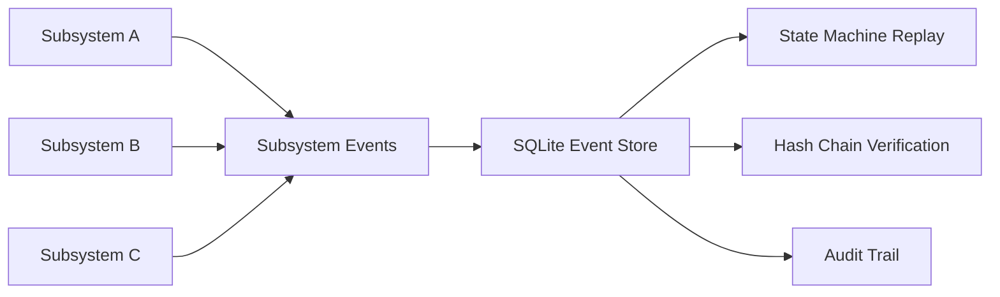
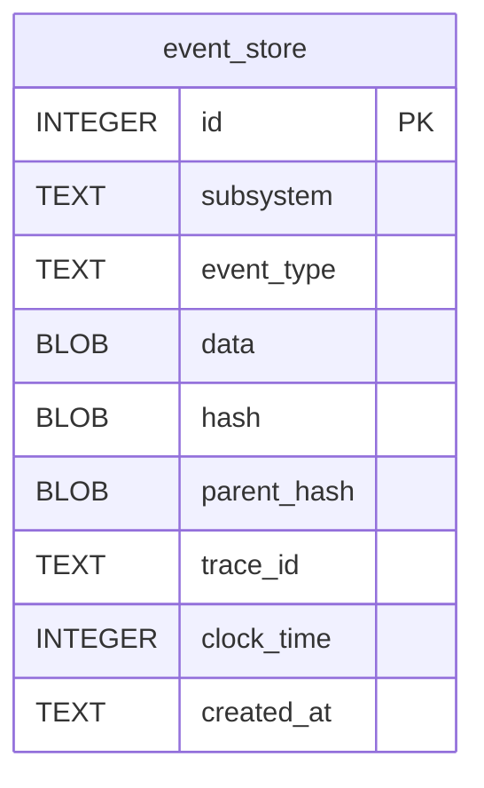
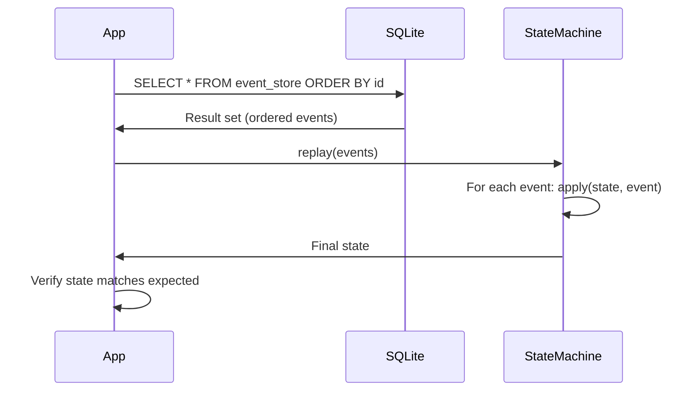
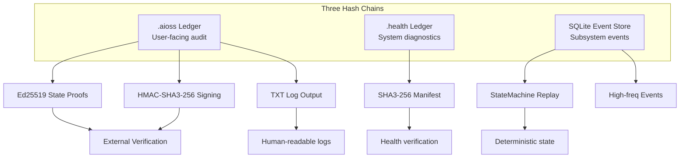

# SQLite Event Store

The SQLite Event Store is a third cryptographic hash chain that lives alongside the `.aioss` ledger and `.health` format, specifically designed for high-frequency subsystem events. It provides deterministic state reconstruction through an append-only event log with full hash chain integrity.

## Overview



## Schema

```sql
CREATE TABLE event_store (
    id INTEGER PRIMARY KEY AUTOINCREMENT,
    subsystem TEXT,
    event_type TEXT,
    data BLOB,
    hash BLOB,           -- SHA3-256 raw 32 bytes
    parent_hash BLOB,    -- SHA3-256 raw 32 bytes
    trace_id TEXT,
    clock_time INTEGER,
    created_at TEXT
);
```

### Schema Diagram



### Column Details

| Column | Type | Description | Indexed |
|--------|------|-------------|---------|
| `id` | INTEGER | Auto-incrementing primary key | Yes (PK) |
| `subsystem` | TEXT | Source subsystem name (e.g. `network`, `storage`, `auth`) | Yes |
| `event_type` | TEXT | Event type identifier (e.g. `connection_up`, `disk_mount`) | Yes |
| `data` | BLOB | Arbitrary binary event payload | No |
| `hash` | BLOB | SHA3-256 hash of this event (32 raw bytes) | No |
| `parent_hash` | BLOB | SHA3-256 hash of the previous event (32 raw bytes) | No |
| `trace_id` | TEXT | Distributed tracing correlation ID | Yes |
| `clock_time` | INTEGER | Monotonic clock value for ordering | Yes |
| `created_at` | TEXT | Human-readable ISO 8601 timestamp | No |

## Complete Schema with Indexes

```sql
-- Main event store table
CREATE TABLE event_store (
    id INTEGER PRIMARY KEY AUTOINCREMENT,
    subsystem TEXT NOT NULL,
    event_type TEXT NOT NULL,
    data BLOB DEFAULT NULL,
    hash BLOB NOT NULL,
    parent_hash BLOB NOT NULL,
    trace_id TEXT DEFAULT NULL,
    clock_time INTEGER NOT NULL,
    created_at TEXT NOT NULL DEFAULT (datetime('now'))
);

-- Indexes for common queries
CREATE INDEX idx_event_store_subsystem ON event_store(subsystem);
CREATE INDEX idx_event_store_event_type ON event_store(event_type);
CREATE INDEX idx_event_store_trace_id ON event_store(trace_id);
CREATE INDEX idx_event_store_clock_time ON event_store(clock_time);
CREATE INDEX idx_event_store_created_at ON event_store(created_at);

-- Composite index for replay queries
CREATE INDEX idx_event_store_subsystem_id ON event_store(subsystem, id);
```

## Hash Chain

### Chain Construction

The hash chain is identical in concept to the `.aioss` and `.health` formats:

```mermaid
graph TD
    subgraph "SQLite event_store"
        G[Row 1<br/>parent_hash=0000...,<br/>hash=SHA3-256(data1)]
        G --> H[Row 2<br/>parent_hash=hash1,<br/>hash=SHA3-256(data2)]
        H --> I[Row 3<br/>parent_hash=hash2,<br/>hash=SHA3-256(data3)]
        I --> J[Row 4<br/>parent_hash=hash3,<br/>hash=SHA3-256(data4)]
    end
```

Each row's hash is computed as:
```
hash = SHA3-256(subsystem || event_type || data || parent_hash || trace_id || clock_time)
```

The genesis row (id=1) has `parent_hash = 0x0000...0000` (32 zero bytes).

### Verification

```sql
-- Verify hash chain integrity
SELECT e1.id, e1.hash, e1.parent_hash, e2.hash AS expected_parent
FROM event_store e1
LEFT JOIN event_store e2 ON e1.id = e2.id + 1
WHERE e1.parent_hash != COALESCE(e2.hash, X'0000000000000000000000000000000000000000000000000000000000000000');
```

Any row where the `parent_hash` doesn't match the previous row's `hash` indicates tampering.

### Advanced Verification Queries

```sql
-- Find gaps in chain (missing rows)
SELECT id FROM event_store e1
WHERE NOT EXISTS (
    SELECT 1 FROM event_store e2 WHERE e2.id = e1.id + 1
) AND id != (SELECT MAX(id) FROM event_store);

-- Count events per subsystem
SELECT subsystem, COUNT(*) as event_count
FROM event_store
GROUP BY subsystem
ORDER BY event_count DESC;

-- Find events by trace
SELECT * FROM event_store
WHERE trace_id = 'trace-xyz-123'
ORDER BY clock_time;
```

## State Machine Replay

The event store supports **deterministic state reconstruction** via the `StateMachine` trait:

```rust
trait StateMachine {
    type State;
    type Event;

    fn apply(state: &mut Self::State, event: &Self::Event);
    fn replay(events: &[Self::Event]) -> Self::State {
        let mut state = Self::State::default();
        for event in events {
            Self::apply(&mut state, event);
        }
        state
    }
}
```



This pattern enables:
- **Crash recovery**: any subsystem can recover its state by replaying all events
- **Deterministic debugging**: same events produce same state, every time
- **Audit trails**: full history of every state change
- **Multi-subscriber**: multiple consumers can replay events independently

## Query Examples

### Basic Queries

```sql
-- Last 10 events
SELECT id, subsystem, event_type, clock_time, created_at
FROM event_store
ORDER BY id DESC LIMIT 10;

-- Events by subsystem with counts
SELECT subsystem, event_type, COUNT(*) as count
FROM event_store
GROUP BY subsystem, event_type;

-- Events in a time range
SELECT * FROM event_store
WHERE created_at BETWEEN '2026-06-19T00:00:00Z' AND '2026-06-19T23:59:59Z'
ORDER BY clock_time;

-- Correlate by trace_id
SELECT e1.*, e2.*
FROM event_store e1
JOIN event_store e2 ON e1.trace_id = e2.trace_id AND e1.id != e2.id
WHERE e1.trace_id = 'trace-xyz-123'
ORDER BY e1.clock_time;
```

### Maintenance Queries

```sql
-- Database size
SELECT page_count * page_size / 1024 / 1024 as size_mb
FROM pragma_page_count(), pragma_page_size();

-- Event age
SELECT subsystem, MAX(julianday('now') - julianday(created_at)) as max_age_days
FROM event_store
GROUP BY subsystem;

-- Remove old events (GDPR purge)
DELETE FROM event_store
WHERE created_at < datetime('now', '-90 days');
```

## Performance Benchmarks

| Operation | Time (100 entries) | Time (10,000 entries) | Time (1,000,000 entries) |
|-----------|-------------------|----------------------|------------------------|
| Write single event | 0.3ms | 0.4ms | 0.8ms |
| Read all events (sequential) | 1ms | 15ms | 800ms |
| Hash chain verification | 2ms | 25ms | 1.2s |
| Replay (state machine) | 1ms | 12ms | 700ms |
| Subsystem filter query | 1ms | 3ms | 50ms |
| Trace correlation query | 1ms | 5ms | 100ms |

Benchmarks on SSD, SQLite WAL mode, 4GB RAM.

## Usage Patterns

### Writing Events

```rust
fn write_event(subsystem: &str, event_type: &str, data: &[u8], 
                trace_id: &str, clock: i64, conn: &Connection) {
    let parent_hash = get_last_hash(conn);
    let hash = compute_hash(subsystem, event_type, data, &parent_hash, trace_id, clock);
    
    conn.execute(
        "INSERT INTO event_store (subsystem, event_type, data, hash, parent_hash, trace_id, clock_time, created_at)
         VALUES (?1, ?2, ?3, ?4, ?5, ?6, ?7, datetime('now'))",
        params![subsystem, event_type, data, hash, parent_hash, trace_id, clock]
    ).unwrap();
}
```

### Reading and Replaying

```rust
fn replay_events(subsystem: &str, conn: &Connection) -> Vec<Event> {
    let mut stmt = conn.prepare(
        "SELECT event_type, data, clock_time FROM event_store 
         WHERE subsystem = ?1 ORDER BY id"
    ).unwrap();
    
    stmt.query_map(params![subsystem], |row| {
        Ok(Event {
            event_type: row.get(0)?,
            data: row.get(1)?,
            clock_time: row.get(2)?,
        })
    }).unwrap().filter_map(|r| r.ok()).collect()
}
```

### Batch Writing

```rust
fn write_events_batch(events: &[EventData], conn: &Connection) -> Result<()> {
    let tx = conn.unchecked_transaction()?;
    let mut parent_hash = get_last_hash(&tx);
    
    for event in events {
        let hash = compute_hash(&event, &parent_hash);
        tx.execute(
            "INSERT INTO event_store ...",
            params![event.subsystem, event.event_type, event.data, hash, parent_hash, ...]
        )?;
        parent_hash = hash.clone();
    }
    
    tx.commit()?;
    Ok(())
}
```

## Replication Options

### SQLite WAL Mode

```sql
-- Enable WAL mode for concurrent readers/writers
PRAGMA journal_mode=WAL;
PRAGMA synchronous=NORMAL;
PRAGMA cache_size=-64000;  -- 64MB cache
```

### File-Based Replication

```bash
# Replicate by copying the database file
cp /var/lib/01s/event-store.db /backup/event-store-$(date +%Y%m%d).db

# Verify integrity on replica
sqlite3 /backup/event-store.db "PRAGMA integrity_check;"
```

### Streaming Replication (Concept)

The event store can be replicated to external systems by streaming new events:

```bash
# Stream new events as JSON
sqlite3 /var/lib/01s/event-store.db "
    SELECT json_object(
        'id', id, 'subsystem', subsystem,
        'event_type', event_type, 'clock_time', clock_time
    )
    FROM event_store
    WHERE id > LAST_SYNCED_ID
    ORDER BY id;
"
```

## Relationship to Other Ledgers



## Comparison

| Feature | .aioss Ledger | .health Ledger | SQLite Event Store |
|---------|---------------|----------------|-------------------|
| Storage | JSON file | JSON file | SQLite database |
| Hash | Bare hex | `sha3-256:` prefix | Raw 32 bytes (BLOB) |
| Frequency | On user/system events | On health checks | High-frequency subsystem |
| Verification | `01s-ledger verify` | `01s-ledger health verify` | SQL query |
| Replay support | No | No | Yes (StateMachine trait) |
| Purpose | Audit trail | Health diagnostics | Subsystem state tracking |
| External reading | JSON parser | JSON parser | SQL queries |
| Concurrent writes | No (append) | No (append) | Yes (WAL mode) |
| Query capability | Limited | Limited | Full SQL |

## Use Cases

1. **Network subsystem**: Log connection events, interface changes, DNS resolutions
2. **Storage subsystem**: Log mount/unmount, filesystem checks, disk events
3. **Authentication**: Log login attempts, session creation, permission changes
4. **Process manager**: Log process starts, stops, crashes, resource usage
5. **Service dependencies**: Log service health, dependency resolution

## Performance Considerations

- WAL mode enables concurrent reads while writing
- Indexes add write overhead but speed up replay queries significantly
- The hash chain verification is O(n) — for very large tables, periodic verification is recommended
- Consider archiving old events to keep the primary table small
- SQLite handles up to ~1000 writes/second on typical SSDs

## Security Considerations

- The hash chain prevents undetected tampering
- BLOB fields support cryptographic verification of raw data
- The `trace_id` enables cross-subsystem correlation
- Monotonic `clock_time` prevents replay attacks within the chain
- SQLite WAL mode recommended for concurrent write safety
- Database file permissions should restrict access (`chmod 600`)

## Troubleshooting

| Problem | Cause | Solution |
|---------|-------|----------|
| Verification fails | Hash chain broken | Check for manual edits or corruption |
| Slow writes | No WAL mode | `PRAGMA journal_mode=WAL;` |
| Database locked | Concurrent write contention | Check for long-running transactions |
| Missing events | ID gap | Check for deletions or rollbacks |
| Large database | No archival policy | Implement event retention policy |

## SQLite Configuration Best Practices

### WAL Mode Configuration

```sql
-- Optimize for write-heavy workloads
PRAGMA journal_mode=WAL;           -- Write-Ahead Logging
PRAGMA synchronous=NORMAL;          -- Balance safety/speed
PRAGMA cache_size=-64000;           -- 64MB page cache
PRAGMA page_size=4096;              -- 4KB pages (default)
PRAGMA mmap_size=268435456;         -- 256MB memory map
PRAGMA temp_store=MEMORY;           -- Store temp tables in memory
PRAGMA busy_timeout=5000;           -- Wait 5s on lock
PRAGMA foreign_keys=ON;             -- Enforce foreign keys
```

### Database Maintenance

```sql
-- Periodic maintenance
PRAGMA analysis_limit=1000;
PRAGMA optimize;

-- Rebuild database (defragment)
VACUUM;

-- Rebuild indexes
REINDEX;

-- Integrity check
PRAGMA integrity_check;
PRAGMA quick_check;
```

### Backup Strategy

```bash
#!/bin/bash
# Backup event store database
DB_PATH="/var/lib/01s/event-store.db"
BACKUP_DIR="/var/backups/01s"
DATE=$(date +%Y%m%d-%H%M%S)

# Create backup
sqlite3 "$DB_PATH" ".backup '$BACKUP_DIR/event-store-$DATE.db'"

# Verify backup
sqlite3 "$BACKUP_DIR/event-store-$DATE.db" "PRAGMA integrity_check;"

# Compress old backups
find "$BACKUP_DIR" -name "*.db" -mtime +7 -exec gzip {} \;

# Delete backups older than 90 days
find "$BACKUP_DIR" -name "*.db.gz" -mtime +90 -delete
```

## Event Store Integration Patterns

### Using Trace IDs for Correlation

```sql
-- Find all events related to a specific operation
SELECT e1.*
FROM event_store e1
WHERE e1.trace_id = (
    SELECT trace_id FROM event_store
    WHERE event_type = 'login_attempt'
    ORDER BY id DESC LIMIT 1
)
ORDER BY e1.clock_time;
```

### Subsystem Health via Events

```sql
-- Check if a subsystem is healthy
SELECT subsystem,
    COUNT(*) as total_events,
    MAX(clock_time) as last_event,
    CASE
        WHEN MAX(clock_time) > strftime('%s', 'now') - 300 THEN 'healthy'
        ELSE 'stale'
    END as status
FROM event_store
WHERE created_at > datetime('now', '-1 hour')
GROUP BY subsystem;
```

## Using Event Store with the Ledger

The event store can be verified against the AIOSS ledger by recording the event store's hash in the ledger:

```bash
# Record event store integrity in ledger
EVENT_STORE_HASH=$(sha3-256sum /var/lib/01s/event-store.db | cut -d' ' -f1)
01s-ledger log state event_store_hash="$EVENT_STORE_HASH"
```

## See Also

- [AIOSS Ledger Format](01-aioss-ledger-format.md)
- [Health Diagnostic Ledger](12-health-diagnostic-ledger.md)
- [Log Manager TXT Output](14-log-manager-txt-output.md)
- [01s-ledger Daemon](11-01s-ledger-daemon.md)

---
Lois-Kleinner and 0-1.gg 2026 Copyright

```
.====================================================================.
!  Made in the UAE, Dubai #DubaiIt #Dubai #Dxb #SovereignAI          !
!  Made in The Emirates #Dubai_it                                    !
!                                                                    !
!  Lois-Kleinner Alpasan - The Anticloud 2026-                       !
!                                                                    !
!  As seen on:                                                       !
!  Harvard Dataverse ! Zenodo/CERN ! Academia.edu ! HuggingFace      !
!  anticloud.telepedia.net ! anticloud.fandom.com                    !
!                                                                    !
!  0-1.gg ! GitHub ! LinkedIn ! DEV ! GH Pages                       !
!  HuggingFace ! Blog ! Bluesky ! Mastodon                           !
!  Internet Archive ! ORCID ! Figshare                               !
!                                                                    !
!  Sovereign AI ! Local-First ! Privacy ! Zero Trust ! No Datacenter !
!  Air-Gapped ! Open Source ! Rust ! Hash Chain ! Single Binary      !
!  Offline LLM ! Crypto Ledger ! P2P ! Federated                     !
'===================================================================='
```

Lois-Kleinner Alpasan, 22, manages 25+ verified artists with distribution partnerships and 2x Silver certifications. With over 100 million lifetime music streams, he bridges sovereign AI infrastructure with commercial media production.

References:
1. Lois-Kleinner Zenodo: https://doi.org/10.5281/zenodo.20781790
2. Lois-Kleinner GitHub: https://github.com/kleinnner/Anticloud/tree/main/04-aioss-format
3. Lois-Kleinner Harvard DV: https://doi.org/10.7910/DVN/FSHFZF
4. Lois-Kleinner Internet Arc: https://archive.org/details/aioss-format
5. Lois-Kleinner ORCID: https://orcid.org/0009-0009-2233-6107
6. Lois-Kleinner DEV.to: https://dev.to/kleinner
7. Lois-Kleinner LinkedIn: https://linkedin.com/in/kleinner
8. Lois-Kleinner HuggingFace: https://huggingface.co/Anticloud
9. Lois-Kleinner Tumblr: https://anticloud.tumblr.com
10. Lois-Kleinner Mastodon: https://mastodon.social/@kleinner
11. Lois-Kleinner Bluesky: https://bsky.app/profile/kleinner.bsky.social
12. 0-1.gg: https://0-1.gg
13. Lois-Kleinner Figshare: https://figshare.com/authors/Lois-Kleinner_Alpasan/20849885
14. Lois-Kleinner Academia: https://independent.academia.edu/kleinner
15. Lois-Kleinner Telepedia: https://anticloud.telepedia.net
16. Lois-Kleinner Fandom: https://anticloud.fandom.com