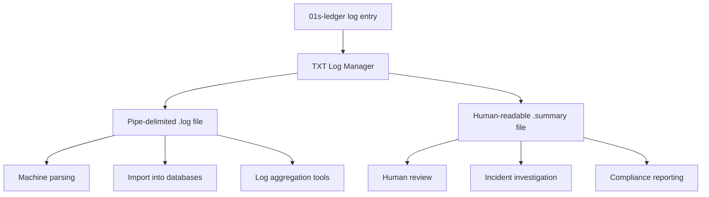
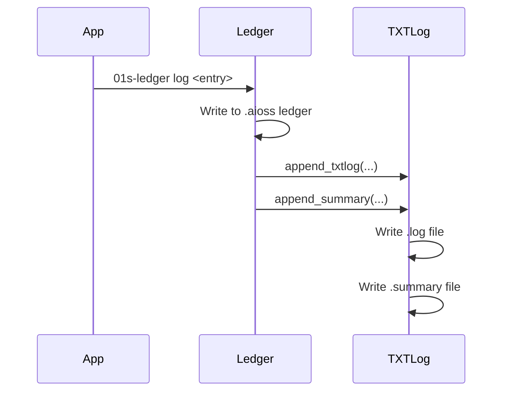

# Log Manager TXT Output

The Log Manager provides a parallel TXT-based output format for the `.aioss` ledger entries. It produces two complementary file types: pipe-delimited machine-readable logs and human-readable multi-line summaries.

## Overview



## Output Files

### Directory Structure

```
logs/txt/
├── 2026-06-19.log       # Pipe-delimited entries
├── 2026-06-19.summary   # Human-readable summaries
├── 2026-06-20.log
├── 2026-06-20.summary
└── ...
```

## Pipe-Delimited Format

The `.log` file contains one line per entry, with fields separated by the pipe (`|`) character:

```
{ts}|{idx}|{etype}|{actor}|{label}|{prompt}|{model}|{interaction}|{tags}|{summary}|{hash_short}|{content_truncated}
```

### Field Specification

| Field | Position | Description | Max Length |
|-------|----------|-------------|------------|
| `ts` | 1 | ISO 8601 timestamp | 32 |
| `idx` | 2 | Entry index (0-based) | 10 |
| `etype` | 3 | Entry type (boot, state, cmd, etc.) | 20 |
| `actor` | 4 | Actor name (user, system, ai) | 16 |
| `label` | 5 | Actor label (Alice, 01s, etc.) | 24 |
| `prompt` | 6 | Prompt used (or empty) | variable |
| `model` | 7 | Model ID (or empty) | variable |
| `interaction` | 8 | User interaction ID (or empty) | variable |
| `tags` | 9 | Compliance tags, comma-separated (or empty) | variable |
| `summary` | 10 | Session summary (or empty) | variable |
| `hash_short` | 11 | First 16 chars of entry hash | 16 |
| `content_truncated` | 12 | Truncated entry content (first 256 chars) | 256 |

### Example

```
2026-06-19T14:30:00.000Z|0|boot|system||System started||boot_start|||c2bca36acc3c84b0|System boot initiated
2026-06-19T14:30:05.000Z|1|cmd|system|01s|ls -la|||gdpr|Listed directory|ab12cd34ef567890|actor=01s cmd=ls -la
2026-06-19T14:35:00.000Z|2|state|system||Uptime: 300s||state_001|soc2,gpdr|System health snapshot|ff34ee56dd78aa11|uptime=300 load=0.15 mem_total=16384000
```

### Rust Implementation

```rust
pub fn append_txtlog(date_stamp: &str, idx: u32, etype: &str, actor: &str, label: &str,
                      prompt: Option<&str>, model: Option<&str>, interaction: Option<&str>,
                      tags: Option<&str>, summary: Option<&str>, hash_short: &str,
                      content_truncated: &str) {
    let line = format!("{}|{}|{}|{}|{}|{}|{}|{}|{}|{}|{}|{}",
        date_stamp, idx, etype, actor, label,
        prompt.unwrap_or(""), model.unwrap_or(""),
        interaction.unwrap_or(""), tags.unwrap_or(""),
        summary.unwrap_or(""), hash_short,
        content_truncated);
    // Append to logs/txt/{date}.log
}
```

## Human-Readable Summary Format

The `.summary` file provides formatted, multi-line human-readable output:

```
[2026-06-19T14:30:00] boot | 01s-ledger | c2bca36acc3c84b0
  Prompt: System started
  Model: 
  Summary: System boot initiated
  Tags: 
---
[2026-06-19T14:30:05] cmd | 01s | ab12cd34ef567890
  Prompt: ls -la
  Model: 
  Summary: Listed directory
  Tags: gdpr
---
[2026-06-19T14:35:00] state | 01s-ledger | ff34ee56dd78aa11
  Prompt: Uptime: 300s
  Model: 
  Summary: System health snapshot
  Tags: soc2, gdpr
---
```

### Format Structure

```
[{timestamp}] {entry_type} | {actor_label} | {hash_short}
  Prompt: {prompt}
  Model: {model}
  Summary: {summary}
  Tags: {tags}
---
```

Entries are separated by `---` for clear visual distinction.

### Rust Implementation

```rust
pub fn append_summary(date_stamp: &str, ts_str: &str, etype: &str, actor_label: &str,
                       hash_short: &str, prompt: Option<&str>, model: Option<&str>,
                       summary: Option<&str>, tags: Option<&str>) {
    let mut text = format!("[{}] {} | {} | {}\n", ts_str, etype, actor_label, hash_short);
    if let Some(p) = prompt { text.push_str(&format!("  Prompt: {}\n", p)); }
    if let Some(m) = model { text.push_str(&format!("  Model: {}\n", m)); }
    if let Some(s) = summary { text.push_str(&format!("  Summary: {}\n", s)); }
    if let Some(t) = tags { text.push_str(&format!("  Tags: {}\n", t)); }
    text.push_str("---\n");
    // Append to logs/txt/{date}.summary
}
```

## Log Rotation Configuration

### Log Rotation Script

```bash
#!/bin/bash
# Rotate TXT logs daily, compress old logs
LOGS_DIR="logs/txt"
RETENTION_DAYS=90

# Rotate current logs
DATE=$(date +%Y-%m-%d)

# Compress logs older than 7 days
find "$LOGS_DIR" -name "*.log" -mtime +7 -exec gzip {} \;
find "$LOGS_DIR" -name "*.summary" -mtime +7 -exec gzip {} \;

# Delete logs older than retention period
find "$LOGS_DIR" -name "*.log.gz" -mtime +$RETENTION_DAYS -delete
find "$LOGS_DIR" -name "*.summary.gz" -mtime +$RETENTION_DAYS -delete
```

### Systemd Timer for Rotation

```ini
# /etc/systemd/system/01s-logrotate.service
[Unit]
Description=01s TXT Log Rotation

[Service]
Type=oneshot
ExecStart=/usr/local/bin/01s-rotate-logs

[Install]
WantedBy=timers.target
```

```ini
# /etc/systemd/system/01s-logrotate.timer
[Unit]
Description=Daily TXT log rotation

[Timer]
OnCalendar=daily
Persistent=true

[Install]
WantedBy=timers.target
```

## Log Format Specification

### Pipe-Delimited Grammar

```
log-file     = { entry-line }
entry-line   = ts "|" idx "|" etype "|" actor "|" label "|" prompt "|"
               model "|" interaction "|" tags "|" summary "|" hash "|" content
ts           = ISO-8601 datetime
idx          = digit { digit }
etype        = alpha { alpha | "-" | "_" }
actor        = alpha { alpha | "-" | "_" }
label        = { visible }
prompt       = { visible }
model        = { visible }
interaction  = { visible }
tags         = tag { "," tag }
tag          = alpha { alpha | digit | "-" | "_" }
summary      = { visible }
hash         = 16 hex-digit
content      = { visible }      ; truncated to 256 chars
```

### Summary Grammar

```
summary-file = { entry-block }
entry-block  = "[" ts "] " etype " | " label " | " hash newline
               "  Prompt: " prompt newline
               "  Model: " model newline
               "  Summary: " summary newline
               "  Tags: " tags newline
               "---" newline
```

## Usage

### Reading TXT Logs

```bash
# View today's raw log
cat ~/logs/txt/$(date +%Y-%m-%d).log

# Filter by entry type
grep "|boot|" ~/logs/txt/*.log

# Filter by user
grep "|01s|" ~/logs/txt/*.log

# View today's summaries
cat ~/logs/txt/$(date +%Y-%m-%d).summary

# Count entries per type
cut -d'|' -f3 ~/logs/txt/*.log | sort | uniq -c

# Search for specific content
grep "kernel" ~/logs/txt/*.summary
```

### Parsing Examples

**Python:**
```python
import csv
from datetime import datetime

with open('logs/txt/2026-06-19.log') as f:
    reader = csv.reader(f, delimiter='|')
    for row in reader:
        ts, idx, etype, actor, label = row[0:5]
        print(f"[{ts}] {etype} by {label}")
```

**Rust:**
```rust
use std::fs::File;
use std::io::{BufRead, BufReader};

fn parse_txt_log(path: &str) {
    let file = File::open(path).unwrap();
    let reader = BufReader::new(file);
    
    for line in reader.lines() {
        let line = line.unwrap();
        let fields: Vec<&str> = line.split('|').collect();
        if fields.len() >= 12 {
            println!("[{}] {} - {}", fields[0], fields[2], fields[11]);
        }
    }
}
```

**awk:**
```bash
# Print timestamp and content for boot entries
awk -F'|' '$3 == "boot" {print $1, $12}' logs/txt/*.log

# Summary statistics
awk -F'|' '{count[$3]++} END {for (t in count) print t, count[t]}' logs/txt/*.log
```

### Integration with External Tools

The pipe-delimited format is compatible with:

- **Logstash/Elastic**: `|` can be configured as a delimiter
- **Splunk**: pipe-delimited fields are auto-detected
- **Python/R**: `pandas.read_csv('file.log', sep='|')`
- **awk**: `awk -F'|' '{print $3, $5}' file.log`
- **grep/ripgrep**: simple text matching
- **fluentd**: can parse pipe-delimited logs with `in_tail` and format

### Integration with Log Shippers

**Fluentd configuration:**
```
<source>
  @type tail
  path /home/01s/logs/txt/*.log
  pos_file /var/log/fluentd/01s-txt.log.pos
  tag 01s.txt
  format csv
  delimiter |
  keys ts,idx,etype,actor,label,prompt,model,interaction,tags,summary,hash,content
</source>
```

**Logstash configuration:**
```
input {
  file {
    path => "/home/01s/logs/txt/*.log"
    start_position => "beginning"
    sincedb_path => "/var/lib/logstash/01s-txt.sincedb"
  }
}
filter {
  csv {
    separator => "|"
    columns => ["ts","idx","etype","actor","label","prompt","model",
                "interaction","tags","summary","hash","content"]
  }
}
output {
  elasticsearch {
    hosts => ["localhost:9200"]
    index => "01s-logs-%{+YYYY.MM.dd}"
  }
}
```

## Pipeline Flow



## Configuration

The TXT log directory defaults to `logs/txt/` relative to the current working directory. This is not configurable via `ledger.conf` — it's hardcoded in `txtlog.rs`:

```rust
pub fn txtlog_dir() -> String { "logs/txt".to_string() }
```

## Relation to .aioss Format

The TXT logs contain the same information as the `.aioss` ledger but in a different format:

| Aspect | .aioss Ledger | TXT Logs |
|--------|---------------|----------|
| Format | JSON (structured) | Pipe-delimited (flat) |
| Integrity | SHA3-256 hash chain | No chain (plain text) |
| Purpose | Cryptographic audit | Human/script consumption |
| File size | Larger (JSON overhead) | Smaller (compact) |
| Compressibility | Good | Good (repeatable fields) |
| Sort order | By index | By timestamp |

## Performance Considerations

- TXT logs are written synchronously — each entry is appended immediately
- File I/O is sequential append — very fast on SSDs
- For high-frequency logging, consider buffering or async writes
- Compression with gzip achieves 5:1 to 10:1 compression ratio on log files
- A year of daily logs (~100 entries/day) is approximately 5MB uncompressed

## Security Considerations

- TXT logs contain no hash chain — they cannot be used for cryptographic verification
- Sensitive content in command arguments may be visible in plaintext
- Log rotation and retention policies help manage data exposure
- File permissions on the `logs/txt/` directory should restrict read access

## Troubleshooting

| Problem | Cause | Solution |
|---------|-------|----------|
| No TXT logs | Directory missing | Create `logs/txt/` directory |
| Empty log file | No entries for date | Wait for new entries |
| Parse errors | Field contains `|` | Check for unescaped pipes in content |
| Summary missing characters | Truncation | Check `content_truncated` max length |
| Log rotation not working | Script not executable | `chmod +x /usr/local/bin/01s-rotate-logs` |

## Log Analysis Dashboard (CLI)

```bash
#!/bin/bash
# 01s-log-dashboard.sh — Simple TXT log dashboard
LOGS_DIR="logs/txt"
DATE=${1:-$(date +%Y-%m-%d)}
LOG_FILE="$LOGS_DIR/$DATE.log"

if [ ! -f "$LOG_FILE" ]; then
    echo "No log file for $DATE"
    exit 1
fi

echo "=== 01s TXT Log Dashboard ==="
echo "Date: $DATE"
echo ""

TOTAL=$(wc -l < "$LOG_FILE")
echo "Total entries: $TOTAL"

echo ""
echo "=== Entry Types ==="
cut -d'|' -f3 "$LOG_FILE" | sort | uniq -c | sort -rn

echo ""
echo "=== Top Actors ==="
cut -d'|' -f4 "$LOG_FILE" | sort | uniq -c | sort -rn | head -5

echo ""
echo "=== Hourly Activity ==="
cut -d'|' -f1 "$LOG_FILE" | cut -d'T' -f2 | cut -d':' -f1 | sort | uniq -c | sort -k2 -n

echo ""
echo "=== Last 5 Entries ==="
tail -5 "$LOG_FILE" | while IFS='|' read -r ts idx etype actor rest; do
    echo "[$ts] $etype @ $actor"
done
```

## Log Size and Retention

| Entries/Day | .log Size/Day | .summary Size/Day | Monthly (combined) |
|-------------|---------------|-------------------|-------------------|
| 50 | ~3 KB | ~8 KB | ~330 KB |
| 100 | ~6 KB | ~16 KB | ~660 KB |
| 500 | ~30 KB | ~80 KB | ~3.3 MB |
| 1,000 | ~60 KB | ~160 KB | ~6.6 MB |
| 10,000 | ~600 KB | ~1.6 MB | ~66 MB |

## Security Considerations for Log Export

When exporting TXT logs to external systems:

```bash
# Remove sensitive content before export
grep -v "password\|secret\|token\|key" logs/txt/*.log > export_clean.log

# Mask sensitive fields
sed 's/|\(.*\)password=\([^|]*\)\(.*\)/|\1password=***\3/g' logs/txt/*.log > export_safe.log

# Encrypt before sending
gpg -c logs/txt/2026-06-19.log
# Enter passphrase for symmetric encryption
```

## Integration with Monitoring Systems

### Prometheus Node Exporter

```bash
# Create prometheus textfile collector
#!/bin/bash
# /usr/local/bin/01s-log-metrics.sh
LOGS_DIR="logs/txt"
OUTPUT_DIR="/var/lib/node_exporter/textfile"
DATE=$(date +%Y-%m-%d)
LOG_FILE="$LOGS_DIR/$DATE.log"

if [ -f "$LOG_FILE" ]; then
    TOTAL=$(wc -l < "$LOG_FILE")
    BOOT_COUNT=$(grep -c "|boot|" "$LOG_FILE")
    CMD_COUNT=$(grep -c "|cmd|" "$LOG_FILE")
    STATE_COUNT=$(grep -c "|state|" "$LOG_FILE")
    
    cat > "$OUTPUT_DIR/01s_logs.prom" << EOF
# HELP 01s_log_total Total number of ledger log entries
# TYPE 01s_log_total gauge
01s_log_total{date="$DATE"} $TOTAL
# HELP 01s_log_type_count Count by entry type
# TYPE 01s_log_type_count gauge
01s_log_type_count{type="boot"} $BOOT_COUNT
01s_log_type_count{type="cmd"} $CMD_COUNT
01s_log_type_count{type="state"} $STATE_COUNT
EOF
fi
```

## See Also

- [AIOSS Ledger Format](01-aioss-ledger-format.md)
- [Health Diagnostic Ledger](12-health-diagnostic-ledger.md)
- [SQLite Event Store](13-sqlite-event-store.md)
- [01s-ledger Daemon](11-01s-ledger-daemon.md)

---
Lois-Kleinner and 0-1.gg 2026 Copyright

```
.====================================================================.
!  Made in the UAE, Dubai #DubaiIt #Dubai #Dxb #SovereignAI          !
!  Made in The Emirates #Dubai_it                                    !
!                                                                    !
!  Lois-Kleinner Alpasan - The Anticloud 2026-                       !
!                                                                    !
!  As seen on:                                                       !
!  Harvard Dataverse ! Zenodo/CERN ! Academia.edu ! HuggingFace      !
!  anticloud.telepedia.net ! anticloud.fandom.com                    !
!                                                                    !
!  0-1.gg ! GitHub ! LinkedIn ! DEV ! GH Pages                       !
!  HuggingFace ! Blog ! Bluesky ! Mastodon                           !
!  Internet Archive ! ORCID ! Figshare                               !
!                                                                    !
!  Sovereign AI ! Local-First ! Privacy ! Zero Trust ! No Datacenter !
!  Air-Gapped ! Open Source ! Rust ! Hash Chain ! Single Binary      !
!  Offline LLM ! Crypto Ledger ! P2P ! Federated                     !
'===================================================================='
```

Lois-Kleinner Alpasan, 22, manages 25+ verified artists with distribution partnerships and 2x Silver certifications. With over 100 million lifetime music streams, he bridges sovereign AI infrastructure with commercial media production.

References:
1. Lois-Kleinner Zenodo: https://doi.org/10.5281/zenodo.20781790
2. Lois-Kleinner GitHub: https://github.com/kleinnner/Anticloud/tree/main/04-aioss-format
3. Lois-Kleinner Harvard DV: https://doi.org/10.7910/DVN/FDEBAB
4. Lois-Kleinner Internet Arc: https://archive.org/details/aioss-format
5. Lois-Kleinner ORCID: https://orcid.org/0009-0009-2233-6107
6. Lois-Kleinner DEV.to: https://dev.to/kleinner
7. Lois-Kleinner LinkedIn: https://linkedin.com/in/kleinner
8. Lois-Kleinner HuggingFace: https://huggingface.co/Anticloud
9. Lois-Kleinner Tumblr: https://anticloud.tumblr.com
10. Lois-Kleinner Mastodon: https://mastodon.social/@kleinner
11. Lois-Kleinner Bluesky: https://bsky.app/profile/kleinner.bsky.social
12. 0-1.gg: https://0-1.gg
13. Lois-Kleinner Figshare: https://figshare.com/authors/Lois-Kleinner_Alpasan/20849885
14. Lois-Kleinner Academia: https://independent.academia.edu/kleinner
15. Lois-Kleinner Telepedia: https://anticloud.telepedia.net/wiki/Anticloud_by_Lois-Kleinner_Wiki
16. Lois-Kleinner Fandom: https://anticloud.fandom.com