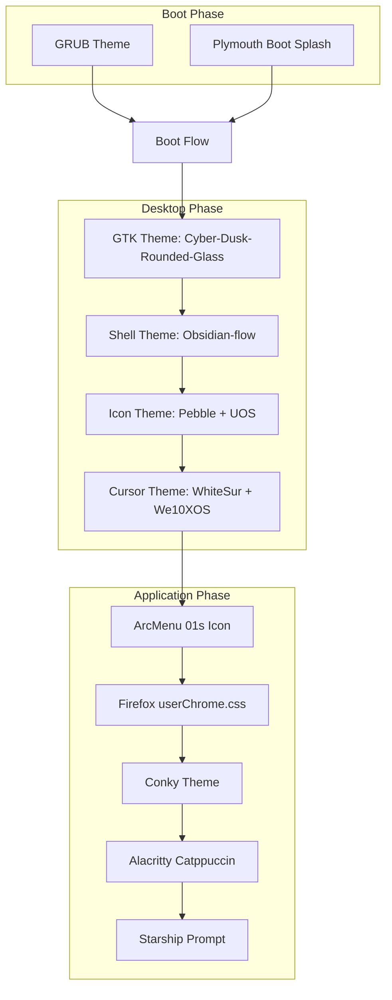
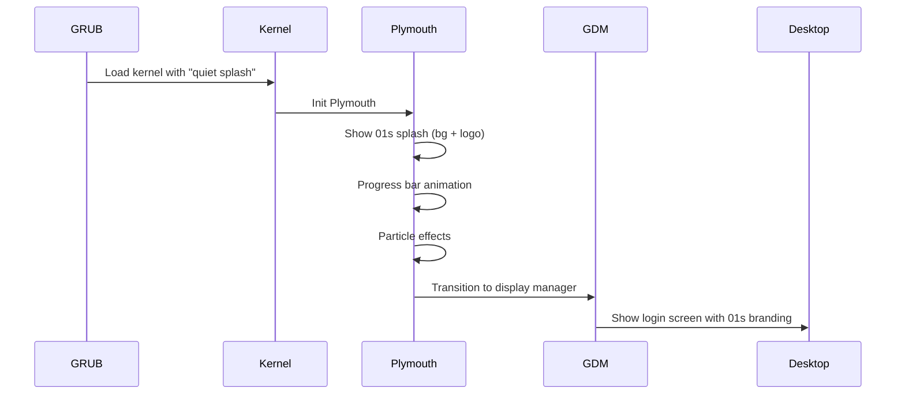

# Theming and Branding System

The 01s Sovereign (Kaiman) operating system features a comprehensive, multi-layered theming and branding system that transforms the standard GNOME desktop into a distinctive, cohesive visual experience. The theme stack spans boot (GRUB splash, Plymouth animation), desktop (GTK, Shell, icons, cursors), and applications.

## Theme Stack Architecture



## Theme Components

### 1. GRUB Theme: Particle-circle-window

**Files:** `day-1/iso/profile/efiboot/EFI/BOOT/themes/Particle-circle-window/`
**Files:** `day-1/iso/profile/grub/themes/Particle-circle-window/`

A complete GRUB 2 bootloader theme with:

```
├── theme.txt          # Theme configuration (colors, fonts, layout)
├── select_*.png       # Selection highlight graphics (west, east, center)
├── info.png           # Information icon
├── icons/             # 60+ OS-specific boot icons
│   ├── 01s.png
│   ├── archlinux.png
│   ├── artix.png
│   ├── debian.png
│   ├── ubuntu.png
│   ├── windows.png
│   └── ... (60+ icons for major distributions)
├── unifont-*.pf2      # Unicode bitmap fonts (16, 24, 32pt)
└── terminus-*.pf2     # Terminal bitmap fonts (12, 14, 16, 18pt)
```

Deployed to both BIOS GRUB and UEFI EFI boot paths:

```bash
cp -r "$SHARED_PROFILE/grub/themes/Particle-circle-window" "$LOCAL_PROFILE/grub/themes/"
cp -r "$SHARED_PROFILE/efiboot/EFI/BOOT/themes/Particle-circle-window" "$LOCAL_PROFILE/efiboot/EFI/BOOT/themes/"
```

### 2. Plymouth Boot Splash Theme: 01s

**Files:** `airootfs/usr/share/plymouth/themes/01s/`



Theme files:
```
/usr/share/plymouth/themes/01s/
├── 01s.plymouth       # Theme definition/metadata
├── 01s.script         # Plymouth script (animation logic)
├── bg.png             # Background (1920x1080, dark #0a0a0a)
├── logo.png           # Gradient banner (900x300, blue-cyan)
├── subtitle.png       # Dark rectangle (300x40)
├── progress_box.png   # Glass progress track (320x8, #202022)
├── progress_bar.png   # Cyan progress fill (316x6, #00c8ff)
└── particle.png       # Cyan dot particle (8x8, #00c8ff)
```

Assets are generated at build time via Python scripts:

```python
# logo.png with gradient
for y in range(h):
    for x in range(w):
        dist = abs(x - 450) / 450.0
        r = 10
        g = min(40, int(12 + (1 - dist) * 28 + y * 0.03))
        b = min(60, int(14 + (1 - dist) * 46 + y * 0.04))
```

### 3. GTK Theme: Cyber-Dusk-Rounded-Glass

**Archive:** `assets/themes/Cyber-Dusk-Rounded-Glass-V3.0.zip`

A dark theme with rounded corners and glass-morphism aesthetics:

- **GTK3**: Full GTK3 widget styling (buttons, entries, scrollbars, menus)
- **GTK4**: GTK4 widget styling
- **GNOME Shell**: Shell theme (panel, dash, notifications)
- **Color scheme**: Dark backgrounds (#1a1a2e), cyan accents (#00c8ff)
- **Effects**: Semi-transparent panels, blurred backgrounds, rounded corners

Extracted at build time:
```bash
unzip -o "$THEMES/Cyber-Dusk-Rounded-Glass-V3.0.zip" -d "$AIROOTFS/usr/share/themes"
```

### 4. Shell Theme CSS: Obsidian-flow

**Archive:** `assets/themes/Obsidian-flow-shell-theme-*.zip`

Provides custom GNOME Shell CSS with multiple color variants:

```
/usr/share/themes/Obsidian-flow/gnome-shell/
├── gnome-shell.css       # Main shell styling
├── pad-osd.css           # On-screen display styling
├── assets/               # Shell assets (buttons, indicators)
└── ...
```

Extracted at build time:
```bash
CSS_DIR=$(find "$TMP_OB" -type d -name "gnome-shell" -path "*/Obsidian-flow*" | head -1)
cp "$CSS_DIR"/* "$AIROOTFS/usr/share/themes/Obsidian-flow/gnome-shell/"
```

### 5. Icon Theme: Pebble

**Source:** `/tmp/pebble-icons/`

Installed to `/usr/share/icons/Pebble/`:

| Aspect | Detail |
|--------|--------|
| Style | Modern, flat, rounded |
| Coverage | Full application and mimetype icons |
| Resolution | Scalable SVG + PNG at multiple sizes |
| Folder structure | Standard hicolor-compatible |
| Install location | `/usr/share/icons/Pebble/` |

### 6. Cursor Theme: WhiteSur

**Source:** `/tmp/whitesur-icons/`

Installed to `/usr/share/icons/WhiteSur-cursors/`:

- macOS-inspired design
- Scalable cursor set
- Dynamic cursor sizes
- HiDPI support

### 7. Cursor Theme: We10XOS (Additional)

**Archive:** `assets/themes/We10XOS-cursors.tar.gz`

Alternative cursor set extracted to `/usr/share/icons/`.

### 8. UOS Icon Theme (Additional)

**Archive:** `assets/themes/Uos-fulldistro-icons-*.tar.xz`

Full-distribution icon set extracted to `/usr/share/icons/` for comprehensive icon coverage.

### 9. GRUB Splash Image

A 1920x1080 PNG displayed at the top of the GRUB menu, generated from `assets/Wallpaper.png`:

```bash
magick "$ROOT/assets/Wallpaper.png" -resize 1920x1080^ -gravity center -extent 1920x1080 \
    "$LOCAL_PROFILE/grub/splash.png"
```

Copied to all bootloader locations plus the runtime directory.

### 10. Desktop Wallpaper & Login Background

Both derived from the same source image:

```
/usr/share/backgrounds/01s/
├── wallpaper.png     # Desktop wallpaper (1920x1080)
└── login.png         # GDM login screen background (1920x1080)
```

### 11. ArcMenu 01s Icon

Custom application icon for the ArcMenu launcher:

```
/usr/share/icons/hicolor/48x48/apps/01s.png
```

### 12. Terminal: Alacritty Catppuccin

Files: `/etc/skel/.config/alacritty/`

```
.config/alacritty/
├── alacritty.toml        # Alacritty configuration
└── catppuccin-mocha.toml # Catppuccin Mocha color scheme
```

### 13. GTK CSS Overrides

Files: `/etc/skel/.config/gtk-3.0/gtk.css`, `/etc/skel/.config/gtk-4.0/gtk.css`

User-level GTK CSS overrides for fine-tuning the look and feel.

### 14. Starship Prompt

Files: `/etc/skel/.config/starship.toml`, `/etc/profile.d/01s-starship.sh`

Custom Starship prompt configuration with:
- Custom module ordering
- Branded color scheme
- Git status display
- System information modules

### 15. Conky Desktop Widget

Files: `/etc/skel/.config/conky/01s.conf`

Desktop system monitor showing:
- CPU usage
- Memory usage
- Disk usage
- Network activity
- System uptime

### 16. Elegant-wave GRUB Theme (Additional)

**Archive:** `assets/themes/Elegant-wave-window-grub-themes.tar.xz`

An alternative GRUB theme extracted to `/usr/share/grub/themes/`.

## dconf Configuration

System-wide theme settings are applied via dconf:

```
/etc/dconf/profile/user
/etc/dconf/db/local.d/
```

The profile file specifies the database search order. The local.d directory contains key-value pairs:

```
[org/gnome/desktop/interface]
gtk-theme='Cyber-Dusk-Rounded-Glass'
icon-theme='Pebble'
cursor-theme='WhiteSur-cursors'
font-name='Inter 11'

[org/gnome/desktop/background]
picture-uri='file:///usr/share/backgrounds/01s/wallpaper.png'
picture-options='zoom'

[org/gnome/desktop/screensaver]
picture-uri='file:///usr/share/backgrounds/01s/wallpaper.png'

[org/gnome/shell]
enabled-extensions=[...]
```

## Color Palette

| Token | Color Code | Usage |
|-------|-----------|-------|
| Background | `#1a1a2e` | Main background |
| Surface | `#16213e` | Card/panel surfaces |
| Primary | `#0f3460` | Accent background |
| Accent | `#00c8ff` | Cyan highlights |
| Text Primary | `#ffffff` | Primary text |
| Text Secondary | `#a0a0b0` | Secondary text |
| Error | `#ff3333` | Error states |
| Warning | `#ffaa00` | Warning states |
| Success | `#00cc66` | Success states |

## Theme Init System

Two scripts manage theme application:

| Script | Path | Purpose |
|--------|------|---------|
| `01s-theme-init` | `/usr/local/bin/01s-theme-init` | Apply theme on first login |
| `01s-theme-check` | `/usr/local/bin/01s-theme-check` | Verify theme integrity |

These are triggered by:
- `01s-theme-init.service` (systemd user service)
- `01s-theme-init.desktop` (XDG autostart)

## GSettings Schema Override

Files: `/usr/share/glib-2.0/schemas/01s-extensions.gschema.override`

Compiled during airootfs customization with `glib-compile-schemas`.

## Build Integration

All theme assets are assembled during the ISO build (`scripts/build-day1.sh`, lines 154-269):

| Phase | Lines | Action |
|-------|-------|--------|
| Extract Cyber-Dusk | 249-252 | Unzip to `/usr/share/themes/` |
| Extract Obsidian-flow | 254-269 | Find and copy shell CSS |
| Copy Pebble icons | 199-203 | Copy from `/tmp/pebble-icons` |
| Copy WhiteSur cursors | 204-208 | Copy from `/tmp/whitesur-icons` |
| Copy GRUB themes | 162-168 | Copy to bootloader paths |
| Extract UOS icons | 226-237 | Extract tar archive |
| Extract We10XOS cursors | 239-242 | Extract tar archive |
| Generate branding | 273-316 | ImageMagick or Python fallback |
| Generate Plymouth | 318-423 | Python PNG generation |
| Copy ArcMenu icon | 210-216 | Copy 01s.png |

## Troubleshooting

| Problem | Cause | Solution |
|---------|-------|----------|
| Theme not applying | dconf not updated | Run `01s-theme-init` manually |
| Missing icons | Theme not extracted | Check `/usr/share/icons/Pebble/` |
| Plymouth not showing | Theme not installed | Check `/usr/share/plymouth/themes/01s/` |
| GRUB theme broken | Missing assets | Check theme.txt paths |
| Alacritty not themed | Config not copied | Copy `alacritty.toml` to `~/.config/alacritty/` |
| Starship prompt default | Config not sourced | Check `/etc/profile.d/01s-starship.sh` |

## Custom Theme Creation

### Creating a GTK Theme Variant

```bash
# Create a custom color variant
mkdir -p ~/.themes/01s-custom/gtk-3.0
cp -r /usr/share/themes/Cyber-Dusk-Rounded-Glass/gtk-3.0/* ~/.themes/01s-custom/gtk-3.0/

# Edit colors
sed -i 's/#1a1a2e/#2a2a3e/g' ~/.themes/01s-custom/gtk-3.0/gtk.css
sed -i 's/#00c8ff/#ff6600/g' ~/.themes/01s-custom/gtk-3.0/gtk.css

# Apply the theme
gsettings set org.gnome.desktop.interface gtk-theme '01s-custom'
```

### Custom GNOME Shell CSS Override

```css
/* ~/.config/gtk-3.0/gtk.css — User-level GTK overrides */

/* Custom panel background */
panel {
    background-color: #1a1a2e !important;
}

/* Custom button hover */
button:hover {
    background-color: #0f3460 !important;
    border-radius: 8px !important;
}

/* Custom scrollbar */
scrollbar slider {
    background-color: #00c8ff !important;
    min-width: 6px !important;
    border-radius: 3px !important;
}
```

## Theme Stack File Sizes

| Component | Location | Size |
|-----------|----------|------|
| Cyber-Dusk-Rounded-Glass | `/usr/share/themes/` | ~15 MB |
| Obsidian-flow shell | `/usr/share/themes/` | ~2 MB |
| Pebble icons | `/usr/share/icons/` | ~50 MB |
| WhiteSur cursors | `/usr/share/icons/` | ~1 MB |
| UOS icons | `/usr/share/icons/` | ~200 MB |
| GRUB themes | `/usr/share/grub/themes/` | ~5 MB |
| Plymouth theme | `/usr/share/plymouth/themes/` | ~500 KB |
| Wallpapers | `/usr/share/backgrounds/` | ~2 MB |
| **Total** | | **~275 MB** |

## Theme Switch Script

```bash
#!/bin/bash
# Quick switch between theme variants
case "$1" in
    dark)
        gsettings set org.gnome.desktop.interface gtk-theme 'Cyber-Dusk-Rounded-Glass'
        gsettings set org.gnome.desktop.interface color-scheme 'prefer-dark'
        ;;
    light)
        gsettings set org.gnome.desktop.interface gtk-theme 'Adwaita'
        gsettings set org.gnome.desktop.interface color-scheme 'prefer-light'
        ;;
    reset)
        gsettings reset org.gnome.desktop.interface gtk-theme
        gsettings reset org.gnome.desktop.interface color-scheme
        ;;
    *)
        echo "Usage: $0 {dark|light|reset}"
        exit 1
        ;;
esac
echo "Theme switched to $1"
```

## Theme Troubleshooting

### Theme Not Applying After Login

```bash
# Check dconf database
cat /etc/dconf/profile/user
dconf dump /org/gnome/desktop/interface/

# Force theme re-application
01s-theme-init
01s-theme-check

# Rebuild dconf database
sudo dconf update
```

### Plymouth Theme Issues

```bash
# Check Plymouth theme
plymouth-set-default-theme --list
sudo plymouth-set-default-theme 01s

# Test Plymouth (requires root console)
sudo plymouth --show-splash
# Wait, then:
sudo plymouth --quit
```

## Theme Installation File Sizes

| Component | Path | Size |
|-----------|------|------|
| Cyber-Dusk-Rounded-Glass | `/usr/share/themes/Cyber-Dusk-Rounded-Glass/` | 15 MB |
| Obsidian-flow | `/usr/share/themes/Obsidian-flow/` | 2 MB |
| Pebble icons | `/usr/share/icons/Pebble/` | 50 MB |
| WhiteSur cursors | `/usr/share/icons/WhiteSur-cursors/` | 1 MB |
| UOS icons | `/usr/share/icons/Uos-fulldistro-icons/` | 200 MB |
| GRUB themes | `/usr/share/grub/themes/` | 5 MB |
| Plymouth 01s | `/usr/share/plymouth/themes/01s/` | 500 KB |
| Wallpapers | `/usr/share/backgrounds/01s/` | 2 MB |
| **Total theme footprint** | | **~275 MB** |

## Theme Performance Impact

| Theme Component | Load Time | Memory Impact | GPU Impact |
|----------------|-----------|---------------|------------|
| Cyber-Dusk GTK theme | +80ms login | +12 MB | Minimal |
| Obsidian-flow Shell | +40ms login | +8 MB | Minimal |
| Pebble icons | +200ms first draw | +25 MB (cached) | Minimal |
| WhiteSur cursors | +10ms | +2 MB | None |
| Plymouth animation | +3s boot | +15 MB (temporary) | 2-3% GPU during splash |
| Conky widget | +100ms | +15 MB | 0.5% CPU continuous |

## Theme Migration Guide

To migrate from a different Linux distribution's theming to 01s:

```bash
# 1. Backup current themes
tar czf ~/themes-backup-$(date +%Y%m%d).tar.gz ~/.themes ~/.icons ~/.local/share/themes

# 2. Apply 01s dconf settings
dconf load /org/gnome/desktop/interface/ < /etc/dconf/db/local.d/01s-theme

# 3. Copy 01s fonts
sudo pacman -S ttf-inter
gsettings set org.gnome.desktop.interface font-name 'Inter 11'

# 4. Install recommended extensions
gnome-extensions install dash-to-dock@micxgx.gmail.com
gnome-extensions install arcmenu@arcmenu.com
gnome-extensions install blur-my-shell@aunetx
gnome-extensions install just-perfection-desktop@just-perfection

# 5. Set Plymouth theme
sudo plymouth-set-default-theme 01s
sudo mkinitcpio -P
```

## Theme Color Accessibility

| Contrast Pair | Ratio | WCAG AA | WCAG AAA |
|--------------|-------|---------|----------|
| `#ffffff` on `#1a1a2e` | 11.5:1 | Pass | Pass |
| `#a0a0b0` on `#1a1a2e` | 4.8:1 | Pass | Fail |
| `#00c8ff` on `#1a1a2e` | 4.2:1 | Pass | Fail |
| `#ffffff` on `#0f3460` | 6.7:1 | Pass | Pass |
| `#ff3333` on `#1a1a2e` | 3.5:1 | Pass (large text) | Fail |

## See Also

- [Desktop Environment](03-desktop-environment.md)
- [GNOME Shell Extensions](04-gnome-shell-extensions.md)
- [Firefox Customization](19-firefox-customization.md)
- [Audio and Sound Scheme](20-audio-and-sound-scheme.md)
- [Boot Process and Initramfs](16-boot-process-and-initramfs.md)

---
Lois-Kleinner and 0-1.gg 2026 Copyright

```
.====================================================================.
!  Made in the UAE, Dubai #DubaiIt #Dubai #Dxb #SovereignAI          !
!  Made in The Emirates #Dubai_it                                    !
!                                                                    !
!  Lois-Kleinner Alpasan - The Anticloud 2026-                       !
!                                                                    !
!  As seen on:                                                       !
!  Harvard Dataverse ! Zenodo/CERN ! Academia.edu ! HuggingFace      !
!  anticloud.telepedia.net ! anticloud.fandom.com                    !
!                                                                    !
!  0-1.gg ! GitHub ! LinkedIn ! DEV ! GH Pages                       !
!  HuggingFace ! Blog ! Bluesky ! Mastodon                           !
!  Internet Archive ! ORCID ! Figshare                               !
!                                                                    !
!  Sovereign AI ! Local-First ! Privacy ! Zero Trust ! No Datacenter !
!  Air-Gapped ! Open Source ! Rust ! Hash Chain ! Single Binary      !
!  Offline LLM ! Crypto Ledger ! P2P ! Federated                     !
'===================================================================='
```

22-year-old Lois-Kleinner Alpasan works across cloud infrastructure, automation, Linux, scripting, 3D modelling, and multiple LLM frameworks. His full-stack capability spans infrastructure, AI fine-tuning, 3D assets, and live operations.

References:
1. Lois-Kleinner Zenodo: https://doi.org/10.5281/zenodo.20781790
2. Lois-Kleinner GitHub: https://github.com/kleinnner/Anticloud/tree/main/04-aioss-format
3. Lois-Kleinner Harvard DV: https://doi.org/10.7910/DVN/3VDF75
4. Lois-Kleinner Internet Arc: https://archive.org/details/aioss-format
5. Lois-Kleinner ORCID: https://orcid.org/0009-0009-2233-6107
6. Lois-Kleinner DEV.to: https://dev.to/kleinner
7. Lois-Kleinner LinkedIn: https://linkedin.com/in/kleinner
8. Lois-Kleinner HuggingFace: https://huggingface.co/Anticloud
9. Lois-Kleinner Tumblr: https://anticloud.tumblr.com
10. Lois-Kleinner Mastodon: https://mastodon.social/@kleinner
11. Lois-Kleinner Bluesky: https://bsky.app/profile/kleinner.bsky.social
12. 0-1.gg: https://0-1.gg
13. Lois-Kleinner Figshare: https://figshare.com/authors/Lois-Kleinner_Alpasan/20849885
14. Lois-Kleinner Academia: https://independent.academia.edu/kleinner
15. Lois-Kleinner Telepedia: https://anticloud.telepedia.net/wiki/Anticloud_by_Lois-Kleinner_Wiki
16. Lois-Kleinner Fandom: https://anticloud.fandom.com