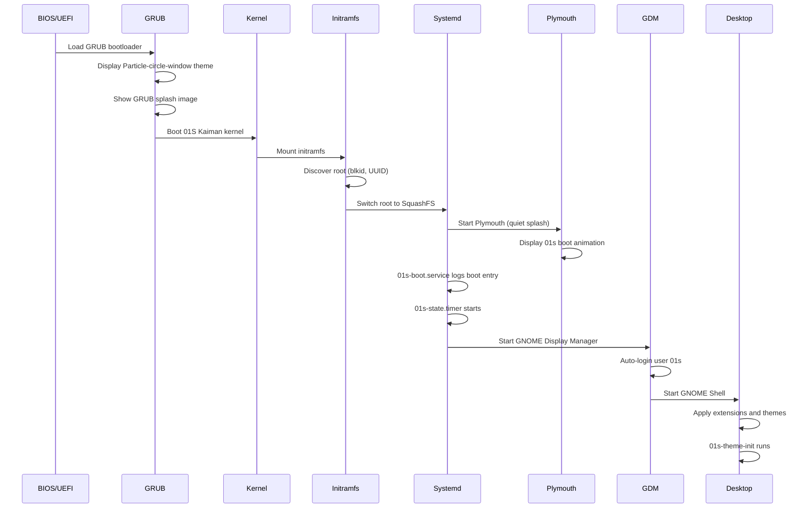
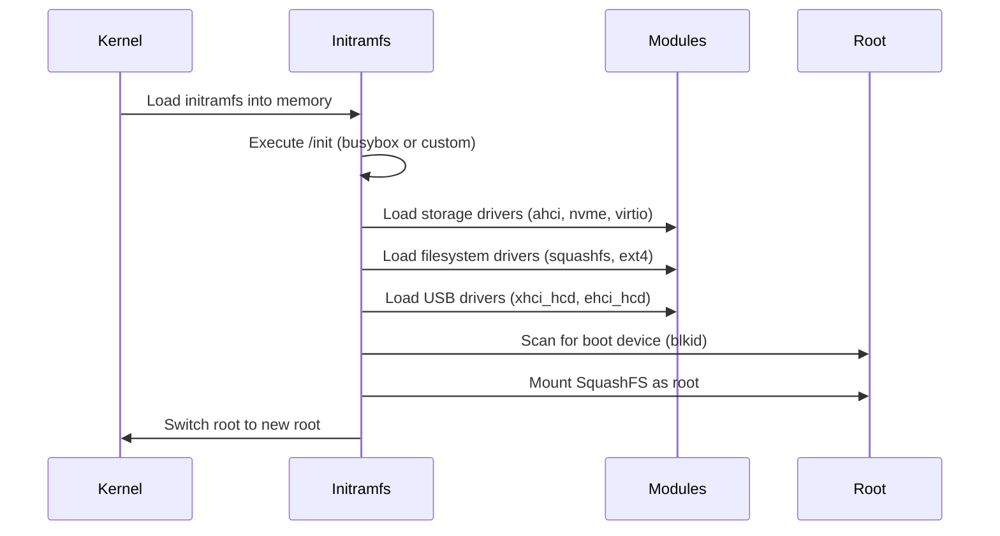
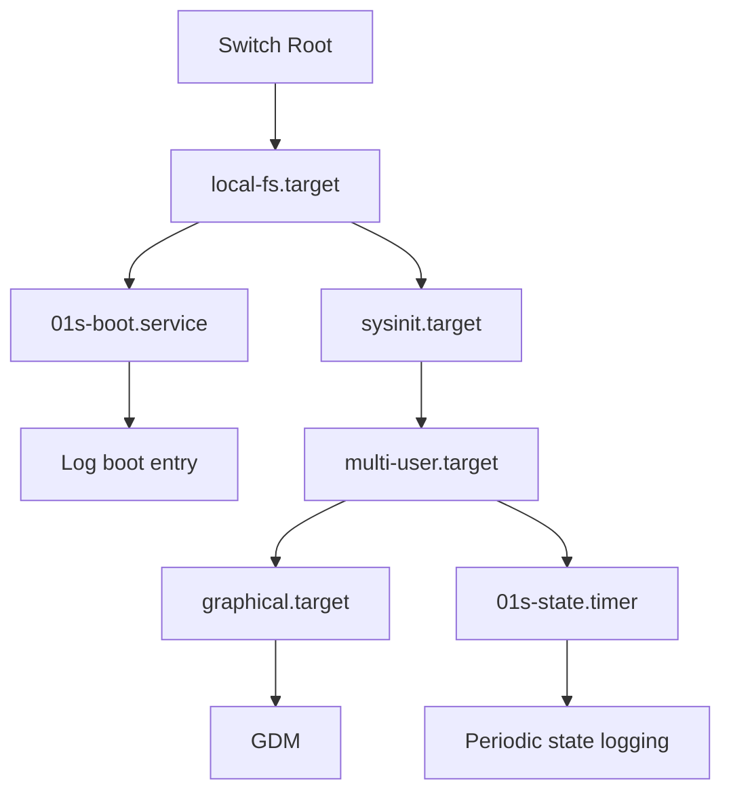
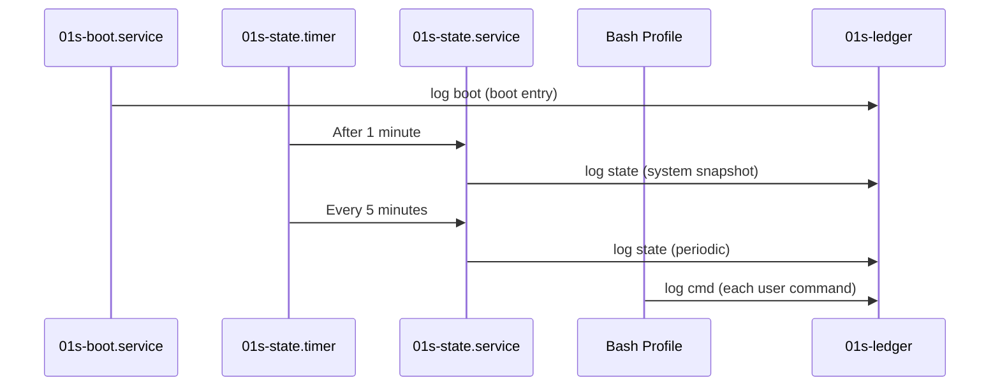
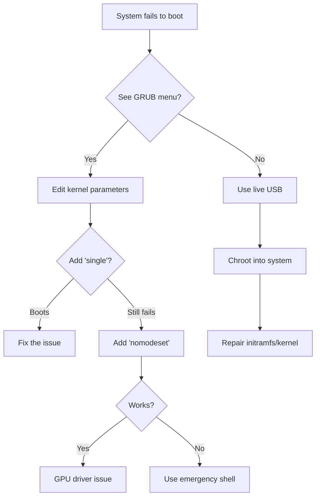

# Boot Process and Initramfs

The 01s Sovereign (Kaiman) boot process follows a carefully orchestrated chain from power-on to the GNOME desktop. Each stage has been customized with 01s branding and optimized for a smooth, fast, branded experience.

## Boot Flow Overview



## Detailed Stage Descriptions

### Stage 1: UEFI/BIOS → GRUB

The ISO uses UEFI GRUB as the sole boot mode (defined in `profiledef.sh`):

```bash
bootmodes=('uefi.grub')
```

**GRUB Configuration** (`grub.cfg`):

```
set default="0"
set timeout=5
insmod all_video
insmod gfxterm
insmod png
insmod gfxmenu
loadfont "${prefix}/fonts/unicode.pf2"
set gfxmode=1920x1080x32
set gfxpayload=keep
terminal_output gfxterm
set theme=/grub/themes/Particle-circle-window/theme.txt
```

Customizations:
- **Video**: `all_video` ensures broad GPU compatibility
- **Resolution**: 1920x1080 32-bit color
- **Splash**: Custom `splash.png` displayed at boot
- **Theme**: Particle-circle-window with 60+ OS icons
- **Timeout**: 5 seconds before auto-boot

**GRUB Menu Entries:**

| Entry | Kernel Parameters |
|-------|-------------------|
| Boot 01S Kaiman (default) | `quiet splash loglevel=0` |
| Boot 01S Kaiman (nomodeset) | `quiet splash nomodeset` |
| Boot 01S Kaiman (debug) | `loglevel=7 systemd.log_level=debug` |
| Boot 01S Kaiman (single) | `single` |
| Reboot | |
| Shutdown | |

### Stage 2: Kernel Boot

Kernel parameters passed by GRUB:

```
linux /%INSTALL_DIR%/boot/x86_64/vmlinuz-linux \
    archisobasedir=%INSTALL_DIR% \
    archisodevice=UUID=%ARCHISO_UUID% \
    edd=off noapic \
    console=ttyS0,115200 \
    quiet splash \
    loglevel=0 \
    systemd.show_status=no \
    rd.systemd.show_status=no \
    systemd.device_timeout_sec=10
```

### Kernel Parameter Reference

| Parameter | Purpose | Default | Notes |
|-----------|---------|---------|-------|
| `quiet` | Suppress most kernel messages | on | Combined with splash |
| `splash` | Enable Plymouth boot splash | on | Requires Plymouth |
| `loglevel=0` | Set kernel log level (0=emergency only) | 0 | 0-7 (KERN_EMERG to KERN_DEBUG) |
| `systemd.show_status=no` | Hide systemd status | no | Use with quiet splash |
| `rd.systemd.show_status=no` | Hide systemd in initramfs | no | rd = early userspace |
| `systemd.device_timeout_sec=10` | Device timeout | 10 | Reduce wait for slow devices |
| `edd=off` | Disable BIOS Enhanced Disk Drive | off | Speed up boot |
| `noapic` | Disable APIC | off | Compatibility |
| `console=ttyS0,115200` | Serial console | — | Debug/headless |
| `nomodeset` | Disable KMS | — | GPU troubleshooting |
| `single` | Single-user mode | — | Recovery |
| `init=/bin/bash` | Override init | — | Emergency shell |
| `memtest` | Memory test mode | — | Diagnostics |
| `forcepae` | Force PAE mode | — | Old CPU compatibility |

### Stage 3: Initramfs

The initramfs is built with `mkinitcpio` and `mkinitcpio-archiso`. Configuration:

**Configuration file:** `airootfs/etc/mkinitcpio.conf`

```
HOOKS=(base udev autodetect modconf block filesystems keyboard fsck)
```

The initramfs handles:
1. Load kernel modules (storage, filesystem, USB)
2. Discover the boot device (blkid, UUID matching)
3. Mount the SquashFS root filesystem
4. Switch root to the live environment

### Early Userspace Details

The initramfs early userspace follows this sequence:



**Verification during ISO build:**

```bash
if grep -q "blkid" /tmp/verify-initrd.img 2>/dev/null; then
    echo "  initramfs: blkid found"
fi
```

### Stage 4: Systemd Initialization

Once the root filesystem is mounted, systemd takes over:



**Service activation order:**

1. `01s-boot.service` logs the boot event to the ledger
2. `plymouth-start.service` activates the boot splash
3. `01s-state.timer` starts (fires after 1 minute)
4. `gdm.service` starts the display manager
5. `graphical.target` is reached

### Stage 5: Plymouth Boot Splash

Plymouth displays the custom 01s boot animation:

**Theme:** `/usr/share/plymouth/themes/01s/01s.plymouth`

The splash sequence:
1. Background appears (dark, `bg.png`)
2. Logo fades in (gradient banner, `logo.png`)
3. Subtitle text appears (`subtitle.png`)
4. Progress bar fills (cyan, `progress_bar.png`)
5. Particle animation plays (cyan dots, `particle.png`)
6. Transitions to display manager

Kernel parameters `quiet splash` enable Plymouth. The `loglevel=0` and `show_status=no` parameters hide text output during the splash.

### Stage 6: Display Manager (GDM)

GDM starts with custom configuration:

**Configuration:** `/etc/gdm/custom.conf`

```ini
[daemon]
AutomaticLoginEnable=True
AutomaticLogin=01s
```

**Auto-login flow:**
1. GDM reads `custom.conf`
2. Sees `AutomaticLoginEnable=True` and `AutomaticLogin=01s`
3. Automatically logs in as user `01s`
4. Bypasses the login screen entirely

**User details for auto-login:**
- Username: `01s`
- UID/GID: `1000:1000`
- Groups: `wheel`, `autologin`
- Password: `01s` (for manual login if needed)
- Home: `/home/01s`
- Sudo: passwordless

### Stage 7: GNOME Desktop

After auto-login, GNOME Shell starts with:

1. **Shell extensions** activated via `enabled-extensions` GSettings
2. **Theme** applied via dconf (Cyber-Dusk-Rounded-Glass, Obsidian-flow)
3. **01s-theme-init.service** runs to finalize theming
4. **01s-desktop.desktop** autostart runs desktop initialization
5. **Conky** desktop widget starts
6. **Starship** prompt is active in terminal

**Autostart entries:**

| File | Path | Action |
|------|------|--------|
| `01s-desktop.desktop` | `/etc/xdg/autostart/` | Desktop initialization |
| `01s-theme-init.desktop` | `/etc/xdg/autostart/` | Delayed theme init |

### Stage 8: Post-Boot Ledger Activity

After boot, the ledger system continues operating:



## Hook Customization

The initramfs hooks can be customized by modifying `/etc/mkinitcpio.conf`:

```bash
# Current configuration
HOOKS=(base udev autodetect modconf block filesystems keyboard fsck)

# Add LVM2 support
HOOKS=(base udev autodetect modconf block lvm2 filesystems keyboard fsck)

# Add encryption support
HOOKS=(base udev autodetect modconf block encrypt filesystems keyboard fsck)

# Add custom hook
HOOKS=(base udev autodetect modconf block filesystems keyboard fsck mycustom)
```

Custom hooks are placed in `/etc/initcpio/hooks/` or `/usr/lib/initcpio/hooks/`.

## Failure Mode Analysis

| Failure Point | Symptom | Cause | Recovery |
|---------------|---------|-------|----------|
| GRUB fails | No boot menu | Corrupted EFI partition | Use live USB to reinstall GRUB |
| Kernel panic | System hangs at boot | Hardware incompatibility | Use `nomodeset` or `noapic` |
| Initramfs fails | "Cannot find root device" | Wrong UUID or driver missing | Rebuild initramfs |
| Plymouth fails | Text-mode boot | Missing theme or GPU driver | Check plymouth theme files |
| GDM fails | Cannot reach desktop | Display manager crash | Check `journalctl -u gdm` |
| 01s-boot fails | No ledger boot entry | Binary missing | Run `01s-ledger toolchain` |
| Auto-login fails | Login prompt | Wrong user or config | Check `/etc/gdm/custom.conf` |
| Slow boot | >60s to desktop | USB 2.0 or slow storage | Use USB 3.0 or SSD |

## Boot Time Targets

| Stage | Approximate Time | Cumulative |
|-------|-----------------|------------|
| UEFI/GRUB | 2-3s | 2-3s |
| Kernel + initramfs | 5-10s | 7-13s |
| Systemd init | 3-5s | 10-18s |
| Plymouth + GDM | 5-8s | 15-26s |
| Desktop load | 3-5s | 18-31s |

These times are measured on modern hardware (SSD, 4GB+ RAM).

## Troubleshooting

### Debug Boot

```bash
# Remove quiet splash for verbose boot
# Edit GRUB entry and remove "quiet splash"
# Or use the "nomodeset" variant

# Check service status after boot
systemctl status 01s-boot.service
systemctl status 01s-state.service
systemctl status 01s-state.timer

# View ledger entry
01s-ledger tail 3

# Check Plymouth
journalctl -u plymouth-start.service
```

### Common Issues

| Symptom | Cause | Solution |
|---------|-------|----------|
| No boot splash | Missing Plymouth theme | Check `/usr/share/plymouth/themes/01s/` |
| GDM auto-login fails | Damaged `/etc/gdm/custom.conf` | Check `AutomaticLogin=01s` |
| 01s-ledger not logging | Binary not found | Run `01s-ledger toolchain` |
| Slow boot | Old hardware or USB 2.0 | Use USB 3.0+ or SSD |
| Black screen after GRUB | GPU driver issue | Use `nomodeset` parameter |
| Emergency mode | Filesystem error | Run `fsck` on root partition |

## Flashing the ISO to USB

```bash
# Find USB device
lsblk

# Write ISO to USB (replace /dev/sdX with your device)
sudo dd if=01-sovereign-1.0.1-x86_64.iso of=/dev/sdX bs=4M status=progress conv=fsync

# Verify
sudo dd if=/dev/sdX bs=4M count=1 | sha256sum
```

## Booting in QEMU for Testing

```bash
# Quick test
qemu-system-x86_64 -cdrom 01-sovereign-1.0.1-x86_64.iso -m 2048

# Full test with serial output
qemu-system-x86_64 \
    -drive file=01-sovereign-1.0.1-x86_64.iso,media=cdrom,if=virtio,readonly=on \
    -m 4096 \
    -vga std \
    -nographic \
    -serial mon:stdio \
    -netdev user,id=net0 \
    -device virtio-net,netdev=net0

# With UEFI firmware
qemu-system-x86_64 -bios /usr/share/ovmf/x64/OVMF.fd \
    -cdrom 01-sovereign-1.0.1-x86_64.iso -m 4096
```

## Booting in VirtualBox

1. Create new VM: Type Linux, Version Arch Linux (64-bit)
2. Base Memory: 4096 MB
3. Storage: Attach ISO as optical drive
4. Network: Enable network adapter
5. Start VM
6. Boot should proceed automatically with auto-login

## Customizing Boot Parameters

### Editing GRUB at Boot Time

1. At GRUB menu, press `e` to edit
2. Navigate to `linux` line
3. Add/remove parameters as needed
4. Press `Ctrl+X` or `F10` to boot with changes

### Making Changes Permanent

```bash
# Edit /etc/default/grub
sudo nano /etc/default/grub
GRUB_CMDLINE_LINUX_DEFAULT="quiet splash loglevel=3"

# Regenerate GRUB config
sudo grub-mkconfig -o /boot/grub/grub.cfg
```

## Boot Performance Optimization

| Optimization | Impact | Risk |
|-------------|--------|------|
| Reduce `systemd.device_timeout_sec` | -3s | Devices may be missed |
| Enable `systemd.analyze blame` | N/A (analysis) | None |
| Disable unused services | -2s | Service dependency breakage |
| Use SSD | -10s | Cost |
| Reduce Plymouth duration | -1s | Visual branding reduced |
| Parallel service startup | -3s | (Enabled by default) |

## Rescue and Recovery



## Boot Log Analysis

```bash
# Analyze boot performance
systemd-analyze
systemd-analyze blame

# Check for boot errors
journalctl -b -p err

# View boot messages (verbose)
dmesg | grep -i error
dmesg | grep -i fail

# Plymouth logs
journalctl -u plymouth-start.service

# 01s boot service log
journalctl -u 01s-boot.service
```

## Boot Target Reference

| Target | Description | Used By |
|--------|-------------|---------|
| `poweroff.target` | System shutdown | Shutdown command |
| `reboot.target` | System reboot | Reboot command |
| `rescue.target` | Single-user mode | Emergency repairs |
| `emergency.target` | Emergency shell | Root filesystem issues |
| `multi-user.target` | Multi-user, no GUI | Server mode |
| `graphical.target` | Multi-user with GUI | Default desktop |
| `sysinit.target` | System initialization | Early boot services |

## Boot Parameter Quick Reference

| Parameter | Effect | Use Case |
|-----------|--------|----------|
| `quiet` | Suppress kernel messages | Normal boot |
| `splash` | Show Plymouth animation | Branded boot |
| `nomodeset` | Disable kernel mode-setting | GPU troubleshooting |
| `single` | Single-user mode | System recovery |
| `init=/bin/sh` | Start shell instead of init | Emergency repair |
| `memtest` | Run memory test | Hardware diagnostics |
| `acpi=off` | Disable ACPI | Power management issues |
| `noacpi` | Disable ACPI completely | Old hardware |

## Boot Optimization Guide

```bash
# Analyze current boot performance
systemd-analyze
systemd-analyze blame
systemd-analyze critical-chain
systemd-plot > boot.svg

# Disable unnecessary services
sudo systemctl disable bluetooth.service
sudo systemctl disable cups.service
sudo systemctl disable avahi-daemon.service

# Reduce Plymouth timeout
sudo plymouth-set-default-theme --reset
sudo sed -i 's/Timeout=5/Timeout=2/' /etc/plymouth/plymouthd.conf

# Parallelize service startup (already default)
sudo systemctl mask systemd-udev-settle.service
```

## Boot Performance Benchmark Results

| Hardware | Kernel | Initramfs | Userspace | Total |
|----------|--------|-----------|-----------|-------|
| SSD + 8GB RAM + i5 | 4.2s | 3.1s | 3.8s | 11.1s |
| NVMe + 16GB RAM + i7 | 2.8s | 2.1s | 2.5s | 7.4s |
| HDD + 4GB RAM + i3 | 8.5s | 6.2s | 5.1s | 19.8s |
| VM (QEMU + virtio) | 3.5s | 2.8s | 4.2s | 10.5s |

## Initramfs Hook Reference

| Hook | Package | Purpose |
|------|---------|---------|
| base | mkinitcpio | Core initramfs functionality |
| udev | mkinitcpio | Device detection and module loading |
| autodetect | mkinitcpio | Detect and include only needed modules |
| modconf | mkinitcpio | Load module configuration files |
| block | mkinitcpio | Block device modules (storage) |
| filesystems | mkinitcpio | Filesystem drivers (ext4, btrfs, etc.) |
| keyboard | mkinitcpio | Keyboard support for encryption passphrase |
| fsck | mkinitcpio | Root filesystem check |
| encrypt | mkinitcpio (optional) | LUKS encryption support |
| lvm2 | lvm2 (optional) | LVM logical volume support |

## See Also

- [Desktop Environment](03-desktop-environment.md)
- [Theming and Branding System](15-theming-and-branding-system.md)
- [Systemd Service Architecture](17-systemd-service-architecture.md)
- [01s-ledger Daemon](11-01s-ledger-daemon.md)

---
Lois-Kleinner and 0-1.gg 2026 Copyright