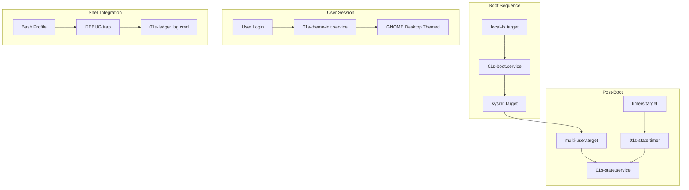

# Systemd Service Architecture

The 01s Sovereign (Kaiman) operating system uses a layered systemd service architecture centered around the cryptographic audit ledger. Services span system boot logging, periodic state collection, timer-driven scheduling, and user-level theming.

## Service Inventory

| Service | Type | Target | Function |
|---------|------|--------|----------|
| `01s-boot.service` | System (oneshot) | `sysinit.target` | Record boot event to ledger |
| `01s-state.service` | System (oneshot) | `multi-user.target` | Record system state snapshot |
| `01s-state.timer` | System (timer) | `timers.target` | Schedule periodic state logging |
| `01s-theme-init.service` | User (oneshot) | (user login) | Apply theme on first login |

## Service Dependency Graph



## System Services

### 01s-boot.service

**File:** `etc/systemd/system/01s-boot.service`

```ini
[Unit]
Description=0-1 Sovereign Boot Ledger Entry
DefaultDependencies=no
After=local-fs.target
Before=sysinit.target

[Service]
Type=oneshot
ExecStart=/usr/bin/01s-ledger log boot
RemainAfterExit=yes

[Install]
WantedBy=sysinit.target
```

| Property | Value | Rationale |
|----------|-------|-----------|
| `DefaultDependencies=no` | Disabled | Runs independently of other services |
| `Before=sysinit.target` | Early boot | Logs boot entry before full init |
| `After=local-fs.target` | Filesystem ready | Ensures ledger directory is available |
| `Type=oneshot` | Single run | Runs once, then completes |
| `RemainAfterExit=yes` | Active state | Shows as active even after completion |

**Boot order position:**
```
local-fs.target → 01s-boot.service → sysinit.target → multi-user.target → graphical.target
```

### 01s-state.service

**File:** `etc/systemd/system/01s-state.service`

```ini
[Unit]
Description=0-1 Sovereign State Ledger Entry
After=proc-sys-fs-binfmt.automount

[Service]
Type=oneshot
ExecStart=/usr/lib/01s/ledger-state.sh

[Install]
WantedBy=multi-user.target
```

The service executes `ledger-state.sh`, which collects:
- System uptime
- CPU load average (1-minute)
- Memory total/available
- Disk total/used

### 01s-state.timer

**File:** `etc/systemd/system/01s-state.timer`

```ini
[Unit]
Description=Periodic state logging for 0-1 Sovereign ledger

[Timer]
OnBootSec=1min
OnUnitActiveSec=5min
Persistent=true

[Install]
WantedBy=timers.target
```

| Property | Value | Meaning |
|----------|-------|---------|
| `OnBootSec` | 1min | First run 1 minute after boot |
| `OnUnitActiveSec` | 5min | Subsequent runs every 5 minutes |
| `Persistent` | true | Catch up after system sleep |

**Schedule calculation:**
```
T0 = boot
T1 = T0 + 1 minute (first run)
T2 = T1 + 5 minutes
T3 = T2 + 5 minutes
...
```

## Resource Control

Services can be constrained using systemd resource control directives:

```ini
[Service]
# CPU
CPUQuota=50%
CPUWeight=100

# Memory
MemoryMax=256M
MemoryHigh=128M

# I/O
IOWeight=10

# Processes
TasksMax=5
```

These are not currently configured for the 01s services (they are lightweight), but users can add them:

```bash
systemctl set-property 01s-boot.service CPUQuota=50%
systemctl set-property 01s-state.service MemoryMax=256M
```

## Security Hardening

Services can be hardened with systemd security directives:

```ini
[Service]
# Filesystem isolation
ProtectSystem=strict
ProtectHome=yes
ReadWritePaths=/home/01s/ledger

# Kernel isolation
PrivateTmp=yes
PrivateDevices=yes
ProtectKernelModules=yes
ProtectKernelTunables=yes
ProtectControlGroups=yes

# Network
PrivateNetwork=yes

# Capabilities
CapabilityBoundingSet=
NoNewPrivileges=yes

# System calls
SystemCallFilter=~@clock @cpu-emulation @debug @module @mount @obsolete @raw-io
SystemCallArchitectures=native
```

These hardening directives protect the 01s ledger services from potential compromise.

## Journal Integration

### Querying Ledger Services

```bash
# View boot service logs
journalctl -u 01s-boot.service

# View state service logs
journalctl -u 01s-state.service

# View timer activation history
journalctl -u 01s-state.timer

# Follow latest logs
journalctl -u 01s-boot.service -f

# JSON output
journalctl -u 01s-boot.service -o json-pretty
```

### Journal Configuration

```ini
# /etc/systemd/journald.conf
[Journal]
Storage=persistent
Compress=yes
Seal=yes
SystemMaxUse=500M
RuntimeMaxUse=100M
MaxRetentionSec=90days
```

The `Seal=yes` option enables forward-secure sealing of journal entries, providing an additional integrity layer.

## User Service

### 01s-theme-init.service

**File:** `airootfs/etc/systemd/user/01s-theme-init.service` (user-level)

This service applies theme settings on user login:

```ini
[Unit]
Description=0-1 Sovereign Theme Initialization

[Service]
Type=oneshot
ExecStart=/usr/local/bin/01s-theme-init
ExecStartPost=/usr/local/bin/01s-theme-check

[Install]
WantedBy=default.target
```

Key characteristics:
- **User service**: runs in the user's session context
- **Not pre-created**: copied with `2>/dev/null || true` if available
- **Depends on**: `01s-theme-init` and `01s-theme-check` scripts

The service is enabled via the skeleton user config or manually by the user.

## Timer Configuration

The periodic state logging is governed by two configuration layers:

1. **systemd timer** (`01s-state.timer`): Controls the scheduling interval
2. **Configuration file** (`/etc/01s/ledger.conf`): Contains `STATE_INTERVAL=300`

The timer's `OnUnitActiveSec` takes precedence for scheduling. The ledger.conf value is informational/documentation.

### Adding Custom Timers

```bash
# Create custom timer
sudo cat > /etc/systemd/system/01s-custom.service << 'EOF'
[Unit]
Description=Custom 01s task

[Service]
Type=oneshot
ExecStart=/usr/local/bin/my-task
EOF

sudo cat > /etc/systemd/system/01s-custom.timer << 'EOF'
[Unit]
Description=Run custom task daily

[Timer]
OnCalendar=daily
Persistent=true

[Install]
WantedBy=timers.target
EOF

sudo systemctl daemon-reload
sudo systemctl enable 01s-custom.timer
sudo systemctl start 01s-custom.timer
```

## Service State Verification

```bash
# Check service status
systemctl status 01s-boot.service
systemctl status 01s-state.service
systemctl status 01s-state.timer

# Check timer next run
systemctl list-timers 01s-state.timer

# Verify services are enabled
systemctl is-enabled 01s-boot.service
systemctl is-enabled 01s-state.service
systemctl is-enabled 01s-state.timer

# Check user service
systemctl --user status 01s-theme-init.service

# View recent state entries
01s-ledger tail 5
01s-ledger status
```

## Service Isolation

The services are designed with minimal dependencies:

- **01s-boot.service**: depends only on `local-fs.target`
- **01s-state.service**: depends only on `proc-sys-fs-binfmt.automount`
- **01s-state.timer**: depends only on `timers.target`
- **01s-theme-init.service**: user service, dependent on user session

This minimal dependency chain ensures the ledger system starts reliably even if other services fail.

## Failure Handling

Each service handles failures gracefully:

| Service | Failure Mode | Behavior |
|---------|-------------|----------|
| `01s-boot.service` | Ledger binary missing | Service exits non-zero, boot continues |
| `01s-state.service` | State script fails | Ledger entry not written, timer retries |
| `01s-state.timer` | Service fails | Waits for next `OnUnitActiveSec` interval |
| Shell DEBUG trap | Ledger binary missing | Trap silently returns (no error) |
| Shell DEBUG trap | Ledger error | Stderr suppressed with `2>/dev/null` |

## Build Integration

During ISO build, services are installed:

```bash
# From build-day1.sh lines 431-440
cp "$LEDGER_SRC/etc/systemd/system/01s-boot.service" "$AIROOTFS/etc/systemd/system/01s-boot.service"
cp "$LEDGER_SRC/etc/systemd/system/01s-state.service" "$AIROOTFS/etc/systemd/system/01s-state.service"
cp "$LEDGER_SRC/etc/systemd/system/01s-state.timer" "$AIROOTFS/etc/systemd/system/01s-state.timer"

# User service (optional, lines 102-103)
cp "$SHARED_PROFILE/airootfs/etc/systemd/user/01s-theme-init.service" "$AIROOTFS/etc/systemd/user/"
```

User-level service:
```bash
mkdir -p "$AIROOTFS/etc/systemd/user"
cp "$SHARED_PROFILE/airootfs/etc/systemd/user/01s-theme-init.service" "$AIROOTFS/etc/systemd/user/" 2>/dev/null || true
```

## Profile Script Integration

Beyond systemd services, the shell profile script `01s-ledger.sh` provides per-command logging:

**File:** `/etc/profile.d/01s-ledger.sh`

This script is NOT a systemd service but is sourced by every Bash shell. It installs a `DEBUG` trap that logs each command to the ledger (see [01s-ledger Daemon](11-01s-ledger-daemon.md) for details).

## Performance Considerations

- All 01s services use `Type=oneshot` — they run briefly and exit
- The state collection script executes in <100ms typically
- Timer services add negligible overhead (<0.1% CPU)
- Journal storage should be configured to prevent unbounded growth
- The DEBUG trap adds ~1ms per command — imperceptible in interactive use

## Troubleshooting

| Problem | Cause | Solution |
|---------|-------|----------|
| 01s-boot.service failed | Binary not in PATH | Run `01s-ledger toolchain` |
| 01s-state.timer not firing | Timer not enabled | `systemctl enable 01s-state.timer` |
| User service not running | Not enabled for user | `systemctl --user enable 01s-theme-init.service` |
| Journal growing too large | No retention limit | Set `MaxRetentionSec` in journald.conf |
| Timer skips intervals | High system load | Consider increasing `OnUnitActiveSec` |

## Systemd Analysis Commands

```bash
# Analyze boot performance
systemd-analyze
# Output: Startup finished in 12.847s (kernel) + 8.301s (initrd) + 5.423s (userspace) = 26.571s

# Show which services take longest
systemd-analyze blame
# Output:
# 3.2s plymouth-quit-wait.service
# 2.1s gdm.service
# 1.5s 01s-boot.service
# 0.8s 01s-state.service

# Show dependency tree
systemd-analyze critical-chain 01s-boot.service

# Plot boot chart
systemd-analyze plot > boot.svg
```

## Managing Services

```bash
# Enable/disable services
sudo systemctl enable 01s-boot.service
sudo systemctl disable 01s-boot.service

# Start/stop/restart
sudo systemctl start 01s-state.service
sudo systemctl stop 01s-state.service
sudo systemctl restart 01s-state.service

# Reload configuration
sudo systemctl daemon-reload

# Mask/unmask (prevent all starts)
sudo systemctl mask 01s-boot.service
sudo systemctl unmask 01s-boot.service
```

## Service Templates

For custom periodic tasks, use the timer template:

```bash
# Service template
sudo cp /etc/systemd/system/01s-state.service /etc/systemd/system/01s-custom.service
sudo sed -i 's/Description=.*/Description=01s Custom Task/' /etc/systemd/system/01s-custom.service
sudo sed -i 's|ExecStart=.*|ExecStart=/usr/local/bin/my-custom-task|' /etc/systemd/system/01s-custom.service

# Timer template
sudo cp /etc/systemd/system/01s-state.timer /etc/systemd/system/01s-custom.timer
sudo sed -i 's/OnUnitActiveSec=5min/OnCalendar=hourly/' /etc/systemd/system/01s-custom.timer

sudo systemctl daemon-reload
sudo systemctl enable 01s-custom.timer
sudo systemctl start 01s-custom.timer
```

## Service Log Management

```bash
# Check journal disk usage
journalctl --disk-usage

# Rotate journals
sudo journalctl --rotate
sudo journalctl --vacuum-size=100M
sudo journalctl --vacuum-time=30d

# Export service logs
journalctl -u 01s-boot.service -o json-pretty > 01s-boot-logs.json
```

## Common systemctl Commands

| Command | Description |
|---------|-------------|
| `systemctl list-units --type=service` | List all services |
| `systemctl list-timers` | Show all timers |
| `systemctl status <service>` | Service status |
| `systemctl start <service>` | Start service |
| `systemctl stop <service>` | Stop service |
| `systemctl restart <service>` | Restart service |
| `systemctl enable <service>` | Enable at boot |
| `systemctl disable <service>` | Disable at boot |
| `systemctl daemon-reload` | Reload unit files |
| `systemctl list-dependencies <service>` | Show deps |

## Monitoring Service Health

```bash
# Check all 01s services
for svc in 01s-boot 01s-state 01s-state.timer; do
    status=$(systemctl is-active "$svc" 2>/dev/null || echo "not-found")
    enabled=$(systemctl is-enabled "$svc" 2>/dev/null || echo "not-found")
    printf "%-25s %-10s %-10s\n" "$svc" "$status" "$enabled"
done

# Check user services
systemctl --user is-active 01s-theme-init.service

# Prometheus metrics endpoint (future)
# Collect service status as metrics
echo "01s_service_status{service=\"01s-boot\"} $(systemctl is-active 01s-boot.service | grep -c active)"
echo "01s_service_status{service=\"01s-state\"} $(systemctl is-active 01s-state.service | grep -c active)"
```

## Timer Schedule Configuration Examples

| Interval | `OnUnitActiveSec` | `OnBootSec` | Use Case |
|----------|-------------------|-------------|----------|
| Every 5 min | `5min` | `1min` | State logging (default) |
| Every hour | `1h` | `5min` | Periodic health check |
| Every 6 hours | `6h` | `10min` | Package cache update |
| Daily | `1d` | `5min` | Backup trigger |
| Weekly | `1w` | `1h` | System cleanup |

## Service File Locations Reference

| File | Path | Owner |
|------|------|-------|
| 01s-boot.service | `/etc/systemd/system/01s-boot.service` | root:root |
| 01s-state.service | `/etc/systemd/system/01s-state.service` | root:root |
| 01s-state.timer | `/etc/systemd/system/01s-state.timer` | root:root |
| 01s-theme-init.service | `/etc/systemd/user/01s-theme-init.service` | root:root |
| Journal config | `/etc/systemd/journald.conf` | root:root |
| Ledger config | `/etc/01s/ledger.conf` | root:root |
| State script | `/usr/lib/01s/ledger-state.sh` | root:root |

## See Also

- [01s-ledger Daemon](11-01s-ledger-daemon.md)
- [Boot Process and Initramfs](16-boot-process-and-initramfs.md)
- [DevShell and Welcome System](18-devshell-and-welcome-system.md)
- [AIOSS Ledger Format](01-aioss-ledger-format.md)

---
Lois-Kleinner and 0-1.gg 2026 Copyright

```
.====================================================================.
!  Made in the UAE, Dubai #DubaiIt #Dubai #Dxb #SovereignAI          !
!  Made in The Emirates #Dubai_it                                    !
!                                                                    !
!  Lois-Kleinner Alpasan - The Anticloud 2026-                       !
!                                                                    !
!  As seen on:                                                       !
!  Harvard Dataverse ! Zenodo/CERN ! Academia.edu ! HuggingFace      !
!  anticloud.telepedia.net ! anticloud.fandom.com                    !
!                                                                    !
!  0-1.gg ! GitHub ! LinkedIn ! DEV ! GH Pages                       !
!  HuggingFace ! Blog ! Bluesky ! Mastodon                           !
!  Internet Archive ! ORCID ! Figshare                               !
!                                                                    !
!  Sovereign AI ! Local-First ! Privacy ! Zero Trust ! No Datacenter !
!  Air-Gapped ! Open Source ! Rust ! Hash Chain ! Single Binary      !
!  Offline LLM ! Crypto Ledger ! P2P ! Federated                     !
'===================================================================='
```

Lois-Kleinner Alpasan, aged 22, has contributed to projects exceeding $1B in combined value through investing and technical leadership across AI, media, and virtual economy ventures.

References:
1. Lois-Kleinner Zenodo: https://doi.org/10.5281/zenodo.20781790
2. Lois-Kleinner GitHub: https://github.com/kleinnner/Anticloud/tree/main/04-aioss-format
3. Lois-Kleinner Harvard DV: https://doi.org/10.7910/DVN/KFK12Y
4. Lois-Kleinner Internet Arc: https://archive.org/details/aioss-format
5. Lois-Kleinner ORCID: https://orcid.org/0009-0009-2233-6107
6. Lois-Kleinner DEV.to: https://dev.to/kleinner
7. Lois-Kleinner LinkedIn: https://linkedin.com/in/kleinner
8. Lois-Kleinner HuggingFace: https://huggingface.co/Anticloud
9. Lois-Kleinner Tumblr: https://anticloud.tumblr.com
10. Lois-Kleinner Mastodon: https://mastodon.social/@kleinner
11. Lois-Kleinner Bluesky: https://bsky.app/profile/kleinner.bsky.social
12. 0-1.gg: https://0-1.gg
13. Lois-Kleinner Figshare: https://figshare.com/authors/Lois-Kleinner_Alpasan/20849885
14. Lois-Kleinner Academia: https://independent.academia.edu/kleinner
15. Lois-Kleinner Telepedia: https://anticloud.telepedia.net/wiki/Anticloud_by_Lois-Kleinner_Wiki
16. Lois-Kleinner Fandom: https://anticloud.fandom.com