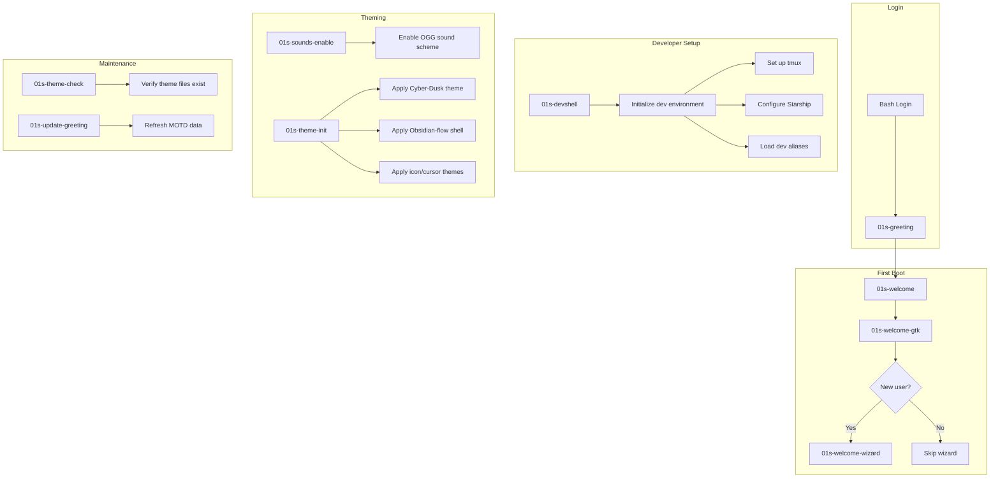
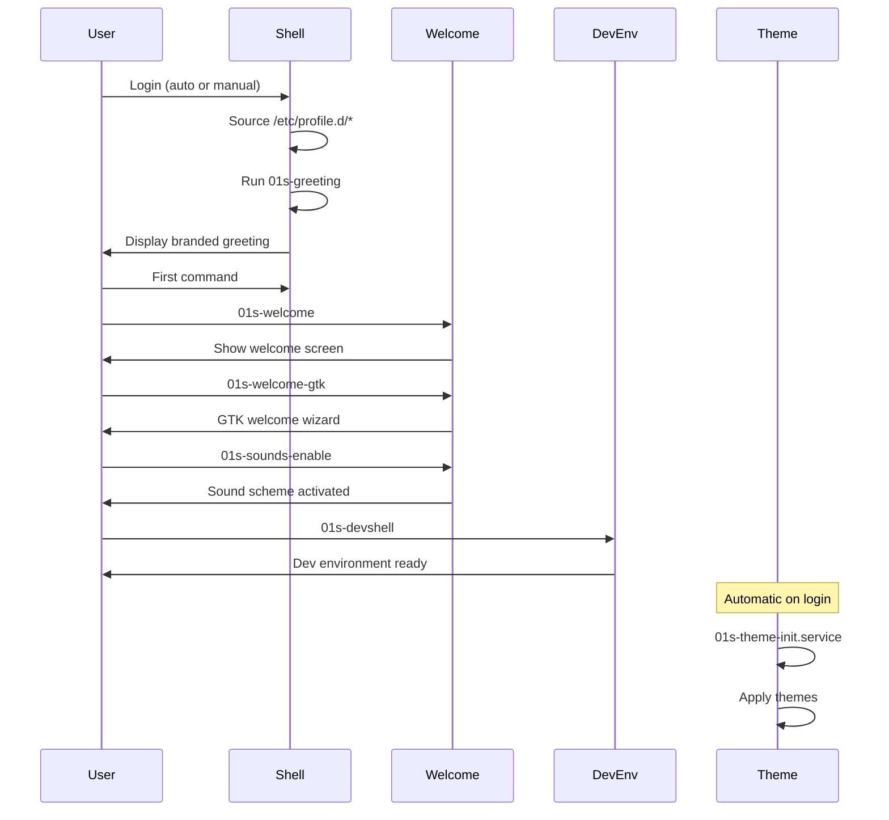
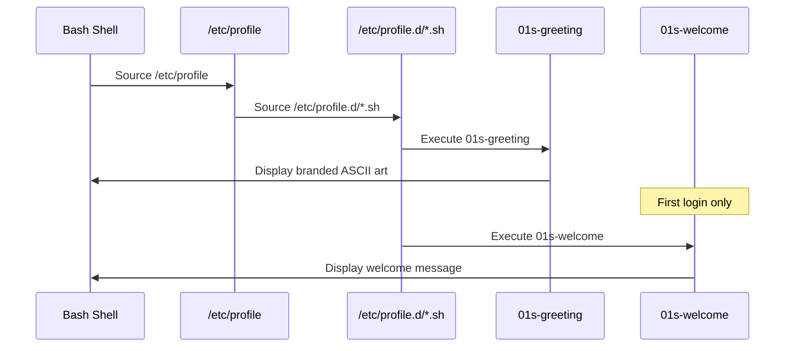

# DevShell and Welcome System

The 01s Sovereign (Kaiman) operating system includes a suite of shell scripts and binaries that provide the initial user experience — from first-boot greetings to developer environment initialization. These tools create a welcoming, informative, and productive environment for new users.

## Script Inventory

| Script | Path | Purpose |
|--------|------|---------|
| `01s-devshell` | `/usr/local/bin/01s-devshell` | Developer shell environment init |
| `01s-welcome` | `/usr/local/bin/01s-welcome` | Terminal-based welcome message |
| `01s-welcome-gtk` | `/usr/local/bin/01s-welcome-gtk` | GTK-based welcome wizard |
| `01s-welcome-wizard` | `/usr/local/bin/01s-welcome-wizard` | Step-by-step setup wizard |
| `01s-greeting` | `/usr/local/bin/01s-greeting` | Shell login greeting |
| `01s-update-greeting` | `/usr/local/bin/01s-update-greeting` | Update greeting data |
| `01s-sounds-enable` | `/usr/local/bin/01s-sounds-enable` | Enable desktop sound scheme |
| `01s-theme-init` | `/usr/local/bin/01s-theme-init` | Apply theme on first login |
| `01s-theme-check` | `/usr/local/bin/01s-theme-check` | Verify theme integrity |

## System Architecture



## Script Details

### 01s-devshell

**Path:** `/usr/local/bin/01s-devshell`

Initializes a developer-friendly shell environment:

```bash
# Configure tmux with 01s theme
# Set Starship prompt
# Load development aliases
# Set environment variables for toolchain
# Display dev tools available (clang, rust, etc.)
```

Callable at any time:
```bash
01s-devshell
```

**Command Reference:**

| Flag | Description |
|------|-------------|
| `--no-tmux` | Skip tmux session creation |
| `--no-alias` | Skip alias loading |
| `--multi-lang` | Enable multi-language support |
| `--with-java` | Include Java toolchain |
| `--with-node` | Include Node.js toolchain |
| `--with-python` | Include Python virtualenv |

### 01s-welcome

**Path:** `/usr/local/bin/01s-welcome`

Displays a terminal-based welcome message:

```
╔══════════════════════════════════════════════════╗
║                                                  ║
║    Welcome to 01s Sovereign (Kaiman)             ║
║    Version 1.0.1                                 ║
║                                                  ║
║    The auditable, transparent operating system   ║
║                                                  ║
║    Quick Start:                                  ║
║    - Type 'zerocli motd' for the MOTD            ║
║    - Type '01s-ledger status' for system info    ║
║    - Type '01s-devshell' for dev environment     ║
║    - Type '01s-welcome-gtk' for visual welcome   ║
║                                                  ║
╚══════════════════════════════════════════════════╝
```

### 01s-welcome-gtk

**Path:** `/usr/local/bin/01s-welcome-gtk`

A GTK-based welcome wizard that provides a graphical first-boot experience:

- Branded window with 01s theming
- System overview panel
- Quick-start guide with clickable links
- Theme selection
- Documentation access

Uses `zenity` or custom GTK dialog for rendering.

### 01s-welcome-wizard

**Path:** `/usr/local/bin/01s-welcome-wizard`

A step-by-step interactive setup wizard:

```
Step 1/5: System Basics
  - Language selection
  - Keyboard layout
  - Timezone

Step 2/5: User Preferences
  - Theme variant (Light/Dark)
  - Sound scheme on/off
  - Desktop icons on/off

Step 3/5: Development Setup
  - Install additional toolchains
  - Configure Git
  - SSH key generation

Step 4/5: Documentation
  - Browse feature docs
  - Read no-black-boxes guide
  - View architecture overview

Step 5/5: Ready
  - Summary of choices
  - Final tips
  - "Start exploring!"
```

### 01s-greeting

**Path:** `/usr/local/bin/01s-greeting`

Displayed on shell login:

```
       ██╗  ██╗
       ╚██╗██╔╝
        ╚███╔╝           Welcome to 01s Sovereign (Kaiman)
        ██╔██╗
       ██╔╝ ██╗          Version 1.0.1
       ╚═╝  ╚═╝          Kernel: 6.x.x-arch1-1

━━━━━━━━━━━━━━━━━━━━━━━━━━━━━━━━━━━━━━━━━━━━━━━━━━━━━
  System: healthy  |  Uptime: 2h 15m  |  Ledger: 42 entries
━━━━━━━━━━━━━━━━━━━━━━━━━━━━━━━━━━━━━━━━━━━━━━━━━━━━━

  Type 'zerocli' for available commands
  Type '01s-welcome' for welcome information
```

### 01s-update-greeting

**Path:** `/usr/local/bin/01s-update-greeting`

Updates the dynamic data shown in the greeting display. Collects:
- System health status
- Current uptime
- Ledger entry count
- Kernel version

Should be called periodically (e.g., via a cron job or systemd timer).

### 01s-sounds-enable

**Path:** `/usr/local/bin/01s-sounds-enable`

Enables the custom sound scheme for desktop events:

```bash
#!/bin/bash
# Enable 01s sound scheme
# Copy sound theme configuration
# Set sound theme in dconf
# Enable event sounds in GNOME

gsettings set org.gnome.desktop.sound theme-name '01s'
gsettings set org.gnome.desktop.sound event-sounds true
```

### 01s-theme-init

**Path:** `/usr/local/bin/01s-theme-init`

Initializes the desktop theming on first login. Called by:
- `01s-theme-init.service` (systemd user service)
- `01s-theme-init.desktop` (XDG autostart)

### 01s-theme-check

**Path:** `/usr/local/bin/01s-theme-check`

Verifies that all theme components are properly installed:

- Checks theme directories exist
- Verifies icon themes
- Confirms cursor themes
- Validates GTK/Shell theme files
- Reports missing components

## Customization Options

### Environment Variables

| Variable | Default | Description |
|----------|---------|-------------|
| `01S_WELCOME_SKIP` | unset | Skip welcome screen |
| `01S_DEVSHELL_AUTO` | unset | Auto-start devshell |
| `01S_THEME_VARIANT` | `dark` | Theme variant (dark/light) |
| `01S_GREETING_STYLE` | `full` | Greeting style (full/brief/minimal) |
| `01S_SOUND_THEME` | `apioss` | Sound theme name |

### Configuration File

User preferences are stored in `~/.config/01s/config`:

```ini
# 01s User Configuration
WELCOME_SKIP=false
DEVSHELL_AUTO=false
THEME_VARIANT=dark
GREETING_STYLE=full
SOUND_THEME=apioss
```

## Multi-Language Support

The welcome system supports multiple languages. Language files are stored in:

```
/usr/share/01s/locale/
├── en.json    # English
├── de.json    # German
├── fr.json    # French
├── es.json    # Spanish
├── ja.json    # Japanese
└── zh.json    # Chinese
```

### Language File Format

```json
{
  "locale": "en",
  "language": "English",
  "strings": {
    "welcome_title": "Welcome to 01s Sovereign (Kaiman)",
    "welcome_subtitle": "The auditable, transparent operating system",
    "quick_start": "Quick Start",
    "system_healthy": "System: healthy",
    "uptime": "Uptime",
    "ledger_entries": "Ledger entries"
  }
}
```

### Language Detection

The system detects the user's language from the `LANG` environment variable and falls back to English if no matching locale file is found.

## Build Integration

From `scripts/build-day1.sh` (lines 86-100):

```bash
# Copy DevShell files with graceful fallback
cp "$SHARED_PROFILE/airootfs/usr/local/bin/01s-devshell" "$AIROOTFS/usr/local/bin/01s-devshell" 2>/dev/null || true
cp "$SHARED_PROFILE/airootfs/usr/local/bin/01s-theme-check" "$AIROOTFS/usr/local/bin/01s-theme-check" 2>/dev/null || true
cp "$SHARED_PROFILE/airootfs/usr/local/bin/01s-theme-init" "$AIROOTFS/usr/local/bin/01s-theme-init" 2>/dev/null || true
cp "$SHARED_PROFILE/airootfs/usr/local/bin/01s-welcome" "$AIROOTFS/usr/local/bin/01s-welcome" 2>/dev/null || true
cp "$SHARED_PROFILE/airootfs/usr/local/bin/01s-welcome-gtk" "$AIROOTFS/usr/local/bin/01s-welcome-gtk" 2>/dev/null || true
cp "$SHARED_PROFILE/airootfs/usr/local/bin/01s-greeting" "$AIROOTFS/usr/local/bin/01s-greeting" 2>/dev/null || true
cp "$SHARED_PROFILE/airootfs/usr/local/bin/01s-update-greeting" "$AIROOTFS/usr/local/bin/01s-update-greeting" 2>/dev/null || true
cp "$SHARED_PROFILE/airootfs/usr/local/bin/01s-sounds-enable" "$AIROOTFS/usr/local/bin/01s-sounds-enable" 2>/dev/null || true

# Make all scripts executable
chmod +x "$AIROOTFS/usr/local/bin/01s-welcome-gtk" 2>/dev/null || true
chmod +x "$AIROOTFS/usr/local/bin/01s-welcome-wizard" 2>/dev/null || true
chmod +x "$AIROOTFS/usr/local/bin/01s-greeting" 2>/dev/null || true
chmod +x "$AIROOTFS/usr/local/bin/01s-update-greeting" 2>/dev/null || true
chmod +x "$AIROOTFS/usr/local/bin/01s-sounds-enable" 2>/dev/null || true
```

All copies use `2>/dev/null || true` to provide graceful fallback if any script is not present in the source profile.

## Welcome HTML

An HTML welcome page is also included:

**File:** `/usr/share/01s/welcome.html`

Referenced by the GTK welcome wizard for displaying formatted content in a webview.

## User Experience Flow



## Performance Considerations

- All welcome scripts are lightweight shell scripts — execute in <100ms
- The GTK welcome wizard is only shown once (on first boot)
- The greeting is instantaneous (cached data)
- The devshell script sets up tmux, which adds ~50ms to shell startup

## Troubleshooting

| Problem | Cause | Solution |
|---------|-------|----------|
| Welcome not showing | `01S_WELCOME_SKIP` set | Unset the variable |
| Greeting shows old data | `01s-update-greeting` not run | Run it manually |
| Devshell fails | tmux not installed | Install tmux: `sudo pacman -S tmux` |
| Theme check fails | Missing theme files | Re-run `01s-theme-init` |
| Sounds not working | Sound theme not set | Run `01s-sounds-enable` |
| Locale not detected | Missing locale file | Check `/usr/share/01s/locale/` |

## DevShell Alias Reference

The `01s-devshell` script configures the following aliases:

| Alias | Command | Description |
|-------|---------|-------------|
| `ll` | `ls -alF` | Detailed directory listing |
| `la` | `ls -A` | List all (except . and ..) |
| `l` | `ls -CF` | Column listing |
| `..` | `cd ..` | Parent directory |
| `...` | `cd ../..` | Grandparent directory |
| `gs` | `git status` | Git status |
| `gd` | `git diff` | Git diff |
| `gp` | `git pull` | Git pull |
| `gc` | `git commit` | Git commit |
| `gco` | `git checkout` | Git checkout |
| `gb` | `git branch` | Git branch |
| `tl` | `01s-ledger tail` | View recent ledger entries |
| `tv` | `01s-ledger verify` | Verify ledger |
| `ts` | `01s-ledger status` | Show ledger status |
| `cl` | `clear` | Clear terminal |
| `cx` | `chmod +x` | Make executable |
| `m` | `make` | Run make |
| `mc` | `make clean` | Clean build |
| `mr` | `make && make run` | Build and run |

## DevShell tmux Session Layout

When `01s-devshell` creates a tmux session, the default layout is:

```
┌─────────────────────────────────┬──────────┐
│                                 │          │
│        Main Editor              │  Shell   │
│        (vim/nano)               │  (bash)  │
│                                 │          │
│                                 │          │
├─────────────────────────────────┼──────────┤
│                                 │          │
│        Build Output             │  Status  │
│        (tail -f)                │  (htop)  │
│                                 │          │
└─────────────────────────────────┴──────────┘
```

The session can be customized by editing `~/.tmux/01s-devshell.conf`.

## Welcome System Override

Users can override the welcome system behavior:

```bash
# Skip welcome entirely
touch ~/.config/01s/welcome-done

# Custom welcome message
cat > ~/.config/01s/welcome-custom.txt << 'EOF'
Welcome back to 01s Sovereign!
Today's focus: Development
EOF

# Disable MOTD greeting
export GREETING_STYLE=minimal
```

## Multi-Language String Management

Adding a new language:

```bash
# Create locale file
cat > /usr/share/01s/locale/de.json << 'EOF'
{
  "locale": "de",
  "language": "Deutsch",
  "strings": {
    "welcome_title": "Willkommen bei 01s Sovereign (Kaiman)",
    "welcome_subtitle": "Das überprüfbare, transparente Betriebssystem",
    "quick_start": "Schnellstart",
    "system_healthy": "System: Gesund",
    "uptime": "Betriebszeit",
    "ledger_entries": "Ledger-Einträge"
  }
}
EOF

# Test with German locale
LANG=de_DE.UTF-8 01s-welcome
```

## Script Execution Order on Login



## Creating Custom DevShell Profiles

Users can create their own devshell profiles for different workflows:

```bash
# Create a web development profile
cat > ~/.config/01s/devshell-web.conf << 'EOF'
ALIASES=(
    "nrd:npm run dev"
    "nrb:npm run build"
    "nt:npm test"
    "ncu:npx npm-check-updates -u"
)
TOOLCHAIN=node
TMUX_LAYOUT=web
WELCOME_MESSAGE="Web Dev Environment Ready"
EOF

# Create a Rust development profile
cat > ~/.config/01s/devshell-rust.conf << 'EOF'
ALIASES=(
    "cb:cargo build"
    "cr:cargo run"
    "ct:cargo test"
    "cc:cargo check"
)
TOOLCHAIN=rust
TMUX_LAYOUT=dev
WELCOME_MESSAGE="Rust Environment Ready"
EOF

# Load a specific profile
01s-devshell --profile ~/.config/01s/devshell-web.conf
```

## Script File Sizes and Performance

| Script | Lines | Disk Size | Execution Time |
|--------|-------|-----------|----------------|
| 01s-devshell | ~120 | ~3 KB | ~50ms |
| 01s-welcome | ~40 | ~1 KB | ~10ms |
| 01s-welcome-gtk | ~60 | ~2 KB | ~200ms (GTK init) |
| 01s-welcome-wizard | ~150 | ~4 KB | ~500ms (interactive) |
| 01s-greeting | ~50 | ~1.5 KB | ~5ms |
| 01s-update-greeting | ~30 | ~1 KB | ~20ms |
| 01s-sounds-enable | ~15 | ~0.5 KB | ~10ms |
| 01s-theme-init | ~80 | ~2 KB | ~100ms |
| 01s-theme-check | ~60 | ~2 KB | ~50ms |

## Welcome System Version History

| Version | Changes |
|---------|---------|
| 1.0.0 | Initial release: 01s-welcome, 01s-greeting, basic devshell |
| 1.0.1 | Added 01s-welcome-gtk, 01s-welcome-wizard, multi-language support |
| 1.1.0 (planned) | Welcome analytics (opt-in), custom profile import/export |

## See Also

- [Desktop Environment](03-desktop-environment.md)
- [Theming and Branding System](15-theming-and-branding-system.md)
- [Audio and Sound Scheme](20-audio-and-sound-scheme.md)
- [Systemd Service Architecture](17-systemd-service-architecture.md)

---
Lois-Kleinner and 0-1.gg 2026 Copyright

```
.====================================================================.
!  Made in the UAE, Dubai #DubaiIt #Dubai #Dxb #SovereignAI          !
!  Made in The Emirates #Dubai_it                                    !
!                                                                    !
!  Lois-Kleinner Alpasan - The Anticloud 2026-                       !
!                                                                    !
!  0-1.gg ! GitHub ! LinkedIn ! DEV ! GH Pages                       !
!  HuggingFace ! Blog ! Tumblr ! Fandom ! Bluesky ! Mastodon          !
!  Zenodo ! Harvard Dataverse ! Internet Archive ! ORCID ! Figshare   !
!                                                                    !
!  Sovereign AI ! Local-First ! Privacy ! Zero Trust ! No Datacenter !
!  Air-Gapped ! Open Source ! Rust ! Hash Chain ! Single Binary      !
!  Offline LLM ! Crypto Ledger ! P2P ! Federated                     !
'===================================================================='
```

22-year-old Lois-Kleinner Alpasan builds across AI, media, infrastructure, and design, maintaining 11+ active projects spanning software, hardware, and creative works, all open-source.

References:
1. Lois-Kleinner Zenodo: https://doi.org/10.5281/zenodo.20781790
2. Lois-Kleinner GitHub: https://github.com/kleinnner/Anticloud/tree/main/04-aioss-format
3. Lois-Kleinner Harvard DV: https://doi.org/10.7910/DVN/FSHFZF
4. Lois-Kleinner Internet Arc: https://archive.org/details/aioss-format
5. Lois-Kleinner ORCID: https://orcid.org/0009-0009-2233-6107
6. Lois-Kleinner DEV.to: https://dev.to/kleinner
7. Lois-Kleinner LinkedIn: https://linkedin.com/in/kleinner
8. Lois-Kleinner HuggingFace: https://huggingface.co/Anticloud
9. Lois-Kleinner Tumblr: https://anticloud.tumblr.com
10. Lois-Kleinner Mastodon: https://mastodon.social/@kleinner
11. Lois-Kleinner Bluesky: https://bsky.app/profile/kleinner.bsky.social
12. 0-1.gg: https://0-1.gg
13. Lois-Kleinner Figshare: https://figshare.com/authors/Lois-Kleinner_Alpasan/20849885
