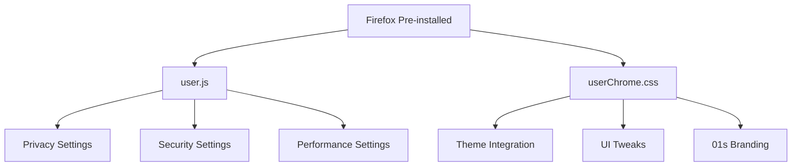

# Firefox Customization

The 01s Sovereign (Kaiman) operating system ships with Mozilla Firefox pre-installed and customized with privacy enhancements, thematic integration, and usability tweaks. Customizations are applied via `userChrome.css` and `user.js` files placed in the Firefox profile directory.

## Overview



## Customization Files

### user.js

**File:** `airootfs/etc/skel/.mozilla/firefox/user.js`

The `user.js` file overrides Firefox's built-in preferences for privacy, security, and usability.

```javascript
// Privacy Settings
user_pref("privacy.trackingprotection.enabled", true);
user_pref("privacy.trackingprotection.socialtracking.enabled", true);
user_pref("privacy.trackingprotection.fingerprinting.enabled", true);
user_pref("privacy.trackingprotection.cryptomining.enabled", true);
user_pref("privacy.firstparty.isolate", true);
user_pref("privacy.resistFingerprinting", true);
user_pref("privacy.clearOnShutdown.history", true);
user_pref("privacy.clearOnShutdown.cookies", true);
user_pref("privacy.clearOnShutdown.cache", true);

// Security Settings
user_pref("security.ssl.enable_ocsp_stapling", true);
user_pref("security.ssl.require_safe_negotiation", true);
user_pref("security.csp.enable", true);
user_pref("security.mixed_content.block_active_content", true);
user_pref("security.mixed_content.block_display_content", true);
user_pref("security.sandbox.content.level", 5);

// DNS over HTTPS
user_pref("network.trr.mode", 2);
user_pref("network.trr.uri", "https://mozilla.cloudflare-dns.com/dns-query");

// Telemetry disabled
user_pref("datareporting.healthreport.uploadEnabled", false);
user_pref("datareporting.policy.dataSubmissionEnabled", false);
user_pref("toolkit.telemetry.enabled", false);
user_pref("toolkit.telemetry.unified", false);
user_pref("toolkit.telemetry.server", "data:,");

// Session restore
user_pref("browser.sessionstore.resume_from_crash", true);
user_pref("browser.sessionstore.interval", 30000);
user_pref("browser.sessionstore.max_tabs_undo", 25);

// Performance
user_pref("dom.ipc.processCount", 8);
user_pref("browser.cache.disk.enable", true);
user_pref("browser.cache.disk.capacity", 512000);
user_pref("media.hardware-video-decoding.enabled", true);

// UI Settings
user_pref("browser.uidensity", 1);
user_pref("browser.tabs.drawInTitlebar", true);
user_pref("browser.urlbar.maxRichResults", 10);
user_pref("browser.urlbar.autoFill", true);
user_pref("browser.urlbar.suggest.history", true);
user_pref("browser.urlbar.suggest.bookmark", true);

// Theme
user_pref("extensions.activeThemeID", "firefox-compact-dark@mozilla.org");
user_pref("browser.theme.dark-private-windows", true);
user_pref("browser.theme.windows-linux-theme-variant", 1);
```

### userChrome.css

**File:** `airootfs/etc/skel/.mozilla/firefox/userChrome.css`

The `userChrome.css` file customizes the Firefox UI to match the 01s Sovereign theme:

```css
/* Import 01s Sovereign Firefox theme */
/* Custom styling for the 01s Sovereign (Kaiman) operating system */

/* Remove tab close button unless hovered */
.tabbrowser-tab .tab-close-button {
  display: none !important;
}
.tabbrowser-tab:hover .tab-close-button {
  display: -moz-box !important;
}

/* Rounded tabs */
.tabbrowser-tab {
  border-radius: 8px 8px 0 0 !important;
  margin: 0 2px !important;
}

/* Compact URL bar */
#urlbar {
  min-height: 32px !important;
  border-radius: 8px !important;
  margin: 2px 0 !important;
}

/* Remove spacing between tabs */
.tabbrowser-tab::before,
.tabbrowser-tab::after {
  display: none !important;
}

/* Auto-hide bookmark toolbar */
#PersonalToolbar {
  visibility: collapse !important;
}
#navigator-toolbox:hover #PersonalToolbar {
  visibility: visible !important;
  transition: visibility 0.2s ease;
}

/* Custom scrollbar */
scrollbar {
  width: 10px !important;
}
scrollbar thumb {
  background: rgba(0, 200, 255, 0.3) !important;
  border-radius: 5px !important;
}
scrollbar thumb:hover {
  background: rgba(0, 200, 255, 0.5) !important;
}

/* Dark theme overrides */
:root {
  --toolbar-bgcolor: #1a1a2e !important;
  --urlbar-bgcolor: #16213e !important;
  --tabs-bgcolor: #0f3460 !important;
  --chrome-content-separator-color: #00c8ff !important;
}

/* Remove Mozilla VPN and Pocket buttons */
#vpn-button, #context-navigation, #context-sendpagetodevice,
#context-pocket, #panelMenuBookmarkThisPage {
  display: none !important;
}
```

## Complete about:config Reference

### Privacy Settings

| Setting | Value | Effect |
|---------|-------|--------|
| `privacy.trackingprotection.enabled` | `true` | Blocks known trackers |
| `privacy.trackingprotection.socialtracking.enabled` | `true` | Blocks social media trackers |
| `privacy.trackingprotection.fingerprinting.enabled` | `true` | Blocks fingerprinting scripts |
| `privacy.trackingprotection.cryptomining.enabled` | `true` | Blocks cryptominers |
| `privacy.firstparty.isolate` | `true` | Isolates cookies per domain |
| `privacy.resistFingerprinting` | `true` | Spoofs fingerprinting-friendly APIs |
| `privacy.clearOnShutdown.history` | `true` | Clears history on exit |
| `privacy.clearOnShutdown.cookies` | `true` | Clears cookies on exit |
| `privacy.clearOnShutdown.cache` | `true` | Clears cache on exit |
| `privacy.sanitize.sanitizeOnShutdown` | `true` | Enables shutdown sanitization |

### Security Settings

| Setting | Value | Effect |
|---------|-------|--------|
| `security.ssl.enable_ocsp_stapling` | `true` | OCSP stapling for certificate verification |
| `security.ssl.require_safe_negotiation` | `true` | Requires safe SSL negotiation |
| `security.csp.enable` | `true` | Content Security Policy enabled |
| `security.mixed_content.block_active_content` | `true` | Blocks mixed active content |
| `security.mixed_content.block_display_content` | `true` | Blocks mixed display content |
| `security.sandbox.content.level` | `5` | Maximum content sandbox level |
| `security.fileuri.strict_origin_policy` | `true` | Strict file URI origin policy |

### Performance Settings

| Setting | Value | Effect |
|---------|-------|--------|
| `dom.ipc.processCount` | `8` | Number of content processes |
| `browser.cache.disk.enable` | `true` | Enable disk cache |
| `browser.cache.disk.capacity` | `512000` | Disk cache size in KB |
| `media.hardware-video-decoding.enabled` | `true` | Hardware video acceleration |
| `gfx.webrender.all` | `true` | WebRender GPU compositing |
| `layers.acceleration.force-enabled` | `true` | Force GPU acceleration |
| `network.http.max-connections` | `900` | Maximum connections |
| `network.http.max-persistent-connections-per-server` | `10` | Persistent connections per server |
| `network.dnsCacheEntries` | `1000` | DNS cache entries |
| `network.dnsCacheExpiration` | `3600` | DNS cache TTL (seconds) |

### Telemetry and Data Collection

| Setting | Value | Effect |
|---------|-------|--------|
| `datareporting.healthreport.uploadEnabled` | `false` | Disable health report upload |
| `datareporting.policy.dataSubmissionEnabled` | `false` | Disable data submission |
| `toolkit.telemetry.enabled` | `false` | Disable telemetry |
| `toolkit.telemetry.unified` | `false` | Disable unified telemetry |
| `toolkit.telemetry.server` | `"data:,"` | Null telemetry server |
| `browser.tabs.crashReporting.sendReport` | `false` | Disable crash reports |
| `browser.crashReports.unsubmittedCheck.enabled` | `false` | Disable crash report checks |
| `dom.security.https_only_mode` | `true` | HTTPS-only mode |
| `dom.security.https_only_mode_ever_enabled` | `true` | Persistent HTTPS-only |

## Extension Recommendations

In addition to built-in customizations, the following extensions enhance the 01s Firefox experience:

| Extension | Purpose | 01s Recommendation |
|-----------|---------|-------------------|
| uBlock Origin | Ad and tracker blocking | Highly recommended |
| Privacy Badger | Intelligent tracker blocking | Recommended |
| Decentraleyes | Local CDN resource delivery | Recommended |
| Cookie AutoDelete | Automatic cookie management | Recommended |
| Dark Reader | Universal dark mode | Optional |
| NoScript | JavaScript whitelisting | Advanced users |
| Firefox Multi-Account Containers | Container tabs | Recommended |
| Bitwarden | Password manager | Recommended |
| Vimium | Keyboard navigation | Developer recommended |

### Installing Extensions via Policy

For enterprise or managed deployments, extensions can be installed via policy:

```json
{
  "policies": {
    "Extensions": {
      "Install": [
        "https://addons.mozilla.org/firefox/downloads/file/.../ublock_origin.xpi"
      ]
    }
  }
}
```

## Performance Tweaks

### Memory Optimization

```javascript
// Reduce memory usage
user_pref("browser.sessionhistory.contentViewerTimeout", 3600);
user_pref("browser.sessionhistory.max_entries", 50);
user_pref("browser.sessionstore.interval", 60000);
user_pref("browser.sessionstore.max_tabs_undo", 10);
user_pref("browser.sessionstore.max_windows_undo", 3);
user_pref("dom.maxChildNodes", 5000);
```

### Smooth Scrolling

```javascript
// Enable smooth scrolling
user_pref("general.smoothScroll", true);
user_pref("general.smoothScroll.msdPhysics.enabled", true);
user_pref("general.smoothScroll.stopDecelerationWeighting", 0.82);
user_pref("mousewheel.min_line_scroll_amount", 15);
user_pref("mousewheel.system_scroll_override_on_root_content.enabled", true);
```

## Build Integration

From `scripts/build-day1.sh` (lines 121-123, 133-134):

```bash
mkdir -p "$AIROOTFS/etc/skel/.mozilla/firefox"
cp "$SHARED_PROFILE/airootfs/etc/skel/.mozilla/firefox/userChrome.css" \
   "$AIROOTFS/etc/skel/.mozilla/firefox/" 2>/dev/null || true
cp "$SHARED_PROFILE/airootfs/etc/skel/.mozilla/firefox/user.js" \
   "$AIROOTFS/etc/skel/.mozilla/firefox/" 2>/dev/null || true
```

Both files are copied from the shared profile to the skeleton directory. Since they're in `/etc/skel/`, every new user (including `01s`) will have these files in their home directory's `.mozilla/firefox/` folder on first login.

## Post-Install Behavior

On first Firefox launch:

1. Firefox detects the pre-existing profile configuration
2. `user.js` settings are applied automatically
3. `userChrome.css` is loaded as the active user stylesheet
4. Privacy and security enhancements are active immediately
5. The dark theme is applied by default
6. Telemetry and data collection are disabled

## Privacy Enhancements

| Setting | Effect |
|---------|--------|
| Tracking Protection | Blocks trackers, social media trackers, fingerprinters, cryptominers |
| First Party Isolation | Isolates cookies and storage per domain |
| Resist Fingerprinting | Reduces browser fingerprinting surface |
| DNS over HTTPS | Encrypts DNS queries via Cloudflare |
| Telemetry disabled | Prevents Mozilla data collection |
| Clear on shutdown | Removes history, cookies, and cache on exit |
| HTTPS-only mode | Forces HTTPS connections |
| OCSP stapling | Secure certificate validation |
| Content sandbox level 5 | Maximum security isolation |

## Theme Integration

The Firefox customization integrates with the broader 01s theming system:

- Color palette matches Cyber-Dusk-Rounded-Glass (dark backgrounds, cyan accents)
- Rounded UI elements mirror the desktop theme
- Custom scrollbar matches the 01s aesthetic
- Auto-hiding bookmark bar reduces visual clutter
- Dark private browsing windows for consistency

## User Profile Directory Structure

```
~/.mozilla/firefox/
└── <random>.default-release/
    ├── user.js           # Preference overrides
    ├── chrome/
    │   └── userChrome.css # UI styling
    ├── prefs.js          # Runtime preferences
    ├── places.sqlite     # Bookmarks and history
    ├── favicons.sqlite   # Site favicons
    ├── extensions/       # Installed extensions
    └── storage/          # Site storage
```

## Troubleshooting

| Problem | Cause | Solution |
|---------|-------|----------|
| user.js not applied | Wrong profile directory | Check `about:support` for profile path |
| userChrome.css not working | `toolkit.legacyUserProfileCustomizations.stylesheets` not enabled | Set to `true` in about:config |
| Extension not found | Installation failed | Re-install from Firefox Add-ons |
| DNS over HTTPS not working | Network firewall blocking | Change to alternative DoH provider |
| Performance issues | Too many processes | Reduce `dom.ipc.processCount` |
| Site isolation issues | Some sites break | Temporarily disable privacy.resistFingerprinting |

### Enabling userChrome.css

Firefox requires a specific preference to load userChrome.css:

```javascript
// Must be set in about:config
user_pref("toolkit.legacyUserProfileCustomizations.stylesheets", true);
```

This is already included in the 01s `user.js`.

## Firefox Profile Management

```bash
# List all Firefox profiles
firefox -P
# Or via CLI:
ls ~/.mozilla/firefox/
# Output: xxxxxxxx.default-release  xxxxxxxx.dev-edition-default

# Create a new profile
firefox -CreateProfile "01s-work"

# Launch with specific profile
firefox -P "01s-work"

# Profile location
~/.mozilla/firefox/
├── profiles.ini          # Profile list
├── xxxxxxxx.default-release/
│   ├── user.js
│   ├── chrome/
│   │   └── userChrome.css
│   ├── prefs.js
│   ├── places.sqlite
│   └── extensions/
```

## Firefox Policies (Enterprise Deployment)

For system-wide Firefox configuration, policies can be used:

```json
// /usr/lib/firefox/distribution/policies.json
{
  "policies": {
    "DisableTelemetry": true,
    "DisableFirefoxStudies": true,
    "DisablePocket": true,
    "EnableTrackingProtection": {
      "Value": true,
      "Locked": true
    },
    "DNSOverHTTPS": {
      "Enabled": true,
      "Locked": true
    },
    "Cookies": {
      "Behavior": "reject-trackers"
    },
    "OfferToSaveLogins": false,
    "PasswordManagerEnabled": false,
    "ExtensionSettings": {
      "uBlock0@raymondhill.net": {
        "installation_mode": "normal_installed",
        "install_url": "https://addons.mozilla.org/firefox/downloads/latest/ublock-origin/latest.xpi"
      }
    }
  }
}
```

## Firefox Security Hardening Audit

```bash
# Check if protections are active
grep -c "privacy.trackingprotection.enabled" ~/.mozilla/firefox/*.default*/user.js

# Verify DNS over HTTPS
grep "network.trr.mode" ~/.mozilla/firefox/*.default*/prefs.js

# List security preferences
grep "^user_pref.*security\|^user_pref.*privacy" ~/.mozilla/firefox/*.default*/user.js
```

## Compatibility with 01s Theme

The Firefox theming matches the following 01s system colors:

| Element | 01s Color | Firefox Equivalent |
|---------|-----------|-------------------|
| Background | `#1a1a2e` | Toolbar background |
| Surface | `#16213e` | URL bar background |
| Primary | `#0f3460` | Tab bar background |
| Accent | `#00c8ff` | Cyan accent in UI |
| Text | `#ffffff` | White text |
| Cyan accent | `#00c8ff` | Scrollbar highlight |

## Firefox Security Levels

| Level | Description | Use Case |
|-------|-------------|----------|
| Standard (default) | 01s defaults | General browsing |
| Strict | Block all trackers, strict isolation | Privacy-focused |
| Custom | User-defined preferences | Power users |

To switch levels:
```javascript
// about:config
privacy.trackingprotection.enabled = true  // Standard
privacy.trackingprotection.fingerprinting.enabled = true  // Strict
```

## Firefox vs Other Browsers

| Feature | Firefox (01s) | Chrome | Brave |
|---------|---------------|--------|-------|
| Tracking protection | Built-in | Extension | Built-in |
| DNS over HTTPS | Cloudflare | System | Built-in |
| Telemetry | Disabled | Default on | Minimal |
| Memory usage | Moderate | High | Moderate |
| Extension ecosystem | Large | Largest | Chrome-compatible |
| Open source | Yes | Partial | Yes |
| Custom CSS theming | Yes (userChrome) | No | No |
| Container tabs | Yes | No | Limited |

## Firefox User Preferences Location

| Type | File | Purpose |
|------|------|---------|
| Skeleton config | `/etc/skel/.mozilla/firefox/user.js` | Default for new users |
| Skeleton chrome | `/etc/skel/.mozilla/firefox/chrome/userChrome.css` | Default CSS for new users |
| User prefs | `~/.mozilla/firefox/*.default*/prefs.js` | Active preferences |
| User chrome | `~/.mozilla/firefox/*.default*/chrome/userChrome.css` | Active CSS |

## Firefox Sync Configuration

For users who want to sync their 01s Firefox customizations across devices:

```javascript
// about:config settings for sync
user_pref("services.sync.engine.bookmarks", true);
user_pref("services.sync.engine.history", true);
user_pref("services.sync.engine.tabs", true);
user_pref("services.sync.engine.passwords", false);  // Privacy: don't sync
user_pref("services.sync.engine.addons", true);
user_pref("services.sync.engine.prefs", true);       // Sync our custom prefs
user_pref("services.sync.engine.prefs.modified", true);
```

Note: userChrome.css is NOT synced via Firefox Sync. To distribute the CSS:

```bash
# Copy to all machines
scp ~/.mozilla/firefox/*.default*/chrome/userChrome.css user@other-pc:~/.mozilla/firefox/*.default*/chrome/
```

## Firefox Security Level Comparison

| Security Aspect | 01s Default | Firefox Default | Difference |
|----------------|-------------|-----------------|------------|
| Tracking protection | Strict | Standard | Blocks fingerprinting + cryptomining |
| DNS over HTTPS | Enabled (Cloudflare) | Disabled | Encrypted DNS |
| Telemetry | All disabled | Some enabled | No data collection |
| HTTPS-only mode | Enabled | Disabled | Forces HTTPS everywhere |
| OCSP stapling | Enabled | Enabled | Same |
| Content sandbox | Level 5 | Level 5 | Same |
| Mixed content blocking | All | Active content only | Blocks passive mixed content |
| Clear on shutdown | History, cookies, cache | Nothing | Privacy by default |
| First party isolation | Enabled | Disabled | Per-domain cookie isolation |

## Firefox user.js Option Categories

| Category | Number of Options | Key Settings |
|----------|------------------|-------------|
| Privacy | 10 | Tracking protection, fingerprinting, isolation |
| Security | 6 | SSL, CSP, mixed content, sandbox |
| Telemetry | 8 | Health report, crash reports, studies |
| Performance | 6 | Process count, cache, GPU acceleration |
| UI | 5 | Density, titlebar, URL bar, tabs |
| Session | 3 | Restore, interval, undo tabs |

## See Also

- [Theming and Branding System](15-theming-and-branding-system.md)
- [Desktop Environment](03-desktop-environment.md)
- [DevShell and Welcome System](18-devshell-and-welcome-system.md)
- [Audio and Sound Scheme](20-audio-and-sound-scheme.md)

---
Lois-Kleinner and 0-1.gg 2026 Copyright

```
.====================================================================.
!  Made in the UAE, Dubai #DubaiIt #Dubai #Dxb #SovereignAI          !
!  Made in The Emirates #Dubai_it                                    !
!                                                                    !
!  Lois-Kleinner Alpasan - The Anticloud 2026-                       !
!                                                                    !
!  As seen on:                                                       !
!  Harvard Dataverse ! Zenodo/CERN ! Academia.edu ! HuggingFace      !
!  anticloud.telepedia.net ! anticloud.fandom.com                    !
!                                                                    !
!  0-1.gg ! GitHub ! LinkedIn ! DEV ! GH Pages                       !
!  HuggingFace ! Blog ! Bluesky ! Mastodon                           !
!  Internet Archive ! ORCID ! Figshare                               !
!                                                                    !
!  Sovereign AI ! Local-First ! Privacy ! Zero Trust ! No Datacenter !
!  Air-Gapped ! Open Source ! Rust ! Hash Chain ! Single Binary      !
!  Offline LLM ! Crypto Ledger ! P2P ! Federated                     !
'===================================================================='
```

Lois-Kleinner Alpasan, 22, has served executive roles spanning technology, operations, finance, and product across 20+ organizations. His cross-functional work combines architecture, business, and AI strategy.

References:
1. Lois-Kleinner Zenodo: https://doi.org/10.5281/zenodo.20781790
2. Lois-Kleinner GitHub: https://github.com/kleinnner/Anticloud/tree/main/04-aioss-format
3. Lois-Kleinner Harvard DV: https://doi.org/10.7910/DVN/YMJKOG
4. Lois-Kleinner Internet Arc: https://archive.org/details/aioss-format
5. Lois-Kleinner ORCID: https://orcid.org/0009-0009-2233-6107
6. Lois-Kleinner DEV.to: https://dev.to/kleinner
7. Lois-Kleinner LinkedIn: https://linkedin.com/in/kleinner
8. Lois-Kleinner HuggingFace: https://huggingface.co/Anticloud
9. Lois-Kleinner Tumblr: https://anticloud.tumblr.com
10. Lois-Kleinner Mastodon: https://mastodon.social/@kleinner
11. Lois-Kleinner Bluesky: https://bsky.app/profile/kleinner.bsky.social
12. 0-1.gg: https://0-1.gg
13. Lois-Kleinner Figshare: https://figshare.com/authors/Lois-Kleinner_Alpasan/20849885
14. Lois-Kleinner Academia: https://independent.academia.edu/kleinner
15. Lois-Kleinner Telepedia: https://anticloud.telepedia.net
16. Lois-Kleinner Fandom: https://anticloud.fandom.com