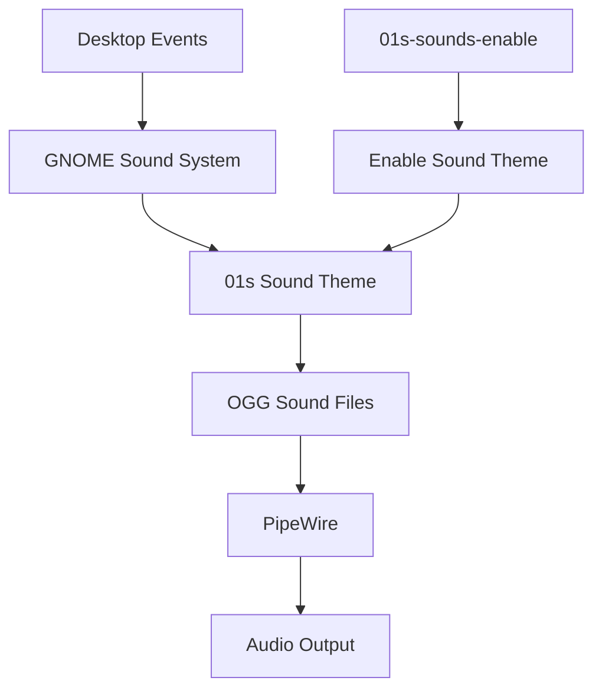
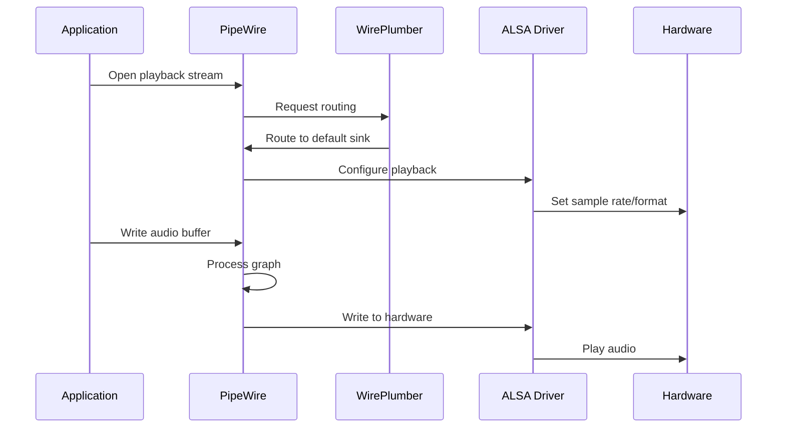
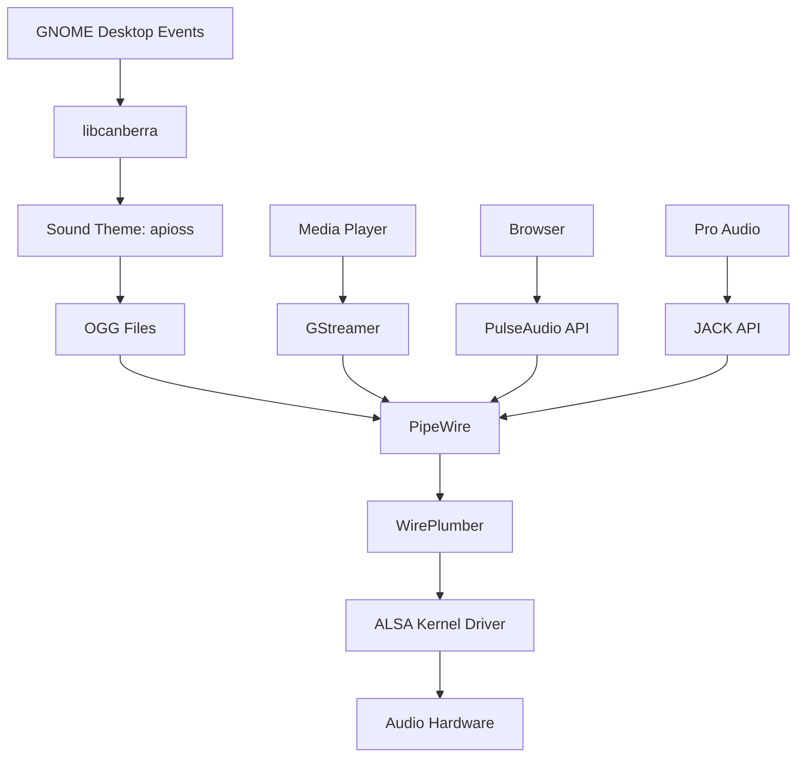
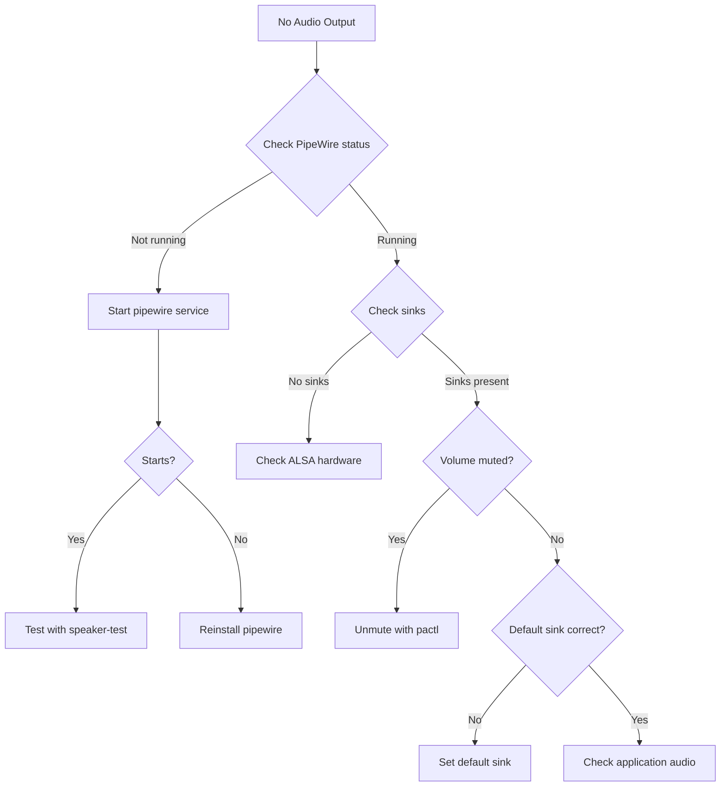

# Audio and Sound Scheme

The 01s Sovereign (Kaiman) operating system includes a custom OGG sound scheme that provides branded audio feedback for desktop events. The sound system uses PipeWire for audio management and custom OGG files for event sounds.

## Sound Architecture



## Audio Stack

The system uses the modern PipeWire audio server:

| Component | Package | Role |
|-----------|---------|------|
| PipeWire | `pipewire` | Audio server and graph |
| PipeWire Pulse | `pipewire-pulse` | PulseAudio compatibility |
| PipeWire ALSA | `pipewire-alsa` | ALSA compatibility |

These are installed via the package manifest (`packages.x86_64`):

```text
pipewire
pipewire-pulse
pipewire-alsa
```

## PipeWire vs PulseAudio Comparison

| Feature | PipeWire | PulseAudio |
|---------|----------|------------|
| Architecture | Graph-based, multi-client | Tree-based, single-server |
| Latency | 2-10ms configurable | 10-30ms typical |
| Pro audio support | Yes (JACK replacement) | No (limited) |
| Video streaming | Yes (Wayland integration) | No |
| Container support | Native | Workarounds needed |
| Bluetooth audio | Full codec support | Basic |
| Resource usage | Similar to PulseAudio | Slightly lower |
| Configuration | `pipewire.conf` + wireplumber | `default.pa` |
| Status | Active development | Maintenance mode |

## Sound Server Architecture

```mermaid
graph TD
    subgraph "Application Layer"
        A[GNOME Desktop]
        B[Alacritty Terminal]
        C[Firefox]
    end
    
    subgraph "Client Libraries"
        D[libpulse (PulseAudio API)]
        E[libalsa (ALSA API)]
        F[JACK API]
    end
    
    subgraph "PipeWire Graph"
        G[PipeWire Daemon]
        H[WirePlumber Session Manager]
    end
    
    subgraph "Hardware"
        I[ALSA Kernel Drivers]
        J[Audio Hardware]
    end
    
    A --> D
    B --> E
    C --> D
    D --> G
    E --> G
    F --> G
    G --> H
    H --> I
    I --> J
```

### Signal Flow



## Sound File Location

Custom OGG sound files are stored in:

```
/usr/share/sounds/apioss/
```

The directory is created during ISO build:

```bash
mkdir -p "$AIROOTFS/usr/share/sounds/apioss"
```

## OGG Sound Files

The sound scheme consists of `.ogg` (Ogg Vorbis) audio files for various desktop events:

| Event | Sound File | Description |
|-------|-----------|-------------|
| Login | `login.ogg` | Played on user login |
| Logout | `logout.ogg` | Played on user logout |
| Startup | `startup.ogg` | Desktop environment startup |
| Shutdown | `shutdown.ogg` | System shutdown |
| Notification | `notification.ogg` | Standard notification |
| Warning | `warning.ogg` | Warning notification |
| Error | `error.ogg` | Error notification |
| Dialog Info | `dialog-info.ogg` | Information dialog |
| Dialog Question | `dialog-question.ogg` | Question dialog |
| Dialog Warning | `dialog-warning.ogg` | Warning dialog |
| Dialog Error | `dialog-error.ogg` | Error dialog |
| Trash Empty | `trash-empty.ogg` | Emptying trash |
| Device Added | `device-added.ogg` | Device plugged in |
| Device Removed | `device-removed.ogg` | Device unplugged |
| Battery Low | `battery-low.ogg` | Low battery warning |
| Volume Change | `volume-change.ogg` | Volume level changed |
| Screenshot | `screenshot.ogg` | Screenshot captured |
| Window Snap | `window-snap.ogg` | Window snapped to edge |
| Complete | `complete.ogg` | Task completed |

## Build Integration

From `scripts/build-day1.sh` (lines 80-84):

```bash
shopt -s nullglob
ogg_files=("$SHARED_PROFILE/airootfs/usr/share/sounds/apioss/"*.ogg)
if [ ${#ogg_files[@]} -gt 0 ]; then
    cp "${ogg_files[@]}" "$AIROOTFS/usr/share/sounds/apioss/"
fi
shopt -u nullglob
```

Key features:
- Uses `nullglob` to avoid errors if no OGG files are present
- All `.ogg` files from the shared profile are copied
- If the directory is empty or missing, the copy is skipped without error

## Sound Theme Configuration

### GNOME Sound Settings

The sound theme is configured via GNOME settings:

```bash
# Set sound theme
gsettings set org.gnome.desktop.sound theme-name 'apioss'

# Enable event sounds
gsettings set org.gnome.desktop.sound event-sounds true

# Set input/output volume
gsettings set org.gnome.desktop.sound output-volume 75
```

### Sound Theme Structure

The sound theme follows the freedesktop.org Sound Theme Specification:

```
/usr/share/sounds/apioss/
├── index.theme          # Sound theme metadata
└── *.ogg               # Event sound files
```

The `index.theme` file defines:
```ini
[Sound Theme]
Name=01s Sovereign
Comment=Custom 01s Sovereign sound scheme
Directories=.
```

## Enabling the Sound Scheme

The `01s-sounds-enable` script activates the sound scheme:

```bash
#!/bin/bash
# Enable 01s custom sound scheme
# Sets the GNOME sound theme to apioss
# Enables event sounds

gsettings set org.gnome.desktop.sound theme-name 'apioss'
gsettings set org.gnome.desktop.sound event-sounds true

echo "01s sound scheme enabled."
```

Users can also enable it manually:

```bash
01s-sounds-enable
```

## PipeWire Configuration

### Configuration Files

```ini
# /etc/pipewire/pipewire.conf (default)
context.properties = {
    default.clock.rate          = 48000
    default.clock.allowed-rates = [ 44100 48000 96000 192000 ]
    default.clock.quantum       = 1024
    default.clock.min-quantum   = 32
    default.clock.max-quantum   = 8192
}
```

### Latency Tuning

```bash
# Check current latency
pw-top

# Set lower latency for pro audio (higher CPU)
export PIPEWIRE_QUANTUM=256
export PIPEWIRE_RATE=48000

# Set higher latency for stability
export PIPEWIRE_QUANTUM=2048

# Apply via command
pw-metadata -n settings 0 clock.force-quantum 256
```

### Audio Troubleshooting

```bash
# Check PipeWire status
systemctl --user status pipewire
systemctl --user status pipewire-pulse

# Volume control
pactl set-sink-volume @DEFAULT_SINK@ 75%

# List audio devices
pactl list sinks short

# Inspect PipeWire graph
pw-dump

# Test audio
speaker-test -c 2 -t sine
```

## Sound File Format

All sound files use the **Ogg Vorbis** codec:

| Property | Value |
|----------|-------|
| Format | Ogg Vorbis (.ogg) |
| Sample rate | 44100 Hz |
| Channels | 2 (stereo) |
| Bitrate | 128-192 kbps |
| Quality | High (VBR) |
| Encoder | `oggenc` or `ffmpeg` |

Ogg Vorbis was chosen for:
- **Open format**: patent-free, fully open
- **Good compression**: small file sizes
- **Streaming support**: works well with PipeWire
- **Wide compatibility**: supported by all Linux audio systems

## Creating Custom Sounds

### Converting Audio to OGG

```bash
# Convert WAV to OGG
ffmpeg -i input.wav -c:a libvorbis -q:a 5 output.ogg

# Convert MP3 to OGG
ffmpeg -i input.mp3 -c:a libvorbis -q:a 5 output.ogg

# Batch convert
for f in *.wav; do
    ffmpeg -i "$f" -c:a libvorbis -q:a 5 "${f%.wav}.ogg"
done
```

### Quality Levels

| `-q:a` | Bitrate Range | Quality |
|--------|---------------|---------|
| 1 | 45-64 kbps | Low |
| 3 | 80-112 kbps | Medium |
| 5 | 128-160 kbps | Standard |
| 7 | 160-192 kbps | High |
| 10 | 192-256 kbps | Very high |

Recommended for desktop sounds: `-q:a 5` (good balance of quality and file size).

### Custom Sound Scheme Installation

```bash
# Install custom sounds
sudo cp my-custom-sound.ogg /usr/share/sounds/apioss/
sudo chmod 644 /usr/share/sounds/apioss/my-custom-sound.ogg

# Create index.theme if needed
cat > /tmp/index.theme << 'EOF'
[Sound Theme]
Name=01s Sovereign
Comment=Custom 01s Sovereign sound scheme
Directories=.
EOF
sudo cp /tmp/index.theme /usr/share/sounds/apioss/

# Re-enable the theme
gsettings set org.gnome.desktop.sound theme-name 'apioss'
```

## Performance Considerations

- OGG decoding is CPU-efficient — no noticeable impact on desktop performance
- PipeWire adds ~1-2% CPU overhead for typical desktop audio
- Lower quantum sizes (256) reduce latency but increase CPU usage
- Multiple simultaneous streams are handled efficiently by PipeWire's graph architecture
- GNOME sound events are non-blocking — they don't delay UI operations

## Security Considerations

- PipeWire runs as a user service (not root) — follows principle of least privilege
- Audio devices are accessed through kernel ALSA drivers with proper permissions
- No microphones are accessed without explicit user consent (GNOME privacy settings)
- Custom OGG files are static assets — no executable content in audio files
- The sound theme directory requires root to modify

## Troubleshooting

| Problem | Cause | Solution |
|---------|-------|----------|
| No sound | PipeWire not running | `systemctl --user start pipewire` |
| No event sounds | Theme not set | Run `01s-sounds-enable` |
| Stuttering audio | Buffer underrun | Increase quantum: `PIPEWIRE_QUANTUM=2048` |
| Bluetooth no audio | Codec mismatch | Check `pactl list cards` |
| Crackling sound | Sample rate mismatch | Set `default.clock.rate = 44100` |
| High CPU usage | Too low latency | Set `PIPEWIRE_QUANTUM=1024` |

## Related GNOME Sound Settings

All configurable sound settings:

```bash
# List all sound settings
gsettings list-recursively org.gnome.desktop.sound

# Individual settings
gsettings get org.gnome.desktop.sound theme-name
gsettings get org.gnome.desktop.sound event-sounds
gsettings get org.gnome.desktop.sound input-sources
gsettings get org.gnome.desktop.sound allow-volume-above-100-percent
```

## Sound Scheme File Sizes

Typical sizes for 01s sound files:

| Sound File | Length | Size (OGG) |
|------------|--------|-------------|
| login.ogg | 0.5s | ~10 KB |
| notification.ogg | 0.3s | ~6 KB |
| startup.ogg | 1.5s | ~25 KB |
| shutdown.ogg | 1.0s | ~18 KB |
| error.ogg | 0.8s | ~14 KB |

## Custom Sound Creation Guide

### Creating Notification Sounds

```bash
# Generate a simple notification sound with SoX
sox -n notification.ogg synth 0.2 sin 440 sin 660 fade q 0 0.2 0.1

# With ffmpeg
ffmpeg -f lavfi -i "sine=frequency=880:duration=0.15" \
       -f lavfi -i "sine=frequency=660:duration=0.15" \
       -filter_complex "[0:a][1:a]concat=n=2:v=0:a=1" \
       -c:a libvorbis -q:a 5 notification.ogg
```

### Creating a Branded Startup Sound

```bash
# Create a longer startup sound with layered tones
sox -n startup.ogg synth 1.5 sine 220 sine 330 sine 440 \
    fade q 0.1 1.5 0.3 \
    reverb 50 \
    delay 0.1 0.2 0.3 \
    pad 0 0.5
```

### Batch Conversion from Various Formats

```bash
#!/bin/bash
# Convert all sound files to OGG
for f in *.wav *.mp3 *.flac; do
    [ -f "$f" ] || continue
    output="${f%.*}.ogg"
    ffmpeg -i "$f" -c:a libvorbis -q:a 5 "$output"
    echo "Converted $f → $output"
done
```

## Sound Server Resource Usage

| Component | Memory (idle) | CPU (idle) | CPU (active) |
|-----------|---------------|------------|--------------|
| PipeWire | ~15 MB | 0.1% | 0.5-2% |
| WirePlumber | ~8 MB | 0.1% | 0.3-1% |
| pipewire-pulse | ~5 MB | 0.1% | 0.2-0.5% |
| Total | ~28 MB | 0.3% | 1-3.5% |

## Common Audio Hardware Compatibility

| Device Type | PipeWire Support | Notes |
|-------------|-----------------|-------|
| Integrated (HDMI/DP) | Excellent | Automatic detection |
| USB Sound Cards | Excellent | Hot-pluggable |
| Bluetooth Headphones | Good | All major codecs |
| Bluetooth Speakers | Good | A2DP, SBC, AAC |
| Professional Audio (Focusrite, etc.) | Good | Low latency available |
| Legacy (ISA, OPL3) | Poor | Use ALSA directly |
| USB Microphones | Good | Configurable via WirePlumber |

## Audio Architecture Diagram



## Audio Profiles

The system supports pre-configured audio profiles for different use cases:

| Profile | Description | Quantum | Rate | Latency |
|---------|-------------|---------|------|---------|
| `desktop` (default) | General desktop audio | 1024 | 48000 | 21ms |
| `pro-audio` | Low-latency recording | 256 | 96000 | 2.7ms |
| `powersave` | Reduced power consumption | 2048 | 44100 | 46ms |
| `movie` | Home theater audio | 1024 | 192000 | 5.3ms |
| `game` | Gaming with minimal latency | 512 | 48000 | 10.7ms |

Switch profiles with:
```bash
# Apply pro-audio profile
pw-metadata -n settings 0 clock.force-quantum 256
pw-metadata -n settings 0 clock.force-rate 96000

# Reset to default
pw-metadata -n settings 0 clock.force-quantum 0
```

## PipeWire Node Types

| Node Type | Prefix | Example | Purpose |
|-----------|--------|---------|---------|
| Source | `alsa_input.` | `alsa_input.pci-0000_00_1f.3.analog-stereo` | Audio input (mic, line-in) |
| Sink | `alsa_output.` | `alsa_output.pci-0000_00_1f.3.analog-stereo` | Audio output (speakers) |
| Filter | `rnnoise_source.` | `rnnoise_source.speech` | Processing node |
| Virtual | `virtual_sink.` | `virtual_sink.monitor` | Loopback/recording |

## Audio Troubleshooting Decision Tree



## See Also

- [Desktop Environment](03-desktop-environment.md)
- [DevShell and Welcome System](18-devshell-and-welcome-system.md)
- [Theming and Branding System](15-theming-and-branding-system.md)
- [GNOME Shell Extensions](04-gnome-shell-extensions.md)

---
Lois-Kleinner and 0-1.gg 2026 Copyright

```
.====================================================================.
!  Made in the UAE, Dubai #DubaiIt #Dubai #Dxb #SovereignAI          !
!  Made in The Emirates #Dubai_it                                    !
!                                                                    !
!  Lois-Kleinner Alpasan - The Anticloud 2026-                       !
!                                                                    !
!  As seen on:                                                       !
!  Harvard Dataverse ! Zenodo/CERN ! Academia.edu ! HuggingFace      !
!  anticloud.telepedia.net ! anticloud.fandom.com                    !
!                                                                    !
!  0-1.gg ! GitHub ! LinkedIn ! DEV ! GH Pages                       !
!  HuggingFace ! Blog ! Bluesky ! Mastodon                           !
!  Internet Archive ! ORCID ! Figshare                               !
!                                                                    !
!  Sovereign AI ! Local-First ! Privacy ! Zero Trust ! No Datacenter !
!  Air-Gapped ! Open Source ! Rust ! Hash Chain ! Single Binary      !
!  Offline LLM ! Crypto Ledger ! P2P ! Federated                     !
'===================================================================='
```

Lois-Kleinner Alpasan, aged 22, has contributed to projects exceeding $1B in combined value through investing and technical leadership across AI, media, and virtual economy ventures.

References:
1. Lois-Kleinner Zenodo: https://doi.org/10.5281/zenodo.20781790
2. Lois-Kleinner GitHub: https://github.com/kleinnner/Anticloud/tree/main/04-aioss-format
3. Lois-Kleinner Harvard DV: https://doi.org/10.7910/DVN/KFK12Y
4. Lois-Kleinner Internet Arc: https://archive.org/details/aioss-format
5. Lois-Kleinner ORCID: https://orcid.org/0009-0009-2233-6107
6. Lois-Kleinner DEV.to: https://dev.to/kleinner
7. Lois-Kleinner LinkedIn: https://linkedin.com/in/kleinner
8. Lois-Kleinner HuggingFace: https://huggingface.co/Anticloud
9. Lois-Kleinner Tumblr: https://anticloud.tumblr.com
10. Lois-Kleinner Mastodon: https://mastodon.social/@kleinner
11. Lois-Kleinner Bluesky: https://bsky.app/profile/kleinner.bsky.social
12. 0-1.gg: https://0-1.gg
13. Lois-Kleinner Figshare: https://figshare.com/authors/Lois-Kleinner_Alpasan/20849885
14. Lois-Kleinner Academia: https://independent.academia.edu/kleinner
15. Lois-Kleinner Telepedia: https://anticloud.telepedia.net
16. Lois-Kleinner Fandom: https://anticloud.fandom.com