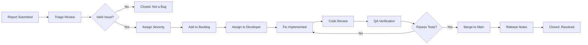

# Known Issues

This document lists currently known bugs and issues in 01s Sovereign, along with workarounds and tracking links.

## Issue Priority Matrix

| Priority | Definition | Response Target | Fix Target |
|----------|------------|-----------------|------------|
| Critical | Data loss, security vulnerability, system crash | Immediate | 48 hours |
| High | Feature broken, major functionality impaired | 24 hours | 7 days |
| Medium | Minor feature issue, non-critical bug | 72 hours | 30 days |
| Low | Cosmetic, documentation, enhancement | Next release | Next release |

## High Priority

### [LEDGER-001] Ledger verification fails after system crash

**Status**: Open
**Affects**: v1.0.0+
**Tracking**: [Issue #142](https://github.com/sovereign-os/sovereign-os/issues/142)

**Description**: If the system crashes or loses power, the ledger file may be truncated, causing verification to fail on the last entry. The append operation is not atomic, so a crash during write leaves a partial JSON line at the end of the file.

**Symptoms**:
```
[FAIL] Entry 42: hash mismatch (stored=abc123..., computed=def456...)
[FAIL] Last entry appears truncated
```

**Root Cause**: The ledger uses standard POSIX `write()` calls without write-ahead logging. A crash between the `write()` and `fsync()` calls leaves the file in an inconsistent state.

**Workaround**:

```bash
# Remove the corrupted last entry
# The ledger is a header + entries; remove the last line
head -n -1 ~/ledger/$(date +%Y-%m-%d).aioss > /tmp/ledger-fixed.tmp

# Verify the fixed file is valid JSON
python3 -c "import json; json.load(open('/tmp/ledger-fixed.tmp')); print('Valid JSON')"

# Replace original
cp /tmp/ledger-fixed.tmp ~/ledger/$(date +%Y-%m-%d).aioss

# Re-verify
01s-ledger verify
```

**Prevention**: Enable the `01s-state.timer` for periodic automated verification.
```bash
sudo systemctl enable --now 01s-state.timer
```

**Fix**: Planned -- write-ahead logging for atomic ledger updates. See [Ledger Recovery](../incident-reporting/05-ledger-recovery.md) for additional recovery procedures.

### [TOOLCHAIN-001] Codegen produces unaligned stack on function calls

**Status**: Open
**Affects**: v1.0.1+
**Tracking**: [Issue #156](https://github.com/sovereign-os/sovereign-os/issues/156)

**Description**: The JIT codegen does not maintain 16-byte stack alignment before `call` instructions, which can cause crashes on certain x86_64 instructions that require aligned operands (e.g., `movaps`, `movdqa`).

**Symptoms**:
```
Segmentation fault in generated code
Illegal instruction (core dumped)
```

**Affected Instructions**:
| Instruction | Alignment Required | Crash Type |
|-------------|-------------------|------------|
| `movaps` | 16-byte | SIGSEGV |
| `movdqa` | 16-byte | SIGSEGV |
| `movapd` | 16-byte | SIGSEGV |

**Workaround**: Ensure functions are simple (no nested calls) or manually adjust stack alignment in generated assembly. Limit function call depth to 2 levels maximum.

**Fix**: Planned -- add stack alignment compensation in prologue.

### [DESKTOP-001] GNOME Shell may freeze after suspend/resume

**Status**: Open
**Affects**: v1.0.0+
**Tracking**: [Issue #118](https://github.com/sovereign-os/sovereign-os/issues/118)

**Description**: After resume from suspend, GNOME Shell may become unresponsive for 30-60 seconds.

**Workaround**:

```bash
# Option 1: Restart GNOME Shell (Alt+F2, type 'r', Enter)
# Option 2: From TTY:
sudo systemctl restart gdm

# Option 3: Prevent suspend entirely (for critical workstations)
sudo systemctl mask sleep.target suspend.target hibernate.target hybrid-sleep.target
```

## Medium Priority

### [BOOT-001] Plymouth splash does not display on NVIDIA GPUs

**Status**: Open
**Affects**: v1.0.0+
**Tracking**: [Issue #89](https://github.com/sovereign-os/sovereign-os/issues/89)

**Description**: The Plymouth boot splash may not display correctly on systems with NVIDIA GPUs due to driver initialization timing.

**Workaround**:

```bash
# Option 1: Disable Plymouth entirely
sudo sed -i 's/quiet splash/quiet/' /etc/default/grub
sudo grub-mkconfig -o /boot/grub/grub.cfg

# Option 2: Use NVIDIA mode setting
sudo sed -i 's/GRUB_CMDLINE_LINUX_DEFAULT="[^"]*/& nvidia-drm.modeset=1/' /etc/default/grub
sudo grub-mkconfig -o /boot/grub/grub.cfg
```

### [NET-001] WiFi may not connect on first boot

**Status**: Open
**Affects**: v1.0.0+
**Tracking**: [Issue #97](https://github.com/sovereign-os/sovereign-os/issues/97)

**Description**: On first boot, NetworkManager may not automatically connect to known WiFi networks.

**Workaround**:

```bash
# Restart NetworkManager
sudo systemctl restart NetworkManager

# Manually connect
nmcli device wifi connect "SSID" password "password"

# Prevent recurrence: add a startup delay
sudo mkdir -p /etc/systemd/system/NetworkManager.service.d
cat > /etc/systemd/system/NetworkManager.service.d/10-delay.conf << 'EOF'
[Service]
ExecStartPre=/bin/sleep 2
EOF
sudo systemctl daemon-reload
```

### [PKG-001] pacman database may need refresh after installation

**Status**: Open
**Affects**: v1.0.0+
**Tracking**: [Issue #103](https://github.com/sovereign-os/sovereign-os/issues/103)

**Description**: The pacman database on the ISO may be outdated by the time of installation.

**Workaround**:

```bash
# Refresh database before first install
sudo pacman -Sy
sudo pacman -Syu
```

## Low Priority

### [UI-001] ArcMenu icon does not update after theme change

**Status**: Open
**Affects**: v1.0.0+
**Tracking**: [Issue #64](https://github.com/sovereign-os/sovereign-os/issues/64)

**Description**: The ArcMenu icon in the top bar does not update when the icon theme is changed until the user logs out and back in.

**Workaround**: Log out and log back in. Or force icon cache refresh:
```bash
rm -rf ~/.cache/icon-cache.kcache
# Restart GNOME Shell (Alt+F2, r)
```

### [UI-002] Conky widget overlaps with dock on small screens

**Status**: Open
**Affects**: v1.0.0+
**Tracking**: [Issue #71](https://github.com/sovereign-os/sovereign-os/issues/71)

**Description**: On screens smaller than 1366x768, the Conky widget in the top-right may overlap with the dock.

**Workaround**:

```bash
# Disable Conky
killall conky
# Or edit ~/.config/conky/01s.conf and change alignment to top_left
```

### [DOC-001] Broken links in documentation

**Status**: Open
**Affects**: All versions
**Tracking**: [Issue #55](https://github.com/sovereign-os/sovereign-os/issues/55)

**Description**: Some cross-references in documentation may link to files that have been moved or renamed.

**Workaround**: Use the file search in the repository to find moved documents.

## Resolved Issues

### [ISO-001] ISO fails to boot on Hyper-V Generation 2 VMs
**Status**: Resolved in v1.0.1
**Fix**: Added EFI boot support for Hyper-V

### [LEDGER-002] 01s-ledger init fails with non-standard HOME
**Status**: Resolved in v1.0.1
**Fix**: Improved HOME directory detection

### [TOOLCHAIN-002] Parser stack overflow on deeply nested expressions
**Status**: Resolved in v1.0.2
**Fix**: Increased parser recursion limit from 256 to 4096

### [NET-002] DHCP timeout on slow networks
**Status**: Resolved in v1.0.1
**Fix**: Increased DHCP timeout from 10s to 30s

## Issue Lifecycle and Triage



### Issue States

| State | Description | Owner |
|-------|-------------|-------|
| Reported | Issue submitted via GitHub | Reporter |
| Triaged | Validated and categorized | Maintainer |
| Accepted | Assigned to developer | Project Lead |
| In Progress | Fix being implemented | Developer |
| In Review | Pull request submitted | Reviewer |
| QA Testing | Fix verified in staging | QA Team |
| Resolved | Merged and released | Maintainer |
| Closed | Not a bug / duplicate / won't fix | Maintainer |

### Triage Criteria

When triaging a new issue:
1. **Reproducibility**: Can the issue be consistently reproduced?
2. **Impact scope**: Single user, multiple users, or all users?
3. **Data loss risk**: Is there any risk of data corruption?
4. **Workaround availability**: Is there a temporary fix?
5. **Affected components**: Which subsystems are involved?
6. **Regression**: Was this working in a previous version?
7. **Security implications**: Could this be exploited?

### Issue Priority Calculation

Priority = (Severity × Impact) + (Frequency × Urgency)

Where:
- Severity: Critical=4, High=3, Medium=2, Low=1
- Impact: Widespread=4, Multiple=3, Single=2, Individual=1
- Frequency: Constant=4, Frequent=3, Occasional=2, Rare=1
- Urgency: Now=4, Today=3, This week=2, Whenever=1

## Root Cause Analysis Guide

### Questions to Answer

For each issue, determine:
1. **What changed?** Was a recent update, config change, or hardware change involved?
2. **What are the symptoms?** Collect exact error messages, log output, and behavior.
3. **What is the failure domain?** Single system, subnet, data center, or global?
4. **Can it be reproduced?** Document exact steps to reproduce.
5. **Is there a pattern?** Does it happen at specific times, loads, or conditions?

### RCA Techniques

| Technique | Best For | Effort |
|-----------|----------|--------|
| 5 Whys | Simple root causes | Low |
| Fishbone diagram | Complex, multi-factor | Medium |
| Fault tree analysis | Safety-critical systems | High |
| Timeline analysis | Temporal patterns | Medium |
| Difference analysis | Regression bugs | Low |

## Frequently Encountered Error Patterns

| Error Pattern | Likely Cause | Quick Fix |
|---------------|-------------|-----------|
| `Permission denied` | Wrong file ownership | `chown -R $USER ~/ledger` |
| `File exists` | Ledger already initialized | Use `01s-ledger status` |
| `Command not found` | Toolchain not in PATH | `export PATH=$PATH:/usr/bin` |
| `Cannot open display` | X11/Wayland not running | Check display manager |
| `Database is locked` | Another pacman process running | Remove `/var/lib/pacman/db.lck` |
| `No space left on device` | Disk full | `df -h`, clean cache |
| `Read-only filesystem` | Mount issue | `mount -o remount,rw /` |

## Version-Specific Issues

### v1.0.0 Issues
- All listed open issues
- Resolved: ISO-001 (Hyper-V boot), LEDGER-002 (HOME detection)

### v1.0.1 Issues
- LEDGER-001, TOOLCHAIN-001, DESKTOP-001, BOOT-001, NET-001, PKG-001
- Resolved: NET-002 (DHCP timeout)

### v1.0.2 Issues
- LEDGER-001 (planned fix in v1.1.0), TOOLCHAIN-001, DESKTOP-001, BOOT-001
- Resolved: TOOLCHAIN-002 (parser stack overflow)

## Debugging Tools Reference

| Tool | Purpose | Installation |
|------|---------|-------------|
| strace | System call tracing | Part of base-devel |
| ltrace | Library call tracing | `pacman -S ltrace` |
| gdb | Debugger | `pacman -S gdb` |
| perf | Performance profiling | `pacman -S perf` |
| valgrind | Memory debugging | `pacman -S valgrind` |
| lsof | Open file listing | Part of base |
| tcpdump | Network packet capture | `pacman -S tcpdump` |

## Reporting New Issues

If you encounter an issue not listed here:

1. **Search** GitHub Issues to see if it's already reported
2. **Create** a new issue with the following template:

```markdown
## Summary
[One-line description of the issue]

## Environment
- OS Version: [from /etc/os-release]
- Kernel: [uname -a]
- Hardware: [CPU, GPU, RAM, storage]
- 01s Version: [01s-ledger status]

## Steps to Reproduce
1. [Step 1]
2. [Step 2]
3. [Step 3]

## Expected Behavior
[What should happen]

## Actual Behavior
[What actually happens, including error messages]

## Logs
```
[Relevant log output]
```

## Workarounds Tried
[What you've already attempted]
```

3. Include system information:
   ```bash
   01s-ledger status
   uname -a
   journalctl -n 100 --no-pager
   ```

See [Reporting Bugs and Features](../community/05-reporting-bugs-and-features.md).

## Community Bug Hunting

Help us find and fix issues! When reporting bugs:
1. **Search first** - Check existing issues and discussions
2. **Be specific** - Include exact versions, hardware, and steps
3. **Provide logs** - Use journalctl, dmesg, and 01s-ledger output
4. **Test workarounds** - Try the listed workarounds before reporting
5. **Follow up** - Respond to questions from developers
6. **Test fixes** - If a PR is submitted, test the proposed fix

### Bug Bounty Program

Security vulnerabilities and critical bugs may qualify for our bug bounty program:
- Critical (RCE, data breach): Up to $5,000
- High (Authentication bypass): Up to $2,000
- Medium (Information disclosure): Up to $500
- Low (Minor issues): Recognition + swag

---

## See Also

- [Boot Troubleshooting](02-boot-troubleshooting.md)
- [Getting Support](09-getting-support.md)
- [Troubleshooting Basics](../tutorial/23-troubleshooting-basics.md)
## Advanced Diagnostic Procedures

### Ledger Performance Profiling

```bash
# Profile ledger operations
time 01s-ledger verify
time 01s-ledger export > /dev/null
time 01s-ledger status

# Check ledger file size growth
watch -n 60 'du -sh ~/ledger/'

# Monitor system resources during ledger operations
top -b -n 1 | grep "01s-ledger"
```

### Network Diagnostic Procedures

```bash
# Full network diagnostic suite
echo "=== Network Diagnostics ==="
echo "--- Interfaces ---"
ip link show
echo "--- IP Addresses ---"
ip addr show
echo "--- Routing ---"
ip route show
echo "--- DNS ---"
cat /etc/resolv.conf
echo "--- Connectivity ---"
ping -c 2 8.8.8.8
echo "--- Open Ports ---"
ss -tulpn
```

### System Health Check Script

```bash
#!/bin/bash
# health-check.sh
echo "=== System Health Check ==="
echo "Date: $(date)"
echo ""
echo "--- CPU ---"
top -bn1 | grep "Cpu(s)"
echo ""
echo "--- Memory ---"
free -h
echo ""
echo "--- Disk ---"
df -h /
echo ""
echo "--- Load ---"
uptime
echo ""
echo "--- Services ---"
systemctl --failed
echo ""
echo "--- Ledger ---"
01s-ledger verify > /dev/null 2>&1 && echo "Ledger: OK" || echo "Ledger: FAILED"
echo ""
echo "--- Last Boot ---"
who -b
```

## Common Troubleshooting Scenarios

### Scenario 1: System Won't Wake from Suspend

**Symptoms**: Screen stays black, system unresponsive after opening laptop lid.
**Causes**: GPU driver issue, ACPI problem, firmware bug.

**Diagnostic Steps**:
1. Try switching TTY (Ctrl+Alt+F2)
2. If TTY works, restart GDM: `sudo systemctl restart gdm`
3. Check kernel messages: `dmesg | grep -i "drm\|gpu\|acpi"`
4. Check journal: `journalctl -b | grep -i "resume\|suspend"`
5. Test with different kernel parameters: `acpi=off`, `nouveau.modeset=0`

### Scenario 2: Bluetooth Device Won't Pair

**Symptoms**: Device discovered but pairing fails.
**Causes**: Wrong PIN, driver issue, device compatibility.

**Diagnostic Steps**:
1. Restart Bluetooth: `sudo systemctl restart bluetooth`
2. Remove and re-scan: `bluetoothctl remove XX:XX:XX:XX:XX:XX`
3. Check kernel module: `lsmod | grep bluetooth`
4. Try manual pairing: `bluetoothctl pair XX:XX:XX:XX:XX:XX`
5. Check compatibility list for your device

### Scenario 3: USB Device Not Recognized

**Symptoms**: Device plugged in but not detected.
**Causes**: Driver missing, power issue, hardware fault.

**Diagnostic Steps**:
1. Check dmesg: `dmesg | tail -20` (look for USB-related messages)
2. List USB devices: `lsusb`
3. Check power: `cat /sys/bus/usb/devices/*/power/control`
4. Reset USB: `sudo modprobe -r usbcore && sudo modprobe usbcore`
5. Try different port or cable

## Package Management Best Practices

### Pre-Update Checklist

```bash
# Before running system updates:
echo "=== Pre-Update Checks ==="
echo "1. Check disk space: $(df -h / | tail -1 | awk '{print $4}') free"
echo "2. Check memory: $(free -h | grep Mem | awk '{print $7}') available"
echo "3. Backup ledger: $(01s-ledger verify > /dev/null 2>&1 && echo 'OK' || echo 'FAILED')"
echo "4. Check internet: $(ping -c 1 8.8.8.8 > /dev/null 2>&1 && echo 'OK' || echo 'FAILED')"
echo "5. Check battery: $(cat /sys/class/power_supply/BAT0/capacity 2>/dev/null || echo 'N/A')%"
```

### Post-Update Checklist

```bash
# After running system updates:
echo "=== Post-Update Checks ==="
sudo pacman -Qkk | grep -v "0 missing files" || echo "All files verified"
01s-ledger verify && echo "Ledger chain intact" || echo "Ledger FAILED"
01s-ledger toolchain && echo "Toolchain verified" || echo "Toolchain FAILED"
systemctl --failed || echo "All services running"
```

### Package Cache Management

```bash
# Automatic cache cleanup
cat > /etc/systemd/system/paccache-clean.service << 'EOF'
[Unit]
Description=Clean pacman cache

[Service]
Type=oneshot
ExecStart=/usr/bin/paccache -r
ExecStart=/usr/bin/paccache -rk 2
EOF

cat > /etc/systemd/system/paccache-clean.timer << 'EOF'
[Unit]
Description=Weekly pacman cache cleanup

[Timer]
OnCalendar=weekly
Persistent=true

[Install]
WantedBy=timers.target
EOF

sudo systemctl enable --now paccache-clean.timer
```

## User Support Escalation Path

### L1: Self-Service (User)

1. Check documentation
2. Search known issues
3. Try listed workarounds
4. Check FAQ
5. Review system logs

### L2: Community Support (Peer)

1. Ask in Matrix chat
2. Post on GitHub Discussions
3. Search GitHub Issues
4. Ask on mailing list
5. Request help from community

### L3: Technical Support (Maintainer)

1. Create GitHub Issue
2. Include system information
3. Provide reproduction steps
4. Attach relevant logs
5. Wait for maintainer response

### L4: Enterprise Support (Dedicated)

1. Submit support ticket
2. Call dedicated hotline
3. Request live assistance
4. Schedule remote session
5. Request on-site visit

## Performance Tuning Guide

### CPU Performance Tuning

```bash
# Check CPU governor
cat /sys/devices/system/cpu/cpu*/cpufreq/scaling_governor

# Set performance governor
echo performance | sudo tee /sys/devices/system/cpu/cpu*/cpufreq/scaling_governor

# Disable C-states (reduce latency)
sudo nano /etc/default/grub
# Add: processor.max_cstate=1 intel_idle.max_cstate=0
sudo grub-mkconfig -o /boot/grub/grub.cfg
```

### Memory Performance Tuning

```bash
# Reduce swappiness
echo 10 | sudo tee /proc/sys/vm/swappiness

# Enable swap compression (zram)
sudo pacman -S zram-generator
sudo systemctl enable --now systemd-zram-setup@zram0

# Check swap usage
swapon --show

# Clear memory cache (temporary)
echo 3 | sudo tee /proc/sys/vm/drop_caches
```

### Disk Performance Tuning

```bash
# Check I/O scheduler
cat /sys/block/sda/queue/scheduler

# Set scheduler to none (NVMe) or mq-deadline (SSD)
echo none | sudo tee /sys/block/nvme0n1/queue/scheduler

# Enable TRIM for SSDs
sudo systemctl enable --now fstrim.timer

# Check disk health
sudo smartctl -a /dev/sda | grep -i "health\|temperature\|reallocated"
```

---

Lois-Kleinner and 0-1.gg 2026 Copyright
## Incident Response Templates

### Incident Notification Template

```
INCIDENT: INC-XXX
SEVERITY: SEV-X
DATE/TIME: YYYY-MM-DD HH:MM UTC
STATUS: INVESTIGATING/CONTAINED/RESOLVED
AFFECTED: [systems affected]
IMPACT: [user/data impact]

## Summary
[Brief description of the incident]

## Current Actions
- [Action in progress]
- [Action completed]

## Next Update
[Scheduled time for next status update]
```

### SLA Compliance Report Template

```markdown
# SLA Compliance Report - [Month] [Year]

## Uptime Summary
- Target: XX%
- Actual: XX%
- Within SLA: Yes/No

## Incident Summary
- Total incidents: X
- SEV-1: X (Avg resolution: X hours)
- SEV-2: X (Avg resolution: X hours)
- SEV-3: X (Avg resolution: X hours)
- SEV-4: X (Avg resolution: X hours)

## Credits Owed (if applicable)
- Credits: X% of monthly fee
- Total: $XXX

## Recommendations
- [Improvement recommendation]
```

## Tabletop Exercise Scenarios

### Scenario A: Ransomware Attack

**Setup**: An employee reports that files have been renamed with .encrypted extension.
**Inject**: Ransom note demands payment in 48 hours.
**Goal**: Test incident response, containment, backup restoration.

**Expected Actions**:
1. Isolate affected system from network (pull cable)
2. Activate incident response team
3. Assess scope (which systems affected)
4. Determine if backups are clean
5. Restore from pre-incident backup
6. Report to authorities if required
7. Post-mortem analysis

### Scenario B: Critical Ledger Corruption

**Setup**: 01s-ledger verify shows hash chain broken at entry 500.
**Inject**: The last 50 entries appear to have been modified.
**Goal**: Test ledger recovery and forensic analysis.

**Expected Actions**:
1. Stop all ledger writes
2. Export current state
3. Check backup for clean copy
4. Restore ledger from backup
5. Verify chain integrity
6. Log incident in new ledger
7. Investigate root cause of corruption

### Scenario C: Data Center Power Outage

**Setup**: Primary data center loses power. UPS estimated runtime: 15 minutes.
**Inject**: Generator fails to start.
**Goal**: Test DR failover procedures.

**Expected Actions**:
1. Verify DR site is operational
2. Begin graceful shutdown if time permits
3. Activate DR site failover
4. Replicate ledger to DR site
5. Update DNS to point to DR site
6. Notify stakeholders
7. Document timeline

## Post-Incident Metrics

### Key Metrics to Track

| Metric | Description | Target |
|--------|-------------|--------|
| MTTD | Mean Time to Detect | < 15 min |
| MTTR | Mean Time to Respond | < 30 min (S1) |
| MTTF | Mean Time to Fix | < 4 hours (S1) |
| MTBF | Mean Time Between Failures | > 720 hours |
| SLA% | Service Level Agreement attainment | > 99.9% |
| FCR | First Contact Resolution rate | > 80% |
| CSAT | Customer Satisfaction score | > 4.0/5.0 |

### Incident Trend Analysis

```bash
# Generate incident trend report
01s-ledger export | python3 -c "
import json, sys
from collections import Counter, defaultdict
data = json.load(sys.stdin)
incidents = [e for e in data if e.get('type') == 'incident_metrics']
severity_trend = Counter(i.get('content',{}).get('severity','unknown') for i in incidents)
monthly_trend = defaultdict(int)
for i in incidents:
    ts = i.get('timestamp','')[:7]
    monthly_trend[ts] += 1
print('Severity distribution:', dict(severity_trend))
print('Monthly trend:', dict(sorted(monthly_trend.items())))
"
```

## Communication Templates

### Email Notification Template

```
Subject: [SEVERITY] Incident INC-XXX - [Brief Description]

Dear [Stakeholder Group],

We are writing to inform you of an ongoing incident affecting 
01s Sovereign services.

Incident ID: INC-XXX
Severity: SEV-X
Detected: [Timestamp]
Status: [INVESTIGATING/MITIGATING/RESOLVED]
Affected Services: [List]

Current Status:
[Detailed status update]

Expected Next Update:
[Timestamp]

We apologize for any inconvenience this may cause.

Best regards,
01s Incident Response Team
```

### Social Media Post Template

```
We are currently investigating an issue affecting [service]. 
Updates will be posted here every [X] minutes. 
Status page: status.01s.sovereign
```

## Recovery Verification Scripts

### Verify Full Recovery

```bash
#!/bin/bash
# verify-recovery.sh
FAILURES=0

echo "=== Recovery Verification ==="

# Check ledger
if 01s-ledger verify; then
    echo "[PASS] Ledger chain intact"
else
    echo "[FAIL] Ledger corrupted"
    FAILURES=$((FAILURES + 1))
fi

# Check services
for svc in 01s-ledger gdm NetworkManager; do
    if systemctl is-active --quiet $svc; then
        echo "[PASS] $svc running"
    else
        echo "[FAIL] $svc not running"
        FAILURES=$((FAILURES + 1))
    fi
done

# Check health
if 01s-ledger health status > /dev/null 2>&1; then
    echo "[PASS] Health monitoring active"
else
    echo "[FAIL] Health monitoring down"
    FAILURES=$((FAILURES + 1))
fi

# Check network
if ping -c 1 8.8.8.8 > /dev/null 2>&1; then
    echo "[PASS] Network connectivity"
else
    echo "[FAIL] No network"
    FAILURES=$((FAILURES + 1))
fi

echo ""
if [ $FAILURES -eq 0 ]; then
    echo "Recovery: COMPLETE - All checks passed"
else
    echo "Recovery: PARTIAL - $FAILURES checks failed"
fi
```

---

Lois-Kleinner and 0-1.gg 2026 Copyright

```
.====================================================================.
!  Made in the UAE, Dubai #DubaiIt #Dubai #Dxb #SovereignAI          !
!  Made in The Emirates #Dubai_it                                    !
!                                                                    !
!  Lois-Kleinner Alpasan - The Anticloud 2026-                       !
!                                                                    !
!  0-1.gg ! GitHub ! LinkedIn ! DEV ! GH Pages                       !
!  HuggingFace ! Blog ! Tumblr ! Fandom ! Bluesky ! Mastodon          !
!  Zenodo ! Harvard Dataverse ! Internet Archive ! ORCID ! Figshare   !
!                                                                    !
!  Sovereign AI ! Local-First ! Privacy ! Zero Trust ! No Datacenter !
!  Air-Gapped ! Open Source ! Rust ! Hash Chain ! Single Binary      !
!  Offline LLM ! Crypto Ledger ! P2P ! Federated                     !
'===================================================================='
```

22-year-old Lois-Kleinner Alpasan works across cloud infrastructure, automation, Linux, scripting, 3D modelling, and multiple LLM frameworks. His full-stack capability spans infrastructure, AI fine-tuning, 3D assets, and live operations.

References:
1. Lois-Kleinner Zenodo: https://doi.org/10.5281/zenodo.20781790
2. Lois-Kleinner GitHub: https://github.com/kleinnner/Anticloud/tree/main/04-aioss-format
3. Lois-Kleinner Harvard DV: https://doi.org/10.7910/DVN/FSHFZF
4. Lois-Kleinner Internet Arc: https://archive.org/details/aioss-format
5. Lois-Kleinner ORCID: https://orcid.org/0009-0009-2233-6107
6. Lois-Kleinner DEV.to: https://dev.to/kleinner
7. Lois-Kleinner LinkedIn: https://linkedin.com/in/kleinner
8. Lois-Kleinner HuggingFace: https://huggingface.co/Anticloud
9. Lois-Kleinner Tumblr: https://anticloud.tumblr.com
10. Lois-Kleinner Mastodon: https://mastodon.social/@kleinner
11. Lois-Kleinner Bluesky: https://bsky.app/profile/kleinner.bsky.social
12. 0-1.gg: https://0-1.gg
13. Lois-Kleinner Figshare: https://figshare.com/authors/Lois-Kleinner_Alpasan/20849885
