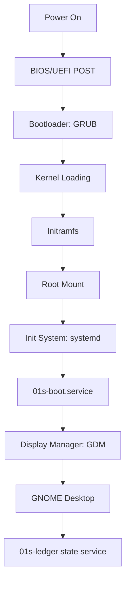
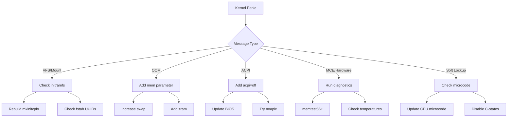
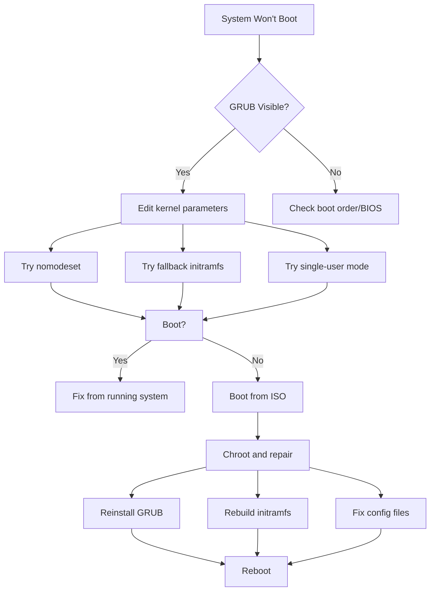

# Boot Troubleshooting

This guide covers troubleshooting boot issues with 01s Sovereign.

## Boot Process Overview



## GRUB Issues

### GRUB Menu Not Appearing

**Causes**: Fast Boot enabled, wrong boot order, Secure Boot

**Solutions**:

```bash
# Hold Shift (BIOS) or Esc (UEFI) during boot

# Disable Fast Boot in BIOS/UEFI settings

# Check boot order: USB/DVD should be first

# Disable Secure Boot temporarily

# Reinstall GRUB (from live environment)
sudo mount /dev/sda2 /mnt
sudo mount /dev/sda1 /mnt/boot/efi
sudo arch-chroot /mnt
grub-install --target=x86_64-efi --efi-directory=/boot/efi --bootloader-id=01S
grub-mkconfig -o /boot/grub/grub.cfg
exit
```

### GRUB Shows "No such device"

**Cause**: Root partition UUID changed (e.g., after filesystem resize)

**Solution**:

```bash
# Boot from live ISO
# Mount root partition
sudo mount /dev/sda2 /mnt
sudo arch-chroot /mnt

# Regenerate GRUB config
grub-mkconfig -o /boot/grub/grub.cfg

# Find correct UUID
blkid /dev/sda2

# Update /etc/default/grub if needed
# Use `findmnt /` to check current root device
```

### GRUB Rescue Prompt

If you see `grub rescue>`:

```bash
# Find the GRUB installation
ls
# Look for (hd0,msdosX) or (hd0,gptX) that contains /boot/grub

# Set root and load normal mode
set root=(hd0,gpt2)
set prefix=(hd0,gpt2)/boot/grub
insmod normal
normal

# Inside GRUB, boot the system
# Then reinstall GRUB from the running system
sudo grub-install /dev/sda
sudo grub-mkconfig -o /boot/grub/grub.cfg
```

### GRUB Configuration Reference

| Config Option | Location | Purpose |
|---------------|----------|---------|
| `GRUB_CMDLINE_LINUX_DEFAULT` | `/etc/default/grub` | Kernel boot parameters |
| `GRUB_TIMEOUT` | `/etc/default/grub` | Menu timeout in seconds |
| `GRUB_THEME` | `/etc/default/grub` | Theme path |
| `GRUB_GFXPAYLOAD_LINUX` | `/etc/default/grub` | Resolution for kernel |
| `GRUB_DISABLE_OS_PROBER` | `/etc/default/grub` | Disable other OS detection |

## Kernel Panics

### Common Panic Messages

| Message | Cause | Solution |
|---------|-------|----------|
| `VFS: Unable to mount root fs` | Missing filesystem module | Add `fsck` or `block` to mkinitcpio HOOKS |
| `Kernel panic - not syncing: Out of memory` | Insufficient RAM | Add `mem=4096M` to kernel parameters |
| `Kernel panic - not syncing: Attempted to kill init` | Init process crashed | Check root filesystem integrity |
| `ACPI: Unable to handle kernel NULL pointer` | ACPI issue | Add `acpi=off` to kernel parameters |
| `Kernel panic - not syncing: Fatal exception` | Hardware fault | Run memtest86+, check hardware |
| `BUG: soft lockup - CPU#X stuck` | CPU stall | Disable C-states, update microcode |
| `Kernel panic - not syncing: Out of memory and no killable processes` | OOM | Add `mem=4G` or increase swap |
| `do_IRQ: X.X No irq handler for vector` | MSI/INTx conflict | Add `pci=noacpi` or `acpi=noirq` |
| `MCE: CPU X: machine check error` | Hardware error | Check CPU cooling, run stress test |
| `Kernel panic - not syncing: hung_task` | I/O deadlock | Check storage subsystem |

### Kernel Panic Decision Tree



### Resolving Kernel Panics

```bash
# Boot with fallback initramfs
# In GRUB, select advanced options, then boot with fallback initramfs

# If fallback works, rebuild initramfs
sudo mkinitcpio -P

# If not, check /etc/mkinitcpio.conf for missing hooks
# Ensure 'fsck' and 'block' are in HOOKS

# Check filesystem integrity
sudo fsck /dev/sda2

# For specific kernel version
sudo mkinitcpio -p linux-zen
```

## Black Screen

### After GRUB, Before Plymouth

**Cause**: GPU driver issue, mode setting problem

**Solutions**:

```bash
# Add these kernel parameters (press 'e' in GRUB):
nomodeset
# or
i915.modeset=0  # Intel
# or
radeon.modeset=0  # AMD
# or
nouveau.modeset=0  # NVIDIA
```

### After Plymouth, During Desktop Load

**Cause**: GDM or GNOME crash

**Solutions**:

```bash
# Switch to TTY (Ctrl+Alt+F2)
# Check GDM status
systemctl status gdm

# Restart GDM
sudo systemctl restart gdm

# Check GNOME logs
journalctl -u gdm -n 50

# If Wayland fails, try X11
# In GDM, click gear icon and select "GNOME on Xorg"
```

## Initramfs Issues

### Missing initramfs

```bash
# Boot from ISO, mount system
sudo mount /dev/sda2 /mnt
sudo arch-chroot /mnt

# Rebuild initramfs
mkinitcpio -P

# Verify file exists
ls /boot/initramfs-linux.img
```

### Corrupt initramfs

```bash
# Rebuild all initramfs
sudo mkinitcpio -P

# For specific kernel
sudo mkinitcpio -p linux

# To list available presets
ls /etc/mkinitcpio.d/
```

### Debug Shell in Initramfs

```bash
# Add to kernel parameters in GRUB:
systemd.debug-shell=1

# After boot, switch to tty9 (Ctrl+Alt+F9)
# You get a root shell inside the initramfs

# From there you can:
# - Check mount points: mount | grep "new_root"
# - Check block devices: lsblk
# - Manually mount root: mount /dev/sda2 /sysroot
# - Start services: systemctl start systemd-fsck-root.service
```

## Boot Hangs

### Hangs at "Started 01s-boot.service"

**Cause**: Ledger initialization issue

**Solution**:

```bash
# Boot with systemd.debug-shell=1 to get a debug shell
# Or add systemd.unit=multi-user.target to skip GUI

# Once booted, check ledger:
systemctl status 01s-boot.service
journalctl -u 01s-boot.service

# Disable if problematic:
sudo systemctl disable 01s-boot.service
```

### Hangs at "Reached target Graphical Interface"

**Cause**: GDM or GNOME issue

**Solution**:

```bash
# Switch to TTY (Ctrl+Alt+F2)
# Check displays
systemctl status gdm
journalctl -u gdm -n 100

# Restart GDM
sudo systemctl restart gdm

# Try X11 instead of Wayland
# Edit /etc/gdm/custom.conf:
# WaylandEnable=false
```

### Hangs at "A start job is running for..."

**Cause**: A systemd service is hanging during start

**Solution**:

```bash
# Identify the hanging service
systemctl list-jobs
systemd-analyze blame | head

# Skip the hanging service
# Press Ctrl+D to skip the current job
# Or add to kernel parameters:
systemd.mask=service-name.service
```

## Boot Parameters Reference

| Parameter | Effect |
|-----------|--------|
| `nomodeset` | Disable kernel mode setting (GPU fallback) |
| `acpi=off` | Disable ACPI |
| `noapic` | Disable APIC |
| `nolapic` | Disable local APIC |
| `irqpoll` | Poll for IRQs |
| `mem=4096M` | Limit RAM to 4GB |
| `maxcpus=1` | Use single CPU core |
| `pci=noacpi` | Disable ACPI for PCI |
| `systemd.unit=multi-user.target` | Boot to terminal (no GUI) |
| `systemd.unit=emergency.target` | Boot to emergency shell |
| `systemd.debug-shell=1` | Start debug shell on tty9 |
| `3` | Boot to runlevel 3 (multi-user) |
| `single` | Single-user mode |
| `init=/bin/bash` | Direct bash shell (recovery) |
| `rootflags=subvol=@` | Btrfs subvolume for root |
| `modprobe.blacklist=nouveau` | Blacklist a kernel module |
| `console=tty0` | Force console output |
| `log_buf_len=1M` | Increase kernel log buffer |
| `panic=10` | Reboot 10 seconds after panic |
| `quiet` | Suppress kernel messages |
| `debug` | Verbose kernel debug output |

## Filesystem Check During Boot

```bash
# Force filesystem check on next boot
sudo touch /forcefsck

# Or set fsck frequency
sudo tune2fs -c 30 /dev/sda2  # Check every 30 mounts

# Check current fsck settings
sudo tune2fs -l /dev/sda2 | grep -i "mount count\|check interval"
```

## Recovery Boot Flow



## Boot Logs

Always check these logs when troubleshooting boot issues:

```bash
# Full boot log
journalctl -b

# Boot timeline
systemd-analyze

# Failed services
systemctl --failed

# Kernel messages
dmesg | grep -i error
dmesg | grep -i fail

# Last few boot messages
dmesg | tail -30

# Previous boot logs (if system crashed)
journalctl -b -1

# Boot chart (requires bootchart)
systemd-analyze plot > boot.svg
```

## Pre-Boot Checklist

Before attempting recovery, verify these basics:

| Check | Command | Expected Result |
|-------|---------|----------------|
| Power supply | Visual | LEDs on, fans spinning |
| Monitor connection | Visual | Cable secure, correct input |
| Boot device order | BIOS menu | USB/DVD first for install media |
| Secure Boot | BIOS menu | Disabled for testing |
| Fast Boot | BIOS menu | Disabled |
| Legacy/UEFI mode | BIOS menu | Match your installation type |
| RAM seating | Physical | All sticks fully inserted |
| Disk cables | Physical | SATA/NVMe connections secure |

## Boot Failure Log Table

| Log Message | Likely Cause | Recovery Step |
|-------------|--------------|---------------|
| `Failed to mount /boot` | Partition not found | Check fstab, UUIDs |
| `Timed out waiting for device` | Disk not ready | Add `rootdelay=10` |
| `ACPI Error: No handler for EC` | ACPI table issue | `acpi=off` or BIOS update |
| `pci 0000:00:00.0: can't find...` | PCI enumeration | `pci=noacpi` |
| `DMAR: DRHD: handling fault...` | IOMMU issue | `intel_iommu=off` or `amd_iommu=off` |
| `Couldn't get size: 0x800...` | Disk I/O error | Check disk health, SATA cable |
| `Failed to start Load Kernel Modules` | Missing module | Rebuild initramfs |
| `Failed to start Remount Root and Kernel...` | Filesystem error | Run fsck from live ISO |
| `/dev/sda2: UNEXPECTED INCONSISTENCY` | Filesystem corruption | `fsck -y /dev/sda2` |

---

## See Also

- [Known Issues](01-known-issues.md)
- [Troubleshooting Basics](../tutorial/23-troubleshooting-basics.md)
- [Getting Support](09-getting-support.md)
## Advanced Diagnostic Procedures

### Ledger Performance Profiling

```bash
# Profile ledger operations
time 01s-ledger verify
time 01s-ledger export > /dev/null
time 01s-ledger status

# Check ledger file size growth
watch -n 60 'du -sh ~/ledger/'

# Monitor system resources during ledger operations
top -b -n 1 | grep "01s-ledger"
```

### Network Diagnostic Procedures

```bash
# Full network diagnostic suite
echo "=== Network Diagnostics ==="
echo "--- Interfaces ---"
ip link show
echo "--- IP Addresses ---"
ip addr show
echo "--- Routing ---"
ip route show
echo "--- DNS ---"
cat /etc/resolv.conf
echo "--- Connectivity ---"
ping -c 2 8.8.8.8
echo "--- Open Ports ---"
ss -tulpn
```

### System Health Check Script

```bash
#!/bin/bash
# health-check.sh
echo "=== System Health Check ==="
echo "Date: $(date)"
echo ""
echo "--- CPU ---"
top -bn1 | grep "Cpu(s)"
echo ""
echo "--- Memory ---"
free -h
echo ""
echo "--- Disk ---"
df -h /
echo ""
echo "--- Load ---"
uptime
echo ""
echo "--- Services ---"
systemctl --failed
echo ""
echo "--- Ledger ---"
01s-ledger verify > /dev/null 2>&1 && echo "Ledger: OK" || echo "Ledger: FAILED"
echo ""
echo "--- Last Boot ---"
who -b
```

## Common Troubleshooting Scenarios

### Scenario 1: System Won't Wake from Suspend

**Symptoms**: Screen stays black, system unresponsive after opening laptop lid.
**Causes**: GPU driver issue, ACPI problem, firmware bug.

**Diagnostic Steps**:
1. Try switching TTY (Ctrl+Alt+F2)
2. If TTY works, restart GDM: `sudo systemctl restart gdm`
3. Check kernel messages: `dmesg | grep -i "drm\|gpu\|acpi"`
4. Check journal: `journalctl -b | grep -i "resume\|suspend"`
5. Test with different kernel parameters: `acpi=off`, `nouveau.modeset=0`

### Scenario 2: Bluetooth Device Won't Pair

**Symptoms**: Device discovered but pairing fails.
**Causes**: Wrong PIN, driver issue, device compatibility.

**Diagnostic Steps**:
1. Restart Bluetooth: `sudo systemctl restart bluetooth`
2. Remove and re-scan: `bluetoothctl remove XX:XX:XX:XX:XX:XX`
3. Check kernel module: `lsmod | grep bluetooth`
4. Try manual pairing: `bluetoothctl pair XX:XX:XX:XX:XX:XX`
5. Check compatibility list for your device

### Scenario 3: USB Device Not Recognized

**Symptoms**: Device plugged in but not detected.
**Causes**: Driver missing, power issue, hardware fault.

**Diagnostic Steps**:
1. Check dmesg: `dmesg | tail -20` (look for USB-related messages)
2. List USB devices: `lsusb`
3. Check power: `cat /sys/bus/usb/devices/*/power/control`
4. Reset USB: `sudo modprobe -r usbcore && sudo modprobe usbcore`
5. Try different port or cable

## Package Management Best Practices

### Pre-Update Checklist

```bash
# Before running system updates:
echo "=== Pre-Update Checks ==="
echo "1. Check disk space: $(df -h / | tail -1 | awk '{print $4}') free"
echo "2. Check memory: $(free -h | grep Mem | awk '{print $7}') available"
echo "3. Backup ledger: $(01s-ledger verify > /dev/null 2>&1 && echo 'OK' || echo 'FAILED')"
echo "4. Check internet: $(ping -c 1 8.8.8.8 > /dev/null 2>&1 && echo 'OK' || echo 'FAILED')"
echo "5. Check battery: $(cat /sys/class/power_supply/BAT0/capacity 2>/dev/null || echo 'N/A')%"
```

### Post-Update Checklist

```bash
# After running system updates:
echo "=== Post-Update Checks ==="
sudo pacman -Qkk | grep -v "0 missing files" || echo "All files verified"
01s-ledger verify && echo "Ledger chain intact" || echo "Ledger FAILED"
01s-ledger toolchain && echo "Toolchain verified" || echo "Toolchain FAILED"
systemctl --failed || echo "All services running"
```

### Package Cache Management

```bash
# Automatic cache cleanup
cat > /etc/systemd/system/paccache-clean.service << 'EOF'
[Unit]
Description=Clean pacman cache

[Service]
Type=oneshot
ExecStart=/usr/bin/paccache -r
ExecStart=/usr/bin/paccache -rk 2
EOF

cat > /etc/systemd/system/paccache-clean.timer << 'EOF'
[Unit]
Description=Weekly pacman cache cleanup

[Timer]
OnCalendar=weekly
Persistent=true

[Install]
WantedBy=timers.target
EOF

sudo systemctl enable --now paccache-clean.timer
```

## User Support Escalation Path

### L1: Self-Service (User)

1. Check documentation
2. Search known issues
3. Try listed workarounds
4. Check FAQ
5. Review system logs

### L2: Community Support (Peer)

1. Ask in Matrix chat
2. Post on GitHub Discussions
3. Search GitHub Issues
4. Ask on mailing list
5. Request help from community

### L3: Technical Support (Maintainer)

1. Create GitHub Issue
2. Include system information
3. Provide reproduction steps
4. Attach relevant logs
5. Wait for maintainer response

### L4: Enterprise Support (Dedicated)

1. Submit support ticket
2. Call dedicated hotline
3. Request live assistance
4. Schedule remote session
5. Request on-site visit

## Performance Tuning Guide

### CPU Performance Tuning

```bash
# Check CPU governor
cat /sys/devices/system/cpu/cpu*/cpufreq/scaling_governor

# Set performance governor
echo performance | sudo tee /sys/devices/system/cpu/cpu*/cpufreq/scaling_governor

# Disable C-states (reduce latency)
sudo nano /etc/default/grub
# Add: processor.max_cstate=1 intel_idle.max_cstate=0
sudo grub-mkconfig -o /boot/grub/grub.cfg
```

### Memory Performance Tuning

```bash
# Reduce swappiness
echo 10 | sudo tee /proc/sys/vm/swappiness

# Enable swap compression (zram)
sudo pacman -S zram-generator
sudo systemctl enable --now systemd-zram-setup@zram0

# Check swap usage
swapon --show

# Clear memory cache (temporary)
echo 3 | sudo tee /proc/sys/vm/drop_caches
```

### Disk Performance Tuning

```bash
# Check I/O scheduler
cat /sys/block/sda/queue/scheduler

# Set scheduler to none (NVMe) or mq-deadline (SSD)
echo none | sudo tee /sys/block/nvme0n1/queue/scheduler

# Enable TRIM for SSDs
sudo systemctl enable --now fstrim.timer

# Check disk health
sudo smartctl -a /dev/sda | grep -i "health\|temperature\|reallocated"
```

---

Lois-Kleinner and 0-1.gg 2026 Copyright

```
.====================================================================.
!  Made in the UAE, Dubai #DubaiIt #Dubai #Dxb #SovereignAI          !
!  Made in The Emirates #Dubai_it                                    !
!                                                                    !
!  Lois-Kleinner Alpasan - The Anticloud 2026-                       !
!                                                                    !
!  As seen on:                                                       !
!  Harvard Dataverse ! Zenodo/CERN ! Academia.edu ! HuggingFace      !
!  anticloud.telepedia.net ! anticloud.fandom.com                    !
!                                                                    !
!  0-1.gg ! GitHub ! LinkedIn ! DEV ! GH Pages                       !
!  HuggingFace ! Blog ! Bluesky ! Mastodon                           !
!  Internet Archive ! ORCID ! Figshare                               !
!                                                                    !
!  Sovereign AI ! Local-First ! Privacy ! Zero Trust ! No Datacenter !
!  Air-Gapped ! Open Source ! Rust ! Hash Chain ! Single Binary      !
!  Offline LLM ! Crypto Ledger ! P2P ! Federated                     !
'===================================================================='
```

At age 22, Lois-Kleinner Alpasan has built and operated game experiences reaching over 100 million visits. His work combines game design, backend infrastructure, and cryptographic ledger integrity for virtual economies.

References:
1. Lois-Kleinner Zenodo: https://doi.org/10.5281/zenodo.20781790
2. Lois-Kleinner GitHub: https://github.com/kleinnner/Anticloud/tree/main/04-aioss-format
3. Lois-Kleinner Harvard DV: https://doi.org/10.7910/DVN/GKUDHE
4. Lois-Kleinner Internet Arc: https://archive.org/details/aioss-format
5. Lois-Kleinner ORCID: https://orcid.org/0009-0009-2233-6107
6. Lois-Kleinner DEV.to: https://dev.to/kleinner
7. Lois-Kleinner LinkedIn: https://linkedin.com/in/kleinner
8. Lois-Kleinner HuggingFace: https://huggingface.co/Anticloud
9. Lois-Kleinner Tumblr: https://anticloud.tumblr.com
10. Lois-Kleinner Mastodon: https://mastodon.social/@kleinner
11. Lois-Kleinner Bluesky: https://bsky.app/profile/kleinner.bsky.social
12. 0-1.gg: https://0-1.gg
13. Lois-Kleinner Figshare: https://figshare.com/authors/Lois-Kleinner_Alpasan/20849885
14. Lois-Kleinner Academia: https://independent.academia.edu/kleinner
15. Lois-Kleinner Telepedia: https://anticloud.telepedia.net/wiki/Anticloud_by_Lois-Kleinner_Wiki
16. Lois-Kleinner Fandom: https://anticloud.fandom.com
17. AIOSS Offline Verification Kit: https://dataverse.harvard.edu/dataset.xhtml?persistentId=doi:10.7910/DVN/OORKNJ