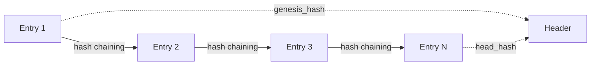
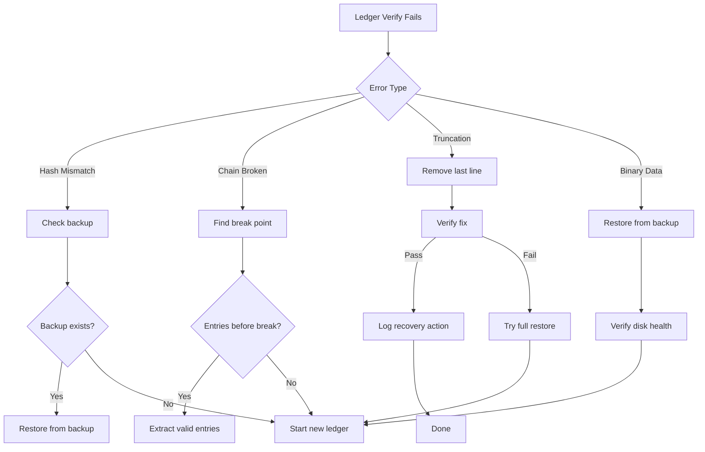

# Ledger Troubleshooting

This guide covers troubleshooting issues with the 01s-ledger.

## Ledger Architecture Overview

The 01s-ledger is an append-only, hash-chained audit log. Each entry contains:

- **Timestamp**: ISO 8601 UTC timestamp
- **Type**: Entry category (system_event, user_action, etc.)
- **Content**: Application-specific key-value pairs
- **Parent Hash**: SHA3-256 of the previous entry
- **Hash**: SHA3-256 of this entry (excluding the hash field)



## Common Errors

### "Cannot create ledger" or Permission Denied

**Cause**: Ledger directory cannot be created or written to.

**Solution**:

```bash
# Check HOME directory
echo $HOME

# Check permissions on ledger directory
ls -la ~/ledger/

# Create directory manually
mkdir -p ~/ledger

# Check disk space
df -h ~

# Check disk space inodes
df -i ~

# Try running with explicit HOME
HOME=/home/01s 01s-ledger init
```

### "Ledger already exists"

**Cause**: A ledger file already exists for today.

**Solution**:

```bash
# Just use the existing ledger
01s-ledger status

# To start fresh (will lose existing entries):
rm ~/ledger/$(date +%Y-%m-%d).aioss
01s-ledger init
```

### "No entries to verify"

**Cause**: The ledger exists but has no entries (only header).

**Solution**:

```bash
# Add an entry first
01s-ledger log test status=init

# Then verify
01s-ledger verify
```

## Verification Failures

### Hash Mismatch

```
[FAIL] Entry 42: hash mismatch (stored=abc123..., computed=def456...)
```

**Cause**: The entry was modified after creation, or the storage medium corrupted the file.

**Solution**:

```bash
# Check if the file was modified
ls -la ~/ledger/$(date +%Y-%m-%d).aioss

# Check file modification timestamps
stat ~/ledger/$(date +%Y-%m-%d).aioss

# Restore from backup
tar xzf ~/backups/ledger-*.tar.gz -C ~/

# If no backup, the ledger is damaged and must be replaced
# Create a new ledger
01s-ledger init
```

### Parent Hash Chain Broken

```
[FAIL] Entry 5: parent_hash chain broken
```

**Cause**: Entry 4 was modified (or removed), so entry 5's parent_hash no longer matches.

**Solution**:

```bash
# Show entries around the break
01s-ledger tail 10

# Dump specific entry for inspection
01s-ledger export | python3 -c "
import json, sys
data = json.load(sys.stdin)
entries = data.get('entries', [])
for i, e in enumerate(entries):
    print(f'Entry {i}: hash={e.get(\"hash\")[:16]}... parent={e.get(\"parent_hash\")[:16]}...')
"

# The break cannot be repaired - restore from backup
# or start a new ledger
```

### Header Head Hash Mismatch

```
[FAIL] Header head_hash mismatch!
```

**Cause**: The header's head_hash does not match the last entry's hash. This indicates the header was modified independently of entries.

**Solution**:

```bash
# This indicates the header was modified independently of entries
# Restore from backup

# Last resort: manually fix the header
# Edit the first line of the .aioss file to set head_hash correctly
# WARNING: This breaks the tamper evidence. Only do this for recovery.

# Extract current head hash from last entry
python3 -c "
import json
with open('/path/to/ledger.aioss') as f:
    header = json.loads(f.readline())
    last_entry = None
    for line in f:
        last_entry = json.loads(line)
    if last_entry:
        print(f'Last entry hash: {last_entry.get(\"hash\")}')
        print(f'Header head_hash: {header.get(\"head_hash\")}')
"
```

## Verification Failure Codes Reference

| Failure Code | Meaning | Severity | Typical Cause |
|-------------|---------|----------|---------------|
| `hash mismatch` | Entry content hash doesn't match stored hash | High | File corruption, tampering |
| `parent_hash chain broken` | Entry's parent reference doesn't match previous hash | Critical | Entry deleted or modified |
| `head_hash mismatch` | Header's terminal reference doesn't match last entry | Critical | Header tampered |
| `entry_count mismatch` | Header count doesn't match actual entries | Medium | Truncation or extra lines |
| `genesis_hash mismatch` | First entry hash doesn't match genesis in header | Critical | First entry corrupted |
| `JSON parse error` | Entry line is not valid JSON | High | Binary corruption, truncation |
| `file too short` | File ends before expected | High | Incomplete write, crash |
| `file too long` | Extra data after last entry | Medium | Append collision |
| `signature invalid` | HMAC-SHA3-256 signature doesn't verify | Critical | Key mismatch, tampering |
| `version mismatch` | Ledger format version incompatible | Medium | Toolchain version mismatch |

## Ledger File Corruption

### Truncated Ledger

**Symptoms**: Verification fails on the last entry, or the file ends abruptly.

**Cause**: System crash, power loss, or disk full during write.

**Solution**:

```bash
# Remove the last (incomplete) entry
# The file format is: header + entries (one per line)
head -n -1 ~/ledger/$(date +%Y-%m-%d).aioss > /tmp/fixed.aioss

# Update the entry count in header
# (Automatically recalculated on next log)

# Rename fixed file
cp /tmp/fixed.aioss ~/ledger/$(date +%Y-%m-%d).aioss

# Verify
01s-ledger verify
```

### Binary Garbage in File

**Symptoms**: Ledger file contains non-JSON content.

**Solution**:

```bash
# Check file type
file ~/ledger/*.aioss
# Should be: ASCII text or JSON

# If corrupted, restore from backup
tar xzf ~/backups/ledger-*.tar.gz -C ~/

# Check for disk errors
sudo smartctl -a /dev/sda | grep -i "reallocated\|pending\|uncorrectable"
```

### Recovery Decision Tree



## Health Ledger Issues

### Health Verification Fails

```bash
# Check health ledger
01s-ledger health verify $(date +%Y-%m-%d)

# View health entries
cat logs/health/$(date +%Y-%m-%d).health

# Check for hash mismatches
# Health entries use sha3-256: prefix

# List all health files
ls -la logs/health/
```

### Health Directory Not Created

```bash
# Create manually
mkdir -p logs/health

# Log a test entry
01s-ledger health log "" test system pass 0 "test"

# Check
ls logs/health/
```

## Performance Issues

### Watch Mode Slow

**Cause**: Default interval is 60 seconds.

**Solution**:

```bash
# Reduce interval
01s-ledger watch 10  # Every 10 seconds

# Or just use tail
01s-ledger tail 5

# Use health watch for less frequent checks
01s-ledger health watch 300  # Every 5 minutes
```

### Large Ledger Files

```bash
# Check ledger size
du -sh ~/ledger/

# Check number of entries
01s-ledger status

# Archive old ledgers
tar czf ~/ledger-archive-$(date +%Y-%m).tar.gz ~/ledger/*.aioss
rm ~/ledger/*.aioss
01s-ledger init

# Set up auto-archiving
cat > /etc/systemd/system/01s-archive.service << 'SERVICE'
[Unit]
Description=Archive old ledger files
After=01s-ledger.service

[Service]
Type=oneshot
ExecStart=/usr/local/bin/01s-archive-ledger.sh
SERVICE
```

## Toolchain Verification

### "Toolchain binary missing"

```
[FAIL] 01s-lexer missing at /usr/bin/01s-lexer
```

**Solution**:

```bash
# Check if binary exists
ls -la /usr/bin/01s-*

# Rebuild from source
cd /usr/src/toolchain/lexer
make clean && make
sudo cp 01s-lexer /usr/bin/01s-lexer

# Or reinstall from ISO
sudo pacman -S 01s-toolchain --force
```

### "Hash mismatch" for toolchain binaries

```
[FAIL] zerocli SHA256 mismatch
```

**Cause**: Binary was updated or replaced since installation.

**Solution**:

```bash
# This is expected after rebuilding the toolchain
# Run the toolchain check to update hashes
01s-ledger toolchain

# If you didn't rebuild, the binary may have been tampered with
# Restore from ISO

# Verify binary hash against known good
sha256sum /usr/bin/01s-lexer
# Compare with /usr/src/toolchain/lexer/target/release/01s-lexer
```

## Debugging Mode

```bash
# Enable debug output
export 01S_LEDGER_DEBUG=1
01s-ledger status

# Trace system calls
strace -e open,write 01s-ledger status

# Check journal for ledger errors
journalctl -u 01s-boot.service
journalctl -u 01s-state.service

# Verbose verification
01s-ledger verify --verbose

# Check ledger file directly
head -1 ~/ledger/$(date +%Y-%m-%d).aioss  # Header
wc -l ~/ledger/$(date +%Y-%m-%d).aioss     # Line count
```

## Ledger Configuration Reference

| Config Variable | Default | Description |
|----------------|---------|-------------|
| `LEDGER_DIR` | `$HOME/ledger` | Directory for ledger files |
| `LEDGER_ENTRY_SIZE` | 256 | Max entry size in bytes |
| `LEDGER_FLUSH_INTERVAL` | 60 | Seconds between auto-flushes |
| `LEDGER_VERIFY_ON_WRITE` | true | Verify chain after each write |
| `LEDGER_BACKUP_COUNT` | 7 | Number of daily backups to keep |
| `LEDGER_HASH_ALGO` | sha3-256 | Hash algorithm for chain |
| `LEDGER_SIGN_KEY` | (auto) | HMAC key for state proofs |

## Recovery Checklist

If the ledger is corrupted and no backup exists:

1. `01s-ledger verify` -- Document which entries fail
2. `01s-ledger status` -- Record entry count and head hash
3. Export remaining entries: `01s-ledger export > partial-export.json`
4. Count recoverable entries: `jq '.entries | length' partial-export.json`
5. Initialize new ledger: `01s-ledger init`
6. Rebuild from exported data (manual)
7. Verify new ledger
8. Log the incident to new ledger
9. Set up automatic backup and verification schedule

```bash
# Example automated recovery log
01s-ledger log ledger_recovery \
  date=$(date +%Y-%m-%d) \
  entries_lost=5 \
  entries_recovered=150 \
  root_cause="power_failure"
```

---

## See Also

- [Using 01s-Ledger](../tutorial/10-using-01s-ledger.md)
- [Ledger FAQ](../faq/04-ledger-audit-faq.md)
- [Ledger Recovery](../incident-reporting/05-ledger-recovery.md)
## Advanced Diagnostic Procedures

### Ledger Performance Profiling

```bash
# Profile ledger operations
time 01s-ledger verify
time 01s-ledger export > /dev/null
time 01s-ledger status

# Check ledger file size growth
watch -n 60 'du -sh ~/ledger/'

# Monitor system resources during ledger operations
top -b -n 1 | grep "01s-ledger"
```

### Network Diagnostic Procedures

```bash
# Full network diagnostic suite
echo "=== Network Diagnostics ==="
echo "--- Interfaces ---"
ip link show
echo "--- IP Addresses ---"
ip addr show
echo "--- Routing ---"
ip route show
echo "--- DNS ---"
cat /etc/resolv.conf
echo "--- Connectivity ---"
ping -c 2 8.8.8.8
echo "--- Open Ports ---"
ss -tulpn
```

### System Health Check Script

```bash
#!/bin/bash
# health-check.sh
echo "=== System Health Check ==="
echo "Date: $(date)"
echo ""
echo "--- CPU ---"
top -bn1 | grep "Cpu(s)"
echo ""
echo "--- Memory ---"
free -h
echo ""
echo "--- Disk ---"
df -h /
echo ""
echo "--- Load ---"
uptime
echo ""
echo "--- Services ---"
systemctl --failed
echo ""
echo "--- Ledger ---"
01s-ledger verify > /dev/null 2>&1 && echo "Ledger: OK" || echo "Ledger: FAILED"
echo ""
echo "--- Last Boot ---"
who -b
```

## Common Troubleshooting Scenarios

### Scenario 1: System Won't Wake from Suspend

**Symptoms**: Screen stays black, system unresponsive after opening laptop lid.
**Causes**: GPU driver issue, ACPI problem, firmware bug.

**Diagnostic Steps**:
1. Try switching TTY (Ctrl+Alt+F2)
2. If TTY works, restart GDM: `sudo systemctl restart gdm`
3. Check kernel messages: `dmesg | grep -i "drm\|gpu\|acpi"`
4. Check journal: `journalctl -b | grep -i "resume\|suspend"`
5. Test with different kernel parameters: `acpi=off`, `nouveau.modeset=0`

### Scenario 2: Bluetooth Device Won't Pair

**Symptoms**: Device discovered but pairing fails.
**Causes**: Wrong PIN, driver issue, device compatibility.

**Diagnostic Steps**:
1. Restart Bluetooth: `sudo systemctl restart bluetooth`
2. Remove and re-scan: `bluetoothctl remove XX:XX:XX:XX:XX:XX`
3. Check kernel module: `lsmod | grep bluetooth`
4. Try manual pairing: `bluetoothctl pair XX:XX:XX:XX:XX:XX`
5. Check compatibility list for your device

### Scenario 3: USB Device Not Recognized

**Symptoms**: Device plugged in but not detected.
**Causes**: Driver missing, power issue, hardware fault.

**Diagnostic Steps**:
1. Check dmesg: `dmesg | tail -20` (look for USB-related messages)
2. List USB devices: `lsusb`
3. Check power: `cat /sys/bus/usb/devices/*/power/control`
4. Reset USB: `sudo modprobe -r usbcore && sudo modprobe usbcore`
5. Try different port or cable

## Package Management Best Practices

### Pre-Update Checklist

```bash
# Before running system updates:
echo "=== Pre-Update Checks ==="
echo "1. Check disk space: $(df -h / | tail -1 | awk '{print $4}') free"
echo "2. Check memory: $(free -h | grep Mem | awk '{print $7}') available"
echo "3. Backup ledger: $(01s-ledger verify > /dev/null 2>&1 && echo 'OK' || echo 'FAILED')"
echo "4. Check internet: $(ping -c 1 8.8.8.8 > /dev/null 2>&1 && echo 'OK' || echo 'FAILED')"
echo "5. Check battery: $(cat /sys/class/power_supply/BAT0/capacity 2>/dev/null || echo 'N/A')%"
```

### Post-Update Checklist

```bash
# After running system updates:
echo "=== Post-Update Checks ==="
sudo pacman -Qkk | grep -v "0 missing files" || echo "All files verified"
01s-ledger verify && echo "Ledger chain intact" || echo "Ledger FAILED"
01s-ledger toolchain && echo "Toolchain verified" || echo "Toolchain FAILED"
systemctl --failed || echo "All services running"
```

### Package Cache Management

```bash
# Automatic cache cleanup
cat > /etc/systemd/system/paccache-clean.service << 'EOF'
[Unit]
Description=Clean pacman cache

[Service]
Type=oneshot
ExecStart=/usr/bin/paccache -r
ExecStart=/usr/bin/paccache -rk 2
EOF

cat > /etc/systemd/system/paccache-clean.timer << 'EOF'
[Unit]
Description=Weekly pacman cache cleanup

[Timer]
OnCalendar=weekly
Persistent=true

[Install]
WantedBy=timers.target
EOF

sudo systemctl enable --now paccache-clean.timer
```

## User Support Escalation Path

### L1: Self-Service (User)

1. Check documentation
2. Search known issues
3. Try listed workarounds
4. Check FAQ
5. Review system logs

### L2: Community Support (Peer)

1. Ask in Matrix chat
2. Post on GitHub Discussions
3. Search GitHub Issues
4. Ask on mailing list
5. Request help from community

### L3: Technical Support (Maintainer)

1. Create GitHub Issue
2. Include system information
3. Provide reproduction steps
4. Attach relevant logs
5. Wait for maintainer response

### L4: Enterprise Support (Dedicated)

1. Submit support ticket
2. Call dedicated hotline
3. Request live assistance
4. Schedule remote session
5. Request on-site visit

## Performance Tuning Guide

### CPU Performance Tuning

```bash
# Check CPU governor
cat /sys/devices/system/cpu/cpu*/cpufreq/scaling_governor

# Set performance governor
echo performance | sudo tee /sys/devices/system/cpu/cpu*/cpufreq/scaling_governor

# Disable C-states (reduce latency)
sudo nano /etc/default/grub
# Add: processor.max_cstate=1 intel_idle.max_cstate=0
sudo grub-mkconfig -o /boot/grub/grub.cfg
```

### Memory Performance Tuning

```bash
# Reduce swappiness
echo 10 | sudo tee /proc/sys/vm/swappiness

# Enable swap compression (zram)
sudo pacman -S zram-generator
sudo systemctl enable --now systemd-zram-setup@zram0

# Check swap usage
swapon --show

# Clear memory cache (temporary)
echo 3 | sudo tee /proc/sys/vm/drop_caches
```

### Disk Performance Tuning

```bash
# Check I/O scheduler
cat /sys/block/sda/queue/scheduler

# Set scheduler to none (NVMe) or mq-deadline (SSD)
echo none | sudo tee /sys/block/nvme0n1/queue/scheduler

# Enable TRIM for SSDs
sudo systemctl enable --now fstrim.timer

# Check disk health
sudo smartctl -a /dev/sda | grep -i "health\|temperature\|reallocated"
```

---

Lois-Kleinner and 0-1.gg 2026 Copyright

```
.====================================================================.
!  Made in the UAE, Dubai #DubaiIt #Dubai #Dxb #SovereignAI          !
!  Made in The Emirates #Dubai_it                                    !
!                                                                    !
!  Lois-Kleinner Alpasan - The Anticloud 2026-                       !
!                                                                    !
!  As seen on:                                                       !
!  Harvard Dataverse ! Zenodo/CERN ! Academia.edu ! HuggingFace      !
!  anticloud.telepedia.net ! anticloud.fandom.com                    !
!                                                                    !
!  0-1.gg ! GitHub ! LinkedIn ! DEV ! GH Pages                       !
!  HuggingFace ! Blog ! Bluesky ! Mastodon                           !
!  Internet Archive ! ORCID ! Figshare                               !
!                                                                    !
!  Sovereign AI ! Local-First ! Privacy ! Zero Trust ! No Datacenter !
!  Air-Gapped ! Open Source ! Rust ! Hash Chain ! Single Binary      !
!  Offline LLM ! Crypto Ledger ! P2P ! Federated                     !
'===================================================================='
```

Lois-Kleinner Alpasan, 22, builds sovereign AI infrastructure and cryptographic audit systems. His work spans formats, proptech, and research platforms serving projects valued at over $1B combined, operating at the intersection of AI, media, and decentralized technology.

References:
1. Lois-Kleinner Zenodo: https://doi.org/10.5281/zenodo.20781790
2. Lois-Kleinner GitHub: https://github.com/kleinnner/Anticloud/tree/main/04-aioss-format
3. Lois-Kleinner Harvard DV: https://doi.org/10.7910/DVN/GDLO0L
4. Lois-Kleinner Internet Arc: https://archive.org/details/aioss-format
5. Lois-Kleinner ORCID: https://orcid.org/0009-0009-2233-6107
6. Lois-Kleinner DEV.to: https://dev.to/kleinner
7. Lois-Kleinner LinkedIn: https://linkedin.com/in/kleinner
8. Lois-Kleinner HuggingFace: https://huggingface.co/Anticloud
9. Lois-Kleinner Tumblr: https://anticloud.tumblr.com
10. Lois-Kleinner Mastodon: https://mastodon.social/@kleinner
11. Lois-Kleinner Bluesky: https://bsky.app/profile/kleinner.bsky.social
12. 0-1.gg: https://0-1.gg
13. Lois-Kleinner Figshare: https://figshare.com/authors/Lois-Kleinner_Alpasan/20849885
14. Lois-Kleinner Academia: https://independent.academia.edu/kleinner
15. Lois-Kleinner Telepedia: https://anticloud.telepedia.net/wiki/Anticloud_by_Lois-Kleinner_Wiki
16. Lois-Kleinner Fandom: https://anticloud.fandom.com