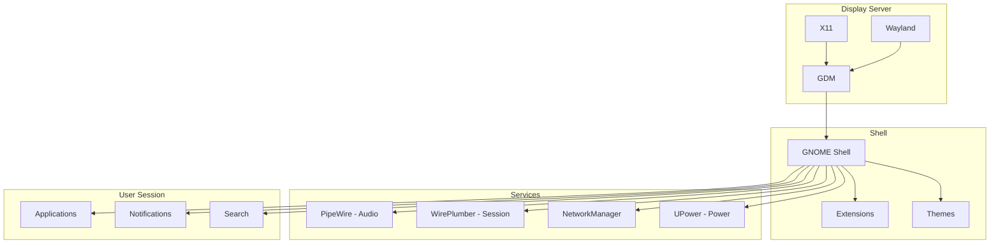

# Desktop Troubleshooting

This guide covers troubleshooting issues with the GNOME desktop environment in 01s Sovereign.

## Desktop Environment Architecture



## GNOME Crashes

### Shell Restart Loop

**Symptoms**: GNOME Shell continuously restarts (screen flickers, flashes).

**Causes**: Faulty extension, theme issue, GPU driver problem.

**Solutions**:

```bash
# Switch to TTY (Ctrl+Alt+F2)
# Disable all extensions
gnome-extensions list | xargs -I {} gnome-extensions disable {}

# Reset GNOME settings
dconf reset -f /org/gnome/

# Log out and back in
loginctl terminate-user $(whoami)

# If still broken, reinstall GNOME
sudo pacman -S gnome-shell --force
```

### GNOME Freezes

**Symptoms**: Desktop becomes unresponsive, mouse may move but nothing clicks.

**Solutions**:

```bash
# Restart GNOME Shell without losing session
# Press: Alt+F2, type 'r', press Enter

# If that doesn't work, switch to TTY (Ctrl+Alt+F3)
# Kill GNOME Shell
killall -3 gnome-shell
# Or
sudo systemctl restart gdm
```

### "Oh no! Something has gone wrong"

**Symptoms**: Full-screen error message after GDM login.

**Solution**:

```bash
# Switch to TTY (Ctrl+Alt+F2)
# Check the logs
journalctl -u gdm -n 100 | grep -i error
journalctl -xe | grep gnome

# Common fix: reset graphics configuration
sudo rm -rf ~/.config/monitors.xml
sudo rm -rf ~/.local/share/gnome-shell/

# If related to Wayland, try X11
# In GDM, click gear icon and select "GNOME on Xorg"

# Check for disk full
df -h

# Check user profile permissions
ls -la ~/.config/
```

## Extension Issues

### Extension Conflict Resolution Table

| Conflict Pattern | Symptoms | Resolution |
|-----------------|----------|------------|
| Two dock extensions | Duplicate docks, layout broken | Disable one, keep Dash-to-Dock |
| Blur-my-shell + transparent shell | Window decorations missing | Disable transparent shell |
| ArcMenu + Dash-to-Panel | Top bar duplicated | Keep only one |
| Vitals + System Monitor | CPU graphs overlap | Increase panel height |
| Workspace indicator overlap | Workspace buttons stacked | Remove one indicator |

### Extension Not Working

**Symptoms**: Extension installed but has no effect.

**Solutions**:

```bash
# Check if extension is enabled
gnome-extensions info extension-uuid

# Enable if disabled
gnome-extensions enable extension-uuid

# Check GNOME Shell version
gnome-shell --version

# Extension must match shell version
# Check compatibility on extensions.gnome.org

# Restart GNOME Shell after enabling
killall -3 gnome-shell
```

### Extension Conflicts

**Symptoms**: Two extensions cause unexpected behavior.

**Solution**:

```bash
# Disable extensions one by one to find the conflict
gnome-extensions disable extension1-uuid
# Test behavior
gnome-extensions enable extension1-uuid
gnome-extensions disable extension2-uuid
# Test behavior

# Report the conflict on GitHub
```

### Reset Extension Settings

```bash
# Reset specific extension via dconf
gsettings reset-recursively org.gnome.shell.extensions.extension-name

# Or remove extension config directory
rm -rf ~/.local/share/gnome-shell/extensions/extension-uuid/

# Reset all extension settings
dconf reset -f /org/gnome/shell/extensions/
```

## Display Issues

### Wrong Resolution

**Symptoms**: Display is too small, too large, or stretching.

**Solutions**:

```bash
# List available resolutions
xrandr

# Set resolution (X11)
xrandr --output HDMI-1 --mode 1920x1080 --rate 60

# For Wayland:
# Use Settings > Displays
# Or
gnome-control-center display

# Create custom resolution (if not listed)
cvt 1920 1080 60
xrandr --newmode "1920x1080_60.00"  173.00  1920 2048 2248 2576  1080 1083 1088 1120 -hsync +vsync
xrandr --addmode HDMI-1 "1920x1080_60.00"
xrandr --output HDMI-1 --mode "1920x1080_60.00"
```

### Multiple Monitors Not Working

```bash
# Detect monitors
xrandr --auto

# Configure layout
xrandr --output HDMI-1 --primary --mode 1920x1080 --output eDP-1 --mode 1920x1080 --right-of HDMI-1

# Save monitor configuration
sudo rm ~/.config/monitors.xml
# Log out and back in

# Mirror displays
xrandr --output HDMI-1 --same-as eDP-1
```

### Screen Tearing

**Solutions**:

```bash
# For NVIDIA
sudo nvidia-settings --assign CurrentMetaMode="HDMI-0: 1920x1080_60 { ForceCompositionPipeline=On }"

# For Intel
# Create /etc/X11/xorg.conf.d/20-intel.conf
Section "Device"
    Identifier "Intel Graphics"
    Driver "intel"
    Option "TearFree" "true"
EndSection

# For AMD
# Create /etc/X11/xorg.conf.d/20-amd.conf
Section "Device"
    Identifier "AMD Graphics"
    Driver "amdgpu"
    Option "TearFree" "true"
    Option "VariableRefresh" "true"
EndSection
```

### Blank Screen After Login

**Cause**: GPU driver issue, wrong display manager config.

**Solutions**:

```bash
# Switch to TTY (Ctrl+Alt+F2)
# Restart display manager
sudo systemctl restart gdm

# Check display manager status
systemctl status gdm

# Try creating a new user (config issue)
sudo useradd -m testuser
sudo passwd testuser
# Try logging in as testuser
```

## Performance Issues

### High CPU Usage

```bash
# Find what's using CPU
top
htop

# Check GNOME Shell CPU usage
top -p $(pgrep -x gnome-shell)

# Restart shell if it's leaking
killall -3 gnome-shell

# Profile CPU over time
mpstat -P ALL 1 5

# Check for systemd journal CPU usage
systemd-cgtop
```

### High Memory Usage

```bash
# Check memory
free -h
cat /proc/meminfo

# Check GNOME Shell memory
ps -o pid,rss,comm -p $(pgrep -x gnome-shell)

# Clear memory cache
echo 3 | sudo tee /proc/sys/vm/drop_caches

# Find top memory consumers
ps aux --sort=-%mem | head -10

# Check swap usage
swapon --show
```

### Slow Animations

```bash
# Disable animations
gsettings set org.gnome.desktop.interface enable-animations false

# Reduce blur effects
gsettings set org.gnome.shell.extensions.blur-my-shell blur-enabled false

# Disable window animations
gnome-extensions disable burn-my-windows@schneegans.github.com

# Reduce animation speed
gsettings set org.gnome.desktop.interface gtk-enable-animations false
```

## Input Issues

### Keyboard Not Working

```bash
# Check keyboard layout
localectl status

# Set correct layout
localectl set-x11-keymap us

# Restart GNOME Shell
killall -3 gnome-shell

# List all available layouts
localectl list-x11-keymap-layouts

# Set multiple layouts
localectl set-x11-keymap us,de
```

### Touchpad Not Working

```bash
# Check if touchpad is detected
xinput list

# Enable touchpad
gsettings set org.gnome.desktop.peripherals.touchpad enable-tap-to-click true

# More touchpad settings
gnome-control-center mouse

# Check kernel module
lsmod | grep i2c_hid
sudo modprobe i2c_hid

# Re-enable touchpad via xinput
xinput enable $(xinput list | grep -i touchpad | grep -oP 'id=\K\d+')
```

### Mouse Pointer Issues

```bash
# Reset cursor theme
gsettings reset org.gnome.desktop.interface cursor-theme

# Set cursor size
gsettings set org.gnome.desktop.interface cursor-size 24

# Enable mouse acceleration
gsettings set org.gnome.desktop.peripherals.mouse accel-profile adaptive

# Check for pointer swallowing
xinput test <device-id>
```

## Sound Issues

### No Audio

```bash
# Check audio devices
pactl list sinks short

# Set default sink
pactl set-default-sink alsa_output.pci-0000_00_1f.3.analog-stereo

# Restart audio
systemctl --user restart pipewire
systemctl --user restart wireplumber

# Check volume
pactl set-sink-volume @DEFAULT_SINK@ 50%

# Unmute
pactl set-sink-mute @DEFAULT_SINK@ 0

# Check alsa state
alsamixer
```

### Crackling Audio

```bash
# Edit PipeWire config
sudo nano /etc/pipewire/pipewire.conf

# Increase quantum
# default.clock.quantum = 2048

# Alternative: set in per-user config
mkdir -p ~/.config/pipewire
cp /usr/share/pipewire/pipewire.conf ~/.config/pipewire/
# Edit ~/.config/pipewire/pipewire.conf

# Restart
systemctl --user restart pipewire
```

## Theme Issues

### Theme Not Applying

```bash
# Ensure User Themes extension is enabled
gnome-extensions enable user-theme@gnome-shell-extensions.gcampax.github.com

# Set theme
gsettings set org.gnome.shell.extensions.user-theme name "Obsidian-flow"
gsettings set org.gnome.desktop.interface gtk-theme "Obsidian-flow"

# Log out and back in

# Check theme installation
ls ~/.themes/
ls /usr/share/themes/
```

### Broken Theme

```bash
# Reset to default
gsettings reset org.gnome.shell.extensions.user-theme name
gsettings reset org.gnome.desktop.interface gtk-theme
gsettings reset org.gnome.desktop.interface icon-theme

# Remove custom theme files
rm -rf ~/.local/share/themes/broken-theme

# Reinstall default theme
sudo pacman -S 01s-theme --force
```

## XDG Autostart Debugging

```bash
# List all autostart entries
ls -la ~/.config/autostart/
ls -la /etc/xdg/autostart/

# Disable a specific autostart
mv ~/.config/autostart/problematic-app.desktop ~/.config/autostart/problematic-app.desktop.disabled

# Check autostart logs
journalctl -xe | grep -i autostart

# Run an autostart manually to debug
/usr/lib/xdg-desktop-portal -r

# Check desktop file syntax
desktop-file-validate ~/.config/autostart/example.desktop
```

## Desktop Reset

If all else fails, reset the GNOME desktop completely:

```bash
# Backup current settings
dconf dump /org/gnome/ > gnome-settings-backup.txt

# Reset all GNOME settings
dconf reset -f /org/gnome/

# Disable all extensions
for ext in $(gnome-extensions list); do
    gnome-extensions disable "$ext"
done

# Remove extension data
rm -rf ~/.local/share/gnome-shell/extensions/
rm -rf ~/.local/share/gnome-shell/gnome-shell-extensions/

# Reset GTK settings
rm -rf ~/.config/gtk-3.0
rm -rf ~/.config/gtk-4.0

# Log out and back in
gnome-session-quit --logout
```

## GPU Driver Quick Reference

| GPU Vendor | Driver | Package | Configuration |
|------------|--------|---------|---------------|
| Intel | modesetting (built-in) | `xf86-video-intel` | TearFree option in xorg.conf |
| AMD | amdgpu | `xf86-video-amdgpu` | TearFree, VariableRefresh |
| NVIDIA (open) | nouveau | `xf86-video-nouveau` | modeset=0 if issues |
| NVIDIA (proprietary) | nvidia | `nvidia nvidia-utils` | nvidia-drm.modeset=1 |
| Virtual | virtio-gpu | `xf86-video-qxl` | Defaults |

## Display Server Comparison

| Feature | Wayland | X11 |
|---------|---------|-----|
| Security | Better (per-window isolation) | Screen capture from any app |
| Tearing | Less common | Can be configured |
| Screen Recording | PipeWire required | OBS works natively |
| NVIDIA Support | Mixed (proprietary driver) | Full support |
| Remote Desktop | Requires portal | Built-in (VNC, X2Go) |
| Multi-monitor | Per-monitor scaling | Global scaling only |

---

## See Also

- [Known Issues](01-known-issues.md)
- [Performance Problems](08-performance-problems.md)
- [Desktop FAQ](../faq/05-desktop-faq.md)
## Advanced Diagnostic Procedures

### Ledger Performance Profiling

```bash
# Profile ledger operations
time 01s-ledger verify
time 01s-ledger export > /dev/null
time 01s-ledger status

# Check ledger file size growth
watch -n 60 'du -sh ~/ledger/'

# Monitor system resources during ledger operations
top -b -n 1 | grep "01s-ledger"
```

### Network Diagnostic Procedures

```bash
# Full network diagnostic suite
echo "=== Network Diagnostics ==="
echo "--- Interfaces ---"
ip link show
echo "--- IP Addresses ---"
ip addr show
echo "--- Routing ---"
ip route show
echo "--- DNS ---"
cat /etc/resolv.conf
echo "--- Connectivity ---"
ping -c 2 8.8.8.8
echo "--- Open Ports ---"
ss -tulpn
```

### System Health Check Script

```bash
#!/bin/bash
# health-check.sh
echo "=== System Health Check ==="
echo "Date: $(date)"
echo ""
echo "--- CPU ---"
top -bn1 | grep "Cpu(s)"
echo ""
echo "--- Memory ---"
free -h
echo ""
echo "--- Disk ---"
df -h /
echo ""
echo "--- Load ---"
uptime
echo ""
echo "--- Services ---"
systemctl --failed
echo ""
echo "--- Ledger ---"
01s-ledger verify > /dev/null 2>&1 && echo "Ledger: OK" || echo "Ledger: FAILED"
echo ""
echo "--- Last Boot ---"
who -b
```

## Common Troubleshooting Scenarios

### Scenario 1: System Won't Wake from Suspend

**Symptoms**: Screen stays black, system unresponsive after opening laptop lid.
**Causes**: GPU driver issue, ACPI problem, firmware bug.

**Diagnostic Steps**:
1. Try switching TTY (Ctrl+Alt+F2)
2. If TTY works, restart GDM: `sudo systemctl restart gdm`
3. Check kernel messages: `dmesg | grep -i "drm\|gpu\|acpi"`
4. Check journal: `journalctl -b | grep -i "resume\|suspend"`
5. Test with different kernel parameters: `acpi=off`, `nouveau.modeset=0`

### Scenario 2: Bluetooth Device Won't Pair

**Symptoms**: Device discovered but pairing fails.
**Causes**: Wrong PIN, driver issue, device compatibility.

**Diagnostic Steps**:
1. Restart Bluetooth: `sudo systemctl restart bluetooth`
2. Remove and re-scan: `bluetoothctl remove XX:XX:XX:XX:XX:XX`
3. Check kernel module: `lsmod | grep bluetooth`
4. Try manual pairing: `bluetoothctl pair XX:XX:XX:XX:XX:XX`
5. Check compatibility list for your device

### Scenario 3: USB Device Not Recognized

**Symptoms**: Device plugged in but not detected.
**Causes**: Driver missing, power issue, hardware fault.

**Diagnostic Steps**:
1. Check dmesg: `dmesg | tail -20` (look for USB-related messages)
2. List USB devices: `lsusb`
3. Check power: `cat /sys/bus/usb/devices/*/power/control`
4. Reset USB: `sudo modprobe -r usbcore && sudo modprobe usbcore`
5. Try different port or cable

## Package Management Best Practices

### Pre-Update Checklist

```bash
# Before running system updates:
echo "=== Pre-Update Checks ==="
echo "1. Check disk space: $(df -h / | tail -1 | awk '{print $4}') free"
echo "2. Check memory: $(free -h | grep Mem | awk '{print $7}') available"
echo "3. Backup ledger: $(01s-ledger verify > /dev/null 2>&1 && echo 'OK' || echo 'FAILED')"
echo "4. Check internet: $(ping -c 1 8.8.8.8 > /dev/null 2>&1 && echo 'OK' || echo 'FAILED')"
echo "5. Check battery: $(cat /sys/class/power_supply/BAT0/capacity 2>/dev/null || echo 'N/A')%"
```

### Post-Update Checklist

```bash
# After running system updates:
echo "=== Post-Update Checks ==="
sudo pacman -Qkk | grep -v "0 missing files" || echo "All files verified"
01s-ledger verify && echo "Ledger chain intact" || echo "Ledger FAILED"
01s-ledger toolchain && echo "Toolchain verified" || echo "Toolchain FAILED"
systemctl --failed || echo "All services running"
```

### Package Cache Management

```bash
# Automatic cache cleanup
cat > /etc/systemd/system/paccache-clean.service << 'EOF'
[Unit]
Description=Clean pacman cache

[Service]
Type=oneshot
ExecStart=/usr/bin/paccache -r
ExecStart=/usr/bin/paccache -rk 2
EOF

cat > /etc/systemd/system/paccache-clean.timer << 'EOF'
[Unit]
Description=Weekly pacman cache cleanup

[Timer]
OnCalendar=weekly
Persistent=true

[Install]
WantedBy=timers.target
EOF

sudo systemctl enable --now paccache-clean.timer
```

## User Support Escalation Path

### L1: Self-Service (User)

1. Check documentation
2. Search known issues
3. Try listed workarounds
4. Check FAQ
5. Review system logs

### L2: Community Support (Peer)

1. Ask in Matrix chat
2. Post on GitHub Discussions
3. Search GitHub Issues
4. Ask on mailing list
5. Request help from community

### L3: Technical Support (Maintainer)

1. Create GitHub Issue
2. Include system information
3. Provide reproduction steps
4. Attach relevant logs
5. Wait for maintainer response

### L4: Enterprise Support (Dedicated)

1. Submit support ticket
2. Call dedicated hotline
3. Request live assistance
4. Schedule remote session
5. Request on-site visit

## Performance Tuning Guide

### CPU Performance Tuning

```bash
# Check CPU governor
cat /sys/devices/system/cpu/cpu*/cpufreq/scaling_governor

# Set performance governor
echo performance | sudo tee /sys/devices/system/cpu/cpu*/cpufreq/scaling_governor

# Disable C-states (reduce latency)
sudo nano /etc/default/grub
# Add: processor.max_cstate=1 intel_idle.max_cstate=0
sudo grub-mkconfig -o /boot/grub/grub.cfg
```

### Memory Performance Tuning

```bash
# Reduce swappiness
echo 10 | sudo tee /proc/sys/vm/swappiness

# Enable swap compression (zram)
sudo pacman -S zram-generator
sudo systemctl enable --now systemd-zram-setup@zram0

# Check swap usage
swapon --show

# Clear memory cache (temporary)
echo 3 | sudo tee /proc/sys/vm/drop_caches
```

### Disk Performance Tuning

```bash
# Check I/O scheduler
cat /sys/block/sda/queue/scheduler

# Set scheduler to none (NVMe) or mq-deadline (SSD)
echo none | sudo tee /sys/block/nvme0n1/queue/scheduler

# Enable TRIM for SSDs
sudo systemctl enable --now fstrim.timer

# Check disk health
sudo smartctl -a /dev/sda | grep -i "health\|temperature\|reallocated"
```

---

Lois-Kleinner and 0-1.gg 2026 Copyright

