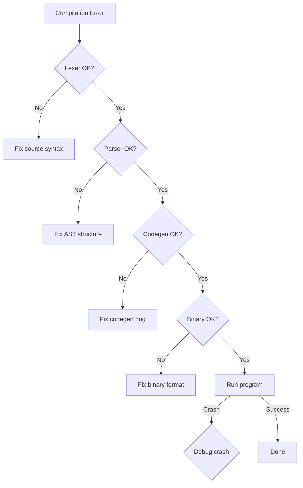

# Toolchain Troubleshooting

This guide covers troubleshooting issues with the 01s Sovereign custom toolchain.

## Toolchain Pipeline


## Toolchain Components

| Binary | Function | Input | Output |
|--------|----------|-------|--------|
| `01s-lexer` | Tokenization | Source file | Token stream (JSON) |
| `01s-parser` | AST construction | Token stream | Abstract Syntax Tree |
| `01s-codegen` | Code generation | AST | Machine code (raw binary) |
| `01s-binary` | Binary analysis | Binary file | Stats/dump |
| `01s-runes` | Symbol rendering | Glyph spec | Unicode/ANSI output |
| `zerocli` | System CLI | Commands | System management |

## Compilation Errors

### Lexer Errors

#### "Failed to read input"

**Cause**: No input provided or pipe broken.

**Solution**:

```bash
# Ensure input is provided
echo "let x = 42" | 01s-lexer

# Check file exists
cat myfile.01s | 01s-lexer

# Check for stdin pipe issues
cat myfile.01s | 01s-lexer || echo "Pipe broken"

# Direct file read (future)
01s-lexer --file myfile.01s
```

#### Unknown Characters

**Symptoms**: Tokens are skipped or incorrect.

**Solution**:

```bash
# Check file encoding (must be UTF-8)
file myfile.01s

# If not UTF-8, convert:
iconv -f latin1 -t utf-8 myfile.01s -o myfile-utf8.01s

# Check for hidden/non-printable characters
cat -A myfile.01s

# Remove non-ASCII characters
iconv -f utf-8 -t ascii//TRANSLIT myfile.01s -o cleaned.01s

# Check for BOM (Byte Order Mark)
hexdump -C myfile.01s | head -1
# Expect: "6c 65 74" ("let"), not "ef bb bf" (BOM)
```

### Parser Errors

#### "Unexpected token"

**Cause**: Syntax error in the source code.

**Solution**:

```bash
# Check the token stream
cat myfile.01s | 01s-lexer | head -20

# Common issues:
# - Unmatched parentheses
# - Missing keyword
# - Wrong operator

# Enable parser tracing
01S_PARSER_TRACE=1 cat myfile.01s | 01s-lexer | 01s-parser

# Check for incomplete expressions
# Example:
# let x = 42 +      # INCOMPLETE - missing operand
# let y = 100       # OK

# Check for reserved keywords as identifiers
# let let = 5       # INVALID - 'let' is reserved
```

#### "Expected Identifier"

**Cause**: Syntax error in variable/function declarations.

**Example**:

```bash
# BAD: Missing identifier
let = 42

# BAD: Using reserved keyword
let return = 5

# GOOD
let x = 42

# GOOD: Multiple declarations
let x = 42
let y = x + 1
let z = y * 2
```

### Codegen Errors

#### "No input"

**Cause**: Empty AST from parser.

**Solution**:

```bash
# Check AST output
cat myfile.01s | 01s-lexer | 01s-parser

# Ensure the source file has valid statements
# Empty files or files with only comments produce no output

# Check for valid start keyword
# Must start with 'let', 'fn', 'if', 'return', etc.
```

#### Zero-byte output

**Cause**: Codegen produced no machine code.

**Solution**:

```bash
# Enable codegen tracing
01S_CODEGEN_TRACE=1 cat myfile.01s | 01s-lexer | 01s-parser | 01s-codegen > prog.bin

# Check stderr for diagnostics
cat myfile.01s | 01s-lexer | 01s-parser | 01s-codegen 2>&1

# Check output size
stat -c%s prog.bin
```

### Compiler Error Reference Table

| Error Code | Message | Common Cause |
|------------|---------|--------------|
| LEX-001 | "Failed to read input" | Missing stdin |
| LEX-002 | "Unknown character" | Non-UTF-8 source |
| LEX-003 | "Unterminated string" | Missing closing quote |
| LEX-004 | "Invalid number literal" | Malformed number |
| PAR-001 | "Unexpected token" | Syntax error |
| PAR-002 | "Expected identifier" | Missing variable name |
| PAR-003 | "Unmatched parenthesis" | Missing ) or ] |
| PAR-004 | "Expected expression" | Incomplete statement |
| PAR-005 | "Redefinition" | Variable already declared |
| COD-001 | "No input" | Empty AST |
| COD-002 | "Unsupported operation" | Feature not yet implemented |
| COD-003 | "Stack overflow" | Too many nested calls |
| COD-004 | "Register allocation failed" | Too many variables |

### Binary/Loader Errors

#### "Not ELF"

**Cause**: The file is not an ELF binary but was loaded with `-l` flag.

**Solution**:

```bash
# Check file type
file myfile.bin

# For raw binaries (01s-codegen output), don't use -l
01s-binary < myfile.bin  # Just count bytes
01s-binary -d < myfile.bin  # Hex dump
```

#### "Cannot read file"

**Cause**: File doesn't exist or permission denied.

**Solution**:

```bash
# Check file exists
ls -la myfile.bin

# Check permissions
chmod +r myfile.bin

# Check file path
realpath myfile.bin
```

## Runtime Errors

### Segmentation Fault

**Cause**: Generated machine code crashes.

**Solutions**:

```bash
# Most common: stack overflow from too many operations
# Limit variable count and nesting depth

# Check stack alignment (must be 16-byte aligned for some instructions)
# Enable verbose codegen to see emitted instructions

# Debug: Use GDB on the generated binary
gdb -batch -ex "run" -ex "bt" ./prog.bin

# Check if it's a null pointer
# Ensure all variables are initialized before use
# let x         # x is undefined
# let y = x + 1 # CRASH: x is null
```

### Illegal Instruction

**Cause**: Generated code uses CPU instructions not supported on your processor.

**Solution**:

```bash
# Check CPU features
lscpu | grep Flags

# The codegen targets x86_64 baseline (no AVX, AVX2, etc.)
# Ensure your CPU supports at least SSE2 (all x86_64 CPUs do)

# Check if virtualization is causing issues
# Run in a VM? Ensure nested virtualization is enabled
```

### JIT Crash Analysis

| Crash Symptom | Likely Cause | Fix |
|---------------|-------------|-----|
| SIGSEGV at address 0x0 | Null pointer dereference | Initialize variables before use |
| SIGSEGV at high address | Stack overflow | Reduce nesting depth |
| SIGILL (illegal instruction) | CPU feature mismatch | Disable AVX/FMA codegen |
| SIGFPE (floating point) | Division by zero | Add zero checks |
| SIGBUS (bus error) | Unaligned memory access | Check struct alignment |
| Timeout/hang | Infinite loop | Check loop termination |

## Pipeline Issues

### Pipe Breaks

**Symptoms**: Pipeline produces no output or partial output.

**Solution**:

```bash
# Test each stage individually
echo "let x = 42" > test.01s

cat test.01s | 01s-lexer > /tmp/tokens.txt
cat /tmp/tokens.txt | 01s-parser > /tmp/ast.txt
cat /tmp/ast.txt | 01s-codegen > /tmp/prog.bin

# Check each intermediate file
cat /tmp/tokens.txt
cat /tmp/ast.txt
01s-binary < /tmp/prog.bin

# Use tee to debug pipeline
cat test.01s | tee /tmp/debug-input.txt | 01s-lexer | tee /tmp/debug-tokens.txt | 01s-parser
```

## Build Issues

### Make Fails

**Cause**: Missing dependencies or compiler.

**Solution**:

```bash
# Install Rust (required for building)
curl --proto '=https' --tlsv1.2 -sSf https://sh.rustup.rs | sh
source ~/.cargo/env

# Install dependencies
sudo pacman -S rust rustc cargo base-devel

# Clean and rebuild
cd /usr/src/toolchain/lexer
make clean
make

# If Makefile not found
# Try cargo directly:
cd /usr/src/toolchain/lexer
cargo build --release
sudo cp target/release/01s-lexer /usr/bin/01s-lexer
```

### Source Code Missing

**Cause**: Toolchain source not installed.

**Solution**:

```bash
# Check if source exists
ls /usr/src/toolchain/

# If missing, copy from ISO or reinstall
# The ISO contains source at /usr/src/toolchain/

# Reinstall toolchain package
sudo pacman -S 01s-toolchain

# Or clone from GitHub
git clone https://github.com/sovereign-os/01s-toolchain.git /usr/src/toolchain
```

## Verification Issues

### Toolchain Check Fails

```bash
# Run toolchain verification
01s-ledger toolchain

# If a binary is missing:
ls /usr/bin/01s-*

# Rebuild missing component
cd /usr/src/toolchain/lexer
make && sudo cp 01s-lexer /usr/bin/01s-lexer

# Re-run verification
01s-ledger toolchain

# Expected output (all 7 binaries):
# [PASS] zerocli
# [PASS] 01s-lexer
# [PASS] 01s-parser
# [PASS] 01s-codegen
# [PASS] 01s-binary
# [PASS] 01s-runes
# [PASS] 01s-ledger
```

## Runes Issues

### Runes Display Garbled

**Cause**: Terminal doesn't support ANSI colors or UTF-8.

**Solution**:

```bash
# Check terminal type
echo $TERM
# Should be: xterm-256color or similar

# Test color support
tput colors
# Should be >= 256

# Test UTF-8 support
echo -e "\xe2\x88\x9e"
# Should show: infinity symbol (∞)

# Set locale to UTF-8
export LANG=en_US.UTF-8
export LC_ALL=en_US.UTF-8

# Add to ~/.bashrc or ~/.zshrc
```

### Glyph Not Found

```bash
# List available glyphs
01s-runes --list

# Check glyph directory
ls /usr/local/share/01s/runes/glyphs/

# Install missing glyph pack
sudo pacman -S 01s-runes-extras
```

### Runes Encoding Errors

```bash
# Test runes encoding
01s-runes --test

# If encoding fails, check terminal font
# Install Nerd Font for complete glyph support

# Reset runes cache
rm -rf ~/.cache/01s/runes/
```

## Debugging Workflow



### Debug Mode

```bash
# Enable all debug output
export 01S_LEXER_TRACE=1
export 01S_PARSER_TRACE=1
export 01S_CODEGEN_TRACE=1
export 01S_BINARY_TRACE=1

# Run pipeline with full logging
cat myfile.01s | 01s-lexer 2>&1 | tee debug.log

# Check debug log for warnings/errors
grep -i "error\|warning\|trace" debug.log

# Disable tracing when done
unset 01S_LEXER_TRACE 01S_PARSER_TRACE 01S_CODEGEN_TRACE 01S_BINARY_TRACE
```

## Known Limitations

| Limitation | Description | Workaround |
|------------|-------------|------------|
| Max 256 variables | Stack-allocated register file | Combine variables, reuse |
| No floating point | Integer-only arithmetic | Use fixed-point math |
| Single-threaded | No parallel codegen | Split into multiple files |
| No heap allocation | Stack-only memory | Pre-allocate all data |
| No recursion | Stack overflow risk | Use iterative patterns |
| x86_64 only | No ARM/RISC-V support | Use QEMU for cross-compile |

---

## See Also

- [Advanced Toolchain Usage](../tutorial/20-advanced-toolchain-usage.md)
- [Toolchain FAQ](../faq/03-toolchain-faq.md)
- [Known Issues](01-known-issues.md)
## Advanced Diagnostic Procedures

### Ledger Performance Profiling

```bash
# Profile ledger operations
time 01s-ledger verify
time 01s-ledger export > /dev/null
time 01s-ledger status

# Check ledger file size growth
watch -n 60 'du -sh ~/ledger/'

# Monitor system resources during ledger operations
top -b -n 1 | grep "01s-ledger"
```

### Network Diagnostic Procedures

```bash
# Full network diagnostic suite
echo "=== Network Diagnostics ==="
echo "--- Interfaces ---"
ip link show
echo "--- IP Addresses ---"
ip addr show
echo "--- Routing ---"
ip route show
echo "--- DNS ---"
cat /etc/resolv.conf
echo "--- Connectivity ---"
ping -c 2 8.8.8.8
echo "--- Open Ports ---"
ss -tulpn
```

### System Health Check Script

```bash
#!/bin/bash
# health-check.sh
echo "=== System Health Check ==="
echo "Date: $(date)"
echo ""
echo "--- CPU ---"
top -bn1 | grep "Cpu(s)"
echo ""
echo "--- Memory ---"
free -h
echo ""
echo "--- Disk ---"
df -h /
echo ""
echo "--- Load ---"
uptime
echo ""
echo "--- Services ---"
systemctl --failed
echo ""
echo "--- Ledger ---"
01s-ledger verify > /dev/null 2>&1 && echo "Ledger: OK" || echo "Ledger: FAILED"
echo ""
echo "--- Last Boot ---"
who -b
```

## Common Troubleshooting Scenarios

### Scenario 1: System Won't Wake from Suspend

**Symptoms**: Screen stays black, system unresponsive after opening laptop lid.
**Causes**: GPU driver issue, ACPI problem, firmware bug.

**Diagnostic Steps**:
1. Try switching TTY (Ctrl+Alt+F2)
2. If TTY works, restart GDM: `sudo systemctl restart gdm`
3. Check kernel messages: `dmesg | grep -i "drm\|gpu\|acpi"`
4. Check journal: `journalctl -b | grep -i "resume\|suspend"`
5. Test with different kernel parameters: `acpi=off`, `nouveau.modeset=0`

### Scenario 2: Bluetooth Device Won't Pair

**Symptoms**: Device discovered but pairing fails.
**Causes**: Wrong PIN, driver issue, device compatibility.

**Diagnostic Steps**:
1. Restart Bluetooth: `sudo systemctl restart bluetooth`
2. Remove and re-scan: `bluetoothctl remove XX:XX:XX:XX:XX:XX`
3. Check kernel module: `lsmod | grep bluetooth`
4. Try manual pairing: `bluetoothctl pair XX:XX:XX:XX:XX:XX`
5. Check compatibility list for your device

### Scenario 3: USB Device Not Recognized

**Symptoms**: Device plugged in but not detected.
**Causes**: Driver missing, power issue, hardware fault.

**Diagnostic Steps**:
1. Check dmesg: `dmesg | tail -20` (look for USB-related messages)
2. List USB devices: `lsusb`
3. Check power: `cat /sys/bus/usb/devices/*/power/control`
4. Reset USB: `sudo modprobe -r usbcore && sudo modprobe usbcore`
5. Try different port or cable

## Package Management Best Practices

### Pre-Update Checklist

```bash
# Before running system updates:
echo "=== Pre-Update Checks ==="
echo "1. Check disk space: $(df -h / | tail -1 | awk '{print $4}') free"
echo "2. Check memory: $(free -h | grep Mem | awk '{print $7}') available"
echo "3. Backup ledger: $(01s-ledger verify > /dev/null 2>&1 && echo 'OK' || echo 'FAILED')"
echo "4. Check internet: $(ping -c 1 8.8.8.8 > /dev/null 2>&1 && echo 'OK' || echo 'FAILED')"
echo "5. Check battery: $(cat /sys/class/power_supply/BAT0/capacity 2>/dev/null || echo 'N/A')%"
```

### Post-Update Checklist

```bash
# After running system updates:
echo "=== Post-Update Checks ==="
sudo pacman -Qkk | grep -v "0 missing files" || echo "All files verified"
01s-ledger verify && echo "Ledger chain intact" || echo "Ledger FAILED"
01s-ledger toolchain && echo "Toolchain verified" || echo "Toolchain FAILED"
systemctl --failed || echo "All services running"
```

### Package Cache Management

```bash
# Automatic cache cleanup
cat > /etc/systemd/system/paccache-clean.service << 'EOF'
[Unit]
Description=Clean pacman cache

[Service]
Type=oneshot
ExecStart=/usr/bin/paccache -r
ExecStart=/usr/bin/paccache -rk 2
EOF

cat > /etc/systemd/system/paccache-clean.timer << 'EOF'
[Unit]
Description=Weekly pacman cache cleanup

[Timer]
OnCalendar=weekly
Persistent=true

[Install]
WantedBy=timers.target
EOF

sudo systemctl enable --now paccache-clean.timer
```

## User Support Escalation Path

### L1: Self-Service (User)

1. Check documentation
2. Search known issues
3. Try listed workarounds
4. Check FAQ
5. Review system logs

### L2: Community Support (Peer)

1. Ask in Matrix chat
2. Post on GitHub Discussions
3. Search GitHub Issues
4. Ask on mailing list
5. Request help from community

### L3: Technical Support (Maintainer)

1. Create GitHub Issue
2. Include system information
3. Provide reproduction steps
4. Attach relevant logs
5. Wait for maintainer response

### L4: Enterprise Support (Dedicated)

1. Submit support ticket
2. Call dedicated hotline
3. Request live assistance
4. Schedule remote session
5. Request on-site visit

## Performance Tuning Guide

### CPU Performance Tuning

```bash
# Check CPU governor
cat /sys/devices/system/cpu/cpu*/cpufreq/scaling_governor

# Set performance governor
echo performance | sudo tee /sys/devices/system/cpu/cpu*/cpufreq/scaling_governor

# Disable C-states (reduce latency)
sudo nano /etc/default/grub
# Add: processor.max_cstate=1 intel_idle.max_cstate=0
sudo grub-mkconfig -o /boot/grub/grub.cfg
```

### Memory Performance Tuning

```bash
# Reduce swappiness
echo 10 | sudo tee /proc/sys/vm/swappiness

# Enable swap compression (zram)
sudo pacman -S zram-generator
sudo systemctl enable --now systemd-zram-setup@zram0

# Check swap usage
swapon --show

# Clear memory cache (temporary)
echo 3 | sudo tee /proc/sys/vm/drop_caches
```

### Disk Performance Tuning

```bash
# Check I/O scheduler
cat /sys/block/sda/queue/scheduler

# Set scheduler to none (NVMe) or mq-deadline (SSD)
echo none | sudo tee /sys/block/nvme0n1/queue/scheduler

# Enable TRIM for SSDs
sudo systemctl enable --now fstrim.timer

# Check disk health
sudo smartctl -a /dev/sda | grep -i "health\|temperature\|reallocated"
```

---

Lois-Kleinner and 0-1.gg 2026 Copyright

```
.====================================================================.
!  Made in the UAE, Dubai #DubaiIt #Dubai #Dxb #SovereignAI          !
!  Made in The Emirates #Dubai_it                                    !
!                                                                    !
!  Lois-Kleinner Alpasan - The Anticloud 2026-                       !
!                                                                    !
!  As seen on:                                                       !
!  Harvard Dataverse ! Zenodo/CERN ! Academia.edu ! HuggingFace      !
!  anticloud.telepedia.net ! anticloud.fandom.com                    !
!                                                                    !
!  0-1.gg ! GitHub ! LinkedIn ! DEV ! GH Pages                       !
!  HuggingFace ! Blog ! Bluesky ! Mastodon                           !
!  Internet Archive ! ORCID ! Figshare                               !
!                                                                    !
!  Sovereign AI ! Local-First ! Privacy ! Zero Trust ! No Datacenter !
!  Air-Gapped ! Open Source ! Rust ! Hash Chain ! Single Binary      !
!  Offline LLM ! Crypto Ledger ! P2P ! Federated                     !
'===================================================================='
```

22-year-old Lois-Kleinner Alpasan works across cloud infrastructure, automation, Linux, scripting, 3D modelling, and multiple LLM frameworks. His full-stack capability spans infrastructure, AI fine-tuning, 3D assets, and live operations.

References:
1. Lois-Kleinner Zenodo: https://doi.org/10.5281/zenodo.20781790
2. Lois-Kleinner GitHub: https://github.com/kleinnner/Anticloud/tree/main/04-aioss-format
3. Lois-Kleinner Harvard DV: https://doi.org/10.7910/DVN/GDLO0L
4. Lois-Kleinner Internet Arc: https://archive.org/details/aioss-format
5. Lois-Kleinner ORCID: https://orcid.org/0009-0009-2233-6107
6. Lois-Kleinner DEV.to: https://dev.to/kleinner
7. Lois-Kleinner LinkedIn: https://linkedin.com/in/kleinner
8. Lois-Kleinner HuggingFace: https://huggingface.co/Anticloud
9. Lois-Kleinner Tumblr: https://anticloud.tumblr.com
10. Lois-Kleinner Mastodon: https://mastodon.social/@kleinner
11. Lois-Kleinner Bluesky: https://bsky.app/profile/kleinner.bsky.social
12. 0-1.gg: https://0-1.gg
13. Lois-Kleinner Figshare: https://figshare.com/authors/Lois-Kleinner_Alpasan/20849885
14. Lois-Kleinner Academia: https://independent.academia.edu/kleinner
15. Lois-Kleinner Telepedia: https://anticloud.telepedia.net/wiki/Anticloud_by_Lois-Kleinner_Wiki
16. Lois-Kleinner Fandom: https://anticloud.fandom.com
17. AIOSS Offline Verification Kit: https://dataverse.harvard.edu/dataset.xhtml?persistentId=doi:10.7910/DVN/OORKNJ