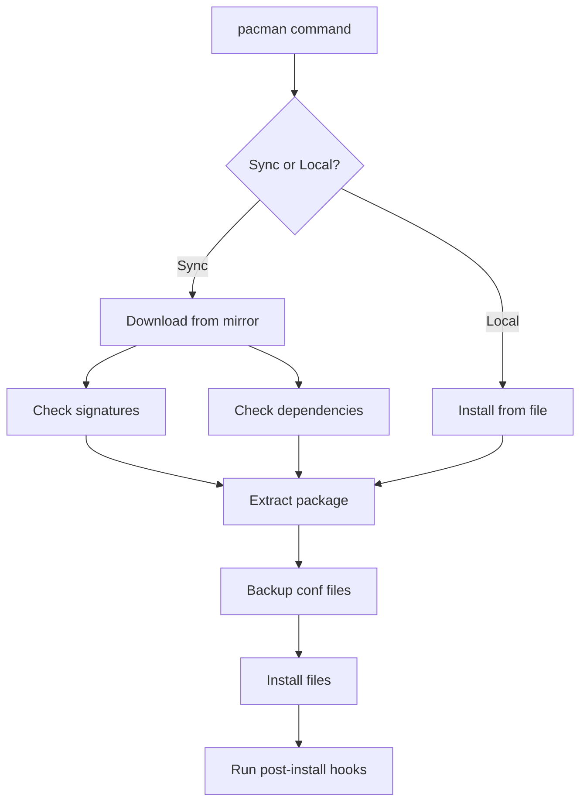
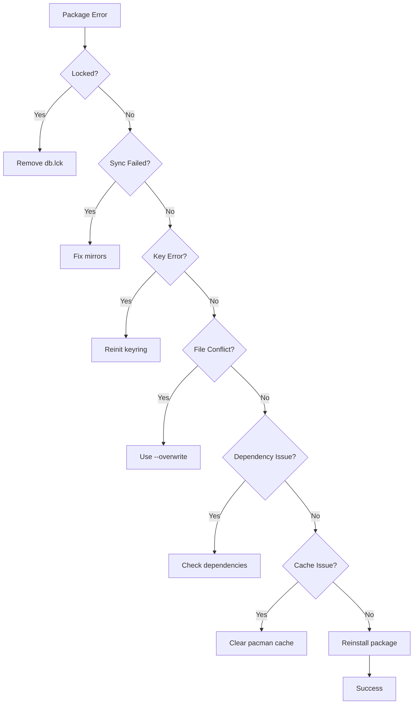

# Package Management Issues

This guide covers troubleshooting issues with pacman and package management on 01s Sovereign.

## pacman Architecture



## Common pacman Errors

### Database Locked

```
error: failed to init transaction (unable to lock database)
error: could not lock database: /var/lib/pacman/db.lck
```

**Solution**:

```bash
# Remove the lock file (only if no other pacman process is running)
sudo rm /var/lib/pacman/db.lck

# Check for running pacman processes
ps aux | grep pacman

# If lock persists, check filesystem
ls -la /var/lib/pacman/db.lck
```

### Failed to Synchronize All Databases

```
error: failed retrieving file 'core.db' from mirror
error: failed to synchronize all databases (unable to fetch some archives)
```

**Solutions**:

```bash
# Check internet connection
ping -c 4 8.8.8.8

# Check DNS resolution
nslookup mirror.archlinux.org

# Update mirrorlist
sudo pacman-mirrors --fasttrack
# Or manually edit:
sudo nano /etc/pacman.d/mirrorlist

# Force refresh
sudo pacman -Syy

# Check for proxy issues
echo $http_proxy
echo $https_proxy
```

### Keyring Errors

```
error: key "XXXXX" could not be looked up remotely
error: required key missing from keyring
```

**Solutions**:

```bash
# Update keyring
sudo pacman -Sy archlinux-keyring

# Reinitialize keyring
sudo rm -rf /etc/pacman.d/gnupg
sudo pacman-key --init
sudo pacman-key --populate archlinux

# Refresh keys
sudo pacman-key --refresh-keys

# Manually add a key (if you trust it)
sudo pacman-key --recv-keys KEY_ID
sudo pacman-key --lsign-key KEY_ID
```

### File Conflicts

```
error: failed to commit transaction (conflicting files)
<package>: /path/to/file exists in filesystem
```

**Solutions**:

```bash
# Overwrite conflicting files
sudo pacman -Syu --overwrite='*'

# Or manually remove the conflicting file
sudo rm /path/to/conflicting-file
sudo pacman -S package-name

# Check what owns the file
pacman -Qo /path/to/conflicting-file

# For specific overwrite
sudo pacman -S package-name --overwrite=/path/to/file
```

### Package Validation Failed

```
error: failed to commit transaction (invalid or corrupted package)
```

**Solutions**:

```bash
# Clear cache and retry
sudo pacman -Scc
sudo pacman -Syu

# Force reinstall
sudo pacman -S package-name --force

# Check download integrity
curl -I https://mirror.example.com/path/to/package.pkg.tar.zst
```

### pacman Error Code Reference

| Error Code | Message | Cause | Resolution |
|------------|---------|-------|------------|
| 1 | Operation not permitted | Permission denied | Run with sudo |
| 1 | Failed to init transaction | Database locked | Remove db.lck |
| 1 | Could not lock database | Lock file exists | Kill other pacman |
| 1 | Target not found | Package name wrong | Check spelling |
| 1 | No targets specified | Missing package name | Add package argument |
| 1 | Failed to commit transaction | Dependency issue | Check dependencies |
| 1 | Conflicting files | File owned by other pkg | Use --overwrite |
| 1 | Invalid or corrupted package | Download error | Clear cache, retry |
| 1 | Required key missing | Keyring outdated | Update keyring |
| 2 | No database files | Missing databases | Run pacman -Sy |
| 255 | SIGINT received | User interrupted | Run again |

## Dependency Issues

### Broken Dependencies

```
error: failed to prepare transaction (could not satisfy dependencies)
```

**Solutions**:

```bash
# Check what needs the dependency
pactree package-name

# Show why a package is being pulled
pacman -Si package-name

# Find what provides a library
pactree -r libexample.so

# Ignore dependency (last resort)
sudo pacman -Sdd package-name

# Check for conflicting dependencies
pacman -D --asexplicit package-name
```

### Orphaned Packages

```bash
# List orphaned packages
pacman -Qtdq

# Remove orphans
sudo pacman -Rns $(pacman -Qtdq)

# Check before removing (show details)
pacman -Qtd

# Remove orphaned packages interactively
sudo pacman -Rns $(pacman -Qtdq) --print
```

## AUR Issues

### yay Not Working

**Solutions**:

```bash
# Update yay
yay -Syu

# If yay is broken, rebuild manually
cd /tmp
git clone https://aur.archlinux.org/yay.git
cd yay
makepkg -si --overwrite='*'

# Alternative: use paru
yay -S paru

# Check yay config
cat ~/.config/yay/config.json
```

### AUR Package Fails to Build

**Solutions**:

```bash
# Clean build directory
cd ~/.cache/yay/package-name
makepkg -c

# Update PGP keys
gpg --recv-keys KEY_ID

# Skip PGP check (if you trust the source)
makepkg -si --skippgpcheck

# Check PKGBUILD for errors
cat PKGBUILD

# Ensure base-devel is installed
sudo pacman -S base-devel
```

### AUR Package Not Found

**Solutions**:

```bash
# Search more specifically
yay -Ss exact-package-name

# Check the AUR website
# https://aur.archlinux.org/packages/package-name

# Search by maintainer
yay -Ss ^maintainer-name
```

## Partial Upgrades

### System Update Interrupted

**Solutions**:

```bash
# Finish the update
sudo pacman -Syu

# If still broken, force reinstall all packages
sudo pacman -Syu --overwrite='*'

# Check for partial upgrades
pacman -Qkk 2>&1 | grep -v "0 missing files"

# Reinstall critical base packages
sudo pacman -S base linux --force
```

## Cache and Space Issues

### Disk Full During Update

**Solutions**:

```bash
# Clean package cache (keep last 2 versions)
sudo paccache -r

# Remove all cached packages
sudo paccache -rk 0

# Remove unused packages
sudo pacman -Sc

# Clean journal
sudo journalctl --vacuum-size=100M

# Find large files
du -sh /var/cache/pacman/pkg/

# List largest packages in cache
ls -lhS /var/cache/pacman/pkg/ | head -10
```

### Cache Corruption

**Solutions**:

```bash
# Clear and re-download
sudo pacman -Scc
sudo pacman -Syu
```

## Network Issues

### Mirror Slow or Unreachable

```bash
# Rank mirrors by speed
sudo pacman-mirrors --fasttrack

# Set specific mirrors
sudo nano /etc/pacman.d/mirrorlist

# Use reflector to auto-select
sudo pacman -S reflector
sudo reflector --latest 10 --protocol https --sort rate --save /etc/pacman.d/mirrorlist

# Test mirror speed manually
curl -o /dev/null -s -w '%{speed_download}\n' https://mirror.example.com/core/os/x86_64/core.db
```

### Proxy Configuration

```bash
# Set HTTP proxy for pacman
sudo tee -a /etc/pacman.conf << 'EOF'
XferCommand = /usr/bin/curl -x http://proxy:8080 -C - -f -o %o %u
EOF

# Or set environment variables
export http_proxy=http://proxy:8080
export https_proxy=http://proxy:8080
```

## Post-Update Issues

### System Broken After Update

**Solutions**:

```bash
# Boot from ISO, chroot, and fix
sudo mount /dev/sda2 /mnt
sudo arch-chroot /mnt

# Reinstall base packages
pacman -S base linux --force

# Downgrade problematic package
# Get previous version from cache
ls /var/cache/pacman/pkg/problem-package-*.pkg.tar.zst
pacman -U /var/cache/pacman/pkg/problem-package-old-version.pkg.tar.zst

# Regenerate GRUB
grub-mkconfig -o /boot/grub/grub.cfg

# Exit and reboot
exit
sudo reboot
```

### Application Won't Launch After Update

```bash
# Clear application cache
rm -rf ~/.cache/application-name

# Reinstall the application
sudo pacman -S application-name --force

# Check library dependencies
ldd $(which application-name)

# Check for missing shared libraries
# Output: "not found" indicates missing dependency
ldd $(which application-name) | grep "not found"
```

## Corrupted Package DB Recovery

```bash
# Backup current database
sudo cp -r /var/lib/pacman/local /var/lib/pacman/local.backup

# Force re-download databases
sudo pacman -Syy

# Check database integrity
sudo pacman -Dk

# If still broken, restore from backup
sudo rm -rf /var/lib/pacman/local
sudo cp -r /var/lib/pacman/local.backup /var/lib/pacman/local

# As last resort, reinitialize
sudo rm -rf /var/lib/pacman/
sudo pacman-key --init
sudo pacman-key --populate archlinux
sudo pacman -Syy
sudo pacman -S base --force
```

## Troubleshooting Workflow



## Prevention

```bash
# Regularly:
# 1. Sync databases
sudo pacman -Sy

# 2. Update system
sudo pacman -Syu

# 3. Clean cache
sudo paccache -r

# 4. Remove orphans
sudo pacman -Rns $(pacman -Qtdq)

# 5. Check integrity
sudo pacman -Qkk

# 6. Automate with systemd timer
cat > /etc/systemd/system/01s-pacman-maintenance.service << 'SERVICE'
[Unit]
Description=01s pacman maintenance
[Service]
Type=oneshot
ExecStart=sudo pacman -Syu --noconfirm
ExecStartPost=sudo paccache -r
ExecStartPost=sudo pacman -Rns $(pacman -Qtdq) --noconfirm
SERVICE
```

---

## See Also

- [Managing Packages](../tutorial/14-managing-packages.md)
- [Post-Installation Setup](../tutorial/07-post-installation-setup.md)
- [Getting Support](09-getting-support.md)
## Advanced Diagnostic Procedures

### Ledger Performance Profiling

```bash
# Profile ledger operations
time 01s-ledger verify
time 01s-ledger export > /dev/null
time 01s-ledger status

# Check ledger file size growth
watch -n 60 'du -sh ~/ledger/'

# Monitor system resources during ledger operations
top -b -n 1 | grep "01s-ledger"
```

### Network Diagnostic Procedures

```bash
# Full network diagnostic suite
echo "=== Network Diagnostics ==="
echo "--- Interfaces ---"
ip link show
echo "--- IP Addresses ---"
ip addr show
echo "--- Routing ---"
ip route show
echo "--- DNS ---"
cat /etc/resolv.conf
echo "--- Connectivity ---"
ping -c 2 8.8.8.8
echo "--- Open Ports ---"
ss -tulpn
```

### System Health Check Script

```bash
#!/bin/bash
# health-check.sh
echo "=== System Health Check ==="
echo "Date: $(date)"
echo ""
echo "--- CPU ---"
top -bn1 | grep "Cpu(s)"
echo ""
echo "--- Memory ---"
free -h
echo ""
echo "--- Disk ---"
df -h /
echo ""
echo "--- Load ---"
uptime
echo ""
echo "--- Services ---"
systemctl --failed
echo ""
echo "--- Ledger ---"
01s-ledger verify > /dev/null 2>&1 && echo "Ledger: OK" || echo "Ledger: FAILED"
echo ""
echo "--- Last Boot ---"
who -b
```

## Common Troubleshooting Scenarios

### Scenario 1: System Won't Wake from Suspend

**Symptoms**: Screen stays black, system unresponsive after opening laptop lid.
**Causes**: GPU driver issue, ACPI problem, firmware bug.

**Diagnostic Steps**:
1. Try switching TTY (Ctrl+Alt+F2)
2. If TTY works, restart GDM: `sudo systemctl restart gdm`
3. Check kernel messages: `dmesg | grep -i "drm\|gpu\|acpi"`
4. Check journal: `journalctl -b | grep -i "resume\|suspend"`
5. Test with different kernel parameters: `acpi=off`, `nouveau.modeset=0`

### Scenario 2: Bluetooth Device Won't Pair

**Symptoms**: Device discovered but pairing fails.
**Causes**: Wrong PIN, driver issue, device compatibility.

**Diagnostic Steps**:
1. Restart Bluetooth: `sudo systemctl restart bluetooth`
2. Remove and re-scan: `bluetoothctl remove XX:XX:XX:XX:XX:XX`
3. Check kernel module: `lsmod | grep bluetooth`
4. Try manual pairing: `bluetoothctl pair XX:XX:XX:XX:XX:XX`
5. Check compatibility list for your device

### Scenario 3: USB Device Not Recognized

**Symptoms**: Device plugged in but not detected.
**Causes**: Driver missing, power issue, hardware fault.

**Diagnostic Steps**:
1. Check dmesg: `dmesg | tail -20` (look for USB-related messages)
2. List USB devices: `lsusb`
3. Check power: `cat /sys/bus/usb/devices/*/power/control`
4. Reset USB: `sudo modprobe -r usbcore && sudo modprobe usbcore`
5. Try different port or cable

## Package Management Best Practices

### Pre-Update Checklist

```bash
# Before running system updates:
echo "=== Pre-Update Checks ==="
echo "1. Check disk space: $(df -h / | tail -1 | awk '{print $4}') free"
echo "2. Check memory: $(free -h | grep Mem | awk '{print $7}') available"
echo "3. Backup ledger: $(01s-ledger verify > /dev/null 2>&1 && echo 'OK' || echo 'FAILED')"
echo "4. Check internet: $(ping -c 1 8.8.8.8 > /dev/null 2>&1 && echo 'OK' || echo 'FAILED')"
echo "5. Check battery: $(cat /sys/class/power_supply/BAT0/capacity 2>/dev/null || echo 'N/A')%"
```

### Post-Update Checklist

```bash
# After running system updates:
echo "=== Post-Update Checks ==="
sudo pacman -Qkk | grep -v "0 missing files" || echo "All files verified"
01s-ledger verify && echo "Ledger chain intact" || echo "Ledger FAILED"
01s-ledger toolchain && echo "Toolchain verified" || echo "Toolchain FAILED"
systemctl --failed || echo "All services running"
```

### Package Cache Management

```bash
# Automatic cache cleanup
cat > /etc/systemd/system/paccache-clean.service << 'EOF'
[Unit]
Description=Clean pacman cache

[Service]
Type=oneshot
ExecStart=/usr/bin/paccache -r
ExecStart=/usr/bin/paccache -rk 2
EOF

cat > /etc/systemd/system/paccache-clean.timer << 'EOF'
[Unit]
Description=Weekly pacman cache cleanup

[Timer]
OnCalendar=weekly
Persistent=true

[Install]
WantedBy=timers.target
EOF

sudo systemctl enable --now paccache-clean.timer
```

## User Support Escalation Path

### L1: Self-Service (User)

1. Check documentation
2. Search known issues
3. Try listed workarounds
4. Check FAQ
5. Review system logs

### L2: Community Support (Peer)

1. Ask in Matrix chat
2. Post on GitHub Discussions
3. Search GitHub Issues
4. Ask on mailing list
5. Request help from community

### L3: Technical Support (Maintainer)

1. Create GitHub Issue
2. Include system information
3. Provide reproduction steps
4. Attach relevant logs
5. Wait for maintainer response

### L4: Enterprise Support (Dedicated)

1. Submit support ticket
2. Call dedicated hotline
3. Request live assistance
4. Schedule remote session
5. Request on-site visit

## Performance Tuning Guide

### CPU Performance Tuning

```bash
# Check CPU governor
cat /sys/devices/system/cpu/cpu*/cpufreq/scaling_governor

# Set performance governor
echo performance | sudo tee /sys/devices/system/cpu/cpu*/cpufreq/scaling_governor

# Disable C-states (reduce latency)
sudo nano /etc/default/grub
# Add: processor.max_cstate=1 intel_idle.max_cstate=0
sudo grub-mkconfig -o /boot/grub/grub.cfg
```

### Memory Performance Tuning

```bash
# Reduce swappiness
echo 10 | sudo tee /proc/sys/vm/swappiness

# Enable swap compression (zram)
sudo pacman -S zram-generator
sudo systemctl enable --now systemd-zram-setup@zram0

# Check swap usage
swapon --show

# Clear memory cache (temporary)
echo 3 | sudo tee /proc/sys/vm/drop_caches
```

### Disk Performance Tuning

```bash
# Check I/O scheduler
cat /sys/block/sda/queue/scheduler

# Set scheduler to none (NVMe) or mq-deadline (SSD)
echo none | sudo tee /sys/block/nvme0n1/queue/scheduler

# Enable TRIM for SSDs
sudo systemctl enable --now fstrim.timer

# Check disk health
sudo smartctl -a /dev/sda | grep -i "health\|temperature\|reallocated"
```

---

Lois-Kleinner and 0-1.gg 2026 Copyright

```
.====================================================================.
!  Made in the UAE, Dubai #DubaiIt #Dubai #Dxb #SovereignAI          !
!  Made in The Emirates #Dubai_it                                    !
!                                                                    !
!  Lois-Kleinner Alpasan - The Anticloud 2026-                       !
!                                                                    !
!  0-1.gg ! GitHub ! LinkedIn ! DEV ! GH Pages                       !
!  HuggingFace ! Blog ! Tumblr ! Fandom ! Bluesky ! Mastodon          !
!  Zenodo ! Harvard Dataverse ! Internet Archive ! ORCID              !
!                                                                    !
!  Sovereign AI ! Local-First ! Privacy ! Zero Trust ! No Datacenter !
!  Air-Gapped ! Open Source ! Rust ! Hash Chain ! Single Binary      !
!  Offline LLM ! Crypto Ledger ! P2P ! Federated                     !
'===================================================================='
```

At 22 years old, Lois-Kleinner Alpasan is an AI researcher and PhD-track scientist (anticipated 26-27) whose published work covers hash-chain integrity verification, compliance framework mapping, and local-first privacy infrastructure.

References:
1. Lois-Kleinner Zenodo: https://doi.org/10.5281/zenodo.20781790
2. Lois-Kleinner GitHub: https://github.com/kleinnner/Anticloud/tree/main/04-aioss-format
3. Lois-Kleinner Harvard DV: https://doi.org/10.7910/DVN/GKUDHE
4. Lois-Kleinner Internet Arc: https://archive.org/details/aioss-format
5. Lois-Kleinner ORCID: https://orcid.org/0009-0009-2233-6107
6. Lois-Kleinner DEV.to: https://dev.to/kleinner
7. Lois-Kleinner LinkedIn: https://linkedin.com/in/kleinner
8. Lois-Kleinner HuggingFace: https://huggingface.co/Anticloud
9. Lois-Kleinner Tumblr: https://anticloud.tumblr.com
10. Lois-Kleinner Mastodon: https://mastodon.social/@kleinner
11. Lois-Kleinner Bluesky: https://bsky.app/profile/kleinner.bsky.social
12. 0-1.gg: https://0-1.gg
