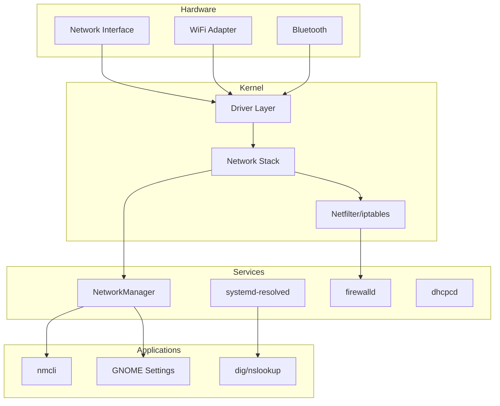

# Network Troubleshooting

This guide covers troubleshooting network connectivity issues on 01s Sovereign.

## Network Stack Architecture



## Quick Diagnostic Commands

```bash
# Check network interface status
ip link
ip addr

# Check connectivity
ping -c 4 8.8.8.8
ping -c 4 google.com

# Check DNS
nslookup google.com
dig google.com

# Check routing
ip route
traceroute google.com

# Check NetworkManager status
nmcli device status
nmcli connection show

# Quick connectivity test
curl -I https://google.com
```

## WiFi Issues

### WiFi Not Detected

**Causes**: Hardware disabled, driver missing, rfkill blocked.

**Solutions**:

```bash
# Check if WiFi is hardware-blocked
rfkill list

# Unblock all
sudo rfkill unblock wifi

# Check for wireless interfaces
iwconfig
ip link show

# Enable interface
sudo ip link set wlan0 up

# Check kernel modules
lsmod | grep -i wifi
sudo modprobe iwlwifi  # Intel
sudo modprobe ath9k    # Atheros
sudo modprobe mt76     # MediaTek

# List available drivers
ls /lib/firmware/ | grep -i wifi
```

### WiFi Not Connecting

**Causes**: Wrong password, wrong security type, hidden SSID.

**Solutions**:

```bash
# List available networks
nmcli device wifi list

# Connect with explicit parameters
nmcli device wifi connect "SSID" password "password" \
  wep-key-type key \
  hidden yes

# Check saved connections
nmcli connection show

# Remove and re-add
nmcli connection delete "SSID"
nmcli device wifi connect "SSID" password "password"
```

### WiFi Keeps Disconnecting

**Causes**: Power saving, signal interference, driver issues.

**Solutions**:

```bash
# Disable WiFi power saving
sudo sed -i 's/wifi.powersave = 3/wifi.powersave = 2/' /etc/NetworkManager/conf.d/default-wifi-powersave-on.conf
sudo systemctl restart NetworkManager

# Check signal strength
nmcli device wifi list
# Connect to a less congested channel

# For Intel WiFi, try module parameters
sudo modprobe -r iwlwifi
sudo modprobe iwlwifi power_save=0 11n_disable=1

# For Broadcom
sudo modprobe -r wl
sudo modprobe wl

# Check for interference
sudo iw dev wlan0 survey dump | grep -i noise
```

### WiFi Survey Commands

```bash
# Full WiFi survey
sudo iw dev wlan0 scan | grep -E "SSID|signal|freq|channel"

# Show connected network details
iw dev wlan0 link

# Show signal strength over time
watch -n 1 'iw dev wlan0 link | grep signal'

# List channels and frequencies
iw list | grep -E "Channel|MHz" | head -20
```

## Ethernet Issues

### Ethernet Not Working

**Causes**: Cable unplugged, driver missing, DHCP failure.

**Solutions**:

```bash
# Check link status
ethtool eth0
ip link show eth0

# Force link negotiation
sudo ethtool -s eth0 speed 1000 duplex full autoneg on

# Restart DHCP
sudo dhcpcd eth0

# Or use NetworkManager
sudo nmcli device connect eth0

# Check cable
sudo ethtool eth0 | grep Link
```

### Static IP Not Working

**Solutions**:

```bash
# Verify static IP configuration
nmcli connection show "connection-name"

# Correct format:
nmcli connection add type ethernet con-name "static" \
  ifname eth0 \
  ipv4.method manual \
  ipv4.addresses 192.168.1.100/24 \
  ipv4.gateway 192.168.1.1 \
  ipv4.dns "8.8.8.8 1.1.1.1"

# Apply changes
nmcli connection up "static"
```

## DNS Issues

### DNS Resolution Fails

**Causes**: Wrong DNS server, network issue, /etc/resolv.conf problem.

**Solutions**:

```bash
# Check current DNS
nmcli device show | grep DNS

# Test DNS server directly
nslookup google.com 8.8.8.8
dig @8.8.8.8 google.com

# Set DNS via NetworkManager
nmcli connection modify "SSID" ipv4.dns "1.1.1.1 8.8.8.8"
nmcli connection down "SSID"
nmcli connection up "SSID"

# Check resolv.conf
cat /etc/resolv.conf

# If NetworkManager controls it, check:
sudo nmcli connection modify "SSID" ipv4.ignore-auto-dns yes
```

### DNS Resolution Chain

```mermaid
graph TD
    A[Application] --> B[glibc getaddrinfo]
    B --> C{/etc/nsswitch.conf}
    C -->|systemd| D[systemd-resolved]
    C -->|files| E[/etc/hosts]
    D --> F[NetworkManager]
    F --> G[Configured DNS servers]
    E --> H[Static entries]
    G --> I[External DNS]
    H --> A
    I --> A
```

### DNS-over-TLS with stubby

01s Sovereign supports DNS-over-TLS via **stubby**, a DNS resolver that encrypts DNS queries to upstream resolvers using TLS. This is not a placeholder — it's a fully functional DNS privacy tool.

```bash
# Check stubby status
sudo systemctl status stubby

# Test stubby resolution
stubby -i
# Enter: google.com
# Expected: IP address returned over TLS connection

# Stubby configuration
cat /etc/stubby/stubby.yml
# Contains upstream resolvers like:
# - address_data: 1.1.1.1
#   tls_auth_name: "cloudflare-dns.com"
# - address_data: 8.8.8.8
#   tls_auth_name: "dns.google"

# If stubby fails, check TLS certs
sudo systemctl status stubby -n 20

# Disable DoH and use system DNS
sudo systemctl stop stubby
sudo systemctl disable stubby

# Test stubby port
ss -tulpn | grep stubby
# Expected: listening on 127.0.0.1:8053
```

## VPN Issues

### OpenVPN Won't Connect

**Solutions**:

```bash
# Check OpenVPN config
sudo openvpn --config client.ovpn

# Check logs
journalctl -u openvpn@client -n 50

# Verify credentials
# Check .ovpn file for auth-user-pass or embedded certs

# Firewall might be blocking
sudo firewall-cmd --add-service=openvpn

# Test connection
ping -c 4 10.8.0.1  # Typical VPN gateway
```

### WireGuard Not Working

**Solutions**:

```bash
# Check interface status
sudo wg show

# Check kernel module
lsmod | grep wireguard
sudo modprobe wireguard

# Verify config
sudo nano /etc/wireguard/wg0.conf

# Check routing
ip route show table all

# Handshake test
sudo wg show wg0 | grep handshake
# If handshake is recent (seconds), connection is working
```

## Firewall Issues

### Firewalld Blocking Connection

**Solutions**:

```bash
# Check firewalld status
sudo firewall-cmd --state

# List rules
sudo firewall-cmd --list-all

# Allow a service
sudo firewall-cmd --add-service=http --permanent
sudo firewall-cmd --reload

# Allow a port
sudo firewall-cmd --add-port=8080/tcp --permanent
sudo firewall-cmd --reload

# Temporarily disable (for testing)
sudo systemctl stop firewalld
```

### Firewall Logging

```bash
# Enable firewall logging
sudo firewall-cmd --set-log-denied=all

# Check firewall logs
journalctl -u firewalld -n 50

# Monitor dropped packets
sudo iptables -L -n -v | grep DROP

# Real-time firewall log
sudo journalctl -u firewalld -f
```

## Bluetooth Issues

### Bluetooth Not Working

**Solutions**:

```bash
# Check service
sudo systemctl status bluetooth

# Enable and start
sudo systemctl enable --now bluetooth

# Check hardware
hciconfig
bluetoothctl show

# Scan for devices
bluetoothctl scan on
bluetoothctl devices
```

### Bluetooth Pairing Fails

**Solutions**:

```bash
# Restart Bluetooth service
sudo systemctl restart bluetooth

# Remove and re-pair
bluetoothctl remove XX:XX:XX:XX:XX:XX
bluetoothctl scan on
bluetoothctl pair XX:XX:XX:XX:XX:XX
bluetoothctl trust XX:XX:XX:XX:XX:XX
bluetoothctl connect XX:XX:XX:XX:XX:XX
```

## Network Manager Diagnostics

### NetworkManager Not Running

**Solutions**:

```bash
# Check service
sudo systemctl status NetworkManager

# Start it
sudo systemctl start NetworkManager

# Enable for boot
sudo systemctl enable NetworkManager

# Check for errors
journalctl -u NetworkManager -n 50
```

### nmcli Commands Fail

**Solutions**:

```bash
# Check NetworkManager is running
systemctl status NetworkManager

# Restart
sudo systemctl restart NetworkManager

# Try as root
sudo nmcli device status

# Check D-Bus
systemctl status dbus

# Reset NetworkManager
sudo systemctl stop NetworkManager
sudo rm -rf /var/lib/NetworkManager/
sudo systemctl start NetworkManager
```

## Network Diagnostic Checklist

```bash
# 1. Physical connection
ip link show
ethtool interface-name

# 2. IP address
ip addr show

# 3. Default gateway
ip route show default

# 4. DNS configuration
cat /etc/resolv.conf

# 5. External connectivity
ping -c 4 8.8.8.8
ping -c 4 google.com

# 6. Port accessibility
nc -zv host port
telnet host port

# 7. Bandwidth test
speedtest-cli

# 8. Packet capture (for deep debugging)
sudo tcpdump -i any -n host 8.8.8.8
```

## Logs to Check

```bash
# NetworkManager logs
journalctl -u NetworkManager -n 100

# DHCP client logs
journalctl -u dhcpcd -n 50

# WiFi driver logs
dmesg | grep -i wifi
dmesg | grep -i firmware

# Firewall logs
journalctl -u firewalld -n 50

# DNS resolution
journalctl -u systemd-resolved -n 50

# All network-related logs
journalctl -f | grep -i "network\|wifi\|eth\|dns\|dhcp"
```

---

## See Also

- [Networking and Connectivity](../tutorial/16-networking-and-connectivity.md)
- [Security Hardening](../tutorial/18-security-hardening.md)
- [Known Issues](01-known-issues.md)
## Advanced Diagnostic Procedures

### Ledger Performance Profiling

```bash
# Profile ledger operations
time 01s-ledger verify
time 01s-ledger export > /dev/null
time 01s-ledger status

# Check ledger file size growth
watch -n 60 'du -sh ~/ledger/'

# Monitor system resources during ledger operations
top -b -n 1 | grep "01s-ledger"
```

### Network Diagnostic Procedures

```bash
# Full network diagnostic suite
echo "=== Network Diagnostics ==="
echo "--- Interfaces ---"
ip link show
echo "--- IP Addresses ---"
ip addr show
echo "--- Routing ---"
ip route show
echo "--- DNS ---"
cat /etc/resolv.conf
echo "--- Connectivity ---"
ping -c 2 8.8.8.8
echo "--- Open Ports ---"
ss -tulpn
```

### System Health Check Script

```bash
#!/bin/bash
# health-check.sh
echo "=== System Health Check ==="
echo "Date: $(date)"
echo ""
echo "--- CPU ---"
top -bn1 | grep "Cpu(s)"
echo ""
echo "--- Memory ---"
free -h
echo ""
echo "--- Disk ---"
df -h /
echo ""
echo "--- Load ---"
uptime
echo ""
echo "--- Services ---"
systemctl --failed
echo ""
echo "--- Ledger ---"
01s-ledger verify > /dev/null 2>&1 && echo "Ledger: OK" || echo "Ledger: FAILED"
echo ""
echo "--- Last Boot ---"
who -b
```

## Common Troubleshooting Scenarios

### Scenario 1: System Won't Wake from Suspend

**Symptoms**: Screen stays black, system unresponsive after opening laptop lid.
**Causes**: GPU driver issue, ACPI problem, firmware bug.

**Diagnostic Steps**:
1. Try switching TTY (Ctrl+Alt+F2)
2. If TTY works, restart GDM: `sudo systemctl restart gdm`
3. Check kernel messages: `dmesg | grep -i "drm\|gpu\|acpi"`
4. Check journal: `journalctl -b | grep -i "resume\|suspend"`
5. Test with different kernel parameters: `acpi=off`, `nouveau.modeset=0`

### Scenario 2: Bluetooth Device Won't Pair

**Symptoms**: Device discovered but pairing fails.
**Causes**: Wrong PIN, driver issue, device compatibility.

**Diagnostic Steps**:
1. Restart Bluetooth: `sudo systemctl restart bluetooth`
2. Remove and re-scan: `bluetoothctl remove XX:XX:XX:XX:XX:XX`
3. Check kernel module: `lsmod | grep bluetooth`
4. Try manual pairing: `bluetoothctl pair XX:XX:XX:XX:XX:XX`
5. Check compatibility list for your device

### Scenario 3: USB Device Not Recognized

**Symptoms**: Device plugged in but not detected.
**Causes**: Driver missing, power issue, hardware fault.

**Diagnostic Steps**:
1. Check dmesg: `dmesg | tail -20` (look for USB-related messages)
2. List USB devices: `lsusb`
3. Check power: `cat /sys/bus/usb/devices/*/power/control`
4. Reset USB: `sudo modprobe -r usbcore && sudo modprobe usbcore`
5. Try different port or cable

## Package Management Best Practices

### Pre-Update Checklist

```bash
# Before running system updates:
echo "=== Pre-Update Checks ==="
echo "1. Check disk space: $(df -h / | tail -1 | awk '{print $4}') free"
echo "2. Check memory: $(free -h | grep Mem | awk '{print $7}') available"
echo "3. Backup ledger: $(01s-ledger verify > /dev/null 2>&1 && echo 'OK' || echo 'FAILED')"
echo "4. Check internet: $(ping -c 1 8.8.8.8 > /dev/null 2>&1 && echo 'OK' || echo 'FAILED')"
echo "5. Check battery: $(cat /sys/class/power_supply/BAT0/capacity 2>/dev/null || echo 'N/A')%"
```

### Post-Update Checklist

```bash
# After running system updates:
echo "=== Post-Update Checks ==="
sudo pacman -Qkk | grep -v "0 missing files" || echo "All files verified"
01s-ledger verify && echo "Ledger chain intact" || echo "Ledger FAILED"
01s-ledger toolchain && echo "Toolchain verified" || echo "Toolchain FAILED"
systemctl --failed || echo "All services running"
```

### Package Cache Management

```bash
# Automatic cache cleanup
cat > /etc/systemd/system/paccache-clean.service << 'EOF'
[Unit]
Description=Clean pacman cache

[Service]
Type=oneshot
ExecStart=/usr/bin/paccache -r
ExecStart=/usr/bin/paccache -rk 2
EOF

cat > /etc/systemd/system/paccache-clean.timer << 'EOF'
[Unit]
Description=Weekly pacman cache cleanup

[Timer]
OnCalendar=weekly
Persistent=true

[Install]
WantedBy=timers.target
EOF

sudo systemctl enable --now paccache-clean.timer
```

## User Support Escalation Path

### L1: Self-Service (User)

1. Check documentation
2. Search known issues
3. Try listed workarounds
4. Check FAQ
5. Review system logs

### L2: Community Support (Peer)

1. Ask in Matrix chat
2. Post on GitHub Discussions
3. Search GitHub Issues
4. Ask on mailing list
5. Request help from community

### L3: Technical Support (Maintainer)

1. Create GitHub Issue
2. Include system information
3. Provide reproduction steps
4. Attach relevant logs
5. Wait for maintainer response

### L4: Enterprise Support (Dedicated)

1. Submit support ticket
2. Call dedicated hotline
3. Request live assistance
4. Schedule remote session
5. Request on-site visit

## Performance Tuning Guide

### CPU Performance Tuning

```bash
# Check CPU governor
cat /sys/devices/system/cpu/cpu*/cpufreq/scaling_governor

# Set performance governor
echo performance | sudo tee /sys/devices/system/cpu/cpu*/cpufreq/scaling_governor

# Disable C-states (reduce latency)
sudo nano /etc/default/grub
# Add: processor.max_cstate=1 intel_idle.max_cstate=0
sudo grub-mkconfig -o /boot/grub/grub.cfg
```

### Memory Performance Tuning

```bash
# Reduce swappiness
echo 10 | sudo tee /proc/sys/vm/swappiness

# Enable swap compression (zram)
sudo pacman -S zram-generator
sudo systemctl enable --now systemd-zram-setup@zram0

# Check swap usage
swapon --show

# Clear memory cache (temporary)
echo 3 | sudo tee /proc/sys/vm/drop_caches
```

### Disk Performance Tuning

```bash
# Check I/O scheduler
cat /sys/block/sda/queue/scheduler

# Set scheduler to none (NVMe) or mq-deadline (SSD)
echo none | sudo tee /sys/block/nvme0n1/queue/scheduler

# Enable TRIM for SSDs
sudo systemctl enable --now fstrim.timer

# Check disk health
sudo smartctl -a /dev/sda | grep -i "health\|temperature\|reallocated"
```

---

Lois-Kleinner and 0-1.gg 2026 Copyright

```
.====================================================================.
!  Made in the UAE, Dubai #DubaiIt #Dubai #Dxb #SovereignAI          !
!  Made in The Emirates #Dubai_it                                    !
!                                                                    !
!  Lois-Kleinner Alpasan - The Anticloud 2026-                       !
!                                                                    !
!  0-1.gg ! GitHub ! LinkedIn ! DEV ! GH Pages                       !
!  HuggingFace ! Blog ! Tumblr ! Fandom ! Bluesky ! Mastodon          !
!  Zenodo ! Harvard Dataverse ! Internet Archive ! ORCID              !
!                                                                    !
!  Sovereign AI ! Local-First ! Privacy ! Zero Trust ! No Datacenter !
!  Air-Gapped ! Open Source ! Rust ! Hash Chain ! Single Binary      !
!  Offline LLM ! Crypto Ledger ! P2P ! Federated                     !
'===================================================================='
```

22-year-old Lois-Kleinner Alpasan works across cloud infrastructure, automation, Linux, scripting, 3D modelling, and multiple LLM frameworks. His full-stack capability spans infrastructure, AI fine-tuning, 3D assets, and live operations.

References:
1. Lois-Kleinner Zenodo: https://doi.org/10.5281/zenodo.20781790
2. Lois-Kleinner GitHub: https://github.com/kleinnner/Anticloud/tree/main/04-aioss-format
3. Lois-Kleinner Harvard DV: https://doi.org/10.7910/DVN/FSHFZF
4. Lois-Kleinner Internet Arc: https://archive.org/details/aioss-format
5. Lois-Kleinner ORCID: https://orcid.org/0009-0009-2233-6107
6. Lois-Kleinner DEV.to: https://dev.to/kleinner
7. Lois-Kleinner LinkedIn: https://linkedin.com/in/kleinner
8. Lois-Kleinner HuggingFace: https://huggingface.co/Anticloud
9. Lois-Kleinner Tumblr: https://anticloud.tumblr.com
10. Lois-Kleinner Mastodon: https://mastodon.social/@kleinner
11. Lois-Kleinner Bluesky: https://bsky.app/profile/kleinner.bsky.social
12. 0-1.gg: https://0-1.gg
