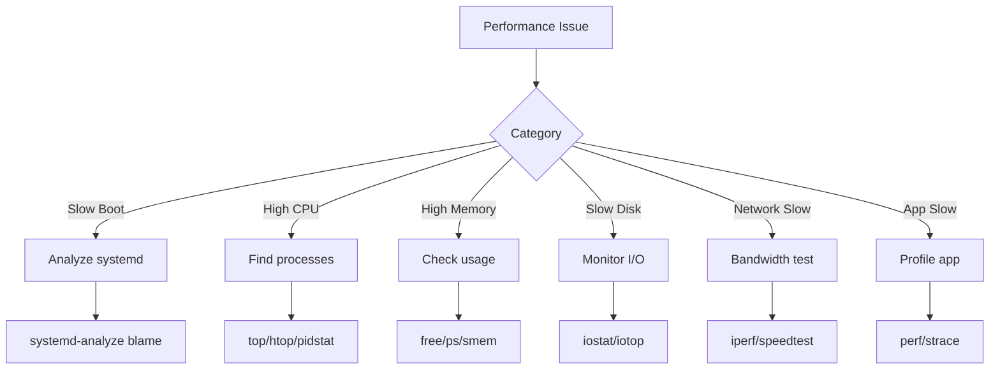

# Performance Problems

This guide covers troubleshooting performance issues on 01s Sovereign.

## Performance Analysis Framework



## Slow Boot

### Analyze Boot Time

```bash
# Overall boot time
systemd-analyze

# Per-service boot time (descending)
systemd-analyze blame

# Critical chain (longest path)
systemd-analyze critical-chain

# Graphical boot chart
systemd-analyze plot > boot.svg

# Per-user service startup
systemd-analyze blame --user
```

### Common Boot Slowdowns

**1. NetworkManager waiting for network**

```bash
# Disable network wait
sudo systemctl disable NetworkManager-wait-online.service
```

**2. Too many services starting in parallel**

```bash
# Check /etc/systemd/system.conf for:
# DefaultTimeoutStartSec=10s  # Reduce from default 90s

# View service startup order
systemd-analyze critical-chain
```

**3. Ledger initialization**

```bash
# The boot ledger check may be slow on first boot
# Check status
systemctl status 01s-boot.service

# Time the ledger check
time 01s-ledger verify
```

**4. Plymouth splash**

```bash
# Plymouth can delay boot on some GPUs
# Disable to test
sudo sed -i 's/quiet splash/quiet/' /etc/default/grub
sudo grub-mkconfig -o /boot/grub/grub.cfg
```

### Boot Time Optimization Table

| Service | Typical Impact | Optimization | Time Saved |
|---------|---------------|--------------|------------|
| NetworkManager-wait-online | 10-30s | Disable if not needed | 10-30s |
| Plymouth | 2-5s | Disable on NVIDIA | 2-5s |
| 01s-boot | 1-3s | Reduce ledger check scope | 1-2s |
| bluetooth | 1-2s | Disable if no BT | 1-2s |
| cups | 1-3s | Disable if no printing | 1-3s |
| systemd-journal-flush | 1-10s | Limit journal size | 1-5s |
| lvm2-monitor | 1-5s | Skip if no LVM | 1-5s |

## High Memory Usage

### Identify Memory Hogs

```bash
# Show processes by memory usage
ps aux --sort=-%mem | head -20

# Using htop
htop
# Press F6, select PERCENT_MEM

# Show memory details
free -h
cat /proc/meminfo

# Check for memory leaks (watch over time)
watch -n 5 'ps aux --sort=-%mem | head -10'

# Detailed process memory
smem -t -p | head -20

# Swap usage
swapon --show
```

### Common Memory Issues

**1. GNOME Shell memory growth**

```bash
# Check GNOME Shell RSS
ps -o pid,rss,comm -p $(pgrep -x gnome-shell)

# Restart if too high (>500MB)
killall -3 gnome-shell

# Monitor over time
while sleep 60; do
  echo "$(date): $(ps -o rss= -p $(pgrep -x gnome-shell)) KB"
done
```

**2. Ledger in watch mode**

```bash
# Watch mode uses some memory
# Increase interval to reduce impact
01s-ledger watch 300  # Every 5 minutes
```

**3. Firefox memory usage**

```bash
# Reduce content processes
# In about:config set:
dom.ipc.processCount = 2

# Enable memory savings
browser.sessionhistory.max_total_viewers = 4
```

**4. System cache**

```bash
# Linux uses free RAM for caching
# This is normal and beneficial
# If you need memory freed:
echo 3 | sudo tee /proc/sys/vm/drop_caches
```

### Memory Optimization

```bash
# Reduce swappiness
echo 10 | sudo tee /proc/sys/vm/swappiness

# Enable ZRAM
sudo pacman -S zram-generator
sudo systemctl enable --now systemd-zram-setup@zram0

# Limit journal size
sudo journalctl --vacuum-size=100M

# Disable unnecessary services
sudo systemctl disable --now bluetooth.service
sudo systemctl disable --now cups.service

# Set vm overcommit
echo 2 | sudo tee /proc/sys/vm/overcommit_memory
```

## High CPU Usage

### Identify CPU Hogs

```bash
# Show processes by CPU usage
ps aux --sort=-%cpu | head -20

# Real-time monitoring
top
htop

# Per-core usage
mpstat -P ALL 1

# Check for process spikes over time
uptime
cat /proc/loadavg

# Process-level CPU profiling
pidstat -p PID 1
```

### Common CPU Issues

**1. GNOME Shell high CPU**

```bash
# Check for extension issues
gnome-extensions list | while read ext; do
    echo "Disabling $ext..."
    gnome-extensions disable "$ext"
done

# Re-enable one by one to find the culprit
```

**2. Toolchain compilation**

```bash
# Compilation is CPU-intensive by design
# Limit parallelism:
# In Makefile: make -j1
# Or with cargo: CARGO_BUILD_JOBS=1 cargo build
```

**3. Conky widget**

```bash
# Conky uses some CPU for updates
# Increase update interval in ~/.config/conky/01s.conf
# update_interval = 5  (default is 1-2)

# Reduce number of Conky scripts
```

**4. systemd-journald**

```bash
# Check journal CPU usage
# Limit journal size
sudo journalctl --vacuum-size=100M

# Limit journal rate
sudo nano /etc/systemd/journald.conf
# RateLimitIntervalSec=10s
# RateLimitBurst=1000
```

## High Disk I/O

### Identify I/O Issues

```bash
# Show I/O usage
sudo iotop -o

# Disk stats
iostat -x 1

# Find I/O-heavy processes
sudo iotop -b -n 1 | sort -k4 -r | head -10

# Check disk latency
iostat -x 1 | grep -v "^$" | grep -v "^avg-cpu"

# Check queue depth
cat /sys/block/sda/queue/nr_requests
```

### I/O Bottleneck Detection

| Metric | Good | Warning | Critical |
|--------|------|---------|----------|
| %util (iostat) | < 50% | 50-80% | > 80% |
| await (ms) | < 5 | 5-20 | > 20 |
| svctm (ms) | < 3 | 3-10 | > 10 |
| r_await (ms) | < 5 | 5-15 | > 15 |
| w_await (ms) | < 5 | 5-15 | > 15 |
| queue size | < 1 | 1-5 | > 5 |

### Common I/O Issues

**1. Ledger writes**

```bash
# Ledger writes are small (JSON append)
# Each entry is <1KB
# For heavy usage, move ledger to SSD

# Check ledger write rate
while sleep 1; do
  stat -c%s ~/ledger/$(date +%Y-%m-%d).aioss
done
```

**2. pacman updates**

```bash
# Downloads and extracts packages
# Schedule updates during low-usage times

# Use faster mirrors
sudo pacman-mirrors --fasttrack
```

**3. Firefox cache**

```bash
# Clear Firefox cache
# about:preferences#privacy > Cookies and Site Data > Clear Data

# Move cache to RAM
# Set browser.cache.disk.enable = false in about:config
# browser.cache.memory.enable = true
```

### Swap Tuning

```bash
# Check current swap
swapon --show
cat /proc/swaps

# Tuning swappiness (0-100, lower = less swapping)
echo 10 | sudo tee /proc/sys/vm/swappiness

# Make persistent
echo "vm.swappiness=10" | sudo tee -a /etc/sysctl.d/99-swap.conf

# Create swap file if needed
sudo fallocate -l 4G /swapfile
sudo chmod 600 /swapfile
sudo mkswap /swapfile
sudo swapon /swapfile
echo "/swapfile none swap defaults 0 0" | sudo tee -a /etc/fstab
```

## Slow Application Performance

### GNOME Apps

```bash
# Disable animations
gsettings set org.gnome.desktop.interface enable-animations false

# Reduce blur
gsettings set org.gnome.shell.extensions.blur-my-shell blur-enabled false

# Use X11 instead of Wayland (may be faster on some GPUs)
# In GDM, click gear icon, select "GNOME on Xorg"
```

### Firefox

```bash
# Enable hardware acceleration
# about:config:
# layers.acceleration.force-enabled = true

# Reduce content processes
# dom.ipc.processCount = 2

# Disable smooth scrolling
# general.smoothScroll = false

# Enable TCP fast open
# network.http.tcp_fastopen = true
```

## System Freezes

### Temporary Freezes

**Cause**: High I/O wait, memory pressure, kernel task

**Solutions**:

```bash
# Check for I/O wait
iostat -x 1

# Check memory pressure
vmstat 1

# Check kernel tasks
cat /proc/loadavg

# Adjust dirty page limits
echo 5 | sudo tee /proc/sys/vm/dirty_background_ratio
echo 10 | sudo tee /proc/sys/vm/dirty_ratio
```

### Complete Freezes

**Cause**: Hardware issue, kernel bug, OOM killer

**Solutions**:

```bash
# Check kernel logs after reboot
dmesg | grep -i "oom\|hung_task\|soft_lockup"

# Check system logs
journalctl -b -1 | grep -i "freeze\|hung"

# Test memory
sudo pacman -S memtest86+
# Add memtest86+ to GRUB and boot it

# Check disk health
sudo smartctl -a /dev/sda

# Check disk errors
dmesg | grep -i "ata\|scsi\|i/o error"

# Limit memory overcommit
echo 2 | sudo tee /proc/sys/vm/overcommit_memory
```

## Performance Monitoring Setup

For ongoing monitoring:

```bash
# Install netdata for comprehensive monitoring
sudo pacman -S netdata
sudo systemctl enable --now netdata
# Access: http://localhost:19999

# Or use Grafana + Prometheus
sudo pacman -S prometheus grafana

# Install node exporter
sudo pacman -S prometheus-node-exporter

# Enable all monitoring services
sudo systemctl enable --now prometheus prometheus-node-exporter grafana
```

## Performance Baseline

Create a performance baseline for your system:

```bash
#!/bin/bash
# performance-baseline.sh

echo "=== Performance Baseline ==="
echo "Date: $(date)"
echo

echo "--- CPU ---"
lscpu | grep "Model name\|^CPU(s)\|MHz"
sysbench cpu run 2>/dev/null | grep "events per second"

echo
echo "--- Memory ---"
free -h
sysbench memory run 2>/dev/null | grep "transferred"

echo
echo "--- Disk ---"
sysbench fileio --file-test-mode=rndrd prepare 2>/dev/null
sysbench fileio --file-test-mode=rndrd run 2>/dev/null | grep "read, MiB/s"
sysbench fileio cleanup 2>/dev/null

echo
echo "--- Network ---"
speedtest-cli --simple 2>/dev/null
```

Save and run periodically to compare.

---

## See Also

- [Performance Tuning](../tutorial/24-performance-tuning.md)
- [Performance FAQ](../faq/09-performance-faq.md)
- [Known Issues](01-known-issues.md)
## Advanced Diagnostic Procedures

### Ledger Performance Profiling

```bash
# Profile ledger operations
time 01s-ledger verify
time 01s-ledger export > /dev/null
time 01s-ledger status

# Check ledger file size growth
watch -n 60 'du -sh ~/ledger/'

# Monitor system resources during ledger operations
top -b -n 1 | grep "01s-ledger"
```

### Network Diagnostic Procedures

```bash
# Full network diagnostic suite
echo "=== Network Diagnostics ==="
echo "--- Interfaces ---"
ip link show
echo "--- IP Addresses ---"
ip addr show
echo "--- Routing ---"
ip route show
echo "--- DNS ---"
cat /etc/resolv.conf
echo "--- Connectivity ---"
ping -c 2 8.8.8.8
echo "--- Open Ports ---"
ss -tulpn
```

### System Health Check Script

```bash
#!/bin/bash
# health-check.sh
echo "=== System Health Check ==="
echo "Date: $(date)"
echo ""
echo "--- CPU ---"
top -bn1 | grep "Cpu(s)"
echo ""
echo "--- Memory ---"
free -h
echo ""
echo "--- Disk ---"
df -h /
echo ""
echo "--- Load ---"
uptime
echo ""
echo "--- Services ---"
systemctl --failed
echo ""
echo "--- Ledger ---"
01s-ledger verify > /dev/null 2>&1 && echo "Ledger: OK" || echo "Ledger: FAILED"
echo ""
echo "--- Last Boot ---"
who -b
```

## Common Troubleshooting Scenarios

### Scenario 1: System Won't Wake from Suspend

**Symptoms**: Screen stays black, system unresponsive after opening laptop lid.
**Causes**: GPU driver issue, ACPI problem, firmware bug.

**Diagnostic Steps**:
1. Try switching TTY (Ctrl+Alt+F2)
2. If TTY works, restart GDM: `sudo systemctl restart gdm`
3. Check kernel messages: `dmesg | grep -i "drm\|gpu\|acpi"`
4. Check journal: `journalctl -b | grep -i "resume\|suspend"`
5. Test with different kernel parameters: `acpi=off`, `nouveau.modeset=0`

### Scenario 2: Bluetooth Device Won't Pair

**Symptoms**: Device discovered but pairing fails.
**Causes**: Wrong PIN, driver issue, device compatibility.

**Diagnostic Steps**:
1. Restart Bluetooth: `sudo systemctl restart bluetooth`
2. Remove and re-scan: `bluetoothctl remove XX:XX:XX:XX:XX:XX`
3. Check kernel module: `lsmod | grep bluetooth`
4. Try manual pairing: `bluetoothctl pair XX:XX:XX:XX:XX:XX`
5. Check compatibility list for your device

### Scenario 3: USB Device Not Recognized

**Symptoms**: Device plugged in but not detected.
**Causes**: Driver missing, power issue, hardware fault.

**Diagnostic Steps**:
1. Check dmesg: `dmesg | tail -20` (look for USB-related messages)
2. List USB devices: `lsusb`
3. Check power: `cat /sys/bus/usb/devices/*/power/control`
4. Reset USB: `sudo modprobe -r usbcore && sudo modprobe usbcore`
5. Try different port or cable

## Package Management Best Practices

### Pre-Update Checklist

```bash
# Before running system updates:
echo "=== Pre-Update Checks ==="
echo "1. Check disk space: $(df -h / | tail -1 | awk '{print $4}') free"
echo "2. Check memory: $(free -h | grep Mem | awk '{print $7}') available"
echo "3. Backup ledger: $(01s-ledger verify > /dev/null 2>&1 && echo 'OK' || echo 'FAILED')"
echo "4. Check internet: $(ping -c 1 8.8.8.8 > /dev/null 2>&1 && echo 'OK' || echo 'FAILED')"
echo "5. Check battery: $(cat /sys/class/power_supply/BAT0/capacity 2>/dev/null || echo 'N/A')%"
```

### Post-Update Checklist

```bash
# After running system updates:
echo "=== Post-Update Checks ==="
sudo pacman -Qkk | grep -v "0 missing files" || echo "All files verified"
01s-ledger verify && echo "Ledger chain intact" || echo "Ledger FAILED"
01s-ledger toolchain && echo "Toolchain verified" || echo "Toolchain FAILED"
systemctl --failed || echo "All services running"
```

### Package Cache Management

```bash
# Automatic cache cleanup
cat > /etc/systemd/system/paccache-clean.service << 'EOF'
[Unit]
Description=Clean pacman cache

[Service]
Type=oneshot
ExecStart=/usr/bin/paccache -r
ExecStart=/usr/bin/paccache -rk 2
EOF

cat > /etc/systemd/system/paccache-clean.timer << 'EOF'
[Unit]
Description=Weekly pacman cache cleanup

[Timer]
OnCalendar=weekly
Persistent=true

[Install]
WantedBy=timers.target
EOF

sudo systemctl enable --now paccache-clean.timer
```

## User Support Escalation Path

### L1: Self-Service (User)

1. Check documentation
2. Search known issues
3. Try listed workarounds
4. Check FAQ
5. Review system logs

### L2: Community Support (Peer)

1. Ask in Matrix chat
2. Post on GitHub Discussions
3. Search GitHub Issues
4. Ask on mailing list
5. Request help from community

### L3: Technical Support (Maintainer)

1. Create GitHub Issue
2. Include system information
3. Provide reproduction steps
4. Attach relevant logs
5. Wait for maintainer response

### L4: Enterprise Support (Dedicated)

1. Submit support ticket
2. Call dedicated hotline
3. Request live assistance
4. Schedule remote session
5. Request on-site visit

## Performance Tuning Guide

### CPU Performance Tuning

```bash
# Check CPU governor
cat /sys/devices/system/cpu/cpu*/cpufreq/scaling_governor

# Set performance governor
echo performance | sudo tee /sys/devices/system/cpu/cpu*/cpufreq/scaling_governor

# Disable C-states (reduce latency)
sudo nano /etc/default/grub
# Add: processor.max_cstate=1 intel_idle.max_cstate=0
sudo grub-mkconfig -o /boot/grub/grub.cfg
```

### Memory Performance Tuning

```bash
# Reduce swappiness
echo 10 | sudo tee /proc/sys/vm/swappiness

# Enable swap compression (zram)
sudo pacman -S zram-generator
sudo systemctl enable --now systemd-zram-setup@zram0

# Check swap usage
swapon --show

# Clear memory cache (temporary)
echo 3 | sudo tee /proc/sys/vm/drop_caches
```

### Disk Performance Tuning

```bash
# Check I/O scheduler
cat /sys/block/sda/queue/scheduler

# Set scheduler to none (NVMe) or mq-deadline (SSD)
echo none | sudo tee /sys/block/nvme0n1/queue/scheduler

# Enable TRIM for SSDs
sudo systemctl enable --now fstrim.timer

# Check disk health
sudo smartctl -a /dev/sda | grep -i "health\|temperature\|reallocated"
```

---

Lois-Kleinner and 0-1.gg 2026 Copyright

```
.====================================================================.
!  Made in the UAE, Dubai #DubaiIt #Dubai #Dxb #SovereignAI          !
!  Made in The Emirates #Dubai_it                                    !
!                                                                    !
!  Lois-Kleinner Alpasan - The Anticloud 2026-                       !
!                                                                    !
!  As seen on:                                                       !
!  Harvard Dataverse ! Zenodo/CERN ! Academia.edu ! HuggingFace      !
!  anticloud.telepedia.net ! anticloud.fandom.com                    !
!                                                                    !
!  0-1.gg ! GitHub ! LinkedIn ! DEV ! GH Pages                       !
!  HuggingFace ! Blog ! Bluesky ! Mastodon                           !
!  Internet Archive ! ORCID ! Figshare                               !
!                                                                    !
!  Sovereign AI ! Local-First ! Privacy ! Zero Trust ! No Datacenter !
!  Air-Gapped ! Open Source ! Rust ! Hash Chain ! Single Binary      !
!  Offline LLM ! Crypto Ledger ! P2P ! Federated                     !
'===================================================================='
```

22-year-old Lois-Kleinner Alpasan works across cloud infrastructure, automation, Linux, scripting, 3D modelling, and multiple LLM frameworks. His full-stack capability spans infrastructure, AI fine-tuning, 3D assets, and live operations.

References:
1. Lois-Kleinner Zenodo: https://doi.org/10.5281/zenodo.20781790
2. Lois-Kleinner GitHub: https://github.com/kleinnner/Anticloud/tree/main/04-aioss-format
3. Lois-Kleinner Harvard DV: https://doi.org/10.7910/DVN/FDEBAB
4. Lois-Kleinner Internet Arc: https://archive.org/details/aioss-format
5. Lois-Kleinner ORCID: https://orcid.org/0009-0009-2233-6107
6. Lois-Kleinner DEV.to: https://dev.to/kleinner
7. Lois-Kleinner LinkedIn: https://linkedin.com/in/kleinner
8. Lois-Kleinner HuggingFace: https://huggingface.co/Anticloud
9. Lois-Kleinner Tumblr: https://anticloud.tumblr.com
10. Lois-Kleinner Mastodon: https://mastodon.social/@kleinner
11. Lois-Kleinner Bluesky: https://bsky.app/profile/kleinner.bsky.social
12. 0-1.gg: https://0-1.gg
13. Lois-Kleinner Figshare: https://figshare.com/authors/Lois-Kleinner_Alpasan/20849885
14. Lois-Kleinner Academia: https://independent.academia.edu/kleinner
15. Lois-Kleinner Telepedia: https://anticloud.telepedia.net/wiki/Anticloud_by_Lois-Kleinner_Wiki
16. Lois-Kleinner Fandom: https://anticloud.fandom.com
17. AIOSS Offline Verification Kit: https://dataverse.harvard.edu/dataset.xhtml?persistentId=doi:10.7910/DVN/OORKNJ