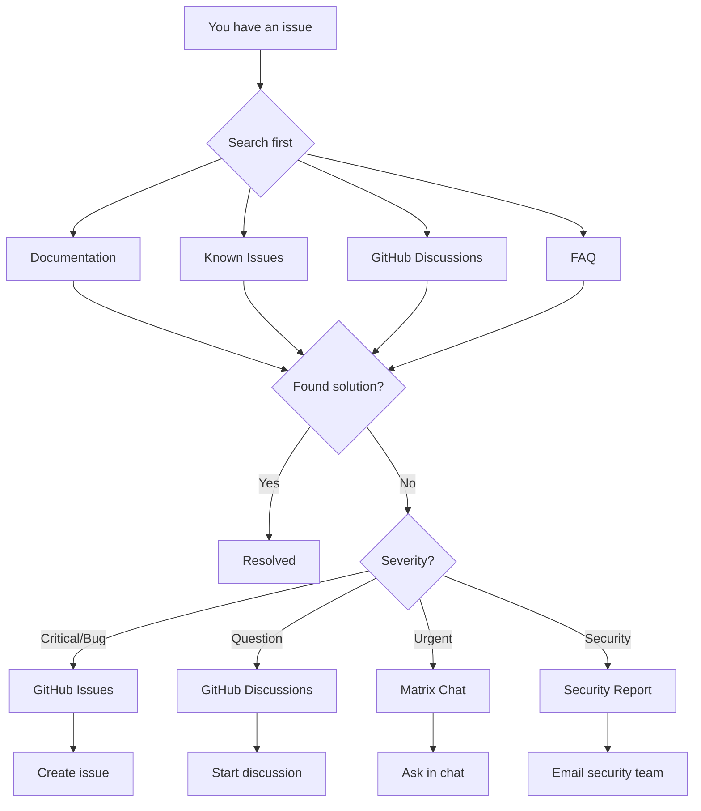

# Getting Support

This guide explains how to get help with 01s Sovereign issues.

## Support Ecosystem Overview



## Self-Service Support

Before reaching out to the community, try these resources:

### Documentation

The `docs/` directory in the repository contains comprehensive documentation:

| Section | Contents |
|---------|----------|
| `docs/tutorial/` | 25 step-by-step guides |
| `docs/faq/` | 12 FAQ documents |
| `docs/help/` | 9 troubleshooting guides |
| `docs/community/` | 9 community guides |
| `docs/incident-reporting/` | 9 incident response guides |
| `docs/features/` | 20 feature descriptions |
| `docs/bdr/` | Architecture decisions |

### Built-in Help

```bash
# CLI help
zerocli help
01s-ledger --help

# Man pages (where available)
man 01s-ledger
man zerocli

# System info
01s-ledger status
uname -a
```

### Search

- **GitHub Issues**: Search existing issues for similar problems
- **GitHub Discussions**: Search for questions and answers
- **Web Search**: Include "01s Sovereign" or "Kaiman OS" in your search

## Community Support

### GitHub Discussions

Best for:
- General questions
- How-to queries
- Feature discussions
- Community interaction

### GitHub Issues

Best for:
- Bug reports
- Feature requests
- Security vulnerabilities

### Matrix Chat

Best for:
- Real-time help
- Quick questions
- Community chat
- Development discussion

Join: `#01s-sovereign:matrix.org`

### Mailing List

Best for:
- Long-form technical discussion
- Design proposals
- Announcements

Subscribe: `01s-sovereign@lists.0-1.gg`

## Support Tiers

| Tier | Availability | Response Time | Channels | Price |
|------|-------------|---------------|----------|-------|
| **Community** | Best effort | 1-3 days | GitHub, Matrix, forums | Free |
| **Standard** | Business hours | 4 hours (S1) | Email, portal | $99/node/yr |
| **Premium** | 24/7 | 1 hour (S1) | Phone, email, portal | $499/node/yr |
| **Enterprise** | 24/7 dedicated | 15 minutes (S1) | All + on-site | Custom |

### SLA Response Time by Severity

| Severity | Community | Standard | Premium | Enterprise |
|----------|-----------|----------|---------|------------|
| S1 (Critical) | N/A | 4 hours | 30 minutes | 15 minutes |
| S2 (High) | N/A | 8 hours | 2 hours | 1 hour |
| S3 (Medium) | N/A | 24 hours | 8 hours | 4 hours |
| S4 (Low) | N/A | 48 hours | 24 hours | 8 hours |

### Resolution Time Targets by Severity

| Severity | Standard | Premium | Enterprise |
|----------|----------|---------|------------|
| S1 | 24 hours | 8 hours | 4 hours |
| S2 | 48 hours | 24 hours | 12 hours |
| S3 | 5 business days | 3 business days | 2 business days |
| S4 | Next release | Next release | Next release |

## Before Asking for Help

### Prepare Your Information

Have these ready when seeking support:

```bash
# 1. System information
01s-ledger status

# 2. Version
cat /etc/os-release

# 3. Kernel
uname -a

# 4. Hardware
lscpu
free -h
lsblk

# 5. Relevant logs
journalctl -n 100 --no-pager
dmesg | tail -50

# 6. Package version (if package-related)
pacman -Qi package-name

# 7. Ledger entries (if ledger-related)
01s-ledger tail 10
```

### Bug Report Template

```markdown
## Summary
[One-line description of the issue]

## Environment
- OS Version: [from /etc/os-release]
- Kernel: [uname -a]
- Hardware: [CPU, GPU, RAM, storage]
- 01s Version: [01s-ledger status]
- Subscription Tier: [Community/Standard/Premium/Enterprise]

## Steps to Reproduce
1. [Step 1]
2. [Step 2]
3. [Step 3]

## Expected Behavior
[What should happen]

## Actual Behavior
[What actually happens, including error messages]

## Logs
```
[Relevant log output]
```

## Workarounds Tried
1. [What you tried]
2. [Result]

## Attachments
- [Screenshots, core dumps, config files]
```

### Good Question Template

```markdown
## Summary
[One-line description of the issue]

## What I'm Trying to Do
[Description of your goal]

## What I Did
[Steps you took]

## What I Expected
[Expected behavior]

## What Actually Happened
[Actual behavior, including error messages]

## What I've Tried
[Troubleshooting steps you've already taken]

## Logs
[Relevant log output]
```

## Where to Ask

### Choose the Right Channel

| Issue Type | Best Channel |
|------------|--------------|
| "How do I..." | GitHub Discussions |
| "I found a bug" | GitHub Issues |
| "I need help now" | Matrix Chat |
| "Feature request" | GitHub Issues |
| "Security issue" | Private email/security advisory |
| "Commercial inquiry" | enterprise@0-1.gg |
| "Press inquiry" | press@0-1.gg |

### Response Time Expectations

| Day/Time | Matrix | GitHub | Email |
|----------|--------|--------|-------|
| Weekdays | Minutes-hours | 1-2 days | 1-2 days |
| Weekends | Hours | 2-3 days | 2-3 days |
| Holidays | Best effort | 3-5 days | 3-5 days |

## Escalation Matrix

### Standard Tier (3 levels)

| Level | Team | Response Time | Trigger |
|-------|------|---------------|---------|
| L1 | Support Team | 4 hours (S1) | New ticket |
| L2 | Senior Support | 8 hours | Not resolved in 24h |
| L3 | Engineering | 24 hours | Not resolved in 48h |

### Premium Tier (4 levels)

| Level | Team | Response Time | Trigger |
|-------|------|---------------|---------|
| L1 | Support Team | 30 minutes (S1) | New ticket |
| L2 | Senior Engineer | 2 hours | Not resolved in 4h |
| L3 | Engineering Lead | 4 hours | Not resolved in 8h |
| L4 | CTO | 8 hours | Not resolved in 24h |

### Enterprise Tier (5 levels)

| Level | Team | Response Time | Trigger |
|-------|------|---------------|---------|
| L1 | Dedicated Engineer | 15 minutes (S1) | New ticket |
| L2 | Engineering Manager | 30 minutes | Not resolved in 2h |
| L3 | VP Engineering | 1 hour | Not resolved in 4h |
| L4 | CTO | 2 hours | Not resolved in 8h |
| L5 | CEO | 4 hours | Not resolved in 24h |

## Paid Support

### Priority Support

Available for organizations that need faster response times:
- Email support with 4-hour SLA
- Direct access to maintainers
- Priority bug fixes
- Quarterly check-ins
- $99/node/year

### Enterprise Support

For mission-critical deployments:
- 24/7 support with 1-hour SLA
- Dedicated support engineer
- Custom SLAs
- On-site consultation
- Training for your team
- $499/node/year or custom pricing

### Consulting

Custom development and consulting services:
- Custom ISO builds
- Toolchain extensions
- Ledger integration
- Training and workshops
- Security audits

Contact: enterprise@0-1.gg for pricing and availability.

## Supporting the Project

If you find 01s Sovereign valuable, consider:

1. **Contributing code** -- Fix bugs, add features
2. **Improving docs** -- Write tutorials, fix errors
3. **Helping others** -- Answer questions on forums
4. **Sponsoring** -- Financial support via GitHub Sponsors
5. **Spreading the word** -- Tell others about the project

---

## See Also

- [Communication Channels](../community/04-communication-channels.md)
- [Reporting Bugs and Features](../community/05-reporting-bugs-and-features.md)
- [Known Issues](01-known-issues.md)
## Advanced Diagnostic Procedures

### Ledger Performance Profiling

```bash
# Profile ledger operations
time 01s-ledger verify
time 01s-ledger export > /dev/null
time 01s-ledger status

# Check ledger file size growth
watch -n 60 'du -sh ~/ledger/'

# Monitor system resources during ledger operations
top -b -n 1 | grep "01s-ledger"
```

### Network Diagnostic Procedures

```bash
# Full network diagnostic suite
echo "=== Network Diagnostics ==="
echo "--- Interfaces ---"
ip link show
echo "--- IP Addresses ---"
ip addr show
echo "--- Routing ---"
ip route show
echo "--- DNS ---"
cat /etc/resolv.conf
echo "--- Connectivity ---"
ping -c 2 8.8.8.8
echo "--- Open Ports ---"
ss -tulpn
```

### System Health Check Script

```bash
#!/bin/bash
# health-check.sh
echo "=== System Health Check ==="
echo "Date: $(date)"
echo ""
echo "--- CPU ---"
top -bn1 | grep "Cpu(s)"
echo ""
echo "--- Memory ---"
free -h
echo ""
echo "--- Disk ---"
df -h /
echo ""
echo "--- Load ---"
uptime
echo ""
echo "--- Services ---"
systemctl --failed
echo ""
echo "--- Ledger ---"
01s-ledger verify > /dev/null 2>&1 && echo "Ledger: OK" || echo "Ledger: FAILED"
echo ""
echo "--- Last Boot ---"
who -b
```

## Common Troubleshooting Scenarios

### Scenario 1: System Won't Wake from Suspend

**Symptoms**: Screen stays black, system unresponsive after opening laptop lid.
**Causes**: GPU driver issue, ACPI problem, firmware bug.

**Diagnostic Steps**:
1. Try switching TTY (Ctrl+Alt+F2)
2. If TTY works, restart GDM: `sudo systemctl restart gdm`
3. Check kernel messages: `dmesg | grep -i "drm\|gpu\|acpi"`
4. Check journal: `journalctl -b | grep -i "resume\|suspend"`
5. Test with different kernel parameters: `acpi=off`, `nouveau.modeset=0`

### Scenario 2: Bluetooth Device Won't Pair

**Symptoms**: Device discovered but pairing fails.
**Causes**: Wrong PIN, driver issue, device compatibility.

**Diagnostic Steps**:
1. Restart Bluetooth: `sudo systemctl restart bluetooth`
2. Remove and re-scan: `bluetoothctl remove XX:XX:XX:XX:XX:XX`
3. Check kernel module: `lsmod | grep bluetooth`
4. Try manual pairing: `bluetoothctl pair XX:XX:XX:XX:XX:XX`
5. Check compatibility list for your device

### Scenario 3: USB Device Not Recognized

**Symptoms**: Device plugged in but not detected.
**Causes**: Driver missing, power issue, hardware fault.

**Diagnostic Steps**:
1. Check dmesg: `dmesg | tail -20` (look for USB-related messages)
2. List USB devices: `lsusb`
3. Check power: `cat /sys/bus/usb/devices/*/power/control`
4. Reset USB: `sudo modprobe -r usbcore && sudo modprobe usbcore`
5. Try different port or cable

## Package Management Best Practices

### Pre-Update Checklist

```bash
# Before running system updates:
echo "=== Pre-Update Checks ==="
echo "1. Check disk space: $(df -h / | tail -1 | awk '{print $4}') free"
echo "2. Check memory: $(free -h | grep Mem | awk '{print $7}') available"
echo "3. Backup ledger: $(01s-ledger verify > /dev/null 2>&1 && echo 'OK' || echo 'FAILED')"
echo "4. Check internet: $(ping -c 1 8.8.8.8 > /dev/null 2>&1 && echo 'OK' || echo 'FAILED')"
echo "5. Check battery: $(cat /sys/class/power_supply/BAT0/capacity 2>/dev/null || echo 'N/A')%"
```

### Post-Update Checklist

```bash
# After running system updates:
echo "=== Post-Update Checks ==="
sudo pacman -Qkk | grep -v "0 missing files" || echo "All files verified"
01s-ledger verify && echo "Ledger chain intact" || echo "Ledger FAILED"
01s-ledger toolchain && echo "Toolchain verified" || echo "Toolchain FAILED"
systemctl --failed || echo "All services running"
```

### Package Cache Management

```bash
# Automatic cache cleanup
cat > /etc/systemd/system/paccache-clean.service << 'EOF'
[Unit]
Description=Clean pacman cache

[Service]
Type=oneshot
ExecStart=/usr/bin/paccache -r
ExecStart=/usr/bin/paccache -rk 2
EOF

cat > /etc/systemd/system/paccache-clean.timer << 'EOF'
[Unit]
Description=Weekly pacman cache cleanup

[Timer]
OnCalendar=weekly
Persistent=true

[Install]
WantedBy=timers.target
EOF

sudo systemctl enable --now paccache-clean.timer
```

## User Support Escalation Path

### L1: Self-Service (User)

1. Check documentation
2. Search known issues
3. Try listed workarounds
4. Check FAQ
5. Review system logs

### L2: Community Support (Peer)

1. Ask in Matrix chat
2. Post on GitHub Discussions
3. Search GitHub Issues
4. Ask on mailing list
5. Request help from community

### L3: Technical Support (Maintainer)

1. Create GitHub Issue
2. Include system information
3. Provide reproduction steps
4. Attach relevant logs
5. Wait for maintainer response

### L4: Enterprise Support (Dedicated)

1. Submit support ticket
2. Call dedicated hotline
3. Request live assistance
4. Schedule remote session
5. Request on-site visit

## Performance Tuning Guide

### CPU Performance Tuning

```bash
# Check CPU governor
cat /sys/devices/system/cpu/cpu*/cpufreq/scaling_governor

# Set performance governor
echo performance | sudo tee /sys/devices/system/cpu/cpu*/cpufreq/scaling_governor

# Disable C-states (reduce latency)
sudo nano /etc/default/grub
# Add: processor.max_cstate=1 intel_idle.max_cstate=0
sudo grub-mkconfig -o /boot/grub/grub.cfg
```

### Memory Performance Tuning

```bash
# Reduce swappiness
echo 10 | sudo tee /proc/sys/vm/swappiness

# Enable swap compression (zram)
sudo pacman -S zram-generator
sudo systemctl enable --now systemd-zram-setup@zram0

# Check swap usage
swapon --show

# Clear memory cache (temporary)
echo 3 | sudo tee /proc/sys/vm/drop_caches
```

### Disk Performance Tuning

```bash
# Check I/O scheduler
cat /sys/block/sda/queue/scheduler

# Set scheduler to none (NVMe) or mq-deadline (SSD)
echo none | sudo tee /sys/block/nvme0n1/queue/scheduler

# Enable TRIM for SSDs
sudo systemctl enable --now fstrim.timer

# Check disk health
sudo smartctl -a /dev/sda | grep -i "health\|temperature\|reallocated"
```

---

Lois-Kleinner and 0-1.gg 2026 Copyright
## Advanced Diagnostic Procedures

### Ledger Performance Profiling

```bash
# Profile ledger operations
time 01s-ledger verify
time 01s-ledger export > /dev/null
time 01s-ledger status

# Check ledger file size growth
watch -n 60 'du -sh ~/ledger/'

# Monitor system resources during ledger operations
top -b -n 1 | grep "01s-ledger"
```

### Network Diagnostic Procedures

```bash
# Full network diagnostic suite
echo "=== Network Diagnostics ==="
echo "--- Interfaces ---"
ip link show
echo "--- IP Addresses ---"
ip addr show
echo "--- Routing ---"
ip route show
echo "--- DNS ---"
cat /etc/resolv.conf
echo "--- Connectivity ---"
ping -c 2 8.8.8.8
echo "--- Open Ports ---"
ss -tulpn
```

### System Health Check Script

```bash
#!/bin/bash
# health-check.sh
echo "=== System Health Check ==="
echo "Date: $(date)"
echo ""
echo "--- CPU ---"
top -bn1 | grep "Cpu(s)"
echo ""
echo "--- Memory ---"
free -h
echo ""
echo "--- Disk ---"
df -h /
echo ""
echo "--- Load ---"
uptime
echo ""
echo "--- Services ---"
systemctl --failed
echo ""
echo "--- Ledger ---"
01s-ledger verify > /dev/null 2>&1 && echo "Ledger: OK" || echo "Ledger: FAILED"
echo ""
echo "--- Last Boot ---"
who -b
```

## Common Troubleshooting Scenarios

### Scenario 1: System Won't Wake from Suspend

**Symptoms**: Screen stays black, system unresponsive after opening laptop lid.
**Causes**: GPU driver issue, ACPI problem, firmware bug.

**Diagnostic Steps**:
1. Try switching TTY (Ctrl+Alt+F2)
2. If TTY works, restart GDM: `sudo systemctl restart gdm`
3. Check kernel messages: `dmesg | grep -i "drm\|gpu\|acpi"`
4. Check journal: `journalctl -b | grep -i "resume\|suspend"`
5. Test with different kernel parameters: `acpi=off`, `nouveau.modeset=0`

### Scenario 2: Bluetooth Device Won't Pair

**Symptoms**: Device discovered but pairing fails.
**Causes**: Wrong PIN, driver issue, device compatibility.

**Diagnostic Steps**:
1. Restart Bluetooth: `sudo systemctl restart bluetooth`
2. Remove and re-scan: `bluetoothctl remove XX:XX:XX:XX:XX:XX`
3. Check kernel module: `lsmod | grep bluetooth`
4. Try manual pairing: `bluetoothctl pair XX:XX:XX:XX:XX:XX`
5. Check compatibility list for your device

### Scenario 3: USB Device Not Recognized

**Symptoms**: Device plugged in but not detected.
**Causes**: Driver missing, power issue, hardware fault.

**Diagnostic Steps**:
1. Check dmesg: `dmesg | tail -20` (look for USB-related messages)
2. List USB devices: `lsusb`
3. Check power: `cat /sys/bus/usb/devices/*/power/control`
4. Reset USB: `sudo modprobe -r usbcore && sudo modprobe usbcore`
5. Try different port or cable

## Package Management Best Practices

### Pre-Update Checklist

```bash
# Before running system updates:
echo "=== Pre-Update Checks ==="
echo "1. Check disk space: $(df -h / | tail -1 | awk '{print $4}') free"
echo "2. Check memory: $(free -h | grep Mem | awk '{print $7}') available"
echo "3. Backup ledger: $(01s-ledger verify > /dev/null 2>&1 && echo 'OK' || echo 'FAILED')"
echo "4. Check internet: $(ping -c 1 8.8.8.8 > /dev/null 2>&1 && echo 'OK' || echo 'FAILED')"
echo "5. Check battery: $(cat /sys/class/power_supply/BAT0/capacity 2>/dev/null || echo 'N/A')%"
```

### Post-Update Checklist

```bash
# After running system updates:
echo "=== Post-Update Checks ==="
sudo pacman -Qkk | grep -v "0 missing files" || echo "All files verified"
01s-ledger verify && echo "Ledger chain intact" || echo "Ledger FAILED"
01s-ledger toolchain && echo "Toolchain verified" || echo "Toolchain FAILED"
systemctl --failed || echo "All services running"
```

### Package Cache Management

```bash
# Automatic cache cleanup
cat > /etc/systemd/system/paccache-clean.service << 'EOF'
[Unit]
Description=Clean pacman cache

[Service]
Type=oneshot
ExecStart=/usr/bin/paccache -r
ExecStart=/usr/bin/paccache -rk 2
EOF

cat > /etc/systemd/system/paccache-clean.timer << 'EOF'
[Unit]
Description=Weekly pacman cache cleanup

[Timer]
OnCalendar=weekly
Persistent=true

[Install]
WantedBy=timers.target
EOF

sudo systemctl enable --now paccache-clean.timer
```

## User Support Escalation Path

### L1: Self-Service (User)

1. Check documentation
2. Search known issues
3. Try listed workarounds
4. Check FAQ
5. Review system logs

### L2: Community Support (Peer)

1. Ask in Matrix chat
2. Post on GitHub Discussions
3. Search GitHub Issues
4. Ask on mailing list
5. Request help from community

### L3: Technical Support (Maintainer)

1. Create GitHub Issue
2. Include system information
3. Provide reproduction steps
4. Attach relevant logs
5. Wait for maintainer response

### L4: Enterprise Support (Dedicated)

1. Submit support ticket
2. Call dedicated hotline
3. Request live assistance
4. Schedule remote session
5. Request on-site visit

## Performance Tuning Guide

### CPU Performance Tuning

```bash
# Check CPU governor
cat /sys/devices/system/cpu/cpu*/cpufreq/scaling_governor

# Set performance governor
echo performance | sudo tee /sys/devices/system/cpu/cpu*/cpufreq/scaling_governor

# Disable C-states (reduce latency)
sudo nano /etc/default/grub
# Add: processor.max_cstate=1 intel_idle.max_cstate=0
sudo grub-mkconfig -o /boot/grub/grub.cfg
```

### Memory Performance Tuning

```bash
# Reduce swappiness
echo 10 | sudo tee /proc/sys/vm/swappiness

# Enable swap compression (zram)
sudo pacman -S zram-generator
sudo systemctl enable --now systemd-zram-setup@zram0

# Check swap usage
swapon --show

# Clear memory cache (temporary)
echo 3 | sudo tee /proc/sys/vm/drop_caches
```

### Disk Performance Tuning

```bash
# Check I/O scheduler
cat /sys/block/sda/queue/scheduler

# Set scheduler to none (NVMe) or mq-deadline (SSD)
echo none | sudo tee /sys/block/nvme0n1/queue/scheduler

# Enable TRIM for SSDs
sudo systemctl enable --now fstrim.timer

# Check disk health
sudo smartctl -a /dev/sda | grep -i "health\|temperature\|reallocated"
```

---

Lois-Kleinner and 0-1.gg 2026 Copyright

```
.====================================================================.
!  Made in the UAE, Dubai #DubaiIt #Dubai #Dxb #SovereignAI          !
!  Made in The Emirates #Dubai_it                                    !
!                                                                    !
!  Lois-Kleinner Alpasan - The Anticloud 2026-                       !
!                                                                    !
!  0-1.gg ! GitHub ! LinkedIn ! DEV ! GH Pages                       !
!  HuggingFace ! Blog ! Tumblr ! Fandom ! Bluesky ! Mastodon          !
!  Zenodo ! Harvard Dataverse ! Internet Archive ! ORCID ! Figshare   !
!                                                                    !
!  Sovereign AI ! Local-First ! Privacy ! Zero Trust ! No Datacenter !
!  Air-Gapped ! Open Source ! Rust ! Hash Chain ! Single Binary      !
!  Offline LLM ! Crypto Ledger ! P2P ! Federated                     !
'===================================================================='
```

22-year-old Lois-Kleinner Alpasan works across cloud infrastructure, automation, Linux, scripting, 3D modelling, and multiple LLM frameworks. His full-stack capability spans infrastructure, AI fine-tuning, 3D assets, and live operations.

References:
1. Lois-Kleinner Zenodo: https://doi.org/10.5281/zenodo.20781790
2. Lois-Kleinner GitHub: https://github.com/kleinnner/Anticloud/tree/main/04-aioss-format
3. Lois-Kleinner Harvard DV: https://doi.org/10.7910/DVN/FSHFZF
4. Lois-Kleinner Internet Arc: https://archive.org/details/aioss-format
5. Lois-Kleinner ORCID: https://orcid.org/0009-0009-2233-6107
6. Lois-Kleinner DEV.to: https://dev.to/kleinner
7. Lois-Kleinner LinkedIn: https://linkedin.com/in/kleinner
8. Lois-Kleinner HuggingFace: https://huggingface.co/Anticloud
9. Lois-Kleinner Tumblr: https://anticloud.tumblr.com
10. Lois-Kleinner Mastodon: https://mastodon.social/@kleinner
11. Lois-Kleinner Bluesky: https://bsky.app/profile/kleinner.bsky.social
12. 0-1.gg: https://0-1.gg
13. Lois-Kleinner Figshare: https://figshare.com/authors/Lois-Kleinner_Alpasan/20849885
