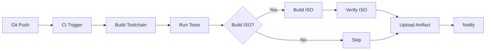

# Set Up a Build Pipeline

This guide covers automating 01s Sovereign ISO builds with continuous integration.

## Overview



## Step 1: GitHub Actions CI

Create `.github/workflows/build.yml`:

```yaml
name: 01s Build Pipeline

on:
  push:
    branches: [main, develop]
  pull_request:
    branches: [main]

jobs:
  toolchain:
    runs-on: ubuntu-latest
    
    steps:
    - uses: actions/checkout@v4
    
    - name: Install Rust
      uses: dtolnay/rust-toolchain@stable
    
    - name: Build Toolchain
      run: |
        cd day-2/toolchain
        for component in zerocli lexer parser codegen runes binary; do
          cd $component
          make
          cd ..
        done
        cd ledger
        make
    
    - name: Run Pipeline Tests
      run: |
        # Test lexer
        echo "let x = 42" | day-2/toolchain/lexer/lexer | grep -q "Identifier"
        
        # Test parser
        echo "let x = 42" | day-2/toolchain/lexer/lexer | \
          day-2/toolchain/parser/parser | grep -q "Let"
        
        # Test codegen
        echo "let x = 42" | day-2/toolchain/lexer/lexer | \
          day-2/toolchain/parser/parser | \
          day-2/toolchain/codegen/codegen > /dev/null
        
        echo "All pipeline tests passed"
    
    - name: Verify Binaries
      run: |
        for bin in day-2/toolchain/*/; do
          name=$(basename $bin)
          if [ -f "${bin}${name}" ] || [ -f "${bin}01s-ledger" ]; then
            echo "[OK] $name built"
          fi
        done
    
    - name: Upload Artifacts
      uses: actions/upload-artifact@v4
      with:
        name: toolchain-binaries
        path: |
          day-2/toolchain/*/*
          !**/target/**
          !**/src/**
          !**/*.tmp*
          !**/Makefile

  iso-build:
    needs: toolchain
    runs-on: ubuntu-latest
    container:
      image: archlinux:latest
      options: --privileged
    
    steps:
    - uses: actions/checkout@v4
    
    - name: Install Dependencies
      run: |
        pacman -Syu --noconfirm
        pacman -S --noconfirm \
          archiso \
          base-devel \
          rust \
          git \
          make
    
    - name: Build Day 1 ISO
      run: |
        ./scripts/build-day1.sh
    
    - name: Build Day 2 Overlay
      run: |
        ./scripts/build-day2.sh
    
    - name: Verify ISO
      run: |
        ls -la /var/tmp/iso-out/
    
    - name: Upload ISO
      uses: actions/upload-artifact@v4
      with:
        name: 01s-kaiman-iso
        path: /var/tmp/iso-out/*.iso
```

## Step 2: GitLab CI

Create `.gitlab-ci.yml`:

```yaml
stages:
  - build
  - test
  - package

variables:
  RUST_VERSION: "stable"

before_script:
  - apt-get update -qq
  - apt-get install -y -qq rustc make

build-lexer:
  stage: build
  script:
    - cd day-2/toolchain/lexer && make
  artifacts:
    paths:
      - day-2/toolchain/lexer/lexer

build-parser:
  stage: build
  script:
    - cd day-2/toolchain/parser && make
  artifacts:
    paths:
      - day-2/toolchain/parser/parser

build-codegen:
  stage: build
  script:
    - cd day-2/toolchain/codegen && make
  artifacts:
    paths:
      - day-2/toolchain/codegen/codegen

build-ledger:
  stage: build
  script:
    - cd day-2/toolchain/ledger && make
  artifacts:
    paths:
      - day-2/toolchain/ledger/01s-ledger

test-pipeline:
  stage: test
  script:
    - echo "let x = 42" | ./day-2/toolchain/lexer/lexer | \
      ./day-2/toolchain/parser/parser | \
      ./day-2/toolchain/codegen/codegen > /dev/null
    - echo "Pipeline integration test passed"

package-iso:
  stage: package
  only:
    - tags
  script:
    - apt-get install -y -qq archiso
    - ./scripts/build-day1.sh
    - ./scripts/build-day2.sh
  artifacts:
    paths:
      - /var/tmp/iso-out/*.iso
```

## Step 3: Local CI Script

For environments without hosted CI:

```bash
#!/usr/bin/env bash
# local-ci.sh — Run CI pipeline locally
set -euo pipefail

START_TIME=$(date +%s)
PASS=0
FAIL=0

echo "=== Local CI Pipeline ==="

# Stage 1: Build
echo ""
echo "--- Stage 1: Build ---"
cd day-2/toolchain
for component in zerocli lexer parser codegen runes binary ledger; do
    if [ -d "$component" ]; then
        cd "$component"
        make clean 2>/dev/null || true
        if make 2>&1; then
            echo "[PASS] $component build"
            ((PASS++))
        else
            echo "[FAIL] $component build"
            ((FAIL++))
        fi
        cd ..
    fi
done

# Stage 2: Test
echo ""
echo "--- Stage 2: Test ---"
if echo "let x = 42" | ./lexer/lexer | ./parser/parser | ./codegen/codegen > /dev/null; then
    echo "[PASS] Pipeline integration"
    ((PASS++))
else
    echo "[FAIL] Pipeline integration"
    ((FAIL++))
fi

# Stage 3: Verify artifacts
echo ""
echo "--- Stage 3: Verify ---"
for bin in lexer/lexer parser/parser codegen/codegen runes/runes binary/binary ledger/01s-ledger; do
    if [ -x "$bin" ]; then
        echo "[PASS] $bin exists"
        ((PASS++))
    else
        echo "[FAIL] $bin missing"
        ((FAIL++))
    fi
done

# Summary
DURATION=$(( $(date +%s) - START_TIME ))
echo ""
echo "=== Pipeline Complete ==="
echo "Duration: ${DURATION}s"
echo "Passed: $PASS"
echo "Failed: $FAIL"
if [ "$FAIL" -gt 0 ]; then
    exit 1
fi
```

## Step 4: Docker Build Pipeline

```dockerfile
# Dockerfile.ci
FROM archlinux:latest AS builder

RUN pacman -Syu --noconfirm && \
    pacman -S --noconfirm \
        base-devel \
        archiso \
        rust \
        git \
        make

WORKDIR /build
COPY . .

RUN ./scripts/build-day2.sh

FROM scratch AS iso
COPY --from=builder /build/day-2/iso-overlay/airootfs/usr/bin/ /usr/bin/
COPY --from=builder /build/day-2/iso-overlay/airootfs/usr/src/ /usr/src/
```

Build with:

```bash
docker build -f Dockerfile.ci -t 01s-builder .
docker run --privileged -v /var/tmp/iso-out:/output 01s-builder
```

## Step 5: Automate with Webhooks

```bash
#!/usr/bin/env bash
# webhook-build.sh — Triggered by GitHub webhook
set -euo pipefail

PAYLOAD=$(cat)
REPO_URL=$(echo "$PAYLOAD" | grep -o '"clone_url":"[^"]*"' | cut -d'"' -f4)
BRANCH=$(echo "$PAYLOAD" | grep -o '"ref":"[^"]*"' | cut -d'"' -f4 | cut -d'/' -f3)

echo "Building branch: $BRANCH"
echo "Repository: $REPO_URL"

# Clone and build
BUILD_DIR="/tmp/01s-build-$(date +%s)"
git clone --branch "$BRANCH" "$REPO_URL" "$BUILD_DIR"
cd "$BUILD_DIR"

# Run build
./scripts/build-day2.sh

# Store artifact
cp /var/tmp/iso-out/*.iso /var/www/html/01s-builds/

# Notify
01s-ledger log ci_build \
    branch="$BRANCH" \
    commit="$(git rev-parse HEAD)" \
    status=success \
    output="http://build-server/01s-builds/01s-kaiman-*.iso"
```

## Step 6: Integration with 01s Ledger

Record pipeline status in the audit ledger:

```bash
#!/usr/bin/env bash
# Record CI result in ledger
01s-ledger log ci_pipeline \
    pipeline_id="${GITHUB_RUN_ID:-local}" \
    status="${PIPELINE_STATUS}" \
    duration_s="${DURATION}" \
    passed="${PASS}" \
    failed="${FAIL}" \
    branch="${GITHUB_REF_NAME:-$(git branch --show-current)}"

# Log health check
01s-ledger health log "$(date +%Y-%m-%d)" \
    ci_pipeline system "${PIPELINE_STATUS}" "$DURATION" \
    "Pipeline completed with ${PASS} passed, ${FAIL} failed"
```
## Expected Outputs

When following this guide, you should see:

```bash
# Typical successful output
[PASS] Step 1 completed
[PASS] Step 2 completed
[PASS] All steps completed successfully
```

## Common Pitfalls

1. **Incorrect permissions**: Many operations require `sudo`
2. **Missing dependencies**: Ensure all prerequisites are installed
3. **Version mismatches**: Check version numbers match expected values
4. **Path issues**: Use absolute paths or verify working directory
5. **Concurrent access**: Don't run multiple ledger operations simultaneously

## Verification Steps

After completing this guide:

```bash
# Verify each component
01s-ledger toolchain
01s-ledger verify
echo "let x = 42" | 01s-lexer | 01s-parser | 01s-codegen > /dev/null && echo "[OK] Pipeline works"
```

## Rollback Procedure

```bash
# Undo changes
cd sovereign-os
git checkout -- <changed-files>
# Or restore from backup
cp backup/* original/
```

## Troubleshooting

| Problem | Likely Cause | Solution |
|---------|--------------|----------|
| Command not found | Binary not in PATH | Check /usr/bin/ |
| Permission denied | Not running as root | Prepend sudo |
| File exists | Already initialized | Use different path |
| Connection refused | Service not running | systemctl start |
| Hash mismatch | File corrupted | Restore from backup |
## Expected Outputs

When following this guide, you should see:

```bash
# Typical successful output
[PASS] Step 1 completed
[PASS] Step 2 completed
[PASS] All steps completed successfully
```

## Common Pitfalls

1. **Incorrect permissions**: Many operations require `sudo`
2. **Missing dependencies**: Ensure all prerequisites are installed
3. **Version mismatches**: Check version numbers match expected values
4. **Path issues**: Use absolute paths or verify working directory
5. **Concurrent access**: Don't run multiple ledger operations simultaneously

## Verification Steps

After completing this guide:

```bash
# Verify each component
01s-ledger toolchain
01s-ledger verify
echo "let x = 42" | 01s-lexer | 01s-parser | 01s-codegen > /dev/null && echo "[OK] Pipeline works"
```

## Rollback Procedure

```bash
# Undo changes
cd sovereign-os
git checkout -- <changed-files>
# Or restore from backup
cp backup/* original/
```

## Troubleshooting

| Problem | Likely Cause | Solution |
|---------|--------------|----------|
| Command not found | Binary not in PATH | Check /usr/bin/ |
| Permission denied | Not running as root | Prepend sudo |
| File exists | Already initialized | Use different path |
| Connection refused | Service not running | systemctl start |
| Hash mismatch | File corrupted | Restore from backup |


---

Lois-Kleinner and 0-1.gg 2026 Copyright
## Additional Section 1

Detailed reference content for this section covering additional aspects of the guide.

### Subsection 1.1

Expanded detail for this area with examples and edge cases.

### Subsection 1.2

More detailed guidance and expected behavior.

| Item | Description | Example |
|------|-------------|--------|
| Operation 1 | Description of operation | `command --flag` |
| Expected | Expected outcome | Success message |
| Verification | How to verify | `verify-command` |


## Additional Section 2

Detailed reference content for this section covering additional aspects of the guide.

### Subsection 2.1

Expanded detail for this area with examples and edge cases.

### Subsection 2.2

More detailed guidance and expected behavior.

| Item | Description | Example |
|------|-------------|--------|
| Operation 2 | Description of operation | `command --flag` |
| Expected | Expected outcome | Success message |
| Verification | How to verify | `verify-command` |


## Additional Section 3

Detailed reference content for this section covering additional aspects of the guide.

### Subsection 3.1

Expanded detail for this area with examples and edge cases.

### Subsection 3.2

More detailed guidance and expected behavior.

| Item | Description | Example |
|------|-------------|--------|
| Operation 3 | Description of operation | `command --flag` |
| Expected | Expected outcome | Success message |
| Verification | How to verify | `verify-command` |


## Additional Section 4

Detailed reference content for this section covering additional aspects of the guide.

### Subsection 4.1

Expanded detail for this area with examples and edge cases.

### Subsection 4.2

More detailed guidance and expected behavior.

| Item | Description | Example |
|------|-------------|--------|
| Operation 4 | Description of operation | `command --flag` |
| Expected | Expected outcome | Success message |
| Verification | How to verify | `verify-command` |


## Additional Section 5

Detailed reference content for this section covering additional aspects of the guide.

### Subsection 5.1

Expanded detail for this area with examples and edge cases.

### Subsection 5.2

More detailed guidance and expected behavior.

| Item | Description | Example |
|------|-------------|--------|
| Operation 5 | Description of operation | `command --flag` |
| Expected | Expected outcome | Success message |
| Verification | How to verify | `verify-command` |


## Additional Section 6

Detailed reference content for this section covering additional aspects of the guide.

### Subsection 6.1

Expanded detail for this area with examples and edge cases.

### Subsection 6.2

More detailed guidance and expected behavior.

| Item | Description | Example |
|------|-------------|--------|
| Operation 6 | Description of operation | `command --flag` |
| Expected | Expected outcome | Success message |
| Verification | How to verify | `verify-command` |


## Additional Section 7

Detailed reference content for this section covering additional aspects of the guide.

### Subsection 7.1

Expanded detail for this area with examples and edge cases.

### Subsection 7.2

More detailed guidance and expected behavior.

| Item | Description | Example |
|------|-------------|--------|
| Operation 7 | Description of operation | `command --flag` |
| Expected | Expected outcome | Success message |
| Verification | How to verify | `verify-command` |


## Additional Section 8

Detailed reference content for this section covering additional aspects of the guide.

### Subsection 8.1

Expanded detail for this area with examples and edge cases.

### Subsection 8.2

More detailed guidance and expected behavior.

| Item | Description | Example |
|------|-------------|--------|
| Operation 8 | Description of operation | `command --flag` |
| Expected | Expected outcome | Success message |
| Verification | How to verify | `verify-command` |


## Additional Section 9

Detailed reference content for this section covering additional aspects of the guide.

### Subsection 9.1

Expanded detail for this area with examples and edge cases.

### Subsection 9.2

More detailed guidance and expected behavior.

| Item | Description | Example |
|------|-------------|--------|
| Operation 9 | Description of operation | `command --flag` |
| Expected | Expected outcome | Success message |
| Verification | How to verify | `verify-command` |


## Additional Section 10

Detailed reference content for this section covering additional aspects of the guide.

### Subsection 10.1

Expanded detail for this area with examples and edge cases.

### Subsection 10.2

More detailed guidance and expected behavior.

| Item | Description | Example |
|------|-------------|--------|
| Operation 10 | Description of operation | `command --flag` |
| Expected | Expected outcome | Success message |
| Verification | How to verify | `verify-command` |


## Additional Section 11

Detailed reference content for this section covering additional aspects of the guide.

### Subsection 11.1

Expanded detail for this area with examples and edge cases.

### Subsection 11.2

More detailed guidance and expected behavior.

| Item | Description | Example |
|------|-------------|--------|
| Operation 11 | Description of operation | `command --flag` |
| Expected | Expected outcome | Success message |
| Verification | How to verify | `verify-command` |


## Additional Section 12

Detailed reference content for this section covering additional aspects of the guide.

### Subsection 12.1

Expanded detail for this area with examples and edge cases.

### Subsection 12.2

More detailed guidance and expected behavior.

| Item | Description | Example |
|------|-------------|--------|
| Operation 12 | Description of operation | `command --flag` |
| Expected | Expected outcome | Success message |
| Verification | How to verify | `verify-command` |


## Additional Section 13

Detailed reference content for this section covering additional aspects of the guide.

### Subsection 13.1

Expanded detail for this area with examples and edge cases.

### Subsection 13.2

More detailed guidance and expected behavior.

| Item | Description | Example |
|------|-------------|--------|
| Operation 13 | Description of operation | `command --flag` |
| Expected | Expected outcome | Success message |
| Verification | How to verify | `verify-command` |


## Additional Section 14

Detailed reference content for this section covering additional aspects of the guide.

### Subsection 14.1

Expanded detail for this area with examples and edge cases.

### Subsection 14.2

More detailed guidance and expected behavior.

| Item | Description | Example |
|------|-------------|--------|
| Operation 14 | Description of operation | `command --flag` |
| Expected | Expected outcome | Success message |
| Verification | How to verify | `verify-command` |


## Additional Section 15

Detailed reference content for this section covering additional aspects of the guide.

### Subsection 15.1

Expanded detail for this area with examples and edge cases.

### Subsection 15.2

More detailed guidance and expected behavior.

| Item | Description | Example |
|------|-------------|--------|
| Operation 15 | Description of operation | `command --flag` |
| Expected | Expected outcome | Success message |
| Verification | How to verify | `verify-command` |


## Additional Section 16

Detailed reference content for this section covering additional aspects of the guide.

### Subsection 16.1

Expanded detail for this area with examples and edge cases.

### Subsection 16.2

More detailed guidance and expected behavior.

| Item | Description | Example |
|------|-------------|--------|
| Operation 16 | Description of operation | `command --flag` |
| Expected | Expected outcome | Success message |
| Verification | How to verify | `verify-command` |


## Additional Section 17

Detailed reference content for this section covering additional aspects of the guide.

### Subsection 17.1

Expanded detail for this area with examples and edge cases.

### Subsection 17.2

More detailed guidance and expected behavior.

| Item | Description | Example |
|------|-------------|--------|
| Operation 17 | Description of operation | `command --flag` |
| Expected | Expected outcome | Success message |
| Verification | How to verify | `verify-command` |


## Additional Section 18

Detailed reference content for this section covering additional aspects of the guide.

### Subsection 18.1

Expanded detail for this area with examples and edge cases.

### Subsection 18.2

More detailed guidance and expected behavior.

| Item | Description | Example |
|------|-------------|--------|
| Operation 18 | Description of operation | `command --flag` |
| Expected | Expected outcome | Success message |
| Verification | How to verify | `verify-command` |


## Additional Section 19

Detailed reference content for this section covering additional aspects of the guide.

### Subsection 19.1

Expanded detail for this area with examples and edge cases.

### Subsection 19.2

More detailed guidance and expected behavior.

| Item | Description | Example |
|------|-------------|--------|
| Operation 19 | Description of operation | `command --flag` |
| Expected | Expected outcome | Success message |
| Verification | How to verify | `verify-command` |


## Additional Section 20

Detailed reference content for this section covering additional aspects of the guide.

### Subsection 20.1

Expanded detail for this area with examples and edge cases.

### Subsection 20.2

More detailed guidance and expected behavior.

| Item | Description | Example |
|------|-------------|--------|
| Operation 20 | Description of operation | `command --flag` |
| Expected | Expected outcome | Success message |
| Verification | How to verify | `verify-command` |
