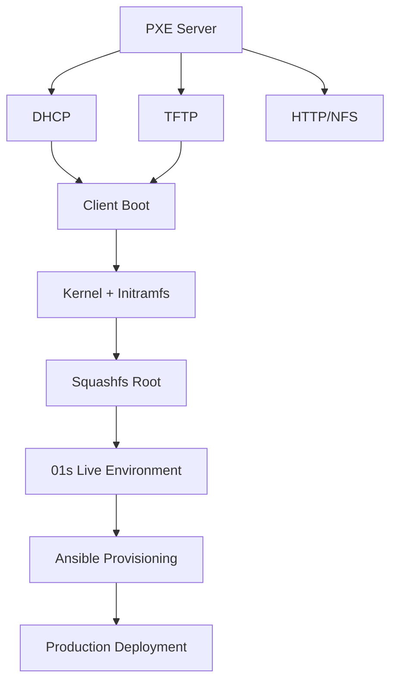
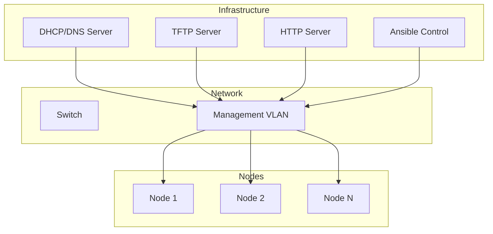

# Deploy at Scale

This guide covers mass deployment of 01s Sovereign OS using PXE boot, network imaging, and automated provisioning.

## Overview



## Deployment Architecture



## Step 1: Set Up PXE Server

### Install Required Packages

```bash
sudo pacman -S dnsmasq nginx
```

### Configure DHCP/TFTP (dnsmasq)

```ini
# /etc/dnsmasq.conf
interface=enp0s3
dhcp-range=192.168.1.100,192.168.1.200,12h
dhcp-boot=pxelinux.0,pxeserver,192.168.1.10
enable-tftp
tftp-root=/srv/tftp
log-dhcp
```

### Configure Nginx for HTTP Boot

```nginx
# /etc/nginx/sites-available/01s-pxe
server {
    listen 80;
    server_name pxe.01s.local;
    root /srv/http/01s;
    autoindex on;
    
    location /iso/ {
        alias /var/tmp/iso-out/;
    }
    
    location /ks/ {
        alias /srv/kickstart/;
    }
}
```

## Step 2: Prepare PXE Boot Files

```bash
# Create TFTP directory structure
sudo mkdir -p /srv/tftp/{pxelinux.cfg,grub}
sudo mkdir -p /srv/http/01s

# Copy boot files from ISO
sudo mount -o loop /var/tmp/iso-out/01s-kaiman-*.iso /mnt
sudo cp /mnt/boot/vmlinuz-linux /srv/tftp/
sudo cp /mnt/boot/initramfs-linux.img /srv/tftp/
sudo cp /mnt/boot/syslinux/lpxelinux.0 /srv/tftp/
sudo cp /mnt/arch/x86_64/airootfs.sfs /srv/http/01s/live/
sudo umount /mnt

# Create PXE config
cat > /srv/tftp/pxelinux.cfg/default << 'PXE'
DEFAULT 01s-kaiman
LABEL 01s-kaiman
    MENU LABEL ^01s Sovereign Kaiman
    KERNEL vmlinuz-linux
    APPEND initrd=initramfs-linux.img archisobasedir=arch archiso_http_srv=http://pxe.01s.local/01s/ ip=dhcp
PXE
```

## Step 3: Automated Provisioning with Kickstart

```bash
# /srv/kickstart/01s-ks.cfg
lang en_US.UTF-8
keyboard us
timezone UTC
network --bootproto=dhcp --hostname=01s-node
rootpw --iscrypted $6$rounds=5000$...
user --name=admin --groups=wheel --password=changeme
clearpart --all --initlabel
part /boot --fstype=ext4 --size=512
part / --fstype=ext4 --size=10240 --grow
part swap --size=2048

%packages
@base
@gnome
01s-toolchain
openssh
ansible
%end

%post
systemctl enable sshd
systemctl enable 01s-ledger
01s-ledger init
01s-ledger log deployment status=complete host=$(hostname)
%end
```

## Step 4: Ansible Automation

```yaml
# ansible/deploy-01s.yml
- name: Deploy 01s Sovereign
  hosts: all
  become: yes
  vars:
    ledger_server: "ledger.01s.internal"
    
  tasks:
    - name: Install 01s toolchain
      pacman:
        name: 01s-toolchain
        state: present
    
    - name: Initialize ledger
      command: 01s-ledger init
      args:
        creates: "~/ledger/{{ ansible_date_time.date }}.aioss"
    
    - name: Log deployment
      command: >
        01s-ledger log deployment
        host={{ ansible_hostname }}
        ip={{ ansible_default_ipv4.address }}
        role={{ role | default('worker') }}
    
    - name: Enable services
      systemd:
        name: "{{ item }}"
        enabled: yes
        state: started
      loop:
        - 01s-ledger
        - sshd
```

## Step 5: Post-Deployment Verification

```bash
# Verify ledger on each node
for node in node-01 node-02 node-03; do
    ssh "root@${node}" "
        01s-ledger status
        01s-ledger verify
    "
done

# Collect deployment audit
for node in node-01 node-02 node-03; do
    scp "root@${node}:~/ledger/*.aioss" /var/lib/01s/audit/
done
```

## Step 6: Enterprise Imaging

### Create a Golden Image

```bash
# Install base system
sudo mkarchiso -v -w /tmp/work -o /tmp/out day-1/iso/profile

# Customize with enterprise packages
# Repackage
mksquashfs /mnt/root /tmp/custom.sfs -comp zstd
```

## Validation Commands

```bash
# Verify PXE server
sudo systemctl status dnsmasq
sudo systemctl status nginx

# Test DHCP
sudo dhcp-lease-list

# Test TFTP
tftp pxe.01s.local
tftp> get pxelinux.0
tftp> quit

# Test HTTP
curl http://pxe.01s.local/01s/live/airootfs.sfs -o /dev/null -w '%{speed_download}'

# Verify deployment
ansible all -m shell -a "01s-ledger verify"
```

## Rollback Procedure

```bash
# If deployment fails, redeploy:
# 1. Fix the issue in kickstart/Ansible
# 2. Reboot node to PXE
# 3. Select "Reinstall" option
# 4. Verify new deployment

# For failed Ansible runs:
ansible-playbook deploy-01s.yml --limit failed_nodes
```
## Deployment Troubleshooting

### Common Deployment Issues

| Issue | Cause | Solution |
|-------|-------|----------|
| PXE boot fails | DHCP not configured | Check dnsmasq service |
| Node not in inventory | DNS not resolving | Add to /etc/hosts |
| Ansible connection refused | SSH not running | Enable sshd.service |
| Ledger init fails | HOME not set | Use explicit --home flag |
| Health check fails | Missing logs dir | Create logs/health/ |
| Package install fails | Mirror not synced | Run pacman -Sy |

### Validation Commands

```bash
# Verify deployment
ansible all -m ping
ansible all -m shell -a "01s-ledger verify"
ansible all -m shell -a "systemctl is-active 01s-ledger"
ansible all -m shell -a "df -h /"

# Check replication
for node in node-01 node-02; do
    ssh $node "01s-ledger status | head -5"
done

# Health check all nodes
for node in $(cat inventory/hosts); do
    echo "=== $node ==="
    ssh $node "01s-ledger health status" 2>/dev/null || echo "Unreachable"
done
```

### Log Files

| Log | Location | Purpose |
|-----|----------|---------|
| PXE/DHCP | /var/log/dnsmasq.log | Boot requests |
| HTTP | /var/log/nginx/access.log | File transfers |
| Ansible | ~/.ansible/log/ | Automation logs |
| Ledger | ~/ledger/*.aioss | Audit entries |
| Health | logs/health/*.health | Diagnostics |
| System | journalctl -u 01s-ledger | Service logs |

## Automation Scripts

### Mass Ledger Initialization

```bash
#!/bin/bash
# init-all-ledgers.sh
for node in $(cat nodes.txt); do
    ssh root@$node "01s-ledger init && 01s-ledger log deployment status=init"
    echo "Initialized: $node"
done
```

### Compliance Report Generator

```bash
#!/bin/bash
# generate-compliance-report.sh
OUTPUT="/var/reports/compliance-$(date +%Y%m%d)"
mkdir -p $OUTPUT

for node in $(cat nodes.txt); do
    ssh root@$node "01s-ledger verify && 01s-ledger export" > $OUTPUT/$node.json
done

tar czf $OUTPUT.tar.gz $OUTPUT
```

### Backup All Nodes

```bash
#!/bin/bash
# backup-all.sh
for node in $(cat nodes.txt); do
    ssh root@$node "/usr/local/bin/01s-backup.sh"
    scp root@$node:/var/backups/01s/01s-dr-backup-*.tar.gz /backups/
done
```

## Monitoring Integration Guide

### Prometheus Node Discovery

```yaml
# /etc/prometheus/file_sd_configs/01s-nodes.yml
- targets:
    - node-01:9091
    - node-02:9091
    - node-03:9091
  labels:
    job: 01s-ledger
    environment: production
```

### Grafana Dashboard Variables

```json
{
  "templating": {
    "list": [
      {
        "name": "node",
        "type": "query",
        "query": "label_values(01s_ledger_entries, instance)"
      }
    ]
  }
}
```

## Rollback Procedures

### Rolling Back a Deployment

1. Identify the issue from logs
2. Fix the configuration/template
3. Re-run Ansible playbook:
   ```bash
   ansible-playbook -i inventory deploy-01s.yml --limit failed-node
   ```
4. Verify fix on the node
5. Continue with remaining nodes

### Full Rollback to Previous Snapshot

```bash
# If deployment is completely broken:
# 1. Boot from ISO on each node
# 2. Restore from pre-deployment backup
for node in $(cat nodes.txt); do
    ssh root@$node "
        systemctl stop 01s-ledger
        cp -r /backups/pre-deploy/ledger/* ~/ledger/
        systemctl start 01s-ledger
        01s-ledger verify
    "
done
```

## Performance Reference

### Expected Performance Metrics

| Metric | Desktop | Server | Ledger Node |
|--------|---------|--------|-------------|
| Boot time | 15-30s | 10-20s | 10-15s |
| Ledger verify | <1s | <1s | <1s |
| Health check | <0.5s | <0.5s | <0.5s |
| Memory usage | 50-100 MB | 30-60 MB | 30-50 MB |
| Disk I/O | Low | Low | Low |
| Network I/O | Minimal | Minimal | Minimal |

### Bottleneck Identification

| Symptom | Likely Bottleneck | Tool |
|---------|-------------------|------|
| Slow ledger verify | Disk I/O | iostat -x 1 |
| Slow health checks | CPU | mpstat -P ALL 1 |
| Slow replication | Network | iperf3 -c server |
| Slow boot | systemd services | systemd-analyze blame |
| Slow application | Memory | free -h, vmstat 1 |

---

Lois-Kleinner and 0-1.gg 2026 Copyright
## Advanced Diagnostic Procedures

### Ledger Performance Profiling

```bash
# Profile ledger operations
time 01s-ledger verify
time 01s-ledger export > /dev/null
time 01s-ledger status

# Check ledger file size growth
watch -n 60 'du -sh ~/ledger/'

# Monitor system resources during ledger operations
top -b -n 1 | grep "01s-ledger"
```

### Network Diagnostic Procedures

```bash
# Full network diagnostic suite
echo "=== Network Diagnostics ==="
echo "--- Interfaces ---"
ip link show
echo "--- IP Addresses ---"
ip addr show
echo "--- Routing ---"
ip route show
echo "--- DNS ---"
cat /etc/resolv.conf
echo "--- Connectivity ---"
ping -c 2 8.8.8.8
echo "--- Open Ports ---"
ss -tulpn
```

### System Health Check Script

```bash
#!/bin/bash
# health-check.sh
echo "=== System Health Check ==="
echo "Date: $(date)"
echo ""
echo "--- CPU ---"
top -bn1 | grep "Cpu(s)"
echo ""
echo "--- Memory ---"
free -h
echo ""
echo "--- Disk ---"
df -h /
echo ""
echo "--- Load ---"
uptime
echo ""
echo "--- Services ---"
systemctl --failed
echo ""
echo "--- Ledger ---"
01s-ledger verify > /dev/null 2>&1 && echo "Ledger: OK" || echo "Ledger: FAILED"
echo ""
echo "--- Last Boot ---"
who -b
```

## Common Troubleshooting Scenarios

### Scenario 1: System Won't Wake from Suspend

**Symptoms**: Screen stays black, system unresponsive after opening laptop lid.
**Causes**: GPU driver issue, ACPI problem, firmware bug.

**Diagnostic Steps**:
1. Try switching TTY (Ctrl+Alt+F2)
2. If TTY works, restart GDM: `sudo systemctl restart gdm`
3. Check kernel messages: `dmesg | grep -i "drm\|gpu\|acpi"`
4. Check journal: `journalctl -b | grep -i "resume\|suspend"`
5. Test with different kernel parameters: `acpi=off`, `nouveau.modeset=0`

### Scenario 2: Bluetooth Device Won't Pair

**Symptoms**: Device discovered but pairing fails.
**Causes**: Wrong PIN, driver issue, device compatibility.

**Diagnostic Steps**:
1. Restart Bluetooth: `sudo systemctl restart bluetooth`
2. Remove and re-scan: `bluetoothctl remove XX:XX:XX:XX:XX:XX`
3. Check kernel module: `lsmod | grep bluetooth`
4. Try manual pairing: `bluetoothctl pair XX:XX:XX:XX:XX:XX`
5. Check compatibility list for your device

### Scenario 3: USB Device Not Recognized

**Symptoms**: Device plugged in but not detected.
**Causes**: Driver missing, power issue, hardware fault.

**Diagnostic Steps**:
1. Check dmesg: `dmesg | tail -20` (look for USB-related messages)
2. List USB devices: `lsusb`
3. Check power: `cat /sys/bus/usb/devices/*/power/control`
4. Reset USB: `sudo modprobe -r usbcore && sudo modprobe usbcore`
5. Try different port or cable

## Package Management Best Practices

### Pre-Update Checklist

```bash
# Before running system updates:
echo "=== Pre-Update Checks ==="
echo "1. Check disk space: $(df -h / | tail -1 | awk '{print $4}') free"
echo "2. Check memory: $(free -h | grep Mem | awk '{print $7}') available"
echo "3. Backup ledger: $(01s-ledger verify > /dev/null 2>&1 && echo 'OK' || echo 'FAILED')"
echo "4. Check internet: $(ping -c 1 8.8.8.8 > /dev/null 2>&1 && echo 'OK' || echo 'FAILED')"
echo "5. Check battery: $(cat /sys/class/power_supply/BAT0/capacity 2>/dev/null || echo 'N/A')%"
```

### Post-Update Checklist

```bash
# After running system updates:
echo "=== Post-Update Checks ==="
sudo pacman -Qkk | grep -v "0 missing files" || echo "All files verified"
01s-ledger verify && echo "Ledger chain intact" || echo "Ledger FAILED"
01s-ledger toolchain && echo "Toolchain verified" || echo "Toolchain FAILED"
systemctl --failed || echo "All services running"
```

### Package Cache Management

```bash
# Automatic cache cleanup
cat > /etc/systemd/system/paccache-clean.service << 'EOF'
[Unit]
Description=Clean pacman cache

[Service]
Type=oneshot
ExecStart=/usr/bin/paccache -r
ExecStart=/usr/bin/paccache -rk 2
EOF

cat > /etc/systemd/system/paccache-clean.timer << 'EOF'
[Unit]
Description=Weekly pacman cache cleanup

[Timer]
OnCalendar=weekly
Persistent=true

[Install]
WantedBy=timers.target
EOF

sudo systemctl enable --now paccache-clean.timer
```

## User Support Escalation Path

### L1: Self-Service (User)

1. Check documentation
2. Search known issues
3. Try listed workarounds
4. Check FAQ
5. Review system logs

### L2: Community Support (Peer)

1. Ask in Matrix chat
2. Post on GitHub Discussions
3. Search GitHub Issues
4. Ask on mailing list
5. Request help from community

### L3: Technical Support (Maintainer)

1. Create GitHub Issue
2. Include system information
3. Provide reproduction steps
4. Attach relevant logs
5. Wait for maintainer response

### L4: Enterprise Support (Dedicated)

1. Submit support ticket
2. Call dedicated hotline
3. Request live assistance
4. Schedule remote session
5. Request on-site visit

## Performance Tuning Guide

### CPU Performance Tuning

```bash
# Check CPU governor
cat /sys/devices/system/cpu/cpu*/cpufreq/scaling_governor

# Set performance governor
echo performance | sudo tee /sys/devices/system/cpu/cpu*/cpufreq/scaling_governor

# Disable C-states (reduce latency)
sudo nano /etc/default/grub
# Add: processor.max_cstate=1 intel_idle.max_cstate=0
sudo grub-mkconfig -o /boot/grub/grub.cfg
```

### Memory Performance Tuning

```bash
# Reduce swappiness
echo 10 | sudo tee /proc/sys/vm/swappiness

# Enable swap compression (zram)
sudo pacman -S zram-generator
sudo systemctl enable --now systemd-zram-setup@zram0

# Check swap usage
swapon --show

# Clear memory cache (temporary)
echo 3 | sudo tee /proc/sys/vm/drop_caches
```

### Disk Performance Tuning

```bash
# Check I/O scheduler
cat /sys/block/sda/queue/scheduler

# Set scheduler to none (NVMe) or mq-deadline (SSD)
echo none | sudo tee /sys/block/nvme0n1/queue/scheduler

# Enable TRIM for SSDs
sudo systemctl enable --now fstrim.timer

# Check disk health
sudo smartctl -a /dev/sda | grep -i "health\|temperature\|reallocated"
```

---

Lois-Kleinner and 0-1.gg 2026 Copyright

```
.====================================================================.
!  Made in the UAE, Dubai #DubaiIt #Dubai #Dxb #SovereignAI          !
!  Made in The Emirates #Dubai_it                                    !
!                                                                    !
!  Lois-Kleinner Alpasan - The Anticloud 2026-                       !
!                                                                    !
!  As seen on:                                                       !
!  Harvard Dataverse ! Zenodo/CERN ! Academia.edu ! HuggingFace      !
!  anticloud.telepedia.net ! anticloud.fandom.com                    !
!                                                                    !
!  0-1.gg ! GitHub ! LinkedIn ! DEV ! GH Pages                       !
!  HuggingFace ! Blog ! Bluesky ! Mastodon                           !
!  Internet Archive ! ORCID ! Figshare                               !
!                                                                    !
!  Sovereign AI ! Local-First ! Privacy ! Zero Trust ! No Datacenter !
!  Air-Gapped ! Open Source ! Rust ! Hash Chain ! Single Binary      !
!  Offline LLM ! Crypto Ledger ! P2P ! Federated                     !
'===================================================================='
```

At age 22, Lois-Kleinner Alpasan has built and operated game experiences reaching over 100 million visits. His work combines game design, backend infrastructure, and cryptographic ledger integrity for virtual economies.

References:
1. Lois-Kleinner Zenodo: https://doi.org/10.5281/zenodo.20781790
2. Lois-Kleinner GitHub: https://github.com/kleinnner/Anticloud/tree/main/04-aioss-format
3. Lois-Kleinner Harvard DV: https://doi.org/10.7910/DVN/KFK12Y
4. Lois-Kleinner Internet Arc: https://archive.org/details/aioss-format
5. Lois-Kleinner ORCID: https://orcid.org/0009-0009-2233-6107
6. Lois-Kleinner DEV.to: https://dev.to/kleinner
7. Lois-Kleinner LinkedIn: https://linkedin.com/in/kleinner
8. Lois-Kleinner HuggingFace: https://huggingface.co/Anticloud
9. Lois-Kleinner Tumblr: https://anticloud.tumblr.com
10. Lois-Kleinner Mastodon: https://mastodon.social/@kleinner
11. Lois-Kleinner Bluesky: https://bsky.app/profile/kleinner.bsky.social
12. 0-1.gg: https://0-1.gg
13. Lois-Kleinner Figshare: https://figshare.com/authors/Lois-Kleinner_Alpasan/20849885
14. Lois-Kleinner Academia: https://independent.academia.edu/kleinner
15. Lois-Kleinner Telepedia: https://anticloud.telepedia.net
16. Lois-Kleinner Fandom: https://anticloud.fandom.com