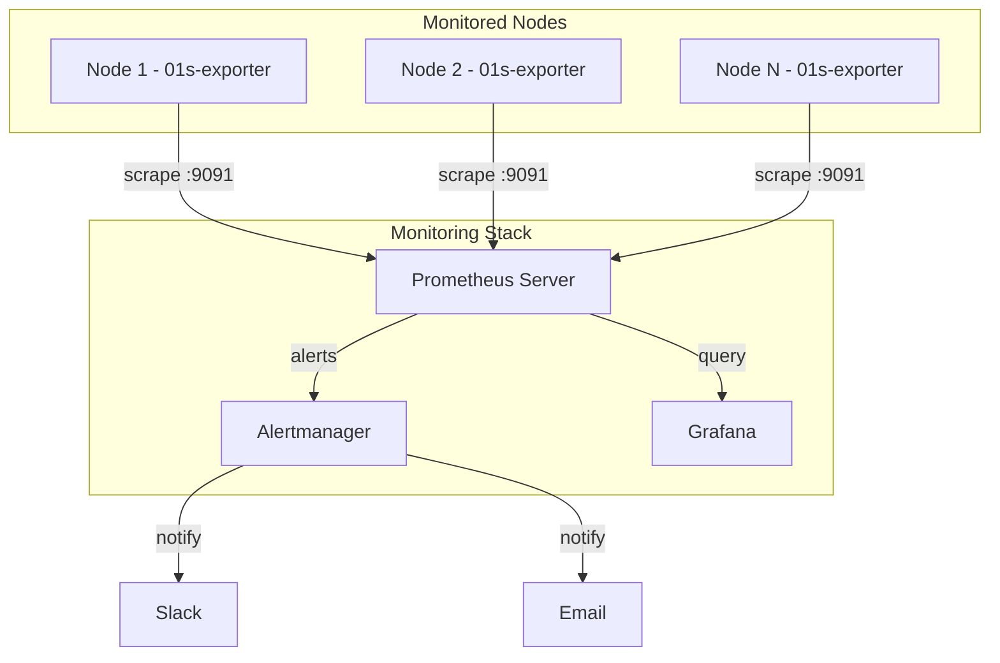

# Set Up Monitoring

This guide covers setting up Prometheus and Grafana monitoring, and integrating 01s-ledger health metrics.

## Step 1: Install Monitoring Stack

```bash
# Install Prometheus
sudo pacman -S prometheus

# Install Grafana
sudo pacman -S grafana

# Install node exporter
sudo pacman -S prometheus-node-exporter

# Enable services
sudo systemctl enable --now prometheus prometheus-node-exporter
sudo systemctl enable --now grafana
```

## Step 2: Configure Prometheus

```yaml
# /etc/prometheus/prometheus.yml
global:
  scrape_interval: 15s
  evaluation_interval: 15s

scrape_configs:
  - job_name: 'prometheus'
    static_configs:
      - targets: ['localhost:9090']

  - job_name: 'node'
    static_configs:
      - targets: ['localhost:9100']

  - job_name: '01s-ledger'
    metrics_path: '/metrics'
    static_configs:
      - targets: ['localhost:9091']

  - job_name: '01s-health'
    scrape_interval: 60s
    static_configs:
      - targets: ['localhost:9092']
```

## Step 3: Ledger Metrics Exporter

```python
#!/usr/bin/env python3
# /usr/local/bin/01s-ledger-exporter.py
"""Export 01s ledger metrics for Prometheus."""
import subprocess
import re
from http.server import HTTPServer, BaseHTTPRequestHandler

METRICS_TEMPLATE = """# HELP 01s_ledger_entries Total entries in ledger
# TYPE 01s_ledger_entries gauge
01s_ledger_entries{ledger="today"} {entries}

# HELP 01s_ledger_verified Ledger verification status (1=pass, 0=fail)
# TYPE 01s_ledger_verified gauge
01s_ledger_verified{ledger="today"} {verified}

# HELP 01s_health_tests_total Total health tests run
# TYPE 01s_health_tests_total counter
01s_health_tests_total {health_tests}

# HELP 01s_health_passes Health test passes
# TYPE 01s_health_passes gauge
01s_health_passes {health_passes}

# HELP 01s_health_fails Health test failures
# TYPE 01s_health_fails gauge
01s_health_fails {health_fails}

# HELP 01s_uptime_seconds System uptime in seconds
# TYPE 01s_uptime_seconds gauge
01s_uptime_seconds {uptime}
"""

def get_ledger_metrics():
    metrics = {'entries': 0, 'verified': 0, 'health_tests': 0,
               'health_passes': 0, 'health_fails': 0, 'uptime': 0}
    
    try:
        result = subprocess.run(['01s-ledger', 'status'],
            capture_output=True, text=True, timeout=5)
        m = re.search(r'Entries:\s+(\d+)', result.stdout)
        if m: metrics['entries'] = int(m.group(1))
    except: pass
    
    try:
        result = subprocess.run(['01s-ledger', 'verify'],
            capture_output=True, text=True, timeout=10)
        metrics['verified'] = 1 if result.returncode == 0 else 0
    except: pass
    
    try:
        with open('/proc/uptime') as f:
            metrics['uptime'] = int(float(f.read().split()[0]))
    except: pass
    
    return metrics

class MetricsHandler(BaseHTTPRequestHandler):
    def do_GET(self):
        if self.path == '/metrics':
            metrics = get_ledger_metrics()
            self.send_response(200)
            self.send_header('Content-Type', 'text/plain')
            self.end_headers()
            self.wfile.write(METRICS_TEMPLATE.format(**metrics).encode())

if __name__ == '__main__':
    server = HTTPServer(('0.0.0.0', 9091), MetricsHandler)
    print('01s Ledger Exporter running on :9091')
    server.serve_forever()
```

### Create systemd service

```ini
# /etc/systemd/system/01s-ledger-exporter.service
[Unit]
Description=01s Ledger Metrics Exporter
After=01s-ledger.service

[Service]
Type=simple
ExecStart=/usr/local/bin/01s-ledger-exporter.py
Restart=always
User=nobody

[Install]
WantedBy=multi-user.target
```

## Step 4: Health Ledger Integration

```bash
#!/usr/bin/env bash
# /usr/local/bin/01s-health-exporter.sh
set -euo pipefail

DATE=$(date +%Y-%m-%d)
HEALTH_FILE="logs/health/${DATE}.health"
if [ ! -f "$HEALTH_FILE" ]; then
    echo "01s_health_entries 0"
    exit 0
fi

PASS=$(grep -c '"status":"pass"' "$HEALTH_FILE")
FAIL=$(grep -c '"status":"fail"' "$HEALTH_FILE")
WARN=$(grep -c '"status":"warn"' "$HEALTH_FILE")
TOTAL=$((PASS + FAIL + WARN))

echo "# HELP 01s_health_entries Total health ledger entries"
echo "# TYPE 01s_health_entries gauge"
echo "01s_health_entries{date=\"${DATE}\"} ${TOTAL}"
echo "01s_health_passes{date=\"${DATE}\"} ${PASS}"
echo "01s_health_fails{date=\"${DATE}\"} ${FAIL}"
```

## Step 5: Grafana Dashboard

### Import Dashboard JSON

```json
{
  "dashboard": {
    "title": "01s Sovereign Monitoring",
    "panels": [
      {"title": "Ledger Entries", "type": "graph",
       "targets": [{"expr": "01s_ledger_entries"}]},
      {"title": "Ledger Verification Status", "type": "stat",
       "targets": [{"expr": "01s_ledger_verified"}]},
      {"title": "Health Test Results", "type": "piechart",
       "targets": [
         {"expr": "01s_health_passes", "legendFormat": "Pass"},
         {"expr": "01s_health_fails", "legendFormat": "Fail"},
         {"expr": "01s_health_warnings", "legendFormat": "Warn"}
       ]},
      {"title": "System Uptime", "type": "stat",
       "targets": [{"expr": "01s_uptime_seconds"}]}
    ],
    "refresh": "30s"
  }
}
```

## Step 6: Alert Rules

```yaml
# /etc/prometheus/alert-rules.yml
groups:
  - name: 01s
    rules:
      - alert: LedgerVerificationFailed
        expr: 01s_ledger_verified == 0
        for: 5m
        annotations:
          summary: "Ledger verification failed"
      
      - alert: HealthCheckFailure
        expr: 01s_health_fails > 0
        for: 10m
        annotations:
          summary: "Health check failure detected"
      
      - alert: LedgerStoppedGrowing
        expr: rate(01s_ledger_entries[1h]) == 0
        for: 2h
        annotations:
          summary: "Ledger not receiving entries"
```

## Monitoring Architecture Diagram


## Deployment Troubleshooting

### Common Deployment Issues

| Issue | Cause | Solution |
|-------|-------|----------|
| PXE boot fails | DHCP not configured | Check dnsmasq service |
| Node not in inventory | DNS not resolving | Add to /etc/hosts |
| Ansible connection refused | SSH not running | Enable sshd.service |
| Ledger init fails | HOME not set | Use explicit --home flag |
| Health check fails | Missing logs dir | Create logs/health/ |
| Package install fails | Mirror not synced | Run pacman -Sy |

### Validation Commands

```bash
# Verify deployment
ansible all -m ping
ansible all -m shell -a "01s-ledger verify"
ansible all -m shell -a "systemctl is-active 01s-ledger"
ansible all -m shell -a "df -h /"

# Check replication
for node in node-01 node-02; do
    ssh $node "01s-ledger status | head -5"
done

# Health check all nodes
for node in $(cat inventory/hosts); do
    echo "=== $node ==="
    ssh $node "01s-ledger health status" 2>/dev/null || echo "Unreachable"
done
```

### Log Files

| Log | Location | Purpose |
|-----|----------|---------|
| PXE/DHCP | /var/log/dnsmasq.log | Boot requests |
| HTTP | /var/log/nginx/access.log | File transfers |
| Ansible | ~/.ansible/log/ | Automation logs |
| Ledger | ~/ledger/*.aioss | Audit entries |
| Health | logs/health/*.health | Diagnostics |
| System | journalctl -u 01s-ledger | Service logs |

## Automation Scripts

### Mass Ledger Initialization

```bash
#!/bin/bash
# init-all-ledgers.sh
for node in $(cat nodes.txt); do
    ssh root@$node "01s-ledger init && 01s-ledger log deployment status=init"
    echo "Initialized: $node"
done
```

### Compliance Report Generator

```bash
#!/bin/bash
# generate-compliance-report.sh
OUTPUT="/var/reports/compliance-$(date +%Y%m%d)"
mkdir -p $OUTPUT

for node in $(cat nodes.txt); do
    ssh root@$node "01s-ledger verify && 01s-ledger export" > $OUTPUT/$node.json
done

tar czf $OUTPUT.tar.gz $OUTPUT
```

### Backup All Nodes

```bash
#!/bin/bash
# backup-all.sh
for node in $(cat nodes.txt); do
    ssh root@$node "/usr/local/bin/01s-backup.sh"
    scp root@$node:/var/backups/01s/01s-dr-backup-*.tar.gz /backups/
done
```

## Monitoring Integration Guide

### Prometheus Node Discovery

```yaml
# /etc/prometheus/file_sd_configs/01s-nodes.yml
- targets:
    - node-01:9091
    - node-02:9091
    - node-03:9091
  labels:
    job: 01s-ledger
    environment: production
```

### Grafana Dashboard Variables

```json
{
  "templating": {
    "list": [
      {
        "name": "node",
        "type": "query",
        "query": "label_values(01s_ledger_entries, instance)"
      }
    ]
  }
}
```

## Rollback Procedures

### Rolling Back a Deployment

1. Identify the issue from logs
2. Fix the configuration/template
3. Re-run Ansible playbook:
   ```bash
   ansible-playbook -i inventory deploy-01s.yml --limit failed-node
   ```
4. Verify fix on the node
5. Continue with remaining nodes

### Full Rollback to Previous Snapshot

```bash
# If deployment is completely broken:
# 1. Boot from ISO on each node
# 2. Restore from pre-deployment backup
for node in $(cat nodes.txt); do
    ssh root@$node "
        systemctl stop 01s-ledger
        cp -r /backups/pre-deploy/ledger/* ~/ledger/
        systemctl start 01s-ledger
        01s-ledger verify
    "
done
```

## Performance Reference

### Expected Performance Metrics

| Metric | Desktop | Server | Ledger Node |
|--------|---------|--------|-------------|
| Boot time | 15-30s | 10-20s | 10-15s |
| Ledger verify | <1s | <1s | <1s |
| Health check | <0.5s | <0.5s | <0.5s |
| Memory usage | 50-100 MB | 30-60 MB | 30-50 MB |
| Disk I/O | Low | Low | Low |
| Network I/O | Minimal | Minimal | Minimal |

### Bottleneck Identification

| Symptom | Likely Bottleneck | Tool |
|---------|-------------------|------|
| Slow ledger verify | Disk I/O | iostat -x 1 |
| Slow health checks | CPU | mpstat -P ALL 1 |
| Slow replication | Network | iperf3 -c server |
| Slow boot | systemd services | systemd-analyze blame |
| Slow application | Memory | free -h, vmstat 1 |

---

Lois-Kleinner and 0-1.gg 2026 Copyright
## Advanced Diagnostic Procedures

### Ledger Performance Profiling

```bash
# Profile ledger operations
time 01s-ledger verify
time 01s-ledger export > /dev/null
time 01s-ledger status

# Check ledger file size growth
watch -n 60 'du -sh ~/ledger/'

# Monitor system resources during ledger operations
top -b -n 1 | grep "01s-ledger"
```

### Network Diagnostic Procedures

```bash
# Full network diagnostic suite
echo "=== Network Diagnostics ==="
echo "--- Interfaces ---"
ip link show
echo "--- IP Addresses ---"
ip addr show
echo "--- Routing ---"
ip route show
echo "--- DNS ---"
cat /etc/resolv.conf
echo "--- Connectivity ---"
ping -c 2 8.8.8.8
echo "--- Open Ports ---"
ss -tulpn
```

### System Health Check Script

```bash
#!/bin/bash
# health-check.sh
echo "=== System Health Check ==="
echo "Date: $(date)"
echo ""
echo "--- CPU ---"
top -bn1 | grep "Cpu(s)"
echo ""
echo "--- Memory ---"
free -h
echo ""
echo "--- Disk ---"
df -h /
echo ""
echo "--- Load ---"
uptime
echo ""
echo "--- Services ---"
systemctl --failed
echo ""
echo "--- Ledger ---"
01s-ledger verify > /dev/null 2>&1 && echo "Ledger: OK" || echo "Ledger: FAILED"
echo ""
echo "--- Last Boot ---"
who -b
```

## Common Troubleshooting Scenarios

### Scenario 1: System Won't Wake from Suspend

**Symptoms**: Screen stays black, system unresponsive after opening laptop lid.
**Causes**: GPU driver issue, ACPI problem, firmware bug.

**Diagnostic Steps**:
1. Try switching TTY (Ctrl+Alt+F2)
2. If TTY works, restart GDM: `sudo systemctl restart gdm`
3. Check kernel messages: `dmesg | grep -i "drm\|gpu\|acpi"`
4. Check journal: `journalctl -b | grep -i "resume\|suspend"`
5. Test with different kernel parameters: `acpi=off`, `nouveau.modeset=0`

### Scenario 2: Bluetooth Device Won't Pair

**Symptoms**: Device discovered but pairing fails.
**Causes**: Wrong PIN, driver issue, device compatibility.

**Diagnostic Steps**:
1. Restart Bluetooth: `sudo systemctl restart bluetooth`
2. Remove and re-scan: `bluetoothctl remove XX:XX:XX:XX:XX:XX`
3. Check kernel module: `lsmod | grep bluetooth`
4. Try manual pairing: `bluetoothctl pair XX:XX:XX:XX:XX:XX`
5. Check compatibility list for your device

### Scenario 3: USB Device Not Recognized

**Symptoms**: Device plugged in but not detected.
**Causes**: Driver missing, power issue, hardware fault.

**Diagnostic Steps**:
1. Check dmesg: `dmesg | tail -20` (look for USB-related messages)
2. List USB devices: `lsusb`
3. Check power: `cat /sys/bus/usb/devices/*/power/control`
4. Reset USB: `sudo modprobe -r usbcore && sudo modprobe usbcore`
5. Try different port or cable

## Package Management Best Practices

### Pre-Update Checklist

```bash
# Before running system updates:
echo "=== Pre-Update Checks ==="
echo "1. Check disk space: $(df -h / | tail -1 | awk '{print $4}') free"
echo "2. Check memory: $(free -h | grep Mem | awk '{print $7}') available"
echo "3. Backup ledger: $(01s-ledger verify > /dev/null 2>&1 && echo 'OK' || echo 'FAILED')"
echo "4. Check internet: $(ping -c 1 8.8.8.8 > /dev/null 2>&1 && echo 'OK' || echo 'FAILED')"
echo "5. Check battery: $(cat /sys/class/power_supply/BAT0/capacity 2>/dev/null || echo 'N/A')%"
```

### Post-Update Checklist

```bash
# After running system updates:
echo "=== Post-Update Checks ==="
sudo pacman -Qkk | grep -v "0 missing files" || echo "All files verified"
01s-ledger verify && echo "Ledger chain intact" || echo "Ledger FAILED"
01s-ledger toolchain && echo "Toolchain verified" || echo "Toolchain FAILED"
systemctl --failed || echo "All services running"
```

### Package Cache Management

```bash
# Automatic cache cleanup
cat > /etc/systemd/system/paccache-clean.service << 'EOF'
[Unit]
Description=Clean pacman cache

[Service]
Type=oneshot
ExecStart=/usr/bin/paccache -r
ExecStart=/usr/bin/paccache -rk 2
EOF

cat > /etc/systemd/system/paccache-clean.timer << 'EOF'
[Unit]
Description=Weekly pacman cache cleanup

[Timer]
OnCalendar=weekly
Persistent=true

[Install]
WantedBy=timers.target
EOF

sudo systemctl enable --now paccache-clean.timer
```

## User Support Escalation Path

### L1: Self-Service (User)

1. Check documentation
2. Search known issues
3. Try listed workarounds
4. Check FAQ
5. Review system logs

### L2: Community Support (Peer)

1. Ask in Matrix chat
2. Post on GitHub Discussions
3. Search GitHub Issues
4. Ask on mailing list
5. Request help from community

### L3: Technical Support (Maintainer)

1. Create GitHub Issue
2. Include system information
3. Provide reproduction steps
4. Attach relevant logs
5. Wait for maintainer response

### L4: Enterprise Support (Dedicated)

1. Submit support ticket
2. Call dedicated hotline
3. Request live assistance
4. Schedule remote session
5. Request on-site visit

## Performance Tuning Guide

### CPU Performance Tuning

```bash
# Check CPU governor
cat /sys/devices/system/cpu/cpu*/cpufreq/scaling_governor

# Set performance governor
echo performance | sudo tee /sys/devices/system/cpu/cpu*/cpufreq/scaling_governor

# Disable C-states (reduce latency)
sudo nano /etc/default/grub
# Add: processor.max_cstate=1 intel_idle.max_cstate=0
sudo grub-mkconfig -o /boot/grub/grub.cfg
```

### Memory Performance Tuning

```bash
# Reduce swappiness
echo 10 | sudo tee /proc/sys/vm/swappiness

# Enable swap compression (zram)
sudo pacman -S zram-generator
sudo systemctl enable --now systemd-zram-setup@zram0

# Check swap usage
swapon --show

# Clear memory cache (temporary)
echo 3 | sudo tee /proc/sys/vm/drop_caches
```

### Disk Performance Tuning

```bash
# Check I/O scheduler
cat /sys/block/sda/queue/scheduler

# Set scheduler to none (NVMe) or mq-deadline (SSD)
echo none | sudo tee /sys/block/nvme0n1/queue/scheduler

# Enable TRIM for SSDs
sudo systemctl enable --now fstrim.timer

# Check disk health
sudo smartctl -a /dev/sda | grep -i "health\|temperature\|reallocated"
```

---

Lois-Kleinner and 0-1.gg 2026 Copyright

