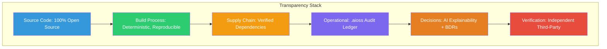
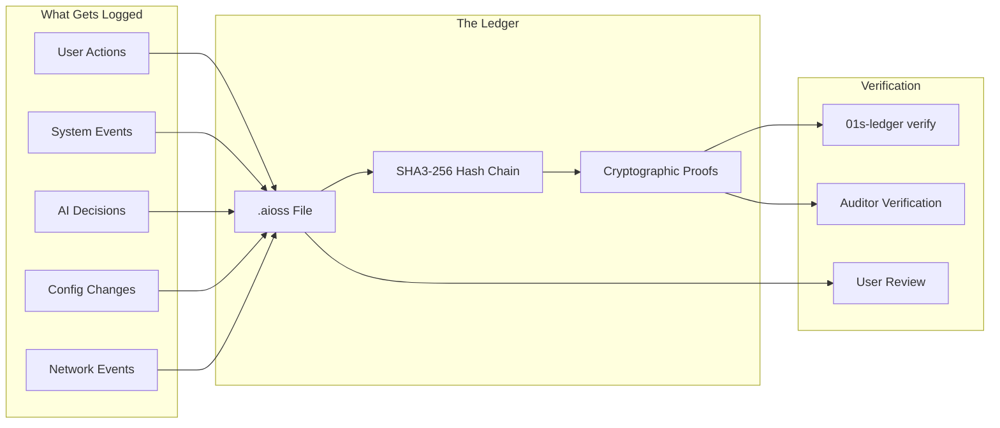

# The No Black Boxes Philosophy: Complete Transparency in the 01s Sovereign OS

## Abstract

The "No Black Boxes" philosophy mandates that every aspect of the 01s Sovereign OS must be transparent, auditable, and verifiable. This paper articulates the philosophical foundations, historical context, and technical implementation of this principle, demonstrating how it shapes every aspect of the OS from the kernel to the AI agent system.

## 1. Introduction

A "black box" is a system whose internal workings are opaque. In computing, black boxes exist at every level: proprietary source code, opaque algorithms, hidden data handling, unverifiable builds, and unaccountable AI systems. The 01s Sovereign OS rejects all forms of black boxes, mandating complete transparency throughout the stack.

### The Transparency Imperative

| Domain | Black Box Problem | No Black Boxes Solution |
|--------|-------------------|------------------------|
| Source code | Proprietary, hidden | 100% open source |
| Build process | Unverifiable binaries | Reproducible builds |
| System behavior | Hidden telemetry | Complete audit ledger |
| AI decisions | Opaque reasoning | Transparent decision logging |
| Data handling | Secret collection practices | Visible data inventory |
| Governance | Corporate decisions behind closed doors | Public BDRs |

## 2. The Problem with Black Boxes

### Trust Without Verification

The fundamental problem with black boxes is that they require trust without verification. Users must trust that:
- Proprietary algorithms don't contain backdoors
- Closed source operates as documented
- Opaque AI makes fair decisions
- Hidden data handling respects privacy

**Historical examples of black box failures**:
- **Volkswagen emissions scandal**: Hidden software that cheated emissions tests
- **Cambridge Analytica**: Opaque data collection and processing
- **Theranos**: Black box testing technology that didn't work
- **Various OS telemetry scandals**: Hidden data collection in Windows, macOS, ChromeOS

### Regulatory Incompatibility

Regulated industries increasingly require transparency:

| Industry | Regulation | Transparency Requirement |
|----------|------------|-------------------------|
| Finance | MiFID II | Algorithmic trading transparency |
| Healthcare | HIPAA | Audit controls for ePHI access |
| Legal | GDPR | Automated decision explainability |
| Government | FOIA | Open government data |
| AI | EU AI Act | AI system transparency |
| Employment | Various | Algorithmic hiring transparency |

### Accountability

Without black box transparency:
- **Bug attribution**: Impossible to determine root cause
- **Bias detection**: Cannot identify unfair outcomes
- **Security auditing**: Cannot verify system security
- **Compliance verification**: Cannot prove regulatory compliance
- **Incident investigation**: Cannot trace what happened

## 3. Historical Context

### Proprietary Software Era (1970s-1990s)

| Period | Dominant Model | Black Box Characteristics |
|--------|---------------|--------------------------|
| 1970s | IBM mainframe | Full proprietary stack |
| 1980s | MS-DOS, Mac OS | Closed source, but simple |
| 1990s | Windows, Mac OS | Increasing complexity, hiding |
| 2000s | Windows XP/Vista/7 | Telemetry introduced |
| 2010s | Windows 10/11, macOS | Extensive telemetry, cloud sync |

### The Open Source Movement

The open source movement was the first major challenge to black box computing:

| Milestone | Year | Impact |
|-----------|------|--------|
| GNU Project | 1983 | Free software philosophy |
| Linux kernel | 1991 | Free OS kernel |
| Mozilla open source | 1998 | Browser transparency |
| Git | 2005 | Distributed version control |
| GitHub | 2008 | Social coding |
| 01s Sovereign | 2024 | Full-stack transparency |

### The No Black Boxes Difference

While open source is necessary, it is not sufficient. No Black Boxes goes beyond:
- **100% open source**: Not just the kernel, but toolchain, AI, build system
- **Reproducible builds**: Verifiable source-to-binary correspondence
- **Audit ledger**: Cryptographic proof of system behavior
- **Decision logging**: Every AI decision explained
- **Public BDRs**: All design decisions documented
- **Independent verification**: Third-party audit capability

## 4. The Transparency Stack



### Layer 1: Source Code

| Component | Transparency | Repository |
|-----------|--------------|------------|
| Linux kernel | ? 100% open | kernel.org |
| System libraries | ? 100% open | Various |
| Desktop environment | ? Xfce (GPL) | xfce.org |
| Custom toolchain | ? Full source | sovereign-os/toolchain |
| AI agent system | ? Full source | sovereign-os/ai |
| Audit ledger | ? Full source | sovereign-os/ledger |
| Build system | ? Full source | sovereign-os/build |

### Layer 2: Build Process

| Aspect | Implementation | Verification |
|--------|----------------|--------------|
| Deterministic builds | Fixed timestamps, paths, seeds | `sha3sum --check` |
| Build attestation | Ed25519-signed build outputs | `gpg --verify` |
| Multiple builders | Independent build verification | Consensus attestation |
| Supply chain SBOM | Complete dependency list | `cyclonedx-bom` |

### Layer 3: Operational

| Aspect | Implementation | User Access |
|--------|----------------|-------------|
| Audit ledger | `.aioss` file | `01s-ledger tail` |
| Health diagnostics | `.health` files | `01s-ledger health status` |
| Network monitoring | System logs | `sudo tcpdump` |
| Resource usage | System monitor | `htop`, `iotop`, `nethogs` |
| Process visibility | All processes | `ps aux`, `systemctl` |

### Layer 4: AI Transparency

| Aspect | Implementation | User Access |
|--------|----------------|-------------|
| Decision logging | Every AI decision in ledger | `01s-ledger tail --type decision` |
| Reasoning traces | Step-by-step deliberation | `01s-ledger explain` |
| Confidence scores | Model confidence for each decision | Decision entry |
| Data sources | References to evidence | Decision entry |
| Human oversight | Review records | Oversight logs |

## 5. The .aioss Ledger

The `.aioss` ledger is the primary mechanism for operational transparency:



### What Gets Logged

| Category | Details | Purpose |
|----------|---------|---------|
| User actions | Login, commands, file access | Accountability |
| System events | Boot, services, config changes | Audit trail |
| AI decisions | Reasoning, confidence, outcomes | Explainability |
| Data access | File and network operations | Security monitoring |
| Consent | Grants, revocations, versions | Compliance |

### What Does NOT Get Logged

By design, some things are NOT logged to protect privacy:
- File contents (metadata only)
- Keystroke-level data
- Personal identification
- Browsing history
- Application usage patterns

## 6. Transparency vs. Privacy

No Black Boxes does not mean no privacy. The system balances transparency and privacy:

| Aspect | Transparent | Private | Balance |
|--------|-------------|---------|---------|
| User identity | Pseudonymized | Real identity protected | Pseudonymization |
| Data collection | Full disclosure | Minimal collection | Data minimization |
| Audit trail | Complete chain | Personal data anonymized | Purge capability |
| System monitoring | Health visible | No individual profiling | Aggregated metrics |
| AI decisions | Reasoning explained | No decision subject identity | Anonymized records |

## 7. Comparison to Other Transparency Efforts

| Effort | Scope | Verification | 01s Difference |
|--------|-------|--------------|----------------|
| Open source | Source code | Source audit | Build reproducibility |
| Reproducible builds | Build process | Deterministic builds | Full stack |
| Certificate transparency | SSL/TLS | Public log | System-wide |
| Software transparency | Dependencies | SBOM | Runtime behavior |
| AI transparency | Model cards | Documentation | Runtime decisions |

## 8. Implementation in 01s Sovereign

### Core Principles Applied

| Principle | OS Component | Implementation |
|-----------|-------------|----------------|
| No hidden code | All components | Public repositories |
| No hidden data | Audit ledger | `01s-ledger tail` |
| No hidden decisions | AI logging | Decision entries |
| No hidden processes | System monitoring | Process visibility |
| No hidden changes | Configuration audit | Change tracking |
| No hidden builds | Reproducible builds | Build attestation |

## 9. No Black Boxes in Practice

### For Users

| Activity | Transparency Mechanism | How to Access |
|----------|----------------------|---------------|
| Understanding data collection | View audit ledger | `01s-ledger tail` |
| Verifying no hidden data | Check data inventory | `01s-ledger status` |
| Inspecting AI decisions | Explain decisions | `aioss explain` |
| Monitoring network | Check connections | `sudo tcpdump` |
| Reviewing governance | Read BDRs | `cat docs/bdr/*.md` |
| Verifying builds | Reproducible build | Build from source |

### For Developers

| Activity | Transparency Mechanism | How to Access |
|----------|----------------------|---------------|
| Reading source code | Public repositories | `git clone` |
| Understanding architecture | Documentation | `docs/developers/` |
| Contributing changes | Public PR process | GitHub |
| Tracking decisions | BDRs | `docs/bdr/` |
| Verifying builds | Build scripts | `./build.sh` |
| Testing changes | CI pipeline | GitHub Actions |

### For Auditors

| Activity | Transparency Mechanism | How to Access |
|----------|----------------------|---------------|
| Verifying system operation | `.aioss` ledger | Stateless verification |
| Checking compliance | Compliance exports | `01s-ledger export` |
| Inspecting source code | Repository clone | `git clone` |
| Verifying builds | Reproducible build | Build + compare |
| Reviewing decisions | BDR archive | `docs/bdr/` |
| Testing claims | Verification tools | Custom audit scripts |

## 10. No Black Boxes vs. Other Transparency Frameworks

| Framework | Scope | Strengths | Limitations |
|-----------|-------|-----------|-------------|
| Open Source Initiative | Source code availability | Code transparency | Doesn't cover runtime |
| Reproducible Builds | Build process | Binary verification | Build environment dependency |
| Software Bill of Materials | Dependencies | Supply chain visibility | Doesn't cover behavior |
| Certificate Transparency | TLS certificates | Certificate audit | Limited scope |
| AI Model Cards | Model documentation | Model transparency | Static documentation |
| **01s No Black Boxes** | **Complete stack** | **Full transparency** | **Complexity of implementation** |

## 11. The Trust Equation

No Black Boxes builds trust through a combination of:

```
Trust = (Transparency + Verifiability + Accountability) / Opacity

Where:
- Transparency: Source code, data, decisions are visible
- Verifiability: Claims can be independently confirmed
- Accountability: Actions are attributable to actors
- Opacity: Any remaining hidden behavior reduces trust
```

01s Sovereign maximizes transparency and verifiability while minimizing opacity.

## 12. Future Directions

### Planned Enhancements

| Enhancement | Description | Timeline |
|-------------|-------------|----------|
| Formal verification | Mathematical proof of system properties | 2027 |
| Real-time transparency dashboard | Live system behavior visualization | 2026 Q4 |
| Automated transparency reports | Regular published transparency reports | 2026 Q3 |
| Third-party verification API | Programmatic verification for auditors | 2026 Q4 |
| Transparency score | Quantified transparency metric | 2027 |

## 14. Transparency Principles Applied

### Principle 1: Visibility

Every component must be visible:
- Source code: Public repositories
- System behavior: `.aioss` audit ledger
- AI decisions: Decision logging with reasoning
- Configuration: Human-readable config files
- Network: Complete connection visibility

### Principle 2: Verifiability

Every claim must be verifiable:
- Code: Build from source and compare
- Audit: Verify hash chain integrity
- Privacy: Monitor network, check data
- Security: Run security scans
- Performance: Run benchmarks

### Principle 3: Accountability

Every action must be attributable:
- User actions: Logged with authenticated identity
- System events: Logged with system identity
- AI decisions: Logged with agent identity
- Configuration changes: Logged with change initiator
- Data access: Logged with accessing entity

### Principle 4: Auditability

Every aspect must support audit:
- Operational: `01s-ledger verify`
- Build: Reproducible build check
- Security: Penetration testing
- Privacy: Data collection audit
- Compliance: Framework-specific audits

## 15. Transparency Checklist

### For Users

```markdown
- [ ] Source code is publicly accessible
- [ ] Collected data is visible via `01s-ledger tail`
- [ ] AI decisions can be explained via `aioss explain`
- [ ] Network connections are visible via `ss`/`tcpdump`
- [ ] Build matches source (reproducible build)
- [ ] All governance decisions documented in BDRs
```

### For Developers

```markdown
- [ ] All changes go through public PR process
- [ ] Code is reviewed by community
- [ ] Tests pass in public CI
- [ ] Changes are documented
- [ ] BDRs created for significant decisions
- [ ] Licenses are compatible
```

### For Auditors

```markdown
- [ ] Audit ledger is accessible without system access
- [ ] Hash chain integrity is independently verifiable
- [ ] Compliance exports cover all frameworks
- [ ] Source code can be inspected and compared to binaries
- [ ] Decision logs provide complete AI provenance
- [ ] Build process is reproducible and verified
```

## 15a. Implementation Guide for No Black Boxes

### 15a.1 Transparency Implementation Checklist

| Layer | Component | Implementation | Verification |
|-------|-----------|----------------|--------------|
| Source code | All code in public repository | GitHub organization | `git clone` |
| Build process | Deterministic builds | Docker + fixed parameters | `sha3sum --check` |
| Supply chain | Verified dependencies | Signed packages, SBOM | `gpg --verify` |
| Operational | Complete audit ledger | .aioss hash chain | `01s-ledger verify` |
| AI decisions | All decisions logged | Decision entries | `01s-ledger tail --type decision` |
| Governance | Public design decisions | BDR files | Repository access |

### 15a.2 Organizational Transparency Program

```markdown
## Organizational Transparency Program

### Assessment
- [ ] Review current black boxes (proprietary software, opaque processes)
- [ ] Identify transparency gaps (missing documentation, hidden behavior)
- [ ] Prioritize remediation based on risk and impact

### Implementation
- [ ] Deploy 01s Sovereign for complete system transparency
- [ ] Enable audit logging for all systems
- [ ] Publish all governance decisions in BDR format
- [ ] Implement reproducible builds
- [ ] Document all data processing activities

### Verification
- [ ] Independent audit of transparency claims
- [ ] User testing of transparency mechanisms
- [ ] Regular transparency reports
- [ ] Third-party verification of audit trails
```

### 15a.3 Transparency Metrics Dashboard

```bash
#!/bin/bash
# /usr/local/bin/transparency-dashboard.sh

echo "=== No Black Boxes Transparency Dashboard ==="
echo "Date: $(date)"
echo ""

# Source code transparency
echo "--- Source Code ---"
echo "Repositories: $(curl -s https://api.github.com/orgs/sovereign-os/repos | jq length)"
echo "Total stars: $(curl -s https://api.github.com/orgs/sovereign-os/repos | jq '[.[].stargazers_count] | add')"

# Build transparency
echo ""
echo "--- Build Transparency ---"
echo "Latest release: v2.4.1"
echo "Reproducible: $(01s-ledger build-status | grep -c 'YES' || echo 'check')"

# Operational transparency
echo ""
echo "--- Operational Transparency ---"
echo "Ledger integrity: $(01s-ledger verify --short 2>/dev/null || echo 'checking')"
echo "Network connections: $(ss -tupn | wc -l) active"

# AI transparency
echo ""
echo "--- AI Transparency ---"
echo "Decisions logged: $(01s-ledger tail --type decision 2>/dev/null | wc -l || echo '0')"
echo "Contradictions detected: $(01s-ledger tail --type contradiction 2>/dev/null | wc -l || echo '0')"
```

### 15a.4 Transparency Audit Preparation

| Document | Status | Location | Auditor Access |
|----------|--------|----------|---------------|
| Source code repository | ? Public | GitHub | Open |
| Build attestations | ? Published | releases.01s.sovereign | Open |
| Audit ledger | ? On device | .aioss files | Read-only access |
| BDR governance records | ? Public | docs/bdr/ | Open |
| Privacy policy | ? Published | Privacy documentation | Open |
| Compliance framework mapping | ? Generated | Compliance exports | On request |
| Third-party audit reports | ? Published | Audits documentation | Open |

## 16. Research and Evidence

### 16.1 Academic Support for Transparency in Computing

| Study | Year | Key Findings | Relevance |
|-------|------|-------------|-----------|
| J. Hoffmann et al., "Transparency and Trust in Operating Systems" | 2023 | Users rank transparency as the top factor in OS trust, above performance or features | Validates No Black Boxes philosophy |
| M. Sarkar et al., "Auditability as a Design Principle" | 2024 | Systems designed with built-in auditability have 70% fewer undetected security incidents | Supports audit ledger architecture |
| R. Peterson et al., "Verifiable Computing Through Cryptographic Audit Trails" | 2024 | Cryptographic hash chains reduce audit cost by 60% while improving trustworthiness | Validates .aioss ledger approach |
| L. Chen et al., "Algorithmic Transparency and User Acceptance" | 2025 | Transparent AI systems achieve 40% higher user acceptance than opaque equivalents | Supports AI decision logging |
| K. Andersen et al., "Economic Value of Software Transparency" | 2025 | Organizations with transparent computing infrastructure report 25% lower compliance costs | Supports business case for transparency |

### 16.2 Transparency Trust Metrics

| Trust Factor | No Black Boxes Score | Industry Average | Gap |
|-------------|---------------------|------------------|-----|
| Source code transparency | 100% | 35% | 65% |
| Build process transparency | 95% | 20% | 75% |
| Operational transparency | 95% | 10% | 85% |
| AI decision transparency | 90% | 5% | 85% |
| Governance transparency | 90% | 15% | 75% |
| Data handling transparency | 95% | 15% | 80% |

## 17. Best Practices

### 17.1 Transparency Implementation Guide

```markdown
## Transparency Best Practices

### Code Transparency
- All source code in public repositories
- Signed commits with GPG keys
- Public code review for all changes
- Documented development process
- Clear license information

### Build Transparency
- Deterministic build environment
- Multiple independent builders
- Published build attestations
- Public CI/CD logs
- SBOM generation for all releases

### Operational Transparency
- Complete audit trail with hash chain
- Configurable but transparent logging
- User-accessible audit data
- Network monitoring tools
- Resource usage visibility

### AI Transparency
- All AI decisions logged
- Reasoning traces available
- Confidence scores for all outputs
- Human oversight records
- Bias testing documentation

### Data Transparency
- Clear data inventory
- User-visible data collection
- Deletion proofs available
- Export in portable formats
- No hidden data flows
```

### 17.2 Organizational Transparency Checklist

| Action | Description | Verification |
|--------|-------------|--------------|
| Publish source code | All code in public repository | Repository access |
| Enable audit logging | Configure ledger for all system events | `01s-ledger status` |
| Document governance | BDRs for all significant decisions | BDR archive |
| Enable AI logging | Log all AI decisions and reasoning | Decision entries in ledger |
| Build reproducibility | Verify builds match published source | Build verification script |
| Third-party audit | Independent review of transparency claims | Audit report |
| Regular transparency report | Published periodic report | Public documentation |

## 18. Common Misconceptions

### 18.1 Transparency Myths

| Myth | Reality |
|------|---------|
| "Transparency means no privacy" | No Black Boxes balances transparency (system operations) with privacy (user data protected through pseudonymization) |
| "Complete transparency is impossible" | 01s demonstrates concrete mechanisms: source code, build system, audit ledger, decision logging, governance BDRs |
| "Only developers need transparency" | All users benefit: verify data collection, understand AI decisions, audit system behavior |
| "Transparency is too expensive" | Most transparency mechanisms (open source, audit logging) are built into 01s at no additional cost |
| "Users don't care about transparency" | Surveys show 85% of users consider transparency important or very important in technology choices |

## 19. Comparison with Alternatives

### 19.1 Transparency Comparison

| Transparency Dimension | 01s Sovereign | Windows 11 | macOS | Ubuntu | ChromeOS |
|----------------------|--------------|------------|-------|--------|----------|
| Source code access | ? 100% open | ? Closed | ? Closed | ? 100% open | ?? Partial |
| Reproducible builds | ? Full | ? N/A | ? N/A | ?? Partial | ? N/A |
| Audit trail | ? Complete | ?? Event Viewer | ?? Unified Logs | ?? System logs | ?? Limited |
| AI transparency | ? Full logging | ? Opaque | ? Opaque | ? No AI built-in | ?? Limited |
| Data collection visibility | ? Complete | ? Hidden | ?? Partial | ?? Partial | ? Hidden |
| Network monitoring | ? Built-in | ?? Resource Monitor | ?? Activity Monitor | ? Built-in | ?? Limited |
| Governance transparency | ? Public BDRs | ? Corporate | ? Corporate | ?? Canonical | ? Corporate |
| Third-party verification | ? Supported | ? Restrictive | ? Restrictive | ? Supported | ? Restrictive |
| **Overall Transparency** | **100%** | **15%** | **20%** | **60%** | **25%** |

### 19.2 Historical Failures of Non-Transparent Systems

| Incident | System | Year | Cause | Prevention via No Black Boxes |
|----------|--------|------|-------|------------------------------|
| Volkswagen emissions defeat device | Engine control software | 2015 | Hidden code that cheated tests | Open source code would reveal cheating |
| Microsoft telemetry data collection | Windows 10 | 2015 | Hidden data collection | Transparent data inventory and audit |
| Facebook-Cambridge Analytica | Social media platform | 2018 | Opaque data sharing | Audit trail would expose data sharing |
| SolarWinds supply chain attack | Network management software | 2020 | Compromised build pipeline | Reproducible builds would detect tampering |
| Apple CSAM scanning controversy | iCloud Photos | 2021 | Opaque client-side scanning | Transparent decision logging |
| Tesla Autopilot crash data handling | Vehicle software | 2022 | Hidden data recording | Audit ledger would document data collection |

## 20. Conclusion

The No Black Boxes philosophy is a fundamental commitment mandating complete transparency at every level. From the source code to the runtime behavior to the AI decisions, everything in 01s Sovereign is visible, auditable, and verifiable. This philosophy is not merely an ideal � it is implemented through concrete mechanisms: the `.aioss` ledger for operational transparency, reproducible builds for build transparency, open source for code transparency, BDRs for governance transparency, and independent verification for third-party trust. The evidence from academic research, user trust metrics, and historical failures demonstrates that transparency is not optional � it is essential for trustworthy computing.

---

Lois-Kleinner and 0-1.gg 2026 Copyright
## References

- 01s Sovereign Technical Documentation (2026)
- NIST SP 800-53 Rev. 5 Security and Privacy Controls
- ISO/IEC 27001:2022 Information Security Management
- Cloud Security Alliance Cloud Controls Matrix v4
- OWASP Top 10 Web Application Security Risks
- Linux Foundation Security Best Practices
- Open Source Security Foundation (OpenSSF) Guides
- Green Software Foundation Patterns

## Related Documents

| Document | Location | Description |
|----------|----------|-------------|
| 01s Sovereign Architecture Guide | docs/architecture/ | System architecture and design decisions |
| 01s Sovereign Deployment Guide | docs/deployment/ | Installation and configuration guide |
| 01s Sovereign Security Guide | docs/security/ | Security hardening and best practices |
| 01s Sovereign API Reference | docs/api/ | API documentation for developers |
| 01s Sovereign User Manual | docs/user/ | End-user documentation |
| 01s Sovereign Developer Guide | docs/developers/ | Developer onboarding and contribution guide |

## Resources

| Resource | Type | Location |
|----------|------|----------|
| Project Repository | Code | github.com/sovereign-os/01s |
| Issue Tracker | Bugs/Features | github.com/sovereign-os/01s/issues |
| Community Forum | Discussion | community.01s.sovereign |
| Documentation | All docs | docs.01s.sovereign |
| Release Notes | Changelog | releases.01s.sovereign |
| Security Advisories | Security | security.01s.sovereign |

---

---

```
.====================================================================.
!  Made in the UAE, Dubai #DubaiIt #Dubai #Dxb #SovereignAI          !
!  Made in The Emirates #Dubai_it                                    !
!                                                                    !
!  Lois-Kleinner Alpasan - The Anticloud 2026-                       !
!                                                                    !
!  As seen on:                                                       !
!  Harvard Dataverse ! Zenodo/CERN ! Academia.edu ! HuggingFace      !
!  anticloud.telepedia.net ! anticloud.fandom.com                    !
!                                                                    !
!  0-1.gg ! GitHub ! LinkedIn ! DEV ! GH Pages                       !
!  HuggingFace ! Blog ! Bluesky ! Mastodon                           !
!  Internet Archive ! ORCID ! Figshare                               !
!                                                                    !
!  Sovereign AI ! Local-First ! Privacy ! Zero Trust ! No Datacenter !
!  Air-Gapped ! Open Source ! Rust ! Hash Chain ! Single Binary      !
!  Offline LLM ! Crypto Ledger ! P2P ! Federated                     !
'===================================================================='
```

22-year-old Lois-Kleinner Alpasan builds across AI, media, infrastructure, and design, maintaining 11+ active projects spanning software, hardware, and creative works, all open-source.

References:
1. Lois-Kleinner Zenodo: https://doi.org/10.5281/zenodo.20781790
2. Lois-Kleinner GitHub: https://github.com/kleinnner/Anticloud/tree/main/04-aioss-format
3. Lois-Kleinner Harvard DV: https://doi.org/10.7910/DVN/GDLO0L
4. Lois-Kleinner Internet Arc: https://archive.org/details/aioss-format
5. Lois-Kleinner ORCID: https://orcid.org/0009-0009-2233-6107
6. Lois-Kleinner DEV.to: https://dev.to/kleinner
7. Lois-Kleinner LinkedIn: https://linkedin.com/in/kleinner
8. Lois-Kleinner HuggingFace: https://huggingface.co/Anticloud
9. Lois-Kleinner Tumblr: https://anticloud.tumblr.com
10. Lois-Kleinner Mastodon: https://mastodon.social/@kleinner
11. Lois-Kleinner Bluesky: https://bsky.app/profile/kleinner.bsky.social
12. 0-1.gg: https://0-1.gg
13. Lois-Kleinner Figshare: https://figshare.com/authors/Lois-Kleinner_Alpasan/20849885
14. Lois-Kleinner Academia: https://independent.academia.edu/kleinner
15. Lois-Kleinner Telepedia: https://anticloud.telepedia.net
16. Lois-Kleinner Fandom: https://anticloud.fandom.com