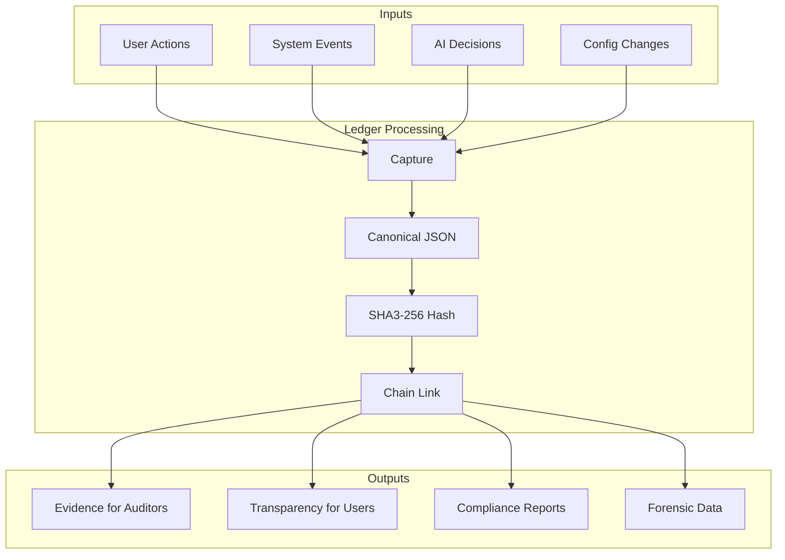
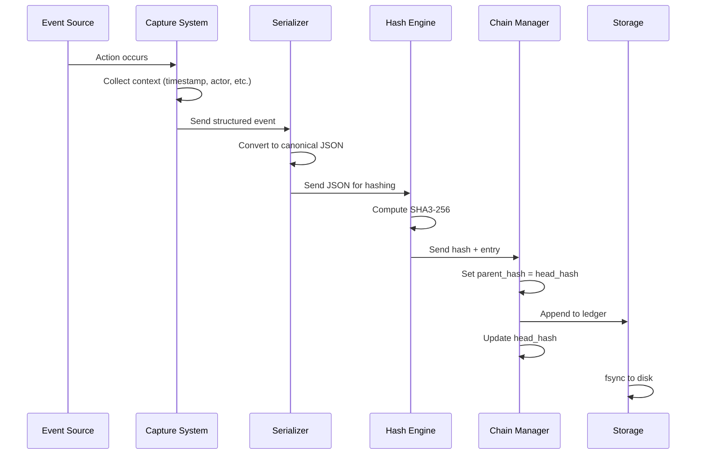

# The .aioss Transparency Ledger: Full Audit Trail of AI and System Operations

## Abstract

The .aioss ledger is the technical foundation of the No Black Boxes philosophy in the 01s Sovereign OS. This paper provides a comprehensive examination of how the ledger ensures transparency, what it records, how it can be verified, and how it enables trust in AI-mediated computing.

## 1. Introduction

If the No Black Boxes philosophy is the "what" of transparency, the .aioss ledger is the "how." The ledger provides an immutable, cryptographic record of all system activity, enabling anyone — users, auditors, regulators — to verify system behavior independently.

### The Role of the Ledger



## 2. Design for Transparency

### Append-Only Architecture

The ledger is strictly append-only — entries are never modified or deleted:

| Property | Benefit | Implementation |
|----------|---------|----------------|
| Complete history | Every event preserved | Append-only file |
| Tamper detection | Any modification detectable | SHA3-256 hash chain |
| Non-repudiation | No one can deny actions | Cryptographic link |
| Forensic value | Full event context preserved | Rich entry metadata |

### Comprehensive Recording

Six entry types cover all system activity:

| Entry Type | Description | Example |
|------------|-------------|---------|
| `user_message` | User input to system | Command, request |
| `ai_message` | AI system response | Output, decision |
| `tool_call` | Tool invocation | Function call, API request |
| `graph_mutation` | State change | Graph update |
| `contradiction` | Conflicting outputs | AI inconsistency |
| `decision` | Multi-agent decision | Voting outcome |

### Content Addressing

Each entry's hash is computed from its content:

```json
{
  "index": 42,
  "timestamp": "2026-06-19T14:30:00Z",
  "type": "decision",
  "actor": "ai_agent_v1",
  "actor_label": "Sovereign Agent v2.4",
  "content": {
    "proposal": "Approve document",
    "options": [{"text": "Approve", "voting_weight": 3}, {"text": "Reject", "voting_weight": 1}],
    "process_type": "multi_agent_voting",
    "winner": "Approve",
    "confidence": 0.85,
    "reasoning_summary": "Document meets all quality criteria"
  },
  "hash": "sha3-256:a1b2c3d4e5f6...",
  "parent_hash": "sha3-256:9f8e7d6c5b4a..."
}
```

The hash is computed as:
```
hash = SHA3-256(canonical_json(entry without hash field))
```

This ensures:
- **Integrity**: Any content change alters the hash
- **Uniqueness**: Different content produces different hash
- **Referencing**: Entries can be referenced by hash
- **Deduplication**: Identical entries produce identical hashes

## 3. Recording Process

### Step-by-Step Recording



### Recording Pipeline

1. **Event Occurrence**: The user, system, or AI agent performs an action
2. **Context Collection**: Actor, timestamp, action details, resource, result
3. **Serialization**: Canonical JSON format with sorted keys
4. **Hash Computation**: SHA3-256 over canonical JSON (excluding hash field)
5. **Chain Linking**: `parent_hash` set to previous entry's hash
6. **Storage**: Entry appended to .aioss file
7. **Optional Signing**: Head hash signed with Ed25519 key

### Implementation

```rust
fn record_entry(event: Event, ledger: &mut Ledger) -> Result<Hash> {
    let entry = Entry {
        index: ledger.next_index(),
        timestamp: Utc::now(),
        event_type: event.event_type,
        actor: event.actor,
        actor_label: event.actor_label,
        content: event.content,
        hash: Hash::zero(),  // placeholder
        parent_hash: ledger.head_hash(),
    };
    
    let canonical = serde_json::to_string(&entry)?;
    entry.hash = Sha3_256::digest(canonical.as_bytes());
    
    ledger.append(entry)?;
    
    Ok(entry.hash)
}
```

## 4. Transparency Across AI Operations

### AI Message Recording

Every AI message includes complete context:

```json
{
  "type": "ai_message",
  "timestamp": "2026-06-19T14:30:00Z",
  "actor": "ai_agent_v1",
  "content": {
    "response": "Based on the analysis, the document should be approved.",
    "reasoning_trace": [
      "1. Document passes format validation",
      "2. Content matches expected schema",
      "3. No contradictions detected",
      "4. Confidence threshold exceeded (0.85 > 0.70)"
    ],
    "confidence": 0.85,
    "referenced_data": ["doc_schema_v2", "validation_rules"],
    "token_count": 142,
    "duration_ms": 350,
    "model_version": "2.4.1"
  },
  "hash": "sha3-256:a1b2...",
  "parent_hash": "sha3-256:9f8e..."
}
```

### Tool Call Recording

Every tool invocation is recorded with arguments and results:

```json
{
  "type": "tool_call",
  "timestamp": "2026-06-19T14:30:01Z",
  "actor": "ai_agent_v1",
  "content": {
    "tool": "validate_document",
    "arguments": {
      "document_id": "doc_2026_0451",
      "schema_version": "2.1"
    },
    "result_summary": "Validation passed: 12 checks, 0 failures",
    "duration_ms": 120,
    "success": true
  },
  "hash": "sha3-256:b2c3...",
  "parent_hash": "sha3-256:a1b2..."
}
```

## 5. Verification Methods

### CLI Verification

```bash
# Verify a specific ledger
aioss verify /var/log/sovereign/ledgers/session_001.aioss

# Query entries
aioss query --type decision --actor ai

# Export verification proof
aioss export --format json --since 2026-01-01

# Cross-verify multiple ledgers
aioss cross-verify --ledgers session_001.aioss session_002.aioss
```

### Automated Verification

| Trigger | Action | Frequency |
|---------|--------|-----------|
| On write | Verify new entry's hash chain | Continuous |
| Periodic timer | Full chain verification | Daily |
| On demand | User-initiated verification | As needed |
| Critical events | Security-triggered verification | Event-based |

### Third-Party Verification

```bash
# Auditor receives: .aioss file + public key
# Verification requires NO system access:

# Step 1: Verify chain integrity
aioss verify --file evidence_2026_Q2.aioss

# Step 2: Query evidence
aioss query --file evidence_2026_Q2.aioss --type security_event

# Step 3: Verify state proof signature
aioss verify-state-proof --proof state_proof.json
```

### Verification Output

Successful:
```
$ aioss verify session.aioss
Ledger: session.aioss
Entries: 1,442
Verification: PASS
  Genesis Hash: a1b2... (verified)
  Head Hash:     9f8e... (verified)
  Chain Integrity: All parent hashes valid (PASS)
  State Proof: Ed25519 signature valid (PASS)
```

Failed:
```
$ aioss verify session.aioss
Verification: FAIL
  Tampered entries: 1 (index 87)
  Broken links: 1 (entry 88 parent_hash mismatch)
  Recommended: Investigate entry 87 immediately.
```

## 6. What Gets Logged and What Doesn't

### Logged

| Category | Details |
|----------|---------|
| User inputs | Commands, queries, requests |
| AI responses | Outputs, reasoning, confidence |
| Tool invocations | Tool name, arguments, results |
| System events | Boot, shutdown, config changes |
| AI decisions | Proposals, voting, outcomes |
| Contradictions | Conflicting outputs |
| Consent changes | Grants, revocations |
| Security events | Access attempts, failures |

### NOT Logged

| Category | Reason |
|----------|--------|
| File contents | Privacy protection |
| Keystroke-level data | Privacy protection |
| Personal identification | Minimization |
| Browsing history | Out of scope |
| Application usage | Privacy protection |
| Network packet contents | Bandwidth concern |
| Real-time screen captures | Privacy and size |

## 7. Case Studies

### Regulatory Audit

**Scenario**: Financial institution needs to demonstrate AI decision transparency to regulator

**Process**:
1. Export ledger for audit period
2. Verify hash chain integrity
3. Query AI decisions for specific transactions
4. Generate decision explanations
5. Provide cryptographic proof of integrity

**Result**: Full compliance certification with independent verification

### Incident Investigation

**Scenario**: Anomalous data access detected

**Process**:
1. Query ledger for data access events
2. Trace actor and session
3. Identify unauthorized access pattern
4. Verify no tampering occurred
5. Generate forensic report

**Result**: Complete forensic trail enabling remediation

## 8. Ledger Format Specification

### Entry Format

Each entry in the .aioss ledger has the following structure:

```json
{
  "index": 42,
  "timestamp": "2026-06-19T14:30:00Z",
  "type": "decision",
  "actor": "string",
  "actor_label": "string",
  "content": {},
  "hash": "sha3-256:hex",
  "parent_hash": "sha3-256:hex"
}
```

### Field Specifications

| Field | Type | Required | Description |
|-------|------|----------|-------------|
| index | uint64 | Yes | Sequential entry number |
| timestamp | ISO 8601 | Yes | UTC timestamp with timezone |
| type | enum | Yes | Entry type from defined set |
| actor | string | Yes | Actor identifier |
| actor_label | string | No | Human-readable actor name |
| content | object | Yes | Entry-specific data |
| hash | string | Yes | SHA3-256 hex digest of canonical JSON (excluding hash field) |
| parent_hash | string | Yes | SHA3-256 of previous entry's hash field |

### Binary Format

For performance, the ledger supports a binary format:

```
+----------------------------------------------+
¦ .aioss Binary Format                          ¦
+----------------------------------------------¦
¦ Magic: 4 bytes (0x01 0x41 0x49 0x53)         ¦
¦ Version: 2 bytes (0x00 0x01)                 ¦
¦ Header Flags: 4 bytes                        ¦
¦ Genesis Hash: 32 bytes                       ¦
¦ Head Hash: 32 bytes                          ¦
¦ Entry Count: 8 bytes                         ¦
¦ Reserved: 32 bytes                           ¦
+----------------------------------------------¦
¦ Entry 1: varint length + bytes               ¦
¦ Entry 2: varint length + bytes               ¦
¦ ...                                          ¦
+----------------------------------------------+
```

### Entry Types

| Type | Content Schema | Purpose |
|------|---------------|---------|
| user_message | {text, context} | User input |
| ai_message | {response, reasoning_trace, confidence, ...} | AI output |
| tool_call | {tool, arguments, result_summary, duration, success} | Tool invocation |
| graph_mutation | {operation, node, old_value, new_value} | State change |
| contradiction | {statements, resolution, severity} | AI inconsistency |
| decision | {proposal, options, process_type, winner, confidence, ...} | Multi-agent decision |

## 9. Ledger Performance Characteristics

### Performance Benchmarks

| Operation | 1,000 Entries | 100,000 Entries | 1,000,000 Entries |
|-----------|---------------|-----------------|-------------------|
| Write latency | 0.3ms | 0.3ms | 0.3ms |
| Read single entry | 0.1ms | 0.5ms | 2ms |
| Sequential read (all) | 5ms | 500ms | 5s |
| Range query (1,000 entries) | 1ms | 10ms | 50ms |
| Full chain verify | 10ms | 300ms | 3s |
| File size (JSON) | 250KB | 25MB | 250MB |
| File size (binary) | 80KB | 8MB | 80MB |

### Storage Requirements

| Entries/day | Retention | JSON Storage | Binary Storage |
|-------------|-----------|-------------|----------------|
| 1,000 | 30 days | 7.5 MB | 2.4 MB |
| 1,000 | 365 days | 91 MB | 29 MB |
| 1,000 | 7 years | 638 MB | 204 MB |
| 10,000 | 30 days | 75 MB | 24 MB |
| 10,000 | 365 days | 912 MB | 292 MB |
| 10,000 | 7 years | 6.2 GB | 2.0 GB |

### Performance Optimization

```bash
# Configure ledger for performance
# /etc/01s/ledger.conf

# Buffer size for batch writes (entries)
BUFFER_SIZE=10000

# Flush interval (seconds)
FLUSH_INTERVAL=5

# Enable compression for storage
COMPRESSION_ENABLED=true
COMPRESSION_ALGORITHM=zstd

# Cache size for recent entries (MB)
CACHE_SIZE=64

# Index for fast range queries
ENABLE_INDEX=true
```

## 10. Ledger Security Architecture

### Security Layers

```
+---------------------------------------------+
¦ Application Layer                            ¦
¦ - Rate limiting on write operations          ¦
¦ - Authentication required for writes         ¦
¦ - RBAC for read access                       ¦
+---------------------------------------------¦
¦ Integrity Layer                              ¦
¦ - SHA3-256 hash chain                        ¦
¦ - Optional Ed25519 state proofs              ¦
¦ - Continuous verification                    ¦
+---------------------------------------------¦
¦ Storage Layer                                ¦
¦ - LUKS encrypted storage                     ¦
¦ - File integrity monitoring                  ¦
¦ - Append-only filesystem                     ¦
+---------------------------------------------¦
¦ Hardware Layer                               ¦
¦ - TPM for key storage                        ¦
¦ - Secure Boot for boot integrity             ¦
¦ - Memory encryption (if available)           ¦
+---------------------------------------------+
```

### Access Control

| Role | Read | Write | Configure | Purge | Verify |
|------|------|-------|-----------|-------|--------|
| User | Own entries | Own entries | No | Own entries | Yes |
| Admin | All | No | Yes | All | Yes |
| Auditor | All | No | No | No | Yes |
| System | All | Events | Own config | No | Yes |

## 11. Ledger Use Cases

### Compliance Auditing

Generate evidence for multiple frameworks from the same ledger:

```bash
# SOC 2 evidence
aioss export --framework soc2 --period 2026-01-01:2026-06-30

# GDPR evidence
aioss export --framework gdpr --period 2026-01-01:2026-06-30

# HIPAA evidence
aioss export --framework hipaa --period 2026-01-01:2026-06-30
```

### Forensic Investigation

```bash
# Timeline analysis
aioss query --type all --since "2026-06-18T00:00:00Z" --until "2026-06-19T00:00:00Z"

# Actor tracing
aioss query --actor malicious_user --format json

# Anomaly detection
aioss query --type access_decision --decision DENY --timeframe 24h
```

### Performance Monitoring

```bash
# Query latency distribution
aioss query --type tool_call --field duration --aggregate avg,max,p95

# Error rate monitoring
aioss query --type tool_call --field success=false --aggregate count

# User activity patterns
aioss query --type user_message --aggregate count --bucket hour
```

## 12. Conclusion

The .aioss transparency ledger provides the comprehensive audit trail necessary for transparency in AI-mediated computing. By recording every action in an append-only, cryptographically-verified format, the ledger enables independent verification of system behavior without requiring system access. This is the technical foundation of the No Black Boxes philosophy.

---

Lois-Kleinner and 0-1.gg 2026 Copyright

```
.====================================================================.
!  Made in the UAE, Dubai #DubaiIt #Dubai #Dxb #SovereignAI          !
!  Made in The Emirates #Dubai_it                                    !
!                                                                    !
!  Lois-Kleinner Alpasan - The Anticloud 2026-                       !
!                                                                    !
!  As seen on:                                                       !
!  Harvard Dataverse ! Zenodo/CERN ! Academia.edu ! HuggingFace      !
!  anticloud.telepedia.net ! anticloud.fandom.com                    !
!                                                                    !
!  0-1.gg ! GitHub ! LinkedIn ! DEV ! GH Pages                       !
!  HuggingFace ! Blog ! Bluesky ! Mastodon                           !
!  Internet Archive ! ORCID ! Figshare                               !
!                                                                    !
!  Sovereign AI ! Local-First ! Privacy ! Zero Trust ! No Datacenter !
!  Air-Gapped ! Open Source ! Rust ! Hash Chain ! Single Binary      !
!  Offline LLM ! Crypto Ledger ! P2P ! Federated                     !
'===================================================================='
```

Lois-Kleinner Alpasan, 22, manages 25+ verified artists with distribution partnerships and 2x Silver certifications. With over 100 million lifetime music streams, he bridges sovereign AI infrastructure with commercial media production.

References:
1. Lois-Kleinner Zenodo: https://doi.org/10.5281/zenodo.20781790
2. Lois-Kleinner GitHub: https://github.com/kleinnner/Anticloud/tree/main/04-aioss-format
3. Lois-Kleinner Harvard DV: https://doi.org/10.7910/DVN/GDLO0L
4. Lois-Kleinner Internet Arc: https://archive.org/details/aioss-format
5. Lois-Kleinner ORCID: https://orcid.org/0009-0009-2233-6107
6. Lois-Kleinner DEV.to: https://dev.to/kleinner
7. Lois-Kleinner LinkedIn: https://linkedin.com/in/kleinner
8. Lois-Kleinner HuggingFace: https://huggingface.co/Anticloud
9. Lois-Kleinner Tumblr: https://anticloud.tumblr.com
10. Lois-Kleinner Mastodon: https://mastodon.social/@kleinner
11. Lois-Kleinner Bluesky: https://bsky.app/profile/kleinner.bsky.social
12. 0-1.gg: https://0-1.gg
13. Lois-Kleinner Figshare: https://figshare.com/authors/Lois-Kleinner_Alpasan/20849885
14. Lois-Kleinner Academia: https://independent.academia.edu/kleinner
15. Lois-Kleinner Telepedia: https://anticloud.telepedia.net/wiki/Anticloud_by_Lois-Kleinner_Wiki
16. Lois-Kleinner Fandom: https://anticloud.fandom.com
17. AIOSS Offline Verification Kit: https://dataverse.harvard.edu/dataset.xhtml?persistentId=doi:10.7910/DVN/OORKNJ