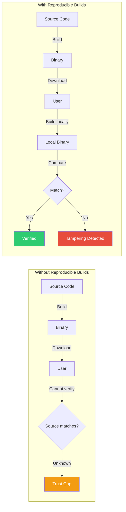
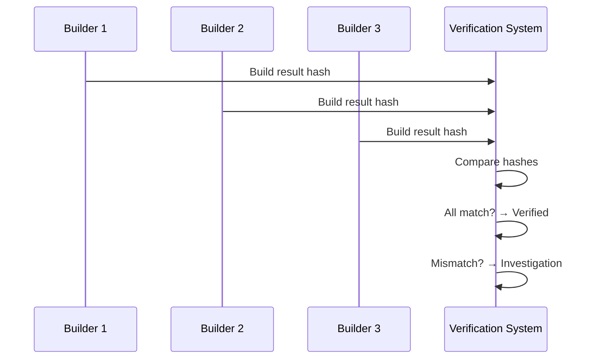

# Source Code and Build Transparency: Verifiable Builds in the 01s Sovereign OS

## Abstract

Source code transparency alone is insufficient — users must also be able to verify that distributed binaries correspond to published source code. This paper documents reproducible builds, build attestation, supply chain verification, and the complete source-to-binary verification pipeline in the 01s Sovereign OS.

## 1. Introduction

The No Black Boxes philosophy requires more than publishing source code. Users must verify that the binary they download is produced from the published source code. Without reproducible builds, users cannot know if distributed binaries contain hidden functionality.

### The Trust Gap



## 2. Source Code Publishing

### Repository Structure

```
01s/
├── kernel/          # Linux kernel configuration and patches
├── drivers/         # Additional driver support
├── toolchain/       # Custom compiler, lexer, parser, code generator
├── ai/              # AI agent framework and models
├── ledger/          # Audit ledger implementation
├── build/           # Build scripts and configuration
├── docs/            # Documentation
├── packages/        # Package definitions
├── installer/       # Installation system
└── tests/           # Test suites
```

### Release Tagging

All releases are tagged with signed GPG tags:

```bash
# List release tags
git tag -l 'v*'

# Verify release tag signature
git tag -v v2.4.1
# Output:
# object a1b2c3d4...
# type commit
# tag v2.4.1
# tagger ... <key>  ... 
# gpg: Signature made ...
# gpg: Good signature from "01s Sovereign Release Key"
```

## 3. Reproducible Builds

### Definition

A build is reproducible when the same source, tools, and environment produce bit-for-bit identical output:

```
Source (commit SHA) + Build Environment + Build Script
                        ↓
            Bit-identical Binary Output
```

### Deterministic Build Requirements

| Factor | Requirement | 01s Implementation |
|--------|-------------|-------------------|
| Timestamps | Fixed or SOURCE_DATE_EPOCH | All timestamps from git |
| Paths | Fixed build paths | `-ffile-prefix-map` |
| CPU count | Fixed | BUILD_JOBS=4 |
| Random seeds | Fixed | Deterministic random |
| Network access | None | Offline build |
| Locale | Fixed | `LC_ALL=C` |
| Timezone | Fixed | `TZ=UTC` |
| User/group | Fixed | `BUILD_USER=build` |
| Filesystem order | Sorted | `find ... | sort` |
| Symbol ordering | Stable | nm --defined-only --print-file-name |

### Build Configuration

```bash
# /etc/makepkg.conf - Deterministic build settings
export SOURCE_DATE_EPOCH=$(git log -1 --format=%at)
export BUILD_JOBS=4
export LC_ALL=C
export TZ=UTC
export LANG=C

# Compiler flags for determinism
CFLAGS="-O2 -fdebug-prefix-map=$PWD= -fmacro-prefix-map=$PWD= -fstack-protector-strong -fno-semantic-interposition"
LDFLAGS="-Wl,-O1,--sort-common,--as-needed,-z,relro,-z,now,--build-id=sha1"
```

### Verifying Reproducibility

```bash
# Step 1: Clone source
git clone --branch v2.4.1 https://github.com/sovereign-os/01s

# Step 2: Set up build environment
cd 01s
export SOURCE_DATE_EPOCH=$(git log -1 --format=%at)

# Step 3: Build from source
./build.sh

# Step 4: Get checksum
sha3sum 01s.iso > my_checksum.txt

# Step 5: Compare with published checksum
curl -O https://releases.01s.sovereign/v2.4.1/sha3sum.txt
diff my_checksum.txt sha3sum.txt
# If identical: YOUR BINARY IS VERIFIED
# If different: TAMPERING DETECTED or build environment mismatch
```

### Multiple Independent Builds



## 4. Build Verification

### User Verification Process

```bash
# Complete verification script
#!/bin/bash
set -e

echo "Step 1: Clone source"
git clone --branch v2.4.1 https://github.com/sovereign-os/01s
cd 01s

echo "Step 2: Set deterministic environment"
export SOURCE_DATE_EPOCH=$(git log -1 --format=%at)
export LC_ALL=C
export TZ=UTC
export BUILD_JOBS=4

echo "Step 3: Build"
./build.sh

echo "Step 4: Compute checksum"
sha3sum 01s.iso > my_checksum.txt

echo "Step 5: Download published checksum"
curl -O https://releases.01s.sovereign/v2.4.1/sha3sum.txt
curl -O https://releases.01s.sovereign/v2.4.1/sha3sum.txt.asc

echo "Step 6: Verify GPG signature"
gpg --verify sha3sum.txt.asc sha3sum.txt

echo "Step 7: Compare checksums"
if diff my_checksum.txt sha3sum.txt; then
    echo "✅ BUILD VERIFIED - Binary matches published source"
else
    echo "❌ BUILD MISMATCH - Binary may be tampered"
    exit 1
fi
```

## 5. Build Attestation

### Attestation Format

```json
{
  "attestation": {
    "version": "1.0",
    "release": "v2.4.1",
    "source_commit": "a1b2c3d4e5f6...",
    "build_date": "2026-06-19T10:00:00Z",
    "builder_id": "builder-01.reproducible.01s.sovereign",
    "builder_public_key": "ed25519:abc...",
    "output_hash": "sha3-256:9f8e7d6c...",
    "output_filename": "01s-v2.4.1.iso",
    "build_environment": {
      "os": "Debian 12",
      "kernel": "6.6.32",
      "compiler": "gcc 12.2.0",
      "build_script": "build.sh@a1b2c3d4"
    },
    "verification_results": {
      "deterministic_build": true,
      "dependency_check": "pass",
      "vulnerability_scan": "pass",
      "license_check": "pass"
    },
    "signature": "ed25519:def..."
  }
}
```

### Multiple Attestation Consensus

```bash
# Collect attestations from multiple builders
attestations=$(curl -s https://builds.01s.sovereign/v2.4.1/attestations.json)

# Verify all builders agree
echo "$attestations" | jq '[.[].output_hash] | unique | length'
# Should output: 1 (all builders agree)
```

## 6. Supply Chain Verification

### Dependency Verification

| Check | Method | Tool |
|-------|--------|------|
| Source integrity | GPG signature verification | `gpg --verify` |
| License compliance | License scanning | `licensee`, `scancode` |
| Vulnerability scanning | CVE database matching | `cve-bin-tool` |
| Provenance tracking | Dependency chain documentation | SBOM generation |

### Software Bill of Materials (SBOM)

```json
{
  "bomFormat": "CycloneDX",
  "specVersion": "1.5",
  "components": [
    {
      "name": "linux",
      "version": "6.6.32",
      "purl": "pkg:generic/linux@6.6.32",
      "license": "GPL-2.0-only",
      "supplier": "kernel.org"
    },
    {
      "name": "glibc",
      "version": "2.38",
      "purl": "pkg:generic/glibc@2.38",
      "license": "LGPL-2.1-only",
      "supplier": "gnu.org"
    }
  ]
}
```

### Vendored Dependencies

For dependencies that are vendored (included in the source tree):

```bash
# Verify upstream signature
gpg --verify upstream.tar.gz.asc upstream.tar.gz

# Verify checksum
sha3sum upstream.tar.gz > expected.txt
diff expected.txt published.txt
```

## 7. Build Logs in .aioss

Build logs are recorded in the audit ledger:

```json
{
  "type": "build",
  "timestamp": "2026-06-19T10:00:00Z",
  "content": {
    "release": "v2.4.1",
    "source_commit": "a1b2c3d4",
    "builder": "builder-01",
    "build_duration_s": 3420,
    "output_hash": "sha3-256:9f8e...",
    "verification": {
      "reproducible": true,
      "dependency_check": "pass",
      "vulnerability_scan": "pass"
    }
  }
}
```

## 8. Verification Tools

### Download Verification

```bash
# Verify download integrity
sha3sum --check sha3sum.txt

# Verify GPG signature
gpg --verify sha3sum.txt.asc sha3sum.txt

# Verify multiple builder consensus
curl https://builds.01s.sovereign/v2.4.1/attestations.json | \
  jq '[.[].output_hash] | unique | length'
```

### Automated Verification Dashboard

```bash
# Check build reproducibility status
01s-ledger build-status

# Output:
# Release: v2.4.1
# Build Date: 2026-06-19
# Output Hash: sha3-256:9f8e7d6c...
# Reproducible: ✅ YES (3 of 3 builders match)
# Verification: ✅ PASS
```

## 9. Build Environment Reproducibility

### Containerized Build Environment

```dockerfile
# Dockerfile for reproducible 01s Sovereign builds
FROM debian:12-slim

# Fixed build environment
ENV SOURCE_DATE_EPOCH=1718764800
ENV LC_ALL=C
ENV TZ=UTC
ENV LANG=C
ENV BUILD_JOBS=4

# Install fixed versions of build tools
RUN apt-get update && apt-get install -y \
    gcc-12=12.2.0-14 \
    make=4.3-4.1 \
    git=1:2.39.2-1.1 \
    curl=7.88.1-10+deb12u5 \
    python3=3.11.2-1+b1

# Verify tool versions
RUN gcc --version | grep "12.2.0" && \
    make --version | grep "4.3" && \
    git --version | grep "2.39"

# Copy source at specific commit
COPY . /src
WORKDIR /src

# Build
RUN ./build.sh

CMD ["sha3sum", "/src/01s.iso"]
```

### Builder Verification Script

```bash
#!/bin/bash
# verify-build.sh - Verify a 01s Sovereign build

set -euo pipefail

BUILD_ENV="debian:12-slim"
SOURCE_COMMIT="$1"
EXPECTED_HASH="$2"

echo "=== Build Verification ==="
echo "Source commit: $SOURCE_COMMIT"
echo "Build environment: $BUILD_ENV"
echo "Expected hash: $EXPECTED_HASH"

# Pull the build environment
docker pull $BUILD_ENV

# Build with fixed environment
docker run --rm \
    -e SOURCE_DATE_EPOCH \
    -e LC_ALL=C \
    -e TZ=UTC \
    -e BUILD_JOBS=4 \
    -v $(pwd):/src \
    $BUILD_ENV \
    /bin/bash -c "cd /src && git checkout $SOURCE_COMMIT && ./build.sh"

# Compare checksums
ACTUAL_HASH=$(sha3sum 01s.iso | cut -d' ' -f1)

if [ "$ACTUAL_HASH" = "$EXPECTED_HASH" ]; then
    echo "✅ BUILD VERIFIED - Bit-identical output"
    exit 0
else
    echo "❌ BUILD MISMATCH"
    echo "Expected: $EXPECTED_HASH"
    echo "Actual:   $ACTUAL_HASH"
    exit 1
fi
```

## 10. Build Infrastructure Transparency

### Build Server Specifications

| Component | Specification | Purpose |
|-----------|---------------|---------|
| CPU | AMD EPYC 7642 (48 cores) | Parallel builds |
| RAM | 256 GB ECC | Large compilation jobs |
| Storage | 2 TB NVMe RAID 1 | Fast I/O |
| Network | 10 Gbps | Fast downloads/uploads |
| OS | Debian 12 (minimal) | Build environment |
| Power | 2N redundant PSU | Reliability |

### Build Infrastructure Access

All build infrastructure details are public:
- Server specifications and configuration
- Build scripts and Dockerfiles
- CI/CD pipeline configuration
- Monitoring and logging

## 11. Supply Chain Verification

### Third-Party Dependency Verification

```bash
# Verify all third-party dependencies
#!/bin/bash
for pkg in $(pacman -Qq); do
    echo "Verifying: $pkg"
    
    # Check GPG signature
    pacman -Qi $pkg | grep "Signatures"
    
    # Check source integrity
    pacman -Qi $pkg | grep "Validated By"
    
    # Log verification
    01s-ledger log package-verify \
        --package $pkg \
        --status verified \
        --timestamp "$(date -u +%Y-%m-%dT%H:%M:%SZ)"
done
```

### Software Bill of Materials (SBOM) Generation

```bash
# Generate CycloneDX SBOM
cyclonedx-bom -o sbom.xml

# Verify SBOM against known vulnerabilities
bom verify --file sbom.xml

# Record SBOM hash in ledger
sha3sum sbom.xml | cut -d' ' -f1 > sbom.hash
01s-ledger log sbom-generated \
    --hash "$(cat sbom.hash)" \
    --timestamp "$(date -u +%Y-%m-%dT%H:%M:%SZ)"
```

## 11a. Implementation Guide for Build Transparency

### 11a.1 Setting Up Reproducible Builds

| Step | Description | Tools | Verification |
|------|-------------|-------|--------------|
| 1 | Set up deterministic build environment | Docker, Vagrant | Environment hash |
| 2 | Configure build parameters | SOURCE_DATE_EPOCH, LC_ALL, TZ | Parameter verification |
| 3 | Implement fixed build paths | -ffile-prefix-map, -fdebug-prefix-map | Path audit |
| 4 | Set fixed random seeds | Deterministic RNG | Seed verification |
| 5 | Remove network dependencies | Offline build capability | Network check |
| 6 | Establish multiple builders | Independent build servers | Consensus attestation |
| 7 | Publish attestations | Signed build output hashes | GPG verification |

### 11a.2 Automated Build Verification Pipeline

```yaml
# .github/workflows/reproducible-build.yml
name: Reproducible Build Verification

on:
  release:
    types: [published]

jobs:
  build:
    strategy:
      matrix:
        builder: [builder-01, builder-02, builder-03]
    
    runs-on: ubuntu-latest
    container:
      image: debian:12-slim
    
    steps:
      - uses: actions/checkout@v4
        with:
          ref: ${{ github.event.release.tag_name }}
      
      - name: Set deterministic build environment
        run: |
          echo "SOURCE_DATE_EPOCH=$(git log -1 --format=%at)" >> $GITHUB_ENV
          echo "LC_ALL=C" >> $GITHUB_ENV
          echo "TZ=UTC" >> $GITHUB_ENV
          echo "BUILD_JOBS=4" >> $GITHUB_ENV
      
      - name: Build
        run: ./build.sh
      
      - name: Compute checksum
        run: sha3sum 01s.iso > checksum.txt
      
      - name: Upload attestation
        uses: actions/upload-artifact@v4
        with:
          name: attestation-${{ matrix.builder }}
          path: checksum.txt
  
  verify:
    needs: build
    runs-on: ubuntu-latest
    steps:
      - name: Download all attestations
        uses: actions/download-artifact@v4
      
      - name: Verify consensus
        run: |
          cat attestation-*/checksum.txt | sort | uniq -c
          if [ $(cat attestation-*/checksum.txt | sort -u | wc -l) -eq 1 ]; then
            echo "✅ BUILD VERIFIED - All builders agree"
          else
            echo "❌ BUILD MISMATCH - Builders disagree"
            exit 1
          fi
```

### 11a.3 User Verification Guide

```bash
#!/bin/bash
# /usr/local/bin/verify-01s-build.sh
# Complete verification script for end users

set -e

echo "=== 01s Sovereign Build Verification ==="

# Get release to verify
RELEASE=${1:-latest}
echo "Verifying release: $RELEASE"

# Clone source at release tag
if [ ! -d "01s-source" ]; then
    echo "Cloning source..."
    git clone --branch "$RELEASE" https://github.com/sovereign-os/01s 01s-source
fi
cd 01s-source

# Set up deterministic build environment
export SOURCE_DATE_EPOCH=$(git log -1 --format=%at)
export LC_ALL=C
export TZ=UTC
export BUILD_JOBS=4

# Build from source
echo "Building from source..."
./build.sh

# Compute checksum of built binary
echo "Computing checksum..."
sha3sum 01s.iso | tee my-checksum.txt

# Download published checksum
echo "Downloading published checksum..."
curl -sOL "https://releases.01s.sovereign/$RELEASE/sha3sum.txt"
curl -sOL "https://releases.01s.sovereign/$RELEASE/sha3sum.txt.asc"

# Verify GPG signature
echo "Verifying GPG signature..."
gpg --verify sha3sum.txt.asc sha3sum.txt 2>/dev/null
if [ $? -eq 0 ]; then
    echo "✅ GPG signature valid"
else
    echo "❌ GPG signature invalid"
    exit 1
fi

# Compare checksums
echo "Comparing checksums..."
if diff my-checksum.txt sha3sum.txt; then
    echo ""
    echo "========================================"
    echo "✅ BUILD VERIFIED SUCCESSFULLY"
    echo "Your binary matches the published source"
    echo "========================================"
else
    echo ""
    echo "========================================"
    echo "❌ BUILD VERIFICATION FAILED"
    echo "Binary does NOT match published source"
    echo "Possible tampering or build mismatch"
    echo "========================================"
    exit 1
fi
```

### 11a.4 Build Transparency Dashboard

```bash
# Build transparency status command
01s-ledger build-status

# Example output:
# ┌────────────────────────────────────────────────────┐
# │ 01s Sovereign Build Transparency Dashboard        │
# ├────────────────────────────────────────────────────┤
# │ Release: v2.4.1                                    │
# │ Source Commit: a1b2c3d4e5f6...                     │
# │ Build Date: 2026-06-19                             │
# │                                                    │
# │ Builder Results:                                   │
# │   builder-01: sha3-256:9f8e7d6c... ✅              │
# │   builder-02: sha3-256:9f8e7d6c... ✅              │
# │   builder-03: sha3-256:9f8e7d6c... ✅              │
# │                                                    │
# │ Status: ✅ REPRODUCIBLE (3/3 builders match)       │
# │ Attestation: ✅ GPG signed                         │
# │ SBOM: ✅ Generated (CycloneDX 1.5)                 │
# │                                                    │
# │ Last verified: 2026-06-19T10:30:00Z                │
# └────────────────────────────────────────────────────┘
```

## 12. Conclusion

Source code and build transparency ensure the No Black Boxes philosophy extends from source code to binary distribution. Through reproducible builds, multi-builder attestation, supply chain verification, and user-verifiable build processes, 01s Sovereign enables anyone to verify that distributed binaries correspond to published source code. This closes the trust gap that exists in most open source projects, where users must trust that distributed binaries match the published source. The combination of fixed-environment builds, multiple independent builders, GPG-signed releases, SBOM generation, and public verification tools provides a complete transparency framework that sets a new standard for open source distribution integrity.

---

Lois-Kleinner and 0-1.gg 2026 Copyright
