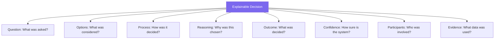

# Decision Logging and Explainability: Transparent AI Decision-Making

## Abstract

Decision logging and explainability are essential for trustworthy AI systems. The 01s Sovereign OS records every decision with reasoning, alternatives, confidence, and outcomes. This paper documents the decision logging framework, explainability methods, human oversight mechanisms, and compliance with emerging AI regulations.

## 1. Introduction

When AI systems make decisions affecting users, users have a right to understand why. This is enshrined in GDPR (Article 22 - automated individual decision-making) and the EU AI Act (Article 13 - transparency), and it is a core requirement of the No Black Boxes philosophy.

### Why Explainability Matters

| Stakeholder | Need | How 01s Addresses |
|-------------|------|-------------------|
| Users | Understand decisions affecting them | Explain command |
| Developers | Debug and improve AI | Detailed decision records |
| Auditors | Verify compliance | Complete audit trail |
| Regulators | Ensure fairness | Bias monitoring |
| Organizations | Manage risk | Risk assessment data |

## 2. What Makes a Decision Explainable

An explainable decision includes:



## 3. Decision Entry Format

### Complete Decision Record

```json
{
  "type": "decision",
  "timestamp": "2026-06-19T14:30:00Z",
  "proposal": "Approve loan application ID-2026-0451",
  "options": [
    {
      "text": "Approve",
      "voting_weight": 3,
      "voters": ["credit_agent_v2", "risk_agent_v3"],
      "reasoning": "Applicant meets primary criteria",
      "confidence": 0.85
    },
    {
      "text": "Reject", 
      "voting_weight": 1,
      "voters": ["fraud_agent_v1"],
      "reasoning": "Insufficient credit history length",
      "confidence": 0.60
    },
    {
      "text": "Escalate to Human",
      "voting_weight": 2,
      "voters": ["compliance_agent_v1"],
      "reasoning": "Above automatic approval threshold",
      "confidence": 0.75
    }
  ],
  "process_type": "multi_agent_voting",
  "winner": "Escalate to Human",
  "confidence": 0.75,
  "reasoning_summary": "Mixed signals - primary criteria met but credit history concerns require human judgment",
  "participants": [
    {"agent": "credit_agent_v2", "role": "underwriting"},
    {"agent": "risk_agent_v3", "role": "risk_assessment"},
    {"agent": "fraud_agent_v1", "role": "fraud_detection"},
    {"agent": "compliance_agent_v1", "role": "compliance"}
  ],
  "evidence_references": [
    "application_form_0451.pdf",
    "credit_report_0451.pdf",
    "income_verification_0451.pdf"
  ],
  "human_oversight": {
    "status": "pending",
    "assigned_to": "reviewer_42",
    "escalated_at": "2026-06-19T14:30:00Z",
    "deadline": "2026-06-20T14:30:00Z"
  },
  "model_version": "underwriting-v2.4.1",
  "fairness_metrics": {
    "demographic_parity": 0.95,
    "equal_opportunity": 0.93,
    "tested_groups": ["age", "income_bracket", "region"]
  },
  "hash": "sha3-256:a1b2c3d4...",
  "parent_hash": "sha3-256:9f8e7d6c..."
}
```

## 4. Decision Types

### Single-Agent Decision

One AI agent makes a decision with confidence and reasoning:

```json
{
  "process_type": "single_agent",
  "winner": "Classify document as financial_report",
  "confidence": 0.94,
  "reasoning_summary": "Document contains financial statements, balance sheet, and income statement. Keywords match 'financial_report' classification pattern with 94% confidence."
}
```

### Multi-Agent Voting

Multiple agents vote, weighted by authority:

```json
{
  "process_type": "multi_agent_voting",
  "voting_method": "weighted_majority",
  "options": [
    {"text": "Approve", "votes": 3, "weight": 0.6},
    {"text": "Reject", "votes": 2, "weight": 0.4}
  ],
  "winner": "Approve"
}
```

### Multi-Agent Consensus

All agents must agree:

```json
{
  "process_type": "multi_agent_consensus",
  "consensus_required": true,
  "consensus_achieved": true,
  "options": [
    {"text": "Approve", "voters": ["agent_1", "agent_2", "agent_3"]}
  ],
  "winner": "Approve"
}
```

### Human-in-the-Loop

AI recommends, human decides:

```json
{
  "process_type": "human_in_the_loop",
  "winner": "pending_human_review",
  "human_oversight": {
    "status": "pending",
    "assigned_to": "reviewer_42",
    "escalated_reason": "Above automatic approval threshold",
    "response_deadline": "2026-06-20T14:30:00Z"
  }
}
```

### Hierarchical Decision

Multi-level approval chain:

```json
{
  "process_type": "hierarchical",
  "levels": [
    {
      "level": 1,
      "agent": "triage_agent",
      "decision": "Needs review",
      "confidence": 0.80
    },
    {
      "level": 2,
      "agent": "specialist_agent",
      "decision": "Approve with conditions",
      "confidence": 0.90
    }
  ],
  "winner": "Approve with conditions"
}
```

## 5. Explainability Methods

### Intrinsic Explainability

Models inherently interpretable:

| Method | Description | Used For |
|--------|-------------|----------|
| Rule-based | If-then rules | Simple classification |
| Decision trees | Tree structure | Transparent logic |
| Linear models | Weighted features | Importance ranking |

### Post-hoc Explainability

Explanations generated after the fact:

**LIME (Local Interpretable Model-agnostic Explanations)**:
```python
# LIME generates local explanations by perturbing inputs
from lime.lime_tabular import LimeTabularExplainer

explainer = LimeTabularExplainer(training_data)
exp = explainer.explain_instance(instance, predict_fn)
exp.show_in_notebook()
# Output: Top 3 features contributing to decision:
# 1. credit_score (0.42)
# 2. income_debt_ratio (0.35)
# 3. employment_duration (0.18)
```

**SHAP (SHapley Additive exPlanations)**:
```python
# SHAP uses game theory to assign feature importance
import shap

explainer = shap.TreeExplainer(model)
shap_values = explainer.shap_values(instance)
shap.force_plot(explainer.expected_value, shap_values, instance)
# Visual output shows feature contributions
```

**Counterfactual Explanations**:
```json
{
  "explanation_type": "counterfactual",
  "actual_decision": "Rejected",
  "counterfactual": "If credit score had been 680 instead of 620, application would have been approved",
  "minimal_change": {"feature": "credit_score", "current": 620, "required": 680}
}
```

## 6. Querying Decisions

### CLI Commands

```bash
# Query decisions by proposal
aioss query --type decision --content-proposal "contract ID-2026-0451"

# Query decisions by agent
aioss query --type decision --agents Legal

# Query low-confidence decisions
aioss query --type decision --max-confidence 0.7

# Query human oversight escalations
aioss query --type decision --human-oversight pending

# Query fairness metrics
aioss query --type decision --content-fairness_metrics
```

### Explanation Command

```bash
# Explain a specific decision
aioss explain --decision-hash a1b2c3d4...

# Output:
# Decision: Approve loan application ID-2026-0451
# Process: Multi-agent voting (4 agents)
# Result: Escalate to Human (confidence: 0.75)
#
# Reasoning:
# - Primary credit criteria met (income, debt ratio)
# - Credit history length below automatic threshold
# - Fraud risk score elevated
# - Compliace requires human review for amounts > $50,000
#
# Key Factors:
# 1. Income verification: PASS (ratio 0.32 < 0.40 threshold)
# 2. Credit score: 720 (above 650 minimum)
# 3. Credit history: 18 months (below 24-month auto-approval)
# 4. Fraud score: 0.65 (elevated, threshold 0.50)
```

## 7. Human Review

### Review Interface

When a decision is escalated for human review:

```bash
# View pending reviews
aioss review list

# Sample output:
# Pending Reviews (3):
# - Decision a1b2... (loan ID-2026-0451) - 2h ago
# - Decision c3d4... (contract ID-2026-0452) - 1h ago
# - Decision e5f6... (claim ID-2026-0453) - 30m ago

# Review a specific decision
aioss review show --decision-hash a1b2c3d4...

# Approve
aioss review approve --decision-hash a1b2c3d4... --reason "Verified income documents"

# Override
aioss review override --decision-hash a1b2c3d4... --new-decision "Reject" --reason "Credit history concerns"

# Request more information
aioss review request-info --decision-hash a1b2c3d4... --question "Please provide additional income verification"
```

### Appeal Process

Users affected by AI decisions can:

```bash
# Request explanation
aioss explain --decision-hash a1b2c3d4...

# Appeal decision
aioss appeal --decision-hash a1b2c3d4... --reason "Credit report contains error"

# Appeal is recorded in ledger:
{
  "type": "appeal",
  "timestamp": "2026-06-19T15:00:00Z",
  "original_decision": "a1b2c3d4",
  "appeal_reason": "Credit report contains error - corrected report attached",
  "assigned_to": "appeals_officer_01",
  "status": "under_review"
}
```

## 8. Contradiction Detection

The system automatically detects AI output contradictions:

```json
{
  "type": "contradiction",
  "timestamp": "2026-06-19T14:30:00Z",
  "contradiction_type": "factual_inconsistency",
  "statements": [
    {
      "source": "agent_v1",
      "claim": "The policy covers this case",
      "confidence": 0.90
    },
    {
      "source": "agent_v2",
      "claim": "This case is excluded from coverage",
      "confidence": 0.85
    }
  ],
  "resolution": {
    "method": "source_authority_check",
    "winning_claim": "This case is excluded from coverage",
    "confidence_after": 0.92,
    "reasoning": "Agent v2 references clause 3.4.b which explicitly excludes this scenario"
  },
  "severity": "medium"
}
```

## 9. Compliance Mapping

| Regulation | Requirement | 01s Implementation |
|------------|-------------|-------------------|
| GDPR Art 22 | Automated decision transparency | Complete decision logging |
| EU AI Act Art 12 | Record-keeping | `.aioss` ledger |
| EU AI Act Art 13 | Transparency | Explain command |
| EU AI Act Art 14 | Human oversight | Human-in-the-loop process |
| CCPA | Automated decision opt-out | User controls |
| Algorithmic Accountability Act | Impact assessment | Fairness metrics |

## 10. Decision Logging Performance

### Performance Benchmarks

| Operation | Single Decision | 1,000 Decisions | 100,000 Decisions |
|-----------|----------------|-----------------|-------------------|
| Log decision | 2ms | 1.8s | 180s |
| Query by ID | 0.5ms | 0.5ms | 2ms |
| Query by agent | 2ms | 50ms | 5s |
| Explain decision | 5ms | 5ms | 5ms |
| Generate report | 50ms | 100ms | 8s |
| Export decisions | 10ms | 200ms | 20s |

### Storage Requirements

| Decisions/Day | Retention | Storage (JSON) | Storage (Binary) |
|---------------|-----------|----------------|------------------|
| 100 | 30 days | 15 MB | 5 MB |
| 100 | 365 days | 180 MB | 60 MB |
| 1,000 | 30 days | 150 MB | 50 MB |
| 1,000 | 365 days | 1.8 GB | 600 MB |
| 10,000 | 30 days | 1.5 GB | 500 MB |

## 11. Decision Logging Integration Patterns

### Pattern 1: Simple Decision

```python
# Application logs a decision
from aioss import DecisionLogger

logger = DecisionLogger()

decision = logger.log_decision(
    proposal="Approve refund request #12345",
    options=[
        {"text": "Approve", "confidence": 0.85},
        {"text": "Reject", "confidence": 0.15}
    ],
    winner="Approve",
    reasoning="Customer meets all refund criteria",
    confidence=0.85
)

print(f"Decision logged: {decision.hash}")
```

### Pattern 2: Multi-Agent Decision

```python
# Multi-agent voting
from aioss import MultiAgentDecision

agents = {
    "credit_agent": {"weight": 0.4},
    "risk_agent": {"weight": 0.35},
    "fraud_agent": {"weight": 0.25}
}

decision = MultiAgentDecision(
    proposal="Approve loan application #67890",
    agents=agents,
    process_type="weighted_voting"
)

# Each agent votes
decision.cast_vote("credit_agent", "Approve", 0.90)
decision.cast_vote("risk_agent", "Approve", 0.80)
decision.cast_vote("fraud_agent", "Escalate", 0.65)

# Finalize and log
result = decision.finalize()
print(f"Winner: {result.winner}")
print(f"Confidence: {result.confidence}")
```

### Pattern 3: Human-in-the-Loop

```python
from aioss import HumanInTheLoopDecision

decision = HumanInTheLoopDecision(
    proposal="Escalate support ticket #45678",
    ai_recommendation="Escalate to Tier 2",
    confidence=0.75,
    reason="Issue requires specialized knowledge",
    deadline="2026-06-20T14:00:00Z"
)

# Assign to human reviewer
decision.assign_reviewer("tier2_support_agent")

# Human makes final decision
decision.human_decision(
    reviewer="tier2_support_agent",
    action="approved",
    notes="Verified issue - transfer to engineering"
)
```

## 12. Decision Quality Metrics

### Quality Monitoring

| Metric | Description | Target | Measurement |
|--------|-------------|--------|-------------|
| Decision accuracy | Correct decisions vs outcomes | > 95% | Periodic audit |
| Human override rate | Human overrides of AI | < 10% | Ledger query |
| Appeal rate | Decisions appealed | < 2% | Appeal records |
| Average confidence | Mean confidence score | > 0.80 | Ledger aggregation |
| Low confidence count | Decisions below 0.70 | < 5% | Ledger query |
| Decision latency | Time to decision | < 1s | Performance metrics |

### Bias Monitoring

```bash
# Check decision distribution by group
aioss query --type decision --aggregate by_demographic_group

# Verify fairness metrics
aioss query --type decision --field fairness_metrics

# Check for demographic parity
aioss query --type decision \
    --aggregate approve_rate \
    --group demographic_group
```

## 13. Conclusion

Decision logging and explainability are fundamental to the No Black Boxes philosophy, enabling transparency, accountability, and regulatory compliance. By recording every decision with reasoning, alternatives, confidence, and outcomes, 01s Sovereign ensures that AI decisions are never black boxes. Users, auditors, and regulators can always understand why a decision was made, challenge it if necessary, and verify that the system operates fairly.

---

Lois-Kleinner and 0-1.gg 2026 Copyright
