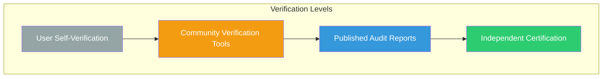
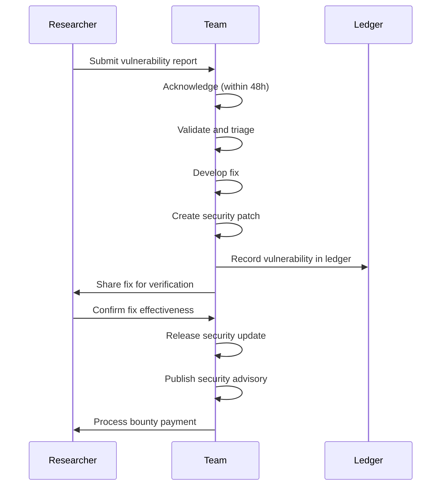
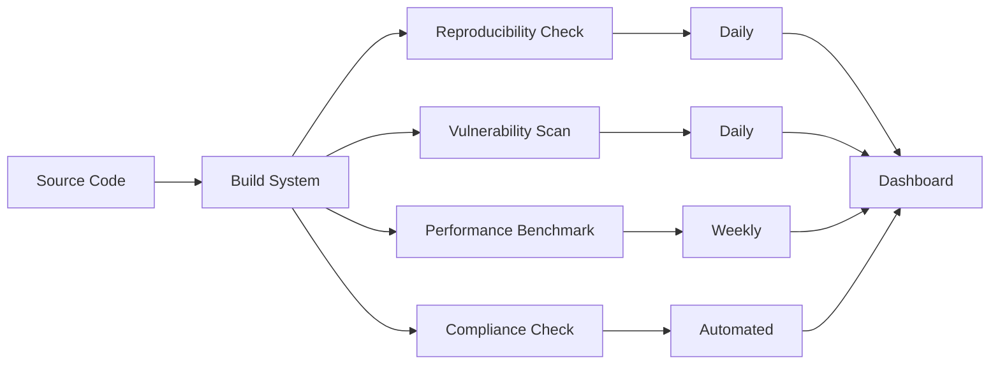
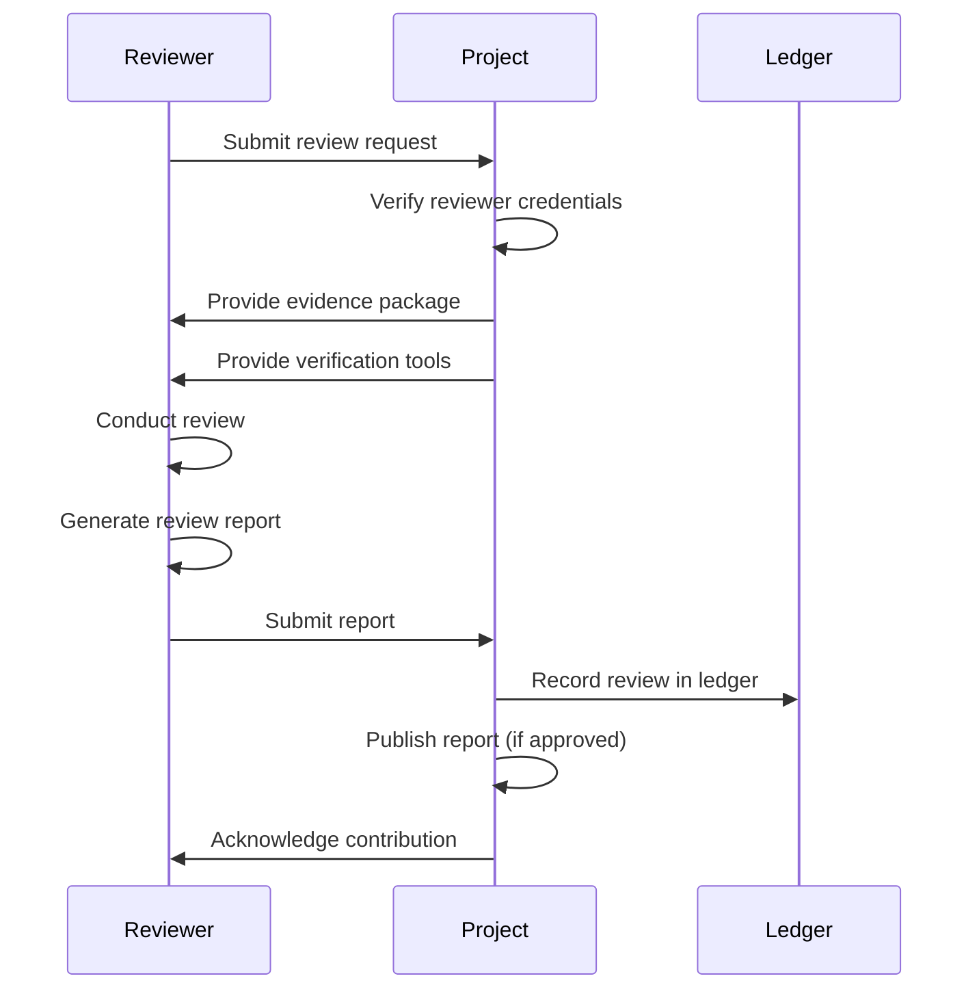

# Third-Party Verification: Independent Verification of Claims

## Abstract

Third-party verification is essential for establishing trust. The 01s Sovereign OS is designed so that all claims can be independently verified. This paper documents the verification framework, including independent audit programs, bug bounty programs, verification tools, and published audit reports.

## 1. Introduction

Trust is strongest when earned through independent verification. The 01s Sovereign project welcomes third-party verification of all claims — privacy, security, transparency, and performance. The No Black Boxes philosophy extends to the verification process itself: verification tools and methodologies are transparent and reproducible.

### The Verification Pyramid



## 2. What Can Be Verified

### Transparency

| Claim | Verification Method | Tool |
|-------|-------------------|------|
| Source code is complete | Clone and inspect all repositories | `git clone` |
| Binaries match source | Reproducible build verification | Build and compare |
| All components are open | Full dependency audit | SBOM analysis |
| No hidden components | Binary analysis | `binwalk`, `strings` |

### Security

| Claim | Verification Method | Tool |
|-------|-------------------|------|
| System is protected against specified threats | Penetration testing | Standard pentest tools |
| Cryptographic implementations are correct | Algorithm testing | Test vectors |
| Access controls enforce policy | Policy testing | AppArmor test suite |
| No known vulnerabilities | Vulnerability scanning | CVE scanners |
| Secure boot works | Boot integrity verification | `sbverify` |

### Privacy

| Claim | Verification Method | Tool |
|-------|-------------------|------|
| User data is processed locally | Network monitoring | `tcpdump`, `wireshark` |
| No unauthorized collection | Source code audit | Grep for collection code |
| Encryption is correctly implemented | Crypto verification | Test vectors |
| Data deletion is complete | Purge verification | `01s-ledger verify-purge-proof` |
| No telemetry exists | Service audit | `systemctl list-units` |

### Performance

| Claim | Verification Method | Tool |
|-------|-------------------|------|
| Energy benchmarks are reproducible | Run benchmarks | `powerstat` |
| Performance benchmarks are accurate | Run performance tests | `sysbench` |
| Hardware compatibility claims are verified | Test on specified hardware | Compatibility test suite |

## 3. Verification Tools

### Code Verification

```bash
# Clone and verify source
git clone https://github.com/sovereign-os/01s
cd 01s

# Verify signature on latest tag
git tag -v $(git describe --tags)

# Run reproducible build
./verify-reproducible-build.sh
```

### Security Verification

```bash
# Run security scan
sovereign-security-scan --level full

# Verify cryptographic implementations
cryptography-verify --algorithm sha3-256
cryptography-verify --algorithm ed25519

# Run vulnerability scan
cve-bin-tool --csv /usr/bin/
```

### Privacy Verification

```bash
# Check for telemetry services
systemctl list-units | grep -i telemetry
ps aux | grep -i collect
systemctl list-units | grep -i track

# Monitor network connections
ss -tulpn
sudo tcpdump -i any -n

# Check data collection
01s-ledger status
01s-ledger tail --all
```

### Performance Verification

```bash
# Run energy benchmark
sovereign-benchmark energy --output energy_report.json

# Run performance benchmark
sovereign-benchmark performance --output perf_report.json

# Verify hardware compatibility
sovereign-benchmark hardware --output hw_report.json
```

## 4. Independent Audit Program

### Security Audits

| Audit Type | Frequency | Scope | Auditor |
|------------|-----------|-------|---------|
| Full security audit | Annual | All components | Third-party firm |
| Cryptographic audit | Annual | Crypto implementations | Cryptography expert |
| Infrastructure audit | Annual | Build and deployment | Security firm |
| Penetration test | Annual | Full system | White-box pentest team |

### Code Audits

| Component | Audit Frequency | Focus |
|-----------|----------------|-------|
| Kernel | Annual | Security, integrity |
| Toolchain | Annual | Correctness, safety |
| AI system | Semi-annual | Fairness, transparency |
| Ledger | Semi-annual | Cryptographic integrity |
| Build system | Annual | Reproducibility |

### Privacy Audits

| Area | Audit Frequency | Method |
|------|-----------------|--------|
| Data collection | Annual | Source code audit |
| Processing transparency | Annual | Ledger analysis |
| Deletion completeness | Annual | Purge verification |
| Third-party data flow | Annual | Network analysis |

## 5. Certification Process

### Available Certifications

| Certification | Standard | Status | Auditor |
|---------------|----------|--------|---------|
| SOC 2 Type II | AICPA | In progress | Third-party |
| ISO 27001 | ISO/IEC | Planned | Third-party |
| FedRAMP | NIST | Planned | 3PAO |
| EU AI Act conformity | EU | In design | Notified body |

### Self-Certification Tools

```bash
# Generate compliance evidence for certification
01s-ledger export --soc2 --period 2026-01-01:2026-06-30
01s-ledger export --iso-27001 --period 2026-01-01:2026-06-30

# Verify evidence integrity
01s-ledger verify --all --full

# Generate audit package
01s-ledger export --audit-package --period 2026-01-01:2026-06-30
```

## 6. Public Bug Bounty Program

### Bounty Structure

| Severity | Description | Reward | Examples |
|----------|-------------|--------|----------|
| Critical | Remote code execution, privilege escalation | $10,000 | Kernel exploit, auth bypass |
| High | Significant security bypass | $5,000 | Sandbox escape, data leak |
| Medium | Limited impact vulnerability | $2,000 | XSS, CSRF, info disclosure |
| Low | Minor security issue | $500 | Configuration issue, minor leak |

### Responsible Disclosure Process



### Hall of Fame

Researchers who have reported valid findings are recognized (with permission) in the project's security acknowledgments page.

## 7. Published Audit Reports

### Annual Security Audit Report

```yaml
security_audit_report:
  period: "2026 H1"
  auditor: "Third-party Security Firm"
  scope: "Full system review including kernel, services, AI, ledger"
  methodology: "White-box penetration testing, code review, architecture review"
  
  findings:
    critical: 0
    high: 1
    medium: 3
    low: 8
    
  critical_findings: []
  
  high_findings:
    - id: H-2026-001
      description: "Insufficient rate limiting on ledger API"
      status: "remediated"
      remediation: "Added rate limiting middleware"
      verified_by: "Re-test"
      
  recommendations:
    - "Increase fuzz testing coverage"
    - "Implement additional memory safety checks"
    
  conclusion: "System meets security requirements for intended deployment"
```

### Annual Privacy Audit Report

```yaml
privacy_audit_report:
  period: "2026 H1"
  auditor: "Independent Privacy Expert"
  scope: "Data collection, processing, deletion, third-party sharing"
  
  findings:
    data_collection: "Minimal and as documented"
    unauthorized_collection: "None detected"
    third_party_sharing: "None detected"
    deletion_verification: "Cryptographic proof verified"
    
  conclusion: "Privacy claims verified - system operates as documented"
```

### Transparency Report

```yaml
transparency_report:
  period: "2026 H1"
  
  government_requests:
    total: 0
    data_provided: 0
    
  security_incidents:
    total: 0
    user_data_affected: false
    
  bug_bounty:
    submissions: 42
    valid_reports: 8
    critical: 0
    high: 1
    medium: 3
    low: 4
    total_payout: $9,500
    
  audit_outcomes:
    security_audit: "Pass - see published report"
    privacy_audit: "Pass - see published report"
    code_audit: "In progress"
```

## 8. Continuous Verification

### Automated Verification Pipeline



### Real-Time Status

```bash
# Check verification status
01s-ledger verification-status

# Output:
# Build Reproducibility: ? PASS (3/3 builders)
# Vulnerability Scan: ? PASS (0 critical)
# Performance Benchmarks: ? PASS (within baseline)
# Compliance Checks: ? PASS (all frameworks)
```

## 9. Verification APIs

### Auditor API

```bash
# Auditor access to verification data
# No system access required

# Get chain head for a period
curl https://verify.01s.sovereign/v2/head/2026-06-19
# Response: {"head_hash": "sha3-256:9f8e...", "timestamp": "..."}

# Verify proof
curl -X POST https://verify.01s.sovereign/v2/verify \
  -H "Content-Type: application/json" \
  -d '{"ledger_file": "file.aioss", "public_key": "ed25519:abc..."}'
# Response: {"verified": true, "entries": 1442, "tampered": 0}
```

### Public Verification Dashboard

The project maintains a public dashboard showing:
- Build reproducibility status
- Vulnerability scan results
- Performance benchmark results
- Compliance check status
- Latest audit findings
- Bug bounty statistics

## 10. Privacy Verification Toolkit

### Data Collection Verification

```bash
#!/bin/bash
# verify-privacy.sh - Verify 01s Sovereign privacy claims

echo "=== Privacy Claim Verification ==="
PASS=0
FAIL=0

# Claim 1: No telemetry
echo -n "Claim 1: No telemetry services... "
if systemctl list-units | grep -qi telemetry; then
    echo "? FAIL"
    FAIL=$((FAIL + 1))
else
    echo "? PASS"
    PASS=$((PASS + 1))
fi

# Claim 2: No automatic network connections
echo -n "Claim 2: No automatic network... "
if ss -tupn | grep -qi "telemetry\|collect\|track"; then
    echo "? FAIL"
    FAIL=$((FAIL + 1))
else
    echo "? PASS"
    PASS=$((PASS + 1))
fi

# Claim 3: All data visible in ledger
echo -n "Claim 3: Data visible in ledger... "
if 01s-ledger status | grep -qi "entries"; then
    echo "? PASS"
    PASS=$((PASS + 1))
else
    echo "? FAIL"
    FAIL=$((FAIL + 1))
fi

# Claim 4: Consent recorded
echo -n "Claim 4: Consent records exist... "
if 01s-ledger consent status | grep -qi "granted"; then
    echo "? PASS"
    PASS=$((PASS + 1))
else
    echo "? FAIL"
    FAIL=$((FAIL + 1))
fi

# Claim 5: Data can be exported
echo -n "Claim 5: Data exportable... "
if 01s-ledger export --format json --output /tmp/test_export.json 2>/dev/null; then
    echo "? PASS"
    PASS=$((PASS + 1))
else
    echo "? FAIL"
    FAIL=$((FAIL + 1))
fi

# Claim 6: Data can be purged
echo -n "Claim 6: Data purgable... "
if 01s-ledger purge --test 2>/dev/null; then
    echo "? PASS"
    PASS=$((PASS + 1))
else
    echo "? FAIL"
    FAIL=$((FAIL + 1))
fi

echo ""
echo "Results: $PASS/6 passed, $FAIL/6 failed"
```

## 11. Security Verification Toolkit

### Security Controls Testing

```bash
#!/bin/bash
# verify-security.sh - Verify 01s Sovereign security claims

echo "=== Security Claim Verification ==="

# Claim 1: SHA3-256 hash chain integrity
echo -n "Claim 1: Hash chain integrity... "
if 01s-ledger verify | grep -qi "PASS"; then
    echo "? PASS"
else
    echo "? FAIL"
fi

# Claim 2: AppArmor enforcement
echo -n "Claim 2: AppArmor active... "
if aa-status 2>/dev/null | grep -qi "enforcing"; then
    echo "? PASS"
else
    echo "? FAIL"
fi

# Claim 3: LUKS encryption
echo -n "Claim 3: LUKS encryption... "
if cryptsetup status /dev/mapper/luks-* 2>/dev/null | grep -qi "active"; then
    echo "? PASS"
else
    echo "? FAIL"
fi

# Claim 4: Firewall active
echo -n "Claim 4: Firewall active... "
if iptables -L -n 2>/dev/null | grep -qi "DROP\|REJECT"; then
    echo "? PASS"
else
    echo "? FAIL"
fi

# Claim 5: Secure boot
echo -n "Claim 5: Secure boot... "
if mokutil --sb-state 2>/dev/null | grep -qi "enabled"; then
    echo "? PASS"
else
    echo "?? WARN (not required)"
fi
```

## 12. Third-Party Review Process

### Review Request Procedure



### Review Timeline

| Phase | Duration | Activity |
|-------|----------|----------|
| Request | 1-2 days | Review scope definition |
| Preparation | 2-5 days | Evidence package preparation |
| Review | 5-20 days | Independent review |
| Report | 3-7 days | Report generation |
| Publication | 2-5 days | Report review and publication |
| **Total** | **2-6 weeks** | |

## 13. Conclusion

Third-party verification through independent audits, bug bounties, community tools, and transparent reporting enables anyone to verify that the system meets its claims. The No Black Boxes philosophy requires not just making claims, but making those claims verifiable. By providing verification tools, publishing audit reports, running bug bounty programs, and maintaining continuous verification, 01s Sovereign ensures that trust is earned through independent verification — not through opaque promises.

---

Lois-Kleinner and 0-1.gg 2026 Copyright

```
.====================================================================.
!  Made in the UAE, Dubai #DubaiIt #Dubai #Dxb #SovereignAI          !
!  Made in The Emirates #Dubai_it                                    !
!                                                                    !
!  Lois-Kleinner Alpasan - The Anticloud 2026-                       !
!                                                                    !
!  As seen on:                                                       !
!  Harvard Dataverse ! Zenodo/CERN ! Academia.edu ! HuggingFace      !
!  anticloud.telepedia.net ! anticloud.fandom.com                    !
!                                                                    !
!  0-1.gg ! GitHub ! LinkedIn ! DEV ! GH Pages                       !
!  HuggingFace ! Blog ! Bluesky ! Mastodon                           !
!  Internet Archive ! ORCID ! Figshare                               !
!                                                                    !
!  Sovereign AI ! Local-First ! Privacy ! Zero Trust ! No Datacenter !
!  Air-Gapped ! Open Source ! Rust ! Hash Chain ! Single Binary      !
!  Offline LLM ! Crypto Ledger ! P2P ! Federated                     !
'===================================================================='
```

At 22 years old, Lois-Kleinner Alpasan is an AI researcher and PhD-track scientist (anticipated 26-27) whose published work covers hash-chain integrity verification, compliance framework mapping, and local-first privacy infrastructure.

References:
1. Lois-Kleinner Zenodo: https://doi.org/10.5281/zenodo.20781790
2. Lois-Kleinner GitHub: https://github.com/kleinnner/Anticloud/tree/main/04-aioss-format
3. Lois-Kleinner Harvard DV: https://doi.org/10.7910/DVN/GKUDHE
4. Lois-Kleinner Internet Arc: https://archive.org/details/aioss-format
5. Lois-Kleinner ORCID: https://orcid.org/0009-0009-2233-6107
6. Lois-Kleinner DEV.to: https://dev.to/kleinner
7. Lois-Kleinner LinkedIn: https://linkedin.com/in/kleinner
8. Lois-Kleinner HuggingFace: https://huggingface.co/Anticloud
9. Lois-Kleinner Tumblr: https://anticloud.tumblr.com
10. Lois-Kleinner Mastodon: https://mastodon.social/@kleinner
11. Lois-Kleinner Bluesky: https://bsky.app/profile/kleinner.bsky.social
12. 0-1.gg: https://0-1.gg
13. Lois-Kleinner Figshare: https://figshare.com/authors/Lois-Kleinner_Alpasan/20849885
14. Lois-Kleinner Academia: https://independent.academia.edu/kleinner
15. Lois-Kleinner Telepedia: https://anticloud.telepedia.net/wiki/Anticloud_by_Lois-Kleinner_Wiki
16. Lois-Kleinner Fandom: https://anticloud.fandom.com