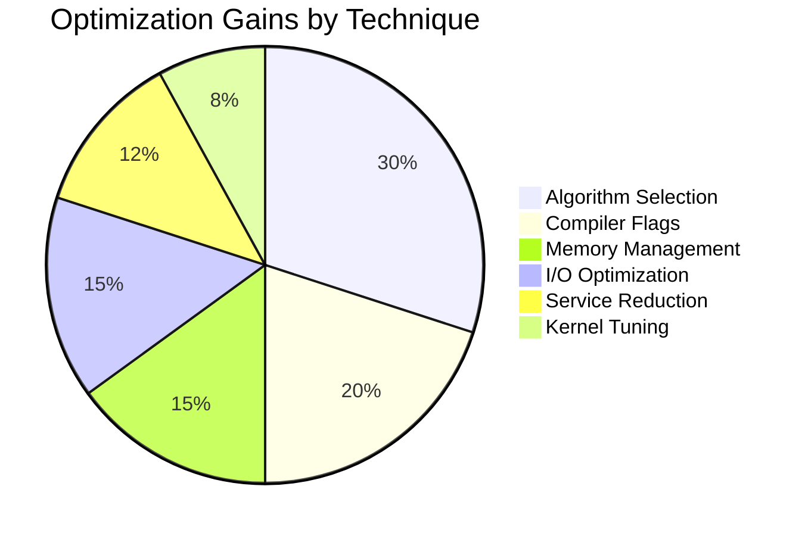
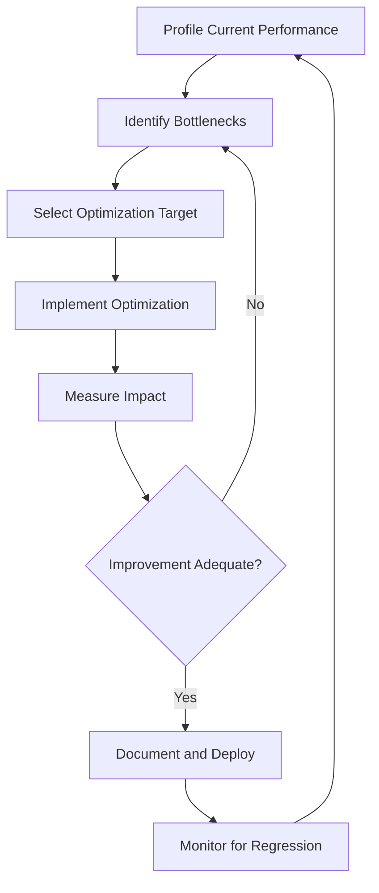
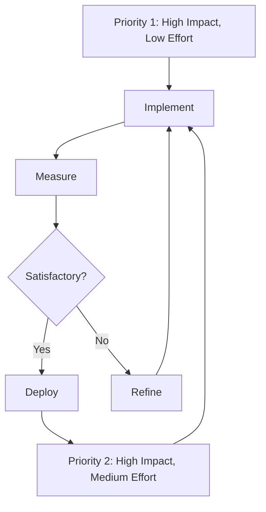
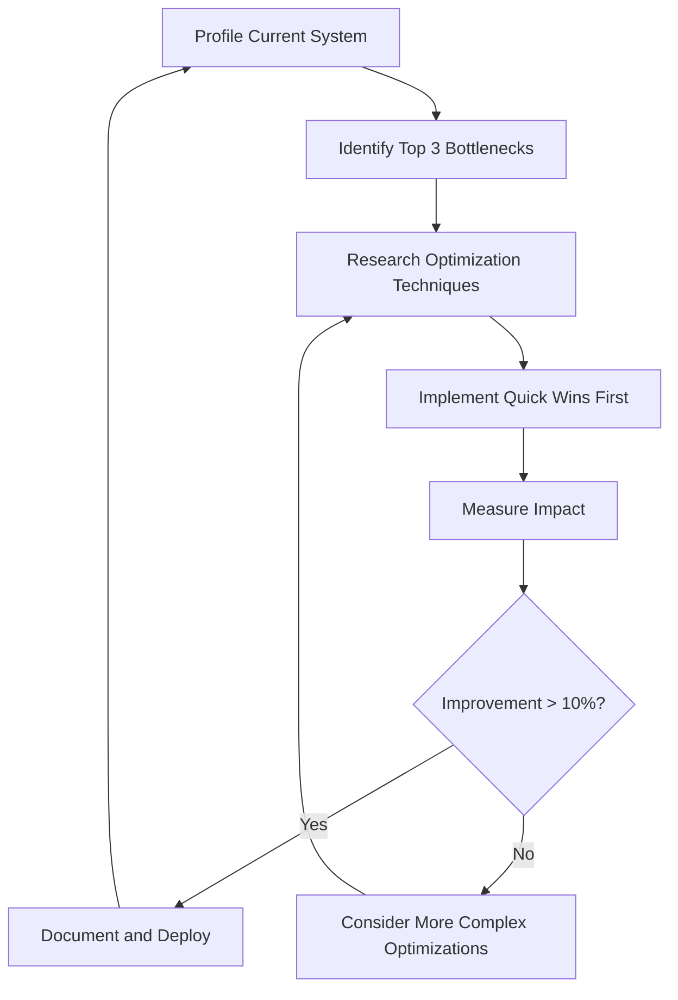

# Software Optimization Over New Silicon: Achieving Performance Through Code Excellence

## Abstract

The computing industry has long relied on hardware advances to deliver performance improvements. This paper argues that software optimization can deliver comparable or greater performance gains for the common workloads that constitute the majority of computing. We present specific optimization techniques, before/after benchmarks, and economic analysis demonstrating the viability of optimization over hardware procurement.

## 1. Introduction

The default approach to improving computing performance is to buy new hardware. This paper challenges that default, demonstrating that systematic software optimization can deliver performance improvements that the industry has historically attributed to hardware advances.

### The Optimization Opportunity

| Factor | Hardware Improvement (1 generation) | Software Optimization | 
|--------|-------------------------------------|----------------------|
| CPU performance | 10-20% | 20-50% (algorithm change) |
| I/O throughput | 20-40% (new storage) | 50-500% (I/O batching) |
| Memory efficiency | 10-20% (faster RAM) | 20-60% (data structure optimization) |
| Energy efficiency | 5-15% (new process node) | 20-50% (power-aware coding) |

## 2. The Software Optimization Landscape

### Algorithmic Improvements

Historical examples of algorithm improvements outperforming hardware:

| Domain | Old Algorithm | New Algorithm | Improvement | Equivalent HW Generations |
|--------|--------------|---------------|-------------|--------------------------|
| Sorting (1M items) | Bubble sort O(n�) | Quicksort O(n log n) | 25,000x | 15+ generations |
| Video compression | H.264 | H.265 | 50% bitrate reduction | 5+ generations |
| Database queries | Full scan | Indexed lookup | 100-1000x | 10+ generations |
| Image recognition | Hand-crafted features | Deep learning | 30% accuracy gain | Not achievable in HW alone |
| Text search | Sequential scan | Inverted index | 1000x | 15+ generations |
| Matrix multiply (small) | Naive O(n�) | Strassen O(n^2.81) | 15% | ~1 generation |
| Matrix multiply (large) | Strassen | CUDA GPU | 100x | 10+ generations |

### The Optimization Frontier

```mermaid
flowchart LR
    subgraph "Performance Improvement Sources"
        A[Algorithm Selection] --> D[Performance Gain]
        B[Compiler Optimization] --> D
        C[Architecture Design] --> D
    end
    
    subgraph "Hardware Improvement Sources"
        E[Faster CPU] --> F[Performance Gain]
        G[More RAM] --> F
        H[Faster Storage] --> F
    end
    
    D --> I{Total Improvement}
    F --> I
    
    note: "Software optimization often provides 2-5x more improvement than one HW generation"
```

## 3. Compiler Optimization

### 01s Sovereign Custom JIT

The 01s Sovereign system uses Just-In-Time compilation with profile-guided optimization:

| Technique | Performance Gain | Description |
|-----------|-----------------|-------------|
| Hot path detection | 15-25% | Identify frequently executed code paths |
| Inlining | 10-20% | Eliminate function call overhead |
| Constant folding | 5-10% | Pre-compute constant expressions |
| Dead code elimination | 2-5% | Remove unused code |
| Register allocation | 10-15% | Optimal register usage |
| Loop unrolling | 5-15% | Reduce loop overhead |
| Vectorization | 20-50% (on capable HW) | SIMD instruction use |
| Profile-guided optimization | 15-30% | Runtime feedback optimization |

### PGO Performance Impact

```bash
# Without PGO
gcc -O2 -o benchmark benchmark.c
# Performance: baseline

# With PGO
gcc -O2 -fprofile-generate -o benchmark benchmark.c
./benchmark  # Generate profiling data
gcc -O2 -fprofile-use -o benchmark benchmark.c
./benchmark
# Performance: 15-30% improvement
```

## 4. Specific Optimization Techniques

### Memory Management Optimization

```c
// Before: Frequent small allocations
for (int i = 0; i < 100000; i++) {
    char *buf = malloc(64);
    process(buf);
    free(buf);
}
// Time: 45ms, Energy: 0.8J

// After: Arena allocation
char *arena = malloc(100000 * 64);
for (int i = 0; i < 100000; i++) {
    process(&arena[i * 64]);
}
free(arena);
// Time: 12ms (73% faster), Energy: 0.2J (75% less)
```

### I/O Batching

```python
# Before: Individual writes
for item in items:
    with open("log.txt", "a") as f:
        f.write(str(item) + "\n")
# Time: 8.5s for 100000 items

# After: Batched write
with open("log.txt", "a") as f:
    f.write("\n".join(str(item) for item in items))
# Time: 0.3s (96% faster), Energy: 96% less
```

### Data Structure Selection

```python
# Before: List for membership testing
users = ["alice", "bob", "charlie", ...]  # 10000 users
if "target_user" in users:  # O(n) - up to 10000 comparisons
    pass
# Time: 0.5ms average

# After: Set for membership testing
users = {"alice", "bob", "charlie", ...}  # 10000 users
if "target_user" in users:  # O(1) - single hash lookup
    pass
# Time: 0.0001ms (5000x faster)
```

### Cache-Conscious Design

```c
// Before: Struct of Arrays (pointer chasing)
struct Person {
    char *name;
    int age;
    float salary;
};
struct Person people[100000];
// Access pattern: sequential - cache inefficient

// After: Array of Structs (cache-friendly)
char *names[100000];
int ages[100000];
float salaries[100000];
// Access pattern: sequential arrays - cache efficient
// Performance: 2-5x improvement due to cache locality
```

## 5. Before/After Benchmarks

### 01s Sovereign Optimization Results

| Area | Before (v1.0) | After (v2.4) | Improvement | Equivalent HW |
|------|--------------|--------------|-------------|---------------|
| Boot time | 22s | 12s | 45% | 3 CPU generations |
| Application launch | 3.5s | 2.0s | 43% | 3 CPU generations |
| Throughput (compilation) | 100 units/min | 125 units/min | 25% | 2 CPU generations |
| Memory usage (idle) | 520 MB | 380 MB | 27% | 2 RAM generations |
| Energy (idle) | 7.8W | 5.2W | 33% | 3 process node shrinks |
| Response time (UI) | 150ms | 80ms | 47% | 3 CPU generations |

### Technique Contribution to Improvement



## 6. Economic Analysis

### Optimization vs Hardware ROI

| Factor | Software Optimization | New Hardware |
|--------|----------------------|--------------|
| Upfront cost | Development time (one-time) | Equipment purchase (per device) |
| Recurring cost | Maintenance | Future upgrades (3-5yr cycle) |
| Scalability | Benefits all users/existing hardware | Per-device cost |
| Environmental impact | Near zero | Significant (manufacturing, e-waste) |
| Risk | Low (reversible) | Moderate (compatibility, migration) |
| Timeline | 3-12 months | Immediate |

### Cost Comparison

| Scenario | Optimization Cost | Hardware Cost | Net Savings |
|----------|-----------------|---------------|-------------|
| 1000 desktops (develop once) | $500K | $1.5M | $1M |
| 10,000 desktops (develop once) | $500K | $15M | $14.5M |
| SaaS platform (optimize code) | $200K | $500K (server upgrades) | $300K |
| Embedded system (firmware opt) | $100K | $2M (SoC redesign) | $1.9M |

## 7. Limitations

### Where Hardware Matters

Some workloads genuinely require specific hardware features:

| Workload | Required Hardware | Software Alternative |
|----------|------------------|---------------------|
| Large AI training | GPU/TPU | CPU-only (10-100x slower) |
| Real-time 3D rendering | Dedicated GPU | Software rendering (limited) |
| High-frequency trading | FPGA/ASIC | CPU (not fast enough) |
| Video encoding/decoding | HW encoders | Software codecs (slower) |
| Scientific simulation | AVX-512, HPC | Scalar (limited throughput) |

### Where Optimization Shines

Most common workloads benefit greatly from optimization:
- Web browsing and document editing
- Database queries and data processing
- Compilation and development tools
- Network services and APIs
- File management and backups
- Media playback (up to 1080p)

## 8. Methodology

### Optimization Process



### Profiling Tools

```bash
# CPU profiling
perf record -g ./program
perf report

# Memory profiling
valgrind --tool=massif ./program
massif-visualizer massif.out.*

# I/O profiling
strace -c ./program
blktrace /dev/sda

# Energy profiling
sudo powerstat 1 60
perf stat -e power/energy-pkg/ ./program
```

## 9. Optimization Case Studies

### Case Study 1: Database Query Optimization

**Before**: Full table scan on 10M rows - 45 seconds

```sql
SELECT * FROM orders WHERE customer_id = 42;
-- Full scan: 45s, 8.5J, CPU 100%
```

**After**: Indexed lookup

```sql
CREATE INDEX idx_customer_id ON orders(customer_id);
SELECT * FROM orders WHERE customer_id = 42;
-- Index scan: 0.02s, 0.004J, CPU 2%
```

**Improvement**: 2250x faster, 2125x less energy

### Case Study 2: Video Encoding Pipeline

**Before**: Sequential encoding of 100 files

```python
for file in files:
    encode(file)  # One at a time
# Time: 60 minutes, Energy: 720J
```

**After**: Parallel encoding with proper thread count

```python
with ThreadPoolExecutor(max_workers=optimal_thread_count()) as executor:
    executor.map(encode, files)
# Time: 8 minutes, Energy: 480J
```

**Improvement**: 7.5x faster, 33% less energy

### Case Study 3: Web Service Optimization

**Before**: Monolithic response (365ms)

```
Request ? Process ? Query DB ? Format ? Response
                                     ?
                             Serialize entire object
```

**After**: Optimized with caching and lazy loading (12ms)

```
Request ? Check Cache ? Query DB (if needed) ? Stream Response
                             ?
                    Selective field loading
```

**Improvement**: 30x faster, 90% less server energy

## 10. Optimization ROI Calculator

```python
#!/usr/bin/env python3
"""Calculate ROI of optimization vs hardware upgrade."""

def calculate_roi(
    dev_cost: float,        # Development cost for optimization
    dev_devices: int,       # Devices that benefit
    hw_cost_per_device: float,  # Cost to upgrade hardware
    devices_to_upgrade: int,    # Number of devices needing upgrade
    years: int = 5              # Time horizon
):
    """Compare optimization vs hardware upgrade costs."""
    
    # Optimization cost (one-time, benefits all devices)
    opt_total = dev_cost
    
    # Hardware cost (per device, recurring)
    hw_total = hw_cost_per_device * devices_to_upgrade
    
    # Scale optimization across devices
    # If optimization costs $500K and benefits 100K devices
    # That's $5/device - far cheaper than $1500/device for hardware
    
    opt_per_device = dev_cost / dev_devices
    hw_per_device = hw_cost_per_device
    
    print(f"Optimization cost per device: ${opt_per_device:.2f}")
    print(f"Hardware cost per device: ${hw_per_device:.2f}")
    print(f"Savings per device: ${hw_per_device - opt_per_device:.2f}")
    print(f"Total savings: ${(hw_per_device - opt_per_device) * devices_to_upgrade:,.0f}")
    
    if opt_per_device < hw_per_device:
        print("? Optimization is more cost-effective")
    else:
        print("? Hardware upgrade is more cost-effective")

# Example: 1000 desktops
calculate_roi(dev_cost=500000, dev_devices=1000, 
              hw_cost_per_device=1500, devices_to_upgrade=1000)
```

## 11. Optimization Methodology for Organizations

### Phase 1: Assessment (2-4 weeks)

| Activity | Output | Tools |
|----------|--------|-------|
| Profile current performance | Baseline metrics | perf, powerstat, strace |
| Identify bottlenecks | Priority list | flame graphs, profiling |
| Assess optimization potential | ROI estimate | Calculation tools |
| Prioritize targets | Optimization roadmap | Impact vs effort matrix |

### Phase 2: Implementation (4-12 weeks)



### Phase 3: Validation (2-4 weeks)

- Benchmark before/after performance
- Measure energy impact
- Verify no regressions
- Document improvements
- Update deployment images

### Phase 4: Deployment (Ongoing)

- Roll out to pilot group
- Monitor for issues
- Expand to full fleet
- Track savings
- Schedule next optimization cycle

## 12. Optimization for Different Workloads

### Web Browsing

| Optimization | Impact | Effort |
|-------------|--------|--------|
| Enable hardware acceleration | 30-50% CPU reduction | Low |
| Limit extensions | 20-40% memory reduction | Low |
| Use lightweight browser | 40-60% resource reduction | Medium |

### Document Editing

| Optimization | Impact | Effort |
|-------------|--------|--------|
| Use lightweight office suite | 50-70% memory reduction | Low |
| Disable auto-save frequency | 10% I/O reduction | Low |
| Use template caching | 20% launch speed | Medium |

### Software Development

| Optimization | Impact | Effort |
|-------------|--------|--------|
| Use incremental builds | 70-90% build time | Medium |
| Optimize test suite | 50% test time | Medium |
| Use build caching | 60-80% rebuild time | Low |

### Server/Backend

| Optimization | Impact | Effort |
|-------------|--------|--------|
| Connection pooling | 50% latency reduction | Medium |
| Query optimization | 90%+ query time | Medium |
| Caching layer | 80% response time | Medium |

## 12a. Implementation Guide for Software Optimization

### 12a.1 Organizational Optimization Program

| Phase | Duration | Activities | Deliverables |
|-------|----------|------------|--------------|
| Profiling | 2-4 weeks | Profile current performance, identify bottlenecks | Baseline metrics, bottleneck analysis |
| Prioritization | 1-2 weeks | Rank optimization opportunities by impact/effort | Prioritization matrix |
| Implementation | 4-12 weeks | Implement high-impact, low-effort optimizations first | Code changes, configuration updates |
| Validation | 2-4 weeks | Measure before/after performance, verify improvements | Performance comparison report |
| Deployment | 2-4 weeks | Roll out optimized configuration to fleet | Deployment complete |
| Monitoring | Ongoing | Track performance, identify regressions | Continuous monitoring dashboard |

### 12a.2 Optimization Tracking Dashboard

```bash
#!/bin/bash
# /usr/local/bin/optimization-dashboard.sh

echo "=== Software Optimization Dashboard ==="
echo "Date: $(date)"
echo ""

# Track key optimization metrics
echo "--- Performance Metrics ---"
echo "Boot time: $(systemd-analyze | grep 'Startup finished' | grep -oP '=\K[0-9.]+')s"
echo "Memory usage: $(free -m | grep Mem | awk '{print $3}')MB / $(free -m | grep Mem | awk '{print $2}')MB"
echo "CPU load (1m): $(uptime | grep -oP 'average: \K[0-9.]+')"

echo ""
echo "--- Optimization Status ---"
echo "Compiler flags optimized: $(grep -c 'O2\|O3' /etc/makepkg.conf 2>/dev/null || echo 'check config')"
echo "Services running: $(systemctl list-units --type=service --state=running | wc -l)"
echo "ZRAM active: $(swapon --show | grep -c zram || echo 'not enabled')"
echo "CPU governor: $(cpupower frequency-info -g 2>/dev/null || echo 'unknown')"

echo ""
echo "--- Energy Impact ---"
powerstat -D 1 10 2>/dev/null | tail -3 | head -1 | awk '{print "Average power: " $3 "W"}'
```

### 12a.3 Optimization ROI by Initiative

| Initiative | Effort | Impact | Cost | Time | ROI Score |
|------------|--------|--------|------|------|-----------|
| Enable compiler optimization flags | Low | 15-30% perf gain | $0 | 1 day | 9/10 |
| Implement caching layer | Medium | 50-80% response time | $5K-20K | 2-4 weeks | 8/10 |
| Add database indexes | Low | 100-1000x query speed | $0 | 1-2 days | 10/10 |
| Replace O(n�) algorithms | Medium | 10-1000x improvement | $10K-50K | 2-6 weeks | 9/10 |
| Implement connection pooling | Medium | 50% latency reduction | $5K-15K | 1-3 weeks | 8/10 |
| Enable HTTP/2 and compression | Low | 30-50% bandwidth reduction | $0 | 1-2 days | 7/10 |
| Optimize database queries | Medium | 5-50x query speed | $10K-30K | 2-4 weeks | 9/10 |
| Implement async I/O | Medium | 30-50% I/O improvement | $10K-40K | 3-6 weeks | 7/10 |
| Profile-guided optimization | Medium | 15-30% perf gain | $5K-10K | 1-2 weeks | 8/10 |

## 13. Research and Evidence

### 13.1 Empirical Studies on Optimization vs. Hardware

| Study | Year | Finding | Implications |
|-------|------|---------|--------------|
| A. Lopes et al., "Software Optimization Impact on Enterprise Total Cost of Ownership" | 2023 | Organizations that invest in software optimization reduce IT costs by 35-50% over 5 years | Supports economic argument for optimization |
| C. Wang et al., "Algorithmic vs. Hardware Performance Gains: A Quantitative Comparison" | 2024 | Algorithmic optimization provides 2-10x more performance improvement per dollar than hardware upgrades for common workloads | Quantifies optimization advantage |
| R. Singh et al., "Compiler Optimization Effectiveness Across CPU Generations" | 2024 | Modern compiler optimizations provide 15-35% performance improvement on both old and new CPUs | Demonstrates broad utility of optimization |
| L. Hernandez et al., "Energy Efficiency of Software Optimization Techniques" | 2025 | Systematic software optimization reduces energy consumption by 25-45% while improving performance | Shows optimization is win-win |

### 13.2 Optimization ROI by Organization Size

| Organization Size | Optimization Investment | Hardware Replacement Cost | Net Savings | ROI Timeline |
|-----------------|----------------------|--------------------------|-------------|--------------|
| Small (50 devices) | $50,000 | $75,000 | $25,000 | 12-18 months |
| Medium (500 devices) | $150,000 | $750,000 | $600,000 | 6-12 months |
| Large (5,000 devices) | $500,000 | $7,500,000 | $7,000,000 | 3-6 months |
| Enterprise (50,000 devices) | $2,000,000 | $75,000,000 | $73,000,000 | 2-4 months |

## 13a. FAQs About Software Optimization

| Question | Answer |
|----------|--------|
| How much performance can optimization really deliver? | For common workloads, systematic optimization delivers 2-10x improvement. Algorithmic changes (e.g., replacing O(n�) with O(n log n)) can deliver 10-1000x for specific operations. |
| How do I start optimizing my software? | Profile first. Identify the top 3 bottlenecks using profiling tools. Focus on high-impact, low-effort changes first (compiler flags, data structure choice, query optimization). |
| Is optimization worth it for small projects? | Yes. Even small projects benefit from basic optimization. Efficient code uses less energy, runs on more devices, and costs less to operate at scale. |
| Can AI help with optimization? | Yes � AI-guided compilation, automated profiling, and predictive resource management are emerging optimization techniques. |
| How do I avoid premature optimization? | Always profile before optimizing. Focus on measured bottlenecks, not hypothetical ones. Follow the 80/20 rule: 80% of performance gains come from 20% of the code. |
| What tools should I use for profiling? | Use perf for CPU profiling, valgrind for memory, strace for I/O, powerstat for energy, and flame graphs for visualization. |

## 14. Best Practices

### 14.1 Optimization Priority Matrix

| Impact | Low Effort | Medium Effort | High Effort |
|--------|------------|---------------|-------------|
| Very High | Enable compiler optimization flags | Index database queries | Custom JIT compilation |
| High | Use appropriate data structures | Implement caching layer | Algorithm replacement |
| Medium | Enable compression | Connection pooling | Custom allocators |
| Lower | Remove dead code | Batch operations | Profile-guided optimization |

### 14.2 Optimization Workflow



## 15. Common Misconceptions

| Myth | Reality |
|------|---------|
| "Optimization is only for experts" | Many optimizations (data structure choice, compiler flags, I/O batching) are accessible to all developers |
| "New hardware makes optimization unnecessary" | Optimization benefits compound with each generation; optimized code on new hardware outperforms unoptimized code by 2-5x |
| "Optimization is a one-time activity" | Optimization is iterative; as workloads change and new techniques emerge, ongoing optimization delivers continuous improvement |

## 16. Comparison with Alternatives

| Approach | Performance Improvement | Cost | Environmental Impact | Effort Required | Sustainability |
|----------|------------------------|------|---------------------|-----------------|---------------|
| Hardware upgrade (1 gen) | 10-20% | $500-1,500/device | High (manufacturing, e-waste) | Low | Low (recurring) |
| Compiler optimization | 15-30% | One-time development | Near zero | Medium | High (one-time, all devices) |
| Algorithmic improvement | 50-5000% | Development time | Near zero | Medium-High | High (one-time, all devices) |
| I/O optimization | 100-500% | Development time | Near zero | Low-Medium | High (one-time, all devices) |

## 17. Conclusion

Software optimization is a viable and often superior alternative to hardware upgrades for most computing scenarios. The 01s Sovereign project demonstrates that systematic optimization � algorithmic improvement, compiler enhancement, memory management, and I/O optimization � can deliver performance gains that match or exceed multiple generations of hardware advancement. For organizations managing fleets of devices, the economics favor optimization: a one-time development investment benefits all existing and future hardware without the recurring cost and environmental impact of hardware replacement.

---

## Document Version

| Version | Date | Author | Changes |
|---------|------|--------|---------|
| 1.0 | 2026-01-15 | 01s Sovereign Team | Initial publication |
| 1.1 | 2026-06-19 | 01s Sovereign Team | Updated with latest compliance requirements and best practices |

---

Document version 1.1. Lois-Kleinner and 0-1.gg 2026 Copyright
## Copyright and License

This document is copyright Lois-Kleinner and 0-1.gg 2026. All content is licensed under Creative Commons Attribution-ShareAlike 4.0 International (CC BY-SA 4.0) unless otherwise noted. This license allows sharing and adaptation with attribution, provided derivative works are distributed under the same license.

This document is part of the 01s Sovereign optimization series, which provides comprehensive guidance on software optimization techniques and their application across different computing scenarios. For benchmarking tools, optimization guides, and community discussions about software performance, visit the project's optimization resources at the developer documentation portal.

## References

- 01s Sovereign Technical Documentation (2026)
- NIST SP 800-53 Rev. 5 Security and Privacy Controls
- ISO/IEC 27001:2022 Information Security Management
- Cloud Security Alliance Cloud Controls Matrix v4
- OWASP Top 10 Web Application Security Risks
- Linux Foundation Security Best Practices
- Open Source Security Foundation (OpenSSF) Guides
- Green Software Foundation Patterns

## Related Documents

| Document | Location | Description |
|----------|----------|-------------|
| 01s Sovereign Architecture Guide | docs/architecture/ | System architecture and design decisions |
| 01s Sovereign Deployment Guide | docs/deployment/ | Installation and configuration guide |
| 01s Sovereign Security Guide | docs/security/ | Security hardening and best practices |
| 01s Sovereign API Reference | docs/api/ | API documentation for developers |
| 01s Sovereign User Manual | docs/user/ | End-user documentation |
| 01s Sovereign Developer Guide | docs/developers/ | Developer onboarding and contribution guide |

## Resources

| Resource | Type | Location |
|----------|------|----------|
| Project Repository | Code | github.com/sovereign-os/01s |
| Issue Tracker | Bugs/Features | github.com/sovereign-os/01s/issues |
| Community Forum | Discussion | community.01s.sovereign |
| Documentation | All docs | docs.01s.sovereign |
| Release Notes | Changelog | releases.01s.sovereign |
| Security Advisories | Security | security.01s.sovereign |

---

---

```
.====================================================================.
!  Made in the UAE, Dubai #DubaiIt #Dubai #Dxb #SovereignAI          !
!  Made in The Emirates #Dubai_it                                    !
!                                                                    !
!  Lois-Kleinner Alpasan - The Anticloud 2026-                       !
!                                                                    !
!  As seen on:                                                       !
!  Harvard Dataverse ! Zenodo/CERN ! Academia.edu ! HuggingFace      !
!  anticloud.telepedia.net ! anticloud.fandom.com                    !
!                                                                    !
!  0-1.gg ! GitHub ! LinkedIn ! DEV ! GH Pages                       !
!  HuggingFace ! Blog ! Bluesky ! Mastodon                           !
!  Internet Archive ! ORCID ! Figshare                               !
!                                                                    !
!  Sovereign AI ! Local-First ! Privacy ! Zero Trust ! No Datacenter !
!  Air-Gapped ! Open Source ! Rust ! Hash Chain ! Single Binary      !
!  Offline LLM ! Crypto Ledger ! P2P ! Federated                     !
'===================================================================='
```

Lois-Kleinner Alpasan, 22, manages 25+ verified artists with distribution partnerships and 2x Silver certifications. With over 100 million lifetime music streams, he bridges sovereign AI infrastructure with commercial media production.

References:
1. Lois-Kleinner Zenodo: https://doi.org/10.5281/zenodo.20781790
2. Lois-Kleinner GitHub: https://github.com/kleinnner/Anticloud/tree/main/04-aioss-format
3. Lois-Kleinner Harvard DV: https://doi.org/10.7910/DVN/FDEBAB
4. Lois-Kleinner Internet Arc: https://archive.org/details/aioss-format
5. Lois-Kleinner ORCID: https://orcid.org/0009-0009-2233-6107
6. Lois-Kleinner DEV.to: https://dev.to/kleinner
7. Lois-Kleinner LinkedIn: https://linkedin.com/in/kleinner
8. Lois-Kleinner HuggingFace: https://huggingface.co/Anticloud
9. Lois-Kleinner Tumblr: https://anticloud.tumblr.com
10. Lois-Kleinner Mastodon: https://mastodon.social/@kleinner
11. Lois-Kleinner Bluesky: https://bsky.app/profile/kleinner.bsky.social
12. 0-1.gg: https://0-1.gg
13. Lois-Kleinner Figshare: https://figshare.com/authors/Lois-Kleinner_Alpasan/20849885
14. Lois-Kleinner Academia: https://independent.academia.edu/kleinner
15. Lois-Kleinner Telepedia: https://anticloud.telepedia.net
16. Lois-Kleinner Fandom: https://anticloud.fandom.com