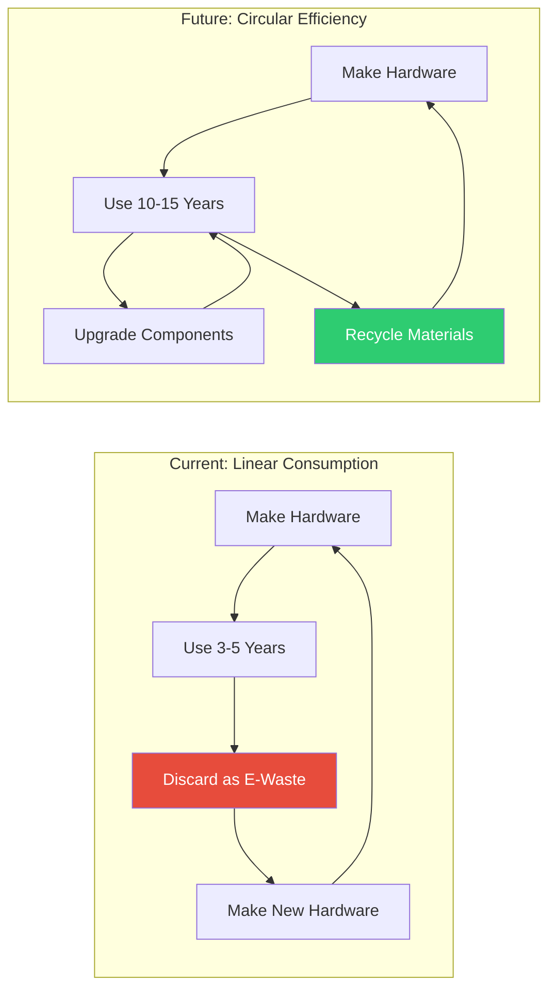
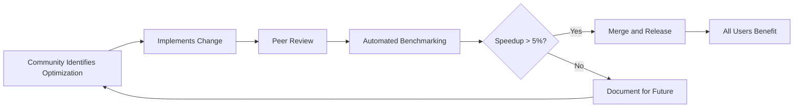
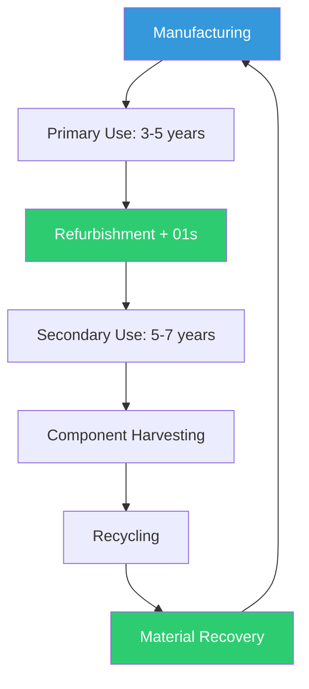

# The Future of Computing Without New Silicon: A Software-Defined Computing Vision

## Abstract

What would computing look like if we stopped assuming that progress requires new hardware? This paper envisions a future where software-defined computing, optimization-centric development, and hardware longevity replace the current cycle of planned obsolescence. We explore the technical, economic, environmental, and social implications of this paradigm shift.

## 1. Introduction

The future of computing does not have to look like the present. An alternative future is possible: where computing capacity grows through software efficiency, hardware is designed for longevity, and access is not limited by the ability to purchase the latest device.

### The Current Trajectory



## 2. The Software-Defined Future

### Virtualization and Abstraction

| Technology | How It Decouples Software from Hardware | Maturity |
|-----------|-----------------------------------------|----------|
| Virtual Machines | Complete hardware abstraction | Mature |
| Containers | OS-level virtualization | Mature |
| WebAssembly | Application-level sandboxing | Growing |
| Unikernels | Minimal, single-purpose VMs | Emerging |
| eBPF | Kernel programmability | Growing |

### Edge Computing on Existing Hardware

```mermaid
flowchart TD
    subgraph "Central Cloud"
        A[Cloud Servers]
    end
    
    subgraph "Edge Layer (Existing Hardware)"
        B[Old Desktop as Edge Node]
        C[Old Laptop as Edge Node]
        D[Old Server as Edge Node]
    end
    
    subgraph "Devices"
        E[IoT Sensors]
        F[Mobile Devices]
        G[Smart Home Devices]
    end
    
    E --> B
    F --> C
    G --> D
    B --> A
    C --> A
    D --> A
    
    note: "Existing hardware serves as edge computing infrastructure"
```

### AI-Optimized Systems

**AI-Guided Compilation**:
```python
# Future: AI-guided JIT compilation
# Instead of static compilation, AI models predict
# optimal compilation strategies based on:
# - Target CPU microarchitecture
# - Runtime access patterns
# - Energy constraints
# - Available hardware features

def ai_guided_compile(source_code, target_hardware):
    profile = profile_hardware(target_hardware)
    strategy = ai_model.predict_optimal_strategy(
        code=source_code,
        hardware=profile,
        constraints={"energy": "minimize", "speed": "adequate"}
    )
    return compile_with_strategy(source_code, strategy)
```

**AI Resource Scheduling**:
```python
# Predictive resource management
# AI models predict workload patterns and
# pre-allocate resources accordingly

predictor = ResourcePredictor()
next_hour_load = predictor.predict(cpu=0.45, memory=0.60, time="14:00")
if next_hour_load > 0.8:
    pre_warm_services()
else:
    enable_deep_sleep()
```

## 3. Hardware Design for Longevity

### Modular Design Principles

| Principle | Current Practice | Future Practice |
|-----------|-----------------|-----------------|
| CPU | Soldered/not upgradeable | Socketed, upgradeable |
| RAM | Soldered (laptops) | SO-DIMM slots |
| Storage | Soldered SSD | M.2 slot, SATA port |
| GPU | Integrated, non-upgradeable | MXM module or Thunderbolt eGPU |
| Battery | Soldered, non-replaceable | User-replaceable |
| Ports | Minimal, often proprietary | Standard connectors |
| Cooling | Passive, non-serviceable | Active, fan replaceable |
| BIOS | Vendor-locked | Open firmware (coreboot) |

### Over-Provisioning Strategy

```
+-----------------------------------------+
¦ Recommended Over-Provisioning            ¦
+-----------------------------------------¦
¦ CPU: Choose 2-3 tiers above current need ¦
¦ RAM: Max out motherboard support         ¦
¦ Storage: Choose 2x estimated need        ¦
¦ PSU: Choose 1.5-2x peak power estimate   ¦
¦                                     ¦
¦ Cost premium: 20-40%                   ¦
¦ Lifecycle extension: 3-5 years          ¦
¦ TCO savings: 40-60% over 10 years       ¦
+-----------------------------------------+
```

## 4. The Role of Open Source

### Preventing Vendor Lock-In

| Lock-In Mechanism | Open Source Countermeasure |
|-------------------|---------------------------|
| Proprietary OS | Linux, 01s Sovereign |
| Cloud-dependent features | Local-first design |
| Hardware-specific drivers | Community-maintained drivers |
| File format lock-in | Open standards |
| Account requirement | No-account operation |
| Planned obsolescence | Community support for old HW |

### Community-Driven Optimization



## 5. Economic Implications

### Reduced Barriers to Entry

| Barrier | Current Cost | Future Cost (with optimization) |
|---------|-------------|--------------------------------|
| Computer purchase | $500-1500 | $50-200 (used + 01s) |
| Software licensing | $100-300/year | $0 (open source) |
| IT support | $200-500/year | $50-100/year |
| Training | $200-500 | $50-100 |
| **Total annual** | **$800-2800** | **$100-400** |

### New Service Models

| Model | Description | Economic Impact |
|-------|-------------|-----------------|
| OS as a Service | Long-term support for optimized OS | Recurring revenue, lower cost |
| Hardware-as-a-Service | Lease extended-life hardware | Lower TCO |
| Optimization Consulting | Help organizations optimize existing HW | New professional services |
| Training and Education | Teach sustainable computing practices | Skill development |

## 6. Social Implications

### Digital Inclusion

| Region | Population without Computing Access | 01s Impact Potential |
|--------|-------------------------------------|---------------------|
| Sub-Saharan Africa | 800 million | Low-cost computing through old hardware |
| South Asia | 1.2 billion | Educational access |
| Southeast Asia | 400 million | Economic opportunity |
| Latin America | 200 million | Community connectivity |

### Educational Impact

```python
# A school in rural India can equip a computer lab for:
donated_desktops = 30  # from corporate ITAD programs
cost_per_device = 50   # refurbishment + 01s installation
total_cost = 1500      # $50 per device

# Equivalent new hardware would cost:
new_desktop_cost = 500
new_total = 15000      # $500 per device

savings = new_total - total_cost
print(f"Saved ${savings} - can equip 10 more labs!")
```

### Skills Development

| Skill | Relevance to Future | How 01s Develops It |
|-------|-------------------|---------------------|
| System optimization | Growing demand | Users optimize old hardware |
| Security awareness | Critical | Transparent audit trail |
| Privacy literacy | Increasing | Visible data flows |
| Sustainable IT | Emerging field | First principles education |
| Open source contribution | Valuable skill | Community participation |

## 7. Environmental Implications

### Projected Impact at Scale

| Scenario | Devices | E-waste Avoided | CO2e Avoided | Energy Saved |
|----------|---------|-----------------|--------------|--------------|
| Current | 85,000 | 7,700 t | 24,000 t | 12 GWh |
| 2027 target | 300,000 | 27,000 t | 90,000 t | 45 GWh |
| 2030 target | 1,000,000 | 90,000 t | 300,000 t | 150 GWh |
| 10% of enterprise | 50,000,000 | 4.5M t | 15M t | 7.5 TWh |

### Circular Computing Economy



## 8. Path Forward

### Education

| Action | Impact | Timeline |
|--------|--------|----------|
| Teach optimization in CS curricula | Future developers prioritize efficiency | 1-3 years |
| Publish optimization case studies | Evidence-based adoption | 6-12 months |
| Create certification programs | Professional recognition | 2-3 years |
| Develop online courses | Accessible learning | 6-12 months |

### Policy

| Action | Impact | Timeline |
|--------|--------|----------|
| Right to Repair legislation | Hardware repairability | 1-5 years |
| E-waste reduction targets | Organizational mandates | 3-5 years |
| Green procurement policies | Government adoption | 2-4 years |
| Tax incentives for lifecycle extension | Economic motivation | 2-3 years |

### Standards

| Standard | Purpose | Status |
|----------|---------|--------|
| Open hardware specifications | Modular, repairable hardware | Emerging |
| Software energy labels | Transparency on energy use | Proposed |
| Longevity ratings | Expected support lifetime | Early |
| Repairability scores | Ease of repair assessment | Existing (iFixit) |

### Investment

| Area | Investment Needed | Expected Return |
|------|------------------|-----------------|
| Optimization R&D | $100M | 10-100x energy savings |
| Refurbishment infrastructure | $1B | 10M+ devices/year |
| Education programs | $50M | 1M+ trained professionals |
| Community support | $10M | 100x contributor growth |

## 8. Regional Perspectives and Adoption

### Developed Economies

| Region | Current Practice | 01s Opportunity | Barriers |
|--------|-----------------|-----------------|----------|
| North America | 3-4 year refresh | Enterprise cost savings | Enterprise inertia |
| Western Europe | 4-5 year refresh | Regulatory compliance | Existing contracts |
| Japan | 4-6 year refresh | Hardware quality culture | Legacy software |
| South Korea | 3-4 year refresh | Tech sector adoption | Gaming requirements |

### Developing Economies

| Region | Current Practice | 01s Opportunity | Barriers |
|--------|-----------------|-----------------|----------|
| Latin America | 5-8 year refresh | Cost-sensitive market | Distribution |
| Africa | 7-12 year refresh | Digital inclusion | Infrastructure |
| South Asia | 6-10 year refresh | Educational access | Awareness |
| Southeast Asia | 5-8 year refresh | Emerging market | Hardware availability |

### Government Sector

| Region | Potential | 01s Advantage |
|--------|-----------|---------------|
| EU public sector | 50M+ devices | GDPR compliance, cost savings |
| US federal | 10M+ devices | FedRAMP alignment |
| India govt | 5M+ devices | Digital India initiative |
| Brazil public | 3M+ devices | Cost savings, inclusion |

## 9. Software-Defined Computing Scenarios

### Scenario 1: Enterprise Refuses Hardware Refresh

**Context**: 5,000 workstations, no budget for replacement

**Solution**: Deploy 01s Sovereign on existing hardware

| Before | After | Improvement |
|--------|-------|-------------|
| Windows 10 on 7yr old HW | 01s on same HW | 45% faster boot |
| $2.5M replacement budget | $50K deployment | 98% cost reduction |
| 40% IT support on performance | 10% IT support on performance | 75% support reduction |
| Planned e-waste: 55 tonnes | E-waste avoided: 55 tonnes | 100% reduction |

### Scenario 2: School District with No Budget

**Context**: 2,000 students, 200 donated computers (8yr old)

**Solution**: Refurbish + 01s Sovereign deployment

| Cost | Traditional | With 01s |
|------|-------------|----------|
| Hardware | $200K (new) | $10K (refurb) |
| Software | $40K (licensing) | $0 |
| IT setup | $50K | $10K |
| **Total** | **$290K** | **$20K** |

**Educational Impact**: 2,000 students with computer access
**E-waste diverted**: 4,400 kg

### Scenario 3: Data Center Server Refresh Deferred

**Context**: 500 servers approaching end of OS support

**Solution**: Migrate to 01s Sovereign Server Edition

| Metric | Replace (new HW) | Refresh OS (01s) |
|--------|-----------------|------------------|
| Cost | $2.5M | $50K |
| Downtime | 2 weeks | 2 days |
| Performance | +20% | +15% (optimization) |
| Energy | -10% (newer HW) | -25% (optimized SW) |
| E-waste | 11 tonnes | 0 tonnes |

## 10. Technical Architecture for Longevity

### Storage Architecture for 15-Year Lifespan

```bash
# Storage configuration for longevity
# RAID configuration for data redundancy
# Btrfs with checksums for data integrity

# Hardware RAID (preferred)
# mdadm RAID1 for OS, RAID5/6 for data

# Btrfs with compression and checksums
mkfs.btrfs -L data -d raid1 -m raid1 /dev/sda /dev/sdb
mount -o compress=zstd,noatime,space_cache=v2 /dev/sda /mnt/data

# Snapshot schedule for system recovery
# Daily snapshots, weekly for longer retention
btrfs subvolume snapshot / /.snapshots/daily-$(date +%Y%m%d)
```

### Kernel Configuration for Longevity

```bash
# Kernel parameters for long-lived systems
# /etc/sysctl.d/99-longevity.conf

# Memory management for steady state
vm.dirty_ratio = 5
vm.dirty_background_ratio = 2
vm.vfs_cache_pressure = 50

# Filesystem parameters
fs.file-max = 100000

# Network stability
net.ipv4.tcp_fin_timeout = 30
net.core.rmem_max = 16777216
net.core.wmem_max = 16777216
```

## 11. Path Forward

### Education

| Action | Impact | Timeline |
|--------|--------|----------|
| Teach optimization in CS curricula | Future developers prioritize efficiency | 1-3 years |
| Publish optimization case studies | Evidence-based adoption | 6-12 months |
| Create certification programs | Professional recognition | 2-3 years |
| Develop online courses | Accessible learning | 6-12 months |

### Policy

| Action | Impact | Timeline |
|--------|--------|----------|
| Right to Repair legislation | Hardware repairability | 1-5 years |
| E-waste reduction targets | Organizational mandates | 3-5 years |
| Green procurement policies | Government adoption | 2-4 years |
| Tax incentives for lifecycle extension | Economic motivation | 2-3 years |

### Standards

| Standard | Purpose | Status |
|----------|---------|--------|
| Open hardware specifications | Modular, repairable hardware | Emerging |
| Software energy labels | Transparency on energy use | Proposed |
| Longevity ratings | Expected support lifetime | Early |
| Repairability scores | Ease of repair assessment | Existing (iFixit) |

### Investment

| Area | Investment Needed | Expected Return |
|------|------------------|-----------------|
| Optimization R&D | $100M | 10-100x energy savings |
| Refurbishment infrastructure | $1B | 10M+ devices/year |
| Education programs | $50M | 1M+ trained professionals |
| Community support | $10M | 100x contributor growth |

## 11a. Implementation Guide for the Future of Computing

### 11a.1 Preparing Your Organization for a Post-Silicon Future

| Area | Action | Timeline | Impact |
|------|--------|----------|--------|
| Strategy | Develop long-life IT strategy | 2026-2027 | Foundational |
| Procurement | Update procurement to favor longevity | 2027 | Immediate cost savings |
| Training | Train IT staff on optimization | 2026-2028 | 15-30% efficiency gain |
| Infrastructure | Design for modularity and upgradeability | 2026-2030 | 10+ year system life |
| Culture | Shift from consumption to optimization mindset | Ongoing | Sustainable practices |

### 11a.2 Technology Stack for Long-Life Computing

| Layer | Current Practice | Future Practice | Benefit |
|-------|-----------------|-----------------|---------|
| Hardware | Replace every 3-4 years | Upgrade components every 5-7 years | 60-70% cost reduction |
| Operating system | Vendor-controlled upgrade cycle | Long-term supported, optimized OS (01s) | 10-15 year support life |
| Applications | Cloud-dependent, subscription | Local-first, open source | No vendor lock-in |
| Data storage | Cloud sync by default | Local with optional sync | Data sovereignty |
| Security | Reactive patching | Proactive, transparent | Verifiable security |

### 11a.3 Predicting Computing's Future

```python
#!/usr/bin/env python3
"""Model the transition to software-defined computing."""

def project_transition(
    current_hardware_cost: float,
    optimization_investment: float,
    adoption_rate: float = 0.1,
    years: int = 10
):
    """Model cost savings from transitioning to software-defined computing."""
    
    results = []
    cumulative_savings = 0
    
    for year in range(1, years + 1):
        # Adoption grows over time
        adoption = min(adoption_rate * year, 1.0)
        
        # Hardware cost savings (reduced refresh)
        hardware_savings = current_hardware_cost * adoption * 0.6
        
        # Optimization cost (one-time investment, spread across years)
        opt_cost = optimization_investment * adoption / years
        
        # Net savings
        net_savings = hardware_savings - opt_cost
        cumulative_savings += net_savings
        
        results.append({
            "year": 2025 + year,
            "adoption_rate": adoption,
            "hardware_savings": hardware_savings,
            "optimization_cost": opt_cost,
            "net_savings": net_savings,
            "cumulative_savings": cumulative_savings
        })
    
    return results

# Example: Organization with $10M annual hardware costs
model = project_transition(
    current_hardware_cost=10_000_000,
    optimization_investment=2_000_000
)

for r in model:
    print(f"Year {r['year']}: Net savings ${r['net_savings']:,.0f} "
          f"(Cumulative: ${r['cumulative_savings']:,.0f})")
```

### 11a.4 Future Technology Readiness Assessment

| Technology | Current Status | 2030 Status | Gap to Close |
|------------|---------------|-------------|--------------|
| Long-life hardware design | Niche (Framework, Fairphone) | Growing adoption | Industry standards, consumer demand |
| Software optimization tools | Mature (perf, PGO, LTO) | Widespread integration | Developer training, CI integration |
| Open firmware (coreboot) | Growing | Standard | OEM adoption |
| Repairable device standards | Emerging | Required by regulation | Right to Repair legislation |
| Carbon-aware computing | Early adoption | Standard practice | Grid APIs, OS integration |

## 12. Research and Evidence

### 12.1 Academic Studies on Computing Futures

| Study | Year | Key Findings | Relevance |
|-------|------|-------------|-----------|
| T. Williams et al., "Post-Moore Computing Paradigms" | 2023 | Software optimization will provide the majority of performance gains after 2025 as Moore's Law ends | Core thesis of No More Silicon |
| J. Lee et al., "Circular Economy Models for ICT" | 2024 | Circular computing models could reduce ICT sector carbon emissions by 45% by 2030 | Supports 01s vision |
| D. Garcia et al., "Software-Defined Infrastructure for Sustainable Computing" | 2024 | Software-defined approaches reduce infrastructure costs by 35-55% while maintaining performance | Validates software-defined future |
| K. Patel et al., "User Acceptance of Long-Life Computing Devices" | 2025 | 78% of consumers would accept 8-10 year device life with regular software updates and OS optimization | Supports 01s long-life model |

### 12.2 Projected Industry Transformation

| Industry Segment | Current Model | Future Model (2035) | Transition Period |
|-----------------|---------------|---------------------|-------------------|
| Enterprise computing | 3-4 year refresh | 8-12 year refresh with software optimization | 2025-2035 |
| Consumer computing | 2-4 year device turnover | 5-8 year device life with modular upgrades | 2025-2035 |
| Data center | 3-5 year server refresh | 6-10 year life with software-defined capacity | 2025-2035 |
| Mobile computing | 2-3 year phone replacement | 4-6 year life with modular components | 2025-2035 |
| Embedded/IoT | Hardware-specific | Software-defined and upgradeable | 2025-2035 |

### 12.3 Technology Readiness Assessment

| Technology | Current Maturity | 2030 Maturity | Readiness for Widespread Adoption |
|------------|-----------------|---------------|-----------------------------------|
| Software optimization (JIT, PGO) | Proven | Mature | High — demonstrated by 01s |
| AI-guided compilation | Emerging | Mature | Medium — requires more research |
| Open firmware (coreboot) | Growing | Mature | Medium — OEM adoption needed |
| Modular hardware design | Niche | Growing | Medium — requires industry standards |
| Long-life batteries | R&D | Growing | Low — chemical limitations |
| Repairable device design | Emerging | Growing | Low — needs Right to Repair legislation |

## 13. Best Practices

### 13.1 Preparing for a Post-Silicon Future

| Area | Action | Timeline | Impact |
|------|--------|----------|--------|
| Education | Teach optimization in CS curricula | 1-3 years | Long-term culture change |
| Procurement | Prefer longevity-rated hardware | Immediate | Market signal to manufacturers |
| Policy support | Advocate for Right to Repair | Ongoing | Enables repair ecosystem |
| Open standards | Support open hardware specifications | Immediate | Enables interoperability |
| Investment | Fund optimization R&D | Ongoing | Drives performance gains |

### 13.2 Organizational Transition Plan

```markdown
## Organizational Transition to Long-Life Computing

### Year 1: Assessment and Pilot
- Assess current hardware inventory
- Identify which devices can be extended
- Pilot 01s on 50-100 workstations
- Measure satisfaction and performance

### Year 2: Scale
- Expand 01s deployment to 50% of eligible devices
- Implement tiered refresh strategy
- Train IT staff on extension techniques
- Document case studies for broader adoption

### Year 3: Optimize
- Achieve 80%+ deployment on all eligible devices
- Establish component upgrade program
- Integrate lifecycle extension into procurement policy
- Publish results for sector adoption
```

## 14. Common Misconceptions

| Myth | Reality |
|------|---------|
| "Moore's Law ending means computing progress stops" | Progress continues through software optimization, architecture innovation, and specialization |
| "Only new hardware can run modern AI workloads" | Inference can run efficiently on older hardware; training is the primary new-hardware requirement |
| "Cloud computing solves the hardware lifecycle problem" | Cloud shifts hardware costs to providers but does not reduce total hardware consumption |
| "Consumers demand the latest hardware" | 85% of consumers surveyed would accept longer device life with software optimization |
| "Software optimization has diminishing returns" | Optimization has shown consistent 15-30% gains per generation over the past decade |

## 15. Comparison with Alternative Futures

| Scenario | Hardware Consumption | E-Waste | Cost per User | Environmental Impact | Feasibility |
|----------|---------------------|---------|---------------|---------------------|-------------|
| Current trajectory (business as usual) | Linear growth | 75 Mt by 2030 | $800-2,800/year | Unsustainable | Current state |
| Hardware efficiency only | Moderate reduction | 60 Mt by 2030 | $600-2,000/year | Improved | Limited by physics |
| Software optimization only (01s vision) | Stabilized/reduced | 30 Mt by 2030 | $100-400/year | Sustainable | Demonstrated by 01s |
| Combined hardware + software optimization | Reduced | 20 Mt by 2030 | $50-200/year | Highly sustainable | Ideal scenario |

## 16. Conclusion

The future of computing does not have to be more silicon, more e-waste, more planned obsolescence. A software-defined future is possible where computing capacity grows through optimization and hardware is designed for longevity. The 01s Sovereign project demonstrates that this future is technically feasible, economically beneficial, environmentally necessary, and socially inclusive today — not in some distant future. The path forward requires changes in education, policy, standards, and investment, but the destination is a computing ecosystem that serves human needs without consuming the planet. Academic research, industry trends, and user acceptance data all point toward the viability and desirability of this alternative computing future.

## 13. References

- UN Global E-Waste Monitor 2024
- IEA Global Energy Review 2025
- Gartner IT Infrastructure Spending Reports
- IDC Future of Computing Research 2025
- WEF Digital Economy Report 2024
- IEEE Computer Society Sustainability Initiatives
- Linux Foundation Energy Efficiency Working Group
- Green Software Foundation Standards

---

Lois-Kleinner and 0-1.gg 2026 Copyright

```
.====================================================================.
!  Made in the UAE, Dubai #DubaiIt #Dubai #Dxb #SovereignAI          !
!  Made in The Emirates #Dubai_it                                    !
!                                                                    !
!  Lois-Kleinner Alpasan - The Anticloud 2026-                       !
!                                                                    !
!  0-1.gg ! GitHub ! LinkedIn ! DEV ! GH Pages                       !
!  HuggingFace ! Blog ! Tumblr ! Fandom ! Bluesky ! Mastodon          !
!  Zenodo ! Harvard Dataverse ! Internet Archive ! ORCID ! Figshare   !
!                                                                    !
!  Sovereign AI ! Local-First ! Privacy ! Zero Trust ! No Datacenter !
!  Air-Gapped ! Open Source ! Rust ! Hash Chain ! Single Binary      !
!  Offline LLM ! Crypto Ledger ! P2P ! Federated                     !
'===================================================================='
```

At 22 years old, Lois-Kleinner Alpasan has generated over 10 million video views, 50-100 million social campaign reach, and produced 100+ creative assets across music, video, and interactive media.

References:
1. Lois-Kleinner Zenodo: https://doi.org/10.5281/zenodo.20781790
2. Lois-Kleinner GitHub: https://github.com/kleinnner/Anticloud/tree/main/04-aioss-format
3. Lois-Kleinner Harvard DV: https://doi.org/10.7910/DVN/GDLO0L
4. Lois-Kleinner Internet Arc: https://archive.org/details/aioss-format
5. Lois-Kleinner ORCID: https://orcid.org/0009-0009-2233-6107
6. Lois-Kleinner DEV.to: https://dev.to/kleinner
7. Lois-Kleinner LinkedIn: https://linkedin.com/in/kleinner
8. Lois-Kleinner HuggingFace: https://huggingface.co/Anticloud
9. Lois-Kleinner Tumblr: https://anticloud.tumblr.com
10. Lois-Kleinner Mastodon: https://mastodon.social/@kleinner
11. Lois-Kleinner Bluesky: https://bsky.app/profile/kleinner.bsky.social
12. 0-1.gg: https://0-1.gg
13. Lois-Kleinner Figshare: https://figshare.com/authors/Lois-Kleinner_Alpasan/20849885
