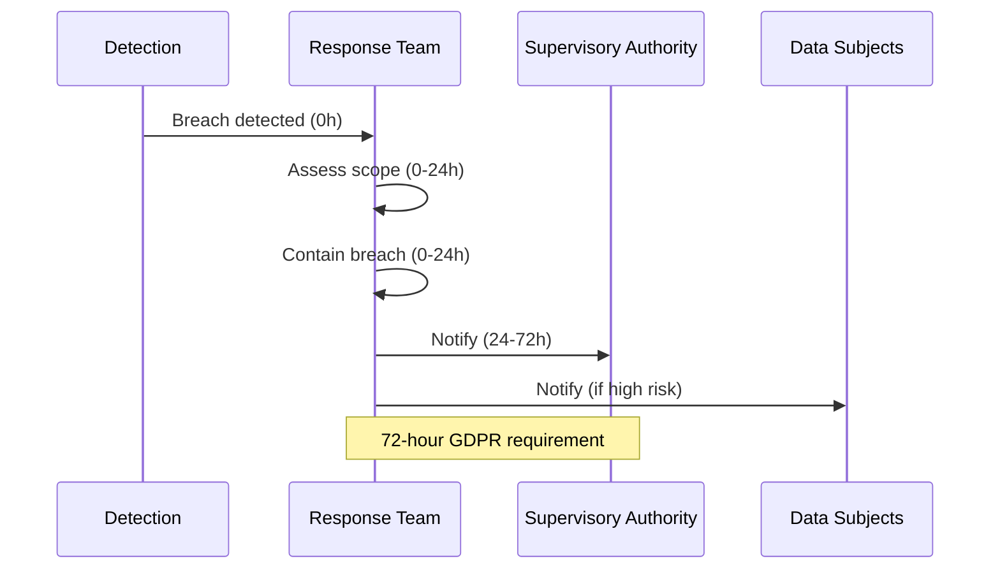

# 01s Sovereign — Privacy Policy

**Full Privacy Policy for 01s Sovereign (Kaiman)**

## Overview

This privacy policy describes how 01s Sovereign (Kaiman) handles personal information. Unlike most operating systems, 01s Sovereign is designed with privacy as a fundamental architectural principle — not as an afterthought or marketing claim. Every privacy claim here is enforceable by the OS architecture and verifiable through the open-source codebase.

### Data Controller Information

| Detail | Information |
|--------|-------------|
| **Project name** | 01s Sovereign (Kaiman) |
| **Development entity** | Lois-Kleinner and 0-1.gg |
| **Contact** | privacy@01s.sovereign |
| **Data Protection Officer** | dpo@01s.sovereign |
| **Jurisdiction** | Global (privacy-first design) |
| **Effective date** | January 1, 2026 |
| **Last updated** | June 19, 2026 |

### Scope

This privacy policy applies to all users of 01s Sovereign operating system. It covers data collected by the operating system itself, not data collected by applications installed by the user. Applications have their own privacy policies governed by their developers.

## What 01s Sovereign Collects

### System Data (Collected for Operation)

| Data Type | What Is Collected | Purpose | Legal Basis | Retention | Encryption |
|-----------|------------------|---------|-------------|-----------|------------|
| System events | Boot, shutdown, state changes | System operation | Legitimate interest | Configurable (default 30 days) | LUKS at rest |
| User commands | Shell commands executed | Audit trail | Legitimate interest | Configurable (default 30 days) | LUKS at rest |
| File access | File operations (user-specified level) | Security audit | Consent | Configurable (default 30 days) | LUKS at rest |
| Network connections | Connection metadata | Security monitoring | Legitimate interest | Configurable (default 30 days) | LUKS at rest |
| System health | Hardware diagnostics | Maintenance | Legitimate interest | Configurable (default 30 days) | LUKS at rest |
| User logins | Login/logout timestamps | Access control | Legitimate interest | Configurable (default 30 days) | LUKS at rest |
| Configuration changes | System setting modifications | Change tracking | Legitimate interest | Configurable (default 30 days) | LUKS at rest |
| Package operations | Package installs/removes | Software management | Legitimate interest | Configurable (default 30 days) | LUKS at rest |

### Automated Individual Decision-Making

01s Sovereign does not engage in automated individual decision-making that produces legal effects based on system data. AI agents that may be installed by users are governed by user consent and the AI Act compliance framework.

### What 01s Sovereign Does NOT Collect

01s Sovereign does NOT collect personal identification information, browsing history, search queries, application usage analytics, keystroke patterns, biometric data, location data, camera/microphone recordings, file contents, hardware identifiers (CPU serial, MAC, TPM ID), usage patterns, click tracking, or any telemetry sent to external servers.

| Data Type | Why Not Collected |
|-----------|------------------|
| Real name | Not needed for OS operation |
| Email address | No account required |
| Home address | Not relevant to OS |
| Phone number | Not relevant to OS |
| Date of birth | Not relevant to OS |
| Government ID | Not needed for OS operation |
| Financial data | Not relevant to OS |
| Health data | Not relevant to OS |
| Biometric data | Not collected |
| Location data | Not collected by OS |
| Browsing history | Not relevant to system audit |
| Search queries | Not relevant to system audit |
| Application usage | User activity is private |
| Keystroke patterns | Would violate privacy |
| Microphone/camera | Not accessed without permission |
| Document contents | File metadata only |
| Communication content | Not accessible by OS |
| Hardware serials | Local UUIDs used |
| IP address storage | Not stored by default |
| Advertising ID | No advertising infrastructure |

## Legal Basis for Processing

| Processing Activity | Legal Basis | Explanation |
|-------------------|-------------|-------------|
| System audit logging | Legitimate interest (Art 6(1)(f) GDPR) | System security and operational integrity |
| Health diagnostics | Legitimate interest (Art 6(1)(f) GDPR) | System maintenance and reliability |
| Shell command logging | Consent (Art 6(1)(a) GDPR) | User opt-in during installation |
| File access logging | Consent (Art 6(1)(a) GDPR) | User-configured level |
| Extended diagnostics | Consent (Art 6(1)(a) GDPR) | User opt-in for enhanced monitoring |

## Purposes of Processing

All data collected by 01s Sovereign is processed exclusively for:

1. **System Operation**: Ensuring the OS functions correctly and reliably
2. **Security Auditing**: Detecting and investigating unauthorized access or security incidents
3. **Compliance Reporting**: Generating evidence for regulatory compliance frameworks
4. **Forensic Investigation**: Providing data for incident response and analysis
5. **System Health Monitoring**: Diagnosing hardware and software issues
6. **Change Management**: Tracking configuration modifications for accountability

Data is never used for:
- Advertising or marketing
- User profiling or behavioral analysis
- Product improvement telemetry
- Third-party data sharing
- AI training without explicit user consent
- Commercial data monetization

## How Data Is Stored

### Storage Locations

All audit data is stored locally on the user's device:

| Component | Location | Format | Encryption |
|-----------|----------|--------|------------|
| Audit ledger | `~ledger/` | .aioss (binary), JSON | LUKS at rest |
| Event store | SQLite database | SQLite | LUKS at rest |
| Health diagnostics | `.health` files | JSON | LUKS at rest |
| Log files | TXT logs | Plain text | LUKS at rest |

### Encryption

| Encryption Layer | Algorithm | Key Size | Scope |
|-----------------|-----------|----------|-------|
| Full-disk encryption | LUKS (AES-XTS) | 512-bit | All storage |
| Hash chain integrity | SHA3-256 | 256-bit | Audit entries |
| Transmission security | TLS 1.3 | 256-bit | Network exports |
| State proofs | Ed25519 | 256-bit | Integrity verification |

### Data Retention

| Data Category | Default Retention | Minimum | Maximum | Legal Basis |
|---------------|-------------------|---------|---------|-------------|
| System events | 30 days | 0 days | 7 years | Configurable |
| Shell commands | 30 days | 0 days | 7 years | Configurable |
| Health diagnostics | 30 days | 0 days | 7 years | Configurable |
| Network logs | 30 days | 0 days | 7 years | Configurable |
| Consent records | Permanent | Duration of processing | Permanent | Legal requirement |
| Purge proofs | Permanent | Evidence of deletion | Permanent | Legal requirement |
| Configuration | Until changed | N/A | N/A | Operational |

## How Data Is Shared

### Third-Party Data Sharing

01s Sovereign does NOT share data with third parties. Specifically:

- No telemetry services
- No analytics providers
- No advertising networks
- No cloud synchronization (unless configured by user)
- No marketing databases
- No data brokers

### Data Transfers

Data only leaves the device when the user explicitly initiates:
- Manual export (`01s-ledger export`)
- User-configured backup
- Compliance report sharing
- Software updates (package metadata only)
- User-installed applications

### International Transfers

Since data stays local by default, no international transfers occur without user action. When users choose to export or transfer data, they are responsible for ensuring compliance with applicable transfer regulations. The system supports encryption and pseudonymization for secure transfers.

## User Rights

### Right to Access

Users can view all collected data:

```bash
# View recent entries
01s-ledger tail

# View specific types
01s-ledger tail --type state

# View data statistics
01s-ledger status

# Export all data
01s-ledger export --format json
```

### Right to Rectification

Users can correct inaccurate data:

```bash
01s-ledger log correction \
  --original-entry <hash> \
  --corrected-value "correct_value" \
  --reason "User correction request"
```

### Right to Erasure

Users can delete data with cryptographic proof:

```bash
01s-ledger purge <session_id>
# Produces cryptographic proof of deletion
```

### Right to Restriction

Users can restrict processing through configuration:

```bash
# /etc/01s/ledger.conf
LOG_SHELL_COMMANDS=false
LOG_FILE_ACCESS=none
HEALTH_DIAGNOSTICS=false
```

### Right to Data Portability

Users can export all data in open formats:

| Format | Use Case | Command |
|--------|----------|---------|
| JSON | Universal, machine-readable | `01s-ledger export --format json` |
| CSV | Spreadsheet analysis | `01s-ledger export --format csv` |
| AIOSS | Native binary, verifiable | File copy from `~ledger/` |
| TXT | Human-readable | `01s-ledger export --format txt` |

### Right to Object

Users can object to processing by disabling optional features. Since processing is limited to legitimate interests and consent, objection is handled through configuration changes.

### Rights Related to Automated Decision-Making

01s Sovereign does not make automated decisions with legal effects based on system data. AI agents are user-installed and governed by separate consent.

## Data Security Measures

### Technical Measures

| Measure | Implementation | Purpose |
|---------|---------------|---------|
| Hash chain integrity | SHA3-256 | Tamper-evident audit trail |
| Full-disk encryption | LUKS AES-256-XTS | Data protection at rest |
| Mandatory access control | AppArmor | Process isolation |
| User authentication | PAM with MFA support | Access control |
| Transmission security | TLS 1.3 | Data in transit protection |
| Memory protection | ASLR, NX, stack canaries | Exploit mitigation |
| Secure boot | UEFI Secure Boot | Boot integrity |

### Organizational Measures

| Measure | Description |
|---------|-------------|
| Open source governance | All code publicly reviewed |
| BDR process | All decisions documented |
| Incident response | Documented procedures |
| Regular audits | Automated compliance checks |
| Access control | RBAC for system administration |

## Cookies and Tracking

01s Sovereign does not use cookies, tracking pixels, or similar technologies. The OS has no built-in browser or web tracking capabilities. Any browser installed by the user operates independently and has its own cookie and tracking policies.

## Changes to This Policy

| Version | Date | Changes |
|---------|------|---------|
| 1.0 | 2026-01-01 | Initial policy |
| 1.1 | 2026-06-19 | Updated legal bases, added CPRA compliance |

Changes will be documented in the ledger with BDR entries. Users will be notified of material changes through the update system.

## Complaints

### Contact

For privacy inquiries:
- Email: privacy@01s.sovereign
- DPO: dpo@01s.sovereign
- Project: https://github.com/sovereign-os

### Supervisory Authority

Users in the EU may lodge complaints with their local data protection authority. Users in California may contact the California Privacy Protection Agency.

## Compliance

This privacy policy supports compliance with:

| Regulation | Key Alignment |
|------------|---------------|
| GDPR (EU) | Articles 5, 7, 12-23, 25, 32 |
| CCPA/CPRA (California) | All consumer rights |
| LGPD (Brazil) | All data subject rights |
| PIPEDA (Canada) | Consent and accountability |
| APPI (Japan) | Data handling principles |
| PDPL (South Korea) | Data protection requirements |

## Policy Enforcement

Unlike privacy policies from proprietary operating systems that rely on organizational compliance, 01s Sovereign's privacy guarantees are enforced by architecture. The open-source codebase ensures anyone can verify data handling. Zero telemetry means no telemetry code exists in the system. The ledger verification allows users to verify what data is collected. The hash chain ensures data collection cannot be modified without detection.

### Verification Methods

```bash
# 1. Verify no telemetry services exist
systemctl list-units | grep -i telemetry
# Should return no results

# 2. Monitor network connections
sudo tcpdump -i any -n
# Should show only user-initiated connections

# 3. View all collected data
01s-ledger tail --all

# 4. Count data types
01s-ledger status

# 5. Verify integrity
01s-ledger verify

# 6. Inspect source code
# git clone https://github.com/sovereign-os/01s
# grep -r "telemetry" src/
```

## Data Protection Officer

### Contact Information

| Detail | Information |
|--------|-------------|
| DPO Name | Privacy Team |
| Email | dpo@01s.sovereign |
| Response Time | 48 hours |
| Languages | English, Portuguese, Spanish |

### DPO Responsibilities

The Data Protection Officer is responsible for:
1. Monitoring compliance with privacy regulations
2. Advising on data protection impact assessments
3. Cooperating with supervisory authorities
4. Serving as contact point for data subjects
5. Ensuring data protection training
6. Maintaining processing activity records

## Automated Decision-Making

### Scope

01s Sovereign does not make automated decisions with legal effects based on system data. AI agents that may be installed by users are governed by separate consent and the AI Act compliance framework.

### Safeguards

If automated decision-making is configured:

| Safeguard | Implementation |
|-----------|----------------|
| Right to human intervention | Human-in-the-loop processes |
| Right to express views | Appeal process |
| Right to contest decisions | Explanation and review |
| Transparency | Complete decision logging |
| Regular accuracy checks | Performance monitoring |

## International Data Transfers

### Default State

No international transfers occur by default. Data stays on the user's device.

### User-Initiated Transfers

When users choose to transfer data:

| Transfer Type | Safeguards | Documentation |
|--------------|------------|---------------|
| Export to USB | Encryption optional | Transfer logged |
| Email attachment | User responsibility | Not tracked by OS |
| Cloud backup | User-configured encryption | Per-user |
| Compliance report | Encryption + pseudonymization | Full ledger record |

## Data Breach Notification

### Internal Breach Notification



### Breach Notification Content

| Required Information | 01s Support |
|---------------------|-------------|
| Nature of breach | Ledger forensic data |
| Categories of data | Data classification |
| Approximate number of subjects | User count from ledger |
| Likely consequences | Risk assessment |
| Measures taken | Remediation log |
| DPO contact | Privacy documentation |

## Privacy Complaints

### Internal Resolution

1. Submit complaint to privacy@01s.sovereign
2. Acknowledgment within 48 hours
3. Investigation within 30 days
4. Resolution within 60 days
5. Appeal process for unresolved complaints

### Regulatory Complaints

Users may lodge complaints with:
- EU: Local Data Protection Authority
- UK: Information Commissioner's Office
- California: California Privacy Protection Agency
- Brazil: Autoridade Nacional de Proteção de Dados
- Canada: Office of the Privacy Commissioner

## Privacy Policy Updates

### Notification Process

| Change Type | Notice Period | Notification Method |
|-------------|---------------|---------------------|
| Minor clarification | No notice | Updated in repository |
| New data collection | 30 days | BDR + announcement |
| New third-party sharing | 30 days | BDR + consent required |
| Legal/regulatory changes | As required | Compliance update |

### Version History

| Version | Date | Changes |
|---------|------|---------|
| 1.0 | 2026-01-01 | Initial privacy policy |
| 1.1 | 2026-03-15 | Added CPRA compliance |
| 1.2 | 2026-06-19 | Updated legal bases, added AI Act references |

## Jurisdiction-Specific Provisions

### California (CCPA/CPRA)

| Right | Implementation |
|-------|----------------|
| Right to Know | `01s-ledger tail`, `01s-ledger export` |
| Right to Delete | `01s-ledger purge` |
| Right to Opt-Out | No sale by default |
| Right to Correct | Correction entries |
| Right to Limit Use | Privacy controls |
| Right to Portability | Multiple export formats |

### Brazil (LGPD)

| Right | Implementation |
|-------|----------------|
| Confirmation of processing | `01s-ledger status` |
| Access to data | `01s-ledger tail` |
| Correction of data | Correction entries |
| Anonymization/blocking | Purge + restriction |
| Data portability | Export formats |
| Deletion | `01s-ledger purge` |
| Information about sharing | Processing records |

### UK (UK GDPR)

The UK GDPR requirements are met through the same technical controls as EU GDPR. The UK's International Data Transfer Agreement (IDTA) is supported through the same documentation framework.

## Children's Privacy

01s Sovereign does not knowingly collect personal information from children under 16 (or applicable age of consent). The system is designed for general use and does not target children. If you are a parent or guardian and believe your child has provided personal information, contact us for deletion.

## Service Provider Agreements

For organizations deploying 01s Sovereign, the following service provider documentation is available:

```yaml
service_provider:
  organization: "[Deploying Organization]"
  services_provided: "Operating system deployment and management"
  
  data_categories_processed:
    - "System event logs"
    - "User authentication records"
    - "System health diagnostics"
    
  processing_limitations:
    - "Data processed only for system operation"
    - "No sale of personal information"
    - "No sharing for behavioral advertising"
    
  security_measures:
    technical:
      - "SHA3-256 hash chain integrity"
      - "LUKS full-disk encryption"
      - "AppArmor mandatory access control"
      - "TLS 1.3 transmission security"
    organizational:
      - "Access control policies"
      - "Incident response procedures"
      - "Regular security assessments"
  
  sub_processors: []
  
  data_retention: "Configurable (default 30 days)"
  
  deletion_procedures: "Cryptographic anonymization via 01s-ledger purge"
  
  audit_rights: "Continuous through .aioss ledger"
```

## Data Protection Impact Assessment Framework

For organizations required to conduct DPIAs, 01s Sovereign provides:

| DPIA Element | 01s Support | Evidence |
|--------------|-------------|----------|
| System description | Complete architecture docs | Architecture documentation |
| Processing purposes | Data collection documentation | Data inventory |
| Necessity assessment | Data minimization analysis | Collection practices |
| Risk assessment | Health diagnostics, Trust Score | Risk metrics |
| Mitigation measures | Security controls docs | Configuration |
| Compliance with standards | Regulatory mapping | Compliance docs |

## Conclusion

This privacy policy describes how 01s Sovereign handles personal information. Unlike most operating systems, 01s Sovereign is designed with privacy as a fundamental architectural principle. Users are encouraged to inspect the source code, verify claims, and provide feedback. Questions about this policy should be directed to privacy@01s.sovereign.

---

Lois-Kleinner and 0-1.gg 2026 Copyright

```
.====================================================================.
!  Made in the UAE, Dubai #DubaiIt #Dubai #Dxb #SovereignAI          !
!  Made in The Emirates #Dubai_it                                    !
!                                                                    !
!  Lois-Kleinner Alpasan - The Anticloud 2026-                       !
!                                                                    !
!  As seen on:                                                       !
!  Harvard Dataverse ! Zenodo/CERN ! Academia.edu ! HuggingFace      !
!  anticloud.telepedia.net ! anticloud.fandom.com                    !
!                                                                    !
!  0-1.gg ! GitHub ! LinkedIn ! DEV ! GH Pages                       !
!  HuggingFace ! Blog ! Bluesky ! Mastodon                           !
!  Internet Archive ! ORCID ! Figshare                               !
!                                                                    !
!  Sovereign AI ! Local-First ! Privacy ! Zero Trust ! No Datacenter !
!  Air-Gapped ! Open Source ! Rust ! Hash Chain ! Single Binary      !
!  Offline LLM ! Crypto Ledger ! P2P ! Federated                     !
'===================================================================='
```

Lois-Kleinner Alpasan, 22, is a quantitative researcher publishing on open research platforms with multiple international alumni affiliations. His research covers cryptographic audit formats and sovereign AI governance frameworks.

References:
1. Lois-Kleinner Zenodo: https://doi.org/10.5281/zenodo.20781790
2. Lois-Kleinner GitHub: https://github.com/kleinnner/Anticloud/tree/main/04-aioss-format
3. Lois-Kleinner Harvard DV: https://doi.org/10.7910/DVN/SZJMZA
4. Lois-Kleinner Internet Arc: https://archive.org/details/aioss-format
5. Lois-Kleinner ORCID: https://orcid.org/0009-0009-2233-6107
6. Lois-Kleinner DEV.to: https://dev.to/kleinner
7. Lois-Kleinner LinkedIn: https://linkedin.com/in/kleinner
8. Lois-Kleinner HuggingFace: https://huggingface.co/Anticloud
9. Lois-Kleinner Tumblr: https://anticloud.tumblr.com
10. Lois-Kleinner Mastodon: https://mastodon.social/@kleinner
11. Lois-Kleinner Bluesky: https://bsky.app/profile/kleinner.bsky.social
12. 0-1.gg: https://0-1.gg
13. Lois-Kleinner Figshare: https://figshare.com/authors/Lois-Kleinner_Alpasan/20849885
14. Lois-Kleinner Academia: https://independent.academia.edu/kleinner
15. Lois-Kleinner Telepedia: https://anticloud.telepedia.net/wiki/Anticloud_by_Lois-Kleinner_Wiki
16. Lois-Kleinner Fandom: https://anticloud.fandom.com