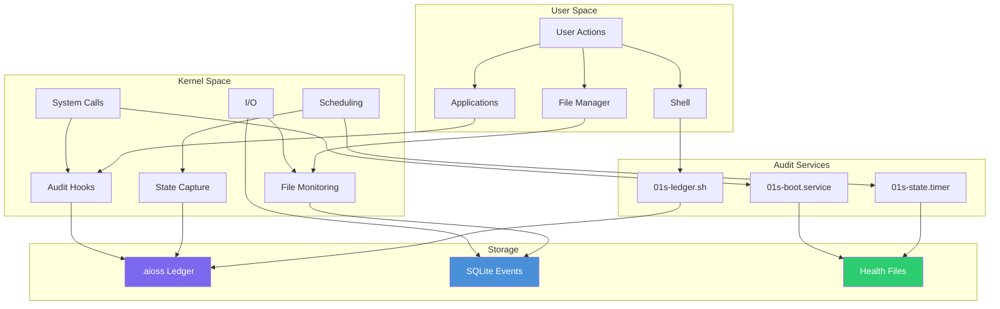
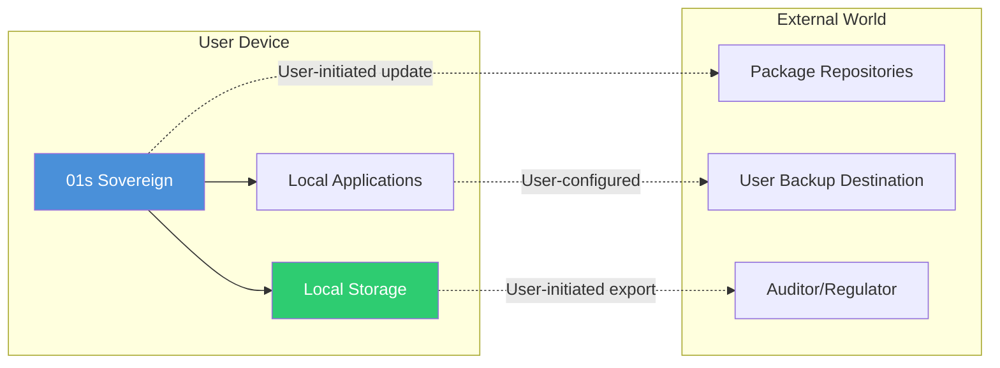

# 01s Sovereign — Data Collection Practices

**What Data Is and Is Not Collected**

## Philosophy

01s Sovereign collects the minimum data necessary to operate the system and provide the cryptographic audit trail that defines the platform. Unlike proprietary operating systems that treat user data as a business asset, 01s Sovereign treats user data as the user's property. This philosophy is embedded in every aspect of the OS architecture: from the kernel up through the application layer, data collection is minimized, transparent, and user-controlled.

## Complete Data Collection Inventory

### Collected Data (Transparently)

| Category | Specific Data | Why Collected | Legal Basis | User Control | Retention |
|----------|--------------|---------------|-------------|-------------|-----------|
| **System Events** | Boot/shutdown timestamps, service start/stop | System operation, audit | Legitimate interest | View, delete, configure retention | Configurable |
| **State Snapshots** | CPU load, memory usage, disk usage, uptime | Health monitoring | Legitimate interest | View, delete, configure interval | Configurable |
| **Shell Commands** | Commands executed in terminal | Audit trail | Consent | View, delete, opt-out per session | Configurable |
| **File Operations** | File access events (user-configurable level) | Security audit | Consent | View, delete, configure level | Configurable |
| **Network Connections** | Connection source/dest/port/protocol | Security monitoring | Legitimate interest | View, delete, configure | Configurable |
| **User Logins** | Login/logout timestamps, auth method | Access control | Legitimate interest | View, delete | Configurable |
| **Configuration Changes** | System setting modifications | Change tracking | Legitimate interest | View, delete | Configurable |
| **Package Operations** | Package installs/removes/updates | Software management | Legitimate interest | View, delete | Configurable |
| **Health Diagnostics** | CPU temp, disk SMART, fan speeds | Maintenance | Legitimate interest | View, delete, configure | Configurable |

#### Detailed Schema for Each Data Point

**System Events**
```json
{
  "event_type": "boot",
  "timestamp": "2026-06-19T08:00:00Z",
  "kernel_version": "6.6.32-01s",
  "boot_duration_ms": 12450,
  "services_started": 42,
  "hardware_detected": {
    "cpu": "Intel Core i5-12400",
    "memory_mb": 16384,
    "disk": "NVMe SSD 512GB"
  },
  "session_id": "sess_20260619_abc123"
}
```

**State Snapshots**
```json
{
  "timestamp": "2026-06-19T08:05:00Z",
  "cpu": {
    "load_1min": 0.45,
    "load_5min": 0.38,
    "load_15min": 0.32,
    "user_pct": 12.3,
    "system_pct": 4.1,
    "idle_pct": 83.6
  },
  "memory": {
    "total_mb": 16000,
    "available_mb": 12000,
    "used_mb": 3200,
    "cached_mb": 800
  },
  "swap": {
    "total_mb": 4096,
    "used_mb": 0,
    "available_mb": 4096
  },
  "disk": {
    "root_used_gb": 45,
    "root_total_gb": 480,
    "home_used_gb": 120,
    "home_total_gb": 920
  },
  "uptime_seconds": 300,
  "processes_running": 142,
  "network": {
    "rx_bytes": 1048576,
    "tx_bytes": 524288
  }
}
```

### NOT Collected (By Design)

| What | Why Not | How Verified |
|------|---------|--------------|
| Personal identification | Not needed for OS operation | Source code inspection |
| Browsing history | Not relevant to system audit | No browser in base OS |
| Search queries | Not relevant to system audit | Network monitoring |
| Application usage | User activity is private | No telemetry code |
| Keystroke patterns | Would violate privacy | Architecture constraint |
| Biometric data | Not collected | No biometric hardware access |
| Location data | Not collected by OS | No GPS/WiFi scanning |
| Microphone/camera | Not accessed without permission | Portal API controls |
| Document contents | File metadata only | Filesystem audit |
| Communication content | Not accessible by OS | Architecture constraint |
| Financial data | Not relevant to OS | No payment infrastructure |
| Health data | Not relevant to OS | No health monitoring code |
| Hardware serials | Local UUIDs used | Source code verification |
| Advertising ID | No advertising infrastructure | Zero ad code |
| Cloud account data | No account required | No login required |

## Data Flow Diagrams

### System Data Flow



### No External Data Flow



## Collection Mechanisms

### 01s-boot.service

Collects boot events once per boot:

| Data Point | Format | Purpose |
|------------|--------|---------|
| System startup timestamp | ISO 8601 | Audit timeline |
| Kernel boot parameters | String (anonymized) | Boot diagnostics |
| Boot duration | Milliseconds | Performance monitoring |
| Service startup sequence | Ordered list | Dependency analysis |
| Hardware detection events | Key-value pairs | Compatibility tracking |
| Kernel version | Semver | Version tracking |
| Initrd details | String | Boot process audit |

```bash
# View boot history
01s-ledger tail --type state | grep boot_event
```

### 01s-state.timer

Periodic state snapshots (configurable, default every 5 minutes):

| Data Point | Unit | Collection Method |
|------------|------|-------------------|
| CPU load averages (1, 5, 15 min) | Decimal | `/proc/loadavg` |
| Memory usage | MB | `/proc/meminfo` |
| Swap usage | MB | `/proc/meminfo` |
| Disk usage | GB | `statvfs()` |
| System uptime | Seconds | `/proc/uptime` |
| Running process count | Count | `/proc` scan |
| Network interface statistics | Bytes/sec | `/proc/net/dev` |

```bash
# Configure state interval
# /etc/01s/ledger.conf
STATE_INTERVAL=300  # 5 minutes

# View state history
01s-ledger tail --type state --limit 10
```

### 01s-ledger.sh (shell trap)

Shell command recording:

| Data Point | Format | Privacy Level |
|------------|--------|---------------|
| Command text | String | Configurable masking |
| Executing user | Username/pseudonym | Configurable |
| Working directory | Path | Full/basic/none |
| Timestamp | ISO 8601 | Millisecond precision |
| Exit code | Integer | Binary |
| Session identifier | UUID | Full |

```bash
# Enable/disable shell command logging
# /etc/01s/ledger.conf
LOG_SHELL_COMMANDS=true

# View command history
01s-ledger tail --type state | grep cmd
```

### Health diagnostics

System health checks:

| Diagnostic | Data Collected | Frequency |
|------------|---------------|-----------|
| CPU temperature | Celsius | 5 minutes |
| GPU temperature | Celsius | 5 minutes |
| Memory health | ECC errors | 1 hour |
| Disk health | SMART attributes | 1 day |
| Fan speeds | RPM | 5 minutes |
| Battery health | Charge cycles, capacity | 1 day |
| Network connectivity | Ping latency | 10 minutes |
| Security controls | Status of AppArmor, firewall | Continuous |

```bash
# View health diagnostics
01s-ledger health status
01s-ledger health manifest
```

## Collection Controls

### Configuration File

```bash
# /etc/01s/ledger.conf

# State snapshot frequency (seconds, default: 300)
STATE_INTERVAL=300

# Enable/disable shell command logging
LOG_SHELL_COMMANDS=true

# File access logging level: none, basic, full
LOG_FILE_ACCESS=basic

# Data retention period in days
RETENTION_DAYS=30

# Audit detail level: minimal, standard, maximum
AUDIT_LEVEL=standard

# Enable health diagnostics
HEALTH_DIAGNOSTICS=true

# Health check interval (seconds)
HEALTH_INTERVAL=300

# User identification mode: realname, pseudonym, anonymous
USER_ID_MODE=pseudonym

# Pseudonymization method: sequential, hash, uuid
PSEUDONYM_METHOD=hash

# Network logging level: none, metadata, full
NETWORK_LOG_LEVEL=metadata
```

### Opt-Out Options

| Feature | Disable Method | Impact |
|---------|---------------|--------|
| Shell command logging | `LOG_SHELL_COMMANDS=false` | Reduced audit trail |
| File access logging | `LOG_FILE_ACCESS=none` | Reduced security visibility |
| Health diagnostics | `HEALTH_DIAGNOSTICS=false` | No health monitoring |
| Network logging | `NETWORK_LOG_LEVEL=none` | No network audit |
| State snapshots | `STATE_INTERVAL=0` | No performance history |

## Comparison with Other Operating Systems

| Data Collected | 01s Sovereign | Windows 11 | macOS | ChromeOS | Ubuntu |
|---------------|---------------|------------|-------|----------|--------|
| System telemetry | ❌ | ✅ Diagnostic data | ✅ Analytics | ✅ Usage data | ⚠️ Optional |
| App usage | ❌ | ✅ | ✅ | ✅ | ❌ |
| Browsing history | ❌ | ✅ (Edge) | ⚠️ (Siri) | ✅ (Chrome) | ❌ |
| Location | ❌ | ✅ | ✅ | ✅ | ❌ |
| Search queries | ❌ | ✅ | ✅ (Spotlight) | ✅ (Google) | ❌ |
| Device identifiers | ❌ | ✅ | ✅ | ✅ | ❌ |
| Crash reports | ❌ (manual) | ✅ (auto) | ✅ (auto) | ✅ (auto) | ⚠️ Optional |
| Ad ID | ❌ | ✅ | ✅ | ✅ | ❌ |
| Voice recordings | ❌ | ✅ (Cortana) | ✅ (Siri) | ✅ (Assistant) | ❌ |
| Cloud sync | ❌ | ✅ (OneDrive) | ✅ (iCloud) | ✅ (Google) | ❌ |
| Account required | ❌ | ✅ | ✅ | ✅ | ❌ |
| Telemetry control | Full | Limited | Limited | Limited | Configurable |
| Open source | ✅ (100%) | ❌ | ❌ | ❌ | ✅ |
| Audit trail | ✅ Complete | ⚠️ Partial | ⚠️ Partial | ⚠️ Partial | ⚠️ Partial |

## Privacy Impact Assessment

This data collection inventory serves as the foundation for Privacy Impact Assessments (PIAs) required under GDPR Article 35 and similar frameworks.

### PIA Summary

| Assessment Area | Finding |
|-----------------|---------|
| Data minimization | ✅ Collected data is minimal and necessary |
| Purpose limitation | ✅ Each data point has documented purpose |
| Storage limitation | ✅ Configurable retention enforced |
| Accuracy | ✅ Append-only corrections supported |
| Security | ✅ Multiple cryptographic layers |
| Transparency | ✅ Complete ledger visibility |
| User control | ✅ Full control over collection and deletion |

## Verification

Users can verify data collection claims by:

```bash
# 1. Inspect the source code
git clone https://github.com/sovereign-os/01s
grep -r "collect\|telemetry\|track" src/

# 2. Monitor network traffic
sudo tcpdump -i any -n
sudo nethogs

# 3. View the audit ledger
01s-ledger tail --all

# 4. Count data types
01s-ledger status

# 5. Verify integrity
01s-ledger verify

# 6. Check for hidden services
systemctl list-units | grep -i telemetry
ps aux | grep -i collect
```

## Data Collection Policy

### Principles

1. **Minimization**: Only collect data necessary for operation
2. **Transparency**: All collection is documented and visible
3. **Control**: Users control what is collected and retained
4. **Security**: All data is protected cryptographically
5. **Accountability**: Open source enables independent verification

### Review Process

The data collection inventory is reviewed quarterly:
- New data points require BDR approval
- Existing data points evaluated for continued necessity
- Collection levels adjusted based on user feedback
- Compliance with emerging regulations verified

## Data Collection Impact Analysis

### What Each Data Point Enables

| Data Point | Enables | Without It |
|------------|---------|------------|
| Boot events | Boot time monitoring, failure detection | Cannot diagnose boot issues |
| State snapshots | Performance monitoring, capacity planning | No performance history |
| Shell commands | Security audit, incident investigation | Cannot trace user actions |
| File access | Security monitoring, compliance evidence | No access audit trail |
| Network connections | Security monitoring, threat detection | Cannot detect exfiltration |
| User logins | Access control audit, compliance | No authentication records |
| Config changes | Change management, audit trail | No configuration history |

### Data Collection Risk-Benefit Analysis

| Data Point | Benefit | Privacy Risk | Net Assessment |
|------------|---------|--------------|----------------|
| System events | Essential for security monitoring | Very low (no personal data) | Strongly beneficial |
| State snapshots | Essential for health monitoring | Very low (aggregated metrics) | Strongly beneficial |
| Shell commands | Security incident investigation | Low (user commands only) | Beneficial |
| File operations | Data access monitoring | Low (metadata, not content) | Beneficial |
| Network connections | Threat detection | Low (connection metadata) | Beneficial |

## Data Collection by OS Component

### Kernel-Level Collection

| Kernel Subsystem | Data Collected | Purpose |
|-----------------|---------------|---------|
| Process scheduler | CPU time per process | Performance analysis |
| Memory manager | Memory usage statistics | Capacity planning |
| I/O subsystem | Disk read/write metrics | Storage monitoring |
| Network stack | Connection tracking | Security monitoring |
| Filesystem | File access events | Audit trail |

### System Service Collection

| Service | Data Collected | Frequency | Configurable? |
|---------|---------------|-----------|---------------|
| 01s-boot.service | Boot events | Once per boot | No |
| 01s-state.timer | System state snapshots | Every 5 minutes | Yes |
| 01s-ledger.sh | Shell commands | Per command | Yes |
| systemd-journald | Service logs | Continuous | Yes |
| AppArmor | Access denials | Per denial | No |

## Data Collection Optimization

### Minimizing Collection While Maintaining Security

```bash
# Minimal security configuration
# Still maintains essential security capabilities

# /etc/01s/ledger.conf
STATE_INTERVAL=600  # Less frequent state snapshots
LOG_SHELL_COMMANDS=false  # Disable shell logging
LOG_FILE_ACCESS=none  # Disable file access logging
HEALTH_DIAGNOSTICS=true  # Keep health monitoring
NETWORK_LOG_LEVEL=metadata  # Keep basic network logs
RETENTION_DAYS=7  # Short retention

# What you still get:
# ✓ System event logging (required for operation)
# ✓ Health diagnostics (6-hour intervals)
# ✓ Network metadata logging
# ✓ User authentication logging
# ✓ Configuration change logging
# ✗ No shell command history
# ✗ No file access audit trail
```

### Maximum Security Collection

```bash
# Maximum audit configuration

# /etc/01s/ledger.conf
STATE_INTERVAL=60  # Frequent snapshots
LOG_SHELL_COMMANDS=true
LOG_FILE_ACCESS=full
HEALTH_DIAGNOSTICS=true
NETWORK_LOG_LEVEL=full
RETENTION_DAYS=2555  # 7 years

# Coverage:
# ✓ Complete user activity audit
# ✓ Full file access monitoring
# ✓ Detailed network logging
# ✓ Comprehensive health data
# ✓ Maximum forensic capability
```

## Data Collection Audit Trail

Every change to data collection configuration is itself logged:

```json
{
  "index": 142,
  "timestamp": "2026-06-19T14:30:00Z",
  "type": "state",
  "content": {
    "action": "config_change",
    "setting": "LOG_SHELL_COMMANDS",
    "old_value": "true",
    "new_value": "false",
    "changed_by": "admin_user",
    "reason": "User privacy preference"
  }
}
```

## Data Collection Verification Protocol

### Self-Verification Steps

```bash
# Step 1: Check running services
systemctl list-units | grep -E "01s-|telemetry|collect|track"

# Step 2: Monitor network connections
sudo lsof -i -P -n | grep -v "ESTABLISHED"

# Step 3: View collected data
01s-ledger tail --all --limit 50

# Step 4: Check data categories
01s-ledger status

# Step 5: Verify integrity
01s-ledger verify

# Step 6: Check for hidden processes
ps aux | grep -E "collect|track|telemetry|analytics"
```

### Third-Party Verification Steps

```bash
# Step 1: Clone source code
git clone https://github.com/sovereign-os/01s

# Step 2: Search for data collection patterns
grep -r "curl\|wget\|post\|send\|upload\|collect" src/ | grep -v test | grep -v "\.log"

# Step 3: Check network code
grep -r "socket\|connect\|send\|recv" src/ | grep -v test

# Step 4: Verify no telemetry endpoints
grep -r "telemetry\|analytics\.\|tracking\." src/
```

## Conclusion

01s Sovereign's data collection practices are transparent, minimal, and user-controlled. Every piece of data collected has a documented purpose (system operation or audit). Data that is not needed is not collected. Users can view, export, and delete all collected data. The open-source codebase ensures that these practices can be independently verified — a guarantee that proprietary operating systems cannot provide.

---

Lois-Kleinner and 0-1.gg 2026 Copyright

```
.====================================================================.
!  Made in the UAE, Dubai #DubaiIt #Dubai #Dxb #SovereignAI          !
!  Made in The Emirates #Dubai_it                                    !
!                                                                    !
!  Lois-Kleinner Alpasan - The Anticloud 2026-                       !
!                                                                    !
!  0-1.gg ! GitHub ! LinkedIn ! DEV ! GH Pages                       !
!  HuggingFace ! Blog ! Tumblr ! Fandom ! Bluesky ! Mastodon          !
!  Zenodo ! Harvard Dataverse ! Internet Archive ! ORCID              !
!                                                                    !
!  Sovereign AI ! Local-First ! Privacy ! Zero Trust ! No Datacenter !
!  Air-Gapped ! Open Source ! Rust ! Hash Chain ! Single Binary      !
!  Offline LLM ! Crypto Ledger ! P2P ! Federated                     !
'===================================================================='
```

Lois-Kleinner Alpasan, 22, has served executive roles spanning technology, operations, finance, and product across 20+ organizations. His cross-functional work combines architecture, business, and AI strategy.

References:
1. Lois-Kleinner Zenodo: https://doi.org/10.5281/zenodo.20781790
2. Lois-Kleinner GitHub: https://github.com/kleinnner/Anticloud/tree/main/04-aioss-format
3. Lois-Kleinner Harvard DV: https://doi.org/10.7910/DVN/SZJMZA
4. Lois-Kleinner Internet Arc: https://archive.org/details/aioss-format
5. Lois-Kleinner ORCID: https://orcid.org/0009-0009-2233-6107
6. Lois-Kleinner DEV.to: https://dev.to/kleinner
7. Lois-Kleinner LinkedIn: https://linkedin.com/in/kleinner
8. Lois-Kleinner HuggingFace: https://huggingface.co/Anticloud
9. Lois-Kleinner Tumblr: https://anticloud.tumblr.com
10. Lois-Kleinner Mastodon: https://mastodon.social/@kleinner
11. Lois-Kleinner Bluesky: https://bsky.app/profile/kleinner.bsky.social
12. 0-1.gg: https://0-1.gg
