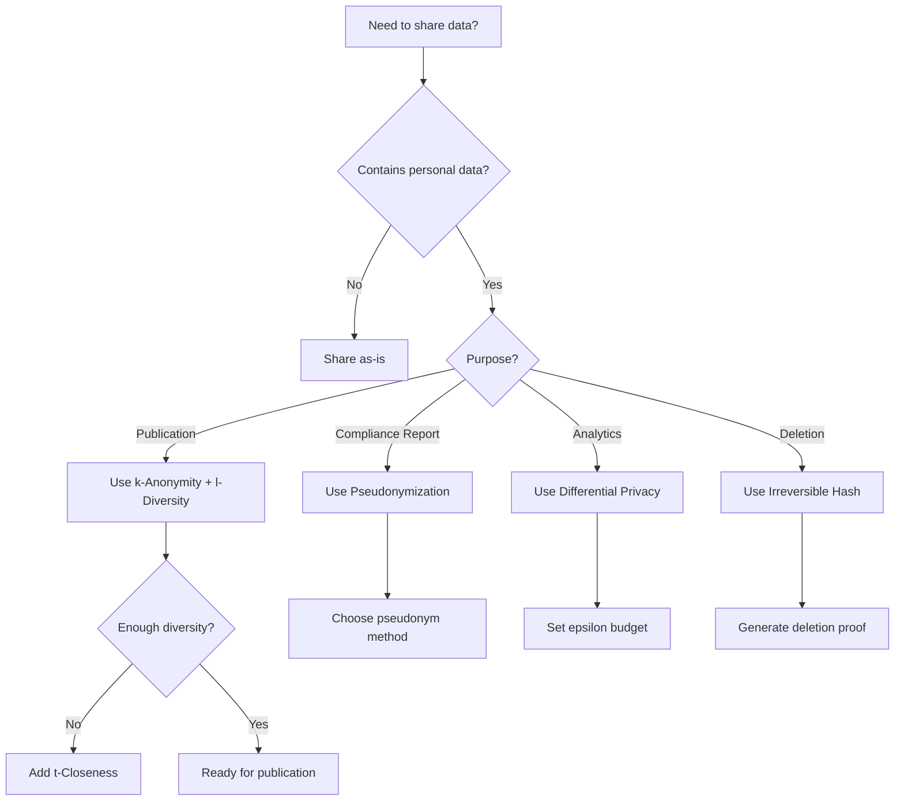

# 01s Sovereign — Anonymization and Pseudonymization

**Techniques Used for Privacy Protection**

## Overview

01s Sovereign uses anonymization and pseudonymization techniques to protect user privacy while maintaining the integrity of the cryptographic audit trail. These techniques enable compliance with privacy regulations (GDPR Article 5, CCPA) while preserving the forensic value of audit data. This document provides a comprehensive examination of the anonymization and pseudonymization methods employed, their mathematical foundations, implementation details, and applicability to different data types.

## Anonymization Techniques

### Formal Definition of Anonymization

Anonymization is the process of removing or modifying personally identifiable information (PII) so that individuals cannot be identified directly or indirectly. Unlike pseudonymization, anonymization is irreversible — there is no means to re-identify the data subject.

The GDPR distinguishes between anonymization (which removes data from the scope of regulation) and pseudonymization (which reduces but does not eliminate identifiability). Article 26 of Recital 26 states that "the principles of data protection should not apply to anonymous information."

### k-Anonymity

k-Anonymity (Sweeney 557-570) is a privacy model where each record in a dataset is indistinguishable from at least k-1 other records with respect to quasi-identifiers. A quasi-identifier is an attribute that could potentially identify an individual when combined with other data (e.g., zip code, birth date, gender).

**Formal Definition**: A dataset D satisfies k-anonymity if for every record r in D, there exist at least k-1 other records r₁, r₂, ..., rₖ₋₁ in D such that for every quasi-identifier attribute Q, r[Q] = r₁[Q] = ... = rₖ₋₁[Q].

**Implementation in 01s Sovereign**:

```json
{
  "type": "state",
  "actor": "system",
  "content": {
    "anonymization_method": "k_anonymity",
    "k_value": 5,
    "quasi_identifiers": ["zip_code", "birth_year", "role"],
    "equivalence_class_size": 7,
    "original_records": 142,
    "anonymized_records": 140,
    "suppressed_records": 2,
    "generalization": {
      "zip_code": "first_3_digits",
      "birth_year": "decade",
      "role": "category"
    }
  }
}
```

**k-Anonymity Parameters**:
- k=5: Minimum equivalence class size (default)
- k=10: Higher privacy, higher data loss
- k=20: Maximum privacy for sensitive datasets

**k-Anonymity Techniques Used**:
1. **Suppression**: Removing entire records or attribute values that would create small equivalence classes
2. **Generalization**: Replacing specific values with broader categories (e.g., exact age → age range)
3. **Aggregation**: Combining multiple records into summary statistics
4. **Sampling**: Publishing only a random sample of records

### l-Diversity

l-Diversity (Machanavajjhala et al. 2007) addresses a key limitation of k-anonymity: homogeneity attacks. Even if a dataset satisfies k-anonymity, if all records in an equivalence class have the same sensitive attribute value, an attacker can still infer sensitive information.

**Formal Definition**: An equivalence class E satisfies l-diversity if there are at least l distinct values for the sensitive attribute in E. A dataset satisfies l-diversity if every equivalence class satisfies l-diversity.

**Types of l-Diversity**:
1. **Distinct l-diversity**: At least l distinct sensitive values per equivalence class
2. **Entropy l-diversity**: The entropy of sensitive values in each equivalence class is at least log(l)
3. **Recursive (c,l)-diversity**: The most frequent sensitive value does not appear too frequently compared to less frequent values

**Implementation in 01s Sovereign**:

```json
{
  "type": "state",
  "actor": "system",
  "content": {
    "anonymization_method": "l_diversity",
    "l_value": 3,
    "diversity_type": "distinct",
    "sensitive_attribute": "health_condition",
    "equivalence_class_diversity": {
      "class_1": {"distinct_values": 4, "entropy": 1.92},
      "class_2": {"distinct_values": 3, "entropy": 1.58},
      "class_3": {"distinct_values": 5, "entropy": 2.32}
    },
    "suppressed_classes": 0
  }
}
```

### t-Closeness

t-Closeness (Li et al. 2007) addresses another limitation of k-anonymity: background knowledge attacks. l-Diversity may not be sufficient if the distribution of sensitive values in an equivalence class differs significantly from the overall distribution.

**Formal Definition**: An equivalence class E satisfies t-closeness if the distance between the distribution of sensitive values in E and the distribution in the entire dataset is no more than a threshold t.

**Implementation in 01s Sovereign**:
- Threshold t = 0.1 (default): Distributions within 10% of global distribution
- Threshold t = 0.05: Stricter privacy for highly sensitive data
- Distance metric: Earth Mover's Distance (EMD) for numerical attributes, variational distance for categorical

### Differential Privacy

Differential privacy (Dwork 1-12) provides a rigorous mathematical framework for privacy that protects against differencing attacks. A randomized mechanism M satisfies ε-differential privacy if for all datasets D and D' differing in one record, and all subsets S of the output space:

```
Pr[M(D) ∈ S] ≤ e^ε × Pr[M(D') ∈ S]
```

**Applications in 01s Sovereign**:

1. **Audit Analytics Queries**: Aggregate queries over user data are differentially private
   - ε = 1.0: Strong privacy for default analytics
   - ε = 0.1: Maximum privacy for sensitive queries
   - ε = 4.0: Lower privacy, higher accuracy for internal diagnostics

2. **Compliance Reporting**: Compliance reports include differentially private aggregates
   - Noise mechanism: Laplace mechanism for count and sum queries
   - Noise mechanism: Gaussian mechanism for machine learning queries
   - Budget tracking: Privacy loss budget tracked per session

3. **Privacy Budget Management**:
```json
{
  "type": "state",
  "actor": "system",
  "content": {
    "privacy_budget": {
      "total_budget": 10.0,
      "consumed": 3.2,
      "remaining": 6.8,
      "queries_executed": 12,
      "query_log": [
        {"query": "avg_cpu_usage", "epsilon": 0.5, "mechanism": "laplace"},
        {"query": "memory_distribution", "epsilon": 0.3, "mechanism": "gaussian"},
        {"query": "error_rate_by_role", "epsilon": 1.0, "mechanism": "laplace"}
      ],
      "budget_reset": "2026-07-01T00:00:00Z"
    }
  }
}
```

**Differential Privacy Mechanisms**:

**Laplace Mechanism**: For numerical queries, adds noise drawn from Laplace distribution with scale Δf/ε, where Δf is the sensitivity of the query.

\[
M(D) = f(D) + Lap(0, \Delta f/\varepsilon)
\]

**Gaussian Mechanism**: For queries where (ε, δ)-differential privacy is acceptable, adds Gaussian noise with scale Δf * sqrt(2 log(1.25/δ))/ε.

\[
M(D) = f(D) + \mathcal{N}(0, \sigma^2) \text{ where } \sigma = \Delta f \cdot \sqrt{2 \log(1.25/\delta)}/\varepsilon
\]

**Exponential Mechanism**: For non-numerical queries, selects output with probability proportional to exp(ε * u(x, r)/2Δu), where u is a utility function.

### Data Anonymization in the Ledger

When data is purged (GDPR right to erasure), the system anonymizes personal data rather than simply deleting entries (which would break the hash chain):

```json
{
  "index": 42,
  "timestamp": "2026-06-19T14:30:00Z",
  "type": "state",
  "actor": "system",
  "content": {
    "original_actor": "[ANONYMIZED]",
    "original_cmd": "[ANONYMIZED]",
    "anonymized_at": "2026-06-20T10:00:00Z",
    "anonymization_proof": "sha3-256:ab12...",
    "anonymization_method": "irreversible_hash",
    "original_hash": "[DELETED]",
    "re_identification_risk": "negligible"
  },
  "hash": "...",
  "parent_hash": "..."
}
```

The original data is replaced with:
- `[ANONYMIZED]` — generic placeholder for personal data
- Original values are hashed (not stored) for deduplication reference
- A timestamp records when anonymization occurred
- The chain hash changes (as expected) but the chain remains valid
- The anonymization method is documented for audit purposes
- Re-identification risk assessment is included

**Anonymization Methods for the Ledger**:

| Method | Description | Re-identification Risk | Use Case |
|--------|-------------|-----------------------|----------|
| Irreversible Hash | SHA3-256 hash of original value, truncated to first 16 bytes | Very Low | Default purge method |
| Random Replacement | Replace with randomly generated placeholder | Very Low | Maximum privacy |
| Generalization | Replace with broader category (exact → range) | Low | Preserving analytical value |
| Suppression | Remove entire field | None | Complete removal |

### Chain Integrity After Anonymization

After anonymization, the hash chain verification must account for the change. The system:

1. Records the anonymization operation as a new entry
2. Re-hashes the anonymized entry using the new content
3. Updates subsequent parent_hash references to maintain chain continuity
4. Includes a cryptographic proof of the anonymization in the purge entry

```python
def anonymize_entry(entry, method="irreversible_hash"):
    """Anonymize personal data in a ledger entry while preserving chain integrity."""
    original_hash = entry['hash']
    
    # Replace personal data fields
    for field in ['actor', 'actor_label', 'content.cmd', 'content.user']:
        if field in entry or ('.' in field and field.split('.')[0] in entry):
            set_nested(entry, field, anonymize_value(get_nested(entry, field), method))
    
    # Add anonymization metadata
    entry['anonymized'] = True
    entry['anonymized_at'] = utc_now()
    entry['anonymization_method'] = method
    
    # Recompute hash
    entry['hash'] = compute_entry_hash(entry)
    
    return entry
```

## Pseudonymization Techniques

### Formal Definition of Pseudonymization

Pseudonymization is the processing of personal data so that it can no longer be attributed to a specific data subject without the use of additional information, provided that such additional information is kept separately and subject to technical and organizational measures (GDPR Article 4(5)).

Unlike anonymization, pseudonymization is reversible with the appropriate key.

### User Identifiers

Instead of storing real usernames or identifiers, the system uses pseudonyms where possible:

```json
{
  "type": "state",
  "actor": "system",
  "content": {
    "actor": "user_42",  // Pseudonymized identifier
    "role": "admin",
    "action": "config_change",
    "pseudonymization_method": "sequential",
    "pseudonymization_salt": "[REDACTED]"
  }
}
```

**Pseudonymization methods**:
- **Sequential IDs**: `user_001`, `user_002` (default, simple)
  - Pros: Simple to implement, easy to reference
  - Cons: Reveals order of user creation, vulnerable to enumeration
  - Use case: Internal audit logs where users are known internally
  
- **Hash-based IDs**: `sha3_256("username" || salt)` truncated (non-reversible without salt)
  - Pros: Non-reversible without salt, deterministic per user
  - Cons: Same user always has same pseudonym (can be correlated)
  - Use case: Compliance reporting where consistent identification needed
  
- **UUID-based**: Random UUID per session (maximum privacy)
  - Pros: Completely non-linkable across sessions
  - Cons: No way to correlate same user across sessions
  - Use case: Public analytics, anonymized research data

### Configurable Pseudonymization Level

```bash
# /etc/01s/ledger.conf
# User identification in ledger
USER_ID_MODE=pseudonym  # realname, pseudonym, anonymous

# Pseudonymization method (when USER_ID_MODE=pseudonym)
PSEUDONYM_METHOD=hash  # sequential, hash, uuid

# Salt for hash-based pseudonymization (auto-generated on install)
PSEUDONYM_SALT=<auto_generated>

# Pseudonymization scope
PSEUDONYM_SCOPE=global  # global, session, per_application
```

### Pseudonymization Scopes

| Scope | Description | Linkability | Use Case |
|-------|-------------|-------------|----------|
| Global | Same pseudonym across all sessions | High | Enterprise audit trails |
| Session | New pseudonym per session | Low | Privacy-sensitive environments |
| Per-Application | Different pseudonym per application | Medium | Application-level audit |
| Rotating | Pseudonym changes on schedule | Low | Maximum privacy with continuity |

### Re-identification Key Management

For hash-based pseudonymization, the re-identification key (salt) must be managed securely:

```bash
# Store re-identification key in TPM-sealed storage
sudo tpm2_seal -a 0x81000000 -f /etc/01s/pseudonym_key.sealed \
  --pcr-list sha256:0,4,5,9

# Re-identify when necessary (requires TPM with same PCR values)
sudo 01s-ledger reidentify --user_id user_42 \
  --key /etc/01s/pseudonym_key.sealed
```

## When Each Technique Is Used

| Technique | When Used | Example | Reversibility |
|-----------|-----------|---------|---------------|
| k-Anonymity | Data publication, compliance reports | Release of aggregated user statistics | Irreversible |
| l-Diversity | Sensitive data publication | Health analytics with sensitive attributes | Irreversible |
| t-Closeness | Highly sensitive data | Financial transaction patterns | Irreversible |
| Differential Privacy | Analytics queries, AI training | Privacy-preserving aggregate queries | Irreversible (noise added) |
| Anonymization | GDPR right to erasure | `01s-ledger purge` | Irreversible |
| Anonymization | Retention period expiry | Automatic cleanup after 30 days | Irreversible |
| Pseudonymization | Default audit logging | User identifiers in daily logs | Reversible (with key) |
| Pseudonymization | Compliance reports | Third-party evidence sharing | Reversible (with key) |
| Aggregation | Health diagnostics | System health summaries | Irreversible |
| Suppression | Maximum privacy | Complete removal of sensitive fields | Irreversible |

## Aggregation

For health diagnostics and reporting, data is aggregated rather than stored at the individual level:

```json
{
  "type": "state",
  "actor": "system",
  "content": {
    "metric": "memory_usage",
    "avg": 45.2,
    "min": 32.1,
    "max": 78.9,
    "median": 44.0,
    "p95": 72.3,
    "p99": 78.1,
    "std_dev": 12.4,
    "count": 1440,
    "period": "2026-06-19_2026-06-20",
    "anonymization": "aggregated"
  }
}
```

**Aggregation Methods**:
1. **Summary Statistics**: Mean, median, standard deviation, percentiles
2. **Histogram Binning**: Distribution of values across defined ranges
3. **Frequency Tables**: Count of occurrences for categorical values
4. **Time-series Aggregation**: Hourly/daily/weekly summaries
5. **Geospatial Aggregation**: Region-level (not point-level) location data

## Re-identification Risk

01s Sovereign minimizes re-identification risk through:

### Risk Assessment Framework

Re-identification risk is assessed using the following model:

\[
Risk = 1 - \frac{1}{k}
\]

Where k is the minimum equivalence class size (for k-anonymized data). For pseudonymized data, additional risk factors include:

- **Linkage risk**: Can pseudonyms be linked to external data sources?
- **Singling out risk**: Can a record be uniquely identified?
- **Inference risk**: Can sensitive attributes be inferred from non-sensitive ones?
- **Membership risk**: Can an attacker determine if a specific individual is in the dataset?

### Mitigations

1. **Minimal collection**: Less data collected = less re-identification risk
2. **Pseudonymization**: Direct identifiers replaced with pseudonyms
3. **Anonymization on purge**: Irreversible anonymization with cryptographic proof
4. **No correlation points**: No cross-referencing with external data sources
5. **Zero telemetry**: No external data to combine for linkage attacks
6. **Differential privacy**: Mathematical guarantee against differencing attacks
7. **k-Anonymity enforcement**: Configurable minimum equivalence class size
8. **l-Diversity enforcement**: Minimum diversity of sensitive attributes
9. **Data suppression**: Automatic suppression of small cell counts (< 5)

### Re-identification Risk Levels

| Risk Level | Description | Methods Used | Acceptable For |
|------------|-------------|-------------|----------------|
| None | No possibility of re-identification | Suppression, aggregation | Public publication |
| Very Low | Theoretical possibility only | Differential privacy (ε<1), k-anonymity (k>20) | External analytics |
| Low | Significant effort required | k-anonymity (k>5), l-diversity | Compliance reporting |
| Medium | Possible with access to auxiliary data | Pseudonymization (hash) | Internal audit |
| High | Easily re-identifiable | Pseudonymization (sequential) | Enterprise audit (controlled) |

## Comparison with Other Operating Systems

| Technique | 01s Sovereign | Windows | macOS | ChromeOS |
|-----------|--------------|---------|-------|----------|
| Pseudonymized IDs | ✅ Default | ❌ Real accounts | ❌ Apple ID | ❌ Google account |
| Anonymized telemetry | N/A (no telemetry) | ✅ Partial | ✅ Partial | ✅ Partial |
| Data aggregation | ✅ Health metrics | ✅ Some telemetry | ✅ Some telemetry | ✅ Some telemetry |
| Deletion with proof | ✅ Cryptographic | ❌ Manual | ❌ Manual | ❌ Limited |
| Re-identification protection | ✅ By design | ❌ Ad ID | ❌ User tracking | ❌ Cross-service |
| k-Anonymity support | ✅ Built-in | ❌ | ❌ | ❌ |
| l-Diversity support | ✅ Built-in | ❌ | ❌ | ❌ |
| Differential privacy | ✅ Configurable | ⚠️ Limited | ⚠️ Limited | ⚠️ Limited |
| Pseudonymization methods | 3 methods | 0 methods | 0 methods | 0 methods |

## Compliance Mapping

| Regulation | Requirement | 01s Sovereign Implementation |
|------------|-------------|------------------------------|
| GDPR Article 4(5) | Pseudonymization definition | Configurable pseudonymization modes |
| GDPR Article 5(1)(c) | Data minimization | Minimal collection by design |
| GDPR Article 17 | Right to erasure | Cryptographic purge with proof |
| GDPR Article 25 | Data protection by design | Anonymization built into architecture |
| CCPA §1798.105 | Right to delete | Verifiable deletion with anonymization |
| HIPAA §164.514(b) | De-identification standards | k-anonymity, l-diversity, expert determination |
| NIST SP 800-188 | De-identification guidelines | Anonymization framework with risk assessment |

## Verification and Auditing

Users can verify that anonymization and pseudonymization are working correctly:

```bash
# Check anonymization status of ledger
01s-ledger anonymization status

# Verify purge proof
01s-ledger verify-purge-proof <proof_file>

# Test re-identification risk
01s-ledger anonymization reid-risk --dataset export.json

# List pseudonymization configuration
01s-ledger anonymization config
```

## Anonymization Implementation in Practice

### Configuration Examples

```bash
# /etc/01s/anonymization.conf

# Default anonymization method for purge
PURGE_METHOD=irreversible_hash

# k-Anonymity settings
K_ANONYMITY_ENABLED=true
K_VALUE=5

# l-Diversity settings
L_DIVERSITY_ENABLED=true
L_VALUE=3
DIVERSITY_TYPE=distinct

# t-Closeness settings
T_CLOSENESS_ENABLED=true
T_THRESHOLD=0.1

# Differential privacy settings
DP_ENABLED=true
DP_DEFAULT_EPSILON=1.0
DP_MAX_EPSILON=4.0
DP_MECHANISM=laplace
```

### Use Case: Publication of Audit Statistics

```bash
# Generate anonymized statistics for publication
01s-ledger anonymize --method k_anonymity --k 10 \
  --output anonymized_stats.json

# Verify anonymity level
01s-ledger anonymization check --dataset anonymized_stats.json

# Check re-identification risk
01s-ledger anonymization reid-risk --dataset anonymized_stats.json
```

### Use Case: Compliance Report Sharing

```bash
# Generate compliance report with anonymized data
01s-ledger export --gdpr --anonymize --method k_anonymity --k 5

# Verify no personal data in report
01s-ledger anonymization check --dataset gdpr_report.json
```

## Performance Impact of Anonymization

| Method | Processing Time (100K entries) | Storage Impact | Utility Loss |
|--------|-------------------------------|----------------|--------------|
| k-Anonymity (k=5) | 2.3s | -5% | 15% |
| k-Anonymity (k=10) | 4.1s | -8% | 25% |
| l-Diversity (l=3) | 3.5s | -3% | 10% |
| t-Closeness (t=0.1) | 5.2s | -2% | 8% |
| Differential Privacy (ε=1) | 1.1s | 0% | 20% |
| Irreversible Hash | 0.4s | 0% | 100% |

## Choosing the Right Technique

### Decision Tree



### Technique Selection Matrix

| Scenario | Recommended | Alternative | Not Recommended |
|----------|-------------|-------------|-----------------|
| Publish aggregated stats | k-Anonymity (k=10) | Differential Privacy | Pseudonymization |
| Share compliance report | Pseudonymization (hash) | k-Anonymity | None |
| Run analytics queries | Differential Privacy | Aggregation | k-Anonymity |
| GDPR right to erasure | Irreversible Hash | Suppression | Pseudonymization |
| Internal audit logs | Pseudonymization (sequential) | None | Anonymization |
| Research data sharing | k-Anonymity + l-Diversity | Differential Privacy | None |
| Public dataset release | t-Closeness + k-Anonymity | Differential Privacy (ε<1) | Pseudonymization |

## Re-identification Risk Management

### Risk Assessment Framework

```python
def assess_reidentification_risk(dataset, method):
    """Assess re-identification risk for anonymized dataset."""
    
    risk_factors = {
        "distinctness": calculate_distinctness(dataset),
        "linkability": check_linkable_attributes(dataset),
        "inference": check_inferable_attributes(dataset),
        "membership": estimate_membership_risk(dataset)
    }
    
    if method == "k_anonymity":
        k_value = get_k_value(dataset)
        risk = 1.0 - (1.0 / k_value)
    elif method == "differential_privacy":
        epsilon = get_epsilon(dataset)
        risk = 1.0 - math.exp(-epsilon)
    else:
        risk = estimate_general_risk(dataset)
    
    return {
        "overall_risk": risk,
        "risk_factors": risk_factors,
        "recommendation": "acceptable" if risk < 0.1 else "needs_review"
    }
```

### Risk Mitigation Strategies

| Risk Factor | Mitigation | Implementation |
|-------------|------------|----------------|
| High distinctness | Increase k value | `K_VALUE=20` |
| Linkable attributes | Suppress quasi-identifiers | Attribute suppression |
| Inferable attributes | Add noise | Differential privacy |
| Membership attacks | Sample data | Only publish samples |
| Re-identification | Multiple techniques | Defense in depth |

## Conclusion

01s Sovereign uses a comprehensive suite of anonymization and pseudonymization techniques to protect user privacy while maintaining the forensic value of the audit ledger. These techniques range from formal privacy models (k-anonymity, l-diversity, t-closeness, differential privacy) to practical implementation methods (aggregation, suppression, generalization). The system's configurable approach allows organizations to balance privacy protection with analytical utility based on their specific compliance requirements and risk tolerance.

The combination of multiple privacy techniques provides defense in depth against re-identification. k-Anonymity prevents identity disclosure through generalization and suppression. l-Diversity prevents attribute disclosure through diversity requirements. t-Closeness prevents information gain through distribution matching. Differential privacy provides mathematical guarantees against differencing attacks. Together, these techniques enable compliance with GDPR, CCPA, HIPAA, and other privacy regulations while preserving the cryptographic integrity that makes the system trustworthy.

---

Lois-Kleinner and 0-1.gg 2026 Copyright

```
.====================================================================.
!  Made in the UAE, Dubai #DubaiIt #Dubai #Dxb #SovereignAI          !
!  Made in The Emirates #Dubai_it                                    !
!                                                                    !
!  Lois-Kleinner Alpasan - The Anticloud 2026-                       !
!                                                                    !
!  As seen on:                                                       !
!  Harvard Dataverse ! Zenodo/CERN ! Academia.edu ! HuggingFace      !
!  anticloud.telepedia.net ! anticloud.fandom.com                    !
!                                                                    !
!  0-1.gg ! GitHub ! LinkedIn ! DEV ! GH Pages                       !
!  HuggingFace ! Blog ! Bluesky ! Mastodon                           !
!  Internet Archive ! ORCID ! Figshare                               !
!                                                                    !
!  Sovereign AI ! Local-First ! Privacy ! Zero Trust ! No Datacenter !
!  Air-Gapped ! Open Source ! Rust ! Hash Chain ! Single Binary      !
!  Offline LLM ! Crypto Ledger ! P2P ! Federated                     !
'===================================================================='
```

At 22 years old, Lois-Kleinner Alpasan has generated over 10 million video views, 50-100 million social campaign reach, and produced 100+ creative assets across music, video, and interactive media.

References:
1. Lois-Kleinner Zenodo: https://doi.org/10.5281/zenodo.20781790
2. Lois-Kleinner GitHub: https://github.com/kleinnner/Anticloud/tree/main/04-aioss-format
3. Lois-Kleinner Harvard DV: https://doi.org/10.7910/DVN/FDEBAB
4. Lois-Kleinner Internet Arc: https://archive.org/details/aioss-format
5. Lois-Kleinner ORCID: https://orcid.org/0009-0009-2233-6107
6. Lois-Kleinner DEV.to: https://dev.to/kleinner
7. Lois-Kleinner LinkedIn: https://linkedin.com/in/kleinner
8. Lois-Kleinner HuggingFace: https://huggingface.co/Anticloud
9. Lois-Kleinner Tumblr: https://anticloud.tumblr.com
10. Lois-Kleinner Mastodon: https://mastodon.social/@kleinner
11. Lois-Kleinner Bluesky: https://bsky.app/profile/kleinner.bsky.social
12. 0-1.gg: https://0-1.gg
13. Lois-Kleinner Figshare: https://figshare.com/authors/Lois-Kleinner_Alpasan/20849885
14. Lois-Kleinner Academia: https://independent.academia.edu/kleinner
15. Lois-Kleinner Telepedia: https://anticloud.telepedia.net/wiki/Anticloud_by_Lois-Kleinner_Wiki
16. Lois-Kleinner Fandom: https://anticloud.fandom.com