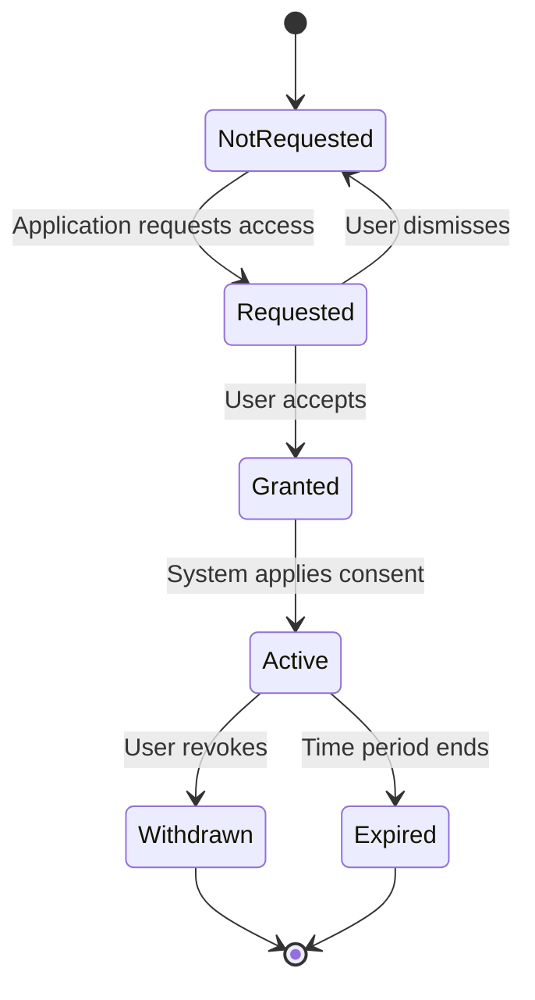
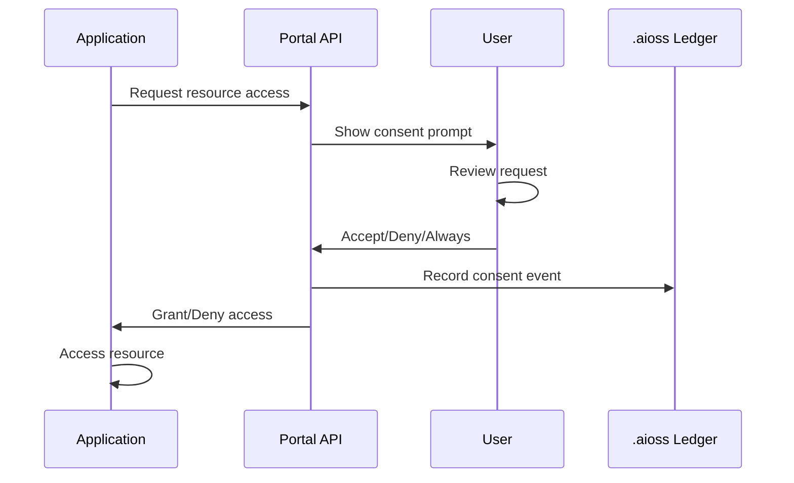

# 01s Sovereign — Consent Management

**Consent Mechanisms and User Interface**

## Overview

01s Sovereign implements consent management to ensure users have control over data collection and processing. The system follows the principles of GDPR Article 7 (Conditions for Consent) and ePrivacy Directive requirements for explicit, informed, and freely given consent. This document provides comprehensive documentation of consent mechanisms, lifecycle, interface, and compliance mapping.

## Consent Framework

### Types of Consent

| Consent Type | Description | Required For | Legal Basis |
|-------------|-------------|--------------|-------------|
| System consent | Consent for OS-required data collection | Audit logging, system operation | Legitimate interest + consent |
| Enhanced consent | Consent for optional features | Extended logging, diagnostics | Explicit consent |
| Application consent | Consent for app-specific data access | Camera, microphone, files, location | Explicit consent |
| Compliance consent | Consent for compliance-related processing | Regulatory audit support | Legal obligation |

### Consent Principles

01s Sovereign implements the six GDPR Article 7 consent requirements:

| Principle | Implementation | Verification |
|-----------|---------------|--------------|
| Freely given | No penalty for refusing optional features | Consent audit trail |
| Specific | Separate consent for each data category | Per-category records |
| Informed | Clear explanation before consent is collected | Consent screen text |
| Unambiguous | Explicit opt-in (never opt-out) | Positive action required |
| Withdrawable | Simple withdrawal, recorded in ledger | One-click revocation |
| Demonstrable | All consents cryptographically logged | Ledger export |

### Consent vs Legitimate Interest

01s Sovereign distinguishes between:
- **Required processing** (legitimate interest): System audit logging essential for security
- **Optional processing** (consent): Extended diagnostics, shell command logging, file access logging

Users cannot opt out of required system audit logging (it is fundamental to the OS architecture), but can opt out of all optional features.

## Consent Lifecycle

### Lifecycle States

```
NotRequested → Requested → Granted → Active → Withdrawn
                                        ↓
                                    Expired
```

### Detailed State Machine



### State Transitions

| Transition | Trigger | Ledger Event | User Notification |
|------------|---------|--------------|-------------------|
| → NotRequested | Initial state | N/A | N/A |
| NotRequested → Requested | Application request | `consent.requested` | Prompt shown |
| Requested → Granted | User clicks Accept | `consent.granted` | Confirmation |
| Granted → Active | System applies | `consent.active` | Status indicator |
| Active → Withdrawn | User revokes | `consent.withdrawn` | Confirmation |
| Active → Expired | Time passes | `consent.expired` | Prompt to renew |
| Active → Updated | Consent version changes | `consent.updated` | Re-consent prompt |

## Consent During Installation

### Installation Consent Screen

During the 01s Sovereign installation process, users are presented with a clear consent screen:

```
┌─────────────────────────────────────────────────────┐
│         01s Sovereign Privacy Settings               │
├─────────────────────────────────────────────────────┤
│                                                        │
│  Required for Operation                                │
│  ┌─────────────────────────────────────────────────┐  │
│  │ ✓ System Audit Logging (required)               │  │
│  │   Purpose: Record system events for security     │  │
│  │   and operational integrity.                     │  │
│  │   Data: Boot events, service status, uptime      │  │
│  └─────────────────────────────────────────────────┘  │
│                                                        │
│  Recommended                                           │
│  ┌─────────────────────────────────────────────────┐  │
│  │ ✓ Health Diagnostics                             │  │
│  │   Purpose: Monitor system health and detect      │  │
│  │   hardware issues before they cause problems.    │  │
│  │   Data: CPU temp, disk SMART, memory usage       │  │
│  └─────────────────────────────────────────────────┘  │
│                                                        │
│  Optional                                              │
│  ┌─────────────────────────────────────────────────┐  │
│  │ ☐ Shell Command Logging                         │  │
│  │   Purpose: Enhanced security audit trail.       │  │
│  │   Data: Commands you type in terminal            │  │
│  │   [Learn more about what this means]             │  │
│  └─────────────────────────────────────────────────┘  │
│                                                        │
│  [Accept All]  [Accept Required]  [Customize]        │
└─────────────────────────────────────────────────────┘
```

### Consent Recording

Each consent choice is recorded in the ledger:

```json
{
  "event_type": "consent",
  "consent_id": "consent_install_001",
  "consent_version": "1.2",
  "scope": "system_audit_logging",
  "level": "required",
  "status": "granted",
  "granted_at": "2026-06-14T08:00:00Z",
  "installation_id": "install_20260614_xyz789",
  "method": "installation_wizard"
}
```

## Runtime Consent

### Application Consent Flow

When applications request data access:



### Consent Prompt Examples

**Filesystem Access**
```
┌─────────────────────────────────────────┐
│ "Photo Editor" wants to access your     │
│ Pictures folder.                        │
│                                         │
│ Permission: Read and Write              │
│ Purpose: Open and save photos           │
│                                         │
│ [Deny]  [Allow Once]  [Allow Always]    │
└─────────────────────────────────────────┘
```

**Camera Access**
```
┌─────────────────────────────────────────┐
│ "Video Chat" wants to use your camera.  │
│                                         │
│ Camera: Integrated Webcam               │
│                                         │
│ [Deny]  [Allow Once]  [Allow Always]    │
└─────────────────────────────────────────┘
```

**Network Access**
```
┌─────────────────────────────────────────┐
│ "Game" wants network access.            │
│                                         │
│ Destination: game-server.example.com    │
│ Port: 443 (HTTPS)                       │
│                                         │
│ [Block]  [Allow]  [Allow Always]        │
└─────────────────────────────────────────┘
```

### Consent Management Systems

Consent is managed by:

| System | Scope | Mechanism |
|--------|-------|-----------|
| Flatpak permissions | Application access | Portal API |
| AppArmor profiles | System resource access | Profile configuration |
| Firewall rules | Network access | `iptables`/`nftables` |
| Portal APIs | Device access (camera, mic) | DBus portal interface |

## Consent Records in the Ledger

All consent events are cryptographically recorded:

| Field | Description | Format |
|-------|-------------|--------|
| `event_type` | Type of event | `consent` |
| `consent_id` | Unique identifier | UUID |
| `scope` | What the consent covers | String |
| `level` | Requirement level | `required`, `recommended`, `optional` |
| `status` | Current consent status | `granted`, `active`, `withdrawn`, `expired` |
| `timestamp` | When the event occurred | ISO 8601 |
| `method` | How consent was obtained | String |
| `consent_version` | Version of consent terms | Semver |
| `actor` | Who granted/revoked | User identifier |

### Consent Record Example

```json
{
  "index": 42,
  "timestamp": "2026-06-19T14:30:00Z",
  "type": "state",
  "actor": "user_42",
  "content": {
    "action": "consent_grant",
    "consent_id": "consent_app_42_fs",
    "scope": "filesystem_access",
    "level": "application",
    "application": "Photo Editor",
    "resource": "/home/user/Pictures/",
    "access_type": "read_write",
    "purpose": "Open and save photos",
    "granted_until": "2027-06-19T14:30:00Z",
    "method": "portal_api_prompt"
  },
  "hash": "sha3-256:a1b2c3d4...",
  "parent_hash": "sha3-256:9f8e7d6c..."
}
```

## Consent Management Interface

### CLI Interface

```bash
# View all consent status
01s-ledger consent status

# Grant consent
01s-ledger consent grant --scope shell_command_logging

# Revoke consent
01s-ledger consent revoke --consent-id consent_install_003

# View consent history
01s-ledger consent history --scope filesystem_access

# Export consent records for compliance
01s-ledger export --gdpr --consent
01s-ledger export --gdpr --consent --period 2026-01-01:2026-06-30
```

### GUI Consent Manager

```
┌─────────────────────────────────────────────────────┐
│ Privacy Settings > Consent Manager                   │
├─────────────────────────────────────────────────────┤
│                                                        │
│ System Consents                                        │
│ ┌─────────────────────────────────────────────────┐  │
│ │ System Audit Logging              ✅ Active     │  │
│ │ Required for operation                          │  │
│ │ Granted: 2026-06-14                             │  │
│ ├─────────────────────────────────────────────────┤  │
│ │ Health Diagnostics                ✅ Active     │  │
│ │ Recommended                                    │  │
│ │ Granted: 2026-06-14              [Revoke]      │  │
│ ├─────────────────────────────────────────────────┤  │
│ │ Shell Command Logging            ✅ Active     │  │
│ │ Optional                                       │  │
│ │ Granted: 2026-06-14              [Revoke]      │  │
│ └─────────────────────────────────────────────────┘  │
│                                                        │
│ Application Consents                                   │
│ ┌─────────────────────────────────────────────────┐  │
│ │ Photo Editor - File Access        ✅ Active     │  │
│ │ /home/user/Pictures/ Read/Write                 │  │
│ │ Granted: 2026-06-19              [Revoke]      │  │
│ └─────────────────────────────────────────────────┘  │
│                                                        │
│ [Export Consent Records]                               │
└─────────────────────────────────────────────────────┘
```

## Consent Withdrawal

### Withdrawal Process

When a user withdraws consent:

1. **Immediate Effect**: Future data collection of that type stops immediately
2. **Data Retention**: Previously collected data is retained (tamper-evident requirement)
3. **Ledger Recording**: The withdrawal event is recorded in the ledger
4. **User Notification**: Confirmation of withdrawal is shown
5. **Separate Purge**: Users can purge previously collected data separately

```bash
# Revoke consent
01s-ledger consent revoke --consent-id consent_install_003
# Output: Consent "shell_command_logging" revoked
# Future shell commands will not be logged.
# Previously collected shell command data remains (for chain integrity).
# To delete prior data: 01s-ledger purge --type cmd

# Verify revocation
01s-ledger consent status
# Shell Command Logging: ❌ Withdrawn
```

### Withdrawal Effects

| Consent Type | Effect of Withdrawal | Data Impact |
|-------------|---------------------|-------------|
| Shell command logging | No new commands logged | Existing data retained |
| Health diagnostics | Diagnostics stop | Existing data retained |
| File access logging | No new file events logged | Existing data retained |
| Extended diagnostics | Extended data stops | Existing data retained |
| Application consent | App loses access | Existing data retained |

## Audit Trail for Consent

### Complete Consent History

```bash
# View complete consent history
01s-ledger consent history --all

# Sample output:
# Timestamp               Event        Scope                Status
# 2026-06-14T08:00:00Z    granted      system_audit         active
# 2026-06-14T08:00:01Z    granted      health_diag          active
# 2026-06-14T08:00:02Z    granted      shell_cmd            active
# 2026-06-18T10:30:00Z    revoked      shell_cmd            withdrawn
# 2026-06-19T14:30:00Z    granted      app_fs_access        active

# Export for compliance
01s-ledger export --gdpr --consent --format json
```

### Consent Verification

```bash
# Verify consent record integrity
01s-ledger verify

# Check specific consent
01s-ledger consent status --consent-id consent_install_003
# Output includes cryptographic proof of consent state
```

## Compliance Mapping

| Requirement | GDPR Article | ePrivacy Directive | Implementation |
|-------------|-------------|-------------------|----------------|
| Freely given | Art 7(4) | Art 5(1) | No penalties for refusal |
| Specific | Art 7(2) | Art 5(2) | Separate consent per scope |
| Informed | Art 7(2) | Art 5(2) | Clear explanation before consent |
| Unambiguous | Art 7(1) | Art 5(1) | Explicit opt-in (not opt-out) |
| Withdrawable | Art 7(3) | Art 5(3) | Easy withdrawal, recorded |
| Demonstrable | Art 7(1) | Art 5(1) | All consents logged in ledger |
| Granular | Recital 32 | Art 5(2) | Per-category consent |
| Active consent | Art 7(1) | Art 5(1) | No pre-ticked boxes |
| Consent records | Art 7(1) | Art 5(1) | Cryptographic proof |
| Withdrawal mechanism | Art 7(3) | Art 5(3) | One-click revocation |

## Consent Management Best Practices

### User Experience Guidelines

1. **Clear language**: Explain data collection in plain terms
2. **No dark patterns**: Honest consent prompts with easy opt-out
3. **Granularity**: Separate consent for separate purposes
4. **Revocability**: Easy to withdraw consent (as easy as granting)
5. **Record keeping**: All consent events logged cryptographically
6. **Renewal**: Periodic re-consent for long-standing permissions
7. **Default privacy**: Opt-in by default, never opt-out

## Consent Management Best Practices

### Implementation Recommendations

| Practice | Recommendation | Rationale |
|----------|---------------|-----------|
| Consent granularity | Separate consent per data category | GDPR Article 7 specificity |
| Default settings | Required only, all optional off | Privacy by default |
| Consent language | Plain language, no legalese | Informed consent |
| Withdrawal mechanism | One-click, same as granting | Equal ease |
| Record keeping | All consent events in ledger | Demonstrable consent |
| Renewal period | Annual re-consent for optional | Ongoing freshness |
| Age verification | Configurable for minors | Age-appropriate consent |

### Consent Refresh Schedule

| Consent Type | Refresh Interval | Trigger |
|-------------|-----------------|---------|
| Required (system) | Never | N/A |
| Recommended (health) | Annual | Update prompt |
| Optional (shell) | Annual | Update prompt |
| Application grants | Per application | On permission change |
| Consent version change | Immediate | On policy update |

## Consent Audit Trail

### Complete Consent History

```bash
# View full consent history
01s-ledger consent history --all --format json

# Filter by scope
01s-ledger consent history --scope filesystem_access

# Filter by date range
01s-ledger consent history --since 2026-01-01 --until 2026-06-30

# Export for compliance
01s-ledger export --gdpr --consent --period 2026-01-01:2026-06-30
```

### Consent Integrity Verification

```bash
# Verify consent records are untampered
01s-ledger verify

# Verify specific consent
01s-ledger consent verify --consent-id consent_20260614_abc123

# Output:
# Consent ID: consent_20260614_abc123
# Current status: active
# Status history:
#   2026-06-14T08:00:00Z - granted
#   2026-06-18T10:30:00Z - revoked
#   2026-06-19T09:00:00Z - granted
# Chain integrity: PASS
```

## Consent Across Jurisdictions

| Requirement | GDPR | CCPA/CPRA | LGPD | PIPEDA | 01s Implementation |
|-------------|------|-----------|------|--------|-------------------|
| Freely given | ✅ | ✅ | ✅ | ✅ | No penalty for refusal |
| Specific | ✅ | ✅ | ✅ | ✅ | Per-category consent |
| Informed | ✅ | ✅ | ✅ | ✅ | Clear explanations |
| Unambiguous | ✅ | ✅ | ✅ | ✅ | Explicit opt-in |
| Withdrawable | ✅ | ✅ | ✅ | ✅ | Easy revocation |
| Demonstrable | ✅ | ✅ | ✅ | ✅ | Cryptographic records |
| Age of consent | 16 | 16 | 13 | N/A | Configurable threshold |
| Renewal | Not specified | Not specified | Not specified | Not specified | Annual recommended |

## Consent UI/UX Design

### Mobile-Responsive Consent

```html
<!-- Responsive consent prompt -->
<div class="consent-prompt" role="dialog">
  <div class="consent-header">
    <h2>Shell Command Logging</h2>
  </div>
  <div class="consent-body">
    <p>Record commands typed in the terminal for security auditing.</p>
    <div class="consent-details">
      <h3>Data collected:</h3>
      <ul>
        <li>Command text</li>
        <li>Timestamp</li>
        <li>Working directory</li>
      </ul>
      <h3>Purpose:</h3>
      <p>Security incident investigation and audit trail</p>
      <h3>Retention:</h3>
      <p>30 days (configurable)</p>
    </div>
  </div>
  <div class="consent-actions">
    <button class="btn-secondary">Decline</button>
    <button class="btn-primary">Enable</button>
  </div>
</div>
```

### Consent Confirmation

After granting or revoking consent, users see a confirmation:

```
┌─────────────────────────────────────┐
│ ✅ Shell command logging enabled    │
│                                     │
│ Future terminal commands will be    │
│ recorded for security auditing.     │
│                                     │
│ You can change this anytime in      │
│ Privacy Settings.                   │
│                                     │
│ [OK]                                │
└─────────────────────────────────────┘
```

## Conclusion

01s Sovereign's consent management provides users with clear, granular control over data collection. Consent is obtained explicitly during installation, recorded cryptographically in the ledger, and easily withdrawn at any time. The system's architecture ensures that consent choices are respected and documented — providing both privacy for users and compliance evidence for organizations. For GDPR compliance specifically, the consent management system addresses all requirements of Article 7 with cryptographic proof that consent was freely given, specific, informed, unambiguous, and withdrawable.

---

Lois-Kleinner and 0-1.gg 2026 Copyright

```
.====================================================================.
!  Made in the UAE, Dubai #DubaiIt #Dubai #Dxb #SovereignAI          !
!  Made in The Emirates #Dubai_it                                    !
!                                                                    !
!  Lois-Kleinner Alpasan - The Anticloud 2026-                       !
!                                                                    !
!  0-1.gg ! GitHub ! LinkedIn ! DEV ! GH Pages                       !
!  HuggingFace ! Blog ! Tumblr ! Fandom ! Bluesky ! Mastodon          !
!  Zenodo ! Harvard Dataverse ! Internet Archive ! ORCID              !
!                                                                    !
!  Sovereign AI ! Local-First ! Privacy ! Zero Trust ! No Datacenter !
!  Air-Gapped ! Open Source ! Rust ! Hash Chain ! Single Binary      !
!  Offline LLM ! Crypto Ledger ! P2P ! Federated                     !
'===================================================================='
```

Lois-Kleinner Alpasan, 22, builds sovereign AI infrastructure and cryptographic audit systems. His work spans formats, proptech, and research platforms serving projects valued at over $1B combined, operating at the intersection of AI, media, and decentralized technology.

References:
1. Lois-Kleinner Zenodo: https://doi.org/10.5281/zenodo.20781790
2. Lois-Kleinner GitHub: https://github.com/kleinnner/Anticloud/tree/main/04-aioss-format
3. Lois-Kleinner Harvard DV: https://doi.org/10.7910/DVN/FSHFZF
4. Lois-Kleinner Internet Arc: https://archive.org/details/aioss-format
5. Lois-Kleinner ORCID: https://orcid.org/0009-0009-2233-6107
6. Lois-Kleinner DEV.to: https://dev.to/kleinner
7. Lois-Kleinner LinkedIn: https://linkedin.com/in/kleinner
8. Lois-Kleinner HuggingFace: https://huggingface.co/Anticloud
9. Lois-Kleinner Tumblr: https://anticloud.tumblr.com
10. Lois-Kleinner Mastodon: https://mastodon.social/@kleinner
11. Lois-Kleinner Bluesky: https://bsky.app/profile/kleinner.bsky.social
12. 0-1.gg: https://0-1.gg
