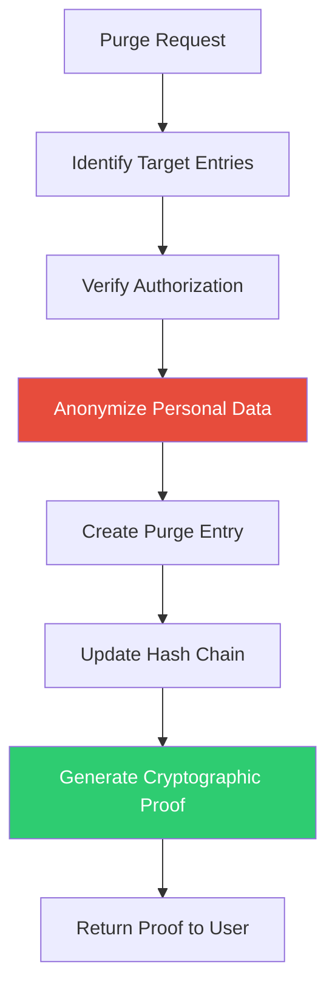
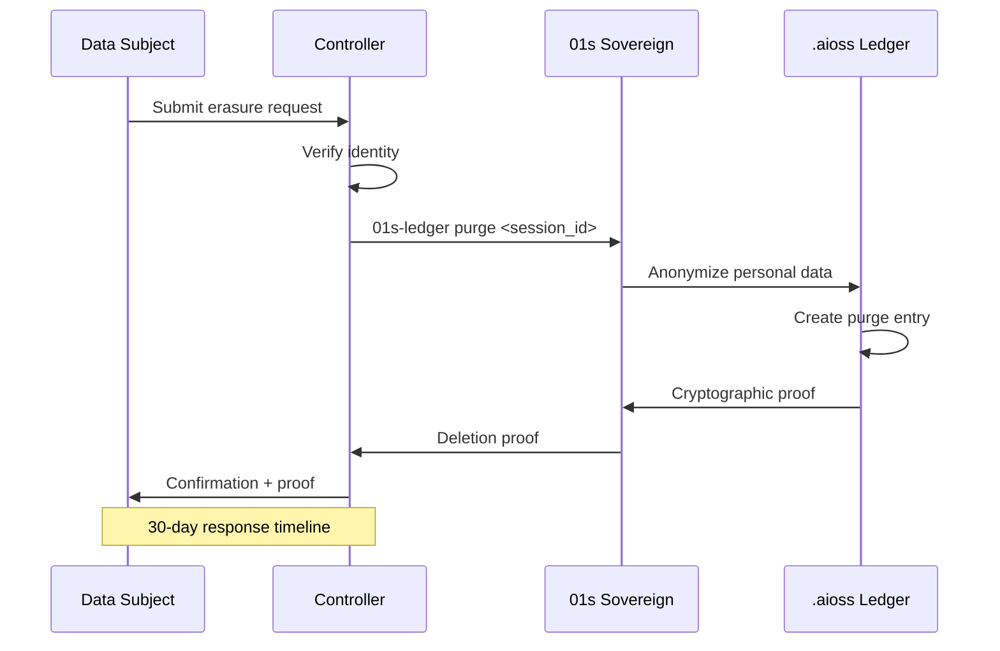
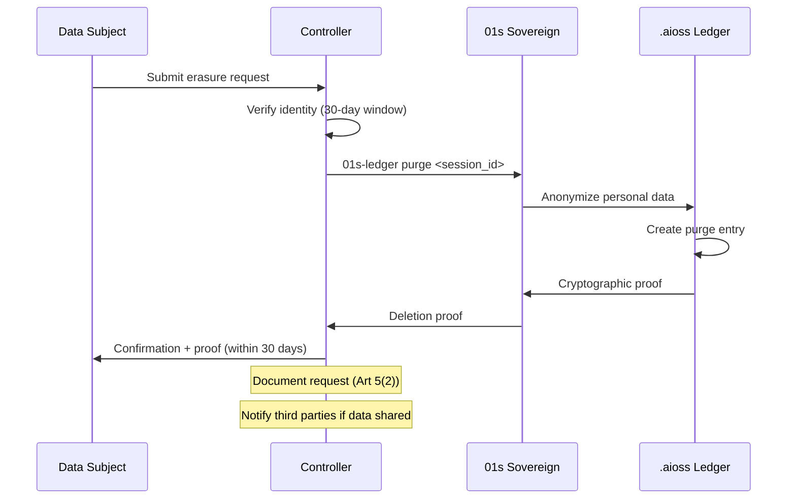
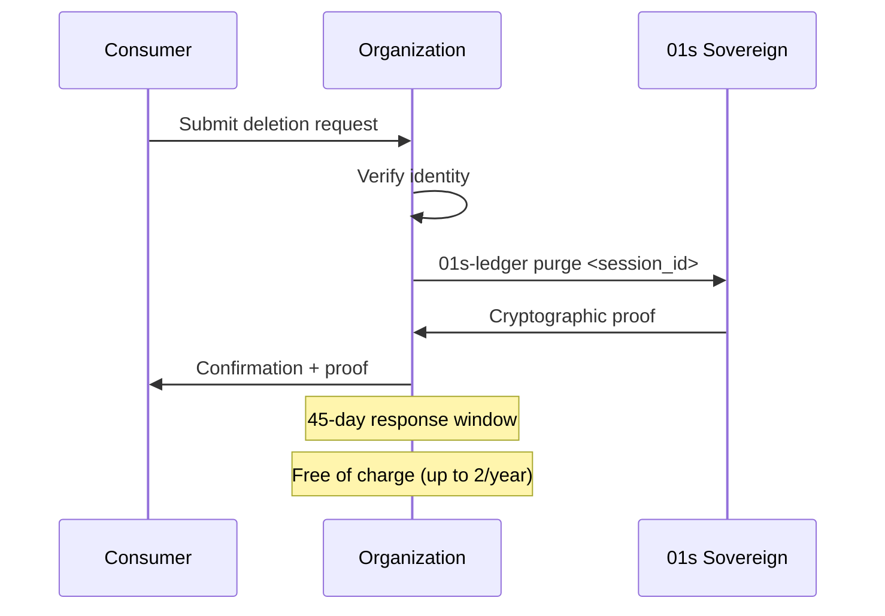

# 01s Sovereign — Data Retention and Deletion

**Retention Policies, Deletion Procedures, and Cryptographic Proof**

## Overview

01s Sovereign implements configurable data retention and cryptographically verifiable data deletion. These capabilities support compliance with privacy regulations (GDPR, CCPA) while maintaining the integrity of the audit trail. This document provides comprehensive documentation of retention policies, deletion procedures, cryptographic proofs, and industry-specific configurations.

## Retention Policies

### Default Retention Periods

| Data Type | Default | Regulatory Minimum | Maximum Recommended | Legal Basis |
|-----------|---------|-------------------|-------------------|-------------|
| System events | 30 days | 6 months (GDPR) | 7 years (HIPAA) | Storage limitation |
| State snapshots | 30 days | 6 months | 7 years | Storage limitation |
| Shell commands | 30 days | 6 months | 7 years | Storage limitation |
| Health diagnostics | 30 days | 6 months | 7 years | Storage limitation |
| Network logs | 30 days | 6 months | 7 years | Storage limitation |
| Consent records | Permanent | Duration of processing | Permanent | Legal requirement |
| Purge proofs | Permanent | Evidence of deletion | Permanent | Legal requirement |
| Configuration | Until changed | N/A | N/A | Operational |

### Configuring Retention

Configuration is managed through `/etc/01s/ledger.conf`:

```bash
# /etc/01s/ledger.conf - Retention Configuration

# Global retention period (days)
RETENTION_DAYS=30

# Per-category retention overrides (optional)
RETENTION_SYSTEM_EVENTS=30
RETENTION_STATE_SNAPSHOTS=30
RETENTION_SHELL_COMMANDS=30
RETENTION_HEALTH_DIAGNOSTICS=30
RETENTION_NETWORK_LOGS=30
RETENTION_CONSENT_RECORDS=-1  # -1 = permanent
RETENTION_PURGE_PROOFS=-1     # -1 = permanent

# Retention enforcement mode
RETENTION_ENFORCEMENT=auto    # auto, manual
```

### Retention by Regulation

| Regulation | Requirement | 01s Configuration |
|------------|-------------|-------------------|
| GDPR | No longer than necessary | `RETENTION_DAYS=730` (2 years) |
| HIPAA | 6 years minimum | `RETENTION_DAYS=2190` |
| SOX | 7 years | `RETENTION_DAYS=2555` |
| PCI DSS | 12 months | `RETENTION_DAYS=395` |
| FERPA | Duration of enrollment | Configurable |
| GLBA | 5 years | `RETENTION_DAYS=1825` |
| Default | 30 days | `RETENTION_DAYS=30` |

### Retention Enforcement

**Automatic mode** (default):
- System periodically checks entry timestamps
- Entries exceeding retention period are flagged for anonymization
- Anonymization preserves chain integrity
- Configurable schedule (weekly default)

**Manual mode**:
- User explicitly triggers retention enforcement
- `01s-ledger enforce-retention`

```bash
# Enforce retention manually
01s-ledger enforce-retention
# Output: Anonymized 1,234 entries exceeding 30-day retention
# New head hash: sha3-256:9f8e7d6c...

# Check retention status
01s-ledger retention status
# Output:
# Retention period: 30 days
# Entries within retention: 1,442
# Entries exceeding retention: 0
# Next enforcement: 2026-06-26 (cron)
```

## Deletion Procedures

### The Purge Process



### Purge Commands

```bash
# Purge specific session
01s-ledger purge <session_id>

# Purge data older than specified days
01s-ledger purge --older-than 365

# Purge specific entry types
01s-ledger purge --type cmd
01s-ledger purge --type state

# Purge specific user data
01s-ledger purge --user <user_id>

# Purge all data
01s-ledger purge --all

# Test purge (dry run)
01s-ledger purge --test
```

### What Purge Does

1. **Anonymizes personal data**: Replaces personal data with `[ANONYMIZED]` markers
2. **Preserves chain integrity**: Entries are re-hashed after anonymization
3. **Records action**: Creates a permanent "purge" entry documenting the action
4. **Updates hashes**: All subsequent entries maintain valid parent_hash links
5. **Generates proof**: Outputs cryptographic proof of deletion for compliance

### What Purge Does NOT Do

| Misconception | Reality |
|--------------|---------|
| Delete entries entirely | Would break the hash chain — entries are anonymized, not removed |
| Delete entries before the deleted data | Earlier entries are unaffected |
| Remove audit capability | Audit trail is preserved (without personal data) |
| Affect operational data | Only audit data is affected, not user files |
| Work retroactively on already-purged data | Each purge is independent |

### Detailed Purge Algorithm

```python
def purge_entries(ledger, target_entries):
    """Anonymize personal data in target entries while preserving chain integrity."""
    
    purge_record = {
        "type": "purge",
        "timestamp": utc_now(),
        "entries_count": len(target_entries),
        "purge_method": "anonymization",
        "original_head": ledger.head_hash()
    }
    
    for entry in target_entries:
        # Anonymize personal data fields
        for field in ['actor', 'actor_label', 'content.cmd', 'content.user']:
            if has_field(entry, field):
                entry[field] = anonymize_value(get_field(entry, field))
        
        # Add anonymization metadata
        entry['anonymized'] = True
        entry['anonymized_at'] = utc_now()
        entry['anonymization_method'] = 'irreversible_hash'
        
        # Recompute hash
        entry['hash'] = sha3_256(canonical_json(entry))
    
    # Add purge record to ledger
    purge_record['new_head'] = ledger.head_hash()
    ledger.append(purge_record)
    
    return purge_record
```

### Cryptographic Deletion Proof

```json
{
  "purge_proof": {
    "session_id": "sess_abc123",
    "purge_timestamp": "2026-06-19T10:00:00Z",
    "purge_method": "anonymization",
    "entries_before": 1442,
    "entries_after": 1420,
    "entries_anonymized": 22,
    "original_head_hash": "sha3-256:a1b2c3d4...",
    "new_head_hash": "sha3-256:9f8e7d6c...",
    "chain_integrity": true,
    "authorized_by": "user_42",
    "authorization_method": "user_authentication",
    "cryptographic_signature": "ed25519:abc123def456...",
    "verification_instructions": "01s-ledger verify-purge-proof proof.json"
  }
}
```

### Verifying Purge Proof

```bash
# Verify purge proof
01s-ledger verify-purge-proof purge_proof.json
# Output:
# Purge Proof Verification: PASS
# Chain integrity maintained: YES
# Entries anonymized: 22
# Original head: a1b2c3d4...
# New head: 9f8e7d6c...
# Timestamp: 2026-06-19T10:00:00Z
```

## Deletion Verification

### Verification Methods

```bash
# Verify deleted data is no longer accessible
01s-ledger tail --type state | grep "[ANONYMIZED]"
# Shows anonymized entries

# Verify cryptographic proof
01s-ledger verify-purge-proof <proof_file>

# Verify chain integrity after purge
01s-ledger verify
# Should still return PASS

# Export anonymization records
01s-ledger export --gdpr --purge-proofs
```

### Verification of Deletion in Backups

```bash
# Verify deletion is reflected in backup
01s-ledger verify --file /backup/ledger-2026-06-19.aioss
```

## Industry-Specific Retention

| Industry | Regulation | Minimum Retention | 01s Configuration |
|----------|-----------|-------------------|-------------------|
| Healthcare | HIPAA | 6 years | `RETENTION_DAYS=2190` |
| Financial | SOX | 7 years | `RETENTION_DAYS=2555` |
| Payment | PCI DSS | 12 months | `RETENTION_DAYS=395` |
| Legal | Various | Varies | Configurable per category |
| Education | FERPA | Duration of enrollment | Configurable |
| Government | Federal Records | Varies by record type | Configurable |
| Insurance | NAIC | 5 years | `RETENTION_DAYS=1825` |
| Default | General | 30 days | `RETENTION_DAYS=30` |

## Retention in Backup Systems

When backups contain data that has been purged:

```bash
# Export data for backup (before purge)
01s-ledger export --format aioss --output /backup/pre-purge.aioss

# After purge, backup contains:
# - Previous backups still have original data (expected)
# - New backups have anonymized data
# - Purge proof documents what was anonymized

# Verify backup consistency
01s-ledger verify --file /backup/current.aioss
```

## Automated Cleanup

### Cron-Based Cleanup

```bash
# /etc/cron.d/01s-ledger-cleanup
# Weekly retention enforcement
0 2 * * 0 root /usr/bin/01s-ledger enforce-retention >> /var/log/01s/cleanup.log 2>&1
```

### Cleanup Logging

```bash
# View retention enforcement history
01s-ledger tail --type state | grep retention

# Sample output:
# [2026-06-14T02:00:00Z] state: retention_enforcement completed
# [2026-06-07T02:00:00Z] state: retention_enforcement completed
# [2026-05-31T02:00:00Z] state: retention_enforcement completed
```

## Deletion Request Handling

### GDPR Right to Erasure



### CCPA Right to Delete

```bash
# CCPA deletion request
01s-ledger purge <session_id>
01s-ledger verify-purge-proof <proof_file>
01s-ledger export --ccpa --purge-proofs
```

## Compliance Verification

```bash
# Verify retention configuration
01s-ledger config show | grep RETENTION

# Verify purge proof
01s-ledger verify-purge-proof <proof_file>

# Export retention compliance report
01s-ledger export --gdpr --retention-compliance

# Verify no data beyond retention period
01s-ledger retention check
```

## Deletion in Backup Systems

### Backup Strategy for Purged Data

When data has been purged from the live ledger, backups may still contain the original data. This is expected and documented.

```bash
# Before purge: create frozen backup
01s-ledger export --format aioss --output /backup/pre-purge-2026-06-19.aioss

# Execute purge
01s-ledger purge <session_id>

# After purge: verify backup still has original (expected)
# New backups will have anonymized data
01s-ledger export --format aioss --output /backup/post-purge-2026-06-19.aioss

# Document purge in backup log
echo "2026-06-19: Purged session sess_abc123 (erasure request)" >> /var/log/01s/purge.log
```

### Backup Retention Policy for Deleted Data

| Backup Age | Contains Original? | Action |
|------------|-------------------|--------|
| Before purge | Yes | Retain as-is (purge proof documents deletion) |
| After purge | No (anonymized) | Standard retention applies |
| Annual archive | Mixed | Document purge references |

## Industry-Specific Retention Requirements

### Healthcare (HIPAA)

| Data Type | Minimum Retention | 01s Setting |
|-----------|------------------|-------------|
| ePHI access logs | 6 years | `RETENTION_DAYS=2190` |
| Security incident records | 6 years | `RETENTION_DAYS=2190` |
| Access authorizations | 6 years | `RETENTION_DAYS=2190` |
| Risk assessments | 6 years | `RETENTION_DAYS=2190` |
| Training records | 6 years | `RETENTION_DAYS=2190` |

### Financial (SOX)

| Data Type | Minimum Retention | 01s Setting |
|-----------|------------------|-------------|
| Audit records | 7 years | `RETENTION_DAYS=2555` |
| System access logs | 7 years | `RETENTION_DAYS=2555` |
| Change management records | 7 years | `RETENTION_DAYS=2555` |

### Payment Industry (PCI DSS)

| Data Type | Minimum Retention | 01s Setting |
|-----------|------------------|-------------|
| Audit trail | 12 months | `RETENTION_DAYS=395` |
| Security incident records | 12 months | `RETENTION_DAYS=395` |
| Access logs | 12 months | `RETENTION_DAYS=395` |

## Retention Compliance Verification

### Automated Checks

```bash
# Check compliance with retention policies
01s-ledger retention compliance-check

# Output for GDPR (2 year retention):
# Retention Period: 730 days
# Compliance: ✅ PASS
# Entries within retention: 1,442
# Entries exceeding retention: 0
# Next enforcement: 2026-06-26

# Generate compliance report
01s-ledger export --gdpr --retention-compliance
```

### Audit Queries

```bash
# Find entries approaching retention limit
01s-ledger query --older-than 700 --type all \
  --format json > approaching_retention.json

# Count entries by age
01s-ledger aggregate --by age_bucket --metric count
```

## Deletion Request Workflow

### GDPR Right to Erasure



### CCPA Right to Delete



## Retention Configuration Examples

### GDPR Configuration

```bash
# /etc/01s/ledger.conf - GDPR
RETENTION_DAYS=730
# Optional per-category:
RETENTION_CONSENT_RECORDS=-1  # Permanent
RETENTION_PURGE_PROOFS=-1     # Permanent
```

### HIPAA Configuration

```bash
# /etc/01s/ledger.conf - HIPAA
RETENTION_DAYS=2190
LOG_FILE_ACCESS=full  # Track ePHI access
AUDIT_LEVEL=maximum
```

### PCI DSS Configuration

```bash
# /etc/01s/ledger.conf - PCI DSS
RETENTION_DAYS=395
AUDIT_LEVEL=maximum
```

### General Business Configuration

```bash
# /etc/01s/ledger.conf - General
RETENTION_DAYS=365
AUDIT_LEVEL=standard
```

## Conclusion

01s Sovereign provides configurable data retention and cryptographically verifiable data deletion. The purge command satisfies GDPR right to erasure and CCPA right to delete requirements while maintaining the integrity of the audit trail. All deletion operations produce cryptographic proof that can be shared with regulators, auditors, or data subjects. The combination of configurable retention, automated enforcement, and verifiable deletion makes 01s Sovereign a strong foundation for privacy compliance.

---

Lois-Kleinner and 0-1.gg 2026 Copyright

```
.====================================================================.
!  Made in the UAE, Dubai #DubaiIt #Dubai #Dxb #SovereignAI          !
!  Made in The Emirates #Dubai_it                                    !
!                                                                    !
!  Lois-Kleinner Alpasan - The Anticloud 2026-                       !
!                                                                    !
!  As seen on:                                                       !
!  Harvard Dataverse ! Zenodo/CERN ! Academia.edu ! HuggingFace      !
!  anticloud.telepedia.net ! anticloud.fandom.com                    !
!                                                                    !
!  0-1.gg ! GitHub ! LinkedIn ! DEV ! GH Pages                       !
!  HuggingFace ! Blog ! Bluesky ! Mastodon                           !
!  Internet Archive ! ORCID ! Figshare                               !
!                                                                    !
!  Sovereign AI ! Local-First ! Privacy ! Zero Trust ! No Datacenter !
!  Air-Gapped ! Open Source ! Rust ! Hash Chain ! Single Binary      !
!  Offline LLM ! Crypto Ledger ! P2P ! Federated                     !
'===================================================================='
```

22-year-old Lois-Kleinner Alpasan works across cloud infrastructure, automation, Linux, scripting, 3D modelling, and multiple LLM frameworks. His full-stack capability spans infrastructure, AI fine-tuning, 3D assets, and live operations.

References:
1. Lois-Kleinner Zenodo: https://doi.org/10.5281/zenodo.20781790
2. Lois-Kleinner GitHub: https://github.com/kleinnner/Anticloud/tree/main/04-aioss-format
3. Lois-Kleinner Harvard DV: https://doi.org/10.7910/DVN/FDEBAB
4. Lois-Kleinner Internet Arc: https://archive.org/details/aioss-format
5. Lois-Kleinner ORCID: https://orcid.org/0009-0009-2233-6107
6. Lois-Kleinner DEV.to: https://dev.to/kleinner
7. Lois-Kleinner LinkedIn: https://linkedin.com/in/kleinner
8. Lois-Kleinner HuggingFace: https://huggingface.co/Anticloud
9. Lois-Kleinner Tumblr: https://anticloud.tumblr.com
10. Lois-Kleinner Mastodon: https://mastodon.social/@kleinner
11. Lois-Kleinner Bluesky: https://bsky.app/profile/kleinner.bsky.social
12. 0-1.gg: https://0-1.gg
13. Lois-Kleinner Figshare: https://figshare.com/authors/Lois-Kleinner_Alpasan/20849885
14. Lois-Kleinner Academia: https://independent.academia.edu/kleinner
15. Lois-Kleinner Telepedia: https://anticloud.telepedia.net
16. Lois-Kleinner Fandom: https://anticloud.fandom.com